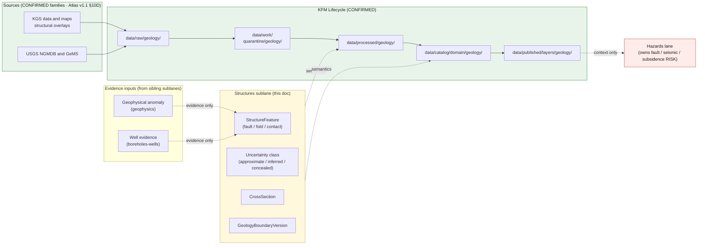

<!-- [KFM_META_BLOCK_V2]
doc_id: kfm://doc/geology-sublane-structures
title: Geology Sublane — Structures
type: standard
version: v1
status: draft
owners: <geology-domain-steward> (placeholder — verify against repo CODEOWNERS)
created: 2026-06-03
updated: 2026-06-03
policy_label: public
related:
  - docs/domains/geology/README.md                       # PROPOSED — verify presence
  - docs/domains/geology/sublanes/bedrock_geology.md      # PROPOSED sibling (structures ride on bedrock maps)
  - docs/domains/geology/sublanes/stratigraphy.md         # PROPOSED sibling (offsets cut intervals)
  - docs/domains/geology/sublanes/geophysics.md           # PROPOSED sibling (anomaly ≠ mapped structure)
  - docs/domains/geology/sublanes/boreholes-wells.md      # PROPOSED sibling (well evidence for structure)
  - docs/domains/hazards/                                 # cross-lane: fault / subsidence / seismicity RISK
  - docs/domains/hydrology/                               # cross-lane: structural control on aquifers
  - schemas/contracts/v1/domains/geology/                 # PROPOSED schema home (ADR-0001 default)
  - contracts/domains/geology/                            # PROPOSED semantic contract home
  - policy/domains/geology/                                # PROPOSED policy home
  - data/published/layers/geology/                        # PROPOSED layer outputs
  - ai-build-operating-contract.md                        # canonical operating contract
  - directory-rules.md                                    # §12 Domain Placement Law, §5 Canonical Root Tree
  - docs/registers/DRIFT_REGISTER.md                      # naming-convention + sublane-folder routing
tags: [kfm, geology, structures, faults, folds, contacts, sublane]
notes:
  - "CONTRACT_VERSION = 3.0.0 pinned per ai-build-operating-contract.md."
  - "PUBLIC-SAFE LANE. Structural features (faults, folds, contacts) on geologic maps are generally public; no exact-location sensitivity like boreholes/geochemistry/geophysics. policy_label public; T0/T1 posture similar to bedrock_geology.md / stratigraphy.md."
  - "OBJECT NAME: this lane owns 'StructureFeature' (Atlas §10C/E canonical). The form 'FaultStructure' used in some earlier drafts is DRIFT and is corrected to StructureFeature here. Routed to DRIFT_REGISTER."
  - "DEFINING DISCIPLINES: (1) structure is geologic CONTEXT, not risk — Hazards owns fault/landslide/subsidence/seismicity risk (Atlas §10F); (2) faults carry uncertainty classes (approximate / inferred / concealed) that must render honestly; (3) a geophysical anomaly is NOT a mapped StructureFeature (receiving end of the geophysics anti-collapse rule)."
  - "Filename uses bare form (structures.md). Sibling files diverge on hyphen vs underscore vs bare; routed to DRIFT_REGISTER (OQ-GEOL-STRUCT-06)."
  - "The docs/domains/<domain>/sublanes/<sublane>.md path is PROPOSED; Directory Rules §12 does not enumerate a sublanes/ subfolder. Resolve via ADR."
  - "Owners, CI badge URLs, route names, and exact related-doc paths are placeholders pending mounted-repo verification."
[/KFM_META_BLOCK_V2] -->

# ⛰️ Geology Sublane — Structures

> Governance, semantics, and publication posture for **structural geology** inside the KFM Geology / Natural Resources domain lane: faults, folds, and contacts carried as `StructureFeature`. Structures are **geologic context, not risk** — KFM maps where a fault is interpreted to be and how certain that interpretation is; the Hazards lane owns whether it poses a seismic, landslide, or subsidence risk.

[](#)
[](#)
[](#)
[](#)
[](#)
[](#)
[](#)
[](#)

**Status:** draft · **Owners:** `<geology-domain-steward>` *(placeholder)* · **Contract:** `CONTRACT_VERSION = "3.0.0"` · **Last updated:** 2026-06-03

> [!IMPORTANT]
> **Sublane folder is PROPOSED.** Directory Rules **§12 (Domain Placement Law)** establishes the lane pattern and shows `docs/domains/<domain>/` as a directory, but it does **not** enumerate a `sublanes/` subfolder. The path used here — `docs/domains/geology/sublanes/structures.md` — should be confirmed by an ADR or migrated to a flat-prefix scheme (e.g. `docs/domains/geology/SUBLANE-STRUCTURES.md`) before the structure is treated as canonical. See [§13 — Open Questions](#13--open-questions).

> [!CAUTION]
> **Structure is context, not risk.** The defining boundary of this sublane: a `StructureFeature` (a mapped fault, fold, or contact) is **geologic context**. Whether it implies an earthquake hazard, a landslide risk, or subsidence is owned by the **Hazards** lane (Atlas §10F). This sublane MUST NOT emit risk claims, hazard ratings, or life-safety messaging. See [§11](#11--anti-collapse-and-publication-posture).

> [!NOTE]
> **Object-name note.** This lane owns **`StructureFeature`** (Atlas §10C/E canonical). The form `FaultStructure` that appeared in some earlier drafts is **drift** and is corrected to `StructureFeature` here; routed to `docs/registers/DRIFT_REGISTER.md`.

---

## Mini-TOC

- [1 · Scope](#1--scope)
- [2 · Repo Fit](#2--repo-fit)
- [3 · Inputs](#3--inputs)
- [4 · Exclusions](#4--exclusions)
- [5 · Sublane Map (Mermaid)](#5--sublane-map-mermaid)
- [6 · Object Families & Ubiquitous Language](#6--object-families--ubiquitous-language)
- [7 · Source Families & Source Roles](#7--source-families--source-roles)
- [8 · Spatial & Temporal Model](#8--spatial--temporal-model)
- [9 · Map & Viewing Products](#9--map--viewing-products)
- [10 · Pipeline Shape (RAW → PUBLISHED)](#10--pipeline-shape-raw--published)
- [11 · Anti-Collapse and Publication Posture](#11--anti-collapse-and-publication-posture)
- [12 · Cross-Lane Relations](#12--cross-lane-relations)
- [13 · Open Questions](#13--open-questions)
- [Companion sections](#open-questions-register)
- [Related Docs](#related-docs)

---

## 1 · Scope

**CONFIRMED doctrine / PROPOSED sublane scope.** The structures sublane governs the **structural fabric** of the Geology / Natural Resources lane:

- **`StructureFeature`** — faults, folds, and contacts as mapped structural features (e.g., the Humboldt Fault Zone in eastern Kansas).
- **Structure geometry** — fault traces, fold axes, and contact lines, with **uncertainty classes** (approximate / inferred / concealed).
- **`CrossSection`** — interpretive sections expressing structural relationships at depth.
- **`GeologyBoundaryVersion`** — interpretation version and uncertainty for a structural map (a re-mapped fault trace is a new version, not an overwrite).
- Public-safe **structure / fault views**.

Doctrine basis: the Geology lane explicitly owns **structures** (Atlas §10A–B), pairs **lines for structures/cross-sections** (ENCY §7.8D), and lists "structure/fault view" among domain viewing products (§10G).

> [!NOTE]
> A `StructureFeature` is **an interpretation carried by a source map at a scale**, not a verified subsurface geometry. Re-mapping the same fault produces a new `GeologyBoundaryVersion`, and the uncertainty class (approximate / inferred / concealed) is part of the feature's meaning, not decoration.

[Back to top ↑](#-geology-sublane--structures)

---

## 2 · Repo Fit

**PROPOSED placement.** This file lives under the Geology lane segment of the `docs/` responsibility root.

```text
docs/
└── domains/
    └── geology/
        ├── README.md                   # PROPOSED — domain landing
        └── sublanes/                   # PROPOSED — see §13 Open Questions
            ├── bedrock_geology.md      # PROPOSED sibling (structures ride on bedrock maps)
            ├── surficial_geology.md    # PROPOSED sibling
            ├── stratigraphy.md         # PROPOSED sibling (offsets cut intervals)
            ├── structures.md           # <— THIS FILE
            ├── boreholes-wells.md      # PROPOSED sibling (well evidence for structure)
            ├── geophysics.md           # PROPOSED sibling (anomaly ≠ mapped structure)
            ├── geochemistry.md         # PROPOSED sibling
            └── resources.md            # PROPOSED sibling (pointer → natural_resources.md)
```

**Directory Rules basis (CONFIRMED against `directory-rules.md`):**

- **§12 Domain Placement Law** — geology is a **lane segment** inside responsibility roots, never a root folder. The `sublanes/` child extends the §12 lane pattern and is **not yet enumerated** there.
- **§5 Canonical Root Tree** — `docs/` is the human-facing control-plane root.
- **§4 Placement Protocol (Step 3)** — domain is a segment inside a responsibility root, named in the PR.
- **§13.1 / ADR-0001** — `schemas/contracts/v1/...` is the canonical schema home; `contracts/` retains semantic Markdown only.

**Upstream (doctrine that governs this file):**

- `directory-rules.md` — §12 Domain Placement Law, §5 Canonical Root Tree, §4 Placement Protocol (CONFIRMED).
- `ai-build-operating-contract.md` — canonical operating contract, `CONTRACT_VERSION = "3.0.0"` (CONFIRMED).
- `docs/domains/geology/README.md` — Geology lane charter (PROPOSED; verify presence).
- Atlas v1.1 Ch. 10 §10A–C/E/F — Geology scope, object families, cross-lane relations (CONFIRMED doctrine).
- `kfm_encyclopedia.pdf` §7.8 — Geology and Natural Resources (CONFIRMED doctrine).

**Downstream (artifacts that consume this sublane's semantics):**

- `contracts/domains/geology/` — semantic Markdown contract for `StructureFeature`, `CrossSection`. **(PROPOSED home)**
- `schemas/contracts/v1/domains/geology/` — JSON Schemas per ADR-0001 default. **(PROPOSED home)**
- `policy/domains/geology/` — admissibility and release rules. **(PROPOSED home)**
- `tests/domains/geology/` and `fixtures/domains/geology/` — uncertainty-class and structure-vs-risk fixtures. **(PROPOSED home)**
- `data/published/layers/geology/` — released structure / fault line layers. **(PROPOSED home)**

[Back to top ↑](#-geology-sublane--structures)

---

## 3 · Inputs

Material that **belongs** in or is referenced by this sublane:

- **Structural overlays** on KGS / USGS geologic maps — fault traces, fold axes, contacts (e.g., Humboldt Fault Zone, Nemaha Ridge structures).
- **Uncertainty classification** for each structure line (approximate / inferred / concealed).
- **Cross-section interpretations** expressing structural relationships.
- **Map metadata** — series, vintage, scale, attribution, license, interpretation version.
- **Well / geophysics evidence** *referenced* in support of a mapped structure (location handling stays in those sublanes).

> [!TIP]
> Inputs enter via the standard **`SourceDescriptor` → source-activation decision** path. A structural map source is not implicitly active; it requires a recorded source role, license review, attribution, and a recorded activation decision before connectors emit to `data/raw/geology/`. *(`SourceActivationDecision` as a named object is PROPOSED — verify against `contracts/`.)*

[Back to top ↑](#-geology-sublane--structures)

---

## 4 · Exclusions

Material that **does not** belong here, and where it goes instead:

| Out of scope for structures sublane | Lives in | Canonical object family |
|---|---|---|
| Bedrock map **unit polygons** | `docs/domains/geology/sublanes/bedrock_geology.md` *(PROPOSED)* | `GeologicUnit`, `Lithology` |
| Stratigraphic **nomenclature / correlation** | `docs/domains/geology/sublanes/stratigraphy.md` *(PROPOSED)* | `Stratigraphic Interval`, `StratigraphicCorrelation` |
| Geophysical surveys / anomalies | `docs/domains/geology/sublanes/geophysics.md` *(PROPOSED)* | *(geophysics object — verify; anomaly ≠ structure)* |
| Borehole / well-log **point records** | `docs/domains/geology/sublanes/boreholes-wells.md` *(PROPOSED)* | `BoreholeReference`, `Well LogReference` |
| **Fault / landslide / subsidence / seismicity RISK** | `docs/domains/hazards/` (Hazards lane) | — *(Hazards owns risk)* |
| Induced-seismicity attribution / regulation | `docs/domains/hazards/` + regulatory source role | — |
| Soil / surficial cover | `docs/domains/soil/`, `surficial_geology.md` | `SoilMapUnit`, `SurficialUnit` |
| Cross-cutting governance (`EvidenceBundle`, `RunReceipt`, `ReleaseManifest` semantics) | `contracts/evidence/`, `contracts/runtime/`, `contracts/release/` *(PROPOSED homes)* | — |

> [!WARNING]
> **Anti-collapse (the defining rules of this sublane).** (1) **Structure ≠ risk** — a mapped fault is geologic context; Hazards owns whether it is dangerous (Atlas §10F). (2) **Anomaly ≠ structure** — a geophysical anomaly is *evidence toward* a structure, not the mapped structure itself (the receiving end of the geophysics sublane's anti-collapse rule). (3) **Map ≠ verified subsurface** — a fault trace at map scale is not a verified geometry at depth without independent evidence.

[Back to top ↑](#-geology-sublane--structures)

---

## 5 · Sublane Map (Mermaid)

PROPOSED — illustrative; reflects doctrine relationships, not a verified runtime graph.



> [!NOTE]
> The lifecycle `RAW → WORK / QUARANTINE → PROCESSED → CATALOG / TRIPLET → PUBLISHED` is **CONFIRMED doctrine** (Directory Rules §0; Atlas v1.1 §1 Operating Law and §10H). The edge to Hazards is **context only**: structures supply the geologic feature; Hazards (highlighted) owns the risk evaluation.

[Back to top ↑](#-geology-sublane--structures)

---

## 6 · Object Families & Ubiquitous Language

CONFIRMED terms (Atlas v1.1 §10C/E; §2.2 spine); PROPOSED field realizations until the geology schema is mounted.

> [!CAUTION]
> **Casing and naming are load-bearing.** The Atlas prints **`StructureFeature`** (one word, §10C/E) for faults/folds/contacts. The form `FaultStructure` is **drift** and MUST NOT be used. `GeologyBoundaryVersion` and `CrossSection` carry their Atlas casing.

| Term | Structures meaning | Identity (PROPOSED) | Citation |
|---|---|---|---|
| **`StructureFeature`** | A mapped structural feature — fault trace, fold axis, or contact — carried by a specific source map at a scale. | `source_id + object_role + temporal_scope + normalized_digest` | Atlas §10C/E |
| **`CrossSection`** | An interpretive section expressing structural relationships at depth; carries its own evidence and interpretation version. | Same identity basis. | Atlas §10B/E; ENCY §7.8 |
| **`GeologyBoundaryVersion`** | Interpretation version and uncertainty for a structural map; a re-mapped trace is a new version, not an overwrite. | Same identity basis. | Atlas §10C/E |
| **Uncertainty class** *(qualifier)* | The mapped certainty of a structure line — approximate / inferred / concealed — part of the feature's meaning. | Bound to the `StructureFeature`. | INFERRED from §10E uncertainty handling; ENCY §7.8 |

> [!IMPORTANT]
> A `StructureFeature`'s identity is **bound to its source map series and vintage**, not to the fault as a settled subsurface fact. The uncertainty class travels with it: a concealed fault is a different claim from an exposed one, and the public layer must say which.

<details>
<summary><b>Geology lane object families not owned by this sublane</b></summary>

Listed for terminology fidelity (Atlas v1.1 §10C/E). This sublane references these but does not own them:

- `GeologicUnit`, `Lithology`, `SurficialUnit` — bedrock / surficial sublanes (units the structures cut).
- `Stratigraphic Interval`, `StratigraphicCorrelation` — stratigraphy sublane (intervals offset by faults).
- `BoreholeReference`, `Well LogReference` — boreholes-wells sublane (subsurface evidence for structure).
- `Geochemistry SampleReference`, geophysics observation — sample/anomaly evidence; **an anomaly is not a structure**.
- `Mineral Occurrence`, `Resource Deposit`, `ResourceEstimate`, `Extraction Site` — resources sublane.

</details>

[Back to top ↑](#-geology-sublane--structures)

---

## 7 · Source Families & Source Roles

CONFIRMED source families (Atlas v1.1 §10D). Structures are carried as overlays on the geologic-map side of the geology source ledger.

| Source family | Bedrock relevance | Source-role posture (CONFIRMED doctrine) | Citation |
|---|---|---|---|
| **KGS data and maps** | Structural overlays on Kansas geologic maps (e.g., Humboldt Fault Zone, Nemaha Ridge). | authority / observation / context / model **as source role requires**; rights & current terms **NEEDS VERIFICATION**; sensitive joins fail closed. | Atlas §10D |
| **USGS NGMDB and GeMS** | Federal geologic-map database / GeMS schema; structural features at compilation scale. | Same posture. | Atlas §10D |
| KGS LAS well logs / well tops | **Evidence input** for subsurface structure; location handling stays under boreholes-wells. | Same posture; evidence, not structural authority. | Atlas §10D |

> [!WARNING]
> **Source roles cannot be inferred from convenience.** A geophysical anomaly is evidence *toward* a structure, not the mapped structure. A well offset is evidence, not a remapped fault. Promotion of evidence into a mapped `StructureFeature` is a **governed state transition**, not a join. The Atlas posture is uniform: each source's role is "authority / observation / context / model **as source role requires**," and **sensitive joins fail closed**.

> [!CAUTION]
> **License / attribution gate (NEEDS VERIFICATION).** The Atlas marks KGS / USGS "rights and current terms" as **NEEDS VERIFICATION** (§10D). Structure layers MUST fail release when license, source series, or attribution is missing. *(Specific named Kansas structures such as the Humboldt Fault Zone are CONFIRMED to appear in KGS source material; the **default authoritative structural map series and scale** for KFM is UNKNOWN — see OQ-GEOL-STRUCT-05.)*

[Back to top ↑](#-geology-sublane--structures)

---

## 8 · Spatial & Temporal Model

CONFIRMED doctrine (Atlas v1.1 §10B/E; ENCY §7.8D):

- **Geometry**
  - **Lines** for fault traces, fold axes, and contacts.
  - **`CrossSection`** as interpretive 2D sections; **3D surfaces** only when justified, with representation receipts.
- **Uncertainty** — every structure line carries a class: **approximate / inferred / concealed**. This is meaning, not styling.
- **Interpretation versioning** — every refit produces a new `GeologyBoundaryVersion`; prior versions are preserved in lineage, not overwritten.
- **Temporal handling** (Atlas v1.1 §10E — "source, observed, valid, retrieval, release, and correction times stay distinct where material"):

| Time facet | Structures meaning |
|---|---|
| `source_time` | Publication date of the source map. |
| `observed_time` | Field-mapping date when known. |
| `valid_time` | When the structural interpretation is considered current. |
| `retrieval_time` | When KFM pulled the source. |
| `release_time` | When KFM released the derivative. |
| `correction_time` | When a `CorrectionNotice` was applied (e.g., re-mapping a trace). |

> [!TIP]
> The **age of faulting** (when the structure formed, geologic time) and the **time-of-mapping / record** (when the data was made) are different axes. Carry both; never collapse the date of the map into the age of the deformation.

[Back to top ↑](#-geology-sublane--structures)

---

## 9 · Map & Viewing Products

PROPOSED sublane products (derived from Atlas v1.1 §10G "structure/fault view"; ENCY §7.8E):

| Product | Geometry | Purpose | Status |
|---|---|---|---|
| **Structure / fault view** | Line | Public-safe fault traces, fold axes, contacts with uncertainty classes and source vintage. | PROPOSED |
| **Uncertainty view** | Line (style overlay) | Visualize approximate / inferred / concealed classes distinctly. | PROPOSED |
| **Cross-section view** | Line + 2D section | Interpretive structural sections; carries representation receipt and evidence burden. | PROPOSED |
| **Interpretation-version diff** | Line (compare) | Compare two `GeologyBoundaryVersion` instances; flag changed traces. | PROPOSED |
| **Structure-on-bedrock overlay** | Line over polygon | Structures rendered over the bedrock unit map. | PROPOSED |

CONFIRMED cross-cutting view doctrine (Atlas §10G; MAP-MASTER; GAI): every product participates in **Evidence Drawer, time-aware state, trust badges, sensitivity-redacted view, correction/stale-state view, and governed Focus Mode**. Structure products MUST surface the **uncertainty-class badge** prominently.

> [!IMPORTANT]
> A structure / fault view must render **approximate / inferred / concealed** faults distinctly (e.g., dashed/dotted line styles). Rendering an inferred or concealed fault as a solid, certain line is a doctrine violation, not a presentation choice — and rendering any fault with a hazard implication crosses into the Hazards lane (see §11).

[Back to top ↑](#-geology-sublane--structures)

---

## 10 · Pipeline Shape (RAW → PUBLISHED)

CONFIRMED doctrine; PROPOSED sublane application. Promotion is a **governed state transition, not a file move** (Directory Rules §0; Atlas v1.1 §10H).

| Stage | Structures handling | Gate | Status |
|---|---|---|---|
| **RAW** | Capture KGS / USGS structural-map source payload (geometry as delivered + sidecar metadata) with source role, rights, sensitivity, citation, time, hash. | `SourceDescriptor` exists. | PROPOSED |
| **WORK / QUARANTINE** | Normalize CRS, line geometry, uncertainty-class vocabulary, identity, evidence, rights, policy. Hold failures (missing attribution, unclassified uncertainty, unknown structure type). | Validation + policy gate pass, or quarantine reason recorded. | PROPOSED |
| **PROCESSED** | Emit validated `StructureFeature` lines with uncertainty class, `CrossSection` candidates, and public-safe candidate geometry. Emit `EvidenceRef`, `ValidationReport`; close digest. | `EvidenceRef`, `ValidationReport`, digest closure exist. | PROPOSED |
| **CATALOG / TRIPLET** | Emit catalog records, `EvidenceBundle`s, graph/triplet projections (`StructureFeature` ↔ `GeologicUnit` ↔ `Stratigraphic Interval`), and release candidates. | Catalog / proof closure passes. | PROPOSED |
| **PUBLISHED** | Serve released public-safe structure / fault line layers (with uncertainty) through governed APIs and a `ReleaseManifest`. | `ReleaseManifest`, correction path, rollback target, review / policy state exist. | PROPOSED |

> [!CAUTION]
> **Watcher-as-non-publisher invariant.** A structures watcher that detects a structural-map update **MAY emit a candidate `PromotionDecision`**; it MUST NOT write to `data/processed/geology/` or `data/published/layers/geology/` directly. Promotion is reserved to the governed pipeline.

[Back to top ↑](#-geology-sublane--structures)

---

## 11 · Anti-Collapse and Publication Posture

CONFIRMED / PROPOSED (Atlas v1.1 §10F/I; operating contract §23.2; T0–T4 tier scheme §24.5):

- **Public-safe lane.** Structural features on geologic maps are generally **public-safe (T0 / T1)** — there is no exact-location sensitivity here as in boreholes-wells / geochemistry / geophysics. Public release is *permitted* provided rights, attribution, license, and source role are settled.
- **Structure ≠ risk (the defining rule).** A `StructureFeature` is geologic context; **Hazards owns fault / landslide / subsidence / induced-seismicity risk** (Atlas §10F, CONFIRMED). This sublane MUST NOT emit risk ratings, hazard classifications, or life-safety messaging — and KFM is never an alert authority.
- **Anomaly ≠ structure.** A geophysical anomaly is *evidence toward* a structure, not the mapped structure (Atlas §10I anti-collapse posture).
- **Uncertainty is meaning.** Approximate / inferred / concealed classes MUST render honestly; never flatten an inferred fault to a certain one.
- **Default-deny on missing release inputs.** Unclear rights, unresolved source role, missing evidence, or absent release state **blocks public promotion** (Atlas §1 Operating Law; Directory Rules — CONFIRMED).

| Object class | Default tier (PROPOSED, from §10I posture) | Allowed transform | Required gates |
|---|---|---|---|
| Structure / fault line (mapped) | **T0 / T1** | Generalization where source scale demands; uncertainty class preserved. | Standard release gates; uncertainty badge required. |
| Cross-section | **T0 / T1** | Generalization; representation receipt for 2.5D/3D. | Standard release gates; representation receipt where applicable. |
| Structure with potential hazard implication | **route to Hazards** | Emit as geologic context only; risk evaluation is the Hazards lane's. | Cross-lane handoff; no risk claim here. |

> [!IMPORTANT]
> **A fault on the map is not a hazard rating.** A user clicking a structure must see the **structural feature identity, its uncertainty class, and its `EvidenceBundle`** — never a risk score, a "this fault is dangerous" claim, or an alert. Per operating contract §23.2, when support is inadequate, the runtime **abstains** rather than asserting a structure or a risk.

[Back to top ↑](#-geology-sublane--structures)

---

## 12 · Cross-Lane Relations

CONFIRMED doctrine (Atlas v1.1 §10F). Each relation MUST preserve **ownership, source role, sensitivity, and `EvidenceBundle` support** — none are joins of convenience.

| This sublane | Related lane | Relation | Constraint |
|---|---|---|---|
| Structures | **Hazards** | `StructureFeature` → **fault / landslide / subsidence / seismicity** context | Structures provide context **only**; Hazards owns risk. KFM is never an alert authority. |
| Structures | **Bedrock** | Structures ride on / offset `GeologicUnit` polygons | Bedrock owns unit polygons; structures own the fault/fold/contact lines. |
| Structures | **Stratigraphy** | Faults offset `Stratigraphic Interval`s | Structures own the offset feature; stratigraphy owns the interval framework. |
| Structures | **Geophysics** | Geophysical anomaly → **evidence toward** a `StructureFeature` | Anomaly is evidence, not the mapped structure. |
| Structures | **Boreholes-Wells** | Well offsets / dips → **evidence** for subsurface structure | Evidence supports; location handling stays under boreholes-wells. |
| Structures | **Hydrology** | Structural control on aquifer compartmentalization | Structures supply geologic context; Hydrology owns measurements and aquifer extent. |

[Back to top ↑](#-geology-sublane--structures)

---

## 13 · Open Questions

| # | Question | Evidence that would settle it | Status |
|---|---|---|---|
| 1 | Is `docs/domains/<domain>/sublanes/<sublane>.md` an accepted layout, or should sublane docs use a flat-prefix scheme? | An ADR amending Directory Rules §12, or a mounted-repo precedent. | NEEDS VERIFICATION |
| 2 | Does the Geology lane carry semantic contracts under `contracts/domains/geology/` and machine schemas under `schemas/contracts/v1/domains/geology/` per ADR-0001? | Mounted-repo inspection; ADR-0001 status. | NEEDS VERIFICATION |
| 3 | What is the canonical **uncertainty-class vocabulary** for structures (approximate / inferred / concealed — plus any others)? | A vocabulary file under `control_plane/` or `schemas/`; source-map convention. | NEEDS VERIFICATION |
| 4 | How is the **structure → Hazards** handoff modeled so a structure never carries a risk claim in the geology lane? | Cross-lane contract; Hazards-lane intake spec. | PROPOSED |
| 5 | Which KGS / USGS structural map series is the **default** authority for Kansas structures, and at what scale? | A source-activation decision in `data/registry/sources/geology/`. | UNKNOWN |
| 6 | Do structural `CrossSection`s require an explicit **representation receipt** distinct from the source map's receipt? | An ADR or contract update on 2.5D/3D representation receipts. | PROPOSED |
| 7 | How are interpretation-version diffs (`GeologyBoundaryVersion`) for structures surfaced in the Evidence Drawer and correction notices? | UI / Evidence Drawer payload contract; correction-notice schema. | PROPOSED |
| 8 | Filename convention: hyphen vs underscore vs bare for sublane files? | Mounted-repo precedent or a docs-naming ADR. | NEEDS VERIFICATION |

[Back to top ↑](#-geology-sublane--structures)

---

## Open questions register

| ID | Question | Owner role | Resolution path |
|---|---|---|---|
| OQ-GEOL-STRUCT-01 | Accept `sublanes/` subfolder vs flat-prefix scheme under `docs/domains/geology/`. | docs steward + directory-rules owner | ADR amending Directory Rules §12; DRIFT_REGISTER entry. |
| OQ-GEOL-STRUCT-02 | Confirm geology contract/schema homes. | geology domain steward | Mounted-repo inspection + ADR-0001 check. |
| OQ-GEOL-STRUCT-03 | Canonical uncertainty-class vocabulary for structures. | geology domain steward | Vocabulary file under `control_plane/` or `schemas/`. |
| OQ-GEOL-STRUCT-04 | Structure → Hazards handoff contract (no risk claim in geology). | geology + hazards stewards | Cross-lane contract; Hazards intake spec. |
| OQ-GEOL-STRUCT-05 | Default authoritative structural map series + scale. | geology domain steward + source authority | Source-activation decision in `data/registry/sources/geology/`. |
| OQ-GEOL-STRUCT-06 | Sublane filename convention (hyphen / underscore / bare). | docs steward | Docs-naming ADR; DRIFT_REGISTER entry. |
| OQ-GEOL-STRUCT-07 | Reconcile `FaultStructure → StructureFeature` drift across all geology docs. | geology domain steward | DRIFT_REGISTER entry + sibling-doc sweep. |

## Open verification backlog

These items remain `NEEDS VERIFICATION` before promotion from `draft` to `published`:

1. Sublane folder layout (`sublanes/` vs flat prefix) — Directory Rules §12 silent.
2. Geology contract/schema homes against mounted repo and ADR-0001.
3. Canonical uncertainty-class vocabulary for structures.
4. Structure → Hazards handoff contract.
5. Default structural map series and scale (UNKNOWN).
6. Representation-receipt requirement for structural cross-sections.
7. Interpretation-version diff surfacing for structures.
8. Filename convention (hyphen / underscore / bare).

## Changelog v0 → v1

| Change | Type (per contract §37) | Reason |
|---|---|---|
| New sublane doc created at `docs/domains/geology/sublanes/structures.md` | new | First structures sublane doc. |
| Object family set to Atlas v1.1 §10C/E canonical `StructureFeature` (not `FaultStructure`) | new | Terminology fidelity; `FaultStructure` is drift. |
| Made structure-≠-risk the lane's defining boundary (Hazards owns risk) | new | Atlas §10F: geology contributes context, not risk. |
| Added uncertainty-class (approximate / inferred / concealed) as meaning, with render discipline | new | ENCY §7.8 / §10E uncertainty handling. |
| Added anomaly-≠-structure receiving-end of the geophysics anti-collapse rule | new | Cross-sublane consistency. |
| Public-safe T0/T1 posture (no exact-location sensitivity) | clarification | Distinguishes this lane from the restricted subsurface sublanes. |
| Added companion sections (Open Qs register, Verification backlog, Changelog, DoD) | new | Doctrine-doc companion pattern. |

> **Backward compatibility.** New file; no prior anchors to preserve. Anchors use GitHub auto-slug of the H1 "⛰️ Geology Sublane — Structures"; verify the leading-emoji slug renders as `#-geology-sublane--structures` on the target GitHub instance.

## Definition of done

This document is done enough to enter the repository when:

- it is placed according to Directory Rules (sublane-folder question OQ-GEOL-STRUCT-01 resolved);
- the filename convention is resolved (OQ-GEOL-STRUCT-06);
- a docs steward and the geology domain steward review it (and the Hazards steward signs off on the structure → risk boundary, OQ-GEOL-STRUCT-04);
- it is linked from the Geology lane `README.md` / doctrine index;
- it does not conflict with accepted ADRs (ADR-0001 schema home; any sublane-folder ADR; geology object-family ADR);
- the uncertainty-class vocabulary and structure → Hazards handoff are pinned (OQ-GEOL-STRUCT-03 / -04);
- the `FaultStructure → StructureFeature` drift is logged and swept (OQ-GEOL-STRUCT-07);
- naming and folder questions are logged in `docs/registers/DRIFT_REGISTER.md`;
- the `GENERATED_RECEIPT.json` planned at authoring time is wired into CI;
- future changes follow the operating contract §37 lifecycle.

---

## Related Docs

PROPOSED — verify each path against the mounted repo before linking.

- `docs/domains/geology/README.md` — Geology lane charter.
- `docs/domains/geology/sublanes/bedrock_geology.md` — Sibling sublane (structures ride on bedrock maps).
- `docs/domains/geology/sublanes/stratigraphy.md` — Sibling sublane (faults offset intervals).
- `docs/domains/geology/sublanes/geophysics.md` — Sibling sublane (anomaly ≠ mapped structure).
- `docs/domains/geology/sublanes/boreholes-wells.md` — Sibling sublane (well evidence for structure).
- `docs/domains/hazards/` — Cross-lane (**owns** fault / landslide / subsidence / seismicity risk).
- `docs/domains/hydrology/` — Cross-lane (structural control on aquifers).
- `directory-rules.md` §12 — Domain Placement Law; §5 Canonical Root Tree; §4 Placement Protocol.
- `ai-build-operating-contract.md` — canonical operating contract (`CONTRACT_VERSION = "3.0.0"`).
- Atlas v1.1 Ch. 10 §10A–C/E/F — Geology scope, object families, cross-lane relations.
- `kfm_encyclopedia.pdf` §7.8 — Geology and Natural Resources.
- `docs/registers/DRIFT_REGISTER.md` — naming-convention + `StructureFeature` drift routing.

---

<details>
<summary><b>Appendix A · Structures review checklist (PROPOSED reviewer aid)</b></summary>

A non-normative checklist for PRs that touch structures artifacts. Promote to `docs/runbooks/geology/STRUCTURES_REVIEW.md` if it survives use.

- [ ] **Source activation** — `SourceDescriptor` exists; activation decision records role, rights, license, attribution.
- [ ] **Source role** — structural-map source declared as map authority; anomalies/well evidence treated as evidence, not structure authority.
- [ ] **Object name** — `StructureFeature` (not `FaultStructure`).
- [ ] **Schema home** — JSON Schema under `schemas/contracts/v1/domains/geology/...` (ADR-0001 default).
- [ ] **Identity** — `StructureFeature` identity binds `source_id + object_role + temporal_scope + normalized_digest`.
- [ ] **Uncertainty class** — every structure line carries approximate / inferred / concealed; rendered distinctly.
- [ ] **Structure ≠ risk** — no risk rating, hazard class, or life-safety message; routed to Hazards.
- [ ] **Anomaly ≠ structure** — no geophysical anomaly promoted directly to a mapped fault.
- [ ] **Interpretation versioning** — re-mapped trace is a new `GeologyBoundaryVersion`; prior preserved.
- [ ] **Cross-section** — representation receipt where 2.5D/3D.
- [ ] **Evidence closure** — `EvidenceRef` resolves to a populated `EvidenceBundle`.
- [ ] **Cross-lane** — Hazards / bedrock / stratigraphy / geophysics joins preserve ownership, source role, and `EvidenceBundle` support.

</details>

<details>
<summary><b>Appendix B · Anti-pattern register (illustrative)</b></summary>

| Anti-pattern | Symptom | Fix |
|---|---|---|
| **Structure-as-risk** | A fault layer carries a "danger" rating or hazard class. | Strip risk content; emit geologic context only; route risk to the Hazards lane. |
| **Anomaly-as-structure** | A geophysical anomaly is rendered as a mapped fault. | Keep it as **evidence** toward a `StructureFeature`; mapped-structure authority is here, with evidence. |
| **Certain-by-default** | An inferred or concealed fault is drawn as a solid, certain line. | Render approximate / inferred / concealed distinctly; carry the class as meaning. |
| **FaultStructure drift** | A doc or schema uses `FaultStructure`. | Use `StructureFeature` per Atlas §10C/E; log in DRIFT_REGISTER. |
| **Map-as-subsurface** | A map-scale trace is treated as verified geometry at depth. | Restate as a *mapped* feature at source scale; require independent evidence for depth claims. |
| **Silent re-map** | A new release overwrites a fault trace without a new `GeologyBoundaryVersion`. | Treat every refit as a new version; preserve prior; emit `CorrectionNotice` if it changes a published artifact. |
| **Watcher publishes** | A structures watcher writes to `data/processed/geology/` or `data/published/layers/geology/`. | Watcher emits candidate `PromotionDecision` only; promotion is governed. |

</details>

---

**Last updated:** 2026-06-03 · **Doc status:** draft (v1) · **Authority:** doctrine CONFIRMED / paths PROPOSED · **Contract:** `CONTRACT_VERSION = "3.0.0"` · [Back to top ↑](#-geology-sublane--structures)
