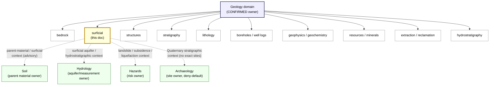
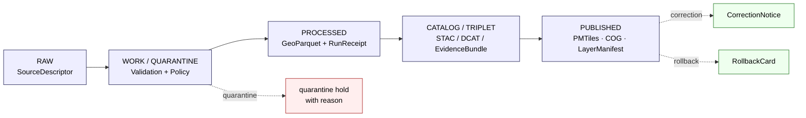

<!-- [KFM_META_BLOCK_V2]
doc_id: kfm://doc/geology-sublane-surficial
title: Geology · Surficial Sublane
type: standard
version: v0.2
status: draft
owners: <kfm-geology-stewards>   # placeholder — confirm against CODEOWNERS
created: 2026-05-17
updated: 2026-06-03
policy_label: public-with-gates
related: [ai-build-operating-contract.md, directory-rules.md, docs/domains/geology/README.md, docs/standards/PMTILES.md]
tags: [kfm]
notes: [doctrine-adjacent; CONTRACT_VERSION pinned to 3.0.0; sublanes/ segment is PROPOSED pending ADR]
[/KFM_META_BLOCK_V2] -->

# Geology · Surficial Sublane

> Governing doctrine for the **surficial** facet of the Kansas Frontier Matrix Geology domain — Quaternary and unconsolidated map units, their evidence, lifecycle, cross-lane relations, and public-safe release posture.


-brightgreen)


<!-- TODO: replace placeholder badge URLs once CI, owners, and registry IDs are confirmed against the mounted repo. -->

| Field        | Value |
|---           |---    |
| **Status**   | Draft — doctrine grounded, implementation claims PROPOSED |
| **Owners**   | `<kfm-geology-stewards>` *(placeholder — confirm against `CODEOWNERS`)* |
| **Updated**  | 2026-06-03 |
| **Scope**    | Surficial sublane of the Geology domain — Quaternary deposits, unconsolidated cover, surficial map units |
| **Parent**   | `docs/domains/geology/README.md` *(PROPOSED parent landing page — NEEDS VERIFICATION)* |
| **Contract** | Pinned `CONTRACT_VERSION = "3.0.0"` per `ai-build-operating-contract.md` |

---

## Contents

1. [Scope and boundary](#1-scope-and-boundary)
2. [Repo placement and the sublane segment](#2-repo-placement-and-the-sublane-segment)
3. [Ubiquitous language](#3-ubiquitous-language)
4. [Source families](#4-source-families)
5. [Object families owned in this sublane](#5-object-families-owned-in-this-sublane)
6. [Spatial and temporal model](#6-spatial-and-temporal-model)
7. [Pipeline shape — RAW → PUBLISHED](#7-pipeline-shape--raw--published)
8. [Map and viewing products](#8-map-and-viewing-products)
9. [Cross-lane relations](#9-cross-lane-relations)
10. [Sensitivity, rights, and publication posture](#10-sensitivity-rights-and-publication-posture)
11. [Publication, correction, and rollback](#11-publication-correction-and-rollback)
12. [Open questions register](#12-open-questions-register)
13. [Open verification backlog](#13-open-verification-backlog)
14. [Changelog](#14-changelog)
15. [Definition of done](#15-definition-of-done)
16. [Related docs](#16-related-docs)

---

## 1. Scope and boundary

> [!NOTE]
> The Geology domain **CONFIRMED owns** bedrock/surficial geology, stratigraphy, lithology, structures, geomorphology, boreholes, well logs, cores, geophysics, geochemistry, mineral/resource distinctions, extraction/reclamation context, public-safe layers, and bounded AI. This sublane governs the **surficial** facet only.

**This sublane owns the doctrinal handling of surficial map material within Geology**: the depiction, evidence support, lifecycle, and release of surficial map units (Quaternary alluvium, terrace deposits, eolian/loess cover, glacial materials where applicable, colluvium, residuum), the surficial-context fraction of `GeologyBoundaryVersion`, and the cross-lane bridges from surficial material into adjacent lanes.

**It explicitly does not own:**

- **Bedrock** unit truth, lithology of consolidated rock, or stratigraphic correlation below the surficial mantle — those belong to other Geology facets (PROPOSED sublane names: `bedrock`, `stratigraphy`, `structures`).
- **Soil** map units, components, horizons, or soil properties — Soil retains canonical authority. The Geology→Soil cross-lane is **parent material and surficial context** only (CONFIRMED doctrine).
- **Hydrology** measurements, regulatory flood zones, or aquifer water-level truth — Hydrology retains canonical authority. The Geology→Hydrology cross-lane is **hydrostratigraphy and aquifer context without replacing measurements** (CONFIRMED doctrine).
- **Hazards risk** (landslide, subsidence, liquefaction) — Hazards retains canonical risk authority. Surficial context informs but does not own risk (CONFIRMED doctrine).
- **Archaeology, ownership/lease/permit/title claims, and UI/AI statements** — these remain outside canonical Geology truth (CONFIRMED doctrine).

> [!IMPORTANT]
> **Anti-collapse principle (CONFIRMED doctrine).** Bedrock, surficial geology, stratigraphy, lithology, structures, geomorphology, boreholes, geophysics, geochemistry, mineral occurrences, extraction sites, and public-safe resource layers are kept **distinct** within Geology. A surficial polygon is not a soil mapunit; a Quaternary cover is not a bedrock unit; and neither is automatically a public truth claim. The *organizational decomposition* of Geology into named sublanes is a CONFIRMED corpus pattern; whether each becomes a literal directory is PROPOSED ([§2](#2-repo-placement-and-the-sublane-segment)).

[⬆ Back to top](#contents)

---

## 2. Repo placement and the sublane segment

> [!CAUTION]
> The path segment `docs/domains/<domain>/sublanes/<name>.md` is **PROPOSED**. `directory-rules.md` defines the `docs/domains/<domain>/` lane (§4 Step 3, §12 Domain Placement Law) but does **not** currently define a `sublanes/` segment. The flat alternative `docs/domains/geology/surficial.md` is permitted by the existing lane rule. Choose-and-freeze recommended via ADR; until then, this segment is **PROPOSED / NEEDS VERIFICATION** and is logged as `OQ-GEOL-SUR-01`.

The repo-placement basis for this file:

| Concern | Rule | Status |
|---|---|---|
| Domain lives as a **segment** inside a responsibility root, not as a root folder | `directory-rules.md` §3, §4 Step 3, §12 | CONFIRMED rule |
| Human-facing explanation goes under `docs/` | `directory-rules.md` §4 Step 1 placement table | CONFIRMED rule |
| Geology lane appears as `docs/domains/geology/...` | `directory-rules.md` §4 Step 3 (uniform domain pattern) | CONFIRMED rule |
| `sublanes/` as an intra-domain segment | Not defined in `directory-rules.md` | **PROPOSED** convention — ADR recommended |
| Co-lane homes for schemas, policy, fixtures, lifecycle data | `directory-rules.md` §4 Step 3 | CONFIRMED rule; per-sublane sub-segments are **PROPOSED** until ADR |
| New canonical sibling / compatibility root / divergent schema home requires an ADR | `directory-rules.md` §2.4 | CONFIRMED rule |

### 2.1 How this sublane fits the Geology lane



> [!NOTE]
> The sublane breakdown of Geology shown above (bedrock, surficial, structures, …) is **CONFIRMED as a corpus organizational pattern** for keeping Geology objects distinct (anti-collapse). Whether each appears as a literal `sublanes/<name>` directory or as a flat file under `docs/domains/geology/` is **PROPOSED** and remains an open ADR question. *See* [§12](#12-open-questions-register).

### 2.2 Co-lane companions (PROPOSED, pending ADR)

If the `sublanes/` convention is accepted, this sublane is expected to have parallel companions under the corresponding responsibility roots. **None of the following paths are claimed to exist in the current repo.**

```text
docs/domains/geology/sublanes/surficial.md                          ← this file
contracts/domains/geology/sublanes/surficial/                       ← PROPOSED
schemas/contracts/v1/domains/geology/sublanes/surficial/            ← PROPOSED (per ADR-0001 schema-home rule)
policy/domains/geology/sublanes/surficial/                          ← PROPOSED
tests/domains/geology/sublanes/surficial/                           ← PROPOSED
fixtures/domains/geology/sublanes/surficial/                        ← PROPOSED
pipelines/domains/geology/                                          ← PROPOSED (sublane segment optional)
pipeline_specs/geology/                                             ← PROPOSED
data/raw/geology/                                                   ← PROPOSED (lifecycle root)
data/published/layers/geology/surficial/                            ← PROPOSED
data/registry/sources/geology/                                      ← PROPOSED
release/candidates/geology/                                         ← PROPOSED
```

> [!WARNING]
> All paths above are **PROPOSED / NEEDS VERIFICATION** without mounted-repo inspection. Per `directory-rules.md` §4 Step 4–5 (Confirm authority; Cite the rule) and §2.4, creation of any new canonical sibling under `data/`, a new compatibility root, or any divergent schema/policy home requires an ADR. If the mounted repo later contradicts these proposals, open a `docs/registers/DRIFT_REGISTER.md` entry per §2.5 rather than silently conforming.

[⬆ Back to top](#contents)

---

## 3. Ubiquitous language

| Term | Status | Definition |
|---|---|---|
| **SurficialUnit** | CONFIRMED term / PROPOSED field realization | A delimited body of unconsolidated or semi-consolidated material at or near the land surface (alluvium, terrace, eolian, loess, colluvium, residuum, glacial where applicable). Meaning is constrained by source role, evidence, time, and release state. |
| **GeologyBoundaryVersion** | CONFIRMED term / PROPOSED field realization | A versioned snapshot of unit boundaries, including the surficial subset. Carries source authority, vintage, and digest. |
| **Lithology** *(of surficial cover)* | CONFIRMED term / PROPOSED field realization | The compositional character of a surficial body (sand, silt, clay, gravel, loess, organic) — referenced, not duplicated, when surficial units share a controlled lithology vocabulary. |
| **Hydrostratigraphic Unit** *(surficial fraction)* | CONFIRMED term / PROPOSED field realization | The surficial portion of a hydrostratigraphic frame (e.g., alluvial aquifer cover). Surfaces here are **advisory context** for Hydrology; Hydrology owns measurement truth. |
| **BoreholeReference** | CONFIRMED term / PROPOSED field realization | A reference to a borehole or well log used to constrain surficial thickness/contacts. Canonical ownership is the Geology boreholes facet, not this sublane. |
| **Surficial Map Unit (public-safe derivative)** | PROPOSED | A generalized, release-stage derivative of `SurficialUnit` suitable for public delivery (PMTiles/COG), with explicit generalization and rights provenance. |
| **Quaternary Context** | PROPOSED (definitional) | The temporal frame within which most surficial units fall. Tracked via `temporal_scope` on the object identity rule. Not a substitute for stratigraphic correlation truth. |

> [!NOTE]
> KFM-specific casing is preserved: `SurficialUnit`, `GeologyBoundaryVersion`, `Hydrostratigraphic Unit`, `BoreholeReference`. Do not silently rewrite to generic equivalents (`surficial_unit`, `boundaryVersion`, etc.) — these names are part of the project's ubiquitous language.

[⬆ Back to top](#contents)

---

## 4. Source families

Surficial mapping draws from a subset of the Geology domain's source families. The first three rows are CONFIRMED corpus citations for the Geology lane; the remainder are referenced where applicable to surficial workstreams. Rights, current terms, and freshness cadence are NEEDS VERIFICATION per source.

| Source family | Role *(per source-role registry)* | Surficial relevance | Rights / sensitivity | Freshness | Status |
|---|---|---|---|---|---|
| **Kansas Geological Survey data and maps** | authority / observation / context / model (per source role) | Primary Kansas surficial coverage | Sensitive joins fail closed; current terms NEEDS VERIFICATION | Source-vintage or cadence specific | CONFIRMED listed; rights NEEDS VERIFICATION |
| **KGS surficial geology and geologic maps** | authority / observation / context / model | Direct surficial unit mapping authority for Kansas | Sensitive joins fail closed; current terms NEEDS VERIFICATION | Source-vintage or cadence specific | CONFIRMED listed; rights NEEDS VERIFICATION |
| **USGS NGMDB and GeMS** | authority / observation / context / model | National geologic map database; GeMS schema for surficial map data interchange | Sensitive joins fail closed; current terms NEEDS VERIFICATION | Source-vintage or cadence specific | CONFIRMED listed; rights NEEDS VERIFICATION |
| **3DEP / terrain** | observation / context | Surficial unit delineation often draws on terrain derivatives (slope, curvature, relative relief) | Public-domain, but **EXTERNAL** lineage and STAC metadata gates apply | Source-vintage specific | INFERRED related; surficial use PROPOSED |
| **KGS/KDHE WWC5 and water-well program** | observation / context (adjacent) | Drillers' logs constrain surficial thickness/contacts | Sensitive joins fail closed | Source-vintage | CONFIRMED listed in Geology lane; surficial use PROPOSED |
| **Soil parent material** *(Soil lane)* | adjacent / advisory only | Soil parent-material attributes provide **adjacent** lineage; Geology does **not** consume Soil as truth | Per Soil lane sensitivity rules | Per Soil cadence | Adjacent — Soil owns |

> [!IMPORTANT]
> Each source carries a **source role** (authority, observation, context, model) that gates how derived claims may be presented. A KGS surficial map can be cited as **authority** for its mapped extent; a terrain-derivative classification is at best **model** output and must be labeled as such.

[⬆ Back to top](#contents)

---

## 5. Object families owned in this sublane

Object identity in KFM follows the **PROPOSED deterministic basis**: `source id + object role + temporal scope + normalized digest`. **CONFIRMED temporal handling** requires source, observed, valid, retrieval, release, and correction times to remain distinct where material.

| Object | Owner | Surficial relevance | Identity rule | Temporal handling |
|---|---|---|---|---|
| **SurficialUnit** | This sublane | Primary unit — owns the surficial map unit lifecycle | PROPOSED deterministic basis | CONFIRMED distinct temporal fields |
| **GeologyBoundaryVersion** *(surficial fraction)* | Geology domain (shared) | Boundary version snapshot scoped to surficial polygons | PROPOSED deterministic basis | CONFIRMED distinct temporal fields |
| **Lithology** *(surficial reference)* | Geology domain (shared) | Compositional reference for surficial bodies | PROPOSED deterministic basis | CONFIRMED distinct temporal fields |
| **HydrostratigraphicUnit** *(surficial portion only)* | Geology domain (shared) | Surficial cap of a hydrostratigraphic frame; advisory to Hydrology | PROPOSED deterministic basis | CONFIRMED distinct temporal fields |
| **BoreholeReference** *(surficial intersection)* | Geology domain (boreholes facet) | **Referenced**, not owned here — surficial thickness/contacts derived from logs | PROPOSED deterministic basis | CONFIRMED distinct temporal fields |

> [!NOTE]
> Cross-sublane references must resolve through **`EvidenceRef → EvidenceBundle`**, not via direct database joins. A surficial polygon's claim that "alluvial cover thickness here is ~6 m" is supported by a bundled set of borehole references (with role = observation), terrain context (role = model), and source map (role = authority). `EvidenceBundle` outranks generated language, renderer state, and tile content (CONFIRMED doctrine).

[⬆ Back to top](#contents)

---

## 6. Spatial and temporal model

**Geometry (CONFIRMED doctrine, applied):** polygons for surficial units; lines for surficial contacts when delivered separately; points only when a surficial sample is the object (rare — usually a `BoreholeReference` instead); rasters only for terrain-derivative companions, not as a substitute for mapped polygons.

**Generalization rule (CONFIRMED source evidence; implementation PROPOSED):** delivery to public clients passes through topology-aware simplification (Mapshaper / TopoJSON-style shared-arc) before tiling, to preserve shared boundaries and avoid shared-boundary cracks. Public PMTiles for surficial layers MUST descend from a canonical processed GeoParquet, not from raw source downloads. *See* [`docs/standards/PMTILES.md`](../../../standards/PMTILES.md).

**Temporal model:**

- **Geologic time** — Quaternary frame is the typical scope; capture as part of `temporal_scope` on identity, not as a substitute for stratigraphic correlation.
- **Source vintage** — every release carries the source map's publication and digital release date.
- **System time** — observed, valid, retrieval, release, and correction times remain distinct (CONFIRMED doctrine).
- **Interpretation version** — track interpretation revisions explicitly when a surficial polygon is re-delineated.

<details>
<summary><strong>Geometry-and-precision quick reference</strong> (illustrative)</summary>

| Use | Geometry | Public-precision posture | Note |
|---|---|---|---|
| Polygon unit map | Polygon | Generalized for public PMTiles | Topology-aware simplification required before tile build |
| Unit boundary contact | LineString | Generalized | Boundary line digest tied to the polygon |
| Borehole-derived thickness point | Point | **Referenced**, not the canonical object | Borehole facet is canonical |
| Terrain derivative (slope, relief) | Raster (COG) | Public-safe with COG profile + STAC | Treat as **model** role; never as observation |
| 3D subsurface volume | Volume / voxel | Conditional only; reality-boundary controls apply | Per `MAP-MASTER` 2D-default doctrine |

*Illustrative; not a schema declaration.*

</details>

[⬆ Back to top](#contents)

---

## 7. Pipeline shape — RAW → PUBLISHED

**CONFIRMED doctrine / PROPOSED sublane application:** the surficial sublane follows the same lifecycle as the Geology domain and all other KFM domains. Promotion is a **governed state transition**, not a file move.

| Stage | Handling | Gate | Status |
|---|---|---|---|
| **RAW** | Capture immutable source payload or reference with source role, rights, sensitivity, citation, time, and hash. | `SourceDescriptor` exists | PROPOSED |
| **WORK / QUARANTINE** | Normalize schema, geometry, time, identity, evidence, rights, and policy; hold failures. | Validation and policy gate pass, or quarantine reason recorded | PROPOSED |
| **PROCESSED** | Emit validated normalized objects, receipts, and public-safe candidates (e.g., canonical GeoParquet of surficial polygons). | `EvidenceRef`, `ValidationReport`, and digest closure exist | PROPOSED |
| **CATALOG / TRIPLET** | Emit catalog records (STAC/DCAT), `EvidenceBundle`s, graph/triplet projections, and release candidates. | Catalog/proof closure passes | PROPOSED |
| **PUBLISHED** | Serve released public-safe artifacts (PMTiles, COG, generalized GeoJSON) through governed APIs and manifests. | `ReleaseManifest`, correction path, rollback target, review/policy state exist | PROPOSED |



> [!WARNING]
> **Watcher-as-non-publisher (CONFIRMED invariant).** A watcher or connector for KGS, NGMDB, or any surficial source emits to `data/raw/` or `data/quarantine/` only. It does **not** write to `data/processed/`, `data/catalog/`, `data/published/`, or `release/`. Promotion is a governed decision (`PolicyDecision → PromotionDecision → ReleaseManifest`), not a side-effect of a fetch.

[⬆ Back to top](#contents)

---

## 8. Map and viewing products

**PROPOSED domain viewing products (Geology lane corpus):** bedrock unit map; **surficial unit map**; structure/fault view; stratigraphy/correlation view; borehole public-generalized view; mineral occurrence/deposit summary; extraction/reclamation context.

**This sublane's primary product:** the **surficial unit map**, delivered as:

- A canonical processed **GeoParquet** as vector truth (CONFIRMED source evidence: "store GeoParquet as the single source of truth and derive Tippecanoe/PMTiles from it").
- A public **PMTiles** layer derived from the GeoParquet (per `docs/standards/PMTILES.md` and the MapLibre delivery doctrine; **KGS M-118** is a CONFIRMED candidate source for a topology-safe serverless PMTiles surficial layer).
- Optional **COG** companions for terrain derivatives (slope, hillshade, relief) when those support unit interpretation.
- A **LayerManifest** linking the layer to its catalog source (STAC/DCAT) and render hints; tiler version, flags, zoom range, and input digest are recorded in the bound `TileArtifactManifest`.

**CONFIRMED doctrine cross-cutting viewing products** apply uniformly: Evidence Drawer, time-aware state, trust badges, sensitivity-redacted view, correction / stale-state view, and governed Focus Mode.

> [!IMPORTANT]
> **No popup as Evidence Drawer substitute.** A click on a surficial polygon must resolve through the governed API to an `EvidenceBundle`, not surface a free-text popup standing in for cited evidence. The popup may summarize and link; the claim resolves in the Drawer.

[⬆ Back to top](#contents)

---

## 9. Cross-lane relations

| This sublane | Related lane | Relation type | Constraint | Status |
|---|---|---|---|---|
| Surficial | **Soil** | Soil consumes surficial as **parent material / surficial context** (advisory; not regulatory or aggregate). Soil owns mapunit/horizon truth. | Preserve ownership, source role, sensitivity, and `EvidenceBundle` support | CONFIRMED doctrine |
| Surficial | **Hydrology** | Surficial unit and lithology provide **hydrostratigraphy / aquifer context** (advisory); Hydrology owns measurements and regulatory hydrology. | Preserve ownership, source role, sensitivity, and `EvidenceBundle` support | CONFIRMED doctrine |
| Surficial | **Hazards** | Surficial geology provides **landslide / subsidence / liquefaction context**; Hazards owns risk classification. | Preserve ownership, source role, sensitivity, and `EvidenceBundle` support | CONFIRMED doctrine |
| Surficial | **Archaeology** | Quaternary stratigraphic context may bound interpretation; Archaeology owns sites and applies **deny-by-default for exact locations**. | Preserve ownership, source role, sensitivity, and `EvidenceBundle` support; never expose archaeological coordinates as a side-effect of surficial detail | CONFIRMED doctrine (sensitivity); join PROPOSED |
| Surficial | **Spatial Foundation** | Receives CRS, scale, geometry, and layer/representation grammar from Spatial Foundation. | Renderer / Focus surfaces stay downstream of released evidence | CONFIRMED doctrine |
| Surficial | **People / Land** | Lease, parcel, operator relations **cannot prove deposits**; relation is advisory only. | Preserve ownership, source role, sensitivity, and `EvidenceBundle` support | CONFIRMED doctrine |

> [!NOTE]
> Each cross-lane edge is governed by both lanes simultaneously. A surficial-to-Hydrology link must satisfy this sublane's evidence rules **and** the Hydrology lane's measurement-authority and source-role rules. When in doubt, both lanes get a vote. Atlas v1.0's per-domain cross-lane section remains authoritative for the full edge list; where it conflicts with this table, v1.0 governs and the conflict is filed to `docs/registers/DRIFT_REGISTER.md`.

[⬆ Back to top](#contents)

---

## 10. Sensitivity, rights, and publication posture

**Default posture:** surficial geology is **broadly public-suitable** when sources are properly cited, generalization is recorded, and rights are confirmed. The corpus tier reference defaults `GeologicUnit / Lithology` to **T0** (open). This sublane is far less sensitive than archaeology, fauna sensitive occurrences, or living-person data — but it is **not** unconditionally public, and its public-facing tile derivatives still pass through generalization.

| Concern | Posture | Tier | Basis |
|---|---|---|---|
| Surficial unit / lithology baseline | Public-safe, no transform required | **T0** | CONFIRMED corpus tier reference (Atlas §24.5 / §24.14) |
| Public tile derivative of surficial polygons | Public-safe **after** topology-aware generalization; transform recorded | **T0 → T1 on generalization** | CONFIRMED generalization doctrine; recorded transform |
| Source rights and licensing for KGS / USGS / NGMDB inputs | Each source's current terms NEEDS VERIFICATION; default deny on rights ambiguity | — | CONFIRMED corpus rule (Rights and License Verification Gate) |
| Joins to **extraction sites** or **active mining/leasing** | Restrict; coordinate with the Resources/Reclamation facets; advisory only. Mineral/resource **detail** can rise to T2 in sensitive contexts | T0 aggregate / **T2** detail | CONFIRMED corpus rule (anti-collapse for resource layers; Atlas §24.14) |
| Joins to **archaeology** via surficial stratigraphy | **Deny-by-default** for exact archaeological coordinates regardless of surficial precision | **T4** | CONFIRMED (`KFM-P1-IDEA-0031`, Deny-by-Default for Sensitive Exact Locations) |
| Joins to **infrastructure** via surficial substrate | Critical-asset detail is restricted; surficial coverage itself is public-safe | **T4** detail | CONFIRMED (Settlements/Infrastructure deny-default for critical-asset detail) |
| Joins to **person / parcel** identifiers | Living-person and person-parcel joins fail closed | **T4** | CONFIRMED (People/Land deny-default) |
| **Generalization** for public tiles | Topology-aware simplification with a recorded transform receipt; never style-only hiding of sensitive geometry | — | CONFIRMED doctrine ("No sensitive geometry hidden only by style filters") |
| **Vintage / freshness** marking | Required on every released layer; stale-state view available | — | CONFIRMED cross-cutting doctrine |

> [!WARNING]
> **Cite-or-abstain.** A surficial claim that is not supported by a resolvable `EvidenceBundle` does not become a public truth. The governed API returns `ABSTAIN` rather than fluent prose when an `EvidenceRef` fails to resolve.

[⬆ Back to top](#contents)

---

## 11. Publication, correction, and rollback

Surficial publication requires the full release object set (CONFIRMED doctrine, applied):

- **SourceDescriptor** for every input source family used (KGS, NGMDB, etc.).
- **EvidenceBundle** resolving each public claim (unit identity, mapped extent, vintage).
- **ValidationReport** covering schema, geometry validity, topology, CRS, temporal scope, and policy gates.
- **RunReceipt(s)** capturing the deterministic build of GeoParquet → PMTiles / COG.
- **PolicyDecision** and **PromotionDecision** documenting governed state transitions.
- **ReleaseManifest** binding all of the above to a release id, with `spec_hash` reproducibility.
- **LayerManifest** binding the released MapLibre layer to its catalog source and render hints.
- **CorrectionNotice** template and **RollbackCard** prepared **before** release, not afterward.

> [!IMPORTANT]
> **No release without a rehearsed rollback.** A release plan that lacks a runnable `RollbackCard` is not a release; it is an unreviewed publication path. The Corrections lane provides the public-facing notice channel when a release later proves incorrect.

[⬆ Back to top](#contents)

---

## 12. Open questions register

| ID | Question | Owner role | Resolution path |
|---|---|---|---|
| OQ-GEOL-SUR-01 | `docs/domains/geology/sublanes/<name>.md` segment vs flat `docs/domains/geology/<name>.md`? | Docs steward + architecture | ADR in `docs/adr/`; drift entry if existing files conflict |
| OQ-GEOL-SUR-02 | Does `docs/domains/geology/README.md` exist or stand in as the Geology lane landing? | Docs steward | Mounted-repo `ls` of `docs/domains/geology/` |
| OQ-GEOL-SUR-03 | What is the canonical `SurficialUnit` schema home and contract path? | Schema steward | Inspection of `schemas/contracts/v1/domains/geology/` and `contracts/domains/geology/` per ADR-0001 |
| OQ-GEOL-SUR-04 | Where do generalization receipts live — `data/receipts/` vs `data/proofs/`? | Release steward | ADR resolution of the receipts/proofs split; mounted-repo inspection |
| OQ-GEOL-SUR-05 | Which canonical policy IDs govern surficial deny-default joins? (`KFM-P1-IDEA-0031` is the verified corpus card; `KFM-IDX-POL-001/002` are unverified.) | Policy steward | `policy/sensitivity/` inspection + ADR/register reconciliation |

[⬆ Back to top](#contents)

---

## 13. Open verification backlog

These items remain `NEEDS VERIFICATION` before promotion from `draft` to `published`:

1. Confirm the `docs/domains/geology/` lane landing page (`README.md`) via mounted-repo `ls`.
2. Confirm the `SurficialUnit` schema home and contract path against `schemas/contracts/v1/domains/geology/` per ADR-0001.
3. Confirm KGS surficial source current rights, vintage, and connector status (`data/registry/sources/geology/`, `SourceDescriptor`, live source terms).
4. Confirm the USGS NGMDB / GeMS schema crosswalk against a mounted GeMS fixture and `ValidationReport`.
5. Confirm the **KGS M-118** ingestion path → GeoParquet → PMTiles (`pipeline_specs/` / `pipelines/` / fixtures; PMTiles digest receipt).
6. Confirm generalization transform parameters and topology-aware tooling choice (Mapshaper / TopoJSON params; transform receipts).
7. Confirm the surficial `LayerManifest` binding pattern in `apps/explorer-web/` + layer registry.
8. Confirm CI/test coverage for a surficial fixture (valid + invalid + topology) in `tests/domains/geology/` + CI logs.
9. Confirm the owners line in `CODEOWNERS` for this file.
10. Reconcile the policy-ID references (`KFM-IDX-POL-001/002`) against the verified corpus card `KFM-P1-IDEA-0031` and any `policy/sensitivity/` entries.

[⬆ Back to top](#contents)

---

## 14. Changelog

| Change | Type (per contract §37) | Reason |
|---|---|---|
| Added KFM Meta Block v2 and `CONTRACT_VERSION` pin + badge | housekeeping | Doctrine-adjacent doc requirement |
| Added Open Questions register, Verification backlog, Changelog, Definition of done | gap closure | Doctrine-doc companion sections were absent |
| Corrected unverifiable policy IDs (`KFM-IDX-POL-001/002`) → verified card `KFM-P1-IDEA-0031`, flagged the rest | reconciliation | No-fabrication rule; corpus verification |
| Added explicit T0/T1/T4 tier column to the sensitivity table | clarification | Align with Atlas §24.5 / §24.14 tier reference |
| Upgraded generalization rule label PROPOSED → CONFIRMED source evidence | clarification | Mapshaper/TopoJSON simplification is CONFIRMED corpus evidence (ML-064-027) |
| Downgraded 3DEP surficial relevance "CONFIRMED related" → "INFERRED related" | reconciliation | Surficial terrain use is inference, not direct corpus statement |
| Aligned scope wording to Geology lane's CONFIRMED ownership list | clarification | Match Atlas Ch. 10 §A/§B verbatim scope |

> **Backward compatibility.** Section anchors for §1–§11 are preserved. The former combined "Verification backlog and open questions" (old §12) is split into [§12](#12-open-questions-register) and [§13](#13-open-verification-backlog); the old `#12-verification-backlog-and-open-questions` anchor is retired — internal links updated. Related-docs list moves to [§16](#16-related-docs).

[⬆ Back to top](#contents)

---

## 15. Definition of done

This document is done enough to enter the repository when:

- it is placed according to Directory Rules (flat `docs/domains/geology/surficial.md` until `OQ-GEOL-SUR-01` resolves the `sublanes/` segment);
- a docs steward and the Geology domain steward review it;
- it is linked from the Geology lane landing page and a doctrine/docs index;
- it does not conflict with accepted ADRs;
- any conflict with current repo conventions is logged in `docs/registers/DRIFT_REGISTER.md`;
- the `GENERATED_RECEIPT.json` planned in the PR is wired into CI;
- future changes follow the operating contract's §37 lifecycle.

[⬆ Back to top](#contents)

---

## 16. Related docs

- [`docs/domains/geology/README.md`](../README.md) — Geology domain landing *(PROPOSED parent — NEEDS VERIFICATION)*
- [`directory-rules.md`](../../../../directory-rules.md) — Repository placement law
- [`ai-build-operating-contract.md`](../../../../ai-build-operating-contract.md) — Canonical operating contract (`CONTRACT_VERSION = "3.0.0"`)
- [`docs/standards/PROV.md`](../../../standards/PROV.md) — W3C PROV-O / PAV provenance profile
- [`docs/standards/PMTILES.md`](../../../standards/PMTILES.md) — PMTiles v3 governance and conformance profile
- [`docs/standards/OGC-API-TILES.md`](../../../standards/OGC-API-TILES.md) — OGC API Tiles delivery
- [`docs/standards/ISO-19115.md`](../../../standards/ISO-19115.md) — ISO 19115 crosswalk
- [`docs/standards/OAI-PMH.md`](../../../standards/OAI-PMH.md) — OAI-PMH harvest governance
- *(PROPOSED siblings)* `docs/domains/geology/sublanes/bedrock.md`, `structures.md`, `boreholes.md`, `resources.md`, `reclamation.md`, `hydrostratigraphy.md`
- *(PROPOSED adjacent)* `docs/domains/soil/README.md`, `docs/domains/hydrology/README.md`, `docs/domains/hazards/README.md`

> [!NOTE]
> Relative-link targets above assume the `sublanes/` segment. If the ADR (`OQ-GEOL-SUR-01`) resolves to flat sibling files, link targets shift one level shallower.

---

**Last updated:** 2026-06-03 · **Version:** v0.2 (draft) · **Doc ID:** `kfm://doc/geology-sublane-surficial`

[⬆ Back to top](#contents)
