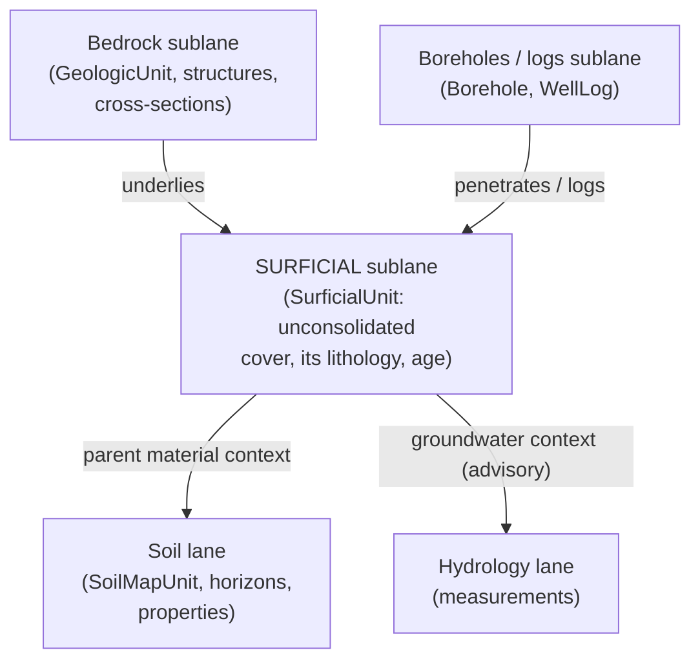

<!-- [KFM_META_BLOCK_V2]
doc_id: kfm://doc/geology-sublane-surficial
title: Geology — Surficial Sublane
type: standard
version: v1
status: draft
owners: <geology-domain-steward> · <docs-steward>   # placeholder — confirm in CODEOWNERS
created: 2026-06-04
updated: 2026-06-04
policy_label: public
related:
  - docs/domains/geology/README.md
  - docs/domains/geology/SCOPE.md
  - docs/domains/geology/SUBLANE-BEDROCK.md
  - docs/domains/geology/SOURCES.md
  - docs/domains/geology/SENSITIVITY.md
  - docs/domains/geology/UI_MAP_SURFACES.md
  - ai-build-operating-contract.md   # CONTRACT_VERSION = "3.0.0"
  - docs/doctrine/directory-rules.md
tags: [kfm, geology, surficial, sublane, quaternary, governance]
notes:
  - Sublane slice of the geology lane scoped to SURFICIAL geology — unconsolidated surface cover (SurficialUnit). Sibling to the bedrock sublane.
  - Doctrine-adjacent; pins CONTRACT_VERSION = "3.0.0".
  - Bedrock/surficial split is CONFIRMED (Atlas §10.A identity; §10.G names a distinct "surficial unit map" viewing product; §10.C records SurficialUnit as a distinct term).
  - Surficial's primary cross-lane role is feeding Soil parent-material context (§10.F / cross-lane tables); this differs from the bedrock sublane's structural edge.
  - Object-family naming drift (SurficialUnit as distinct family vs sub-type of Geologic Unit) surfaced as CONFLICTED. All repo paths PROPOSED.
[/KFM_META_BLOCK_V2] -->

# Geology — Surficial Sublane

> The surficial slice of the geology lane (`[DOM-GEOL]`): mapped bodies of **unconsolidated surface cover** — alluvium, loess, glacial deposits, colluvium — that sit on the bedrock framework. This is mostly public-safe T0 content. Its defining job is to supply **parent-material context to Soil** and surficial/groundwater context to neighbors, without becoming those lanes' truth.

| Field | Value |
|---|---|
| **Status** | `draft` |
| **Owners** | `<geology-domain-steward>` · `<docs-steward>` *(placeholders — confirm in CODEOWNERS)* |
| **Parent lane** | Geology / Natural Resources — `[DOM-GEOL]`, Atlas Ch. 10 |
| **Sublane scope** | Surficial geology (Atlas §10.A bedrock/surficial split; §10.G "surficial unit map"; §10.C `SurficialUnit`) |
| **Default sensitivity** | Mostly **T0** (public-safe surface mapping) |
| **Primary cross-lane role** | Parent-material context to Soil (`§10.F`) |
| **Updated** | 2026-06-04 |

> [!IMPORTANT]
> This sublane doc is a **scoped slice**, not a second copy of the lane. The lane-wide boundary, sources, sensitivity, and release rules live in `SCOPE.md`, `SOURCES.md`, `SENSITIVITY.md`, and `RELEASE_INDEX.md`; this doc narrows them to surficial geology. Where this doc and a lane-wide doc disagree, the lane-wide doc governs and the conflict is logged in `docs/registers/DRIFT_REGISTER.md`.

---

## Contents

- [1. What the surficial sublane is](#1-what-the-surficial-sublane-is)
- [2. Object families this sublane owns](#2-object-families-this-sublane-owns)
- [3. Sublane boundaries (what surficial is NOT)](#3-sublane-boundaries-what-surficial-is-not)
- [4. The parent-material edge to Soil](#4-the-parent-material-edge-to-soil)
- [5. Surficial source feeds](#5-surficial-source-feeds)
- [6. Sensitivity posture](#6-sensitivity-posture)
- [7. Viewing product: the surficial unit map](#7-viewing-product-the-surficial-unit-map)
- [8. Surficial-specific anti-collapse](#8-surficial-specific-anti-collapse)
- [9. Open questions & verification](#9-open-questions--verification)
- [10. Related docs](#10-related-docs)

---

## 1. What the surficial sublane is

**CONFIRMED doctrine (Atlas §10.A).** The geology lane's one-line identity governs "bedrock/**surficial** geology, stratigraphy, lithology, structures, …" — bedrock and surficial are named as distinct halves at the top of the lane. The surficial sublane is the half concerned with the **unconsolidated cover**: the mapped bodies of sediment and weathered material (alluvium, loess, glacial drift, colluvium, residuum) that overlie the bedrock framework.

If the bedrock sublane is the lane's anchor, surficial is its **interface to the living surface**: it is what soils form in, what shallow groundwater moves through, and what agriculture grows on. Its governance value is mostly as *context for neighbor lanes* — supplied as context, never as the neighbor's canonical truth.

> [!NOTE]
> "Surficial" means unconsolidated cover, not "at the surface." A bedrock unit can crop out at the surface and remain bedrock-sublane content; what makes a unit *surficial* is being the unconsolidated material `SurficialUnit` carries. The split is by material/consolidation, not by depth.

[↑ Back to top](#top)

---

## 2. Object families this sublane owns

The surficial sublane's core object is `SurficialUnit`; the lithology, stratigraphy, age, and boundary-version machinery is shared with the lane but applied to surficial bodies.

> [!CAUTION]
> **Object-family naming drift (CONFLICTED).** `SurficialUnit` is recorded in §10.C/§10.E but is **not** a separate entry in the §10.B owns-list (which lists `Geologic Unit`). Whether `SurficialUnit` is a distinct owned family or a sub-type of `Geologic Unit` is unresolved — see [§9](#9-open-questions--verification) and `SCOPE.md` / `UBIQUITOUS_LANGUAGE.md`.

| Object family | What it carries in the surficial sublane |
|---|---|
| `SurficialUnit` | A mapped body of unconsolidated surface cover (alluvium, loess, glacial, colluvium, residuum). The core surficial object. |
| `Lithology` | The material character of a surficial unit (sand, silt, clay, gravel mixtures). |
| `Stratigraphic Interval` | Where surficial deposits have a Quaternary stratigraphy, the named intervals ordering them. |
| `Geologic Age` | The (typically Quaternary) time-scope of a surficial unit, with uncertainty. |
| `GeologyBoundaryVersion` *(§10.C)* | The versioned boundary geometry of a surficial unit. |

> [!NOTE]
> The surficial sublane does **not** typically own structures (`Fault Structure`) or interpretive `CrossSection`s — those are bedrock-sublane content. Surficial bodies are mapped as cover, not as deformed/sectioned rock.

[↑ Back to top](#top)

---

## 3. Sublane boundaries (what surficial is NOT)

| Not in this sublane | Owning sublane / lane | Why the line matters |
|---|---|---|
| `GeologicUnit` (bedrock), structures, cross-sections | Bedrock sublane | Bedrock is consolidated rock; surficial is the cover on it. The §10.A split is by material. |
| `SoilMapUnit`, horizons, soil properties | **Soil lane** `[DOM-SOIL]` | Surficial geology is the *parent material*; the soil that forms in it is Soil's. Geology supplies context, never a soil property (§4). |
| Hydrology measurements (shallow groundwater levels/quality) | **Hydrology lane** `[DOM-HYD]` | Surficial units provide *groundwater context (advisory)*; they never restate a hydrology measurement. |
| `Borehole`, `WellLog` (subsurface points) | Boreholes/logs sublane | Point records with deny-by-default geometry; surficial units are public polygons. |
| Agriculture suitability / crop claims | **Agriculture lane** `[DOM-AG]` | Surficial + soil-parent context is *advisory, not regulatory or aggregate* (§10.F cross-lane table). |

> [!WARNING]
> The defining surficial-sublane error is **letting surficial geology become soil truth**. The relation to Soil is "parent material relation without replacing lithology truth" — surficial supplies *what the soil formed in*; it does not assert the soil's classification, horizons, or properties. Crossing that line collapses two lanes.

[↑ Back to top](#top)

---

## 4. The parent-material edge to Soil

**CONFIRMED doctrine (Atlas §10.F; cross-lane tables).** This is the surficial sublane's signature cross-lane relationship and the main thing that distinguishes it from the bedrock sublane (whose signature edge is structural→hazards).

| Direction | Relation | Constraint |
|---|---|---|
| Geology → Soil | "parent material and surficial context" | Geology supplies the surficial body as the material soil formed in; Soil owns the soil objects. |
| Soil → Geology | "parent material relation without replacing lithology truth" | The relation references geology's lithology as context; it does not let soil restate geology, nor geology restate soil. |
| Geology → Hydrology | "Surficial unit and lithology provide groundwater context (advisory)" | Advisory context only; never a hydrology measurement. |
| Geology → Agriculture | "Resource and soil-parent material context (advisory; not regulatory or aggregate)" | Advisory; the source role stays observed/authority, never relabeled aggregate or regulatory. |

> [!IMPORTANT]
> Every one of these edges is **advisory context** that preserves ownership, source role, sensitivity, and `EvidenceBundle` support. The surficial sublane is unusually edge-heavy precisely because surface cover is where geology, soil, hydrology, and agriculture meet — which makes boundary discipline the sublane's central governance task.

[↑ Back to top](#top)

---

## 5. Surficial source feeds

The surficial-relevant subset of the lane's `§10.D` source families (full typology in `SOURCES.md`).

| Source family | Typical role | Feeds (surficial) |
|---|---|---|
| **KGS surficial geology & geologic maps** *(§10.D family 2)* | authority / observation | `SurficialUnit`, `Lithology`, `GeologicAge` — the dedicated surficial feed |
| KGS data & geologic maps (umbrella) | authority / observation | `SurficialUnit` where surficial mapping is included |
| USGS NGMDB / GeMS | authority / aggregate | surficial map compilations |
| USGS 3DEP terrain *(INFERRED — not in §10.D)* | observation / modeled | geomorphic context for surficial units *(PROPOSED addition; see `SOURCES.md` Q3)* |

> [!NOTE]
> The **KGS surficial geology** family (`§10.D` family 2) is the dedicated feed for this sublane — it is the surficial counterpart to the bedrock-map feed. The oil-and-gas, LAS, WWC5, and MRDS families feed the boreholes/logs and resources sublanes, not this one.

[↑ Back to top](#top)

---

## 6. Sensitivity posture

| Object family | Default tier | Basis |
|---|---|---|
| `SurficialUnit`, `Lithology` | **T0** | PROPOSED (routine public surface mapping; `GeologicUnit`/`Lithology` CONFIRMED T0 at §24.14, and surficial maps are comparable public content) |
| `StratigraphicInterval`, `GeologicAge` (Quaternary) | T0 | PROPOSED |
| `GeologyBoundaryVersion` | T0 | PROPOSED (provenance of a public line) |

> [!IMPORTANT]
> Surficial geology is, like bedrock, a **public-safe** sublane: surficial unit maps are routine, citeable T0 content, and the sublane contains no exact-location point records (those are the boreholes/logs sublane). The sensitivity attention for surficial is **not** location exposure but **cross-lane mislabeling** — ensuring surficial context is never published *as* a soil property, a hydrology measurement, or an agricultural recommendation (§4).

[↑ Back to top](#top)

---

## 7. Viewing product: the surficial unit map

**PROPOSED viewing product (Atlas §10.G).** §10.G names "surficial unit map" as a distinct domain viewing product, separate from the bedrock unit map.

| Aspect | Surficial unit map |
|---|---|
| Primary geometry | `SurficialUnit` polygons |
| Overlays | `Lithology` / `GeologicAge` attribution; optional parent-material annotation for the Soil cross-link |
| Layer artifacts | PMTiles / GeoJSON + `LayerManifest` + `TileArtifactManifest` (per `RELEASE_INDEX.md §9`) |
| Cross-cutting | Evidence Drawer, time-aware state, trust badges, correction/stale-state view, governed Focus Mode (`UI_MAP_SURFACES.md §4`) |
| Release tier | T0 public-safe |

> [!NOTE]
> The surficial unit map and the bedrock unit map are **distinct layers** (§10.A split; §10.G distinct products). A combined "geology" basemap that silently merges them erases the bedrock/surficial distinction — keep them as separate, separately-attributed layers that a user can toggle.

[↑ Back to top](#top)

---

## 8. Surficial-specific anti-collapse

The lane-wide anti-collapse rules (`SOURCE_ROLE_MATRIX.md §5`) apply; the surficial-specific cases:

| Collapse to deny | Why it's wrong | Guardrail |
|---|---|---|
| **Surficial unit → soil** | Treating mapped surface cover as the soil that formed in it | Distinct `SurficialUnit` (geology) vs `SoilMapUnit` (Soil); parent-material relation only (§4) |
| **Surficial unit → bedrock unit** | Treating unconsolidated cover as the consolidated rock beneath | Distinct `SurficialUnit` vs `GeologicUnit`; the §10.A material split |
| **Surficial context → hydrology measurement** | Presenting "groundwater context (advisory)" as a measured water level/quality | Advisory context tag; Hydrology owns measurements (§4) |
| **Advisory context → aggregate/regulatory** | Relabeling advisory surficial/parent-material context as an aggregate or regulatory claim for Agriculture | Source role preserved (observed/authority); "advisory; not regulatory or aggregate" (§10.F) |
| **Modeled surficial surface → observed** | A geomorphic model surface presented as a mapped observed unit | `ModelRunReceipt`; never relabeled observed (Grid C **M→O**) |

[↑ Back to top](#top)

---

## Open questions register

| ID | Question | Owner role | Resolution path |
|---|---|---|---|
| OQ-GEOL-SURF-01 | Is `SurficialUnit` a distinct owned family or a sub-type of `Geologic Unit`? (Drives whether this sublane has its own object family.) | `<geology-domain-steward>` | Schema review; resolves with SCOPE OQ-GEOL-SCOPE-03 / BED OQ-GEOL-BED-01 |
| OQ-GEOL-SURF-02 | Confirm the parent-material edge contract with Soil — what does geology emit and what does Soil consume? | `<geology-domain-steward>` + `<soil-domain-steward>` | Cross-lane contract doc; CROSS_LANE_RELATIONS reconciliation |
| OQ-GEOL-SURF-03 | Should USGS 3DEP terrain be admitted as a surficial-geomorphic source (it is not in §10.D)? | `<geology-domain-steward>` | Dossier-extension review (mirrors `SOURCES.md` OQ-GEOL-SRC-03) |
| OQ-GEOL-SURF-04 | Confirm the "surficial unit map" viewing product and that it renders as a layer distinct from the bedrock unit map. | `<geology-domain-steward>` + `<ui-steward>` | `apps/governed-api/` + `schemas/contracts/v1/map/` |

## Open verification backlog

These items remain `NEEDS VERIFICATION` before this document promotes from `draft` to `published`:

1. The `SurficialUnit` family-vs-subtype decision (OQ-GEOL-SURF-01).
2. The Soil parent-material edge contract (OQ-GEOL-SURF-02).
3. The surficial unit map viewing-product wiring (OQ-GEOL-SURF-04).

## Changelog v0 → v1

| Change | Type (per contract §37) | Reason |
|---|---|---|
| Initial surficial sublane doc authored | new | Second geology sublane slice; sibling to SUBLANE-BEDROCK; scope surficial vs bedrock/soil/borehole |
| Bedrock/surficial split grounded to §10.A + §10.G | clarification | Use the corpus's explicit split and the named "surficial unit map" product |
| Parent-material edge to Soil made the signature cross-lane relation | clarification | Reflect §10.F / cross-lane tables; distinguish from bedrock's structural edge |
| `SurficialUnit` family-vs-subtype surfaced as CONFLICTED | new | Consistent with the rest of the geology suite |

> **Backward compatibility.** New file; no prior anchors to preserve. Section anchors introduced here should be treated as stable.

## Definition of done

This document is done enough to enter the repository when:

- it is placed according to Directory Rules (under `docs/domains/geology/`);
- a geology domain steward reviews it (and a soil domain steward signs the §4 edge);
- the `SurficialUnit` family-vs-subtype question is resolved (OQ-GEOL-SURF-01);
- it is linked from `docs/domains/geology/README.md`, `SCOPE.md`, and `SUBLANE-BEDROCK.md`;
- it does not conflict with accepted ADRs;
- any conflict with lane-wide docs or the dossier is logged in `docs/registers/DRIFT_REGISTER.md`;
- the `GENERATED_RECEIPT.json` planned in the authoring notes is wired into CI;
- future changes follow `ai-build-operating-contract.md §37` lifecycle.

[↑ Back to top](#top)

---

## 10. Related docs

- `docs/domains/geology/SUBLANE-BEDROCK.md` — the sibling bedrock sublane.
- `docs/domains/geology/SCOPE.md` — lane boundary; owned object families; the bedrock/surficial split.
- `docs/domains/geology/SOURCES.md` — full source-family typology (the KGS surficial feed is family 2).
- `docs/domains/geology/SENSITIVITY.md` — tier classification & decision lattice.
- `docs/domains/geology/UI_MAP_SURFACES.md` — surficial unit map as a governed surface.
- `docs/domains/geology/SOURCE_ROLE_MATRIX.md` — anti-collapse grids (Grid C referenced in §8).
- `docs/domains/geology/README.md` — lane landing page.
- `ai-build-operating-contract.md` — operating law (`CONTRACT_VERSION = "3.0.0"`).
- Atlas Ch. 10 §10.A (bedrock/surficial identity); §10.C (`SurficialUnit`); §10.D (KGS surficial feed); §10.F (Soil parent-material edge); §10.G (surficial unit map viewing product); §10.I (sensitivity).
- `docs/domains/soil/` — the Soil lane that consumes surficial parent-material context.

---

*Last updated: 2026-06-04 · Status: `draft` · `CONTRACT_VERSION = "3.0.0"` · `[DOM-GEOL]` · sublane: surficial*

[↑ Back to top](#top)
