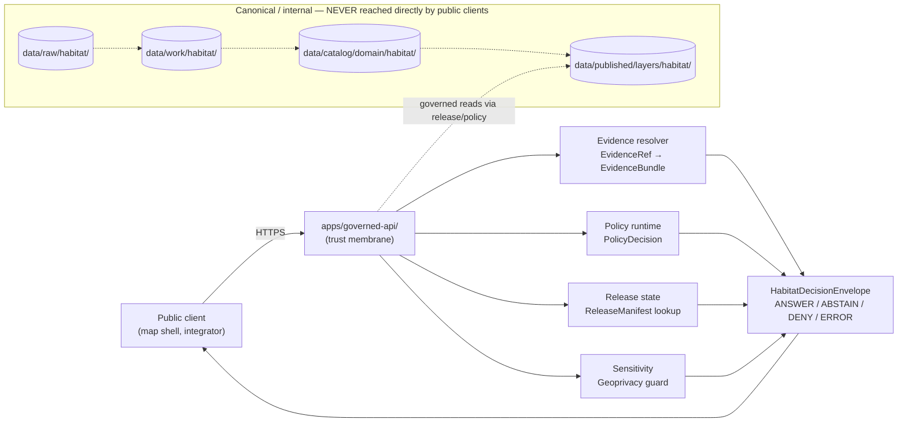
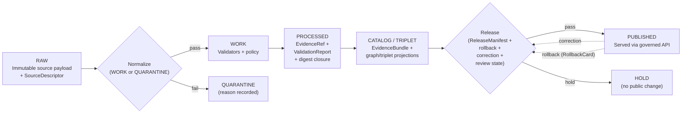

# SECTION 1 — GITHUB MARKDOWN

````md
<!-- [KFM_META_BLOCK_V2]
doc_id: kfm://doc/habitat-api-contracts
title: Habitat — API Contracts
type: standard
version: v1
status: draft
owners: <habitat-steward>  <!-- TODO confirm -->
created: 2026-05-17
updated: 2026-05-17
policy_label: public
related:
  - docs/domains/habitat/README.md
  - docs/domains/habitat/MAP_UI_CONTRACTS.md
  - docs/domains/habitat/SOURCES.md
  - docs/architecture/governed-api.md
  - schemas/contracts/v1/domains/habitat/
  - contracts/domains/habitat/
  - policy/domains/habitat/
tags: [kfm, habitat, api, contracts, governed-api, decision-envelope]
notes:
  - All repo-path claims are PROPOSED until verified against a mounted repo.
  - HabitatDecisionEnvelope is a PROPOSED per-domain extension of the master DecisionEnvelope grammar (Atlas v1.1 §24.3).
  - Exact governed-API route paths remain UNKNOWN per Atlas §6.J.
[/KFM_META_BLOCK_V2] -->

# Habitat — API Contracts

> Semantic contract reference for the **governed API surfaces** that serve the Habitat lane: feature lookup, layer manifest, evidence resolution, Focus Mode, correction intake, and review-queue surfaces — with their finite outcomes, reason codes, and trust obligations.

[](#1-purpose-and-scope)
[](#0-quick-jump)
[](#12-sensitivity-rights-and-public-safe-derivatives)
[](#14-lifecycle-and-release-gates)
[](#16-directory-placement-and-schema-homes)
[](#)

**Status:** `draft` &nbsp;·&nbsp; **Owners:** `<habitat-steward>` _(TODO confirm)_ &nbsp;·&nbsp; **Updated:** 2026-05-17 &nbsp;·&nbsp; **Lane:** `habitat` &nbsp;·&nbsp; **Authority:** standard doc (not authoritative; canonical truth lives in `schemas/contracts/v1/...`, `policy/...`, and `EvidenceBundle`)

> [!IMPORTANT]
> This file **documents** the Habitat governed-API surfaces. It is not a schema, a route registration, or a policy bundle. Machine-checkable shape lives under `schemas/contracts/v1/domains/habitat/` (canonical per **ADR-0001**); admissibility lives under `policy/domains/habitat/`; service-side semantics live under `contracts/domains/habitat/`. Any conflict between this document and those authorities is resolved in favor of those authorities, and the drift is filed against this file.

---

## 0. Quick jump

1. [Purpose and scope](#1-purpose-and-scope)
2. [Trust-membrane principle](#2-trust-membrane-principle)
3. [Surface inventory](#3-surface-inventory)
4. [`HabitatDecisionEnvelope` grammar](#4-habitatdecisionenvelope-grammar)
5. [Feature / detail resolver](#5-feature--detail-resolver)
6. [Layer manifest resolver](#6-layer-manifest-resolver)
7. [Evidence Drawer payload](#7-evidence-drawer-payload)
8. [Focus Mode (governed AI)](#8-focus-mode-governed-ai)
9. [Correction submit](#9-correction-submit)
10. [Review decision](#10-review-decision)
11. [Source-role anti-collapse rules](#11-source-role-anti-collapse-rules)
12. [Sensitivity, rights, and public-safe derivatives](#12-sensitivity-rights-and-public-safe-derivatives)
13. [Cross-lane request constraints](#13-cross-lane-request-constraints)
14. [Lifecycle and release gates](#14-lifecycle-and-release-gates)
15. [Validators, tests, and fixtures](#15-validators-tests-and-fixtures)
16. [Directory placement and schema homes](#16-directory-placement-and-schema-homes)
17. [Open questions and verification backlog](#17-open-questions-and-verification-backlog)
18. [Related docs](#18-related-docs)

---

## 1. Purpose and scope

> `CONFIRMED doctrine / PROPOSED implementation.` _[DOM-HAB §A], [DOM-HF], [ENCY]._

The Habitat lane governs **habitat patches, land-cover observations, ecological systems, habitat-quality scores, suitability models, connectivity edges, corridors, restoration opportunities, stewardship zones, model-run receipts, and uncertainty surfaces**, plus their **public-safe derivatives**. This document specifies the **governed-API surfaces** through which those objects are consumed — by the map shell, by Focus Mode, by review consoles, and by external integrators.

**This file covers**

- The **finite-outcome envelopes** returned by every Habitat governed surface.
- The **DTO shapes** the surfaces speak (referencing — not redefining — the canonical schemas under `schemas/contracts/v1/domains/habitat/`).
- The **reason codes**, **obligations**, and **trust badges** that accompany each outcome.
- The **cross-lane discipline** Habitat APIs must preserve toward Fauna, Flora, Soil, Hydrology, Hazards, and Archaeology.

**This file does not cover**

- **Wire format mechanics** (HTTP verbs, status codes, content negotiation, pagination semantics). Those belong to `docs/architecture/governed-api.md` (`PROPOSED`).
- **Machine schemas.** Those live under `schemas/contracts/v1/domains/habitat/`.
- **Map and UI rendering of these payloads.** That belongs to `docs/domains/habitat/MAP_UI_CONTRACTS.md` (`PROPOSED`).
- **Source descriptors and harvest mechanics.** Those belong to `docs/domains/habitat/SOURCES.md` (`PROPOSED`) and the Habitat source-refresh runbook.

[Back to top](#habitat--api-contracts)

---

## 2. Trust-membrane principle

> `CONFIRMED doctrine.` _[DIRRULES §7.1], [ENCY], [UIAI]._

Public clients and normal UI surfaces consume Habitat data **only** through the governed API — never by reading `data/raw/`, `data/work/`, `data/quarantine/`, `data/processed/`, or the canonical catalog directly. The governed API is the **only** place where `release_state`, `PolicyDecision`, `EvidenceBundle` resolution, `rights_status`, and `sensitivity` are enforced before a payload leaves the trust spine.



> [!CAUTION]
> **The trust membrane is not advisory.** A Habitat surface that bypasses the governed API — or that returns an object whose `EvidenceRef` set has not resolved — is a doctrinal violation, not a tradeoff. Map shells, embedded widgets, server-side renderers, and CLI clients are all governed-API clients, even when co-located in the same repository.

[Back to top](#habitat--api-contracts)

---

## 3. Surface inventory

> `PROPOSED governed API surfaces; exact routes UNKNOWN.` _Routes are `PROPOSED` until verified against a mounted repo and an ADR records them. Per [DOM-HAB §J] and [ENCY §J]._

The Habitat lane exposes the surfaces below. Outcome columns follow the master grammar at Atlas v1.1 §24.3.

| Surface | DTO / schema | Outcomes | Status |
|---|---|---|---|
| Habitat feature / detail resolver | `HabitatFeatureEnvelope` wrapping `HabitatDecisionEnvelope` + `EvidenceRef[]` | `ANSWER` / `ABSTAIN` / `DENY` / `ERROR` | `PROPOSED`; route `TBD`. |
| Habitat layer manifest resolver | `LayerManifest` (domain-bound) | `ANSWER` / `DENY` / `ERROR` | `PROPOSED`; serves released artifacts only. |
| Habitat Evidence Drawer payload | `EvidenceDrawerPayload` + `EvidenceBundle` projection | `ANSWER` / `ABSTAIN` / `DENY` / `ERROR` | `PROPOSED`; evidence- and policy-filtered. |
| Habitat Focus Mode answer | `FocusModeRequest` → `FocusModeResponse` + `AIReceipt` (carried inside `RuntimeResponseEnvelope`) | `ANSWER` / `ABSTAIN` / `DENY` / `ERROR` | `PROPOSED`; AI is interpretive, never root truth. |
| Habitat correction submit | `CorrectionNoticeCandidate` | `ACCEPTED` / `HOLD` / `DENY` / `ERROR` | `PROPOSED`; steward-routed. |
| Habitat review decision | `ReviewRecord` + `PolicyDecision` | `ALLOW` / `RESTRICT` / `DENY` / `HOLD` / `ERROR` | `PROPOSED`; separation-of-duties applies for sensitive items. |
| Habitat source summary resolver | `SourceDescriptor` projection | `ANSWER` / `ABSTAIN` / `DENY` / `ERROR` | `PROPOSED`; never returns raw source bytes. |

> [!NOTE]
> The exact HTTP route shapes (e.g., `GET /api/v1/domains/habitat/features/{id}`) are illustrated below for orientation, following the master surface pattern at [ENCY §J]. Final paths require an ADR before merge.

[Back to top](#habitat--api-contracts)

---

## 4. `HabitatDecisionEnvelope` grammar

> `PROPOSED` per-domain extension of the master `DecisionEnvelope` grammar. _[ENCY §24.3], [GAI], [DOM-HAB §J]._

Every Habitat governed surface returns a `HabitatDecisionEnvelope`. The envelope inherits the master outcome enum and reason-code discipline; the **domain-specific** reason codes appear in §11 (source-role anti-collapse), §12 (sensitivity), and §14 (lifecycle).

| Field | Required | Notes |
|---|---|---|
| `decision_id` | yes | Stable identifier; supports audit, replay, and rollback drill. |
| `outcome` | yes | One of `ANSWER`, `ABSTAIN`, `DENY`, `ERROR` for caller-facing envelopes; validator-internal envelopes additionally use `PASS` / `FAIL` / `HOLD`. |
| `domain` | yes | Constant: `"habitat"`. |
| `policy_family` | yes | E.g. `habitat.public_release`, `habitat.source_role`, `habitat.sensitivity`, `habitat.rights`. |
| `reasons` | yes when `outcome != ANSWER` | Reason codes (see §11 / §12 / §14). Examples: `missing_evidence`, `unresolved_evidence_ref`, `source_role_collapse`, `modeled_as_critical_denied`, `geoprivacy_required`, `stale_evidence`, `unknown_rights`, `review_pending`. |
| `obligations` | yes when `outcome ∈ {ANSWER, HOLD}` | E.g. `generalize:to_watershed`, `redact:exact_geometry`, `hold:steward_review`, `display:trust_badge:modeled`. |
| `evidence_refs` | yes when `outcome == ANSWER` | Resolved `EvidenceRef[]`; each must resolve to a closed `EvidenceBundle`. |
| `policy_decision_ref` | yes | Pointer to the underlying `PolicyDecision`. |
| `citation_validation_ref` | yes when `ANSWER` is publicly emitted | Pointer to `CitationValidationReport`. |
| `release_state` | yes | `PUBLISHED` is the only valid value for public callers. Anything else for a public caller is itself a `DENY`. |
| `source_role` | yes when payload describes a `HabitatPatch`, `LandCoverObservation`, `SuitabilityModel`, etc. | One of `observed` / `regulatory` / `modeled` / `aggregate` / `administrative` / `candidate` / `synthetic`. See §11. |
| `rights_status` | yes | E.g. `open`, `attribution`, `restricted`, `unknown` (the last forces `DENY` for public). |
| `sensitivity_tier` | yes | `T0` / `T1` / `T2` / `T3` / `T4` per [ENCY §24.5]. |
| `evaluated_at` | yes | ISO 8601 timestamp. |
| `rollback_target` | yes | Pointer to the prior `ReleaseManifest` and root hash. |

> [!NOTE]
> The Atlas marks the envelope and its exact field set as **`PROPOSED`** at [DOM-HAB §J]. The shape above synthesizes the master `DecisionEnvelope` grammar with Habitat-specific obligations and reason codes. Final field names, JSON Schema, and route binding are subject to ADR review and live under `schemas/contracts/v1/domains/habitat/decision_envelope.schema.json` (`PROPOSED` path).

[Back to top](#habitat--api-contracts)

---

## 5. Feature / detail resolver

> `PROPOSED governed-API surface.` _[ENCY §J], [DOM-HAB §J]._

Resolves a single Habitat feature — `HabitatPatch`, `LandCoverObservation`, `EcologicalSystem`, `HabitatQualityScore`, `SuitabilityModel`, `ConnectivityEdge`, `Corridor`, `RestorationOpportunity`, `StewardshipZone`, `ModelRunReceipt`, or `UncertaintySurface` — to a public-safe envelope.

**PROPOSED route:** `GET /api/v1/domains/habitat/features/{id}`

**Behavior**

1. Resolve `id` against the **published** lane only (`release_state == PUBLISHED`); unreleased candidates return `DENY` with reason `not_released`.
2. Resolve every claim-bearing `EvidenceRef` to a closed `EvidenceBundle`. Unresolved or stale evidence → `ABSTAIN` with reason `unresolved_evidence_ref` or `stale_evidence`.
3. Apply policy (rights, sensitivity, source-role anti-collapse). Sensitive geometry (e.g., joined to T3/T4 occurrence) → `DENY` with reason `restricted_exact_geometry`, optionally accompanied by an obligation hinting at a generalized public-safe layer.
4. Preserve the **source-role label** on every emitted object. Never elide it; never relabel modeled output as observation or as regulatory.

**Illustrative envelope (PROPOSED; for orientation only)**

```jsonc
{
  "decision_id": "hab-feat-0001",
  "outcome": "ANSWER",
  "domain": "habitat",
  "policy_family": "habitat.public_release",
  "obligations": [
    "display:trust_badge:modeled",
    "display:trust_badge:freshness:2024-09"
  ],
  "evidence_refs": [
    "evidence://kfm/habitat/patch/2024-09/abcd1234",
    "evidence://kfm/habitat/landcover/nlcd-2021/efgh5678"
  ],
  "policy_decision_ref": "policy://kfm/decision/2026-05-17/9f3c",
  "citation_validation_ref": "cite://kfm/report/2026-05-17/7b2a",
  "release_state": "PUBLISHED",
  "source_role": "modeled",
  "rights_status": "open",
  "sensitivity_tier": "T0",
  "evaluated_at": "2026-05-17T12:00:00Z",
  "rollback_target": "release://kfm/habitat/2026-05-10/v1",
  "feature": {
    "feature_type": "HabitatPatch",
    "id": "habitat:patch:ks-2024:abcd1234",
    "geometry_ref": "tiles://kfm/habitat/patches/v1/{z}/{x}/{y}.pbf",
    "ecological_system_ref": "habitat:ecosystem:tallgrass-prairie",
    "quality_score": 0.62,
    "uncertainty_surface_ref": "habitat:uncertainty:patch:abcd1234",
    "valid_time": { "start": "2024-01-01", "end": "2024-12-31" },
    "observed_time": null,
    "release_time": "2026-05-10T00:00:00Z"
  }
}
```

> [!WARNING]
> **Do not return raw geometry directly when the feature is joined to T4 occurrence evidence.** Return the public-safe derivative (generalized polygon, watershed-scale aggregate, or `DENY` with a pointer to a generalized layer). See §12.

[Back to top](#habitat--api-contracts)

---

## 6. Layer manifest resolver

> `PROPOSED governed-API surface.` _[ENCY §J], [DOM-HAB §J], [MAP-MASTER]._

Returns the `LayerManifest` for a Habitat map layer (habitat-patch overlay, suitability surface, connectivity/corridor view, restoration opportunity, uncertainty mode, sensitivity-redacted mode, habitat-fauna join view). Map shells consume these manifests to build MapLibre sources and layers; the manifest binds the rendered layer to its governed source and evidence semantics.

**PROPOSED route:** `GET /api/v1/layers/{layer_id}/manifest`

**Required behavior**

| Requirement | Specification |
|---|---|
| Release gating | Only layers with a current `ReleaseManifest` may resolve to `ANSWER`. Unreleased or held layers → `DENY` (`not_released` / `release_held`). |
| Identity binding | The manifest carries `layer_id`, `source_id`, `source_layer`, `evidence_ref_field`, `temporal_fields`, `policy_label`, and `release_state` — per the Master MapLibre `LayerManifest` shape. |
| Trust badging | The manifest declares **source-role badges** (`observed` / `regulatory` / `modeled` / `aggregate`), **freshness**, **uncertainty**, **sensitivity**, **rights**, and **review state**. |
| Sensitivity discipline | A sensitive layer is **not delivered as a tile and then style-hidden**. Sensitive geometry denials happen at manifest and tile-artifact level; style-only hiding is a doctrinal violation. |
| Rollback | Every `LayerManifest` carries a `rollback_target` (prior `ReleaseManifest` and root hash). |

> [!IMPORTANT]
> **Critical-habitat layers are `regulatory`, not `modeled`.** A USFWS critical-habitat designation is an authoritative determination; a habitat-suitability raster from a fitted model is a `modeled` product. The two are not interchangeable in the `LayerManifest`. Mislabeling either is a `source_role_collapse` denial (§11).

[Back to top](#habitat--api-contracts)

---

## 7. Evidence Drawer payload

> `PROPOSED governed-API surface.` _[MAP-MASTER], [DOM-HAB §J], [ENCY §J]._

When a user clicks or selects a Habitat feature, the map shell requests an `EvidenceDrawerPayload`. The payload is the **single public-safe view** of a feature's evidence — citations, source roles, policy state, release state, limitations.

**PROPOSED route:** `GET /api/v1/evidence/{evidence_ref}`

**Payload shape (illustrative; PROPOSED)**

| Field | Notes |
|---|---|
| `feature_id` | The selected feature. |
| `layer_id` | The owning layer. |
| `evidence_bundle_refs` | One or more `EvidenceBundle` projections. |
| `source_summary` | Source families, source roles, rights, attribution requirements (e.g., USFWS ECOS, KDWP review context, NLCD, NWI, GAP/LANDFIRE, NatureServe, GBIF/iNaturalist/iDigBio, PAD-US). |
| `citations` | Resolved, validated citations; uncited claim text is never emitted. |
| `policy_state` | Active `PolicyDecision`(s); obligations carried through to the drawer. |
| `release_state` | Must be `PUBLISHED` for public callers. |
| `limitations` | Source-role caveats, model uncertainty notes, temporal-scope caveats. |
| `correction_link` | Route into the correction-submit surface (§9). |

> [!NOTE]
> The drawer renders a **bounded view of evidence** — it is not the evidence store. A drawer that displays a claim without a citation is a `citation_validation_failed` denial.

[Back to top](#habitat--api-contracts)

---

## 8. Focus Mode (governed AI)

> `CONFIRMED doctrine / PROPOSED implementation.` _[GAI], [DOM-HAB §L], [UIAI]._

Focus Mode lets a user ask a bounded question about Habitat features. AI is **interpretive, not authoritative**: the model may summarize released `EvidenceBundle`s, compare evidence, explain limitations, and draft steward-review notes. It may not invent claims, replace evidence, or front-run release state.

### 8.1 Required behavior

| Behavior | Rule |
|---|---|
| Required answer mode | `ANSWER` only when evidence is sufficient, citations validate, source roles do not conflict, temporal scope is adequate, and policy permits. |
| Required abstention | `ABSTAIN` when `EvidenceBundle` is missing, citations cannot be validated, source roles conflict, temporal scope is insufficient, evidence is stale and no released alternative is found, or the question requests unsupported inference. |
| Required denial | `DENY` on direct `RAW` / `WORK` / `QUARANTINE` access requests; on sensitive-location exposure (T3/T4); on emergency-alerting replacement; on uncited authoritative claims; on any path that would substitute model output for a release decision. |
| Receipt | Every Focus Mode response emits `AIReceipt` and `RuntimeResponseEnvelope` with `outcome ∈ { ANSWER, ABSTAIN, DENY, ERROR }`, `evidence_refs`, `policy_decision`, and `citation_validation`. **No raw chain-of-thought is persisted as truth.** |

### 8.2 Habitat-specific denial cases

- **Modeled-as-critical.** A request that would let the AI surface present a `SuitabilityModel` raster as **regulatory critical habitat** → `DENY` (`modeled_as_critical_denied`).
- **Cross-lane occurrence leakage.** A request that asks Habitat to expose Fauna occurrence detail beyond its public-safe derivative → `DENY` (`cross_lane_occurrence_leak`). Habitat does not own occurrence truth.
- **Emergency-alert framing.** A request that asks AI to characterize a habitat condition as an emergency alert → `DENY` (`emergency_alert_substitution`); KFM is never an alert authority.

> [!CAUTION]
> **Focus Mode does not call a model client from the browser.** Focus Mode requests pass through `apps/governed-api/` (or equivalent governed-AI route), behind evidence resolution and policy checks. The browser cannot reach the model runtime directly. _[MAP-MASTER], [UIAI]; PROPOSED route._

[Back to top](#habitat--api-contracts)

---

## 9. Correction submit

> `PROPOSED governed-API surface.` _[ENCY §J], [ENCY Appendix E]._

Allows a user, steward, or reviewer to submit a `CorrectionNoticeCandidate` against a published Habitat feature.

**PROPOSED route:** `POST /api/v1/corrections`

**Outcomes**

| Outcome | When |
|---|---|
| `ACCEPTED` | The candidate is well-formed, attaches sufficient evidence, and enters the review queue. Acceptance does not modify the public surface. |
| `HOLD` | The candidate is well-formed but the steward must review evidence or sensitivity before next action. |
| `DENY` | The candidate is malformed, lacks evidence, or attempts to bypass the trust spine (e.g., asks for silent re-publication without rollback). |
| `ERROR` | Infrastructure failure or contract violation. |

> [!NOTE]
> **Corrections never rewrite the prior release silently.** A successful correction produces a new `ReleaseManifest` referencing its predecessor; downstream derivatives (layers, drawer payloads, AI receipts) are invalidated and re-resolved. Rollback uses the `RollbackCard` attached to the prior `ReleaseManifest`.

[Back to top](#habitat--api-contracts)

---

## 10. Review decision

> `PROPOSED governed-API surface.` _[ENCY §J], [ENCY §24.3]._

Steward / reviewer surface to record a `ReviewRecord` and its associated `PolicyDecision` for sensitive or release-significant Habitat items (e.g., a habitat polygon joined to a T4 species occurrence, a `StewardshipZone` requiring named-party agreement, a `SuitabilityModel` re-release with material changes).

**PROPOSED route:** `POST /api/v1/review/{queue}/{id}/decision`

**Outcomes:** `ALLOW` / `RESTRICT` / `DENY` / `HOLD` / `ERROR`.

> [!IMPORTANT]
> **Separation of duties applies** when materiality justifies it: the reviewer recording the `ReviewRecord` must not be the same actor who promoted the underlying release candidate. Mixing review and publication duties on the same actor is itself a `DENY` (`separation_of_duties_violated`).

[Back to top](#habitat--api-contracts)

---

## 11. Source-role anti-collapse rules

> `CONFIRMED doctrine.` _[ENCY §24.1], [DOM-HAB §D], [DOM-HF]._

Habitat is one of the lanes most at risk for source-role collapse, because the same geographic footprint may be addressed by:

- A **regulatory** designation (e.g., USFWS critical-habitat unit);
- A **modeled** product (e.g., MaxEnt suitability raster, GAP/LANDFIRE classification, fitted habitat-quality score);
- An **observed** sample (e.g., a field survey at a point);
- An **aggregate** publication (e.g., a county-level land-cover summary); and
- A **candidate** record (e.g., a quarantined connector output not yet promoted).

The governed API **must preserve these roles** end-to-end. The envelope's `source_role` field is not optional.

### 11.1 Habitat-specific DENY conditions

| Collapse pattern | Domain example | Denied outcome | Required guardrail |
|---|---|---|---|
| `SuitabilityModel` returned or queried as `regulatory critical habitat`. | A suitability raster relabeled as a designation. | `DENY` (`modeled_as_critical_denied`) at publication and Focus Mode. | Run receipt + uncertainty surface + role-preserving DTO field; trust badge `modeled`. |
| `RegulatoryDesignation` returned or queried as an observation. | A critical-habitat polygon relabeled as a field record. | `DENY` (`regulatory_as_observed_denied`). | Separate regulatory and observation lanes; UI banner; release-manifest source-role pin. |
| `AggregateLandCover` cited as a per-place truth. | A county-level land-cover summary attached to a single feature. | `DENY` (`aggregate_as_perplace_denied`); `ABSTAIN` at Focus Mode. | Aggregation receipt; geometry-scope guard. |
| `Candidate` (e.g., quarantined connector output) presented as published. | A quarantined NLCD-derived patch served as `ANSWER`. | `DENY` (`candidate_as_published_denied`). | Release-state pin to `PUBLISHED`. |
| `Synthetic` content (AI-drafted, reconstructed) returned as observed reality. | An AI-drafted patch summary presented without a Reality Boundary Note. | `DENY` (`synthetic_as_observed_denied`); `ABSTAIN` at Focus Mode. | Reality Boundary Note + Representation Receipt. |

> [!WARNING]
> **Promotion does not upgrade a source role.** A modeled product never becomes regulatory by passing through the lifecycle; a candidate never becomes observed; an aggregate never becomes a per-place record. Each is a separate governed transition with its own evidence and review requirements.

[Back to top](#habitat--api-contracts)

---

## 12. Sensitivity, rights, and public-safe derivatives

> `CONFIRMED doctrine / PROPOSED implementation.` _[DOM-HAB §I], [DOM-HF], [ENCY §24.5]._

Habitat lies adjacent to species-occurrence sensitivity. Even when Habitat does not own occurrence truth, **a habitat-evidence response that reveals or implies sensitive occurrence location must fail closed**. Regulatory critical habitat, modeled habitat, species range, occurrence points, and landscape context **must not be flattened**.

### 12.1 Default sensitivity tiers

| Object class | Default tier | Allowed transforms (PROPOSED) | Required gates |
|---|---|---|---|
| `HabitatPatch` (general, non-sensitive context) | `T0` | None. | Standard release. |
| `EcologicalSystem` (e.g., tallgrass prairie polygon) | `T0` | None. | Standard release. |
| `HabitatPatch` joined to T4 occurrence | **`T4` for the join; `T0` for the un-joined patch** | Generalization to watershed / county; aggregation; suppression. | `RedactionReceipt` + `ReviewRecord` + `PolicyDecision`. |
| `StewardshipZone` (named-party detail) | `T1` typical, `T2`/`T3` for restricted detail | Generalized footprint; suppressed dependency. | Steward review + `RedactionReceipt`. |
| Modeled habitat output with insufficient support | `T1` until support verified | Aggregation; uncertainty surface required. | Model-card review. |
| Sensitive occurrence-implying habitat surface | **`T4`** | Geoprivacy generalization → `T1`; never delivered at original precision. | `RedactionReceipt` + `ReviewRecord` + `PolicyDecision`. |
| RAW / WORK / QUARANTINE access via the API | **`T4` forever** | None — public and AI surfaces never read pre-release content. | Trust membrane (§2). |

Tier transitions follow the master motion table at [ENCY §24.5.3]: upgrades toward public require **both** a transform receipt and a review record; downgrades to T4 are always permitted via `CorrectionNotice` alone.

### 12.2 Style-only hiding is not redaction

> [!CAUTION]
> **Hiding a sensitive habitat feature with a MapLibre style filter while still serving the underlying tile is not an acceptable transform.** The deny happens at the **API and tile-artifact** level (per the Master MapLibre sensitive-geometry-deny pattern). Style is presentation, not policy.

### 12.3 Rights and freshness

- `rights_status == "unknown"` → `DENY` for public callers; the public envelope cannot answer with unresolved terms.
- `rights_status == "restricted"` → response is gated to authorized callers under a named-party agreement; envelope carries `RESTRICT` in the review-queue surface, `DENY` in the public surface.
- Sources whose **terms** are time-limited (e.g., licensed biodiversity feeds — `NEEDS VERIFICATION` per [DOM-HAB §D]) must surface a freshness-bounded `release_state` and may force `ABSTAIN` in Focus Mode after expiry.

[Back to top](#habitat--api-contracts)

---

## 13. Cross-lane request constraints

> `CONFIRMED doctrine.` _[DOM-HAB §F], [ENCY §24.4]._

Habitat API responses must preserve cross-lane ownership boundaries. Requests that would relabel another lane's object as Habitat — or vice versa — are policy violations.

| This domain | Related lane | Relation type | API constraint |
|---|---|---|---|
| Habitat | Fauna | Habitat assignment + occurrence context, with geoprivacy. | Habitat API returns habitat **context** for an occurrence id; **occurrence truth resolves through the Fauna API.** Sensitive-occurrence redaction defaults to deny. |
| Habitat | Flora | Vegetation-community + rare-plant context. | Habitat API may cite vegetation community evidence; rare-plant location detail is **Flora-controlled** and defaults to T4. |
| Habitat | Soil / Hydrology | Substrate, moisture, wetlands, riparian support. | Habitat API may cite Soil/Hydrology evidence but does not own it; canonical truth resolves through those domains. |
| Habitat | Hazards | Fire, drought, flood, smoke, resilience-stress context. | Habitat API may cite hazard context; **KFM is never an alert authority** — emergency-alert framing → `DENY`. |
| Habitat | Archaeology | Landscape context only. | Sovereignty / sensitivity review required; deny-default applies to any join that would expose archaeological site detail. |

> [!IMPORTANT]
> **Public-safe joins only.** A Habitat + Fauna join that returns exact sensitive-occurrence geometry — even if both items were technically public at their own surfaces — is a `cross_lane_sensitivity_join` denial.

[Back to top](#habitat--api-contracts)

---

## 14. Lifecycle and release gates

> `CONFIRMED doctrine / PROPOSED lane application.` _[DIRRULES §9], [DOM-HAB §H], [ENCY §24.6]._

Every Habitat object follows the invariant `RAW → WORK / QUARANTINE → PROCESSED → CATALOG / TRIPLET → PUBLISHED`. Promotion is a **governed state transition, not a file move**. The governed API serves released artifacts only.



| Gate | Pre-condition | Required artifacts | Failure-closed outcome |
|---|---|---|---|
| Admission (— → RAW) | Source identity, role, rights minimally established. | `SourceDescriptor`; payload/reference hash. | Source not admitted; logged candidate. |
| Normalization (RAW → WORK / QUARANTINE) | Schema, geometry, time, identity, evidence, rights, and policy rules are runnable. | `TransformReceipt`; working `ValidationReport`; `PolicyDecision`; quarantine reason on failure. | Quarantine with reason; never silent promotion. |
| Validation (WORK → PROCESSED) | Validators are deterministic and bound to fixtures. | `ValidationReport` pass; `RedactionReceipt` if sensitivity applies; `AggregationReceipt` if applies. | Stay in WORK; structured FAIL. |
| Catalog closure (PROCESSED → CATALOG / TRIPLET) | `EvidenceRef`s resolve; digests close. | `CatalogMatrix` entry; `EvidenceBundle`; graph projections if applicable. | HOLD at PROCESSED; no public edge. |
| Release (CATALOG / TRIPLET → PUBLISHED) | `ReviewRecord` where required; release authority distinct from author when material. | `ReleaseManifest`; rollback target; correction path. | HOLD at CATALOG; no public surface change. |
| Correction (PUBLISHED → PUBLISHED′) | Detected error or new evidence; downstream derivatives identified. | `CorrectionNotice`; new `ReleaseManifest`; downstream-invalidation receipt. | DENY publication of correction without invalidating derivatives. |
| Rollback (PUBLISHED → prior state) | A `RollbackCard` is attached to the prior `ReleaseManifest`. | Executed `RollbackCard`; receipt. | No silent rollback. |

> [!NOTE]
> The **watcher-as-non-publisher** invariant applies. Habitat watchers (e.g., NLCD-version detectors, critical-habitat-service drift detectors) emit candidates and receipts; they **never** write directly to `data/catalog/` or `data/published/`. Their output is not exposed through governed APIs until a separate promotion runs.

[Back to top](#habitat--api-contracts)

---

## 15. Validators, tests, and fixtures

> `PROPOSED implementation.` _[DOM-HAB §K], [ENCY §24.7]._

The contracts above are enforced by the following validator and test families. All paths are `PROPOSED` until verified against a mounted repo.

| Test family | Habitat-specific negative case | Expected outcome |
|---|---|---|
| Schema validation | Envelope without `source_role` or with unknown enum value. | `FAIL`; envelope → `ERROR`. |
| Source descriptor validation | Habitat source without role / rights / cadence. | `DENY` at admission. |
| Source-role anti-collapse | `SuitabilityModel` payload presented under a `regulatory` `source_role`. | `DENY` (`source_role_collapse` / `modeled_as_critical_denied`). |
| Critical-habitat source-role | USFWS critical-habitat polygon admitted under `modeled`. | `DENY` at admission; quarantine. |
| Modeled-as-critical denial | Suitability raster requested via the critical-habitat resolver. | `DENY` at runtime. |
| Occurrence geoprivacy | Habitat patch joined to T4 occurrence returned with exact geometry. | `DENY` (`restricted_exact_geometry`). |
| Sensitive geometry deny (MapLibre) | Sensitive habitat layer served as a tile and then style-hidden. | `DENY` at manifest / tile-artifact level. |
| Citation validation | Public `ANSWER` without resolved citations. | `DENY` (`citation_validation_failed`). |
| Evidence closure | `EvidenceRef` does not resolve to a closed `EvidenceBundle`. | `ABSTAIN` (`unresolved_evidence_ref`). |
| Temporal logic | Out-of-window query against a habitat snapshot. | `ABSTAIN` (`out_of_window`). |
| Release-manifest closure | Layer served without a current `ReleaseManifest`. | `DENY` (`not_released` / `release_held`). |
| Rollback drill | Rollback fails to invalidate downstream `EvidenceDrawerPayload` cache. | `FAIL`; rollback aborted. |
| No-network fixture | Habitat + Fauna thin-slice fixture (one public-safe occurrence-to-habitat assignment). | `ANSWER` for the public-safe path; `DENY` for the sensitive-detail path. |
| Cross-lane occurrence join | Public Habitat surface that exposes Fauna sensitive-occurrence detail. | `DENY` (`cross_lane_sensitivity_join`). |

> [!TIP]
> **The Habitat + Fauna thin slice** is the canonical first proof for this lane: one public-safe occurrence-to-habitat assignment using controlled fixtures, exercising `EvidenceBundle`, `LayerManifest`, `EvidenceDrawerPayload`, `FocusModeResponse`, `RuntimeResponseEnvelope`, and `RollbackCard` without touching live sensitive feeds. _[KFM-IDX-APP-002, DOM-HF, INDEX-20]._

[Back to top](#habitat--api-contracts)

---

## 16. Directory placement and schema homes

> `CONFIRMED doctrine / PROPOSED specific paths.` _[DIRRULES §6, §12]._

The Habitat lane follows Domain Placement Law: the domain is a **segment** inside each responsibility root, never a **root itself**.

| Concern | PROPOSED responsibility root | Notes |
|---|---|---|
| This document | `docs/domains/habitat/API_CONTRACTS.md` | Standard doc; human-facing contract reference. |
| Service-side semantic contracts (Markdown) | `contracts/domains/habitat/` | Pairs with schemas; not machine-checkable. |
| Machine schemas | `schemas/contracts/v1/domains/habitat/` | **Canonical per ADR-0001.** |
| Decision-envelope schema | `schemas/contracts/v1/domains/habitat/decision_envelope.schema.json` | `PROPOSED`. |
| Layer-manifest schema (habitat-bound) | `schemas/contracts/v1/domains/habitat/layer_manifest.schema.json` | `PROPOSED`. |
| Evidence-drawer-payload schema (habitat-bound) | `schemas/contracts/v1/domains/habitat/evidence_drawer_payload.schema.json` | `PROPOSED`. |
| Focus-mode schemas | `schemas/contracts/v1/ai/focus_mode_*.schema.json` (cross-cutting) | Not domain-segmented. |
| Policy bundles | `policy/domains/habitat/` | `policy/` is singular. |
| Tests | `tests/domains/habitat/` | Includes negative gates from §15. |
| Fixtures | `fixtures/domains/habitat/` | No-network fixtures (Habitat + Fauna thin slice). |
| Lifecycle data | `data/{raw,work,quarantine,processed,catalog,published,registry/sources}/habitat/` | Lifecycle invariant. |

> [!WARNING]
> **No `habitat/` root folder.** Per [DIRRULES §12], a domain must not become a top-level root with its own `data/`, `schemas/`, `policy/`, `docs/` subtree. Files belong under the responsibility-root lane pattern above.

[Back to top](#habitat--api-contracts)

---

## 17. Open questions and verification backlog

> Each item should be settled by mounted-repo evidence, an ADR, a schema landing, or a thin-slice fixture run.

| # | Item | Evidence that would settle it | Status |
|---|---|---|---|
| Q-01 | Exact route paths for the seven surfaces in §3. | ADR + mounted `apps/governed-api/src/routes/`. | `UNKNOWN`. |
| Q-02 | Final `HabitatDecisionEnvelope` field set, including reason-code enumeration. | Landed `schemas/contracts/v1/domains/habitat/decision_envelope.schema.json`. | `PROPOSED`. |
| Q-03 | Validator exit-code contract (PASS/FAIL/ERROR vs OS exit codes). | ADR resolution; see open ADR referenced in `tools/README.md`. | `PROPOSED`. |
| Q-04 | Rights status and cadence of every Habitat source family (USFWS ECOS, KDWP review context, NLCD, NWI, GAP/LANDFIRE, NatureServe, GBIF/iNaturalist/iDigBio, PAD-US). | Source-activation decisions in `data/registry/sources/habitat/`. | `NEEDS VERIFICATION`. |
| Q-05 | Geoprivacy transform parameters for Habitat × Fauna joins (generalization granularity, residual-risk thresholds). | Policy bundle + transform-receipt schema. | `NEEDS VERIFICATION`. |
| Q-06 | Model-card requirements for suitability products (training period, support, uncertainty surface, run-receipt closure). | Policy + steward standard. | `NEEDS VERIFICATION`. |
| Q-07 | Habitat MapLibre overlay registry shape and Focus binding. | Landed registry + Focus contract. | `NEEDS VERIFICATION`. |
| Q-08 | Habitat + Fauna thin-slice AOI selection. | Pilot proposal under `docs/intake/`. | `PROPOSED`. |
| Q-09 | Watcher state placement under Directory Rules (NLCD / critical-habitat-service watchers). | ADR. | `PROPOSED`. |
| Q-10 | Naming reconciliation for cross-cutting AI schemas (`schemas/contracts/v1/ai/`) vs domain-bound habitat schemas. | ADR or cross-walk note. | `PROPOSED`. |

<details>
<summary><b>Reason-code register (PROPOSED, extensible)</b></summary>

The following reason codes are referenced by Habitat envelopes. Each must resolve to a documented entry in a future `docs/domains/habitat/REASON_CODES.md` (`PROPOSED`).

| Code | Where used | Meaning |
|---|---|---|
| `not_released` | Public surfaces | The requested object has no current `ReleaseManifest`. |
| `release_held` | Public surfaces | The release is on `HOLD` pending review. |
| `unresolved_evidence_ref` | Feature / drawer / Focus | One or more `EvidenceRef`s do not resolve. |
| `stale_evidence` | Feature / drawer / Focus | Evidence is past its freshness window and no released alternative is found. |
| `unknown_rights` | All public surfaces | `rights_status == "unknown"`. |
| `restricted_exact_geometry` | Feature / drawer / Focus | The exact geometry would expose sensitive context. |
| `source_role_collapse` | Feature / drawer / Focus | The request would conflate source roles. |
| `modeled_as_critical_denied` | Feature / drawer / Focus | A `SuitabilityModel` is being asked to act as `regulatory critical habitat`. |
| `regulatory_as_observed_denied` | Feature / drawer / Focus | A regulatory designation is being asked to act as an observation. |
| `aggregate_as_perplace_denied` | Feature / drawer / Focus | An aggregate publication is being asked to act as a per-place truth. |
| `candidate_as_published_denied` | Feature / drawer / Focus | A candidate record is being asked to act as published. |
| `synthetic_as_observed_denied` | Feature / Focus | AI-generated or reconstructed content is being asked to act as observed reality. |
| `cross_lane_sensitivity_join` | Feature / drawer / Focus | A cross-lane join would expose sensitive occurrence detail. |
| `cross_lane_occurrence_leak` | Focus | A Focus question asks Habitat to expose Fauna occurrence detail beyond its public-safe derivative. |
| `emergency_alert_substitution` | Focus | A request would let Habitat or AI substitute for an emergency-alert authority. |
| `citation_validation_failed` | Feature / drawer / Focus | An `ANSWER` was attempted without resolved citations. |
| `review_pending` | Review queue | A pending review blocks the requested action. |
| `separation_of_duties_violated` | Review queue / Promotion | Reviewer and promoter are the same actor for a material change. |
| `out_of_window` | Feature / drawer / Focus | Temporal scope is outside the requested window. |

</details>

[Back to top](#habitat--api-contracts)

---

## 18. Related docs

- [`docs/domains/habitat/README.md`](./README.md) — Habitat lane entrypoint _(`PROPOSED`)_
- [`docs/domains/habitat/MAP_UI_CONTRACTS.md`](./MAP_UI_CONTRACTS.md) — Map shell contracts for Habitat layers _(`PROPOSED`)_
- [`docs/domains/habitat/SOURCES.md`](./SOURCES.md) — Habitat source families and source-role posture _(`PROPOSED`)_
- [`docs/domains/habitat/SENSITIVITY.md`](./SENSITIVITY.md) — Sensitivity tiers and geoprivacy transforms for Habitat _(`PROPOSED`)_
- [`docs/domains/habitat/sublanes/ecoregions.md`](./sublanes/ecoregions.md) — Ecoregions sublane charter _(`PROPOSED` per prior conversation)_
- [`docs/domains/fauna/API_CONTRACTS.md`](../fauna/API_CONTRACTS.md) — Fauna API contracts (cross-lane peer) _(`PROPOSED`)_
- [`docs/domains/flora/API_CONTRACTS.md`](../flora/API_CONTRACTS.md) — Flora API contracts (cross-lane peer) _(`PROPOSED`)_
- [`docs/architecture/governed-api.md`](../../architecture/governed-api.md) — Cross-cutting governed-API architecture _(`PROPOSED`)_
- [`docs/architecture/contract-schema-policy-split.md`](../../architecture/contract-schema-policy-split.md) — Contract / schema / policy split _(`PROPOSED`)_
- [`docs/standards/PROV.md`](../../standards/PROV.md) — W3C PROV profile
- [`docs/adr/ADR-0001-schema-home.md`](../../adr/ADR-0001-schema-home.md) — Canonical schema home
- [`contracts/domains/habitat/`](../../../contracts/domains/habitat/) — Service-side semantic contracts _(`PROPOSED`)_
- [`schemas/contracts/v1/domains/habitat/`](../../../schemas/contracts/v1/domains/habitat/) — Habitat machine schemas (ADR-0001 canonical) _(`PROPOSED`)_
- [`policy/domains/habitat/`](../../../policy/domains/habitat/) — Habitat policy bundles _(`PROPOSED`)_

[Back to top](#habitat--api-contracts)

---

<sub>
Document owner: <code>&lt;habitat-steward&gt;</code> <i>(TODO confirm)</i>. This document is <b>PROPOSED</b> and is non-authoritative: canonical truth lives in <code>schemas/contracts/v1/domains/habitat/</code>, <code>policy/domains/habitat/</code>, <code>EvidenceBundle</code>, and current <code>ReleaseManifest</code>. Last updated: <b>2026-05-17</b>.
&nbsp;·&nbsp; <a href="#habitat--api-contracts">Back to top ↑</a>
</sub>
````

# SECTION 2 — NOTES & CITATIONS

Evidence basis
- Primary: `KFM_Domains_Culmination_Atlas_v1_1.pdf` — §6 Habitat (sections A–N), §20 Master Atlases (Capability, API Surface, Validator/Test, Sensitivity), §24.1 Master Source-Role Anti-Collapse Register, §24.3 Master Decision Outcome Envelope Reference, §24.4 Master Cross-Lane Relation Atlas, §24.5 Master Sensitivity / Rights Tier Reference, §24.6 Master Pipeline Gate Reference, §24.13 Atlas Section ↔ Dossier ↔ Responsibility Root Crosswalk.
- Primary: `directory-rules.md` (mounted) — §6.1 `docs/` layout (confirms `docs/domains/habitat/` is the canonical doc home), §6.3 `contracts/`, §6.4 `schemas/` (ADR-0001 schema-home rule), §6.5 `policy/`, §7.1 `apps/governed-api/` as the trust membrane, §9 `data/` lifecycle invariant, §12 Domain Placement Law, §13 anti-patterns (style-hiding is not redaction).
- Primary: `kfm_encyclopedia.pdf` — §7.4 Habitat mission/boundary/object families/spatial-temporal model/maps/actions/analytics/knowledge systems/risks/thin-slice plan; AI behavior table (denials, abstention, receipts); API/contract/schema possibilities row.
- Primary: `KFM_Whole_UI_Governed_AI_Expansion_Report.pdf` — `apps/governed-api/` route file structure (PROPOSED), governed-API client and response validators, evidence drawer + Focus finite outcomes.
- Primary: `Master_MapLibre_Components-Functions-Features.pdf` — canonical shapes for `LayerManifest`, `StyleManifest`, `TileArtifactManifest`, `MapReleaseManifest`, `EvidenceBundle`, `EvidenceDrawerPayload`, `MapContextEnvelope`, `FocusModeRequest`, `FocusModeResponse`, `AIReceipt`, `CitationValidationReport`, `PolicyDecision`, `PromotionDecision`.
- Primary: `KFM_Pass_20_Part_2_Idea_Index_Category_Atlas_and_Expansion_Dossier.md` — KFM-IDX-API-001 (governed APIs as trust membrane), KFM-IDX-API-002 (finite outcome envelopes including deny), KFM-IDX-APP-002 (Habitat-Fauna thin slice), KFM-IDX-VAL-001 (no-network fixture-first validation), KFM-IDX-VAL-002 (fail-closed validators), KFM-IDX-POL-005 (rare-species geoprivacy and transform receipts), KFM-IDX-PLN-003 (domain lanes as proof-bearing slices).
- Primary: `KFM_Unified_Implementation_Architecture_Build_Manual.pdf` — §3.5 schema/contract split, §6.3 Habitat lane scope/sensitivity/objects/pipelines/gates and the cross-lane sensitivity note that habitat outputs joined to occurrence records may need generalization or denial.
- Primary: prior conversation evidence — Flora API_CONTRACTS.md authored under the same prompt pattern; established `FloraDecisionEnvelope` precedent, finite-outcome envelope grammar table format, cross-lane request constraints structure, and the "style-only hiding is not redaction" pattern. Used as a structural-mirror for symmetric Habitat treatment, with Habitat-specific content drawn from KFM corpus.

Major project constraints captured
- Domain Placement Law: `habitat` is a segment under each responsibility root, never a root folder.
- Trust membrane: public clients and normal UI surfaces consume the governed API, never canonical/internal stores.
- Lifecycle invariant: RAW → WORK/QUARANTINE → PROCESSED → CATALOG/TRIPLET → PUBLISHED; promotion is a governed state transition, not a file move.
- Finite outcomes (ANSWER / ABSTAIN / DENY / ERROR for caller-facing surfaces; PASS / FAIL / HOLD additionally for validator-internal use).
- Source-role anti-collapse is first-class — observed / regulatory / modeled / aggregate / administrative / candidate / synthetic must never be conflated. Habitat-acute: SuitabilityModel ≠ critical habitat; NLCD ≠ regulatory; aggregate ≠ per-place.
- Sensitivity tier scheme (T0–T4) with deny-default for T4 and explicit transforms required for upgrades; downgrades to T4 always permitted via CorrectionNotice.
- Cite-or-abstain default for AI surfaces; uncited authoritative claims → DENY; chain-of-thought never persisted as truth.
- Style-only hiding (MapLibre style filter on a sensitive feature while serving the underlying tile) is not an acceptable transform; sensitivity denials happen at API / tile-artifact level.
- KFM is never an alert authority; emergency-alert framing → DENY.
- Watcher-as-non-publisher invariant: watchers emit candidates and receipts; never write to data/catalog/ or data/published/.
- Separation of duties for material releases; reviewer ≠ promoter when materiality justifies it.
- Schema-home rule (ADR-0001): schemas/contracts/v1/... is canonical; contracts/ retains semantic Markdown only; both must not maintain divergent definitions.
- KFM-specific casing preserved exactly (EvidenceBundle, EvidenceRef, HabitatPatch, LandCoverObservation, EcologicalSystem, HabitatQualityScore, SuitabilityModel, ConnectivityEdge, Corridor, RestorationOpportunity, StewardshipZone, ModelRunReceipt, UncertaintySurface, RedactionReceipt, AggregationReceipt, RuntimeResponseEnvelope, AIReceipt, ReleaseManifest, RollbackCard, etc.).

What was CONFIRMED vs INFERRED vs PROPOSED vs UNKNOWN / NEEDS VERIFICATION
- CONFIRMED (doctrine): trust-membrane principle (§2); finite-outcome envelope grammar shape (§4); source-role anti-collapse rules (§11); sensitivity tier scheme T0–T4 and the rule that upgrades require both a transform receipt and a review record (§12); cross-lane ownership boundaries (§13); lifecycle invariant and gate ordering (§14); validator/test families list (§15); Domain Placement Law and ADR-0001 schema-home rule (§16); Habitat ownership boundary (owns HabitatPatch, LandCoverObservation, etc.; does not own occurrence/plant taxonomy); style-hiding-is-not-redaction; KFM-not-alert-authority.
- INFERRED: Habitat-specific reason codes (`modeled_as_critical_denied`, `regulatory_as_observed_denied`, `aggregate_as_perplace_denied`, `candidate_as_published_denied`, `synthetic_as_observed_denied`, `cross_lane_sensitivity_join`, `cross_lane_occurrence_leak`, etc.) — derived from the master anti-collapse rule, cross-lane rule, and Habitat-acute risk patterns. Labeled PROPOSED in the doc.
- PROPOSED: HabitatDecisionEnvelope as a per-domain extension of the master DecisionEnvelope (Atlas marks it PROPOSED at §6.J); illustrative envelope JSON; route paths (`GET /api/v1/domains/habitat/features/{id}`, etc.); reason-code register; the seven surface inventory rows; thin-slice AOI; mock fixture identifiers; the proposed `decision_envelope.schema.json` filename; all specific file paths.
- UNKNOWN: exact route paths in the governed API; mounted-repo presence of any habitat lane file; final reason-code enumeration; live source rights status; geoprivacy transform parameters; watcher state placement; Habitat MapLibre overlay registry shape; Habitat-Fauna thin-slice AOI selection; CI badge target URL.
- NEEDS VERIFICATION: rights, cadence, and source-role attribution for USFWS ECOS, KDWP review context, NLCD, NWI, GAP/LANDFIRE, NatureServe, GBIF/iNaturalist/iDigBio, PAD-US (Atlas flags all of these `NEEDS VERIFICATION` in [DOM-HAB §D]); model-card requirements for suitability products; cross-cutting AI schema home (`schemas/contracts/v1/ai/` vs domain-bound).

Repository evidence checked (mounted or indexed); what could not be checked
- Mounted: `directory-rules.md` (read directly for §6.1 docs layout, §6.3–§6.5 contracts/schemas/policy split, §7.1 apps/, §9 data/, §12 Domain Placement Law, §13 anti-patterns).
- Indexed: KFM_Domains_Culmination_Atlas_v1_1.pdf, kfm_encyclopedia.pdf, KFM_Whole_UI_Governed_AI_Expansion_Report.pdf, Master_MapLibre_Components-Functions-Features.pdf, KFM_Pass_20_Part_2_Idea_Index_Category_Atlas_and_Expansion_Dossier.md, KFM_Unified_Implementation_Architecture_Build_Manual.pdf, plus New_Ideas_5-8/5-10/5-15-26.pdf and DomainDriven_Design_Reference.pdf as supporting material.
- Not checked (because not available in this session): actual `apps/governed-api/` route source; actual `schemas/contracts/v1/domains/habitat/` schema files; actual `contracts/domains/habitat/` semantic contracts; CI workflow files; any ADR-0001 text; mounted source-activation decisions; existing peer documents like `docs/domains/habitat/README.md`, `docs/domains/habitat/MAP_UI_CONTRACTS.md`, `docs/domains/habitat/SOURCES.md`, `docs/architecture/governed-api.md` — these are all referenced as PROPOSED/`TODO`.

External sources consulted
- None. No external trigger fired: every claim in the document is either project doctrine (Atlas v1.1, Encyclopedia, Build Manual, Whole-UI Report, MapLibre Master, Pass 20 idea index, Directory Rules) or clearly labeled as PROPOSED / NEEDS VERIFICATION pending repo evidence or ADR. External standards (W3C PROV, OGC API, STAC, etc.) are referenced only via existing KFM standards docs (`docs/standards/PROV.md`), not researched directly here.

Conflicts surfaced between external standards and project doctrine
- None. No external research was performed.

Remaining unknowns or verification items
- All ten items in §17 (Open questions and verification backlog) remain open; each is paired with a concrete piece of evidence that would settle it.
- Owner placeholder `<habitat-steward>` left unresolved; the canonical owner is not stated in any current KFM project document, only the cross-cutting steward role pattern.
- CI badge URL left as `TODO`; no repository or CI surface is mounted that would supply a real Shields.io endpoint.

Major additions or restructures and why
- Created from scratch — no existing `docs/domains/habitat/API_CONTRACTS.md` is referenced anywhere in the indexed corpus. The structure mirrors the prior `docs/domains/flora/API_CONTRACTS.md` precedent (from a prior conversation) so that the two domain peers stay symmetric, with Habitat-specific content drawn from Atlas §6 and the cross-lane sensitivity discipline from §24.4 / §24.5.
- Promoted the Habitat-Fauna thin-slice mention to a callout in §15 because it is the canonical first proof for this lane (Atlas L. Feature backlog + Pass 20 KFM-IDX-APP-002).
- Lifted the source-role anti-collapse pattern into a Habitat-specific table in §11 rather than generic prose, because Habitat is named in [ENCY §24.1.2] as one of the domains most at risk (suitability vs critical habitat is the canonical collapse failure here).

Deliberate placeholders left for review and why
- Owner field `<habitat-steward>` — not fabricated; left as a labeled placeholder so a reviewer can substitute the actual steward name.
- CI badge URL — placeholder Shields.io badge with `TODO` target; no real CI endpoint is verifiable in this session.
- All `PROPOSED` route paths (e.g., `GET /api/v1/domains/habitat/features/{id}`) — illustrative for orientation; an ADR is required before any of these become real.
- Reason-code register inside `<details>` — extensible and PROPOSED; intended to be promoted to its own `docs/domains/habitat/REASON_CODES.md` file once the schema lands.
- Internal links to peer docs (`README.md`, `MAP_UI_CONTRACTS.md`, `SOURCES.md`, `SENSITIVITY.md`, `sublanes/ecoregions.md`) — these are reachable relative paths inside `docs/domains/habitat/` but not confirmed to exist; flagged with `PROPOSED` in the link list.

Anchor or link breakage risk (revisions only)
- N/A — this is a new file.

Polish elements rendered as placeholders due to thin evidence
- Status / Owners / Build / CI badges in the badge row — placeholder values; specific badge endpoints (`status`, `lifecycle`, `policy_label`, `schemas`, `CI`) labeled as orientation rather than live links.
- Owner names left as `<habitat-steward>` with a `TODO confirm` marker.
- Mermaid trust-membrane and lifecycle diagrams reflect KFM doctrine, not a verified implementation; structure is grounded in the corpus's own descriptions of the trust membrane (DIRRULES §7.1) and the lifecycle invariant (DIRRULES §9.1 / Atlas §24.6).
- Reason-code register inside the collapsible `<details>` block is a PROPOSED extension; no canonical reason-code list is in the indexed corpus yet.
