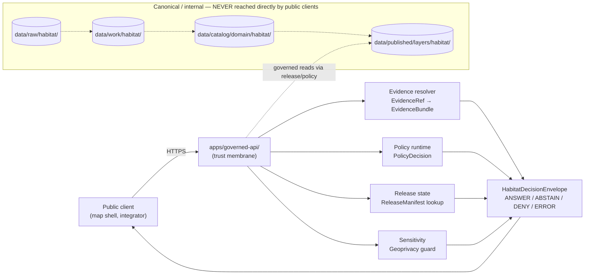
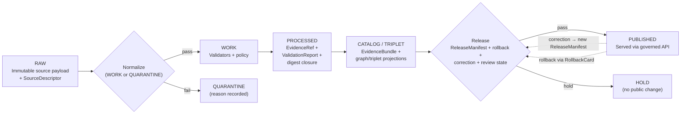

<!-- [KFM_META_BLOCK_V2]
doc_id: kfm://doc/habitat-api-contracts
title: Habitat — API Contracts
type: standard
version: v1
status: draft
owners: <habitat-steward>            # TODO confirm against docs/governance/ steward charters
created: 2026-05-17
updated: 2026-06-05
policy_label: public
related:
  - docs/domains/habitat/README.md
  - docs/domains/habitat/MAP_UI_CONTRACTS.md
  - docs/domains/habitat/SOURCES.md
  - docs/domains/habitat/SENSITIVITY.md
  - docs/domains/habitat/sublanes/ecoregions.md
  - docs/domains/habitat/sublanes/suitability.md
  - docs/domains/habitat/sublanes/restoration.md
  - docs/architecture/governed-api.md
  - docs/architecture/contract-schema-policy-split.md
  - contracts/domains/habitat/
  - schemas/contracts/v1/domains/habitat/
  - policy/domains/habitat/
  - ai-build-operating-contract.md
tags: [kfm, habitat, api, contracts, governed-api, decision-envelope]
notes:
  - CONTRACT_VERSION = "3.0.0"
  - All repo-path claims are PROPOSED until verified against a mounted repo.
  - HabitatDecisionEnvelope is a PROPOSED per-domain extension of the master DecisionEnvelope grammar (Atlas v1.1 §24.3).
  - Exact governed-API route paths remain UNKNOWN per Atlas §6.J.
  - "CONFLICTED schema-home slug: Directory Rules §12 uses schemas/contracts/v1/domains/habitat/ (segmented); Atlas §24.13 crosswalk uses schemas/contracts/v1/habitat/ (flat). ADR-required; see §16."
[/KFM_META_BLOCK_V2] -->

# Habitat — API Contracts

> Semantic contract reference for the **governed API surfaces** that serve the Habitat lane — feature lookup, layer manifests, evidence resolution, Focus Mode, correction intake, and review queues — with their finite outcomes, reason codes, and trust obligations.

[](#1-purpose-and-scope)
[](#0-quick-jump)
[](#12-sensitivity-rights-and-public-safe-derivatives)
[](#14-lifecycle-and-release-gates)
[](#16-directory-placement-and-schema-homes)
[](#)
[](#)

**Status:** `draft` &nbsp;·&nbsp; **Owners:** `<habitat-steward>` _(TODO confirm)_ &nbsp;·&nbsp; **Updated:** `2026-06-05` &nbsp;·&nbsp; **Lane:** `habitat` &nbsp;·&nbsp; **Authority:** standard doc — _not authoritative_; canonical truth lives in the canonical schema home, `policy/...`, and resolved `EvidenceBundle`.

> [!IMPORTANT]
> This file **documents** the Habitat governed-API surfaces. It is not a schema, a route registration, or a policy bundle. Machine-checkable shape lives under the canonical Habitat schema home (**ADR-0001**; see the §16 slug conflict); admissibility lives under `policy/domains/habitat/`; service-side semantics live under `contracts/domains/habitat/`. Any conflict between this document and those authorities resolves in favor of those authorities, and the drift is filed against this file in `docs/registers/DRIFT_REGISTER.md`. `CONTRACT_VERSION = "3.0.0"`.

---

## 0. Quick jump

1. [Purpose and scope](#1-purpose-and-scope)
2. [Trust-membrane principle](#2-trust-membrane-principle)
3. [Surface inventory](#3-surface-inventory)
4. [`HabitatDecisionEnvelope` grammar](#4-habitatdecisionenvelope-grammar)
5. [Feature / detail resolver](#5-feature--detail-resolver)
6. [Layer manifest resolver](#6-layer-manifest-resolver)
7. [Evidence Drawer payload](#7-evidence-drawer-payload)
8. [Focus Mode (governed AI)](#8-focus-mode-governed-ai)
9. [Correction submit](#9-correction-submit)
10. [Review decision](#10-review-decision)
11. [Source-role anti-collapse rules](#11-source-role-anti-collapse-rules)
12. [Sensitivity, rights, and public-safe derivatives](#12-sensitivity-rights-and-public-safe-derivatives)
13. [Cross-lane request constraints](#13-cross-lane-request-constraints)
14. [Lifecycle and release gates](#14-lifecycle-and-release-gates)
15. [Validators, tests, and fixtures](#15-validators-tests-and-fixtures)
16. [Directory placement and schema homes](#16-directory-placement-and-schema-homes)
17. [Open questions and verification backlog](#17-open-questions-and-verification-backlog)
18. [Related docs](#18-related-docs)

---

## 1. Purpose and scope

> `CONFIRMED doctrine / PROPOSED implementation.` _[DOM-HAB §A], [DOM-HF], [ENCY §7.4]._

The Habitat lane governs **`HabitatPatch`, `LandCoverObservation`, `EcologicalSystem`, `HabitatQualityScore`, `SuitabilityModel`, `ConnectivityEdge`, `Corridor`, `RestorationOpportunity`, `StewardshipZone`, `ModelRunReceipt`, and `UncertaintySurface`**, plus their **public-safe derivatives**. This document specifies the **governed-API surfaces** through which those objects are consumed — by the map shell, by Focus Mode, by review consoles, and by external integrators.

**This file covers**

- The **finite-outcome envelopes** returned by every Habitat governed surface.
- The **DTO shapes** the surfaces speak — referencing, not redefining, the canonical Habitat schemas.
- The **reason codes**, **obligations**, and **trust badges** that accompany each outcome.
- The **cross-lane discipline** Habitat APIs must preserve toward Fauna, Flora, Soil, Hydrology, Hazards, and Archaeology.

**This file does not cover**

- **Wire format mechanics** (HTTP verbs, status codes, content negotiation, pagination semantics). Those belong to `docs/architecture/governed-api.md` _(`PROPOSED`)_.
- **Machine schemas.** Those live under the canonical Habitat schema home (see §16; slug `CONFLICTED`).
- **Map and UI rendering of these payloads.** That belongs to `docs/domains/habitat/MAP_UI_CONTRACTS.md` _(`PROPOSED`)_.
- **Source descriptors and harvest mechanics.** Those belong to `docs/domains/habitat/SOURCES.md` _(`PROPOSED`)_ and the Habitat source-refresh runbook.

[Back to top](#habitat--api-contracts)

---

## 2. Trust-membrane principle

> `CONFIRMED doctrine.` _[DIRRULES §7.1], [ENCY §J], [UIAI], [KFM-IDX-API-001]._

Public clients and normal UI surfaces consume Habitat data **only** through the governed API — never by reading `data/raw/`, `data/work/`, `data/quarantine/`, `data/processed/`, or the canonical catalog directly. The governed API is the **only** place where `release_state`, `PolicyDecision`, `EvidenceBundle` resolution, `rights_status`, and `sensitivity` are enforced before a payload leaves the trust spine.



Co-location does not relax the membrane: a server-side renderer that runs in the same monorepo as the canonical store is still a governed-API client. The governed API is what enforces release state, policy decisions, evidence references, and rights posture **before** any payload leaves the trust spine, and is the only place AI fluency can be prevented from substituting for evidence.

> [!CAUTION]
> **The trust membrane is not advisory.** A Habitat surface that bypasses the governed API — or that returns an object whose `EvidenceRef` set has not resolved — is a doctrinal violation, not a tradeoff. Map shells, embedded widgets, server-side renderers, and CLI clients are all governed-API clients, even when co-located in the same repository.

[Back to top](#habitat--api-contracts)

---

## 3. Surface inventory

> `PROPOSED governed-API surfaces; exact routes UNKNOWN.` _Routes are `PROPOSED` until verified against a mounted repo and recorded in an ADR. Per [DOM-HAB §J], [ENCY §J], [ENCY §24.3.2], and §20.3._

The Habitat lane exposes the surfaces below. Outcome columns follow the master outcome × surface mapping at Atlas v1.1 §24.3.2.

| Surface | DTO / schema | Outcomes | Status |
|---|---|---|---|
| Habitat feature / detail resolver | `HabitatFeatureEnvelope` wrapping `HabitatDecisionEnvelope` + `EvidenceRef[]` | `ANSWER` · `ABSTAIN` · `DENY` · `ERROR` | `PROPOSED` |
| Habitat layer manifest resolver | `LayerManifest` (domain-bound) | `ANSWER` · `DENY` · `ERROR` | `PROPOSED` — released artifacts only; §24.3.2 forbids `ABSTAIN` here |
| Habitat Evidence Drawer payload | `EvidenceDrawerPayload` + `EvidenceBundle` projection | `ANSWER` · `ABSTAIN` · `DENY` · `ERROR` | `PROPOSED` — evidence- and policy-filtered |
| Habitat Focus Mode answer | `FocusModeRequest` → `FocusModeResponse` + `AIReceipt` (carried inside `RuntimeResponseEnvelope`) | `ANSWER` · `ABSTAIN` · `DENY` · `ERROR` | `PROPOSED` — AI is interpretive, never root truth |
| Habitat correction submit | `CorrectionNoticeCandidate` | `ACCEPTED` · `HOLD` · `DENY` · `ERROR` | `PROPOSED` — steward-routed |
| Habitat review decision | `ReviewRecord` + `PolicyDecision` | `ALLOW` · `RESTRICT` · `DENY` · `HOLD` · `ERROR` | `PROPOSED` — separation-of-duties applies for sensitive items |
| Habitat source summary resolver | `SourceDescriptor` projection | `ANSWER` · `ABSTAIN` · `DENY` · `ERROR` | `PROPOSED` — never returns raw source bytes |

> [!NOTE]
> The HTTP route shapes shown later in this document (e.g., `GET /api/v1/domains/habitat/features/{id}`) are **illustrative**, following the master surface pattern at [ENCY §J] and [ENCY §20.3]. Final paths require an ADR before merge.

[Back to top](#habitat--api-contracts)

---

## 4. `HabitatDecisionEnvelope` grammar

> `PROPOSED` per-domain extension of the master `DecisionEnvelope` grammar. _[ENCY §24.3], [GAI], [DOM-HAB §J], [KFM-IDX-API-002]._

Every Habitat governed surface returns a `HabitatDecisionEnvelope`. The envelope inherits the master outcome enum and reason-code discipline; **domain-specific** reason codes appear in §11 (source-role anti-collapse), §12 (sensitivity), and §14 (lifecycle), and are summarized in the §17 reason-code register.

> [!NOTE]
> The master `DecisionEnvelope` minimal shape (Atlas §24.3, `KFM-P5-PROG-0001`) is `{ decision_id, outcome, policy_family, reasons[], obligations[], evaluated_at }`, with a suggested cross-cutting home of `schemas/contracts/v1/runtime/decision_envelope.schema.json`. The fields below are the Habitat **extension** of that minimal shape; the extra fields are `PROPOSED`.

| Field | Required | Notes |
|---|---|---|
| `decision_id` | yes | Stable identifier; supports audit, replay, and rollback drill. |
| `outcome` | yes | One of `ANSWER`, `ABSTAIN`, `DENY`, `ERROR` for caller-facing envelopes. Validator-internal checks additionally use `PASS`, `FAIL`; release/review surfaces use `HOLD` (and `ALLOW`/`RESTRICT` on the review queue) per Atlas §24.3.1–§24.3.2. |
| `domain` | yes | Constant: `"habitat"`. |
| `policy_family` | yes | E.g. `habitat.public_release`, `habitat.source_role`, `habitat.sensitivity`, `habitat.rights`. |
| `reasons` | yes when `outcome != ANSWER` | Reason codes (see §17). Examples: `missing_evidence`, `unresolved_evidence_ref`, `source_role_collapse`, `modeled_as_critical_denied`, `restricted_exact_geometry`, `stale_evidence`, `unknown_rights`, `review_pending`. |
| `obligations` | yes when `outcome == ANSWER`; allowed on `HOLD` | E.g. `generalize:to_watershed`, `redact:exact_geometry`, `hold:steward_review`, `display:trust_badge:modeled`. |
| `evidence_refs` | yes when `outcome == ANSWER` | Resolved `EvidenceRef[]`; each must resolve to a closed `EvidenceBundle`. |
| `policy_decision_ref` | yes | Pointer to the underlying `PolicyDecision`. |
| `citation_validation_ref` | yes when `ANSWER` is publicly emitted | Pointer to `CitationValidationReport`. |
| `release_state` | yes | `PUBLISHED` is the only valid value for public callers. Anything else surfaced to a public caller is itself a `DENY`. |
| `source_role` | yes when payload describes a `HabitatPatch`, `LandCoverObservation`, `SuitabilityModel`, `EcologicalSystem`, etc. | One of `observed` / `regulatory` / `modeled` / `aggregate` / `administrative` / `candidate` / `synthetic` per Atlas §24.1. See §11. |
| `rights_status` | yes | E.g. `open`, `attribution`, `restricted`, `unknown`. The last forces `DENY` for public callers. |
| `sensitivity_tier` | yes | `T0` / `T1` / `T2` / `T3` / `T4` per Atlas §24.5. |
| `evaluated_at` | yes | ISO 8601 timestamp. |
| `rollback_target` | yes | Pointer to the prior `ReleaseManifest` and its root hash. |

> [!NOTE]
> The Atlas marks the envelope and its exact field set as **`PROPOSED`** at [DOM-HAB §J]. The shape above synthesizes the master `DecisionEnvelope` grammar with Habitat-specific obligations and reason codes. Final field names, JSON Schema, and route binding are subject to ADR review and live under the canonical Habitat schema home as `.../habitat/decision_envelope.schema.json` _(`PROPOSED` path; slug `CONFLICTED` per §16)_.

[Back to top](#habitat--api-contracts)

---

## 5. Feature / detail resolver

> `PROPOSED governed-API surface.` _[ENCY §J], [DOM-HAB §J]._

Resolves a single Habitat feature — `HabitatPatch`, `LandCoverObservation`, `EcologicalSystem`, `HabitatQualityScore`, `SuitabilityModel`, `ConnectivityEdge`, `Corridor`, `RestorationOpportunity`, `StewardshipZone`, `ModelRunReceipt`, or `UncertaintySurface` — to a public-safe envelope.

**PROPOSED route:** `GET /api/v1/domains/habitat/features/{id}`

**Behavior**

1. Resolve `id` against the **published** lane only (`release_state == PUBLISHED`); unreleased candidates return `DENY` with reason `not_released`.
2. Resolve every claim-bearing `EvidenceRef` to a closed `EvidenceBundle`. Unresolved or stale evidence → `ABSTAIN` with reason `unresolved_evidence_ref` or `stale_evidence`.
3. Apply policy (rights, sensitivity, source-role anti-collapse). Sensitive geometry — e.g., a patch joined to a T3/T4 occurrence — → `DENY` with reason `restricted_exact_geometry`, optionally accompanied by an obligation pointing at a generalized public-safe layer.
4. Preserve the **source-role label** on every emitted object. Never elide it; never relabel modeled output as observation or as regulatory.

**Illustrative envelope** _(`PROPOSED`; orientation only)_

```jsonc
{
  "decision_id": "hab-feat-0001",
  "outcome": "ANSWER",
  "domain": "habitat",
  "policy_family": "habitat.public_release",
  "obligations": [
    "display:trust_badge:modeled",
    "display:trust_badge:freshness:2024-09"
  ],
  "evidence_refs": [
    "evidence://kfm/habitat/patch/2024-09/abcd1234",
    "evidence://kfm/habitat/landcover/nlcd-2021/efgh5678"
  ],
  "policy_decision_ref": "policy://kfm/decision/2026-05-17/9f3c",
  "citation_validation_ref": "cite://kfm/report/2026-05-17/7b2a",
  "release_state": "PUBLISHED",
  "source_role": "modeled",
  "rights_status": "open",
  "sensitivity_tier": "T0",
  "evaluated_at": "2026-05-17T12:00:00Z",
  "rollback_target": "release://kfm/habitat/2026-05-10/v1",
  "feature": {
    "feature_type": "HabitatPatch",
    "id": "habitat:patch:ks-2024:abcd1234",
    "geometry_ref": "tiles://kfm/habitat/patches/v1/{z}/{x}/{y}.pbf",
    "ecological_system_ref": "habitat:ecosystem:tallgrass-prairie",
    "habitat_quality_score_ref": "habitat:quality_score:abcd1234@v1",
    "uncertainty_surface_ref": "habitat:uncertainty:patch:abcd1234@v1",
    "model_run_receipt_ref": "receipt://kfm/habitat/run/2024-09/abcd1234",
    "valid_time": { "start": "2024-01-01", "end": "2024-12-31" },
    "observed_time": null,
    "release_time": "2026-05-10T00:00:00Z"
  }
}
```

> [!NOTE]
> `HabitatQualityScore`, `UncertaintySurface`, and `ModelRunReceipt` are **separate canonical object families** per [DOM-HAB §E]. A `HabitatPatch` references them; it does not inline them. The references above (`habitat_quality_score_ref`, `uncertainty_surface_ref`, `model_run_receipt_ref`) preserve that boundary at the API layer.

> [!WARNING]
> **Do not return raw geometry directly when the feature is joined to T4 occurrence evidence.** Return the public-safe derivative (generalized polygon, watershed-scale aggregate) or `DENY` with a pointer to a generalized layer. See §12.

[Back to top](#habitat--api-contracts)

---

## 6. Layer manifest resolver

> `PROPOSED governed-API surface.` _[ENCY §J], [ENCY §24.3.2], [DOM-HAB §J], [MAP-MASTER]._

Returns the `LayerManifest` for a Habitat map layer — habitat-patch overlay, suitability surface, connectivity/corridor view, restoration opportunity, uncertainty mode, sensitivity-redacted mode, habitat-fauna join view. Map shells consume these manifests to build MapLibre sources and layers; the manifest binds the rendered layer to its governed source and evidence semantics.

**PROPOSED route:** `GET /api/v1/layers/{layer_id}/manifest`

> [!NOTE]
> This surface returns `ANSWER` / `DENY` / `ERROR` only — it does **not** `ABSTAIN`. Per Atlas §24.3.2, a layer either resolves to a released manifest or is denied; there is no non-substantive layer answer.

**Required behavior**

| Requirement | Specification |
|---|---|
| Release gating | Only layers with a current `ReleaseManifest` resolve to `ANSWER`. Unreleased or held layers → `DENY` (`not_released` / `release_held`). |
| Identity binding | The manifest carries `layer_id`, `source_id`, `source_layer`, `evidence_ref_field`, `temporal_fields`, `policy_label`, and `release_state` — per the Master MapLibre `LayerManifest` shape. |
| Trust badging | The manifest declares **source-role badges** (`observed` / `regulatory` / `modeled` / `aggregate`), **freshness**, **uncertainty**, **sensitivity**, **rights**, and **review state**. |
| Sensitivity discipline | A sensitive layer is **not delivered as a tile and then style-hidden**. Sensitive geometry denials happen at manifest and tile-artifact level; style-only hiding is a doctrinal violation. |
| Rollback | Every `LayerManifest` carries a `rollback_target` (prior `ReleaseManifest` and root hash). |
| Style binding | Style identity and dependencies are carried separately in `StyleManifest`; the layer manifest references the style by id and digest, never by inlined CSS-like predicates. |

> [!IMPORTANT]
> **Regulatory critical habitat is `regulatory`, not `modeled`.** A USFWS critical-habitat designation is an authoritative determination; a habitat-suitability raster from a fitted model is a `modeled` product. The two are not interchangeable in the `LayerManifest`. Mislabeling either is a `source_role_collapse` denial (§11).

[Back to top](#habitat--api-contracts)

---

## 7. Evidence Drawer payload

> `PROPOSED governed-API surface.` _[MAP-MASTER], [DOM-HAB §J], [ENCY §J]._

When a user clicks or selects a Habitat feature, the map shell requests an `EvidenceDrawerPayload`. The payload is the **single public-safe view** of a feature's evidence — citations, source roles, policy state, release state, limitations.

**PROPOSED route:** `GET /api/v1/evidence/{evidence_ref}`

**Payload shape** _(illustrative; `PROPOSED`)_

| Field | Notes |
|---|---|
| `feature_id` | The selected feature. |
| `layer_id` | The owning layer. |
| `evidence_bundle_refs` | One or more `EvidenceBundle` projections. |
| `source_summary` | Source families, source roles, rights, attribution requirements — e.g., USFWS ECOS, KDWP review context, NLCD, NWI, GAP/LANDFIRE, NatureServe, GBIF/iNaturalist/iDigBio, PAD-US. |
| `citations` | Resolved, validated citations; uncited claim text is never emitted. |
| `policy_state` | Active `PolicyDecision`(s); obligations carried through to the drawer. |
| `release_state` | Must be `PUBLISHED` for public callers. |
| `limitations` | Source-role caveats, model uncertainty notes, temporal-scope caveats. |
| `correction_link` | Route into the correction-submit surface (§9). |

> [!NOTE]
> The drawer renders a **bounded view of evidence** — it is not the evidence store. A drawer that displays a claim without a citation is a `citation_validation_failed` denial. Atlas §24.3.2 additionally forbids returning a drawer payload that includes restricted geometry.

[Back to top](#habitat--api-contracts)

---

## 8. Focus Mode (governed AI)

> `CONFIRMED doctrine / PROPOSED implementation.` _[GAI], [DOM-HAB §L], [UIAI]._

Focus Mode lets a user ask a bounded question about Habitat features. AI is **interpretive, not authoritative**: the model may summarize released `EvidenceBundle`s, compare evidence, explain limitations, and draft steward-review notes. It may not invent claims, replace evidence, or front-run release state.

### 8.1 Required behavior

| Behavior | Rule |
|---|---|
| Required answer mode | `ANSWER` only when evidence is sufficient, citations validate, source roles do not conflict, temporal scope is adequate, and policy permits. |
| Required abstention | `ABSTAIN` when `EvidenceBundle` is missing, citations cannot be validated, source roles conflict, temporal scope is insufficient, evidence is stale and no released alternative is found, or the question requests unsupported inference. |
| Required denial | `DENY` on direct `RAW` / `WORK` / `QUARANTINE` access requests; on sensitive-location exposure (`T3` / `T4`); on emergency-alerting replacement; on uncited authoritative claims; on any path that would substitute model output for a release decision. |
| Receipt | Every Focus Mode response emits `AIReceipt` and `RuntimeResponseEnvelope` with `outcome ∈ { ANSWER, ABSTAIN, DENY, ERROR }`, `evidence_refs`, `policy_decision`, and `citation_validation`. **No raw chain-of-thought is persisted as truth.** |

### 8.2 Habitat-specific denial cases

| Case | Trigger | Outcome | Reason code |
|---|---|---|---|
| Modeled-as-critical | A Focus question that would let the AI surface present a `SuitabilityModel` raster as Regulatory critical habitat. | `DENY` | `modeled_as_critical_denied` |
| Cross-lane occurrence leakage | A Focus question that asks Habitat to expose Fauna occurrence detail beyond its public-safe derivative. Habitat does not own occurrence truth. | `DENY` | `cross_lane_occurrence_leak` |
| Emergency-alert framing | A Focus question that asks the AI to characterize a habitat condition as an emergency alert; KFM is never an alert authority. | `DENY` | `emergency_alert_substitution` |
| Synthetic-as-observed | A Focus answer that would present AI-drafted or reconstructed content without a Reality Boundary Note. | `DENY` or `ABSTAIN` | `synthetic_as_observed_denied` |

> [!CAUTION]
> **Focus Mode does not call a model client from the browser.** Focus Mode requests pass through `apps/governed-api/` (or an equivalent governed-AI route), behind evidence resolution and policy checks. The browser cannot reach the model runtime directly. _[MAP-MASTER], [UIAI]; PROPOSED route._

[Back to top](#habitat--api-contracts)

---

## 9. Correction submit

> `PROPOSED governed-API surface.` _[ENCY §J], [ENCY Appendix E]._

Allows a user, steward, or reviewer to submit a `CorrectionNoticeCandidate` against a published Habitat feature, layer, or release. Corrections are how the lane stays correctable without bypassing the trust spine.

**PROPOSED route:** `POST /api/v1/corrections`

**Outcomes**

| Outcome | When |
|---|---|
| `ACCEPTED` | The candidate is well-formed, attaches sufficient evidence, and enters the review queue. Acceptance does not modify the public surface. |
| `HOLD` | The candidate is well-formed but the steward must review evidence or sensitivity before next action. |
| `DENY` | The candidate is malformed, lacks evidence, or attempts to bypass the trust spine — e.g., asks for silent re-publication without rollback, or to overwrite a prior `ReleaseManifest` rather than supersede it. |
| `ERROR` | Infrastructure failure or contract violation. |

**Required attachments** _(`PROPOSED`)_

- An `EvidenceRef` set supporting the proposed correction.
- The `feature_id` / `layer_id` / `release_id` being corrected.
- A free-text reason and a structured `reason_code` from the §17 register where applicable.
- Sensitivity self-classification by the submitter; the steward's `PolicyDecision` is authoritative.

> [!NOTE]
> **Corrections never rewrite the prior release silently.** A successful correction produces a new `ReleaseManifest` referencing its predecessor; downstream derivatives (layers, drawer payloads, AI receipts) are invalidated and re-resolved. Rollback uses the `RollbackCard` attached to the prior `ReleaseManifest`.

[Back to top](#habitat--api-contracts)

---

## 10. Review decision

> `PROPOSED governed-API surface.` _[ENCY §J], [ENCY §24.3]._

Steward / reviewer surface to record a `ReviewRecord` and its associated `PolicyDecision` for sensitive or release-significant Habitat items — for example, a habitat polygon joined to a `T4` species occurrence, a `StewardshipZone` requiring a named-party agreement, a `SuitabilityModel` re-release with material changes, or a Habitat × Fauna thin-slice promotion.

**PROPOSED route:** `POST /api/v1/review/{queue}/{id}/decision`

**Outcomes:** `ALLOW` · `RESTRICT` · `DENY` · `HOLD` · `ERROR`.

**Queues** _(`PROPOSED`)_

| Queue | Scope |
|---|---|
| `habitat/promotion` | Catalog → Published gate for habitat layers and release candidates. |
| `habitat/sensitive-join` | Habitat × Fauna or Habitat × Flora joins where the resulting view touches `T3` / `T4` posture. |
| `habitat/model-card` | `SuitabilityModel` and other modeled-product releases requiring a model-card review. |
| `habitat/correction` | Inbound `CorrectionNoticeCandidate` review. |
| `habitat/rollback` | Rollback-card execution for a prior `ReleaseManifest`. |

> [!IMPORTANT]
> **Separation of duties applies** when materiality justifies it: the reviewer recording the `ReviewRecord` MUST NOT be the same actor who promoted the underlying release candidate. Mixing review and publication duties on the same actor is itself a `DENY` (`separation_of_duties_violated`).

[Back to top](#habitat--api-contracts)

---

## 11. Source-role anti-collapse rules

> `CONFIRMED doctrine.` _[ENCY §24.1], [DOM-HAB §D], [DOM-HF]._

Habitat is one of the lanes most at risk for source-role collapse, because the same geographic footprint may be addressed by:

- A **regulatory** designation — e.g., a USFWS critical-habitat unit.
- A **modeled** product — e.g., MaxEnt suitability raster, GAP / LANDFIRE classification, fitted `HabitatQualityScore`.
- An **observed** sample — e.g., a field survey at a point.
- An **aggregate** publication — e.g., a county-level land-cover summary.
- A **candidate** record — e.g., a quarantined connector output not yet promoted.
- A **synthetic** product — e.g., an AI-drafted summary or a reconstructed historical scene.

The governed API **must preserve these roles** end-to-end. The envelope's `source_role` field is not optional. Atlas §24.1.1 names this rule directly: _promotion does not upgrade an observation to a regulation, or a model to an aggregate, or a candidate to a verified record._

### 11.1 Habitat-specific DENY conditions

| Collapse pattern | Domain example | Denied outcome | Required guardrail |
|---|---|---|---|
| `SuitabilityModel` returned or queried as Regulatory critical habitat. | A suitability raster relabeled as a designation. | `DENY` (`modeled_as_critical_denied`) at publication and Focus Mode. | Run receipt + uncertainty surface + role-preserving DTO field; trust badge `modeled`. |
| Regulatory designation returned or queried as an observation. | A critical-habitat polygon relabeled as a field record. | `DENY` (`regulatory_as_observed_denied`). | Separate regulatory and observation lanes; UI banner; release-manifest source-role pin. |
| Aggregate land cover cited as a per-place truth. | A county-level land-cover summary attached to a single feature. | `DENY` (`aggregate_as_perplace_denied`); `ABSTAIN` at Focus Mode. | Aggregation receipt; geometry-scope guard; matrix-cell semantics. |
| Candidate (e.g., quarantined connector output) presented as published. | A quarantined NLCD-derived patch served as `ANSWER`. | `DENY` (`candidate_as_published_denied`). | Release-state pin to `PUBLISHED`. |
| Synthetic content returned as observed reality. | An AI-drafted patch summary presented without a Reality Boundary Note. | `DENY` (`synthetic_as_observed_denied`); `ABSTAIN` at Focus Mode. | Reality Boundary Note + Representation Receipt. |

> [!WARNING]
> **Promotion does not upgrade a source role.** A modeled product never becomes regulatory by passing through the lifecycle; a candidate never becomes observed; an aggregate never becomes a per-place record. Each is a separate governed transition with its own evidence and review requirements.

[Back to top](#habitat--api-contracts)

---

## 12. Sensitivity, rights, and public-safe derivatives

> `CONFIRMED doctrine / PROPOSED implementation.` _[DOM-HAB §I], [DOM-HF], [ENCY §24.5]._

Habitat lies adjacent to species-occurrence sensitivity. Even when Habitat does not own occurrence truth, **a habitat-evidence response that reveals or implies sensitive occurrence location must fail closed**. Regulatory critical habitat, modeled habitat, species range, occurrence points, and landscape context **must not be flattened**. _[DOM-HAB §I]._

### 12.1 Default sensitivity tiers

| Object class | Default tier | Allowed transforms (`PROPOSED`) | Required gates |
|---|---|---|---|
| `HabitatPatch` (general, non-sensitive context) | `T0` | None. | Standard release. |
| `EcologicalSystem` (e.g., tallgrass prairie polygon) | `T0` | None. | Standard release. |
| `HabitatPatch` × `T4` occurrence join | `T4` (the join itself; the un-joined patch remains `T0`) | Generalize to watershed / county; aggregate; suppress the join. | `RedactionReceipt` + `ReviewRecord` + `PolicyDecision`. |
| `StewardshipZone` (named-party detail) | `T1` typical; `T2` / `T3` for restricted detail | Generalize footprint; suppress dependency. | Steward review + `RedactionReceipt`. |
| Modeled habitat output with insufficient support | `T1` until support is verified | Aggregate; require an uncertainty surface; require a model card. | Model-card review. |
| Sensitive occurrence-implying habitat surface | `T4` | Geoprivacy generalization → `T1`; never delivered at original precision. | `RedactionReceipt` + `ReviewRecord` + `PolicyDecision`. |
| `RAW` / `WORK` / `QUARANTINE` access via the API | `T4` forever | None — public and AI surfaces never read pre-release content. | Trust membrane (§2). |

Tier transitions follow the master motion table at Atlas §24.5.3: upgrades toward public require **both** a transform receipt and a review record; downgrades to `T4` are always permitted via `CorrectionNotice` alone.

### 12.2 Style-only hiding is not redaction

> [!CAUTION]
> **Hiding a sensitive habitat feature with a MapLibre style filter while still serving the underlying tile is not an acceptable transform.** The deny happens at the **API and tile-artifact** level (per the Master MapLibre sensitive-geometry-deny pattern). Style is presentation, not policy.

### 12.3 Rights and freshness

- `rights_status == "unknown"` → `DENY` for public callers; the public envelope cannot answer with unresolved terms.
- `rights_status == "restricted"` → response is gated to authorized callers under a named-party agreement; the envelope carries `RESTRICT` on the review-queue surface and `DENY` on the public surface.
- Sources whose **terms** are time-limited (e.g., licensed biodiversity feeds — `NEEDS VERIFICATION` per [DOM-HAB §D]) must surface a freshness-bounded `release_state` and may force `ABSTAIN` in Focus Mode after expiry.

[Back to top](#habitat--api-contracts)

---

## 13. Cross-lane request constraints

> `CONFIRMED doctrine.` _[DOM-HAB §F], [ENCY §24.4]._

Habitat API responses must preserve cross-lane ownership boundaries. Requests that would relabel another lane's object as Habitat — or vice versa — are policy violations.

| Related lane | Relation type | API constraint |
|---|---|---|
| Fauna | Habitat assignment + occurrence context, with geoprivacy. | Habitat API returns habitat **context** for an occurrence id; **occurrence truth resolves through the Fauna API.** Sensitive-occurrence redaction defaults to deny. |
| Flora | Vegetation-community + rare-plant context. | Habitat API may cite vegetation-community evidence; rare-plant location detail is **Flora-controlled** and defaults to `T4`. |
| Soil / Hydrology | Substrate, moisture, wetlands, riparian support. | Habitat API may cite Soil / Hydrology evidence but does not own it; canonical truth resolves through those domains. |
| Hazards | Fire, drought, flood, smoke, resilience-stress context. | Habitat API may cite hazard context; **KFM is never an alert authority** — emergency-alert framing → `DENY`. |
| Archaeology | Landscape context only. | Sovereignty / sensitivity review required; deny-default applies to any join that would expose archaeological site detail. |
| Agriculture | Land-cover and stewardship context. | Habitat API may cite aggregate agricultural context only; per-place crop or yield records resolve through the Agriculture API. |

> [!IMPORTANT]
> **Public-safe joins only.** A Habitat × Fauna join that returns exact sensitive-occurrence geometry — even when both items are technically public at their own surfaces — is a `cross_lane_sensitivity_join` denial.

[Back to top](#habitat--api-contracts)

---

## 14. Lifecycle and release gates

> `CONFIRMED doctrine / PROPOSED lane application.` _[DIRRULES §9], [DOM-HAB §H], [ENCY §24.6]._

Every Habitat object follows the invariant `RAW → WORK / QUARANTINE → PROCESSED → CATALOG / TRIPLET → PUBLISHED`. Promotion is a **governed state transition, not a file move**. The governed API serves released artifacts only.



| Gate | Pre-condition | Required artifacts | Failure-closed outcome |
|---|---|---|---|
| Admission (— → `RAW`) | Source identity, role, and rights are minimally established. | `SourceDescriptor`; payload / reference hash. | Source not admitted; logged as candidate. |
| Normalization (`RAW` → `WORK` / `QUARANTINE`) | Schema, geometry, time, identity, evidence, rights, and policy rules are runnable. | `TransformReceipt`; working `ValidationReport`; `PolicyDecision`; quarantine reason on failure. | Quarantine with reason; never silent promotion. |
| Validation (`WORK` → `PROCESSED`) | Validators are deterministic and bound to fixtures. | `ValidationReport` pass; `RedactionReceipt` if sensitivity applies; `AggregationReceipt` if applies. | Stay in `WORK`; structured `FAIL`. |
| Catalog closure (`PROCESSED` → `CATALOG` / `TRIPLET`) | `EvidenceRef`s resolve; digests close. | `CatalogMatrix` entry; `EvidenceBundle`; graph projections if applicable. | `HOLD` at `PROCESSED`; no public edge. |
| Release (`CATALOG` / `TRIPLET` → `PUBLISHED`) | `ReviewRecord` where required; release authority distinct from author when material. | `ReleaseManifest`; rollback target; correction path. | `HOLD` at `CATALOG`; no public surface change. |
| Correction (`PUBLISHED` → `PUBLISHED′`) | Detected error or new evidence; downstream derivatives identified. | `CorrectionNotice`; new `ReleaseManifest`; downstream-invalidation receipt. | `DENY` publication of correction without invalidating derivatives. |
| Rollback (`PUBLISHED` → prior state) | A `RollbackCard` is attached to the prior `ReleaseManifest`. | Executed `RollbackCard`; receipt. | No silent rollback. |

> [!NOTE]
> The **watcher-as-non-publisher** invariant applies. Habitat watchers (e.g., NLCD-version detectors, critical-habitat-service drift detectors) emit candidates and receipts; they **never** write directly to `data/catalog/` or `data/published/`. Their output is not exposed through governed APIs until a separate promotion runs.

[Back to top](#habitat--api-contracts)

---

## 15. Validators, tests, and fixtures

> `PROPOSED implementation.` _[DOM-HAB §K], [ENCY §24.7], [ENCY §20.4], [KFM-IDX-VAL-001], [KFM-IDX-VAL-002]._

The contracts above are enforced by the following validator and test families. All paths are `PROPOSED` until verified against a mounted repo.

| Test family | Habitat-specific negative case | Expected outcome |
|---|---|---|
| Schema validation | Envelope missing `source_role` or with an unknown enum value. | `FAIL`; envelope → `ERROR`. |
| Source-descriptor validation | Habitat source without role / rights / cadence. | `DENY` at admission. |
| Source-role anti-collapse | `SuitabilityModel` payload presented under a `regulatory` `source_role`. | `DENY` (`source_role_collapse` / `modeled_as_critical_denied`). |
| Critical-habitat source-role | USFWS critical-habitat polygon admitted under `modeled`. | `DENY` at admission; quarantine. |
| Modeled-as-critical denial | Suitability raster requested via a critical-habitat resolver. | `DENY` at runtime. |
| Occurrence geoprivacy | Habitat patch joined to a `T4` occurrence returned with exact geometry. | `DENY` (`restricted_exact_geometry`). |
| Sensitive geometry deny (MapLibre) | Sensitive habitat layer served as a tile and then style-hidden. | `DENY` at manifest / tile-artifact level. |
| Citation validation | Public `ANSWER` without resolved citations. | `DENY` (`citation_validation_failed`). |
| Evidence closure | `EvidenceRef` does not resolve to a closed `EvidenceBundle`. | `ABSTAIN` (`unresolved_evidence_ref`). |
| Temporal logic | Out-of-window query against a habitat snapshot. | `ABSTAIN` (`out_of_window`). |
| Release-manifest closure | Layer served without a current `ReleaseManifest`. | `DENY` (`not_released` / `release_held`). |
| Rollback drill | Rollback fails to invalidate downstream `EvidenceDrawerPayload` cache. | `FAIL`; rollback aborted. |
| No-network fixture | Habitat × Fauna thin-slice fixture (one public-safe occurrence-to-habitat assignment). | `ANSWER` for the public-safe path; `DENY` for the sensitive-detail path. |
| Cross-lane occurrence join | Public Habitat surface that exposes Fauna sensitive-occurrence detail. | `DENY` (`cross_lane_sensitivity_join`). |
| Separation of duties | Reviewer and promoter are the same actor for a material change. | `DENY` (`separation_of_duties_violated`). |
| Lifecycle boundary | Any public surface reference to `RAW` / `WORK` / `QUARANTINE` / internal store. | `DENY` / `ERROR` (per Atlas §20.4). |

> [!TIP]
> **The Habitat × Fauna thin slice** is the canonical first proof for this lane: one public-safe occurrence-to-habitat assignment using controlled fixtures, exercising `EvidenceBundle`, `LayerManifest`, `EvidenceDrawerPayload`, `FocusModeResponse`, `RuntimeResponseEnvelope`, and `RollbackCard` without touching live sensitive feeds. _[KFM-IDX-APP-002], [DOM-HF]._

[Back to top](#habitat--api-contracts)

---

## 16. Directory placement and schema homes

> `CONFIRMED doctrine / PROPOSED specific paths / CONFLICTED schema slug.` _[DIRRULES §6, §7, §9, §12], [ATLAS-v1.1 §24.13]._

The Habitat lane follows Domain Placement Law: the domain is a **segment** inside each responsibility root, never a **root itself**.

> [!IMPORTANT]
> **`CONFLICTED` — Habitat schema-home slug.** Two project authorities disagree on the Habitat schema/contract slug:
> - **Directory Rules §12** uses the **segmented** form: `schemas/contracts/v1/domains/habitat/`, `contracts/domains/habitat/`.
> - **Atlas v1.1 §24.13** crosswalk uses the **flat** form: `schemas/contracts/v1/habitat/`, `contracts/habitat/`.
>
> This document previously asserted the segmented form as "canonical per ADR-0001" without flagging the conflict; that assertion is downgraded to `PROPOSED` pending ADR resolution. ADR-0001 establishes `schemas/contracts/v1/...` as the canonical *home*, but does **not** settle the `domains/`-segment-vs-flat question for habitat. Open an entry in `docs/registers/DRIFT_REGISTER.md` and route to an ADR (cf. open ADR backlog ADR-S-01). Until resolved, treat **either** slug as `PROPOSED`; do not create both as parallel schema homes (Directory Rules §13.1 anti-pattern).

| Concern | PROPOSED responsibility root | Notes |
|---|---|---|
| This document | `docs/domains/habitat/API_CONTRACTS.md` | Standard doc; human-facing contract reference. |
| Service-side semantic contracts (Markdown) | `contracts/domains/habitat/` _or_ `contracts/habitat/` | **`CONFLICTED` slug** — see callout above. |
| Machine schemas | `schemas/contracts/v1/domains/habitat/` _or_ `schemas/contracts/v1/habitat/` | **`CONFLICTED` slug**; ADR-0001 fixes the `v1` home, not the segment. |
| Decision-envelope schema | `.../habitat/decision_envelope.schema.json` | `PROPOSED`; cross-cutting home `schemas/contracts/v1/runtime/decision_envelope.schema.json` also referenced in Atlas §24.3 — reconcile in §17 Q-10. |
| Layer-manifest schema (habitat-bound) | `.../habitat/layer_manifest.schema.json` | `PROPOSED`. |
| Evidence-drawer-payload schema (habitat-bound) | `.../habitat/evidence_drawer_payload.schema.json` | `PROPOSED`. |
| Focus-mode schemas | `schemas/contracts/v1/ai/focus_mode_*.schema.json` (cross-cutting) | Not domain-segmented. |
| Policy bundles | `policy/domains/habitat/` | `policy/` is the canonical singular. |
| Tests | `tests/domains/habitat/` | Includes negative gates from §15. |
| Fixtures | `fixtures/domains/habitat/` | No-network fixtures (Habitat × Fauna thin slice). |
| Pipelines | `pipelines/domains/habitat/` | Per-domain pipeline implementations. |
| Pipeline specs | `pipeline_specs/habitat/` | "What should run" — declarative pipeline configuration. |
| Source registry | `data/registry/sources/habitat/` | `SourceDescriptor` admission records. |
| Lifecycle data | `data/{raw,work,quarantine,processed}/habitat/`; `data/catalog/domain/habitat/`; `data/published/layers/habitat/` | Lifecycle invariant; promotion is a governed state transition. |
| Release candidates | `release/candidates/habitat/` | Pre-publication staging. |

> [!WARNING]
> **No `habitat/` root folder.** Per [DIRRULES §12], a domain MUST NOT become a top-level root with its own `data/`, `schemas/`, `policy/`, `docs/` subtree. Files belong under the responsibility-root lane pattern above. (The §24.13 *flat* slug still lives **inside** `schemas/contracts/v1/` — it is a flat lane segment there, not a new root.)

[Back to top](#habitat--api-contracts)

---

## 17. Open questions and verification backlog

> Each item should be settled by mounted-repo evidence, an ADR, a schema landing, or a thin-slice fixture run.

| # | Item | Evidence that would settle it | Status |
|---|---|---|---|
| Q-01 | Exact route paths for the seven surfaces in §3. | ADR + mounted `apps/governed-api/src/routes/`. | `UNKNOWN` |
| Q-02 | Final `HabitatDecisionEnvelope` field set, including reason-code enumeration. | Landed `.../habitat/decision_envelope.schema.json`. | `PROPOSED` |
| Q-03 | Validator exit-code contract (`PASS` / `FAIL` / `ERROR` vs OS exit codes). | ADR resolution; see open ADR referenced in `tools/README.md`. | `PROPOSED` |
| Q-04 | Rights status and cadence of every Habitat source family — USFWS ECOS, KDWP review context, NLCD, NWI, GAP / LANDFIRE, NatureServe, GBIF / iNaturalist / iDigBio, PAD-US. | Source-activation decisions in `data/registry/sources/habitat/`. | `NEEDS VERIFICATION` |
| Q-05 | Geoprivacy transform parameters for Habitat × Fauna joins (generalization granularity, residual-risk thresholds). | Policy bundle + transform-receipt schema. | `NEEDS VERIFICATION` |
| Q-06 | Model-card requirements for suitability products (training period, support, uncertainty surface, run-receipt closure). | Policy + steward standard. | `NEEDS VERIFICATION` |
| Q-07 | Habitat MapLibre overlay registry shape and Focus binding. | Landed registry + Focus contract. | `NEEDS VERIFICATION` |
| Q-08 | Habitat × Fauna thin-slice AOI selection. | Pilot proposal under `docs/intake/`. | `PROPOSED` |
| Q-09 | Watcher state placement under Directory Rules (NLCD / critical-habitat-service watchers). | ADR. | `PROPOSED` |
| Q-10 | Naming reconciliation for cross-cutting AI / runtime schemas (`schemas/contracts/v1/ai/`, `.../runtime/decision_envelope.schema.json`) vs domain-bound habitat schemas. | ADR or crosswalk note. | `PROPOSED` |
| Q-11 | `EvidenceDrawerPayload` route shape — domain-bound vs cross-cutting via `EvidenceRef`. | API ADR. | `PROPOSED` |
| Q-12 | **Habitat schema-home slug: segmented `.../domains/habitat/` (Directory Rules §12) vs flat `.../habitat/` (Atlas §24.13).** | ADR (cf. ADR-S-01) + mounted-repo evidence + DRIFT_REGISTER entry. | `CONFLICTED` |

<details>
<summary><b>Reason-code register (PROPOSED, extensible)</b></summary>

The following reason codes are referenced by Habitat envelopes. Each must resolve to a documented entry in a future `docs/domains/habitat/REASON_CODES.md` _(`PROPOSED`)_.

| Code | Where used | Meaning |
|---|---|---|
| `not_released` | Public surfaces | The requested object has no current `ReleaseManifest`. |
| `release_held` | Public surfaces | The release is on `HOLD` pending review. |
| `unresolved_evidence_ref` | Feature / drawer / Focus | One or more `EvidenceRef`s do not resolve. |
| `stale_evidence` | Feature / drawer / Focus | Evidence is past its freshness window and no released alternative is found. |
| `unknown_rights` | All public surfaces | `rights_status == "unknown"`. |
| `restricted_exact_geometry` | Feature / drawer / Focus | The exact geometry would expose sensitive context. |
| `source_role_collapse` | Feature / drawer / Focus | The request would conflate source roles. |
| `modeled_as_critical_denied` | Feature / drawer / Focus | A `SuitabilityModel` is being asked to act as Regulatory critical habitat. |
| `regulatory_as_observed_denied` | Feature / drawer / Focus | A regulatory designation is being asked to act as an observation. |
| `aggregate_as_perplace_denied` | Feature / drawer / Focus | An aggregate publication is being asked to act as a per-place truth. |
| `candidate_as_published_denied` | Feature / drawer / Focus | A candidate record is being asked to act as published. |
| `synthetic_as_observed_denied` | Feature / Focus | AI-generated or reconstructed content is being asked to act as observed reality. |
| `cross_lane_sensitivity_join` | Feature / drawer / Focus | A cross-lane join would expose sensitive occurrence detail. |
| `cross_lane_occurrence_leak` | Focus | A Focus question asks Habitat to expose Fauna occurrence detail beyond its public-safe derivative. |
| `emergency_alert_substitution` | Focus | A request would let Habitat or AI substitute for an emergency-alert authority. |
| `citation_validation_failed` | Feature / drawer / Focus | An `ANSWER` was attempted without resolved citations. |
| `review_pending` | Review queue | A pending review blocks the requested action. |
| `separation_of_duties_violated` | Review queue / promotion | Reviewer and promoter are the same actor for a material change. |
| `out_of_window` | Feature / drawer / Focus | Temporal scope is outside the requested window. |

</details>

[Back to top](#habitat--api-contracts)

---

## 18. Related docs

**Habitat lane (peers)**

- [`docs/domains/habitat/README.md`](./README.md) — Habitat lane entrypoint _(`PROPOSED`)_
- [`docs/domains/habitat/MAP_UI_CONTRACTS.md`](./MAP_UI_CONTRACTS.md) — Map shell contracts for Habitat layers _(`PROPOSED`)_
- [`docs/domains/habitat/SOURCES.md`](./SOURCES.md) — Habitat source families and source-role posture _(`PROPOSED`)_
- [`docs/domains/habitat/SENSITIVITY.md`](./SENSITIVITY.md) — Sensitivity tiers and geoprivacy transforms for Habitat _(`PROPOSED`)_
- [`docs/domains/habitat/sublanes/ecoregions.md`](./sublanes/ecoregions.md) — Ecoregions sublane charter _(`PROPOSED`)_
- [`docs/domains/habitat/sublanes/suitability.md`](./sublanes/suitability.md) — Suitability sublane _(`PROPOSED`)_
- [`docs/domains/habitat/sublanes/restoration.md`](./sublanes/restoration.md) — Restoration sublane _(`PROPOSED`)_
- [`docs/domains/habitat/REASON_CODES.md`](./REASON_CODES.md) — Reason-code register _(`PROPOSED`)_

**Cross-lane peers (parallel API_CONTRACTS docs)**

- [`docs/domains/fauna/API_CONTRACTS.md`](../fauna/API_CONTRACTS.md) — Fauna API contracts _(`PROPOSED`)_
- [`docs/domains/flora/API_CONTRACTS.md`](../flora/API_CONTRACTS.md) — Flora API contracts _(`PROPOSED`)_

**Cross-cutting architecture and standards**

- [`docs/architecture/governed-api.md`](../../architecture/governed-api.md) — Cross-cutting governed-API architecture _(`PROPOSED`)_
- [`docs/architecture/contract-schema-policy-split.md`](../../architecture/contract-schema-policy-split.md) — Contract / schema / policy split _(`PROPOSED`)_
- [`docs/standards/PROV.md`](../../standards/PROV.md) — W3C PROV profile _(naming `PROV.md` vs `PROVENANCE.md` is a tracked drift item)_
- [`docs/doctrine/trust-membrane.md`](../../doctrine/trust-membrane.md) — Trust-membrane doctrine _(`PROPOSED`)_
- [`docs/doctrine/lifecycle-law.md`](../../doctrine/lifecycle-law.md) — Lifecycle invariant _(`PROPOSED`)_
- [`ai-build-operating-contract.md`](../../../ai-build-operating-contract.md) — Canonical operating contract (`CONTRACT_VERSION = "3.0.0"`)

**Governance**

- [`docs/adr/ADR-0001-schema-home.md`](../../adr/ADR-0001-schema-home.md) — Canonical schema home (does not settle the §16 segment slug)
- [`docs/runbooks/habitat/SOURCE_REFRESH_RUNBOOK.md`](../../runbooks/habitat/SOURCE_REFRESH_RUNBOOK.md) — Source-refresh runbook _(`PROPOSED`)_
- [`docs/registers/DRIFT_REGISTER.md`](../../registers/DRIFT_REGISTER.md) — Drift register (schema-slug `CONFLICTED` entry) _(`PROPOSED`)_
- [`docs/registers/VERIFICATION_BACKLOG.md`](../../registers/VERIFICATION_BACKLOG.md) — Cross-cutting verification backlog _(`PROPOSED`)_

**Implementation roots (machine homes)**

- [`contracts/domains/habitat/`](../../../contracts/domains/habitat/) — Service-side semantic contracts _(`PROPOSED`; slug `CONFLICTED`)_
- [`schemas/contracts/v1/domains/habitat/`](../../../schemas/contracts/v1/domains/habitat/) — Habitat machine schemas _(`PROPOSED`; slug `CONFLICTED` per §16)_
- [`policy/domains/habitat/`](../../../policy/domains/habitat/) — Habitat policy bundles _(`PROPOSED`)_
- [`tests/domains/habitat/`](../../../tests/domains/habitat/) — Habitat tests _(`PROPOSED`)_
- [`fixtures/domains/habitat/`](../../../fixtures/domains/habitat/) — Habitat no-network fixtures _(`PROPOSED`)_

[Back to top](#habitat--api-contracts)

---

<sub>
Document owner: <code>&lt;habitat-steward&gt;</code> <i>(TODO confirm)</i>. This document is <b>PROPOSED</b> and is non-authoritative: canonical truth lives in the canonical Habitat schema home (slug <b>CONFLICTED</b>, see §16), <code>policy/domains/habitat/</code>, resolved <code>EvidenceBundle</code>, and the current <code>ReleaseManifest</code>. <code>CONTRACT_VERSION = "3.0.0"</code>. Last updated: <b>2026-06-05</b>. &nbsp;·&nbsp; <a href="#habitat--api-contracts">Back to top ↑</a>
</sub>
