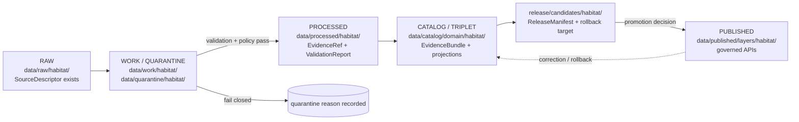
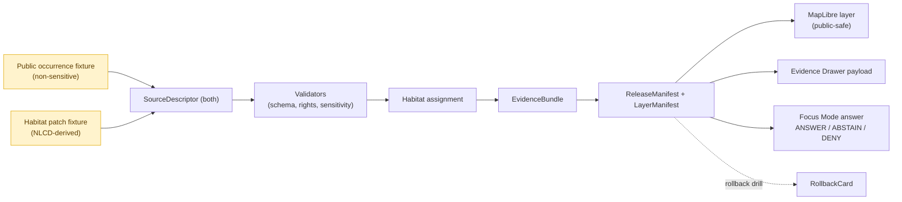

<!-- [KFM_META_BLOCK_V2]
doc_id: kfm://doc/domain-habitat-architecture
title: Habitat Domain · Architecture
type: standard
version: v1
status: draft
owners: <habitat-domain-steward>            # pending CODEOWNERS / steward charter assignment
created: 2026-05-17
updated: 2026-06-05
policy_label: public
related:
  - docs/doctrine/directory-rules.md
  - docs/doctrine/lifecycle-law.md
  - docs/doctrine/truth-posture.md          # filename NEEDS VERIFICATION (see §17 note)
  - docs/doctrine/trust-membrane.md
  - docs/domains/habitat/API_CONTRACTS.md
  - docs/domains/habitat/sublanes/suitability.md
  - docs/domains/habitat/sublanes/restoration.md
  - docs/domains/fauna/ARCHITECTURE.md
  - docs/domains/flora/ARCHITECTURE.md
  - docs/standards/PROV.md
  - docs/standards/PMTILES.md
  - ai-build-operating-contract.md
  - kfm://doc/dom-hab
  - kfm://doc/dom-hf
tags: [kfm, domain, habitat, ecology, lane-architecture]
notes:
  - CONTRACT_VERSION = "3.0.0"
  - Lane companion to docs/domains/fauna/ARCHITECTURE.md via DOM-HF thin slice.
  - All repo-path claims are PROPOSED until verified against a mounted repository.
  - Owner placeholder pending CODEOWNERS / steward assignment.
  - "CONFLICTED schema-home: ADR-0001 is referenced by ADR-S-01 as still-open (confirm-or-amend); and Directory Rules §12 segmented slug (.../domains/habitat/) vs Atlas §24.13 flat slug (.../habitat/) is unresolved. See §3.2 and §16."
[/KFM_META_BLOCK_V2] -->

# Habitat Domain · Architecture

> **Habitat is a context lane.** It models land cover, ecological systems, habitat patches, suitability surfaces, connectivity, corridors, restoration opportunity, and stewardship zones as evidence-backed observations and models — with public-safe derivatives whenever joins to sensitive species or sites create exposure risk.

<!-- BADGES -->


**Owners:** `<habitat-domain-steward>` · **Reviewers:** Habitat steward + Fauna steward (for DOM-HF joins) · **Last updated:** 2026-06-05 · **Spec lineage:** `DOM-HAB`, `DOM-HF`, `ENCY §7.4`, `DIRRULES §12` · `CONTRACT_VERSION = "3.0.0"`

---

<a id="contents"></a>

## Contents

1. [Domain identity and one-line purpose](#1-domain-identity-and-one-line-purpose)
2. [Scope, boundary, and explicit non-ownership](#2-scope-boundary-and-explicit-non-ownership)
3. [Repo fit and lane directory tree](#3-repo-fit-and-lane-directory-tree)
4. [Ubiquitous language](#4-ubiquitous-language)
5. [Key source families](#5-key-source-families)
6. [Object families](#6-object-families)
7. [Cross-lane relations](#7-cross-lane-relations)
8. [Pipeline shape (RAW → PUBLISHED)](#8-pipeline-shape-raw--published)
9. [Sensitivity, rights, and publication posture](#9-sensitivity-rights-and-publication-posture)
10. [API, contract, and schema surfaces](#10-api-contract-and-schema-surfaces)
11. [Map and viewing products](#11-map-and-viewing-products)
12. [Governed AI behavior in this domain](#12-governed-ai-behavior-in-this-domain)
13. [Validators, tests, fixtures](#13-validators-tests-fixtures)
14. [Publication, correction, and rollback](#14-publication-correction-and-rollback)
15. [The DOM-HF thin slice (first proof)](#15-the-dom-hf-thin-slice-first-proof)
16. [Verification backlog and open questions](#16-verification-backlog-and-open-questions)
17. [Related docs](#17-related-docs)

---

## 1. Domain identity and one-line purpose

**CONFIRMED doctrine / PROPOSED implementation.** The Habitat lane governs Kansas land cover, ecological systems, habitat patches, suitability surfaces, connectivity and corridor geometry, restoration opportunity, stewardship-zone context, and public-safe habitat products. It exposes evidence-backed observations *and* clearly labeled models, never collapsing the two. *(Source basis: `DOM-HAB §§1-2`, `DOM-HF §§1-5`, `ENCY §7.4`.)*

> [!IMPORTANT]
> **Habitat is not a species lane.** It does not own taxonomic identity, occurrence truth, conservation status, or rare-species sensitivity defaults. Those belong to **Fauna** and **Flora**. Habitat joins to them through governed relationships only.

[Back to top ↑](#contents)

---

## 2. Scope, boundary, and explicit non-ownership

### 2.1 What this domain owns

**CONFIRMED doctrine / PROPOSED field realization.** The Habitat lane owns:

| Owned concept | Notes |
|---|---|
| Habitat patches | Polygon evidence and released derivatives. |
| Habitat classes | Class taxonomy linked to land cover / ecological systems. |
| Land-cover observations | Observation-class records sourced from NLCD-style inventories. |
| Ecological systems | Higher-order classification (NatureServe-style). |
| Habitat-quality scores | Evidence- or model-derived; model labels required. |
| Suitability models | Model artifacts with version, support, uncertainty, release time. |
| Connectivity edges / corridors | Patch-graph relations and corridor candidates. |
| Restoration opportunity | Restoration candidates with steward-review state. |
| Stewardship zones | Stewardship-context polygons. |
| Model-run receipts | Run identity, inputs, version, training/source support. |
| Uncertainty surfaces | Surface-level uncertainty as first-class evidence. |

*(Source basis: `ENCY §7.4(C)`, `DOM-HAB §§1-2`, `DOM-HF §§4-8`.)*

### 2.2 What this domain explicitly does **not** own

| Concept | Owning lane | Rule |
|---|---|---|
| Species occurrence truth | Fauna / Flora | Public-safe occurrence inputs only; restricted occurrences never cross the lane boundary. |
| Plant or animal taxonomy | Fauna / Flora | Habitat uses taxon as foreign key context only. |
| Regulatory **critical habitat** authority | USFWS (external) | Authority remains with USFWS ECOS; Habitat records source role and rights, never asserts the rule itself. |
| Watershed / reach truth | Hydrology | Habitat consumes HUC / wetland / reach context via governed joins. |
| Soil identity | Soil | Habitat consumes `SoilMapUnit` / `SoilComponent` context only. |
| Land management instruction | none (out of scope) | Habitat-quality framing is descriptive, not prescriptive. |

*(Source basis: `DOM-HAB §§1-2`, `DOM-FAUNA §§1-2`, `DOM-FLORA §§1-2`, `DOM-HYD`, `DOM-SOIL`, `Habitat × Agriculture` edge in `ENCY §24.4.4`.)*

[Back to top ↑](#contents)

---

## 3. Repo fit and lane directory tree

### 3.1 Placement protocol (Directory Rules §4)

| Step | Decision |
|---|---|
| Responsibility (§4 step 1) | **Human explanation** — this is doctrine for the Habitat domain → `docs/` |
| Lifecycle phase (§4 step 2) | n/a (not under `data/`) |
| Domain segment (§4 step 3) | `habitat` — appears as a **segment** inside `docs/`, never as a root. |
| Authority (§4 step 4) | `docs/domains/` parent root must exist (PROPOSED until verified). |
| Rule cited (§4 step 5) | **Directory Rules §12 — Domain Placement Law.** |

### 3.2 Habitat lane tree (PROPOSED)

The pattern below is the canonical lane layout from **Directory Rules §12**. It applies uniformly to every domain; what follows is its Habitat instantiation. All path claims are PROPOSED until verified against a mounted repository.

```text
docs/domains/habitat/
├── ARCHITECTURE.md          ← (this file) — doctrine + lane orientation
├── README.md                ← lane index (PROPOSED)
├── API_CONTRACTS.md         ← governed-API surface reference (PROPOSED)
├── CURRENT_STATE.md         ← mounted-repo truth posture (PROPOSED)
├── SOURCE_REGISTRY.md       ← source families + roles + rights (PROPOSED)
├── DATA_MODEL.md            ← object families + identity rules (PROPOSED)
├── PIPELINES_AND_LIFECYCLE.md
├── PUBLICATION_AND_POLICY.md
├── UI_AND_EVIDENCE_DRAWER.md
├── VERIFICATION_BACKLOG.md
├── ROADMAP.md
├── GLOSSARY.md
├── CHANGELOG.md
└── sublanes/
    ├── suitability.md       ← modeled-habitat sublane (PROPOSED)
    └── restoration.md       ← restoration-siting sublane (PROPOSED)

contracts/domains/habitat/                    ← semantic meaning (Markdown) — see slug conflict below
schemas/contracts/v1/domains/habitat/         ← machine shape (JSON Schema) — see slug conflict below
policy/domains/habitat/                       ← admissibility / release policy
tests/domains/habitat/                        ← enforceability proof
fixtures/domains/habitat/                     ← golden / valid / invalid inputs
packages/domains/habitat/                     ← shared library code (if needed)
pipelines/domains/habitat/                    ← executable pipeline logic
pipeline_specs/habitat/                       ← declarative pipeline configs

data/raw/habitat/                             ← immutable source captures
data/work/habitat/                            ← in-flight normalization
data/quarantine/habitat/                      ← held failures with reasons
data/processed/habitat/                       ← validated normalized objects
data/catalog/domain/habitat/                  ← catalog records + EvidenceBundles
data/published/layers/habitat/                ← public-safe released artifacts
data/registry/sources/habitat/                ← SourceDescriptors for Habitat
release/candidates/habitat/                   ← release candidates + manifests
```

> [!IMPORTANT]
> **Schema-home rule — `CONFLICTED`, ADR-required.** Two questions about the Habitat machine-schema home are **open**, not settled:
>
> 1. **Is `schemas/contracts/v1/…` confirmed as the canonical schema home?** This is **ADR-S-01** in the master open-ADR backlog: _"Confirm `schemas/contracts/v1/…` by ADR-0001 **or amend**."_ Atlas v1.1 VB-11-01 lists "schema home confirmed by ADR-0001" as `NEEDS VERIFICATION`. Therefore ADR-0001 MUST be cited as **proposed/open**, not as an accepted rule.
> 2. **Segmented vs flat slug.** Directory Rules §12 uses the **segmented** form `schemas/contracts/v1/domains/habitat/`; the Atlas §24.13 crosswalk uses the **flat** form `schemas/contracts/v1/habitat/`. This is an unresolved `CONFLICTED` drift.
>
> What **is** `CONFIRMED`: machine `.schema.json` files live under `schemas/contracts/v1/…` and **never** under `contracts/`; `contracts/domains/habitat/` holds semantic Markdown only. Any habitat schemas found under `contracts/domains/habitat/*.schema.json` are `LINEAGE / CONFLICTED` and MUST be migrated. Open a `docs/registers/DRIFT_REGISTER.md` entry; do not create both slugs as parallel schema homes (Directory Rules §13.1 anti-pattern). *(Source basis: `DIRRULES §§6.3-6.4, §13.1, §2.4(3)`, `ATLAS §24.12 ADR-S-01`, `ATLAS §24.13`, `ATLAS App. G VB-11-01`.)*

### 3.3 Lane responsibility map

```mermaid
flowchart LR
  classDef ext fill:#fff3cd,stroke:#e0a800,color:#5c3c00;
  classDef int fill:#e8f4ff,stroke:#0969da,color:#0a3069;
  classDef pub fill:#dafbe1,stroke:#1f883d,color:#0a3622;
  classDef gov fill:#f6f8fa,stroke:#57606a,color:#24292f;

  subgraph EXT[External authorities]
    NLCD["NLCD land cover"]:::ext
    NWI["NWI wetlands"]:::ext
    GAP["GAP / LANDFIRE"]:::ext
    ECOS["USFWS ECOS<br/>critical habitat"]:::ext
    NATSERV["NatureServe / controlled<br/>biodiversity sources"]:::ext
    OCC["GBIF / iNaturalist / iDigBio<br/>(occurrence inputs)"]:::ext
    PADUS["PAD-US stewardship"]:::ext
    KDWP["KDWP state review context"]:::ext
  end

  subgraph LANE[docs/domains/habitat lane]
    SRC["SourceDescriptor<br/>(data/registry/sources/habitat/)"]:::gov
    PIPE["Pipelines<br/>(pipelines/domains/habitat/)"]:::int
    CAT["Catalog + EvidenceBundle<br/>(data/catalog/domain/habitat/)"]:::int
    REL["ReleaseManifest<br/>(release/candidates/habitat/)"]:::gov
    PUB["Published layers<br/>(data/published/layers/habitat/)"]:::pub
  end

  subgraph API[Governed surfaces]
    GAPI["Governed API<br/>(habitat feature/detail resolver)"]:::pub
    EV["Evidence Drawer<br/>habitat payload"]:::pub
    FOCUS["Focus Mode answer<br/>ANSWER / ABSTAIN / DENY / ERROR"]:::pub
  end

  EXT --> SRC --> PIPE --> CAT --> REL --> PUB
  PUB --> GAPI --> EV --> FOCUS
```



[Back to top ↑](#contents)

---

## 4. Ubiquitous language

Habitat-specific terms keep their meaning constrained by source role, evidence, time, and release state. The table below is the lane's **published language** — use these spellings and definitions in schemas, validators, UI strings, and documentation alike.

| Term | Meaning (CONFIRMED term / PROPOSED field realization) | Citation |
|---|---|---|
| `HabitatPatch` | A bounded polygon of relatively homogeneous habitat character, derived from land cover, ecological systems, or fieldwork, with evidence and source role attached. | `DOM-HAB`, `ENCY §7.4` |
| `LandCoverObservation` | An observation-class record sourced from a land-cover inventory (e.g., NLCD), with source-vintage time and class-system version. | `DOM-HAB`, `ENCY §7.4` |
| `EcologicalSystem` | A classified ecological system (NatureServe-style) used as a higher-order class for habitat context. | `DOM-HAB`, `ENCY §7.4` |
| `HabitatQualityScore` | A descriptive quality value with explicit source role, support, uncertainty, and release time — never a prescriptive management score. | `DOM-HAB`, `ENCY §7.4` |
| `SuitabilityModel` | A modeled surface or score with version, training/source support, spatial resolution, support, uncertainty, and release time. Labeled **model**, not observation. | `DOM-HAB §§1-2`, `ENCY §7.4(D)` |
| `ConnectivityEdge` | Patch-graph edge expressing functional connectivity between patches, with support and method visible. | `DOM-HAB`, `ENCY §7.4(C)` |
| `Corridor` | Modeled or observed corridor geometry — derivative; not a movement assertion about any individual taxon. | `DOM-HAB`, `ENCY §7.4(C)` |
| `RestorationOpportunity` | A candidate area for restoration with steward-review state and explicit suitability framing. | `DOM-HAB`, `ENCY §7.4(C)` |
| `StewardshipZone` | A stewardship-context polygon (conservation easements, PAD-US joins, etc.). T1 sensitivity by default. | `DOM-HAB`, `ENCY §24.5` |
| `ModelRunReceipt` | The run-identity object emitted by a habitat model run: inputs, version, support, time, hash. | `DOM-HAB`, `ENCY §7.4(C)` |
| `UncertaintySurface` | An uncertainty raster or field, first-class evidence — never erased to publish a confident-looking score. | `DOM-HAB`, `ENCY §7.4(C)` |
| **Modeled habitat** | A model output labeled as such. **Must not** be flattened or rendered as critical habitat. | `DOM-HAB`, `DOM-HF` |
| **Critical habitat** | Regulatory designation owned by USFWS ECOS as an external authority. Habitat records the role, not the rule. | `DOM-HAB`, `DOM-HF` |
| **Geoprivacy transform** | The transformation that converts sensitive occurrence-linked geometry into a public-safe representation. Emits a transform receipt. | `DOM-HAB`, `DOM-HF`, `DOM-FAUNA §§12-13` |
| **Habitat assignment** | A governed, public-safe association between an occurrence (public class) and a habitat patch / ecological system. The DOM-HF proof unit. | `DOM-HF §§1-5` |

[Back to top ↑](#contents)

---

## 5. Key source families

**CONFIRMED doctrine / NEEDS VERIFICATION rights and terms.** Each source family is admitted through a `SourceDescriptor` under `data/registry/sources/habitat/` with role, rights, sensitivity, cadence, and citation. Sensitive joins **fail closed** when source role, rights, or sensitivity posture cannot be resolved.

| Source family | Role | Rights / sensitivity | Freshness | Status |
|---|---|---|---|---|
| **NLCD land cover** | authority / observation (per source role) | rights NEEDS VERIFICATION; non-sensitive at class level | source-vintage | PROPOSED descriptor |
| **NWI wetlands** | authority / observation | rights NEEDS VERIFICATION | source-vintage | PROPOSED descriptor |
| **GAP / LANDFIRE** | authority / model context | rights NEEDS VERIFICATION | source-vintage | PROPOSED descriptor |
| **USFWS ECOS / critical habitat services** | authority / regulatory context | rights NEEDS VERIFICATION; **not a KFM-internal rule authority** | service-snapshot | PROPOSED descriptor |
| **NatureServe and controlled biodiversity sources** | authority / context | rights NEEDS VERIFICATION; sensitive joins fail closed | source-vintage | PROPOSED descriptor |
| **GBIF / iNaturalist / iDigBio** (occurrence inputs) | observation (public-class only) | rights NEEDS VERIFICATION; sensitive occurrences never cross to Habitat | source-cadence | PROPOSED descriptor |
| **PAD-US stewardship context** | authority / context | rights NEEDS VERIFICATION | source-vintage | PROPOSED descriptor |
| **KDWP state review context** | authority / context | rights NEEDS VERIFICATION; review-mediated | source-cadence | PROPOSED descriptor |

*(Source basis: `DOM-HAB §§1-2`, `DOM-HF §§1-5`, `ENCY §7.4(B)`, `ENCY §3` source ledger discipline.)*

> [!IMPORTANT]
> **Source role cannot be inferred from convenience.** A community-science occurrence source is *not* a legal-status authority. A regulatory critical-habitat service is *not* an observation of presence. NLCD is *not* an ecological-system classifier. Each `SourceDescriptor` must state the role explicitly and the validator must reject misuses. *(Source basis: `Unified Manual §3.6`, `DOM-FAUNA §§1-2`.)*

[Back to top ↑](#contents)

---

## 6. Object families

Every object family below carries the **CONFIRMED bitemporal discipline**: source, observed, valid, retrieval, release, and correction times stay distinct where material. Deterministic identity is **PROPOSED** on the basis of *source id + object role + temporal scope + normalized digest*.

| Object | Purpose | Sensitivity default (PROPOSED) | Notes |
|---|---|---|---|
| `HabitatPatch` | Polygon habitat evidence or released derivative | T0 (public-safe) | Geometry generalization for sensitive joins per §9. |
| `LandCoverObservation` | Observation-class record from land cover | T0 | Vintage and class-system version required. |
| `EcologicalSystem` | Higher-order ecological classification | T0 | Source role distinguishes authority vs derivative. |
| `HabitatQualityScore` | Quality framing (descriptive only) | T0 | Model / observation label visible. |
| `SuitabilityModel` | Modeled suitability surface or score | T0 with **model card** | Treat as **model**, never observation. |
| `ConnectivityEdge` | Patch-graph relation | T0 | Method and support visible. |
| `Corridor` | Modeled corridor geometry | T1 candidate where sensitive | Movement attribution restricted. |
| `RestorationOpportunity` | Restoration candidate area | T1 candidate | Steward-review state required for promotion. |
| `StewardshipZone` | Stewardship-context polygon | T1 default | PAD-US join governance. |
| `ModelRunReceipt` | Model-run identity object | T0 | Inputs, version, support, time, hash. |
| `UncertaintySurface` | Uncertainty raster or field | T0 | First-class evidence; must not be erased. |
| `EvidenceBundle` (kernel) | Cross-cutting, owned by ENCY doctrine | mirrors claim tier | Referenced by every public Habitat answer. |
| `DecisionEnvelope` (kernel) | Finite outcome envelope | n/a | `ANSWER / ABSTAIN / DENY / ERROR`. |
| `LayerManifest` (kernel) | Public-safe layer descriptor | release-state-aware | Renders only released bundles. |

*(Source basis: `ENCY §7.4(C)`, `DOM-HAB §§1-2`, `DOM-HF §§4-8`, `Atlas §24.5` sensitivity-default table.)*

[Back to top ↑](#contents)

---

## 7. Cross-lane relations

The relations below are **CONFIRMED doctrine / PROPOSED implementation**. Each relation MUST preserve ownership, source role, sensitivity, and `EvidenceBundle` support across the boundary.

### 7.1 Edges owned by Habitat

| This domain | Related lane | Relation | Constraint |
|---|---|---|---|
| Habitat | Fauna | Habitat patch, ecological system, and stewardship zone provide the context for occurrence interpretation. | Sensitive occurrences never cross; geoprivacy transform required for any public derivative. |
| Habitat | Flora | Vegetation community and rare-plant context under Flora controls. | Rare-plant exact location denied to public consumers. |
| Habitat | Soil / Hydrology | Substrate, moisture, wetlands, riparian support consumed via governed joins. | Soil time caveat and HUC identity carried. |
| Habitat | Hazards | Fire, drought, flood, smoke, and resilience stress context. | Hazards is not an alert authority. |
| Habitat | Agriculture | Conservation-practice candidates are framed by habitat-quality scores. | **Never** used to instruct land management. |
| Habitat | Planetary / 3D | Habitat patches are admitted to 3D scenes only via generalized geometry. | Sensitive habitat denied. |

*(Source basis: `ENCY §24.4.4`, `DOM-HAB`, `DOM-FAUNA`, `DOM-FLORA`, `DOM-SOIL`, `DOM-HYD`, `DOM-AG`.)*

### 7.2 Edges consumed by Habitat

| Habitat consumes | From owner | Use |
|---|---|---|
| HUC / Watershed / Reach | Hydrology | Wetland / reach identity feeds habitat-quality and occurrence-context joins. |
| `SoilMapUnit` / `SoilComponent` | Soil | Substrate context for ecological-system inference. |
| `OccurrenceRecord` (public-safe only) | Fauna | Public-safe derivative inputs to habitat-quality model evaluation. **Restricted occurrences never cross.** |
| `RarePlantRecord` (public-safe only) | Flora | Public-safe derivative inputs only; exact location denied. |
| Coordinate Reference Profile, GeographyVersion | Spatial Foundation | Projection, scale-support, generalization tolerances. |

*(Source basis: `ENCY §24.4.2-§24.4.6`, `MAP-MASTER`.)*

[Back to top ↑](#contents)

---

## 8. Pipeline shape (RAW → PUBLISHED)

**CONFIRMED doctrine / PROPOSED lane application.** Habitat follows the lifecycle invariant. **Promotion is a governed state transition, not a file move.**



| Stage | Handling | Gate | Status |
|---|---|---|---|
| **RAW** | Capture immutable source payload or reference with source role, rights, sensitivity, citation, time, and hash. | `SourceDescriptor` exists. | PROPOSED |
| **WORK / QUARANTINE** | Normalize schema, geometry, time, identity, evidence, rights, and policy; hold failures. | Validation and policy gate pass, **or** quarantine reason recorded. | PROPOSED |
| **PROCESSED** | Emit validated normalized objects, receipts, and public-safe candidates. | `EvidenceRef`, `ValidationReport`, and digest closure exist. | PROPOSED |
| **CATALOG / TRIPLET** | Emit catalog records, `EvidenceBundle`s, graph/triplet projections, and release candidates. | Catalog / proof closure passes. | PROPOSED |
| **PUBLISHED** | Serve released public-safe artifacts through governed APIs and manifests. | `ReleaseManifest`, correction path, rollback target, review / policy state exist. | PROPOSED |

*(Source basis: `DIRRULES §9` lifecycle invariant, `DOM-HAB §§1-2`, `DOM-HF §§8-12`, `ENCY Appendix E`.)*

> [!WARNING]
> **Watchers are not publishers.** Any source-change watcher for Habitat MAY emit observations, receipts, and candidate decisions; it **MUST NOT** mutate catalog truth, publish directly, overwrite canonical records, or bypass review states. *(Source basis: watcher-as-non-publisher invariant; `ENCY §4` operating law.)*

[Back to top ↑](#contents)

---

## 9. Sensitivity, rights, and publication posture

**CONFIRMED doctrine.** Habitat is generally a context lane and most habitat objects carry a **T0** sensitivity default — but the lane sits one join away from rare-species exposure risk, and any join to occurrence, nest, den, roost, hibernaculum, spawning site, or steward-controlled record inherits the upstream sensitivity posture.

| Posture rule | Source basis |
|---|---|
| Regulatory critical habitat, modeled habitat, species range, occurrence points, and landscape context **must not be flattened**. | `DOM-HAB`, `DOM-HF`, `ENCY §7.4(I)` |
| Sensitive occurrence-linked details **deny by default**. | `DOM-HAB`, `DOM-HF`, `ENCY §7.4(I)` |
| Modeled habitat MUST be labeled as a model and MUST NOT be presented as critical habitat. | `DOM-HAB`, `DOM-HF` |
| Unclear rights, unresolved source role, missing evidence, unresolved sensitivity, or absent release state **blocks public promotion**. | `ENCY §4` publication gate; `DIRRULES §9` |
| Sensitive geometry exposed via tile or layer **fails closed**; style filters are not a sensitivity control. | `Master MapLibre Atlas` anti-patterns |
| Exact occurrence-linked habitat outputs must be **generalized, redacted, reviewed, or denied** when they create exposure risk. | `Unified Manual §6.3` |
| Stewardship zones (PAD-US joins, etc.) default to **T1** until review confirms broader release. | `Atlas §24.5` |

**Geoprivacy transform (CONFIRMED doctrine / PROPOSED implementation).** When a Habitat output is derived from a sensitive occurrence, it MUST be produced through a documented transform (suppress, generalize to grid, generalize to watershed or county, buffer, jitter under constraints, delayed publication, or steward-only exact access) and MUST emit a `RedactionReceipt` recording input class, output class, reason, policy, reviewer, and residual risk. *(Source basis: `KFM-IDX-POL-005` rare-species geoprivacy and transform receipts.)*

> [!CAUTION]
> **Sensitive-domain routing.** Disposition for rare-species, private-land, and steward-controlled habitat content routes through the `ai-build-operating-contract.md` §23.2 sensitive-domain matrix (most-restrictive applicable row). This doc does not re-derive disposition; the §23.2 default — DENY exact exposure, GENERALIZE, REDACT, QUARANTINE uncertain source, REQUIRE steward review, REQUIRE `RedactionReceipt`, ABSTAIN when support is inadequate — governs.

[Back to top ↑](#contents)

---

## 10. API, contract, and schema surfaces

**PROPOSED governed API surfaces.** All Habitat surfaces are governed interfaces over released or reviewable trust objects — never raw database windows. The detailed semantic contract reference lives in [`API_CONTRACTS.md`](API_CONTRACTS.md).

| Endpoint or artifact | DTO / schema | Finite outcomes | Status |
|---|---|---|---|
| Habitat feature/detail resolver | `HabitatDecisionEnvelope` | `ANSWER / ABSTAIN / DENY / ERROR` | PROPOSED; exact route UNKNOWN. |
| Habitat layer manifest resolver | `LayerManifest` / domain layer descriptor | `ANSWER / DENY / ERROR` | PROPOSED; public-safe release only (no `ABSTAIN` per Atlas §24.3.2). |
| Habitat Evidence Drawer payload | `EvidenceDrawerPayload` + `EvidenceBundle` projection | `ANSWER / ABSTAIN / DENY / ERROR` | PROPOSED; evidence- and policy-filtered. |
| Habitat Focus Mode answer | Runtime Response Envelope + `AIReceipt` | `ANSWER / ABSTAIN / DENY / ERROR` | PROPOSED; AI never root truth. |
| Schema responsibility root | `schemas/contracts/v1/…` (segment slug `CONFLICTED`, §3.2) | finite validator outcomes | PROPOSED; ADR-S-01 open. |
| Contract responsibility root | `contracts/domains/habitat/` | semantic Markdown | PROPOSED; `CONFLICTED` if it ever holds `.schema.json`. |
| Policy responsibility root | `policy/domains/habitat/` | allow / deny / restrict / abstain | PROPOSED. |

*(Source basis: `Atlas §J habitat`, `Atlas §24.3.2` outcome×surface map, `DOM-HAB §§1-2`, `DIRRULES §§6.3-6.5, §12`, `UIAI-MAP §7`.)*

> [!NOTE]
> Public API payloads expose **finite outcome states**, **evidence references**, **policy posture**, **temporal and spatial scope**, **stale state**, **release state**, **correction lineage**, and **identifiers that allow `EvidenceBundle` inspection**. They do not expose raw connectors, internal store handles, or model-client paths. *(Source basis: `Unified Manual §3.8 API architecture`.)*

[Back to top ↑](#contents)

---

## 11. Map and viewing products

**PROPOSED domain viewing products** (per `DOM-HAB`, `DOM-HF`, `ENCY §7.4(E)`):

- Habitat patch map (released public-safe tile layer).
- Suitability surface (with model card + uncertainty).
- Connectivity / corridor view.
- Restoration opportunity layer.
- Uncertainty mode (uncertainty surface front-and-centre).
- Sensitivity-redacted mode (generalized / suppressed public artifacts with redaction receipts).
- Habitat ↔ Fauna / Flora join view (DOM-HF thin slice).
- Critical-habitat view (USFWS ECOS source role visible).
- Habitat overlay registry with source-role badges.
- Evidence Drawer "Habitat" panel.

**CONFIRMED cross-cutting viewing products** (per `MAP-MASTER`, `GAI`): Evidence Drawer, time-aware state, trust badges, sensitivity-redacted view, correction/stale-state view, and governed Focus Mode.

> [!IMPORTANT]
> **Map-renderer boundary.** MapLibre (or any renderer) is downstream of trust. It renders released artifacts and view state; it is **never** truth, policy, publication, or citation authority. Cesium / 3D, where present, MUST consume the same `EvidenceBundle` and `DecisionEnvelope` as 2D. *(Source basis: `ENCY §4` operating law; `DIRRULES §11`.)*

[Back to top ↑](#contents)

---

## 12. Governed AI behavior in this domain

**CONFIRMED doctrine / PROPOSED implementation.** AI is **interpretive and subordinate** to evidence, policy, review, and release state. Outcomes are `ANSWER`, `ABSTAIN`, `DENY`, or `ERROR`.

| Habitat AI MAY | Habitat AI MUST NOT |
|---|---|
| Summarize released Habitat `EvidenceBundle`s. | Generate uncited habitat claims. |
| Compare evidence across released bundles. | Substitute fluent generation for evidence. |
| Explain limitations, support, uncertainty, and source role. | Treat MapLibre renders, tiles, popups, or graph projections as sovereign truth. |
| Draft steward-review notes. | Surface a habitat-quality score without its model label and uncertainty. |
| `ABSTAIN` when evidence is insufficient. | Bypass `DENY` from policy, rights, sensitivity, or release state. |
| `DENY` where policy, rights, sensitivity, or release state blocks the request. | Disclose sensitive occurrence-linked habitat outputs. |

*(Source basis: `UIAI-GAI`, `DOM-HAB`, `DOM-HF`, `ENCY §4` AI boundary.)*

[Back to top ↑](#contents)

---

## 13. Validators, tests, fixtures

The validator set below is **PROPOSED**. Each validator MUST exercise positive, negative, denied, abstained, and ambiguous paths and MUST **fail closed** when required schema fields, policy decisions, rights evidence, sensitivity posture, proof objects, or release state are missing or invalid.

<details>
<summary><strong>Habitat lane validator and fixture inventory (PROPOSED)</strong></summary>

| Validator | Purpose | Negative-path fixture (PROPOSED) |
|---|---|---|
| **Habitat SourceDescriptor tests** | Reject descriptors without source role, rights status, sensitivity, citation, time, or hash. | descriptor missing rights status. |
| **Critical habitat source-role test** | Reject use of USFWS ECOS critical habitat as an observation authority. | record asserting an occurrence from ECOS service. |
| **Modeled-as-critical denial test** | Reject any pipeline that labels a `SuitabilityModel` output as critical habitat. | model output mislabeled as regulatory critical habitat. |
| **Occurrence geoprivacy test** | Reject any Habitat derivative from a restricted occurrence without a transform receipt and review state. | derivative built from restricted occurrence with no receipt. |
| **Catalog closure test** | Reject release candidates lacking `EvidenceBundle`, `ValidationReport`, or digest closure. | candidate with missing bundle digest. |
| **Habitat × Fauna thin-slice fixture** | Prove one public-safe occurrence-to-habitat assignment end-to-end. | sensitive occurrence variant must fail closed. |
| **Stewardship-zone sensitivity test** | Default `StewardshipZone` to T1; deny public exposure of internal steward records. | internal steward record exposed publicly. |
| **Uncertainty-erasure test** | Reject layer manifests that publish suitability without an `UncertaintySurface` or stated support. | suitability tile without uncertainty companion. |
| **Tile / PMTiles attestation test** | Reject published habitat tiles without sidecar, signature, and root hash. | unsigned PMTiles artifact. |

</details>

*(Source basis: `Atlas §K habitat`, `DOM-HAB`, `DOM-HF`, PMTiles attestation, `KFM-IDX-VAL-001/002` fail-closed posture.)*

[Back to top ↑](#contents)

---

## 14. Publication, correction, and rollback

**CONFIRMED doctrine / PROPOSED implementation.** Habitat publication requires:

1. `ReleaseManifest` with public-safe scope.
2. `EvidenceBundle` referenced by every public claim.
3. Validation + policy gate pass (schema, evidence, rights, sensitivity, temporal, geometry).
4. Review state where required (steward review for restoration candidates, stewardship zones, and DOM-HF derivatives).
5. **Correction path** (`CorrectionNotice` route).
6. **Stale-state rule**: when source freshness lapses, public answers downgrade to `ABSTAIN` or a stale badge.
7. **Rollback target** (`RollbackCard` referencing a prior released manifest).
8. For any redacted derivative, an upstream `RedactionReceipt` chain.

> [!CAUTION]
> **Separation of duties** applies when materiality justifies it — for example, when a habitat publication crosses into species-sensitive context. The release authority should be distinct from the original author for sensitive-join publications. *(Source basis: `ENCY §4` publication gate; `Atlas §M habitat`.)*

[Back to top ↑](#contents)

---

## 15. The DOM-HF thin slice (first proof)

**PROPOSED first proof lane.** The Habitat lane's first proof artifact is a controlled, fixture-first **Habitat × Fauna public-safe occurrence-to-habitat assignment**, not a broad live-source rollout. This pattern follows `KFM-IDX-APP-002` and `KFM-IDX-PLN-003` (domain expansions ship as proof-bearing thin slices, not coverage-bearing launches).



**Definition of done (PROPOSED):**

- One public-safe occurrence fixture joined to one habitat patch fixture.
- Exact occurrence point retained steward-only if required; public layer proven by `RedactionReceipt`.
- `EvidenceBundle`, `ReleaseManifest`, `LayerManifest`, `EvidenceDrawerPayload`, Focus Mode envelope, and rollback drill all closed.
- Sensitive-variant fixture exists and is observed to **fail closed**.

*(Source basis: `DOM-HF §§1-12`, `ENCY §7.4(M)`, `KFM-IDX-APP-002`, `KFM-IDX-VAL-001`.)*

[Back to top ↑](#contents)

---

## 16. Verification backlog and open questions

| Item | Evidence that would settle it | Status |
|---|---|---|
| Verify official USFWS ECOS critical habitat source descriptors. | `data/registry/sources/habitat/` entries, signed agreements, validator coverage. | NEEDS VERIFICATION |
| Verify sensitive-occurrence geoprivacy policy and transform receipts. | `policy/sensitivity/fauna/` + `policy/domains/habitat/` rules, transform receipt fixtures. | NEEDS VERIFICATION |
| Verify model-card requirements for `SuitabilityModel` products. | Model card schema in the canonical Habitat schema home, ADR. | NEEDS VERIFICATION |
| Verify Habitat MapLibre overlay registry and Focus Mode behavior. | `packages/maplibre/` configs + Focus Mode integration tests. | NEEDS VERIFICATION |
| **Resolve schema-home for Habitat (two parts).** (a) Confirm or amend ADR-0001 per **ADR-S-01**; (b) resolve segmented `.../domains/habitat/` (DIRRULES §12) vs flat `.../habitat/` (Atlas §24.13). | Accepted ADR-S-01 + DRIFT_REGISTER entry + mounted-repo evidence. | CONFLICTED |
| Verify connector cadence and rights for NLCD, NWI, GAP/LANDFIRE, ECOS, NatureServe, GBIF/iNaturalist/iDigBio, PAD-US, KDWP. | Source descriptors + ToS review. | NEEDS VERIFICATION |
| Verify Habitat × Fauna thin-slice proof artifact. | Released slice artifact, `EvidenceBundle`, `ReleaseManifest`, rollback drill receipt. | NEEDS VERIFICATION |
| Verify watcher integration for Habitat source change. | `tools/ingest/.../watcher` + dry-run receipts. | NEEDS VERIFICATION |
| Verify `RestorationOpportunity` steward-review state machine. | `policy/domains/habitat/` + review fixtures. | NEEDS VERIFICATION |
| Verify PMTiles attestation pipeline for published habitat tiles. | PMTiles sidecar + signature + root hash fixtures. | NEEDS VERIFICATION |
| Resolve docs filename conventions (`ARCHITECTURE.md` casing, neighbor naming; `truth-posture.md` vs neighbor doctrine names; `PROV.md` vs `PROVENANCE.md` per OPEN-DR-01). | Existing neighbor docs in mounted repo + ADR. | NEEDS VERIFICATION |

[Back to top ↑](#contents)

---

## 17. Related docs

> [!NOTE]
> **Doctrine filename drift.** This doc references `docs/doctrine/truth-posture.md`; the cite-or-abstain truth posture may instead live under a differently named doctrine companion (e.g., an `evidence-first` / `authority-ladder` companion). Treat the `truth-posture.md` target as `NEEDS VERIFICATION`. The `PROV.md` vs `PROVENANCE.md` filename is tracked as Directory Rules OPEN-DR-01.

<details>
<summary><strong>Lane companions, ADRs, and runbooks (PROPOSED locations)</strong></summary>

- **Lane:** [`README.md`](README.md) · [`API_CONTRACTS.md`](API_CONTRACTS.md) · [`CURRENT_STATE.md`](CURRENT_STATE.md) · [`SOURCE_REGISTRY.md`](SOURCE_REGISTRY.md) · [`DATA_MODEL.md`](DATA_MODEL.md) · [`PIPELINES_AND_LIFECYCLE.md`](PIPELINES_AND_LIFECYCLE.md) · [`PUBLICATION_AND_POLICY.md`](PUBLICATION_AND_POLICY.md) · [`UI_AND_EVIDENCE_DRAWER.md`](UI_AND_EVIDENCE_DRAWER.md) · [`VERIFICATION_BACKLOG.md`](VERIFICATION_BACKLOG.md) · [`ROADMAP.md`](ROADMAP.md) · [`GLOSSARY.md`](GLOSSARY.md) · [`CHANGELOG.md`](CHANGELOG.md)
- **Sublanes:** [`sublanes/suitability.md`](sublanes/suitability.md) · [`sublanes/restoration.md`](sublanes/restoration.md)
- **ADRs:** [`ADR-habitat-schema-home.md`](../../adr/ADR-habitat-schema-home.md) *(maps to ADR-S-01)* · [`ADR-habitat-source-roles.md`](../../adr/ADR-habitat-source-roles.md) · [`ADR-habitat-modeled-vs-critical.md`](../../adr/ADR-habitat-modeled-vs-critical.md) · [`ADR-habitat-stewardship-zone-policy.md`](../../adr/ADR-habitat-stewardship-zone-policy.md) · [`ADR-habitat-fauna-thin-slice.md`](../../adr/ADR-habitat-fauna-thin-slice.md) *(all TODO link targets)*
- **Runbooks:** `runbooks/habitat-ingest.md` · `runbooks/habitat-promotion.md` · `runbooks/habitat-rollback.md` · `runbooks/dom-hf-thin-slice.md` *(TODO link targets; flat-vs-`<domain>/`-subfolder naming is OPEN-DR-02)*
- **Cross-domain neighbors:** [`../fauna/ARCHITECTURE.md`](../fauna/ARCHITECTURE.md) · [`../flora/ARCHITECTURE.md`](../flora/ARCHITECTURE.md) · [`../soil/ARCHITECTURE.md`](../soil/ARCHITECTURE.md) · [`../hydrology/ARCHITECTURE.md`](../hydrology/ARCHITECTURE.md) · [`../agriculture/ARCHITECTURE.md`](../agriculture/ARCHITECTURE.md) · [`../hazards/ARCHITECTURE.md`](../hazards/ARCHITECTURE.md)
- **Doctrine roots:** [`../../doctrine/directory-rules.md`](../../doctrine/directory-rules.md) · [`../../doctrine/lifecycle-law.md`](../../doctrine/lifecycle-law.md) · [`../../doctrine/truth-posture.md`](../../doctrine/truth-posture.md) *(filename NEEDS VERIFICATION)* · [`../../doctrine/trust-membrane.md`](../../doctrine/trust-membrane.md) · [`../../../ai-build-operating-contract.md`](../../../ai-build-operating-contract.md) *(`CONTRACT_VERSION = "3.0.0"`)*
- **Standards:** [`../../standards/PROV.md`](../../standards/PROV.md) *(vs `PROVENANCE.md`, OPEN-DR-01)* · [`../../standards/PMTILES.md`](../../standards/PMTILES.md) · [`../../standards/OGC-API-TILES.md`](../../standards/OGC-API-TILES.md) · [`../../standards/ISO-19115.md`](../../standards/ISO-19115.md)

</details>

---

<sub>**Last updated:** 2026-06-05 · **Spec lineage:** `DOM-HAB`, `DOM-HF`, `ENCY §7.4`, `DIRRULES §12` · **Doc id:** `kfm://doc/domain-habitat-architecture` · `CONTRACT_VERSION = "3.0.0"` · [Back to top ↑](#contents)</sub>
