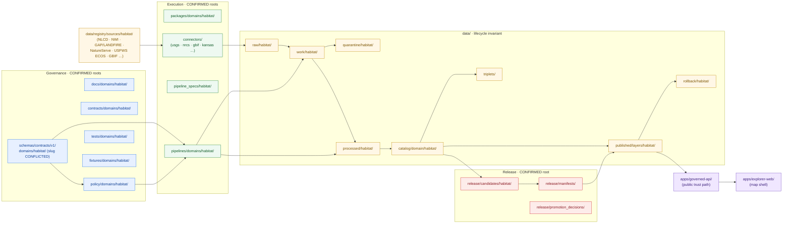

<!-- [KFM_META_BLOCK_V2]
doc_id: kfm://doc/habitat/canonical-paths
title: Habitat Canonical Paths
type: standard
version: v1
status: draft
owners: Habitat domain steward + Docs steward
created: 2026-05-17
updated: 2026-06-05
policy_label: public
related:
  - docs/doctrine/directory-rules.md
  - docs/architecture/contract-schema-policy-split.md
  - docs/domains/habitat/README.md
  - docs/domains/habitat/ARCHITECTURE.md
  - docs/domains/habitat/API_CONTRACTS.md
  - docs/domains/fauna/README.md
  - docs/domains/flora/README.md
  - docs/domains/soil/README.md
  - docs/domains/hydrology/README.md
  - docs/adr/ADR-0001-schema-home.md
  - ai-build-operating-contract.md
  - control_plane/domain_lane_register.yaml
tags: [kfm, habitat, directory-rules, domain-placement, canonical-paths]
notes:
  - CONTRACT_VERSION = "3.0.0"
  - Path enumeration is PROPOSED until verified against mounted-repo evidence.
  - Authority order: Directory Rules > this file > per-root READMEs.
  - Sensitive joins (occurrence × habitat) fail closed by default.
  - "CONFLICTED schema-home: ADR-0001 is OPEN per Atlas ADR-S-01 (confirm-or-amend; VB-11-01 NEEDS VERIFICATION); and the segmented slug (.../domains/habitat/, DIRRULES §12) vs flat slug (.../habitat/, Atlas §24.13) is unresolved. See §0, §2, §4, §12."
[/KFM_META_BLOCK_V2] -->

# 🪶 Habitat Canonical Paths

*The authoritative enumeration of where Habitat-domain files belong across KFM responsibility roots — derived from Directory Rules §12 (Domain Placement Law) and the Habitat doctrine.*

> **Status:** draft &nbsp;·&nbsp; **Owners:** Habitat domain steward + Docs steward &nbsp;·&nbsp; **Updated:** 2026-06-05 &nbsp;·&nbsp; `CONTRACT_VERSION = "3.0.0"`

---

## 📑 Mini-TOC

- [0. Status & Authority](#0-status--authority)
- [1. Purpose & Scope](#1-purpose--scope)
- [2. Authority Basis](#2-authority-basis)
- [3. Habitat Lane At-A-Glance (diagram)](#3-habitat-lane-at-a-glance)
- [4. Responsibility-Root Canonical Paths](#4-responsibility-root-canonical-paths)
- [5. Lifecycle-Phase Paths (`data/`)](#5-lifecycle-phase-paths-data)
- [6. Object Families → Where They Live](#6-object-families--where-they-live)
- [7. Source-Family Registry Paths](#7-source-family-registry-paths)
- [8. Sensitivity and Geoprivacy Posture](#8-sensitivity-and-geoprivacy-posture)
- [9. Map & Viewing-Product Paths](#9-map--viewing-product-paths)
- [10. Cross-Domain Seams](#10-cross-domain-seams)
- [11. Anti-Patterns (don't do these)](#11-anti-patterns-dont-do-these)
- [12. Open Questions & NEEDS VERIFICATION](#12-open-questions--needs-verification)
- [13. Related Docs](#13-related-docs)
- [Footer](#footer)

---

## 0. Status & Authority

| Field | Value |
|---|---|
| **Document type** | Domain canonical-paths reference (standard doc). |
| **Authority of the placement rules referenced here** | **CONFIRMED** — Directory Rules §§ 4–5, 6, 9, 12 are the source of truth. |
| **Authority of any specific Habitat path quoted here** | **PROPOSED** until verified against mounted-repo evidence. |
| **Proposed canonical home** | `docs/domains/habitat/CANONICAL_PATHS.md` (this file). |
| **Owner** | Habitat domain steward; reviewed with Docs steward. |
| **Reviewers required for change** | Habitat steward + Docs steward; ADR required for any structural change that bends Directory Rules §2.4. |
| **Supersedes** | None (new file). |
| **Schema-home convention** | `schemas/contracts/v1/…` is the proposed default home; the **segment slug is `CONFLICTED`** and ADR-0001 is **OPEN** (Atlas ADR-S-01, "confirm or amend"). See §4.3 and §12. |
| **Lifecycle invariant** | RAW → WORK / QUARANTINE → PROCESSED → CATALOG / TRIPLET → PUBLISHED. Promotion is a governed state transition, **not** a file move. |

> [!IMPORTANT]
> This file **enumerates** paths; it does not **create authority**. Where this file conflicts with the Habitat README, Directory Rules, or an accepted ADR, the canonical doctrine wins and this file is the side that gets corrected.

[⬆ Back to top](#-habitat-canonical-paths)

---

## 1. Purpose & Scope

This document tells reviewers, authors, and tools **exactly where a Habitat-domain file should live** across the KFM monorepo, and **why**. It compresses three doctrinal facts into one navigable map:

1. **Habitat is a domain lane, not a root folder.** Per Directory Rules §12, domain segments appear *inside* responsibility roots (`docs/domains/habitat/`, `schemas/contracts/v1/domains/habitat/`, …), never at the repo root.
2. **The lifecycle invariant runs through Habitat.** Habitat artifacts pass `RAW → WORK / QUARANTINE → PROCESSED → CATALOG / TRIPLET → PUBLISHED`, with promotion as a governed state transition.
3. **Sensitive joins fail closed.** Habitat × Fauna and Habitat × Flora joins involving exact occurrence geometry, rare-species sites, nests/dens/roosts/hibernacula/spawning sites, or culturally sensitive context are denied by default.

**In scope.** The Habitat lane segment under every responsibility root; lifecycle phases; object families; source-family registry paths; map/viewing-product output paths; sensitivity policy paths; cross-domain seams to Fauna, Flora, Soil, Hydrology, and Hazards.

**Out of scope.** Object **meaning** (`contracts/`); **field shape** (`schemas/`); **release decisions** for specific Habitat layers (`release/manifests/`); **source identity, rights, sensitivity classifications** (`data/registry/`, `policy/sensitivity/`); and any decision about *whether* a Habitat file should exist (decided by contracts, ADRs, and review — not by placement rules).

> [!NOTE]
> "Canonical path" in this file means **the path Directory Rules §12 implies for this domain lane**. Whether the path is currently present in the mounted repo is a separate, repo-state question and is labeled `PROPOSED` until inspected.

[⬆ Back to top](#-habitat-canonical-paths)

---

## 2. Authority Basis

| Source | Section | What it governs |
|---|---|---|
| Directory Rules | §§ 4–5 (Placement Protocol, Canonical Root Tree) | The canonical responsibility roots and their authority class. |
| Directory Rules | § 6.4 (`schemas/`) | Schema home: default `schemas/contracts/v1/…`; the home **rule** is ADR-required per §2.4(3). |
| Directory Rules | § 9 (`data/`) | Lifecycle phases and what each phase MUST NOT do. |
| Directory Rules | § 12 (Domain Placement Law) | Habitat goes **inside** responsibility roots, never as a root. Uses the **segmented** slug `.../domains/habitat/`. |
| Directory Rules | § 13 (Anti-Patterns) | Drift patterns this file is meant to prevent for Habitat. |
| ADR-0001 / **ADR-S-01** | Schema home | **OPEN** — Atlas §24.12 lists ADR-S-01 as "confirm `schemas/contracts/v1/…` by ADR-0001 **or amend**"; Atlas App. G VB-11-01 marks it `NEEDS VERIFICATION`. CONFIRMED part: `.schema.json` never lives under `contracts/`. |
| Atlas v1.1 §24.13 | Crosswalk | Uses the **flat** slug `schemas/contracts/v1/habitat/` — `CONFLICTED` against DIRRULES §12 segmented form. |
| Atlas v1.1 §7 (Habitat) | Domain identity, scope, sources, objects | Habitat owns patches/suitability/connectivity; does **not** own species occurrence truth. |
| KFM Encyclopedia §7.4 (Habitat) | Mission and boundary | Domain mission; object families; map products. |
| DOM-HF (Habitat × Fauna thin slice) | Proof-slice doctrine | Public-safe occurrence-to-habitat assignment with geoprivacy + transform receipts. |
| Habitat domain blueprint (`kfm_habitat_architecture_pdf_only_blueprint_…`) | Layers and products | Patches, suitability, connectivity, public-safe artifacts. |
| `ai-build-operating-contract.md` | §23.2 sensitive-domain matrix | Disposition for sensitive habitat joins routes through the §23.2 matrix (`CONTRACT_VERSION = "3.0.0"`). |

> [!TIP]
> When this file and Directory Rules conflict, **Directory Rules wins**. Open a drift entry in `docs/registers/DRIFT_REGISTER.md` and update this file — never the other way around.

[⬆ Back to top](#-habitat-canonical-paths)

---

## 3. Habitat Lane At-A-Glance

This diagram is the structural picture of the Habitat lane: domain segments threaded through responsibility roots, lifecycle data flowing left-to-right, and the public surface exposed only via `apps/governed-api/`.

> [!NOTE]
> Diagram is structural, not a build graph. Lifecycle promotion (`work` → `processed` → `catalog` → `published`) is **always** mediated by validators, policy gates, EvidenceBundle closure, and release decisions — never by a raw file move.

[⬆ Back to top](#-habitat-canonical-paths)

---

## 4. Responsibility-Root Canonical Paths

Each Habitat-domain segment is a **lane inside** its owning responsibility root. The "Status" column is repo-state status: **CONFIRMED** for the rule, **PROPOSED** for the specific path until verified by mounted-repo inspection.

| # | Path | Owning root (CONFIRMED) | Purpose | Path status |
|---|---|---|---|---|
| 4.1 | `docs/domains/habitat/` | `docs/` | Human-facing domain doctrine: scope, boundary, sources, objects, maps, sensitivity, runbooks index, this file. | PROPOSED |
| 4.2 | `contracts/domains/habitat/` | `contracts/` | Object **meaning** in Markdown: `HabitatPatch`, `LandCoverObservation`, `EcologicalSystem`, `HabitatQualityScore`, `SuitabilityModel`, `ConnectivityEdge`, `Corridor`, `RestorationOpportunity`, `StewardshipZone`, `ModelRunReceipt`, `UncertaintySurface`. | PROPOSED |
| 4.3 | `schemas/contracts/v1/domains/habitat/` | `schemas/` | Machine-checkable shape (JSON Schema). **Schema-home slug is `CONFLICTED`** — see callout below. | PROPOSED / CONFLICTED |
| 4.4 | `policy/domains/habitat/` | `policy/` | Admissibility, sensitivity, geoprivacy, model-vs-observation labels, promotion gates specific to Habitat. | PROPOSED |
| 4.5 | `tests/domains/habitat/` | `tests/` | Enforceability proof: source-role tests, modeled-as-critical denial, occurrence geoprivacy, catalog closure, Habitat × Fauna thin slice. | PROPOSED |
| 4.6 | `fixtures/domains/habitat/`  or `tests/fixtures/domains/habitat/` | `fixtures/` (or `tests/fixtures/`) | Golden / valid / invalid sample inputs (NLCD-derived Kansas patch fixture; one fauna occurrence association; one redaction receipt). Pick **one** authority per repo-wide README — never two. | PROPOSED |
| 4.7 | `packages/domains/habitat/` | `packages/` | Shared, reusable Habitat-specific libraries (patch metrics, suitability runners, connectivity helpers). | PROPOSED |
| 4.8 | `pipelines/domains/habitat/` | `pipelines/` | Executable pipeline logic for ingest → normalize → validate → catalog → publish for Habitat. | PROPOSED |
| 4.9 | `pipeline_specs/habitat/` | `pipeline_specs/` | Declarative pipeline configuration ("what should run") for Habitat lanes. | PROPOSED |
| 4.10 | `data/raw/habitat/<source_id>/<run_id>/` | `data/raw/` | Source-edge captures (NLCD, NWI, GAP/LANDFIRE, etc.) with retrieval metadata, checksums, source descriptors. | PROPOSED |
| 4.11 | `data/work/habitat/<run_id>/` | `data/work/` | Normalized intermediates and candidate habitat assertions. **Not** a public-surface store. | PROPOSED |
| 4.12 | `data/quarantine/habitat/<reason>/<run_id>/` | `data/quarantine/` | Failed validation, unresolved rights/sensitivity, schema drift, over-precise geometry. | PROPOSED |
| 4.13 | `data/processed/habitat/<dataset_id>/<version>/` | `data/processed/` | Validated canonical Habitat records (patches, suitability, connectivity). | PROPOSED |
| 4.14 | `data/catalog/domain/habitat/` | `data/catalog/` | Habitat catalog records (STAC/DCAT/PROV slices and domain catalog). | PROPOSED |
| 4.15 | `data/triplets/` (shared) | `data/triplets/` | Habitat relationship projections (patch-edge, habitat-assignment) feed shared graph deltas; **no canonical replacement semantics**. (`triplets/` plural per DIRRULES §9; freeze via ADR — §12.) | PROPOSED |
| 4.16 | `data/published/layers/habitat/` | `data/published/` | Released **artifacts**: PMTiles, GeoParquet, public-safe layer manifests. | PROPOSED |
| 4.17 | `data/registry/sources/habitat/` | `data/registry/` | Append-only source descriptors for NLCD, NWI, GAP/LANDFIRE, NatureServe, USFWS ECOS, GBIF, iNaturalist, iDigBio, PAD-US, KDWP. | PROPOSED |
| 4.18 | `data/rollback/habitat/<release_id>/` | `data/rollback/` | Rollback cards and alias revert receipts for Habitat releases. | PROPOSED |
| 4.19 | `data/receipts/{ingest,validation,pipeline,ai,release}/…habitat…` | `data/receipts/` | Process memory: run receipts, validation reports, AI receipts, ingest/release receipts tagged with `habitat`. (Habitat-specific; not a separate root.) | PROPOSED |
| 4.20 | `data/proofs/{evidence_bundle,proof_pack,validation_report,citation_validation}/…habitat…` | `data/proofs/` | EvidenceBundles, ProofPacks, and integrity bundles for Habitat claims. | PROPOSED |
| 4.21 | `release/candidates/habitat/` | `release/` | Release-candidate dossiers awaiting promotion decision. | PROPOSED |
| 4.22 | `release/manifests/` (shared) | `release/` | `ReleaseManifest` records reference Habitat releases by `release_id`; no domain sub-folder needed. | PROPOSED |

> [!WARNING]
> **Schema-home slug is `CONFLICTED` and ADR-required (row 4.3).** Two questions are **open**, not settled:
> 1. **Is `schemas/contracts/v1/…` confirmed as the canonical schema home?** This is **ADR-S-01** — _"confirm `schemas/contracts/v1/…` by ADR-0001 **or amend**."_ Atlas App. G VB-11-01 marks "schema home confirmed by ADR-0001" as `NEEDS VERIFICATION`. Cite ADR-0001 as **proposed/open**, not accepted.
> 2. **Segmented vs flat slug.** Directory Rules §12 uses `schemas/contracts/v1/domains/habitat/` (segmented); Atlas §24.13 uses `schemas/contracts/v1/habitat/` (flat). Unresolved `CONFLICTED` drift.
>
> CONFIRMED regardless of the above: `.schema.json` files live under `schemas/…` and **never** under `contracts/`. Open a `docs/registers/DRIFT_REGISTER.md` entry; do not create both slugs as parallel schema homes (Directory Rules §13.1). *(Source basis: `DIRRULES §§6.4, 13.1, 2.4(3)`, `ATLAS §24.12 ADR-S-01`, `§24.13`, `App. G VB-11-01`.)*

> [!IMPORTANT]
> **Watcher-as-non-publisher invariant.** Connectors (`connectors/<source>/`) and workers (`apps/workers/`) MAY write under `data/raw/habitat/` and `data/quarantine/habitat/`, but they MUST NOT write under `data/processed/`, `data/catalog/`, or `data/published/`. Promotion through those phases is a **governed state transition** mediated by validators, policy gates, EvidenceBundle closure, and a release decision.

[⬆ Back to top](#-habitat-canonical-paths)

---

## 5. Lifecycle-Phase Paths (`data/`)

Habitat-specific reading of the lifecycle invariant. Each phase's rules come from Directory Rules §9; the `<segment>` column shows the Habitat-bearing subpath. All paths are **PROPOSED** as repo presence; the **rules are CONFIRMED**.

| Phase | Habitat segment | Allowed (Habitat) | MUST NOT (Habitat) |
|---|---|---|---|
| `raw/` | `data/raw/habitat/<source_id>/<run_id>/` | NLCD tiles; NWI shapefiles; GAP/LANDFIRE rasters; USFWS ECOS critical-habitat boundaries; PAD-US polygons; biodiversity-source aggregator extracts (where rights allow). | Public exposure; AI context; direct UI layer reads; normalized records. |
| `work/` | `data/work/habitat/<run_id>/` | Normalized patches; candidate suitability surfaces; candidate connectivity edges. | Public API/UI; release aliases. |
| `quarantine/` | `data/quarantine/habitat/<reason>/<run_id>/` | Failed schema validation; unresolved rights; sensitivity conflicts; over-precise geometry for sensitive joins. | Promotion candidates without remediation. |
| `processed/` | `data/processed/habitat/<dataset_id>/<version>/` | Validated `HabitatPatch`, `LandCoverObservation`, `EcologicalSystem`, `SuitabilityModel` outputs, with model-vs-observation labels preserved. | Implicit "public" status; uncited claims. |
| `catalog/` | `data/catalog/domain/habitat/` | STAC items / DCAT distributions / PROV records for released-candidate Habitat assets; domain catalog records. | Replacing canonical truth with a catalog summary. |
| `triplets/` | `data/triplets/` (shared) | Patch-to-fauna habitat-assignment edges, vegetation-community edges, soil/hydrology context edges — **all public-safe only**. | Canonical replacement semantics; sensitive geometries. |
| `published/` | `data/published/layers/habitat/` | Released public-safe artifacts: PMTiles for habitat patches; generalized critical-habitat overlay; modeled-habitat surface; connectivity/corridor view; uncertainty surface. | Raw/work/quarantine bytes; exact restricted geometry. |
| `receipts/` | `data/receipts/{…}/…habitat…` | Run/validation/AI/ingest/release receipts referencing Habitat dataset and release IDs. | Standing alone as proof of release. |
| `proofs/` | `data/proofs/{…}/…habitat…` | `EvidenceBundle` projections for Habitat claims; ProofPacks for habitat-assignment evidence. | Existing without the release context that gave them meaning. |
| `rollback/` | `data/rollback/habitat/<release_id>/` | Rollback cards, alias-revert receipts. | Deleting prior meanings; silent overwrites. |
| `registry/` | `data/registry/sources/habitat/` | Source descriptors for habitat-relevant sources (append-only). | Becoming the canonical home of habitat truth. |

> [!WARNING]
> **No lifecycle skips.** A pipeline that writes directly from `data/raw/habitat/` to `data/published/layers/habitat/` violates the invariant regardless of intent. The promotion validators, policy decisions, EvidenceBundle, ReleaseManifest, and rollback target must all be present.

[⬆ Back to top](#-habitat-canonical-paths)

---

## 6. Object Families → Where They Live

The Habitat domain owns the following object families (per Atlas v1.1 §7 and KFM Encyclopedia §7.4). Each family appears in **four** kinds of places: meaning, shape, admissibility, and proof. Status of object-family membership: CONFIRMED. Status of specific path realizations: PROPOSED.

> [!NOTE]
> The `schemas/` paths in this table use the segmented slug `schemas/contracts/v1/domains/habitat/`. That slug is `CONFLICTED` (see §4.3); if ADR-S-01 selects the flat form, read these as `schemas/contracts/v1/habitat/…`. The relative positions (meaning vs shape vs admissibility vs proof) are unaffected.

| Object family | Meaning (`contracts/`) | Shape (`schemas/`) | Admissibility (`policy/`) | Proof (`tests/`, `fixtures/`) |
|---|---|---|---|---|
| `HabitatPatch` | `contracts/domains/habitat/habitat_patch.md` | `schemas/contracts/v1/domains/habitat/habitat_patch.schema.json` | `policy/domains/habitat/patch_rules.rego` | `tests/domains/habitat/test_habitat_patch.*` + `fixtures/domains/habitat/patch/valid/` |
| `LandCoverObservation` | `contracts/domains/habitat/land_cover_observation.md` | `schemas/contracts/v1/domains/habitat/land_cover_observation.schema.json` | `policy/domains/habitat/source_role.rego` | `tests/domains/habitat/test_land_cover.*` |
| `EcologicalSystem` | `contracts/domains/habitat/ecological_system.md` | `schemas/contracts/v1/domains/habitat/ecological_system.schema.json` | `policy/domains/habitat/system_rules.rego` | `tests/domains/habitat/test_ecological_system.*` |
| `HabitatQualityScore` | `contracts/domains/habitat/habitat_quality_score.md` | `schemas/contracts/v1/domains/habitat/habitat_quality_score.schema.json` | `policy/domains/habitat/quality_score.rego` | `tests/domains/habitat/test_quality_score.*` |
| `SuitabilityModel` | `contracts/domains/habitat/suitability_model.md` | `schemas/contracts/v1/domains/habitat/suitability_model.schema.json` | `policy/domains/habitat/model_vs_observation.rego` | `tests/domains/habitat/test_suitability_model.*` |
| `ConnectivityEdge` | `contracts/domains/habitat/connectivity_edge.md` | `schemas/contracts/v1/domains/habitat/connectivity_edge.schema.json` | `policy/domains/habitat/connectivity.rego` | `tests/domains/habitat/test_connectivity.*` |
| `Corridor` | `contracts/domains/habitat/corridor.md` | `schemas/contracts/v1/domains/habitat/corridor.schema.json` | `policy/domains/habitat/corridor.rego` | `tests/domains/habitat/test_corridor.*` |
| `RestorationOpportunity` | `contracts/domains/habitat/restoration_opportunity.md` | `schemas/contracts/v1/domains/habitat/restoration_opportunity.schema.json` | `policy/domains/habitat/restoration.rego` | `tests/domains/habitat/test_restoration.*` |
| `StewardshipZone` | `contracts/domains/habitat/stewardship_zone.md` | `schemas/contracts/v1/domains/habitat/stewardship_zone.schema.json` | `policy/domains/habitat/stewardship_zone.rego` | `tests/domains/habitat/test_stewardship_zone.*` |
| `ModelRunReceipt` | `contracts/runtime/run_receipt.md` *(cross-cutting)* | `schemas/contracts/v1/runtime/run_receipt.schema.json` *(cross-cutting)* | `policy/runtime/run_receipt.rego` *(cross-cutting)* | shared receipt tests |
| `UncertaintySurface` | `contracts/domains/habitat/uncertainty_surface.md` | `schemas/contracts/v1/domains/habitat/uncertainty_surface.schema.json` | `policy/domains/habitat/uncertainty_label.rego` | `tests/domains/habitat/test_uncertainty.*` |

> [!NOTE]
> Cross-cutting object families (`SourceDescriptor`, `EvidenceRef`, `EvidenceBundle`, `DatasetVersion`, `ValidationReport`, `RunReceipt`, `DecisionEnvelope`, `ReleaseManifest`, `LayerManifest`, `CorrectionNotice`, `RollbackCard`, `ReviewRecord`) live under non-domain segments of the **same** responsibility roots (`contracts/{source,evidence,data,runtime,release,…}/`, `schemas/contracts/v1/{common,source,evidence,data,runtime,release,…}/`). Do not duplicate them under `domains/habitat/`.

[⬆ Back to top](#-habitat-canonical-paths)

---

## 7. Source-Family Registry Paths

Source descriptors for Habitat-relevant sources live in `data/registry/sources/habitat/`, appended-only. Source rights, role, sensitivity, freshness, attribution, and public-release class are recorded here — and a `SourceActivationDecision` MUST exist before any connector reads.

| Source family | Role profile (CONFIRMED doctrine) | Sensitivity default | Proposed descriptor home |
|---|---|---|---|
| **USFWS ECOS / critical habitat services** | authority / observation / context / model (per source role) | sensitive joins fail closed | `data/registry/sources/habitat/usfws_ecos.yaml` |
| **NLCD land cover** | authority / observation | T0 / public-safe at native resolution | `data/registry/sources/habitat/nlcd.yaml` |
| **NWI wetlands** | authority / observation | T0 / public-safe; rights NEEDS VERIFICATION | `data/registry/sources/habitat/nwi.yaml` |
| **GAP / LANDFIRE** | authority / observation / model | T0 / public-safe; model-vs-observation labels preserved | `data/registry/sources/habitat/gap_landfire.yaml` |
| **NatureServe & controlled biodiversity sources** | authority / observation | T1–T4 depending on element and license; sensitive joins fail closed | `data/registry/sources/habitat/natureserve.yaml` |
| **GBIF / iNaturalist / iDigBio** | observation (occurrence aggregators) | T1 default; rare-species records require geoprivacy transform receipts | `data/registry/sources/habitat/gbif.yaml`, `…/inaturalist.yaml`, `…/idigbio.yaml` |
| **PAD-US stewardship context** | context | T0 / public-safe | `data/registry/sources/habitat/pad_us.yaml` |
| **KDWP state review context** | authority / context | sensitive sites fail closed; review required | `data/registry/sources/habitat/kdwp.yaml` |

> [!TIP]
> Source descriptors are **not** a bibliography. They are an admission and authority-control surface: a missing or stale descriptor is a fail-closed condition for ingest of that source.

[⬆ Back to top](#-habitat-canonical-paths)

---

## 8. Sensitivity and Geoprivacy Posture

> [!CAUTION]
> **Habitat × Fauna and Habitat × Flora joins involving exact occurrence geometry deny by default.** Public-safe outputs require a documented geoprivacy transform (`policy/sensitivity/`), a redaction receipt (`data/receipts/`), and a release-state record (`release/manifests/`). Regulatory critical habitat, modeled habitat, species range, occurrence points, and landscape context must remain distinguishable; they must not be flattened in published artifacts. Disposition routes through the `ai-build-operating-contract.md` §23.2 sensitive-domain matrix (most-restrictive applicable row); this file does not re-derive it.

Path-level consequences for Habitat:

- **`policy/domains/habitat/`** holds Habitat-specific admissibility rules; **`policy/sensitivity/`** (shared) holds the sensitivity classes and named redaction profiles those rules reference.
- **`data/proofs/evidence_bundle/…habitat…`** must include a `RedactionReceipt` for any release of a Habitat layer derived from sensitive sources.
- **`data/published/layers/habitat/`** is the **only** Habitat path the public reads, and only **via** `apps/governed-api/`. Direct reads from `data/processed/habitat/` or `data/catalog/domain/habitat/` are a trust-membrane violation (Directory Rules §13.5).
- **`data/quarantine/habitat/over_precise_geometry/`** is the right resting place for any incoming asset whose precision threatens sensitive joins — not `work/`.

[⬆ Back to top](#-habitat-canonical-paths)

---

## 9. Map & Viewing-Product Paths

Map products for Habitat are **released artifacts**, served through `apps/governed-api/` and consumed by `apps/explorer-web/` (with `packages/maplibre/` as the renderer). Per the Habitat domain doctrine (Atlas v1.1 §7.G), the viewing products are: habitat overlay registry; source-role badges; critical habitat view; modeled habitat view; occurrence summary view; connectivity/corridor view; Evidence Drawer Habitat panel.

| Product | Released-artifact path | Registry / manifest path |
|---|---|---|
| Habitat patch overlay (PMTiles) | `data/published/layers/habitat/<dataset>/<version>/patches.pmtiles` | `data/registry/layers/habitat/patches.yaml` |
| Critical habitat view (PMTiles) | `data/published/layers/habitat/<dataset>/<version>/critical_habitat.pmtiles` | `data/registry/layers/habitat/critical_habitat.yaml` |
| Modeled habitat surface (PMTiles / COG) | `data/published/layers/habitat/<dataset>/<version>/modeled_habitat.{pmtiles,tif}` | `data/registry/layers/habitat/modeled_habitat.yaml` |
| Connectivity / corridor view (PMTiles) | `data/published/layers/habitat/<dataset>/<version>/connectivity.pmtiles` | `data/registry/layers/habitat/connectivity.yaml` |
| Uncertainty surface (COG) | `data/published/layers/habitat/<dataset>/<version>/uncertainty.tif` | `data/registry/layers/habitat/uncertainty.yaml` |
| Evidence Drawer payload schema | — *(payload is rendered, not a stored layer)* | `schemas/contracts/v1/runtime/evidence_drawer_payload.schema.json` *(cross-cutting)* |

> [!IMPORTANT]
> **Regulatory critical habitat ≠ modeled habitat.** The "critical habitat view" carries source role `regulatory` (USFWS ECOS authority); the "modeled habitat surface" carries source role `modeled`. They are separate layers with separate manifests and must not be flattened or relabeled into one another. *(Source basis: `DOM-HAB`, `Atlas §24.1`.)*

> [!IMPORTANT]
> **MapLibre is a renderer, not a truth store.** `apps/explorer-web/` reads layer pointers from `data/registry/layers/habitat/` via `apps/governed-api/`, with PMTiles fetched from object storage via signed/checksummed URLs. **Never** wire `apps/explorer-web/` directly to `data/processed/habitat/`.

[⬆ Back to top](#-habitat-canonical-paths)

---

## 10. Cross-Domain Seams

Habitat consumes from and is consumed by other domains via **governed relations** — never via private path-level coupling. The seam list comes from Atlas v1.1 §24.4.4 and §7.F (Habitat).

| Direction | Other lane | Seam | Path constraint |
|---|---|---|---|
| Habitat owns ← Fauna consumes | `docs/domains/fauna/` | Public-safe occurrence feeds habitat-quality model evaluation; restricted occurrences **never** cross. | Fauna reads from `data/published/layers/habitat/`, not `data/processed/habitat/`. Sensitive occurrence × habitat joins fail closed at the policy layer. |
| Habitat owns ← Flora consumes | `docs/domains/flora/` | Vegetation community feeds ecological-system mapping; rare-plant exact location denied to public consumers. | Flora rare-plant joins must carry a redaction receipt. |
| Habitat consumes ← Soil owns | `docs/domains/soil/` | Substrate, SSURGO-derived components inform habitat classification (advisory). | Soil records read via shared catalog (`data/catalog/`), not direct cross-domain `data/processed/` reads. |
| Habitat consumes ← Hydrology owns | `docs/domains/hydrology/` | HUC, NHD, wetlands, riparian context inform patch interpretation. | Hydrology records read via shared catalog. |
| Habitat consumes ← Hazards owns | `docs/domains/hazards/` | Fire, drought, flood, smoke as resilience-stress context. | Habitat **must not** become a hazard alerting surface. |
| Habitat owns → Agriculture consumes | `docs/domains/agriculture/` | Conservation-practice candidates are framed by habitat-quality scores; never used to instruct land management. | Read via `apps/governed-api/`. |
| Habitat owns → Planetary/3D consumes | `docs/architecture/map-shell.md` | Habitat patches admitted to 3D scenes **only** via generalized geometry; sensitive habitat denied. | 3D renderer consumes `EvidenceBundle` and `DecisionEnvelope`, not direct raster handles. *(Renderer package name is OPEN per Directory Rules OPEN-DR-10/-11 — Cesium retirement pending ADR.)* |

[⬆ Back to top](#-habitat-canonical-paths)

---

## 11. Anti-Patterns (don't do these)

The first four come straight from Directory Rules §13, applied to Habitat. The last three are Habitat-flavored variants of §13.5.

<strong>Click to expand the seven anti-patterns and their fixes</strong>

| # | Anti-pattern | Habitat symptom | Fix |
|---|---|---|---|
| A1 | **Domain folder at repo root** (§13.4) | A `habitat/` directory appears at the repo root with its own `data/`, `schemas/`, `policy/`. | Migrate to the lane pattern (§4). Domain segments live **inside** responsibility roots. Preserve the `docs/domains/habitat/` README. |
| A2 | **Parallel schema home** (§13.1) | `contracts/domains/habitat/habitat_patch.schema.json` exists alongside a `schemas/contracts/v1/…/habitat_patch.schema.json`. | `.schema.json` never lives under `contracts/` (CONFIRMED). Freeze any duplicate as `mirror` / `LINEAGE` or migrate. `contracts/domains/habitat/` retains semantic Markdown only. **Which `schemas/` slug is canonical (segmented vs flat) is ADR-S-01 — §4.3.** |
| A3 | **Trust content in `artifacts/`** (§13.2) | An Habitat release manifest or `EvidenceBundle` lands in `artifacts/`. | Move to `release/manifests/` (decisions) and `data/proofs/evidence_bundle/…habitat…` (proof). `artifacts/` is build/docs/qa/temporary only. |
| A4 | **Public route reads canonical store** (§13.5) | `apps/explorer-web/` fetches PMTiles from `data/processed/habitat/`. | Route reads MUST go through `apps/governed-api/`, which serves only `data/published/layers/habitat/` (or registered, signed assets). |
| A5 | **Connector / watcher publishes** (§13.5) | A connector or worker writes to `data/processed/habitat/` or `data/published/layers/habitat/`. | Connectors emit to `data/raw/habitat/` or `data/quarantine/habitat/`; pipelines promote via validators + policy gates + release decisions. |
| A6 | **Model-vs-observation flattening** (DOM-HAB) | A modeled habitat surface is published with no source-role badge and is consumed as if it were critical habitat. | Preserve source-role and `model_vs_observation` labels through processed → catalog → published; enforce at `policy/domains/habitat/model_vs_observation.rego`. |
| A7 | **Sensitive join leakage** (DOM-HAB / DOM-FAUNA / DOM-FLORA) | A published habitat layer is joinable to exact occurrence geometry for a sensitive taxon. | Require redaction receipts; the join is gated by `policy/sensitivity/` and fails closed at the policy layer; quarantine over-precise geometry. |

[⬆ Back to top](#-habitat-canonical-paths)

---

## 12. Open Questions & NEEDS VERIFICATION

These items are intentionally **not resolved** by this document. Each should be tracked in `docs/registers/VERIFICATION_BACKLOG.md` and addressed by mounted-repo inspection or an ADR.

- **CONFLICTED** — **Schema-home for Habitat (two parts).** (a) Confirm or amend ADR-0001 per **ADR-S-01** (Atlas App. G VB-11-01 is `NEEDS VERIFICATION`); (b) resolve segmented `schemas/contracts/v1/domains/habitat/` (DIRRULES §12) vs flat `schemas/contracts/v1/habitat/` (Atlas §24.13). Until resolved, treat both as `PROPOSED`; do not create both as parallel homes.
- **NEEDS VERIFICATION** — Whether the current mounted repo actually contains any of the `data/registry/sources/habitat/*.yaml` descriptors listed in §7. (Source descriptor presence is PROPOSED until inspected.)
- **NEEDS VERIFICATION** — Whether the fauna × habitat thin-slice fixtures (per DOM-HF) live under root `fixtures/domains/habitat/` or under `tests/fixtures/domains/habitat/`. Pick **one** authority and document it in both READMEs.
- **NEEDS VERIFICATION** — Whether `policies/` exists as a compatibility mirror of `policy/` in the current repo; if it does, declare class (`mirror` / `legacy` / `deprecated`) in its README and migrate Habitat-specific policies to `policy/domains/habitat/`.
- **OPEN (DIRRULES)** — Whether `data/triplets/` is plural or singular in the current repo. Directory Rules uses `triplets/` (plural); a one-line ADR is recommended to freeze the form.
- **OPEN** — Whether Habitat layer manifests live under `data/registry/layers/habitat/<layer>.yaml` (per §9 of this file) or under a shared `data/registry/layers/<layer>.yaml`. Cross-domain consistency review needed.
- **OPEN** — The exact governed-API route names for the Habitat feature/detail resolver, layer-manifest resolver, Evidence Drawer payload, and Focus Mode answer (Atlas v1.1 §7.J leaves route names UNKNOWN).
- **OPEN** — Whether `apps/admin/` should hold a Habitat-specific steward console or whether the Habitat steward UI lives entirely under `apps/review-console/`.
- **OPEN** — Whether the `kfm:redact:*` profile catalog (referenced in Pass 10 C6-02) is at `policy/redaction/profiles.yaml` or under `policy/sensitivity/profiles.yaml`. Both are plausible; an ADR will fix it.

[⬆ Back to top](#-habitat-canonical-paths)

---

## 13. Related Docs

- `docs/doctrine/directory-rules.md` — Placement law, responsibility roots, lifecycle invariant, anti-patterns.
- `docs/architecture/contract-schema-policy-split.md` — The four-layer split this file projects onto Habitat.
- `docs/adr/ADR-0001-schema-home.md` — Schema-home rule **(OPEN per ADR-S-01; confirm or amend)**.
- `docs/domains/habitat/README.md` — Habitat domain landing doc (this file is the path-enumeration companion).
- `docs/domains/habitat/ARCHITECTURE.md` — Habitat lane architecture.
- `docs/domains/habitat/API_CONTRACTS.md` — Habitat governed-API surface reference.
- `docs/domains/habitat/SENSITIVITY.md` *(TODO)* — Habitat-specific sensitivity profile and geoprivacy transforms.
- `docs/domains/fauna/CANONICAL_PATHS.md` *(TODO)* — Sister doc for the Fauna lane.
- `docs/domains/flora/CANONICAL_PATHS.md` *(TODO)* — Sister doc for the Flora lane.
- `docs/standards/PROV.md` — Provenance profile referenced by Habitat EvidenceBundles *(`PROV.md` vs `PROVENANCE.md` is Directory Rules OPEN-DR-01)*.
- `docs/standards/PMTILES.md` — PMTiles governance profile referenced by §9.
- `ai-build-operating-contract.md` — Canonical operating contract; §23.2 sensitive-domain matrix (`CONTRACT_VERSION = "3.0.0"`).
- `control_plane/domain_lane_register.yaml` — Machine-readable mirror of the lanes enumerated here.
- `docs/registers/DRIFT_REGISTER.md` — Where to file path drift discovered against this doc (including the §4.3 schema-slug conflict).
- `docs/registers/VERIFICATION_BACKLOG.md` — Where the §12 items above are tracked.

---

---

**Last updated:** 2026-06-05 &nbsp;·&nbsp; **Doc class:** standard / domain canonical-paths reference &nbsp;·&nbsp; **Status:** draft &nbsp;·&nbsp; `CONTRACT_VERSION = "3.0.0"`

[⬆ Back to top](#-habitat-canonical-paths)
