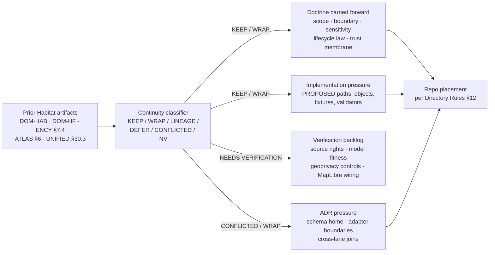

<!-- [KFM_META_BLOCK_V2]
doc_id: kfm://doc/habitat/continuity-inventory
title: Habitat Domain — Continuity Inventory
type: standard
version: v1
status: draft
owners: <habitat-domain-steward>, <docs-steward>     # PROPOSED placeholder
created: 2026-05-17
updated: 2026-06-05
policy_label: public
related:
  - docs/domains/habitat/README.md                   # PROPOSED — verify presence
  - docs/domains/habitat/ARCHITECTURE.md             # PROPOSED — verify presence
  - docs/domains/habitat/CANONICAL_PATHS.md          # PROPOSED — verify presence
  - docs/domains/fauna/README.md                     # PROPOSED — verify presence
  - docs/architecture/habitat-fauna-thin-slice.md    # PROPOSED — cross-lane doc; NOT a habitat-fauna/ domain folder (see §15 note)
  - docs/doctrine/directory-rules.md                 # CONFIRMED doctrine, path PROPOSED
  - docs/registers/VERIFICATION_BACKLOG.md           # PROPOSED — verify presence
  - docs/registers/DRIFT_REGISTER.md                 # PROPOSED — verify presence
  - ai-build-operating-contract.md
tags: [kfm, domain, habitat, continuity, lineage, governance]
notes:
  - CONTRACT_VERSION = "3.0.0"
  - Lineage classifier for prior Habitat planning artifacts.
  - No prior planning is treated as repo implementation evidence.
  - PROPOSED paths require mounted-repo verification before promotion.
  - "CONFLICTED schema-home: ADR-0001 is OPEN per Atlas ADR-S-01 (confirm-or-amend; VB-11-01 NEEDS VERIFICATION); segmented .../domains/habitat/ (DIRRULES §12) vs flat .../habitat/ (Atlas §24.13) unresolved. See §13, §14."
  - "CONFLICTED placement: docs/domains/habitat-fauna/ is a cross-lane domain folder, contrary to DIRRULES §12 (cross-domain doctrine → docs/architecture/<topic>.md). See §15 note."
[/KFM_META_BLOCK_V2] -->

# Habitat Domain — Continuity Inventory

> Lineage register that classifies every prior Habitat planning gain — doctrine, scope, sources, objects, pipelines, viewing surfaces, sensitivity posture, publication gates — and states how each carries forward into the governed repository without being mistaken for implementation.


**Status:** draft &nbsp;·&nbsp; **Owners:** `<habitat-domain-steward>` + `<docs-steward>` *(placeholders — verify)* &nbsp;·&nbsp; **Last updated:** 2026-06-05 &nbsp;·&nbsp; `CONTRACT_VERSION = "3.0.0"`

---

## Quick jump

- [1. Why this file exists](#1-why-this-file-exists)
- [2. Doctrinal anchors and source ledger](#2-doctrinal-anchors-and-source-ledger)
- [3. Continuity classifier](#3-continuity-classifier)
- [4. Continuity flow](#4-continuity-flow)
- [5. Prior gains — domain identity, scope, boundary](#5-prior-gains--domain-identity-scope-boundary)
- [6. Prior gains — ubiquitous language (object & term inventory)](#6-prior-gains--ubiquitous-language-object--term-inventory)
- [7. Prior gains — source families](#7-prior-gains--source-families)
- [8. Prior gains — viewing surfaces & map products](#8-prior-gains--viewing-surfaces--map-products)
- [9. Prior gains — pipeline shape and gates](#9-prior-gains--pipeline-shape-and-gates)
- [10. Prior gains — cross-lane relations](#10-prior-gains--cross-lane-relations)
- [11. Prior gains — sensitivity, geoprivacy, governed AI](#11-prior-gains--sensitivity-geoprivacy-governed-ai)
- [12. Prior gains — Habitat × Fauna thin-slice program](#12-prior-gains--habitat--fauna-thin-slice-program)
- [13. Verification backlog carried over](#13-verification-backlog-carried-over)
- [14. ADR pressure surfaced by this inventory](#14-adr-pressure-surfaced-by-this-inventory)
- [15. Related docs](#15-related-docs)
- [16. Open questions](#16-open-questions)
- [Appendix A — Classification quick-card](#appendix-a--classification-quick-card)
- [Appendix B — Source-citation map](#appendix-b--source-citation-map)

---

## 1. Why this file exists

The Habitat domain has accumulated substantial prior planning across several artifacts — the Habitat blueprint, the Habitat × Fauna thin-slice report, the Encyclopedia chapter, the Culmination Atlas, and the Unified Build Manual lane summary. **None of this is repo evidence.** It is doctrine, lineage, and design pressure.

This Continuity Inventory exists so that:

1. Prior Habitat gains are not silently discarded when the lane is implemented.
2. Prior Habitat gains are not silently elevated to "the repo does X" without verification.
3. Every surface carried forward is named, classified, anchored to its doctrinal source, and given a clear next-action posture (KEEP / WRAP / DEFER / LINEAGE / RETIRE).
4. Verification debt is visible and routable — not implicit.

> [!IMPORTANT]
> This document is a **lineage register**, not a status report. Every implementation-shaped statement here is PROPOSED or NEEDS VERIFICATION until a mounted repo, schema, test, workflow, manifest, or release artifact confirms otherwise. See [`docs/doctrine/directory-rules.md`](../../doctrine/directory-rules.md) §2.1 and §2.5 for authority order and the repo-conflict procedure.

**Scope.** Habitat-owned surfaces only. Habitat × Fauna joins are inventoried under §12, but **Fauna** retains its own continuity inventory; this file does not classify Fauna objects.

[↑ Back to top](#habitat-domain--continuity-inventory)

---

## 2. Doctrinal anchors and source ledger

The Habitat lane has multiple doctrinal anchors. This file treats them strictly as **lineage** unless explicitly stated otherwise.

| Short-name | Artifact | Role for this inventory | Authority level |
|---|---|---|---|
| `[DIRRULES]` | `docs/doctrine/directory-rules.md` *(canonical path PROPOSED)* | Placement law for every Habitat path | **CONFIRMED doctrine** |
| `[ENCY §7.4]` | `kfm_encyclopedia.pdf` — Habitat chapter | Mission, boundary, objects, layers, analytics | CONFIRMED doctrine / PROPOSED implementation |
| `[DOM-HAB]` | Habitat dossier (`kfm_habitat_architecture_pdf_only_blueprint_2026-04-21.pdf`) | Habitat lane architecture, source roles, proof-slice candidates | LINEAGE / PROPOSED |
| `[DOM-HF]` | Habitat × Fauna thin-slice (`KFM_Habitat_Fauna_Thin_Slice_Extended_Pro_Blueprint.pdf`) | First habitat-assignment proof pattern | LINEAGE / PROPOSED |
| `[ATLAS §6]` | `KFM_Domains_Culmination_Atlas_v1_1.pdf` — Habitat section | Cross-domain Habitat consolidation | CONFIRMED doctrine / PROPOSED implementation |
| `[UNIFIED §30.3]` | `KFM_Unified_Implementation_Architecture_Build_Manual.pdf` | Lane assembly summary | CONFIRMED doctrine / PROPOSED implementation |
| `[GAI]` | Governed AI dossier (encyclopedia + ledger) | AI posture for Habitat answers | **CONFIRMED doctrine** |
| `[MAP-MASTER]` | `Master_MapLibre_Components-Functions-Features.pdf` | Renderer-as-non-truth invariant | **CONFIRMED doctrine** |
| `[OPCON]` | `ai-build-operating-contract.md` (`CONTRACT_VERSION = "3.0.0"`) | Operating law; §23.2 sensitive-domain matrix | **CONFIRMED doctrine** |

> [!NOTE]
> The doctrinal anchors above are **named in attached project documents**. Their *file presence in the repository* is PROPOSED until verified. Atlas section numbers here follow the Habitat chapter as `[ATLAS §6.x]`; the Atlas v1.1 crosswalk lists Habitat as chapter 6 (`schemas/contracts/v1/habitat/`, `contracts/habitat/`) — see §13/§14 for the slug conflict.

[↑ Back to top](#habitat-domain--continuity-inventory)

---

## 3. Continuity classifier

Every prior Habitat gain in §§5–12 is classified with **one** of the seven labels below. The vocabulary is derived from KFM continuity practice (Whole-UI + Governed AI Expansion Report §6) and extended for domain inventories.

| Label | Meaning | Default next action |
|---|---|---|
| **KEEP AND EXTEND** | Surface is doctrinally sound and should carry directly into the lane implementation. | Implement in repo against the proper responsibility root. |
| **WRAP WITH ADAPTER** | Surface should be preserved but routed through an adapter, boundary, or governed API rather than a direct callsite. | Define adapter; do not promote raw integration. |
| **KEEP AS LINEAGE** | Surface is valuable as design pressure but is not yet implementation-ready. | Cite in implementation PR; do not assert as repo behavior. |
| **DEFER** | Surface is intentionally postponed until a precondition is met. | Record precondition; revisit when met. |
| **CONFLICTED** | Prior artifacts disagree, or doctrine and prior planning diverge. | Open ADR; add `DRIFT_REGISTER` entry. |
| **NEEDS VERIFICATION** | Surface depends on a repo, source-rights, or external-spec fact not checkable in this session. | Add to `VERIFICATION_BACKLOG`. |
| **RETIRE** | Surface is superseded by newer doctrine and should not carry forward. | Mark superseded; preserve in `docs/archive/` if removed from active doctrine. |

> [!TIP]
> **No prior Habitat *substantive* gain is classified `RETIRE`.** All known prior planning is either being carried forward or held pending verification. The one new `CONFLICTED` item this revision surfaces is a *placement* conflict (the `habitat-fauna/` domain folder, §15), not a retirement of any gain.

[↑ Back to top](#habitat-domain--continuity-inventory)

---

## 4. Continuity flow



> [!NOTE]
> Diagram reflects the doctrinal flow of this inventory, not a live workflow. The repo nodes (`Repo placement`) are PROPOSED targets governed by [Directory Rules §12 Domain Placement Law](../../doctrine/directory-rules.md).

[↑ Back to top](#habitat-domain--continuity-inventory)

---

## 5. Prior gains — domain identity, scope, boundary

| Prior gain | Classification | Doctrinal anchor | Carry-forward posture |
|---|---|---|---|
| Habitat governs patches, land-cover observations, ecological systems, habitat quality, suitability models, connectivity, corridors, restoration opportunities, stewardship zones, receipts, uncertainty, and public-safe habitat products. | **KEEP AND EXTEND** | `[ENCY §7.4]`, `[ATLAS §6.A]`, `[DOM-HAB]` | Carry as canonical mission statement for `docs/domains/habitat/README.md`. |
| Habitat does **not** own species occurrence truth, plant taxa, soil truth, hydrology truth, agriculture, hazards, or archaeology. | **KEEP AND EXTEND** | `[ATLAS §6.B]`, `[ENCY §7.4]` | Carry as explicit non-ownership block; mirror into cross-lane contracts. |
| Habitat is a *proof-bearing thin slice*, not a horizontal coverage program. | **KEEP AND EXTEND** | `[DOM-HF]`, `[UNIFIED §30.3]`, Pass-19 `KFM-IDX-PLN-003` | Drive first PR to a single AOI + closed proof set, not broad coverage. |
| Habitat publication requires `ReleaseManifest`, `EvidenceBundle`, validation/policy support, review state where required, correction path, stale-state rule, and rollback target. | **KEEP AND EXTEND** | `[ATLAS §6.M]`, `[ENCY §7.4 / App. E]` | Carry into `policy/domains/habitat/` and `release/candidates/habitat/` (paths PROPOSED). |

> [!IMPORTANT]
> The non-ownership block (row 2 above) is the strongest single guardrail against cross-domain drift. Implementations that join Habitat to Fauna, Flora, Soil, or Hydrology **must** preserve source ownership at the join — receipts and bundles travel with the owning lane.

[↑ Back to top](#habitat-domain--continuity-inventory)

---

## 6. Prior gains — ubiquitous language (object & term inventory)

The eleven Habitat-owned object families below are **CONFIRMED terms** in attached doctrine; their *field realization* (contracts, schemas, identity rule, temporal fields) is PROPOSED until repo-verified.

| Object family | Term status | Identity-rule status | Temporal-handling status | Notes |
|---|---|---|---|---|
| `HabitatPatch` | CONFIRMED term | PROPOSED deterministic basis: *source id + object role + temporal scope + normalized digest* | CONFIRMED: source / observed / valid / retrieval / release / correction times stay distinct where material | Primary Habitat object. |
| `LandCoverObservation` | CONFIRMED term | PROPOSED (same basis) | CONFIRMED (same posture) | NLCD-style observation. |
| `EcologicalSystem` | CONFIRMED term | PROPOSED | CONFIRMED | NatureServe-aligned classification. |
| `HabitatQualityScore` | CONFIRMED term | PROPOSED | CONFIRMED | Derivative; **model**, not observation. |
| `SuitabilityModel` | CONFIRMED term | PROPOSED | CONFIRMED | Requires model card per `[ATLAS §6.N]`. |
| `ConnectivityEdge` | CONFIRMED term | PROPOSED | CONFIRMED | Patch-graph edge. |
| `Corridor` | CONFIRMED term | PROPOSED | CONFIRMED | Derived; sensitivity-aware. |
| `RestorationOpportunity` | CONFIRMED term | PROPOSED | CONFIRMED | Planning candidate, not commitment. |
| `StewardshipZone` | CONFIRMED term | PROPOSED | CONFIRMED | Joins to PAD-US context. |
| `ModelRunReceipt` | CONFIRMED term | PROPOSED | CONFIRMED | Proof object for every suitability run. |
| `UncertaintySurface` | CONFIRMED term | PROPOSED | CONFIRMED | Must accompany suitability outputs. |

Supporting terms carried forward (CONFIRMED in doctrine; field realization PROPOSED):

- **Regulatory critical habitat** — distinct from **Modeled habitat**; the two must remain visibly separate in viewer products. `[ATLAS §6.C]`
- **Geoprivacy transform** — applies when Habitat outputs reveal sensitive Fauna or Flora context. `[ATLAS §6.C]`, `[DOM-HF]`

> [!CAUTION]
> Do not generalize `HabitatPatch` into a generic "polygon feature." Field realization of every object above must preserve KFM source-role, evidence, temporal, and release-state binding. Treat external standards (STAC, GeoJSON, DCAT) as **shape carriers**, not as the meaning authority.

[↑ Back to top](#habitat-domain--continuity-inventory)

---

## 7. Prior gains — source families

Eight Habitat source families are named in doctrine. Each is classified for continuity, but **source-rights, redistribution terms, snapshot cadence, and endpoint stability for every one of them is NEEDS VERIFICATION** until checked in this run.

| Source family | Typical role(s) | Continuity classification | Rights / cadence status |
|---|---|---|---|
| **USFWS ECOS / critical habitat services** | authority · regulatory context | **KEEP AS LINEAGE** → KEEP AND EXTEND on verification | NEEDS VERIFICATION |
| **KDWP** (state review context) | authority · steward · sensitivity | **KEEP AS LINEAGE** | NEEDS VERIFICATION; sensitive joins fail closed |
| **NLCD** (national land cover) | observation · context | **KEEP AND EXTEND** | NEEDS VERIFICATION (snapshot vintage) |
| **NWI** (national wetlands inventory) | observation · context | **KEEP AND EXTEND** | NEEDS VERIFICATION |
| **GAP / LANDFIRE** | observation · context · model | **KEEP AS LINEAGE** | NEEDS VERIFICATION |
| **NatureServe** (and controlled biodiversity sources) | authority · classification | **WRAP WITH ADAPTER** | Rights NEEDS VERIFICATION; controlled sources fail closed |
| **GBIF / iNaturalist / iDigBio** | observation (occurrence inputs into Habitat × Fauna joins) | **WRAP WITH ADAPTER** | Rights/sensitivity NEEDS VERIFICATION; geoprivacy required |
| **PAD-US** (stewardship context) | context | **KEEP AND EXTEND** | NEEDS VERIFICATION |

> [!WARNING]
> The **deny-by-default** rule for sensitive-occurrence-linked habitat outputs (nests, dens, roosts, hibernacula, spawning sites) is **CONFIRMED doctrine** and must not be relaxed by a source-family adapter. Adapters carry source meaning forward; they **do not** widen sensitivity policy.

[↑ Back to top](#habitat-domain--continuity-inventory)

---

## 8. Prior gains — viewing surfaces & map products

The seven viewer surfaces below are PROPOSED in doctrine. The cross-cutting trust surfaces beneath them are CONFIRMED doctrine.

| Viewer surface | Doctrinal status | Continuity classification | Notes |
|---|---|---|---|
| Habitat overlay registry | PROPOSED | **KEEP AND EXTEND** | Must read released `LayerManifest` only — no canonical-store reads. |
| Source-role badges | PROPOSED | **KEEP AND EXTEND** | Authority / observation / model / context — visible per layer. |
| Critical-habitat view | PROPOSED | **KEEP AS LINEAGE** | Pending USFWS source-descriptor verification; `regulatory` role, **not** `modeled`. |
| Modeled-habitat view | PROPOSED | **KEEP AS LINEAGE** | Requires model card + `UncertaintySurface`; `modeled` role, **not** `regulatory`. |
| Occurrence-summary view (Habitat-side) | PROPOSED | **WRAP WITH ADAPTER** | Occurrence data is **Fauna's truth**; Habitat presents the join result only. |
| Connectivity / corridor view | PROPOSED | **KEEP AND EXTEND** | Public-safe generalization required where joins touch sensitive Fauna. |
| Evidence Drawer — Habitat panel | PROPOSED | **KEEP AND EXTEND** | One hop from `EvidenceBundle` resolution. |

Cross-cutting trust surfaces (carry forward unchanged):

- Evidence Drawer · time-aware state · trust badges · sensitivity-redacted view · correction / stale-state view · governed Focus Mode. **CONFIRMED doctrine** from `[MAP-MASTER]`, `[GAI]`.

> [!NOTE]
> MapLibre is the disciplined 2D renderer behind an adapter. It is **never** truth, policy, publication, or citation authority for Habitat. Cesium / 3D, if added later, consumes the same `EvidenceBundle` and `DecisionEnvelope` as the 2D path. The renderer package name is OPEN (Cesium retirement pending Directory Rules OPEN-DR-10/-11). `[MAP-MASTER]`, `[DIRRULES §11]`

[↑ Back to top](#habitat-domain--continuity-inventory)

---

## 9. Prior gains — pipeline shape and gates

Habitat follows the canonical lifecycle: **RAW → WORK / QUARANTINE → PROCESSED → CATALOG / TRIPLET → PUBLISHED**. Promotion is a governed state transition, not a file move. `[DIRRULES §9]`, `[ATLAS §6.H]`

| Stage | Habitat handling | Gate | Continuity classification |
|---|---|---|---|
| **RAW** | Capture immutable source payload (or reference) with source role, rights, sensitivity, citation, time, and hash. | `SourceDescriptor` exists. | **KEEP AND EXTEND** |
| **WORK / QUARANTINE** | Normalize schema, geometry, time, identity, evidence, rights, and policy. Hold failures. | Validation + policy gate pass, or quarantine reason recorded. | **KEEP AND EXTEND** |
| **PROCESSED** | Emit validated normalized Habitat objects, receipts, and public-safe candidates. | `EvidenceRef`, `ValidationReport`, and digest closure exist. | **KEEP AND EXTEND** |
| **CATALOG / TRIPLET** | Emit catalog records, `EvidenceBundle`s, graph/triplet projections, and release candidates. | Catalog / proof closure passes. | **KEEP AND EXTEND** |
| **PUBLISHED** | Serve released public-safe artifacts through governed APIs and manifests. | `ReleaseManifest` + correction path + rollback target. | **KEEP AND EXTEND** |

Pipeline gates from `[ATLAS §6.H]` and `[UNIFIED §30.3]` carried forward:

- Habitat evidence closure.
- Species-sensitivity policy (joined Fauna context).
- Model / derivative labeling.
- Public-safe transformation receipt.
- Release manifest.
- Rollback target.

> [!IMPORTANT]
> **Watcher-as-non-publisher** applies in Habitat: workers and watchers observe and record, they never write to `data/catalog/` or `data/published/`. Promotion is a governed state transition. `[DIRRULES §13.5]`

[↑ Back to top](#habitat-domain--continuity-inventory)

---

## 10. Prior gains — cross-lane relations

| Habitat ↔ | Relation | Continuity classification | Constraint |
|---|---|---|---|
| **Fauna** | habitat assignment, occurrence context, with geoprivacy | **WRAP WITH ADAPTER** | Fauna owns occurrence truth; Habitat consumes via governed join only. `[ATLAS §6.F]`, `[DOM-HF]` |
| **Flora** | vegetation community, rare-plant context under Flora controls | **WRAP WITH ADAPTER** | Flora owns plant records; sensitivity controls owned by Flora. |
| **Soil / Hydrology** | substrate, moisture, wetlands, riparian support | **KEEP AND EXTEND** | Each retains its own truth; Habitat joins for context. |
| **Hazards** | fire, drought, flood, smoke, resilience stress | **KEEP AND EXTEND** | Hazards retains life-safety boundary; Habitat consumes context only. |

Cross-domain shared artifacts (e.g., a habitat × fauna × hydrology validator) live at the **lowest common responsibility root without a domain segment**, per `[DIRRULES §12]` — e.g., `tools/validators/<topic>/`, `schemas/contracts/v1/<topic>/`, and cross-domain doctrine under `docs/architecture/<topic>.md` — **not** under `tools/validators/domains/habitat/` and **not** under a new `docs/domains/habitat-fauna/` lane folder. (This rule is the basis for the §15 placement correction.)

[↑ Back to top](#habitat-domain--continuity-inventory)

---

## 11. Prior gains — sensitivity, geoprivacy, governed AI

| Posture | Status | Continuity classification |
|---|---|---|
| Habitat layers may reveal sensitive species context when joined to occurrence records; exact occurrence-linked habitat outputs must be generalized, redacted, reviewed, or denied when they create exposure risk. | **CONFIRMED doctrine** | **KEEP AND EXTEND** |
| Sensitive Fauna sites (nests, dens, roosts, hibernacula, spawning sites) joined via Habitat fail closed unless a documented geoprivacy transform and review state permit release. | **CONFIRMED doctrine** | **KEEP AND EXTEND** |
| Public-safe Habitat products require a `RedactionReceipt` (generalization or redaction transform) when sensitive joins are involved. | **CONFIRMED doctrine** | **KEEP AND EXTEND** |
| Governed AI may summarize released Habitat `EvidenceBundle`s, compare evidence, explain limitations, and draft steward-review notes. AI **must** ABSTAIN on insufficient evidence and DENY where policy, rights, sensitivity, or release state blocks the request. | **CONFIRMED doctrine** | **KEEP AND EXTEND** |
| AI outcomes are finite: `ANSWER`, `ABSTAIN`, `DENY`, `ERROR`. No direct model → public path. | **CONFIRMED doctrine** | **KEEP AND EXTEND** |

> [!WARNING]
> The **deny-by-default** posture is non-negotiable in Habitat for any output that touches sensitive Fauna context. An adapter, viewer, or AI surface that widens visibility without a transform receipt and review record is a publication-gate violation. Disposition routes through `ai-build-operating-contract.md` §23.2 (most-restrictive applicable row); this file does not re-derive it.

[↑ Back to top](#habitat-domain--continuity-inventory)

---

## 12. Prior gains — Habitat × Fauna thin-slice program

The Habitat × Fauna thin slice (`[DOM-HF]`) is **the first proof-bearing slice** for the Habitat lane. It is intentionally narrow.

| Element | Doctrinal status | Continuity classification |
|---|---|---|
| One public-safe occurrence joined to one habitat patch; exact point kept steward-only if needed; public-generalized layer proven by redaction receipt. | CONFIRMED doctrine / PROPOSED implementation | **KEEP AND EXTEND** |
| Fixture-first delivery (no live sensitive source connectors). | CONFIRMED doctrine | **KEEP AND EXTEND** |
| One `SourceDescriptor` + one `EvidenceBundle` + one `LayerManifest` + one `ReleaseManifest` + one rollback drill receipt. | PROPOSED implementation | **KEEP AND EXTEND** |
| Validators fail closed on schema, policy, rights, sensitivity, evidence, temporal, geometry, and release violations. | CONFIRMED doctrine | **KEEP AND EXTEND** |
| Cross-lane fixture taxonomy: valid · rights-denied · sensitivity-denied · stale-source · unresolved-`EvidenceRef` · rollback. | PROPOSED design | **KEEP AND EXTEND** |

> [!TIP]
> The thin slice is the right vehicle for converting this Continuity Inventory's `KEEP AND EXTEND` rows into the first Habitat PR. Drive selection of AOI, source descriptor, and fixture set off of `[DOM-HF]` plus `KFM-IDX-PLN-003` (domain lanes as proof-bearing slices) before authoring contracts and schemas. **Where the thin-slice *artifacts* live is governed by §12: the cross-lane doctrine doc belongs under `docs/architecture/`, the cross-lane validator under `tools/validators/<topic>/`, and the cross-lane schema under `schemas/contracts/v1/<topic>/` — not under a `habitat-fauna/` domain folder. See §15.**

[↑ Back to top](#habitat-domain--continuity-inventory)

---

## 13. Verification backlog carried over

These items are explicitly **NEEDS VERIFICATION** (one is **CONFLICTED**). Each must be settled by mounted-repo evidence, schema files, registry entries, tests, logs, emitted artifacts, review records, or release manifests before being promoted from PROPOSED to CONFIRMED.

| # | Item | Evidence that would settle it | Mirrors | Status |
|---:|---|---|---|---|
| 1 | Official **critical-habitat** source descriptors (USFWS ECOS). | `data/registry/sources/habitat/` entries + rights record. | `[ATLAS §6.N]` | NEEDS VERIFICATION |
| 2 | Sensitive-occurrence policy and **geoprivacy transforms**. | `policy/domains/habitat/` files + tests under `tests/domains/habitat/policy/`. | `[ATLAS §6.N]`, `[DOM-HF]` | NEEDS VERIFICATION |
| 3 | **Model-card** requirements for suitability products. | `contracts/domains/habitat/` model-card contract + fixture. | `[ATLAS §6.N]` | NEEDS VERIFICATION |
| 4 | Habitat **MapLibre overlay registry** and Focus behavior. | `LayerManifest` schema + viewer registry binding. | `[ATLAS §6.N]`, `[MAP-MASTER]` | NEEDS VERIFICATION |
| 5 | **Schema-home convention** for Habitat objects. ADR-0001 is **OPEN** (Atlas ADR-S-01 "confirm or amend"; App. G VB-11-01 NEEDS VERIFICATION); **and** segmented `schemas/contracts/v1/domains/habitat/` (DIRRULES §12) vs flat `schemas/contracts/v1/habitat/` (Atlas §24.13) is unresolved. | Accepted ADR-S-01 + DRIFT_REGISTER entry + mounted `schemas/` inspection. | `[DIRRULES §6.4]`, ADR-S-01, `[ATLAS §24.13]` | **CONFLICTED** |
| 6 | **Source rights** and snapshot cadence for NLCD, NWI, GAP/LANDFIRE, NatureServe, GBIF, iNaturalist, iDigBio, PAD-US, KDWP. | Source-descriptor records + license review. | `[DOM-HAB §3]`, `[UNIFIED §30.3]` | NEEDS VERIFICATION |
| 7 | **Identity-rule** for each Habitat object (`source id + object role + temporal scope + normalized digest`). | Deterministic-identity test pack. | `[ATLAS §6.E]` | NEEDS VERIFICATION |
| 8 | **`RedactionReceipt`** schema and storage path for public-safe Habitat products. | Schema + fixture + release dry-run. | `[ATLAS §6.K]`, `[DOM-HF]` | NEEDS VERIFICATION |
| 9 | **Evidence Drawer Habitat-panel** payload schema. | `schemas/contracts/v1/{runtime,ui}/evidence_drawer_payload.schema.json` Habitat sub-section. | `[MAP-MASTER]`, `[UIAI Appendix]` | NEEDS VERIFICATION |
| 10 | **Cross-lane validator** placement (Habitat × Fauna) under a non-domain root. | Mounted-repo `tools/validators/<topic>/` inspection. | `[DIRRULES §12]` | NEEDS VERIFICATION |

All ten items SHOULD be mirrored as entries in `docs/registers/VERIFICATION_BACKLOG.md`, and the `CONFLICTED` item (5) additionally in `docs/registers/DRIFT_REGISTER.md` (paths PROPOSED — verify on the mounted repo).

[↑ Back to top](#habitat-domain--continuity-inventory)

---

## 14. ADR pressure surfaced by this inventory

The following decisions are not resolvable inside this Continuity Inventory and SHOULD travel to ADRs:

1. **Habitat schema home — `CONFLICTED`.** (a) Confirm or amend ADR-0001 per **ADR-S-01** (Atlas App. G VB-11-01 is `NEEDS VERIFICATION`); (b) resolve segmented `schemas/contracts/v1/domains/habitat/` (DIRRULES §12) vs flat `schemas/contracts/v1/habitat/` (Atlas §24.13). CONFIRMED regardless: `.schema.json` never lives under `contracts/`. `[DIRRULES §6.4]`, `[ATLAS §24.12–§24.13]`
2. **Habitat × Fauna join location.** Cross-domain validator and join contracts — under a non-domain responsibility root (`tools/validators/<topic>/`, `schemas/contracts/v1/<topic>/`); cross-domain doctrine under `docs/architecture/<topic>.md` — **not** under either domain's segment and **not** under a `habitat-fauna/` lane folder. `[DIRRULES §12]`
3. **`RedactionReceipt` canonical home.** `data/receipts/` vs. `release/` — and required fields for Habitat-side receipts.
4. **MapLibre overlay registry boundary.** Whether the Habitat layer registry lives under `apps/explorer-web/`, `packages/maplibre/`, or `data/published/layers/habitat/`. `[DIRRULES §11, §13.3]`
5. **Suitability-model card requirement.** Whether `ModelRunReceipt` alone is sufficient or whether a separate model-card contract is required for every published suitability surface.
6. **Sensitive-occurrence redaction thresholds.** Geographic generalization radii, temporal generalization windows, and review-state requirements per taxon class (routes through `ai-build-operating-contract.md` §23.2).

[↑ Back to top](#habitat-domain--continuity-inventory)

---

## 15. Related docs

> All paths below are **PROPOSED**. Verify presence on the mounted repo before treating any as live.

> [!WARNING]
> **Placement conflict — `docs/domains/habitat-fauna/`.** A `habitat-fauna/` folder under `docs/domains/` is a **cross-lane domain folder**, which Directory Rules §12 disallows: cross-domain doctrine belongs under `docs/architecture/<topic>.md`, not under `docs/domains/<picked-or-combined>/`. The Habitat × Fauna thin-slice doc is therefore listed below at its **corrected** PROPOSED home, `docs/architecture/habitat-fauna-thin-slice.md`. Treat this as `CONFLICTED` until an ADR confirms the home; file a `DRIFT_REGISTER.md` entry. This reconciles the doc against its own §10 and §14 item 2. `[DIRRULES §12]`

- `docs/domains/habitat/README.md` — Habitat domain README *(PROPOSED — verify presence)*
- `docs/domains/habitat/ARCHITECTURE.md` — Habitat lane architecture *(PROPOSED)*
- `docs/domains/habitat/CANONICAL_PATHS.md` — Habitat canonical paths *(PROPOSED)*
- `docs/architecture/habitat-fauna-thin-slice.md` — Habitat × Fauna thin-slice plan *(PROPOSED; corrected home — see WARNING above; supersedes prior `docs/domains/habitat-fauna/THIN_SLICE.md` reference)*
- `docs/domains/fauna/README.md` — Fauna domain README *(PROPOSED — verify presence)*
- `docs/doctrine/directory-rules.md` — Directory Rules and Domain Placement Law *(CONFIRMED doctrine; canonical path PROPOSED)*
- `docs/doctrine/lifecycle-law.md` — Lifecycle law (RAW → PUBLISHED) *(CONFIRMED doctrine; path PROPOSED)*
- `docs/doctrine/trust-membrane.md` — Trust-membrane invariant *(CONFIRMED doctrine; path PROPOSED)*
- `docs/architecture/map-shell.md` — MapLibre boundary and overlay registry *(PROPOSED)*
- `docs/standards/PROV.md` — W3C PROV-O profile, used by Habitat receipts *(PROPOSED; `PROV.md` vs `PROVENANCE.md` is OPEN-DR-01)*
- `docs/standards/PMTILES.md` — PMTiles v3 governance, used by Habitat tile delivery *(PROPOSED placement)*
- `docs/standards/OAI-PMH.md` — OAI-PMH 2.0 harvest governance *(PROPOSED placement)*
- `docs/standards/ISO-19115.md` — ISO 19115 crosswalk *(PROPOSED placement)*
- `ai-build-operating-contract.md` — Operating law; §23.2 sensitive-domain matrix *(`CONTRACT_VERSION = "3.0.0"`)*
- `docs/registers/VERIFICATION_BACKLOG.md` — verification backlog *(PROPOSED placement)*
- `docs/registers/DRIFT_REGISTER.md` — placement drift register *(PROPOSED placement; schema-slug + `habitat-fauna/` entries)*
- `docs/adr/ADR-0001-schema-home.md` — schema-home decision *(OPEN per ADR-S-01; confirm or amend)*

[↑ Back to top](#habitat-domain--continuity-inventory)

---

## 16. Open questions

<details>
<summary><b>Click to expand the open-question register</b></summary>

1. **Continuity register placement.** Is `docs/domains/<domain>/CONTINUITY_INVENTORY.md` the canonical home for per-domain continuity inventories, or should a single cross-domain `docs/registers/CONTINUITY_INVENTORY.md` index them with per-domain sub-files? *Tracked here pending ADR.* `[DIRRULES §12]`
2. **Anchor convention.** Are heading anchors expected to be stable across revisions of this register? If yes, the §-numbering should be promoted to a registry key (`HAB-CI-§5`, etc.) before the first cross-doc link is taken.
3. **Sibling-doc bootstrap order.** Should `CONTINUITY_INVENTORY.md` ship before or after `docs/domains/habitat/README.md`? Doctrine permits either; the convention should be locked across all domain lanes.
4. **Habitat × Fauna thin-slice doc home.** Confirm the cross-lane thin-slice doc home is `docs/architecture/habitat-fauna-thin-slice.md` (per §15 correction) rather than a `docs/domains/habitat-fauna/` lane folder. `[DIRRULES §12]`
5. **Habitat AOI for first thin slice.** Which Kansas AOI offers the right combination of NLCD/NWI coverage, low sensitivity, and review feasibility? `[DOM-HF]`, Pass-19 `KFM-IDX-PLN-003`.
6. **`RedactionReceipt` field surface.** Are generalization radii, transform algorithm, and reviewer identity all required fields, or only some? `[ATLAS §6.K]`
7. **Cross-lane "habitat assignment" object home.** Habitat × Fauna joins emit a habitat-assignment record. Does this belong to Habitat, Fauna, or a cross-lane responsibility root? Captured under §14 item 2.
8. **Suitability-model retraining cadence.** When NLCD or LANDFIRE versions roll forward, what is the stale-state policy for Habitat suitability outputs?

</details>

[↑ Back to top](#habitat-domain--continuity-inventory)

---

## Appendix A — Classification quick-card

```text
KEEP AND EXTEND     →  implement in repo against the proper responsibility root
WRAP WITH ADAPTER   →  preserve via adapter / governed API boundary
KEEP AS LINEAGE     →  cite as design pressure; do not assert as repo behavior
DEFER               →  postpone until precondition is met (record the precondition)
CONFLICTED          →  open ADR + DRIFT_REGISTER entry
NEEDS VERIFICATION  →  add to VERIFICATION_BACKLOG; mark dependent paths PROPOSED
RETIRE              →  superseded; preserve in docs/archive/ if removed from active doctrine
```

[↑ Back to top](#habitat-domain--continuity-inventory)

---

## Appendix B — Source-citation map

<details>
<summary><b>Click to expand the citation map for this inventory</b></summary>

| Short-name | Used in §§ | What it underwrites |
|---|---|---|
| `[DIRRULES]` | §§1, 2, 5, 8, 9, 10, 13, 14, 15 | Placement law, domain-segment-under-responsibility-root pattern, lifecycle law, watcher-as-non-publisher, cross-lane placement. |
| `[ENCY §7.4]` | §§2, 5, 6, 11 | Mission, boundary, object families, sources, layers, analytics, governed-AI posture. |
| `[DOM-HAB]` | §§2, 5, 7, 13 | Habitat lane architecture, source families, proof-slice candidates. |
| `[DOM-HF]` | §§2, 5, 7, 8, 11, 12, 13 | Habitat × Fauna thin-slice proof pattern; fixture-first delivery. |
| `[ATLAS §6]` | §§2, 5, 6, 7, 8, 9, 10, 11, 13, 14 | Cross-domain Habitat consolidation; object table; map products; gates. |
| `[ATLAS §24.12–§24.13]` | §§2, 13, 14 | Open-ADR backlog (ADR-S-01) and the dossier↔responsibility-root crosswalk (flat slug). |
| `[UNIFIED §30.3]` | §§2, 5, 9, 13 | Lane assembly summary; pipeline shape; open verification items. |
| `[GAI]` | §§2, 8, 11 | Governed AI finite outcomes, evidence subordination. |
| `[MAP-MASTER]` | §§2, 8, 13, 15 | Renderer-as-non-truth invariant, overlay registry, Focus Mode boundary. |
| `[OPCON]` | §§2, 11, 14 | Operating law; §23.2 sensitive-domain matrix. |
| Pass-19 `KFM-IDX-PLN-003` | §§5, 12, 16 | Domain lanes as proof-bearing slices. |
| Pass-20 idea index | §12 | Fixture taxonomy and validator fail-closed posture. |
| ADR-0001 / ADR-S-01 (schema home) | §§13, 14, 15 | Schema-home rule — **OPEN** (confirm or amend). |

</details>

[↑ Back to top](#habitat-domain--continuity-inventory)

---

**Related docs (short list):** [`docs/domains/habitat/README.md`](./README.md) *(PROPOSED)* · [`docs/architecture/habitat-fauna-thin-slice.md`](../../architecture/habitat-fauna-thin-slice.md) *(PROPOSED; corrected home — §15)* · [`docs/doctrine/directory-rules.md`](../../doctrine/directory-rules.md) *(CONFIRMED doctrine; path PROPOSED)* · [`docs/registers/VERIFICATION_BACKLOG.md`](../../registers/VERIFICATION_BACKLOG.md) *(PROPOSED)*

**Last updated:** 2026-06-05 &nbsp;·&nbsp; **Doc class:** standard &nbsp;·&nbsp; **Status:** draft &nbsp;·&nbsp; **Version:** v1 &nbsp;·&nbsp; `CONTRACT_VERSION = "3.0.0"`

[↑ Back to top](#habitat-domain--continuity-inventory)
