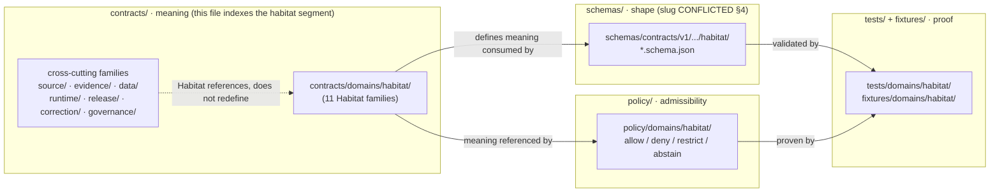

<!-- [KFM_META_BLOCK_V2]
doc_id: kfm://doc/habitat/contracts-index
title: Habitat Domain — Contracts Index
type: standard
version: v1
status: draft
owners: <habitat-domain-steward>, <contract-steward>   # PROPOSED placeholders — verify against CODEOWNERS
created: 2026-06-05
updated: 2026-06-05
policy_label: public
related:
  - docs/domains/habitat/README.md
  - docs/domains/habitat/ARCHITECTURE.md
  - docs/domains/habitat/API_CONTRACTS.md
  - docs/domains/habitat/CANONICAL_PATHS.md
  - docs/architecture/contract-schema-policy-split.md
  - docs/doctrine/directory-rules.md
  - docs/adr/ADR-0001-schema-home.md
  - ai-build-operating-contract.md
  - contracts/domains/habitat/
  - schemas/contracts/v1/domains/habitat/
  - policy/domains/habitat/
tags: [kfm, habitat, contracts, object-families, meaning, contract-schema-policy-split]
notes:
  - CONTRACT_VERSION = "3.0.0"
  - This is a docs-side INDEX of contracts/domains/habitat/ (meaning), not the contract files and not machine schemas.
  - .schema.json files NEVER live under contracts/ — they live under the canonical schema home (slug CONFLICTED, see §4).
  - "CONFLICTED schema-home: ADR-0001 OPEN per Atlas ADR-S-01 (confirm-or-amend; VB-11-01 NEEDS VERIFICATION); segmented .../domains/habitat/ (DIRRULES §12) vs flat .../habitat/ (Atlas §24.13) unresolved. See §4."
  - All repo-path claims are PROPOSED until verified against a mounted repo.
[/KFM_META_BLOCK_V2] -->

# Habitat Domain — Contracts Index

> The index and charter for the Habitat **contract layer** — the Markdown that fixes what each Habitat object *means*, what its fields *intend*, and what invariants it *carries*. Shape lives in `schemas/`, admissibility in `policy/`, proof in `tests/fixtures/`. This file is the meaning side of that split.

**Status:** `draft` &nbsp;·&nbsp; **Owners:** `<habitat-domain-steward>` + `<contract-steward>` *(placeholders — verify)* &nbsp;·&nbsp; **Updated:** 2026-06-05 &nbsp;·&nbsp; `CONTRACT_VERSION = "3.0.0"`

> [!IMPORTANT]
> This file is a **docs-side index** of the Habitat contract surface. It is **not** a contract file, **not** a JSON Schema, and **not** a policy bundle. Object *meaning* lives in `contracts/domains/habitat/*.md`; machine *shape* lives under the canonical schema home (slug `CONFLICTED`, §4); *admissibility* lives in `policy/domains/habitat/`. Where this index and those authorities disagree, **they win** and the drift is filed against this file in `docs/registers/DRIFT_REGISTER.md`.

---

## Contents

1. [What `contracts/` owns — and what it does not](#1-what-contracts-owns--what-it-does-not)
2. [Authority basis](#2-authority-basis)
3. [Contract-layer map](#3-contract-layer-map)
4. [Where each family lives (the four-layer split)](#4-where-each-family-lives-the-four-layer-split)
5. [Object families](#5-object-families)
6. [Cross-cutting kernel contracts Habitat references](#6-cross-cutting-kernel-contracts-habitat-references)
7. [Sensitivity posture pointers](#7-sensitivity-posture-pointers)
8. [Contract change discipline](#8-contract-change-discipline)
9. [Companion sections](#open-questions-register)
10. [Related docs](#related-docs)

---

## 0. Status & Authority

| Field | Value |
|---|---|
| **Document type** | Domain contracts index / charter (standard doc). |
| **Authority of the split referenced here** | **CONFIRMED** — Directory Rules §2.3, §6.3–§6.5 define the contract / schema / policy / test split. |
| **Authority of any specific Habitat contract path** | **PROPOSED** until verified against mounted-repo evidence. |
| **Schema-home convention** | Default `schemas/contracts/v1/…`; **segment slug `CONFLICTED`** and ADR-0001 **OPEN** (Atlas ADR-S-01). See §4. |
| **What this file owns** | An index of meanings and pointers; **not** the meanings' final authority (that is the contract `.md` files themselves). |

[↑ Back to top](#contents)

---

## 1. What `contracts/` owns — and what it does not

> `CONFIRMED doctrine.` _[DIRRULES §2.3, §6.3], [REPO-GUIDE §7]._

The contract layer fixes **object-family meaning**: what an object means, what its fields intend, and what invariants it carries — expressed in Markdown.

**Belongs in `contracts/domains/habitat/`:**
- Object semantics for each Habitat family (one `.md` per family).
- Field intent, invariants, and the source-role / temporal / evidence / release-state bindings each field must preserve.
- Interface intent and glossary links into the ubiquitous language.

**Does NOT belong in `contracts/` (and where it goes instead):**

| Excluded | Correct home | Basis |
|---|---|---|
| Machine `.schema.json` shape | canonical Habitat schema home (slug `CONFLICTED`, §4) | DIRRULES §6.4 — **`.schema.json` NEVER under `contracts/`** |
| Admissibility / allow-deny-restrict-abstain | `policy/domains/habitat/` | DIRRULES §6.5 |
| Executable validators | `tools/validators/…` | DIRRULES §6.3 |
| Fixtures / golden inputs | `tests/domains/habitat/`, `fixtures/domains/habitat/` | DIRRULES §6.6 |
| Lifecycle data / instances | `data/<phase>/habitat/` | DIRRULES §9 |
| Machine registers | `control_plane/` | DIRRULES §6.2 |

> [!CAUTION]
> **`.schema.json` files never live under `contracts/`.** A Habitat schema found at `contracts/domains/habitat/*.schema.json` is `LINEAGE / CONFLICTED` and MUST be migrated to the canonical schema home before any new schema lands. The repo MUST NOT maintain divergent definitions in both `schemas/` and `contracts/`. _[DIRRULES §6.4, §13.1]._

[↑ Back to top](#contents)

---

## 2. Authority basis

| Source | Section | What it governs |
|---|---|---|
| Directory Rules | §2.3, §6.3 | What the contract layer owns (meaning) and does not (shape, policy, validators). |
| Directory Rules | §6.4 | Schema home is `schemas/`; `.schema.json` never under `contracts/`. **Home rule is ADR-required** (§2.4(3)). |
| Directory Rules | §6.3 tree | `contracts/` has cross-cutting families (`source/`, `evidence/`, `runtime/`, `release/`, …) **and** a `domains/<domain>/` segment. |
| ADR-0001 / **ADR-S-01** | Schema home | **OPEN** — "confirm `schemas/contracts/v1/…` by ADR-0001 **or amend**"; Atlas App. G VB-11-01 `NEEDS VERIFICATION`. |
| Atlas v1.1 §6 (Habitat) | Object families | The eleven Habitat-owned object families (§5). |
| Atlas v1.1 §24.13 | Crosswalk | Flat slug `schemas/contracts/v1/habitat/` — `CONFLICTED` against DIRRULES §12 segmented form. |
| KFM Encyclopedia §7.4 | Mission / boundary | Habitat ownership and non-ownership. |
| `ai-build-operating-contract.md` | §23.2; §37 | Sensitive-domain matrix; doc/version lifecycle (`CONTRACT_VERSION = "3.0.0"`). |

> [!TIP]
> When this index and Directory Rules conflict, **Directory Rules wins**; open a `DRIFT_REGISTER.md` entry and correct this file.

[↑ Back to top](#contents)

---

## 3. Contract-layer map

> [!NOTE]
> The diagram is the clean split, not a build graph: `contracts/` (meaning) → `schemas/` (shape) → `policy/` (admissibility) → `tests/fixtures/` (proof). Each Habitat family appears in all four, owned by the matching responsibility root. _[DIRRULES §6.3–§6.6]._

[↑ Back to top](#contents)

---

## 4. Where each family lives (the four-layer split)

> [!WARNING]
> **Schema-home slug is `CONFLICTED` and ADR-required.** Two questions are **open**: (1) is `schemas/contracts/v1/…` confirmed as the canonical home (ADR-S-01: "confirm or amend" ADR-0001; VB-11-01 `NEEDS VERIFICATION`)? (2) segmented `schemas/contracts/v1/domains/habitat/` (DIRRULES §12) vs flat `schemas/contracts/v1/habitat/` (Atlas §24.13)? CONFIRMED regardless: `.schema.json` never lives under `contracts/`. The `schemas/` paths below use the segmented slug; if ADR-S-01 selects the flat form, read them as `schemas/contracts/v1/habitat/…`. Open a `DRIFT_REGISTER.md` entry; do not create both slugs.

| Layer | Habitat home (PROPOSED) | Owns | Status |
|---|---|---|---|
| **Meaning** | `contracts/domains/habitat/<family>.md` | What the object means, field intent, invariants | PROPOSED |
| **Shape** | `schemas/contracts/v1/domains/habitat/<family>.schema.json` | JSON Schema validation | PROPOSED / slug CONFLICTED |
| **Admissibility** | `policy/domains/habitat/<rule>.rego` | allow / deny / restrict / abstain | PROPOSED |
| **Proof** | `tests/domains/habitat/`, `fixtures/domains/habitat/` | enforceability, golden/valid/invalid inputs | PROPOSED |

[↑ Back to top](#contents)

---

## 5. Object families

The eleven Habitat-owned object families are **CONFIRMED terms** in doctrine; their *field realization* (the contract Markdown, schema, identity rule, temporal fields) is **PROPOSED** until repo-verified. Each family carries the **CONFIRMED bitemporal discipline** — source / observed / valid / retrieval / release / correction times stay distinct where material — and a **PROPOSED** deterministic identity basis: *source id + object role + temporal scope + normalized digest*. _[ATLAS §6.B, §6.E], [DOM-HAB], [DOM-HF], [ENCY §7.4]._

| # | Object family | Meaning (one-line) | Key invariant the contract MUST fix | Status |
|---|---|---|---|---|
| 5.1 | `HabitatPatch` | A bounded polygon of relatively homogeneous habitat character. | Carries source role + evidence; geometry generalizes under sensitive joins. | CONFIRMED term / PROPOSED fields |
| 5.2 | `LandCoverObservation` | An observation-class record from a land-cover inventory (e.g., NLCD). | Source-vintage time + class-system version required; `observed` role. | CONFIRMED term / PROPOSED fields |
| 5.3 | `EcologicalSystem` | A higher-order ecological classification (NatureServe-style). | Source role distinguishes authority vs derivative. | CONFIRMED term / PROPOSED fields |
| 5.4 | `HabitatQualityScore` | A descriptive quality value. | **Descriptive, never prescriptive**; model/observation label visible. | CONFIRMED term / PROPOSED fields |
| 5.5 | `SuitabilityModel` | A modeled suitability surface or score. | Labeled **model**, never observation; requires model card + `UncertaintySurface`. | CONFIRMED term / PROPOSED fields |
| 5.6 | `ConnectivityEdge` | A patch-graph edge expressing functional connectivity. | Method + support visible; derivative. | CONFIRMED term / PROPOSED fields |
| 5.7 | `Corridor` | Modeled or observed corridor geometry. | Derivative; **not** a movement assertion about any individual taxon. | CONFIRMED term / PROPOSED fields |
| 5.8 | `RestorationOpportunity` | A candidate area for restoration. | Planning candidate, **not** commitment; steward-review state for promotion. | CONFIRMED term / PROPOSED fields |
| 5.9 | `StewardshipZone` | A stewardship-context polygon (PAD-US joins, easements). | `T1` sensitivity default; named-party detail gated. | CONFIRMED term / PROPOSED fields |
| 5.10 | `ModelRunReceipt` | The run-identity object for a habitat model run. | Inputs, version, support, time, hash; proof object for every suitability run. | CONFIRMED term / PROPOSED fields |
| 5.11 | `UncertaintySurface` | An uncertainty raster or field. | First-class evidence; **must not be erased** to publish a confident-looking score. | CONFIRMED term / PROPOSED fields |

> [!IMPORTANT]
> **Modeled habitat ≠ Regulatory critical habitat.** The contract for `SuitabilityModel` (`modeled` role) and any contract surfacing critical-habitat context (`regulatory` role, USFWS ECOS authority) MUST keep the two roles distinct. Flattening one into the other is a source-role-collapse violation enforced at `policy/` and the governed API. _[DOM-HAB], [API_CONTRACTS §6, §11], [ATLAS §24.1]._

> [!CAUTION]
> Do not generalize `HabitatPatch` (or any family above) into a generic "polygon feature." Treat external standards (STAC, GeoJSON, DCAT) as **shape carriers**, not meaning authorities. KFM source-role, evidence, temporal, and release-state binding are part of the meaning the contract fixes. _[DIRRULES §6.4], [DDD]._

[↑ Back to top](#contents)

---

## 6. Cross-cutting kernel contracts Habitat references

Habitat **references** these cross-cutting families; it does **not** redefine or duplicate them under `domains/habitat/`. They live under non-domain segments of the same responsibility roots. _[DIRRULES §6.3], [API_CONTRACTS §6 note]._

| Kernel contract | Cross-cutting home (PROPOSED) | Habitat use |
|---|---|---|
| `SourceDescriptor` | `contracts/source/` | Admission of every Habitat source family. |
| `EvidenceRef` / `EvidenceBundle` | `contracts/evidence/` | Every evidence-bearing Habitat claim. |
| `DatasetVersion` / `ValidationReport` | `contracts/data/` | Processed-stage closure. |
| `RunReceipt` | `contracts/runtime/` | Note: Habitat's `ModelRunReceipt` (§5.10) is a **distinct** domain object, not this kernel receipt. |
| `DecisionEnvelope` / `RuntimeResponseEnvelope` / `AIReceipt` | `contracts/runtime/` | Governed-API finite outcomes; see `API_CONTRACTS.md`. |
| `ReleaseManifest` / `PromotionDecision` / `RollbackCard` | `contracts/release/` | Habitat publication, promotion, rollback. |
| `CorrectionNotice` | `contracts/correction/` | Habitat corrections. |
| `ReviewRecord` | `contracts/governance/` | Steward review of sensitive/release-significant items. |
| `RedactionReceipt` | `contracts/` (home is ADR-pending — `data/receipts/` vs `release/`) | Required for any public-safe Habitat product derived from sensitive sources. |

> [!NOTE]
> The `RedactionReceipt` canonical home is an open ADR (cf. CANONICAL_PATHS §12). Until resolved, reference it by meaning, not by an asserted path.

[↑ Back to top](#contents)

---

## 7. Sensitivity posture pointers

> [!CAUTION]
> Habitat contracts sit one join away from rare-species exposure. Any Habitat object joined to a sensitive Fauna/Flora occurrence (nests, dens, roosts, hibernacula, spawning sites) **fails closed** by default. The contract meaning must preserve that a sensitive-join derivative requires a `RedactionReceipt` + `ReviewRecord` + `PolicyDecision` before public release. Disposition routes through `ai-build-operating-contract.md` §23.2 (most-restrictive applicable row); this index does not re-derive it.

This file fixes **meaning**, not admissibility. The deny-by-default rules live in `policy/domains/habitat/` and `policy/sensitivity/`. The contract's job is to ensure each family's fields make the sensitive-join condition *expressible and checkable* — e.g., that `HabitatPatch` carries a source-role and sensitivity binding the policy layer can act on.

[↑ Back to top](#contents)

---

## 8. Contract change discipline

> `CONFIRMED doctrine.` _[DIRRULES §6.3], [OPCON §37]._

- A **semantic breaking change** to any Habitat object meaning requires an ADR and re-issue of dependent receipts; pair the contract `.md` edit with the matching `schemas/` change.
- Object-family **names are stable vocabulary**; renaming a family without an ADR breaks crosswalks across the corpus.
- The contract `.md` and its `schemas/` shape MUST stay synchronized; a contract-schema crosswalk check enforces this. `.schema.json` never migrates *into* `contracts/`.
- A change that only clarifies meaning (no field/invariant change) is a **MINOR** doc bump per contract §37.

[↑ Back to top](#contents)

---

## Open questions register

| ID | Question | Owner role | Resolution path |
|---|---|---|---|
| OQ-HAB-CTR-01 | Habitat schema-home slug: segmented `.../domains/habitat/` (DIRRULES §12) vs flat `.../habitat/` (Atlas §24.13); confirm/amend ADR-0001 (ADR-S-01). | Schema steward + Docs steward | ADR-S-01 + DRIFT_REGISTER |
| OQ-HAB-CTR-02 | `RedactionReceipt` canonical home — `data/receipts/` vs `release/` — and required fields. | Policy steward | ADR |
| OQ-HAB-CTR-03 | Is `docs/domains/<domain>/CONTRACTS.md` the canonical name for the per-domain contract index, vs `CONTRACTS_INDEX.md` or a README section? | Docs steward | Directory Rules check / convention lock |
| OQ-HAB-CTR-04 | Exact contract `.md` filenames + identity-rule realization per family under `contracts/domains/habitat/`. | Contract steward | repo inspection |

## Open verification backlog

These items remain `NEEDS VERIFICATION` before promotion from `draft` to `published`:

1. Confirm `contracts/domains/habitat/` exists and which family `.md` files are present.
2. Resolve the schema-home slug (OQ-HAB-CTR-01) and confirm no `.schema.json` lives under `contracts/`.
3. Verify the per-family identity-rule realization (`source id + object role + temporal scope + normalized digest`).
4. Verify the contract-schema crosswalk check is wired in CI.
5. Confirm the parent `docs/domains/habitat/` index links to this file.

## Changelog v0 → v1

| Change | Type (per contract §37) | Reason |
|---|---|---|
| Initial Habitat contracts index | new | Establish the meaning-layer charter for the Habitat lane |

> **Backward compatibility.** New file; no prior anchors. If the file is renamed (OQ-HAB-CTR-03), in-doc anchors are preserved but the path changes — track in DRIFT_REGISTER.

## Definition of done

This document is done enough to enter the repository when:

- it is placed according to Directory Rules and the name is confirmed (OQ-HAB-CTR-03);
- a docs steward and the contract steward review it;
- it is linked from `docs/domains/habitat/` and any doctrine/domain index;
- it does not conflict with accepted ADRs;
- the schema-slug conflict (OQ-HAB-CTR-01) is logged in `docs/registers/DRIFT_REGISTER.md`;
- the `GENERATED_RECEIPT.json` planned in Section 2 is wired into CI;
- future changes follow the operating contract's §37 lifecycle.

---

## Related docs

- `docs/domains/habitat/README.md` — Habitat lane index *(PROPOSED)*
- `docs/domains/habitat/ARCHITECTURE.md` — Habitat lane architecture *(PROPOSED)*
- `docs/domains/habitat/API_CONTRACTS.md` — governed-API surfaces (DTOs, finite outcomes) *(PROPOSED)*
- `docs/domains/habitat/CANONICAL_PATHS.md` — full path enumeration *(PROPOSED)*
- `docs/architecture/contract-schema-policy-split.md` — the four-layer split this file applies *(PROPOSED)*
- `docs/doctrine/directory-rules.md` — §2.3, §6.3–§6.6
- `docs/adr/ADR-0001-schema-home.md` — schema-home rule *(OPEN per ADR-S-01)*
- `ai-build-operating-contract.md` — §23.2 sensitive-domain matrix; §37 lifecycle *(`CONTRACT_VERSION = "3.0.0"`)*
- `contracts/domains/habitat/` — the Habitat contract `.md` files this index points to *(PROPOSED)*
- `docs/registers/DRIFT_REGISTER.md` — schema-slug `CONFLICTED` entry *(PROPOSED)*

_Last updated: 2026-06-05 · `CONTRACT_VERSION = "3.0.0"`_

[↑ Back to top](#contents)
