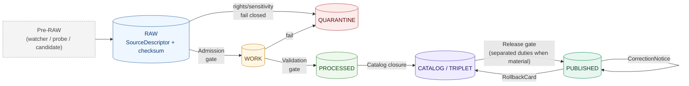

<!-- [KFM_META_BLOCK_V2]
doc_id: kfm://doc/habitat-data-lifecycle
title: Habitat Domain — Data Lifecycle
type: standard
version: v1
status: draft
owners: [habitat-stewards, lifecycle-stewards]   # NEEDS VERIFICATION
created: 2026-05-17
updated: 2026-06-05
policy_label: public
related:
  - docs/domains/habitat/README.md                                 # PROPOSED — verify
  - docs/domains/habitat/ARCHITECTURE.md                           # PROPOSED — verify
  - docs/domains/habitat/CANONICAL_PATHS.md                        # PROPOSED — verify
  - docs/domains/habitat/CONTRACTS.md                              # PROPOSED — verify
  - docs/doctrine/lifecycle-law.md                                 # PROPOSED — verify
  - docs/doctrine/directory-rules.md                               # CONFIRMED reference
  - docs/standards/PROV.md                                         # CONFIRMED reference
  - docs/standards/PMTILES.md                                      # CONFIRMED reference
  - docs/standards/OGC-API-TILES.md                                # CONFIRMED reference
  - docs/standards/OAI-PMH.md                                      # CONFIRMED reference
  - docs/standards/ISO-19115.md                                    # CONFIRMED reference
  - docs/runbooks/fauna/SOURCE_REFRESH_RUNBOOK.md                  # CONFIRMED reference
  - ai-build-operating-contract.md                                # CONFIRMED reference
  - data/README.md                                                 # PROPOSED — verify
  - release/README.md                                              # PROPOSED — verify
tags: [kfm, habitat, lifecycle, governance, evidence, policy]
notes:
  - CONTRACT_VERSION = "3.0.0"
  - "Domain-scoped lifecycle profile; conforms to the KFM lifecycle invariant; does not redefine it."
  - "Implementation-layer paths and validators remain PROPOSED until verified against mounted repo."
  - "CONFLICTED schema-home: ADR-0001 OPEN per Atlas ADR-S-01 (confirm-or-amend; VB-11-01 NEEDS VERIFICATION); segmented .../domains/habitat/ (DIRRULES §12) vs flat .../habitat/ (Atlas §24.13) unresolved. See §2.2."
[/KFM_META_BLOCK_V2] -->

# Habitat Domain — Data Lifecycle

A governed, evidence-first traversal of the KFM lifecycle invariant for habitat patches, land-cover observations, ecological systems, suitability surfaces, connectivity, corridors, restoration opportunities, stewardship zones, and the receipts that prove their movement.

[](#)
[](#)
[](#)
[](#3-lifecycle-overview)
[](#7-sensitivity-rights-and-publication-posture)
[](#22-authority-boundaries)
[](#)
[](#)
[](#)

> **Status** · draft &nbsp;·&nbsp; **Owners** · habitat-stewards, lifecycle-stewards (NEEDS VERIFICATION) &nbsp;·&nbsp; **Updated** · 2026-06-05 &nbsp;·&nbsp; `CONTRACT_VERSION = "3.0.0"`

> [!IMPORTANT]
> This document is a **domain-scoped profile** of the KFM lifecycle invariant. It does not redefine the lifecycle, the trust membrane, the watcher-as-non-publisher invariant, or the publication gate. Where it appears to do so, **the upstream doctrine wins** and a drift entry should be opened in `docs/registers/DRIFT_REGISTER.md`.

---

## Table of contents

1. [Scope and audience](#1-scope-and-audience)
2. [Repo fit and authority boundaries](#2-repo-fit-and-authority-boundaries)
3. [Lifecycle overview](#3-lifecycle-overview)
4. [Stage profiles (RAW → PUBLISHED)](#4-stage-profiles-raw--published)
5. [Object families by stage](#5-object-families-by-stage)
6. [Source admission, connectors, and watchers](#6-source-admission-connectors-and-watchers)
7. [Sensitivity, rights, and publication posture](#7-sensitivity-rights-and-publication-posture)
8. [Receipts, proofs, and evidence closure](#8-receipts-proofs-and-evidence-closure)
9. [Publication, correction, and rollback](#9-publication-correction-and-rollback)
10. [Cross-lane joins and constraints](#10-cross-lane-joins-and-constraints)
11. [Anti-patterns and drift prevention](#11-anti-patterns-and-drift-prevention)
12. [Open questions and verification backlog](#12-open-questions-and-verification-backlog)
13. [Related docs](#13-related-docs)
14. [Appendix A — Glossary (habitat scope)](#appendix-a--glossary-habitat-scope)

---

## 1. Scope and audience

**In scope.** The lifecycle traversal of habitat-domain artifacts from source admission through governed publication, correction, and rollback. CONFIRMED domain scope (doctrine-level): habitat patches, land-cover observations, ecological systems, habitat quality, suitability models, connectivity edges, corridors, restoration opportunities, stewardship zones, model-run receipts, and uncertainty surfaces.

**Out of scope.** Object semantics (defined under `contracts/domains/habitat/`; indexed by `docs/domains/habitat/CONTRACTS.md`), machine shape (defined under the canonical Habitat schema home — slug `CONFLICTED`, §2.2), and admissibility logic (defined under `policy/domains/habitat/`). Species occurrence truth and animal taxonomy are owned by **Fauna**; plant taxonomy and rare-plant records are owned by **Flora**; soil, hydrology, hazards, agriculture, and archaeology retain their own truth. Habitat joins them through governed relationships only.

**Audience.** Domain stewards, pipeline engineers, validator authors, policy authors, release authorities, and reviewers responsible for habitat artifacts on their way to public surfaces.

> [!NOTE]
> **Doctrinal anchors.** This document profiles, not redefines, the KFM lifecycle invariant **RAW → WORK / QUARANTINE → PROCESSED → CATALOG / TRIPLET → PUBLISHED**, with **promotion as a governed state transition, not a file move**. CONFIRMED across `directory-rules.md` §9, the Pipeline Manual lineage, and the Domains Culmination Atlas §6.H.

[Back to top ↑](#table-of-contents)

---

## 2. Repo fit and authority boundaries

Habitat is a **domain lane** distributed across responsibility roots — not a root-level folder. Path placement follows Domain Placement Law in `directory-rules.md` §12. CONFIRMED doctrine; specific paths PROPOSED until repo-verified.

### 2.1 Habitat lane paths

```text
docs/domains/habitat/                          # PROPOSED — this document lives here
contracts/domains/habitat/                     # PROPOSED — object meaning
schemas/contracts/v1/domains/habitat/          # PROPOSED — machine shape (schema home; slug CONFLICTED — see §2.2)
policy/domains/habitat/                        # PROPOSED — allow/deny/restrict/abstain
tests/domains/habitat/                         # PROPOSED — proof of enforceability
fixtures/domains/habitat/                      # PROPOSED — sample data for tests
packages/domains/habitat/                      # PROPOSED — shared library code
pipelines/domains/habitat/                     # PROPOSED — executable pipeline logic
pipeline_specs/habitat/                        # PROPOSED — declarative pipeline configs
connectors/habitat/                            # PROPOSED — source-specific fetchers (admit to data/raw/)

data/raw/habitat/<source_id>/<run_id>/         # PROPOSED — immutable source-edge captures
data/work/habitat/<run_id>/                    # PROPOSED — normalized intermediates
data/quarantine/habitat/<reason>/<run_id>/     # PROPOSED — failed/held items
data/processed/habitat/<dataset_id>/<version>/ # PROPOSED — validated canonical records
data/catalog/domain/habitat/                   # PROPOSED — STAC / DCAT / PROV / domain catalog
data/triplets/                                 # PROPOSED — relationship projections (non-domain-scoped; triplets/ plural per DIRRULES §9)
data/published/layers/habitat/                 # PROPOSED — released public-safe artifacts
data/registry/sources/habitat/                 # PROPOSED — append-only source descriptors
data/rollback/habitat/<release_id>/            # PROPOSED — alias-revert receipts

release/candidates/habitat/                    # PROPOSED — release candidate dossiers
release/manifests/                             # PROPOSED — ReleaseManifest by release_id (cross-domain)
release/promotion_decisions/                   # PROPOSED — PromotionDecision records
release/rollback_cards/                        # PROPOSED — rollback artifacts
release/correction_notices/                    # PROPOSED — public correction notices
```

### 2.2 Authority boundaries

| Boundary | Habitat rule | Authority |
|---|---|---|
| Trust membrane | Public clients consume governed APIs and released artifacts; **never** `data/raw/`, `data/work/`, `data/quarantine/`, or unpublished candidates. | `apps/governed-api/` (PROPOSED route surface) |
| Canonical schema home | `.schema.json` files live under `schemas/`, **never** under `contracts/` (CONFIRMED). **Which `schemas/` slug is canonical is `CONFLICTED`** — see callout below. | ADR-0001 / **ADR-S-01 (OPEN)** |
| Watcher posture | Source-drift detectors emit `WORK_CANDIDATE` records; they **never** write to `data/processed/`, `data/catalog/`, or `data/published/`. | Watcher-as-non-publisher invariant (CONFIRMED) |
| Connector posture | Connectors admit to `data/raw/habitat/` or `data/quarantine/habitat/`; pipelines promote. | `directory-rules.md` §13.5 |

> [!WARNING]
> **Schema-home slug is `CONFLICTED` and ADR-required.** Two questions are **open**: (1) is `schemas/contracts/v1/…` confirmed as the canonical home? This is **ADR-S-01** — "confirm `schemas/contracts/v1/…` by ADR-0001 **or amend**"; Atlas App. G VB-11-01 marks it `NEEDS VERIFICATION`. (2) Segmented `schemas/contracts/v1/domains/habitat/` (DIRRULES §12) vs flat `schemas/contracts/v1/habitat/` (Atlas §24.13). CONFIRMED regardless: `.schema.json` never lives under `contracts/`, and the repo MUST NOT maintain divergent definitions in both `schemas/` and `contracts/`. Cite ADR-0001 as **proposed/open**; open a `DRIFT_REGISTER.md` entry; do not create both slugs. _[DIRRULES §6.4, §13.1, §2.4(3)], [ATLAS §24.12 ADR-S-01], [§24.13], [App. G VB-11-01]._

[Back to top ↑](#table-of-contents)

---

## 3. Lifecycle overview



> [!NOTE]
> **Promotion is a governed state transition, not a file move.** A path-level copy from `data/raw/habitat/` into `data/processed/habitat/` that bypasses validators, policy gates, EvidenceBundle creation, catalog closure, and release-decision recording is a **violation of the invariant** regardless of which directory the bytes ended up in. CONFIRMED from `directory-rules.md` §9.

[Back to top ↑](#table-of-contents)

---

## 4. Stage profiles (RAW → PUBLISHED)

Habitat follows the canonical lifecycle. CONFIRMED doctrine; stage application within the habitat lane is PROPOSED until validators, fixtures, and a release dry-run are wired and verified.

### 4.1 Stage table

| Stage | Habitat handling | Gate (pre-condition to leave) | Allowed | MUST NOT | Status |
|---|---|---|---|---|---|
| **RAW** | Capture immutable habitat source payload or reference with source role, rights, sensitivity, citation, time, and hash. | `SourceDescriptor` exists; hash recorded. | Source-edge captures (NLCD, NWI, GAP/LANDFIRE, NatureServe, PAD-US, occurrence aggregators where habitat-context-only). | Public clients; AI context; UI layers; normalized records. | PROPOSED application of CONFIRMED doctrine |
| **WORK** | Normalize schema, geometry, time, identity, evidence, rights, and policy for habitat objects (patch, land-cover, ecological system, suitability, connectivity, corridor, restoration, stewardship). | `TransformReceipt` + `ValidationReport` (working set) + `PolicyDecision`. | Normalized intermediates; candidate `EvidenceRef` resolutions; suitability model runs. | Public API/UI; release aliases. | PROPOSED application |
| **QUARANTINE** | Hold habitat inputs with unresolved rights, sensitive joins, schema drift, identity ambiguity, or over-precise occurrence-linked geometry. | Quarantine reason recorded; never silently promotes. | Failed validation; rights-unknown; sensitive joins not yet generalized. | Promotion without remediation. | PROPOSED application |
| **PROCESSED** | Emit validated normalized habitat objects, receipts, and public-safe candidates (e.g., generalized habitat overlays). | `EvidenceRef` resolves; `ValidationReport` passes; digest closure. | Validated canonical habitat records; public-safe candidates. | Assumption of public/release status. | PROPOSED application |
| **CATALOG / TRIPLET** | Emit STAC/DCAT/PROV catalog records, `EvidenceBundle`s, graph/triplet projections, and release candidates for habitat layers. | Catalog matrix + EvidenceBundle closure passes. | Catalog records; graph projections; release candidates. | Uncited claims; unclosed identifiers; canonical-replacement semantics for the graph. | PROPOSED application |
| **PUBLISHED** | Serve released public-safe habitat artifacts (overlays, patch summaries, generalized suitability tiles) through governed APIs and manifests. | `ReleaseManifest` + rollback target + correction path + review state where required. | Released public-safe artifacts (`data/published/layers/habitat/`). | Raw / work / quarantine / exact restricted geometry / unredacted occurrence-linked outputs. | PROPOSED application |

### 4.2 Universal gate reference (habitat application)

<details>
<summary>Expand: Master gate matrix — habitat application of <code>directory-rules.md</code> §9 / Atlas §24.6</summary>

| Gate (transition) | Habitat artifacts required | Failure-closed outcome |
|---|---|---|
| **Admission (— → RAW)** | `SourceDescriptor` for the habitat source family (role, authority, rights, sensitivity, cadence); payload-or-reference hash. | Source not admitted; logged as candidate awaiting steward. |
| **Normalization (RAW → WORK / QUARANTINE)** | `TransformReceipt`; working `ValidationReport`; `PolicyDecision`; `QUARANTINE` for failures including unresolved sensitive-occurrence joins. | Quarantine with reason. |
| **Validation (WORK → PROCESSED)** | `ValidationReport` pass; `RedactionReceipt` where sensitivity applies; `AggregationReceipt` where generalization applies; `ModelRunReceipt` for suitability/connectivity products. | Stay in `WORK`; structured `FAIL`. |
| **Catalog closure (PROCESSED → CATALOG / TRIPLET)** | `CatalogMatrix` entry; `EvidenceBundle`; graph/triplet projection if applicable. | HOLD at `PROCESSED`; no public edge. |
| **Release (CATALOG / TRIPLET → PUBLISHED)** | `ReleaseManifest`; rollback target; correction path; `ReviewRecord` where required; release authority distinct from author when materiality applies. | HOLD at `CATALOG`; no public surface change. |
| **Correction (PUBLISHED → PUBLISHED′)** | `CorrectionNotice`; `ReviewRecord`; downstream-derivative invalidation list (tiles, drawer payloads, graph projections, Focus caches). | Stale state visible until corrected. |

</details>

[Back to top ↑](#table-of-contents)

---

## 5. Object families by stage

CONFIRMED ownership (doctrine, per Domains Culmination Atlas §6 and the KFM Encyclopedia §7.4). PROPOSED field-level realization until contracts and schemas are repo-verified.

| Object family | Earliest emit | Stable from | Notes |
|---|---|---|---|
| `HabitatPatch` | WORK | PROCESSED | Identity rule (PROPOSED): `source_id + object_role + temporal_scope + normalized_digest`. |
| `LandCoverObservation` | WORK | PROCESSED | NLCD-derived and similar; observation role. |
| `EcologicalSystem` | WORK | PROCESSED | NatureServe-style classification context. |
| `HabitatQualityScore` | PROCESSED | CATALOG | Derived; carries support / uncertainty; descriptive, never prescriptive. |
| `SuitabilityModel` | WORK | PROCESSED | Modeled artifact; **must not** be flattened into "critical habitat." |
| `ConnectivityEdge` | PROCESSED | CATALOG | Graph projection candidate. |
| `Corridor` | PROCESSED | CATALOG | Derived from connectivity + landscape context. |
| `RestorationOpportunity` | PROCESSED | CATALOG | Public release only after sensitivity review. |
| `StewardshipZone` | RAW | PROCESSED | PAD-US-like stewardship context; `T1` sensitivity default. |
| `ModelRunReceipt` | WORK | PROCESSED | Receipt for every suitability/connectivity model execution. |
| `UncertaintySurface` | PROCESSED | CATALOG | Co-released with suitability and connectivity products; must not be erased. |

> [!IMPORTANT]
> **Model vs. observation labels stay visible** at every stage. A modeled suitability surface (`modeled` role) is **not** a regulatory critical-habitat designation (`regulatory` role), and a regulatory critical-habitat polygon is **not** an observation (`observed` role). Source-role discipline is the runtime expression of this rule; flattening source roles is a publication-deny condition. _[DOM-HAB], [ATLAS §6.I, §24.1]._

[Back to top ↑](#table-of-contents)

---

## 6. Source admission, connectors, and watchers

CONFIRMED habitat source families (Atlas §6.D); rights and current terms remain NEEDS VERIFICATION.

### 6.1 Habitat source-family register (PROPOSED rights surface)

| Source family | Typical role(s) | Lifecycle entry | Rights / sensitivity |
|---|---|---|---|
| USFWS ECOS / critical-habitat services | authority · regulatory context | `data/raw/habitat/usfws-ecos/...` | NEEDS VERIFICATION; sensitive joins fail closed. |
| KDWP state review context | authority · context | `data/raw/habitat/kdwp/...` | NEEDS VERIFICATION; steward-controlled. |
| NLCD land cover | observation · context | `data/raw/habitat/nlcd/...` | Rights NEEDS VERIFICATION; source-vintage specific. |
| NWI wetlands | observation · context | `data/raw/habitat/nwi/...` | Rights NEEDS VERIFICATION; source-vintage specific. |
| GAP / LANDFIRE | observation · model · context | `data/raw/habitat/gap-landfire/...` | Rights NEEDS VERIFICATION; source-vintage specific. |
| NatureServe / controlled biodiversity sources | authority · context | `data/raw/habitat/natureserve/...` | NEEDS VERIFICATION; controlled. |
| GBIF / iNaturalist / iDigBio occurrence inputs (habitat-context-only) | observation | `data/raw/habitat/occurrence-context/...` | NEEDS VERIFICATION; joined to habitat only via Fauna geoprivacy. |
| PAD-US stewardship context | context | `data/raw/habitat/pad-us/...` | Rights NEEDS VERIFICATION; stewardship metadata. |

### 6.2 Connector and watcher contracts

> [!WARNING]
> **Connector publication is forbidden.** Connectors emit to `data/raw/habitat/` (or `data/quarantine/habitat/` on schema/rights/sensitivity failure). They MUST NOT write to `data/processed/`, `data/catalog/`, or `data/published/`. CONFIRMED via `directory-rules.md` §13.5.

> [!WARNING]
> **Watcher-as-non-publisher invariant.** Source-head probes, NLCD-version watchers, ECOS-change probes, and any habitat drift detector emit `SourceIntakeRecord` candidates with `publication_state: WORK_CANDIDATE`. They observe and propose; they never promote. CONFIRMED across the Pass 19 / Pass 20 idea index and `directory-rules.md` §13.5.

[Back to top ↑](#table-of-contents)

---

## 7. Sensitivity, rights, and publication posture

CONFIRMED doctrine (`directory-rules.md` and the Sensitive / Deny-by-Default Register). PROPOSED implementation until policy bundles, validators, and redaction receipts are repo-verified.

> [!CAUTION]
> **Sensitive-domain routing.** Disposition for rare-species, sensitive-occurrence, private-land, and steward-controlled habitat content routes through the `ai-build-operating-contract.md` §23.2 sensitive-domain matrix (most-restrictive applicable row). This document profiles the lifecycle; it does **not** re-derive disposition.

### 7.1 Deny-by-default for habitat-adjacent sensitivity

| Class (habitat-relevant) | Default outcome | Required controls |
|---|---|---|
| Exact sensitive occurrence joins (nests, dens, roosts, hibernacula, spawning) | **DENY** public exact location | Geoprivacy transform + `RedactionReceipt` + steward review. Joins fail closed when sensitivity is unresolved. |
| Exact rare-species locations (any taxon) | **DENY** public exact location | Generalized public products only; `RedactionReceipt`. |
| Regulatory critical habitat | Allowed where source rights and current terms confirm public release | Source-role separation from modeled habitat; `SourceDescriptor` verified. |
| Modeled habitat presented as regulatory | **DENY** | Model labels visible; `ModelRunReceipt` resolves; never flatten model into "critical habitat." |
| Stewardship-controlled records | **DENY** until steward review | `ReviewRecord` + `PolicyDecision`. |
| Unclear rights / unresolved source role | **DENY** | Quarantine until resolved. |

> [!CAUTION]
> **Regulatory critical habitat, modeled habitat, species range, occurrence points, and landscape context MUST NOT be flattened together.** Sensitive occurrence details deny by default; public habitat products carry source-role badges, model-vs-observation labels, and uncertainty support. CONFIRMED Atlas §6.I.

### 7.2 Trust-tier transitions (habitat-relevant excerpt)

| From → To | Required artifact | Reviewer | Reversibility |
|---|---|---|---|
| T4 → T1 (sensitive occurrence-linked surface → public generalized) | `RedactionReceipt` + `ReviewRecord` | Steward | Reversible; correction may demote back to T4. |
| T2 → T1 (steward-reviewed → public-safe) | `RedactionReceipt` + `ReviewRecord` | Steward | Reversible. |
| T1 → T0 (public-safe candidate → released) | `ReleaseManifest` + `ReviewRecord` | Steward + release authority | Reversible via `RollbackCard`. |
| Any tier → T4 (downgrade) | `CorrectionNotice` + `ReviewRecord` | Steward (+ rights-holder where applicable) | Always permitted; precedes derivative invalidation. |

[Back to top ↑](#table-of-contents)

---

## 8. Receipts, proofs, and evidence closure

CONFIRMED receipt families (Atlas §24); habitat-specific emission patterns PROPOSED. Receipts are **process memory**; proofs are **evidence closure**; release decisions live separately under `release/`.

### 8.1 Receipt ↔ lifecycle phase mapping (habitat application)

| Receipt | RAW | WORK / QUARANTINE | PROCESSED | CATALOG / TRIPLET | PUBLISHED |
|---|:---:|:---:|:---:|:---:|:---:|
| `SourceDescriptor` | ● | ● | ● | ● | ● |
| `TransformReceipt` |  | ● | ● | ● |  |
| `ValidationReport` |  | ● | ● | ● |  |
| `PolicyDecision` | ● | ● | ● | ● | ● |
| `RedactionReceipt` |  | ● | ● | ● | (referenced) |
| `AggregationReceipt` |  | ● | ● | ● | (referenced) |
| `ModelRunReceipt` |  | ● | ● | ● | (referenced) |
| `RepresentationReceipt` |  |  | ● | ● | (referenced) |
| `ReviewRecord` |  | ● | ● | ● | (referenced) |
| `EvidenceBundle` |  |  |  | ● | ● |
| `ReleaseManifest` |  |  |  | ● | ● |

Reading note: a dot means the receipt is normally emitted, amended, or referenced at that phase. Receipts created earlier remain referenced (not duplicated) at later phases via `EvidenceRef`. CONFIRMED pattern from Atlas §24.2.

### 8.2 EvidenceBundle closure for habitat

> [!NOTE]
> A habitat claim — a habitat-patch boundary, a suitability tile, a connectivity edge, a corridor polygon, a restoration opportunity — leaves `CATALOG / TRIPLET` for `PUBLISHED` only when its `EvidenceRef` resolves to a complete `EvidenceBundle`. Source list, excerpts/records, provenance, policy/review/release state, and citation closure must all be present. CONFIRMED doctrine (`EvidenceBundle` outranks generated text).

[Back to top ↑](#table-of-contents)

---

## 9. Publication, correction, and rollback

CONFIRMED doctrine (Atlas §6.M, Encyclopedia Appendix E); habitat realization PROPOSED.

Habitat publication requires, at minimum: `ReleaseManifest`; `EvidenceBundle`; validation and policy support; `ReviewRecord` where materiality requires it; a documented correction path; a stale-state rule; and a named rollback target. A release that does not name a rollback target is **not a complete release**.

### 9.1 Habitat release-candidate dossier (PROPOSED contents)

A habitat release candidate, materialized under `release/candidates/habitat/<candidate_id>/`, gathers:

1. The set of habitat artifacts proposed for release (`data/processed/habitat/.../<version>/` and the derived `data/published/layers/habitat/...` candidates).
2. The `EvidenceBundle` set with citation closure.
3. `ValidationReport` pass for each artifact.
4. `PolicyDecision` ALLOW with reason and obligations.
5. `RedactionReceipt` / `AggregationReceipt` for any sensitive-occurrence-linked derivative.
6. `ModelRunReceipt` for every modeled artifact (suitability, connectivity, corridor).
7. `ReviewRecord` from a steward distinct from the modeller when materiality applies.
8. A named **rollback target** pointing to the prior `ReleaseManifest` and prior tile/artifact digests.
9. A drafted `CorrectionNotice` template for the affected claim families.

### 9.2 Rollback discipline

> [!IMPORTANT]
> Rollback is a **closure property**, not a recovery procedure. The release-candidate dossier above declares the rollback target *before* release, and the `RollbackCard` invalidates downstream derivatives (tiles, drawer payloads, graph projections, Focus caches) along with the primary artifact. CONFIRMED across the Pass 20 idea index and `directory-rules.md`.

[Back to top ↑](#table-of-contents)

---

## 10. Cross-lane joins and constraints

CONFIRMED ownership boundary; PROPOSED join contracts.

| Joined lane | Relation | Constraint |
|---|---|---|
| **Fauna** | habitat assignment, occurrence context, seasonal support | Joins must preserve ownership, source role, sensitivity, and `EvidenceBundle` support. Exact sensitive occurrences carry geoprivacy transforms; nests, dens, roosts, hibernacula, and spawning sites are deny-by-default regardless of source. |
| **Flora** | vegetation community, rare-plant context | Joins under Flora controls; rare-plant geometry generalized or withheld; `RedactionReceipt` required for public derivatives. |
| **Soil / Hydrology** | substrate, moisture, wetlands, riparian support | Habitat consumes hydrology and soil as context only; canonical truth stays in the originating lane. |
| **Hazards** | fire, drought, flood, smoke, resilience stress | Habitat ingests hazards as context; habitat is never used to imply emergency-alert authority. |
| **Agriculture** | CDL / land-cover adjacency | Cross-lane validators live under `tools/validators/<topic>/`, not under a single domain folder. CONFIRMED `directory-rules.md` §12. |

[Back to top ↑](#table-of-contents)

---

## 11. Anti-patterns and drift prevention

| Anti-pattern (habitat-specific surface) | Symptom | Fix |
|---|---|---|
| **Watcher publishes** habitat | An NLCD-version watcher or ECOS-change probe writes to `data/catalog/domain/habitat/` or `data/published/layers/habitat/`. | Watchers emit `SourceIntakeRecord` to a candidate path; pipelines promote. Per `directory-rules.md` §13.5. |
| **Connector publishes** habitat | A NLCD/NWI/GAP/LANDFIRE connector writes to `data/processed/habitat/` or `data/published/`. | Connectors emit to `data/raw/habitat/` (or `data/quarantine/habitat/`); pipelines promote. |
| **Lifecycle skip** | A pipeline copies a habitat raster from `data/raw/habitat/` straight into `data/published/layers/habitat/`. | All phases run; promotion is a governed state transition. Per `directory-rules.md` §9 and §13.5. |
| **Model flattened into critical habitat** | A suitability surface is exposed as if it were regulatory critical-habitat designation. | Source-role discipline; `ModelRunReceipt` resolves; labels and badges remain visible. CONFIRMED Atlas §6.I. |
| **Sensitive-join leakage** | An occurrence-linked habitat product publishes exact sensitive coordinates. | Quarantine; apply geoprivacy transform; emit `RedactionReceipt`; review; re-validate. |
| **Public route reads canonical store** | A map shell reads `data/processed/habitat/` directly. | Route reads MUST go through the governed API. Trust membrane. Per `directory-rules.md` §13.5. |
| **Parallel schema home** | `contracts/domains/habitat/*.schema.json` exists, or the `schemas/` segmented and flat slugs both hold definitions. | `.schema.json` never under `contracts/` (CONFIRMED). The canonical `schemas/` slug is ADR-S-01 (`CONFLICTED`, §2.2). Mirror or freeze; add drift entry. |

[Back to top ↑](#table-of-contents)

---

## 12. Open questions and verification backlog

PROPOSED placement and PROPOSED enforcement. Each item below is checkable against a mounted repo and should be resolved before the affected claim is upgraded.

| Item | Evidence that would settle it | Status |
|---|---|---|
| **Habitat schema-home slug (two parts).** (a) Confirm or amend ADR-0001 per ADR-S-01; (b) resolve segmented `.../domains/habitat/` (DIRRULES §12) vs flat `.../habitat/` (Atlas §24.13). | Accepted ADR-S-01 + DRIFT_REGISTER entry + mounted `schemas/` inspection. | CONFLICTED |
| Habitat source descriptors exist for USFWS ECOS / KDWP / NLCD / NWI / GAP / LANDFIRE / NatureServe / GBIF / PAD-US. | `data/registry/sources/habitat/` populated; per-source `SourceDescriptor` records. | NEEDS VERIFICATION |
| Habitat policy bundle implements deny-by-default for sensitive occurrence joins. | `policy/domains/habitat/` with `PolicyDecision` fixtures and negative tests. | NEEDS VERIFICATION |
| Geoprivacy transform types (suppress, generalize-to-grid, generalize-to-watershed, generalize-to-county, buffer, jitter-with-constraints, delayed publication, steward-only exact access) are codified for habitat-fauna joins. | Schemas + fixtures + receipts under the canonical `.../redaction_receipt.schema.json` home. | NEEDS VERIFICATION |
| Model-card requirements for suitability products are documented and enforced. | A model-card schema + validator + at least one passing fixture. | NEEDS VERIFICATION |
| Habitat MapLibre overlay registry + Evidence Drawer / Focus behavior exist. | Layer manifests under `data/published/layers/habitat/`; drawer payload fixtures. | NEEDS VERIFICATION |
| Habitat + Fauna thin-slice fixture (one Kansas NLCD-derived habitat patch + one public-safe occurrence association + uncertainty/citation report) is repo-resident. | `fixtures/domains/habitat/.../thin_slice_v1/`. | NEEDS VERIFICATION |
| ADR resolution on `PROV.md` vs. `PROVENANCE.md` reference target (OPEN-DR-01). | ADR entry under `docs/adr/`. | OPEN |
| Runbook subfolder convention for `docs/runbooks/habitat/` vs. flat-prefix naming (OPEN-DR-02). | ADR entry or established repo convention. | OPEN |
| Validator exit-code contract (referenced from habitat validators; OPEN-DR-03). | ADR entry + tooling reference under `tools/validators/...`. | OPEN |

[Back to top ↑](#table-of-contents)

---

## 13. Related docs

- `docs/doctrine/lifecycle-law.md` — the lifecycle invariant (PROPOSED reference target).
- `docs/doctrine/directory-rules.md` — Domain Placement Law (§12), lifecycle invariant (§9), trust membrane, watcher invariant (CONFIRMED reference).
- `docs/domains/habitat/ARCHITECTURE.md` — Habitat lane architecture (PROPOSED — verify).
- `docs/domains/habitat/CANONICAL_PATHS.md` — full Habitat path enumeration (PROPOSED — verify).
- `docs/domains/habitat/CONTRACTS.md` — Habitat contract (meaning) index (PROPOSED — verify).
- `docs/standards/PROV.md` — W3C PROV-O / PAV profile (CONFIRMED reference; `PROV.md` vs `PROVENANCE.md` is OPEN-DR-01).
- `docs/standards/ISO-19115.md` — geospatial metadata crosswalk (CONFIRMED reference).
- `docs/standards/OGC-API-TILES.md` — tile-delivery standard integration (CONFIRMED reference).
- `docs/standards/PMTILES.md` — PMTiles v3 governance (CONFIRMED reference).
- `docs/standards/OAI-PMH.md` — harvest governance (CONFIRMED reference).
- `docs/runbooks/fauna/SOURCE_REFRESH_RUNBOOK.md` — neighbor-lane runbook informing cross-lane joins (CONFIRMED reference).
- `ai-build-operating-contract.md` — operating law; §23.2 sensitive-domain matrix (`CONTRACT_VERSION = "3.0.0"`).
- `docs/domains/habitat/README.md` — domain landing page (PROPOSED — verify).
- `docs/domains/fauna/DATA_LIFECYCLE.md` — sibling lifecycle profile (PROPOSED — TODO once authored).
- `release/README.md` — release-decision authority (PROPOSED — verify).

[Back to top ↑](#table-of-contents)

---

## Appendix A — Glossary (habitat scope)

<details>
<summary>Expand: habitat-scoped term definitions for placement disambiguation</summary>

| Term | Habitat-scope definition | Citation |
|---|---|---|
| `HabitatPatch` | A spatially explicit habitat unit; CONFIRMED term, PROPOSED field realization constrained by source role, evidence, time, and release state. | Atlas §6.C / ENCY §7.4 |
| `LandCoverObservation` | Observation-role land-cover record (e.g., NLCD-derived). | Atlas §6.C / ENCY §7.4 |
| `EcologicalSystem` | Classification context (e.g., NatureServe-style ecological-system polygon). | Atlas §6.C / ENCY §7.4 |
| `HabitatQualityScore` | Derived score; carries support and uncertainty; descriptive, not prescriptive. | Atlas §6.E / ENCY §7.4 |
| `SuitabilityModel` | Modeled artifact; never flattened into regulatory designation. | Atlas §6.E / ENCY §7.4 |
| `ConnectivityEdge` / `Corridor` | Graph-projection and polygon products for movement context. | Atlas §6.E / ENCY §7.4 |
| `RestorationOpportunity` | Derived recommendation; subject to sensitivity review. | Atlas §6.E / ENCY §7.4 |
| `StewardshipZone` | Stewardship context (e.g., PAD-US-style); `T1` default. | Atlas §6.E / ENCY §7.4 |
| `ModelRunReceipt` | Receipt for each modeled habitat execution. | Atlas §6.E |
| `UncertaintySurface` | Co-released with suitability and connectivity products; must not be erased. | ENCY §7.4 |
| `Modeled habitat` | Term distinct from "critical habitat" — source role and labels stay visible. | Atlas §6.C |
| `Geoprivacy transform` | Codified transform from sensitive to public-safe geometry, with `RedactionReceipt`. | Atlas §6.C |
| `Watcher-as-non-publisher` | Watchers observe and record; they never promote. | `directory-rules.md` §13.5; Pass 20 idea index |
| `Promotion` | Governed state transition between lifecycle phases; not a file move. | `directory-rules.md` §9 |

</details>

[Back to top ↑](#table-of-contents)

---

**Related docs** · [Doctrine](#13-related-docs) · [Standards profiles](#13-related-docs) · [Sibling lifecycle docs](#13-related-docs)
**Last updated** · 2026-06-05 · `CONTRACT_VERSION = "3.0.0"`
[Back to top ↑](#table-of-contents)
