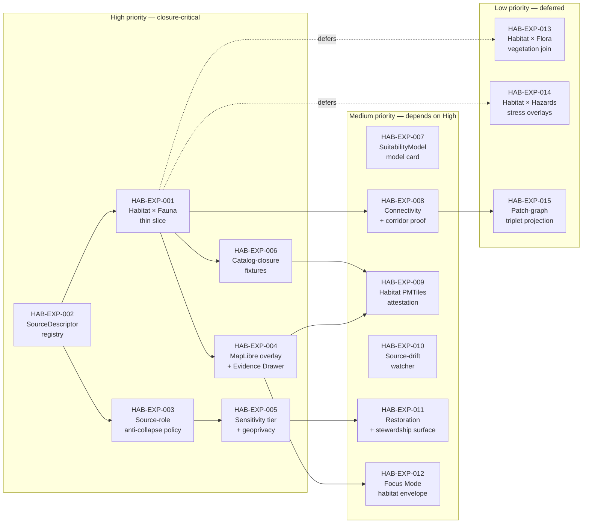

<!-- [KFM_META_BLOCK_V2]
doc_id: kfm://doc/domains/habitat/expansion-backlog
title: Habitat Domain — Expansion Backlog
type: standard
version: v1
status: draft
owners: [habitat-domain-steward, docs-steward]   # PROPOSED placeholders
created: 2026-05-17
updated: 2026-06-05
policy_label: public
related:
  - docs/domains/habitat/README.md          # PROPOSED, NEEDS VERIFICATION
  - docs/domains/habitat/ARCHITECTURE.md    # PROPOSED
  - docs/domains/habitat/CANONICAL_PATHS.md # PROPOSED
  - docs/domains/habitat/CONTRACTS.md       # PROPOSED
  - docs/domains/habitat/DATA_LIFECYCLE.md  # PROPOSED
  - docs/domains/habitat/OPEN_QUESTIONS.md  # PROPOSED
  - docs/domains/fauna/EXPANSION_BACKLOG.md # PROPOSED parallel
  - docs/registers/VERIFICATION_BACKLOG.md
  - docs/registers/DRIFT_REGISTER.md
  - docs/adr/                               # ADR home
  - docs/doctrine/directory-rules.md
  - ai-build-operating-contract.md
tags: [kfm, habitat, domain, backlog, expansion, governance]
notes:
  - CONTRACT_VERSION = "3.0.0"
  - Path follows Directory Rules §12 (Domain Placement Law).
  - Implementation-layer claims remain PROPOSED until mounted-repo evidence is checked.
  - Anchors the Atlas v1.0 §6.N habitat verification backlog into PR-shaped work.
  - "CONFLICTED schema-home: ADR-0001 OPEN per Atlas ADR-S-01 (confirm-or-amend; VB-11-01 NEEDS VERIFICATION); segmented .../domains/habitat/ (DIRRULES §12) vs flat .../habitat/ (Atlas §24.13) unresolved. See ADR-HAB-001 / VB-HAB-01."
[/KFM_META_BLOCK_V2] -->

# 🌿 Habitat Domain — Expansion Backlog

> Prioritized, evidence-first backlog of habitat-domain work — thin-slice proofs, ADRs, source descriptors, policy fixtures, map surfaces, and validators — sequenced under KFM's trust spine.

  <b>Evidence-first · Map-first · Time-aware · Cite-or-abstain · Fail-closed</b>

**Status:** Draft · **Owners:** habitat-domain-steward, docs-steward _(PROPOSED placeholders)_ · **Updated:** 2026-06-05 · `CONTRACT_VERSION = "3.0.0"`

---

## Contents

1. [Purpose & scope](#1-purpose--scope)
2. [How to read this backlog](#2-how-to-read-this-backlog)
3. [Backlog at a glance](#3-backlog-at-a-glance)
4. [Priority summary](#4-priority-summary)
5. [High-priority items](#5-high-priority-items)
6. [Medium-priority items](#6-medium-priority-items)
7. [Low-priority items](#7-low-priority-items)
8. [Open ADR backlog](#8-open-adr-backlog)
9. [Verification register](#9-verification-register)
10. [Out-of-scope and explicitly deferred](#10-out-of-scope-and-explicitly-deferred)
11. [Sequencing recommendation](#11-sequencing-recommendation)
12. [Related docs](#12-related-docs)

---

## 1. Purpose & scope

This document is the working backlog of expansion work for the Habitat domain in the
Kansas Frontier Matrix. It translates habitat doctrine — `[DOM-HAB]`, the
Habitat + Fauna thin-slice `[DOM-HF]`, the encyclopedia `[ENCY]`, and the v1.1
culmination atlas — into PR-shaped items that can be sequenced, reviewed, and
verified under KFM's trust spine.

**In scope.** Items that produce, validate, or release habitat artifacts: source
descriptors, schemas, contracts, policies, fixtures, validators, layer manifests,
Evidence Drawer payloads, model cards, ADRs, and the governed publication path
for habitat patches, suitability surfaces, connectivity/corridors, restoration
opportunities, and stewardship zones.

**Out of scope.** Items that belong to neighboring lanes (Fauna occurrence truth,
Flora taxonomy, Hydrology features, Soil units, Hazards events). Habitat joins to
these through governed relationships only; backlog items that look like ownership
of a neighbor's object family are explicitly rejected. See §10.

> [!IMPORTANT]
> This backlog is a **planning artifact**, not an implementation claim. Every item
> below is **PROPOSED** until a mounted-repo evidence pass, an accepted ADR, and a
> closed thin-slice fixture set demonstrate closure. Promotion is a governed state
> transition, not the act of merging this file.

[⬆ back to top](#top)

---

## 2. How to read this backlog

### 2.1 Truth labels

| Label | Meaning in this document |
|---|---|
| **CONFIRMED** | Supported by attached KFM doctrine (`[DOM-HAB]`, `[DOM-HF]`, `[ENCY]`, `[DIRRULES]`) in this session. |
| **PROPOSED** | A design direction, path, schema home, validator, fixture, or PR shape consistent with doctrine but not verified against a mounted repo. |
| **NEEDS VERIFICATION** | Checkable, but not yet checked strongly enough — usually because mounted-repo evidence is not available in this session. |
| **CONFLICTED** | Sources disagree, or doctrine and prior planning diverge; held until an ADR or drift entry resolves it. |
| **UNKNOWN** | Not resolvable without more evidence (live source terms, validator code, runtime behavior, dashboards). |

### 2.2 Priority bands

| Band | Definition |
|---|---|
| **High** | Load-bearing for habitat closure; blocks downstream items; or carries the sharpest sensitivity/anti-collapse risk. |
| **Medium** | Important but not blocking the first habitat thin slice; usually depends on a High item. |
| **Low** | Valuable, lower leverage, or appropriately deferred behind a neighboring lane proving out first. |

### 2.3 Exit criteria (every item)

An item is "done" only when **all five** are true:

1. A `SourceDescriptor` or relevant artifact contract exists and validates.
2. An `EvidenceBundle` (or fixture-equivalent for synthetic slices) resolves.
3. A `PolicyDecision` is produced (`ALLOW` / `ABSTAIN` / `DENY` with reason).
4. A `RunReceipt` / `ValidationReport` is emitted and signed where attestation applies.
5. A `RollbackCard` and correction path are named.

> [!NOTE]
> These exit criteria mirror the universal lifecycle gates in the Atlas v1.1
> Master Pipeline Gate Reference (§24.6). They are deliberately strict: a habitat item that
> passes some gates but not others is **incomplete**, not "almost done."

[⬆ back to top](#top)

---

## 3. Backlog at a glance

> [!TIP]
> Read left-to-right: High-priority items unblock Medium-priority items; Low-priority
> items wait until their parent High items have produced reusable artifacts.

[⬆ back to top](#top)

---

## 4. Priority summary

| ID | Title | Band | Primary lane(s) | First artifact | Closure marker |
|---|---|:--:|---|---|---|
| HAB-EXP-001 | Habitat × Fauna public-safe occurrence-assignment thin slice | High | `schemas/`, `contracts/`, `policy/`, `fixtures/`, `data/published/layers/habitat/` | Closed fixture set with `EvidenceBundle` + `RedactionReceipt` + `LayerManifest` | Sensitive exact join denied; generalized join granted with receipt |
| HAB-EXP-002 | Habitat `SourceDescriptor` registry skeleton | High | `data/registry/sources/habitat/`, `policy/sensitivity/habitat/` | Six descriptors (USFWS, NLCD, NWI, GAP/LANDFIRE, NatureServe, PAD-US) marked PROPOSED | Each descriptor parses, has rights state, sensitivity default, and source-role |
| HAB-EXP-003 | Source-role anti-collapse policy (regulatory vs modeled habitat) | High | `policy/domains/habitat/`, `contracts/domains/habitat/` | OPA rules + DTO field discipline | Modeled product queried as observed → `DENY` at publication, `ABSTAIN` at AI |
| HAB-EXP-004 | Habitat MapLibre overlay registry + Evidence Drawer payload | High | `packages/maplibre/`, `apps/explorer-web/`, `contracts/` | `LayerManifest` + `EvidenceDrawerPayload` schemas | Click on habitat feature → drawer resolves released `EvidenceBundle` |
| HAB-EXP-005 | Habitat sensitivity tier + geoprivacy transform | High | `policy/sensitivity/habitat/`, `policy/sensitivity/fauna/` | Tier table (T0–T4) for habitat objects + transform recipes | Sensitive-spillover join (habitat × sensitive occurrence) defaults T4 |
| HAB-EXP-006 | Catalog-closure thin-slice fixtures | High | `fixtures/domains/habitat/`, `data/catalog/domain/habitat/` | NLCD-derived patch + `EvidenceBundle` + `RunReceipt` + `LayerManifest` | Catalog matrix entry resolves; release dry-run passes |
| HAB-EXP-007 | `SuitabilityModel` model-card requirements | Medium | `contracts/`, canonical Habitat schema home (slug `CONFLICTED`, §8) | Model-card schema + one filled card | Public surface refuses publication of a card-less model output |
| HAB-EXP-008 | Connectivity & corridor proof (least-cost path receipt) | Medium | `pipelines/domains/habitat/`, `tools/validators/` | `ConnectivityEdge` + `Corridor` + `UncertaintySurface` fixture | Path receipt carries model id, cost surface, and bounds |
| HAB-EXP-009 | Habitat PMTiles attestation sidecars | Medium | `data/published/layers/habitat/`, `tools/attest/` | `.pmtiles.attest.json` with `spec_hash`, `root_hash`, DSSE signature | Tampered fixture denied at viewer init; clean fixture renders |
| HAB-EXP-010 | NLCD / NatureServe class-map drift watcher | Medium | `tools/ingest/`, `policy/intake/` | Prefilter + scorer + outbox `WORK_CANDIDATE` record | Class-map mutation produces candidate; clean run does not |
| HAB-EXP-011 | Restoration Opportunity + StewardshipZone public-safe surface | Medium | `policy/`, `data/published/layers/habitat/` | Generalized `RestorationOpportunity` layer + `StewardshipZone` T1 layer | Steward-restricted detail denied; generalized layer granted |
| HAB-EXP-012 | Habitat Focus Mode answer envelope | Medium | `runtime/`, `contracts/` | `RuntimeResponseEnvelope` + `AIReceipt` for habitat queries | Insufficient evidence → `ABSTAIN`; sensitive request → `DENY` |
| HAB-EXP-013 | Habitat × Flora vegetation community context | Low | `contracts/`, `policy/` | Cross-lane join contract draft | Deferred behind Flora source registry |
| HAB-EXP-014 | Habitat × Hazards resilience-stress overlays | Low | `contracts/`, `data/published/layers/habitat/` | Stress-context join contract draft | Deferred behind Hazards lane proving |
| HAB-EXP-015 | Patch-graph triplet projection | Low | `data/triplets/`, `schemas/` | Triplet projection of patch graph + evidence bundles | Projection re-derivable from released bundles |

> [!NOTE]
> All path segments above follow Directory Rules §12 (Domain Placement Law). They
> are **PROPOSED** lane placements pending mounted-repo evidence and the
> **OPEN** schema-home ADR (`ADR-0001` / ADR-S-01 — see §8). The `schemas/` slug
> itself is `CONFLICTED` (segmented vs flat); see ADR-HAB-001.

[⬆ back to top](#top)

---

## 5. High-priority items

### HAB-EXP-001 — Habitat × Fauna public-safe occurrence-assignment thin slice

**Status.** PROPOSED. **Source.** `[DOM-HAB]` §§1-2, `[DOM-HF]` §§1-5, `[ENCY]` §7.4,
Atlas v1.1 §6.6.4 (Pass 20 EXP analog).

**Statement.** Prove one habitat-assignment claim for a single public-safe fauna
occurrence in a single Kansas AOI, end-to-end, through every gate: source
descriptor → evidence → policy → validation → catalog closure → release →
drawer → rollback.

**Why it matters.** This is the canonical first habitat proof. It exercises every
controlling concept simultaneously — source role, evidence resolution, sensitivity,
geoprivacy, model-vs-observation labeling, Evidence Drawer payload, and rollback.
It is the slice from which every other habitat item draws reusable patterns.

**Dependencies.** HAB-EXP-002 (source descriptors), HAB-EXP-005 (sensitivity tier),
shared kernel objects (`EvidenceBundle`, `EvidenceRef`, `LayerManifest`,
`RedactionReceipt`, `ReleaseManifest`).

**Risks.** Sensitive-occurrence leakage; modeled-vs-observed conflation;
public-safe geometry being subverted by precise join.

**Exit criteria.** All five from §2.3 plus: a deliberately-exact-geometry request
on a sensitive taxon **must** be denied with a structured reason, and the
generalized public-safe layer **must** carry a `RedactionReceipt`.

---

### HAB-EXP-002 — Habitat `SourceDescriptor` registry skeleton

**Status.** PROPOSED. **Source.** `[DOM-HAB]` §D (key source families).

**Statement.** Author one `SourceDescriptor` per habitat source family — USFWS
ECOS / critical habitat services, NLCD land cover, NWI wetlands, GAP/LANDFIRE,
NatureServe / biodiversity context, KDWP state context, PAD-US stewardship
context, and aggregator inputs (GBIF / iNaturalist / iDigBio) — and place them
under `data/registry/sources/habitat/` (PROPOSED).

**Why it matters.** Every later item resolves through these descriptors. Without
them, source-role labels float, rights status is unverified, and admission fails
closed everywhere.

**Risks.** Source-rights drift; missing cadence/freshness fields; descriptor
proliferation outside one canonical registry.

**Exit criteria.** Each descriptor parses against the source-descriptor schema,
declares source role (`observed | regulatory | modeled | aggregate |
administrative | candidate | synthetic`), and carries rights, sensitivity, and
cadence fields. Rights and source terms remain **NEEDS VERIFICATION** until a
source-currentness pass closes them.

> [!NOTE]
> This item's schema target lands under the canonical Habitat schema home, whose
> slug is `CONFLICTED` (segmented `.../domains/habitat/` vs flat `.../habitat/`)
> and gated on ADR-HAB-001 / ADR-S-01. Author against the meaning contract first;
> bind the schema once the slug ADR lands.

---

### HAB-EXP-003 — Source-role anti-collapse policy: regulatory vs modeled habitat

**Status.** PROPOSED. **Source.** Atlas v1.1 §24.1 (source-role anti-collapse);
`[DOM-HAB]` ubiquitous-language entries for "Regulatory critical habitat" and
"Modeled habitat."

**Statement.** Codify the rule that a `SuitabilityModel` output, a
`HabitatQualityScore`, or any modeled patch **MUST NOT** be queried, labeled,
serialized, or published as if it were regulatory critical habitat — and vice
versa. Enforce in DTO fields, OPA rules, validator suites, and the Evidence
Drawer.

**Why it matters.** This is the single highest collapse-risk pattern in the
habitat lane. The doctrine identifies it explicitly: *modeled product labeled or
queried as observed → DENY at publication; ABSTAIN at AI surface.*

**Risks.** UI conflation; AI synthesis flattening labels; ad-hoc join queries
that lose the role.

**Exit criteria.** A negative-path fixture that asks "is this critical habitat?"
of a modeled patch returns **DENY** with a structured reason citing this rule.
A modeled layer rendered in MapLibre carries a visible role badge.

---

### HAB-EXP-004 — Habitat MapLibre overlay registry + Evidence Drawer payload

**Status.** PROPOSED. **Source.** `[DOM-HAB]` §G (map and viewing products);
`[MAP-MASTER]`; v1.1 verification item *"Verify Habitat MapLibre overlay
registry and Focus behavior."*

**Statement.** Define the `LayerManifest` shape for habitat layers — habitat
patch map, suitability surface, connectivity/corridor view, restoration
opportunity, uncertainty mode, sensitivity-redacted mode, habitat × fauna/flora
join view — and the matching `EvidenceDrawerPayload` projection.

**Why it matters.** The map shell is where habitat trust either becomes visible
or invisible. Without a governed manifest, layers can ship without their evidence
chain; without the drawer payload, click-through becomes uncited assertion.

**Dependencies.** HAB-EXP-001 (slice produces the first manifest and payload),
`packages/maplibre/` and `apps/explorer-web/` (PROPOSED migration targets per
Directory Rules §8.1). The renderer package name is OPEN (Cesium retirement
pending Directory Rules OPEN-DR-10/-11).

**Exit criteria.** A habitat feature click resolves through a governed API into a
drawer payload that carries source role, version, evidence reference, policy
decision, sensitivity badge, and stale-state indicator. No rendered-feature-only
answer is permitted on a habitat surface.

---

### HAB-EXP-005 — Habitat sensitivity tier + geoprivacy transform

**Status.** PROPOSED. **Source.** Atlas v1.1 §24.5 (sensitivity tier reference);
`[DOM-HAB]` §I; `[DOM-HF]`; v1.1 verification item *"Verify sensitive
occurrence policy and geoprivacy transforms."*

**Statement.** Place each habitat object class in the T0–T4 tier scheme with
allowed transforms and required gates. `HabitatPatch`, `EcologicalSystem`, and
`LandCoverObservation` default to **T0**; `StewardshipZone` defaults to **T1**;
**any habitat layer joined to sensitive Fauna or rare-plant occurrence**
inherits **T4** unless a documented geoprivacy transform plus `RedactionReceipt`
plus `ReviewRecord` carries it back to T1.

**Why it matters.** Habitat surfaces are not themselves the highest-sensitivity
content, but they become high-sensitivity carriers under joins. Without an
explicit habitat-side rule, the sensitivity contract is enforced only on the
Fauna side and can be subverted by a habitat-layer query path.

> [!CAUTION]
> Disposition for sensitive habitat joins routes through the
> `ai-build-operating-contract.md` §23.2 sensitive-domain matrix (most-restrictive
> applicable row). This item *implements* the habitat-side enforcement; it does not
> re-derive disposition.

**Exit criteria.** A habitat × sensitive-taxon exact-geometry request is denied
at policy with a structured reason citing T4 default; the same request through
the geoprivacy transform pathway returns T1 with a redaction receipt and review
record attached.

---

### HAB-EXP-006 — Catalog-closure thin-slice fixtures

**Status.** PROPOSED. **Source.** `[ENCY]` §7.4 thin-slice plan; Atlas v1.1 §24.6
(pipeline gates).

**Statement.** Ship one closed fixture set for a single Kansas AOI: one
`HabitatPatch` derived from NLCD, one `LandCoverObservation`, one
`EcologicalSystem` linkage, one `EvidenceBundle`, one `RunReceipt`, one
`LayerManifest`, one `EvidenceDrawerPayload`, one `ReleaseManifest`, and one
`RollbackCard`.

**Why it matters.** Without a closed fixture set, every later item is exercising
abstract gates. The fixture set is what makes "catalog closure passes" a
reviewable fact rather than a doctrinal aspiration.

**Exit criteria.** Catalog matrix entry exists; release dry-run produces a
`ReleaseManifest` and a `RollbackCard`; correction path traverses the bundle
back to source; fixtures are no-network and deterministic.

[⬆ back to top](#top)

---

## 6. Medium-priority items

### HAB-EXP-007 — `SuitabilityModel` model-card requirements

PROPOSED. Defines the minimum model-card content for any habitat suitability
product: model id, version, training/source support, spatial resolution, valid
extent, uncertainty bounds, fitness metrics, intended-use statement, and a
linked `ModelRunReceipt`. v1.1 verification item *"Verify model-card requirements
for suitability products"* settles when this card is mandatory on publication.
Closure: a card-less model output is **DENY**ed at publication.

### HAB-EXP-008 — Connectivity & corridor proof

PROPOSED. One `ConnectivityEdge` graph + one `Corridor` polygon for a small AOI,
emitted from a least-cost path run with `ModelRunReceipt`, cost-surface
provenance, and an `UncertaintySurface`. Closure: the corridor renders with a
visible uncertainty band and a drawer payload that resolves the source bundle.

### HAB-EXP-009 — Habitat PMTiles attestation sidecars

PROPOSED. Instantiate the Pass 20 EXP-002 PMTiles attestation pattern for the
habitat lane: `.pmtiles.attest.json` sidecar with `spec_hash`, `root_hash`
(BLAKE3), tiling scheme, byte-range manifest, and DSSE/cosign signature.
Closure: a tampered habitat fixture is rejected at viewer init; a clean fixture
renders; the receipt is referenced from the run receipt.

### HAB-EXP-010 — NLCD / NatureServe class-map drift watcher

PROPOSED. A no-network prefilter that hashes class maps, detects upstream
class-set drift, and emits a `SourceIntakeRecord` candidate with
`publication_state: WORK_CANDIDATE`. Validator vs policy split is strict:
validators check shape; policy decides admission. **Watcher-as-non-publisher**
applies — the watcher proposes, it never promotes. Closure: a mutated class map
triggers a candidate; an unchanged class map does not.

### HAB-EXP-011 — Restoration Opportunity + StewardshipZone public-safe surface

PROPOSED. A T1-generalized `RestorationOpportunity` overlay plus a T1
`StewardshipZone` layer with steward-supplied cell sizes. Steward-restricted
detail is **DENY**ed at publication; generalized layer is granted with
`RedactionReceipt`.

### HAB-EXP-012 — Habitat Focus Mode answer envelope

PROPOSED. The governed AI surface for habitat queries: `RuntimeResponseEnvelope`
with `outcome ∈ {ANSWER, ABSTAIN, DENY, ERROR}`, `evidence_refs`,
`policy_decision`, `confidence_or_scope`, and an `AIReceipt`. Insufficient
evidence → `ABSTAIN`. Sensitive request → `DENY`. AI never reads RAW or WORK;
only released `EvidenceBundle`s.

[⬆ back to top](#top)

---

## 7. Low-priority items

### HAB-EXP-013 — Habitat × Flora vegetation community context

PROPOSED · Deferred. Flora controls vegetation community taxonomy and rare-plant
sensitivity. Habitat may carry vegetation-community context only after the
Flora source registry, taxonomic resolver, and rare-plant tier rules exist.
Until then, draft only the cross-lane join contract.

### HAB-EXP-014 — Habitat × Hazards resilience-stress overlays

PROPOSED · Deferred. Drought, fire, flood, and smoke stress context is owned by
Hazards. Habitat carries it as derived context, never as truth. Deferred behind
Hazards lane proving. **Do not** label any habitat overlay as an emergency or
alert surface — Atlas v1.1 §24.5 holds the boundary at T4 forever.

### HAB-EXP-015 — Patch-graph triplet projection

PROPOSED · Deferred. Triplet projections are derivative indexes built from
released or review-authorized evidence, not root truth (`[ENCY]` §H). They live
under the shared, non-domain-scoped `data/triplets/` (plural per Directory Rules §9),
**not** a `data/triplets/habitat/` domain segment. Deferred
until at least HAB-EXP-001 and HAB-EXP-008 have produced reusable bundles to
project from.

[⬆ back to top](#top)

---

## 8. Open ADR backlog

The following decisions touch the habitat lane and remain open. Each PROPOSED
ADR should land **before** the corresponding HAB-EXP item is merged.

| Proposed ADR | Scope | Blocks |
|---|---|---|
| ADR-HAB-001 — Schema home for habitat contracts | **CONFLICTED.** Confirm or amend ADR-0001 per **ADR-S-01** (Atlas App. G VB-11-01 is `NEEDS VERIFICATION`); **and** resolve segmented `schemas/contracts/v1/domains/habitat/` (DIRRULES §12) vs flat `schemas/contracts/v1/habitat/` (Atlas §24.13). CONFIRMED regardless: `.schema.json` never under `contracts/`; freeze any `contracts/habitat/*.schema.json` as drift. | HAB-EXP-002, HAB-EXP-006 |
| ADR-HAB-002 — Modeled-vs-regulatory habitat anti-collapse | DTO field discipline, OPA rule shape, drawer badge contract | HAB-EXP-003, HAB-EXP-004 |
| ADR-HAB-003 — Habitat sensitivity tier + spillover rule | Confirms inheritance: any habitat layer joined to sensitive Fauna defaults T4 | HAB-EXP-005, HAB-EXP-011 |
| ADR-HAB-004 — `SuitabilityModel` model-card requirements | Mandatory card fields and publication-gate enforcement | HAB-EXP-007 |
| ADR-HAB-005 — Habitat PMTiles attestation profile | Sidecar schema instantiation for habitat tiles | HAB-EXP-009 |
| ADR-HAB-006 — Cross-lane join policy (Habitat ↔ Fauna / Flora / Hydrology / Hazards) | Allowed join shapes, sensitivity inheritance, source-role preservation. Cross-domain doctrine lives under `docs/architecture/<topic>.md`, not a `habitat-fauna/` domain folder (DIRRULES §12). | HAB-EXP-001, HAB-EXP-013, HAB-EXP-014 |

> [!WARNING]
> Habitat lane code, schemas, validators, or publications that ship **without**
> the relevant ADR risk creating a parallel home, a silent role collapse, or an
> unenforced sensitivity tier. Per Directory Rules §2.4, several of these
> decisions **require** an ADR before merging. ADR-HAB-001 in particular is
> `CONFLICTED` and must not be treated as settled by either slug.

[⬆ back to top](#top)

---

## 9. Verification register

Items below are **NEEDS VERIFICATION** (one is **CONFLICTED**): they are checkable but require a mounted
repository, source-rights review, validator code, or runtime evidence to settle.
They are tracked here so that a future repo-evidence pass can close them.

<b>Habitat verification items — click to expand</b>

| # | Item | Evidence that would settle it | Origin | Status |
|---|---|---|---|---|
| VB-HAB-01 | Schema home for habitat contracts: confirm/amend ADR-0001 (ADR-S-01) **and** resolve segmented `.../domains/habitat/` (DIRRULES §12) vs flat `.../habitat/` (Atlas §24.13) | Accepted ADR-S-01 + DRIFT_REGISTER entry + mounted repo tree | Atlas §24.12 ADR-S-01; §24.13; App. G VB-11-01; Directory Rules §6.4 | **CONFLICTED** |
| VB-HAB-02 | Habitat `SourceDescriptor` registry exists under `data/registry/sources/habitat/` (PROPOSED) and validates | Mounted repo + descriptor schema + parse logs | `[DOM-HAB]` §D | NEEDS VERIFICATION |
| VB-HAB-03 | Per-source rights, cadence, and license terms for USFWS ECOS, NLCD, NWI, GAP/LANDFIRE, NatureServe, KDWP, PAD-US | Current source-terms review + descriptor entries | `[DOM-HAB]` §D | NEEDS VERIFICATION |
| VB-HAB-04 | Sensitive-occurrence geoprivacy transforms exist and are testable | Policy text + validator + negative-path fixtures | Atlas v1.1 §6.N | NEEDS VERIFICATION |
| VB-HAB-05 | `SuitabilityModel` model-card requirements are mandatory at publication | Policy + validator + a deny case | Atlas v1.1 §6.N | NEEDS VERIFICATION |
| VB-HAB-06 | Habitat MapLibre overlay registry exists and is enforced; Focus Mode behavior on habitat queries is governed | `packages/maplibre/` evidence + Focus Mode tests | Atlas v1.1 §6.N | NEEDS VERIFICATION |
| VB-HAB-07 | Habitat × Fauna thin-slice fixtures exist under `fixtures/domains/habitat/` and produce a closed catalog entry | Mounted fixture set + dry-run logs | `[DOM-HF]` §§1-5 | NEEDS VERIFICATION |
| VB-HAB-08 | Modeled-vs-regulatory anti-collapse is enforced at DTO, OPA, validator, and UI layers | Negative-path tests passing | Atlas v1.1 §24.1 | NEEDS VERIFICATION |
| VB-HAB-09 | Habitat PMTiles attestation sidecars are required at release | CI workflow + verifier + denial case | New Ideas 5-10, 5-15 (operational packets) | NEEDS VERIFICATION |
| VB-HAB-10 | Habitat owner / steward roles are assigned in `CODEOWNERS` and `docs/governance/` | Mounted repo | Directory Rules §9 | NEEDS VERIFICATION |

[⬆ back to top](#top)

---

## 10. Out-of-scope and explicitly deferred

The following items are **not** habitat backlog. They are listed here so that
PRs proposing them under `docs/domains/habitat/` can be redirected.

| Item | Belongs to | Why not here |
|---|---|---|
| Fauna taxonomy resolver | `[DOM-FAUNA]` | Habitat does not own species taxonomic identity |
| Sensitive occurrence redaction policy (root) | `[DOM-FAUNA]` | Habitat inherits via spillover (HAB-EXP-005); root policy is Fauna's |
| Plant rare-species registry | `[DOM-FLORA]` | Habitat does not own plant records |
| NHDPlus hydrology features | `[DOM-HYD]` | Habitat joins hydrology context only via governed relationships |
| Soil map units | `[DOM-SOIL]` | Habitat consumes soil context, does not own it |
| Hazard event timelines / alert authority | `[DOM-HAZ]` | KFM is **never** an alert authority — Atlas v1.1 §24.5 holds T4 forever |
| Story Nodes / narrative surfaces | `[MAP-MASTER]` / `[UIAI]` | Cross-cutting; lives under `docs/architecture/` |
| Shared kernel governance objects | Cross-cutting | `EvidenceBundle`, `SourceDescriptor`, etc. are shared kernel, not habitat-owned |

[⬆ back to top](#top)

---

## 11. Sequencing recommendation

A defensible minimum habitat milestone closes the **first six** items in this
order:

1. **HAB-EXP-002** (source descriptors) — unblocks everything; admission must
   succeed before normalization.
2. **HAB-EXP-003** (source-role anti-collapse) — must land before any modeled
   habitat layer touches a public surface.
3. **HAB-EXP-005** (sensitivity tier + spillover) — must land before any
   habitat × occurrence join is attempted.
4. **HAB-EXP-006** (catalog-closure fixtures) — concretizes the gates.
5. **HAB-EXP-001** (Habitat × Fauna thin slice) — the canonical first proof; uses
   1–4 as scaffolding.
6. **HAB-EXP-004** (MapLibre overlay + drawer) — makes the slice visible without
   bypassing the trust membrane.

Medium-priority items follow once 1–6 ship reusable artifacts. Low-priority
items remain deferred behind their parent High items.

> [!CAUTION]
> Do **not** reorder this sequence to ship a habitat MapLibre layer before
> sensitivity tier and anti-collapse policy land. A visible layer without those
> guards is the precise failure mode this backlog exists to prevent.

> [!NOTE]
> ADR-HAB-001 (schema-home, `CONFLICTED`) does **not** block items 2–5 from being
> *authored against the meaning contracts* — but the schema binding for HAB-EXP-002
> and HAB-EXP-006 should not be frozen until the slug ADR lands.

[⬆ back to top](#top)

---

## 12. Related docs

- `docs/domains/habitat/README.md` — habitat domain landing (PROPOSED, NEEDS VERIFICATION)
- `docs/domains/habitat/ARCHITECTURE.md` — habitat lane architecture (PROPOSED)
- `docs/domains/habitat/CANONICAL_PATHS.md` — habitat path enumeration (PROPOSED)
- `docs/domains/habitat/CONTRACTS.md` — habitat contract (meaning) index (PROPOSED)
- `docs/domains/habitat/DATA_LIFECYCLE.md` — habitat lifecycle profile (PROPOSED)
- `docs/domains/habitat/OPEN_QUESTIONS.md` — open-questions register (PROPOSED)
- `docs/domains/fauna/EXPANSION_BACKLOG.md` — parallel fauna backlog (PROPOSED)
- `docs/standards/PROV.md` — provenance profile (`PROV.md` vs `PROVENANCE.md` is OPEN-DR-01)
- `docs/standards/PMTILES.md` — PMTiles governance profile
- `ai-build-operating-contract.md` — operating law; §23.2 sensitive-domain matrix (`CONTRACT_VERSION = "3.0.0"`)
- `docs/registers/VERIFICATION_BACKLOG.md` — repo-wide verification queue
- `docs/registers/DRIFT_REGISTER.md` — drift entries when repo conflicts with doctrine (schema-slug `CONFLICTED`)
- `docs/adr/` — accepted and proposed ADRs
- `docs/doctrine/directory-rules.md` — placement law that governs this file's location

---

<b>Last updated:</b> 2026-06-05 · <b>Document version:</b> v1 (draft) · <b>Owners:</b> habitat-domain-steward, docs-steward _(PROPOSED placeholders)_ · <code>CONTRACT_VERSION = "3.0.0"</code>

[⬆ back to top](#top)
