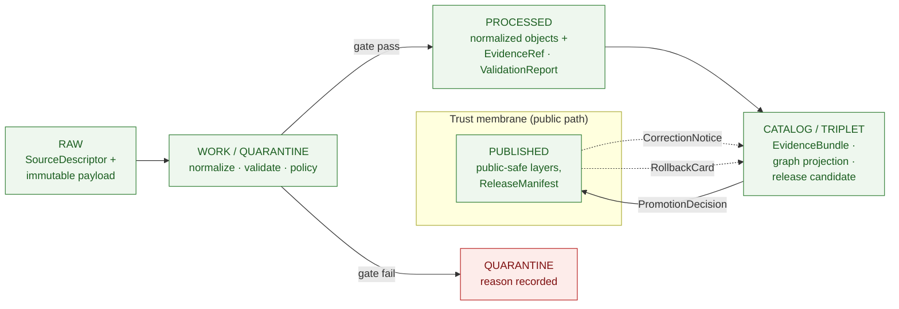
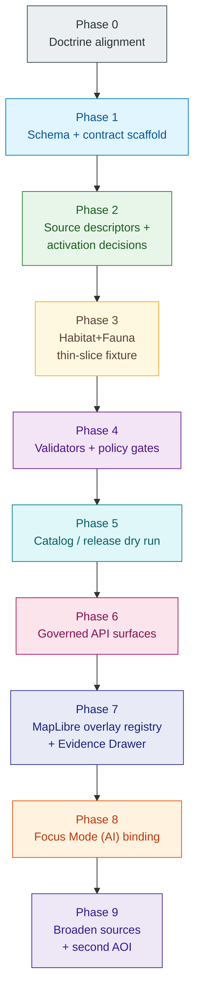

<!-- [KFM_META_BLOCK_V2]
doc_id: kfm://doc/habitat-expansion-plan
title: Habitat Domain Expansion Plan
type: standard
version: v1
status: draft
owners: Habitat domain steward (placeholder) · KFM docs steward
created: 2026-05-17
updated: 2026-05-17
policy_label: public
related:
  - docs/domains/habitat/README.md
  - docs/domains/habitat/SOURCES.md
  - docs/domains/fauna/README.md
  - docs/doctrine/directory-rules.md
  - docs/doctrine/lifecycle-law.md
  - docs/doctrine/trust-membrane.md
  - schemas/contracts/v1/domains/habitat/
  - policy/domains/habitat/
  - control_plane/domain_lane_register.yaml
tags: [kfm, domain, habitat, expansion, planning, doctrine]
notes:
  - All implementation-layer claims are PROPOSED until verified against mounted-repo evidence.
  - Lifecycle paths follow Directory Rules §3 and §12 (Domain Placement Law).
  - First proof slice is the Habitat+Fauna public-safe occurrence assignment (KFM-IDX-APP-002).
[/KFM_META_BLOCK_V2] -->

# Habitat Domain Expansion Plan

> The proof-bearing, thin-slice-first roadmap for bringing the **Habitat** lane up from PROPOSED doctrine to governed, evidence-bearing publication — without flattening sensitive joins to fauna, flora, or stewardship contexts.

[](#)
[](#)
[](#)
[](#)
[](#)
[](#)
[](#)
[](#)

**Status:** draft · **Lane:** `docs/domains/habitat/` · **Owners:** Habitat domain steward *(placeholder — set in CODEOWNERS)* · **Last updated:** 2026-05-17

> [!IMPORTANT]
> Every implementation-layer claim in this plan is **PROPOSED** until verified against mounted-repo evidence (files, schemas, tests, workflows, dashboards, manifests). The doctrine the plan rests on is **CONFIRMED** from the KFM corpus. Do not cite this document as proof that any file, route, validator, or release artifact exists.

---

## Contents

- [1 · Mission, scope, and non-goals](#1--mission-scope-and-non-goals)
- [2 · Doctrine anchor and authority order](#2--doctrine-anchor-and-authority-order)
- [3 · Object families and ubiquitous language](#3--object-families-and-ubiquitous-language)
- [4 · Source families and activation posture](#4--source-families-and-activation-posture)
- [5 · Sensitivity, rights, and publication posture](#5--sensitivity-rights-and-publication-posture)
- [6 · Lifecycle map (RAW → PUBLISHED)](#6--lifecycle-map-raw--published)
- [7 · Repository placement (Directory Rules)](#7--repository-placement-directory-rules)
- [8 · Expansion phases](#8--expansion-phases)
- [9 · API, contract, and schema surfaces](#9--api-contract-and-schema-surfaces)
- [10 · Validators, tests, fixtures](#10--validators-tests-fixtures)
- [11 · MapLibre overlay registry and Evidence Drawer](#11--maplibre-overlay-registry-and-evidence-drawer)
- [12 · Governed AI behavior in this lane](#12--governed-ai-behavior-in-this-lane)
- [13 · Cross-lane coordination](#13--cross-lane-coordination)
- [14 · Acceptance criteria per phase](#14--acceptance-criteria-per-phase)
- [15 · Risk register](#15--risk-register)
- [16 · Rollback and correction path](#16--rollback-and-correction-path)
- [17 · Open ADRs and verification backlog](#17--open-adrs-and-verification-backlog)
- [18 · Related docs](#18--related-docs)
- [Footer](#footer)

---

## 1 · Mission, scope, and non-goals

**Mission (CONFIRMED doctrine / PROPOSED implementation).** Govern habitat patches, land-cover observations, ecological systems, habitat quality, suitability models, connectivity, corridors, restoration opportunities, stewardship zones, model-run receipts, and uncertainty surfaces — as evidence-backed observations and models with public-safe derivatives for sensitive ecological contexts. *[DOM-HAB] [DOM-HF] [ENCY §7.4]*

**Owns.** `HabitatPatch`, `LandCoverObservation`, `EcologicalSystem`, `HabitatQualityScore`, `SuitabilityModel`, `ConnectivityEdge`, `Corridor`, `RestorationOpportunity`, `StewardshipZone`, `ModelRunReceipt`, `UncertaintySurface`. *[ENCY §7.4]*

**Does not own.** Fauna taxa and animal occurrence (→ Fauna). Plant taxa, specimens, occurrences, and rare-plant records (→ Flora). Soil, hydrology, agriculture, hazards, archaeology retain their own truth and join via governed relationships. *[DOM-HAB §B]*

**Non-goals for this plan.**

- It does **not** activate live ingestion of GBIF, iNaturalist, eBird, KDWP, NatureServe, or USFWS ECOS feeds. Activation is gated on source-role review, rights confirmation, and policy fixtures. *[DOM-HAB §D, DOM-HF]*
- It does **not** assert any current implementation maturity in the live repository. Phase work is sequenced; phase **completion** is what proves maturity, not this plan.
- It does **not** publish sensitive occurrence-linked habitat outputs. Sensitive joins fail closed pending documented geoprivacy transforms and review state. *[DOM-HAB §I]*

[⬆ back to top](#contents)

---

## 2 · Doctrine anchor and authority order

This plan is governed by the KFM authority order. Lower layers operationalize higher layers and never override them silently.

| Layer | Source | Role in this plan |
|---|---|---|
| Core invariants | Lifecycle law; trust membrane; cite-or-abstain; watcher-as-non-publisher | **CONFIRMED** — non-negotiable. |
| Directory Rules | `docs/doctrine/directory-rules.md` | **CONFIRMED** — places every artifact emitted by this plan. |
| Habitat domain dossier | `[DOM-HAB]` lineage | **CONFIRMED doctrine / PROPOSED implementation** — scope and object families. |
| Habitat + Fauna thin-slice dossier | `[DOM-HF]` lineage | **CONFIRMED doctrine** — first proof slice pattern. |
| Encyclopedia §7.4 | `[ENCY]` | **CONFIRMED** — ubiquitous language and capability spine. |
| Unified Build Manual §6.3 | `[UNIFIED]` | **CONFIRMED lineage** — lane scope reconciliation. |
| Pass 20 Expansion Dossier `EXP-001..015` | Idea index | **PROPOSED** — cross-cutting work items referenced where they touch Habitat. |
| Mounted repo state | Live repository | **UNKNOWN in this document** — paths in §7 are PROPOSED under the Directory Rules lane pattern; existence requires repo evidence. |

> [!NOTE]
> If mounted-repo evidence ever contradicts this plan, file a drift entry in `docs/registers/DRIFT_REGISTER.md` rather than silently conforming. Directory Rules §2.5 governs the protocol.

[⬆ back to top](#contents)

---

## 3 · Object families and ubiquitous language

The Habitat lane uses KFM-shared and lane-specific terms. KFM-shared terms (EvidenceBundle, EvidenceRef, Governed API, etc.) are defined in the Encyclopedia and not redefined here.

| Term | Definition | Status |
|---|---|---|
| `HabitatPatch` | A bounded habitat polygon (observed or derived) carrying source role, time, evidence, and release state. | CONFIRMED term · PROPOSED field realization *[ENCY §7.4]* |
| `LandCoverObservation` | A land-cover class observed from a source (e.g., NLCD, LANDFIRE) at a given vintage. | CONFIRMED term · PROPOSED field realization *[ENCY §7.4]* |
| `EcologicalSystem` | An ecological-system classification (e.g., NatureServe / GAP). | CONFIRMED term · PROPOSED field realization *[ENCY §7.4]* |
| `HabitatQualityScore` | A reviewed, evidence-bound quality assessment for a patch under a stated model. | CONFIRMED term · PROPOSED field realization *[ENCY §7.4]* |
| `SuitabilityModel` | A modeled surface of habitat suitability with model version, training/source support, resolution, support, uncertainty, and release time. Model vs observation labels remain visible. | CONFIRMED term · PROPOSED field realization *[ENCY §7.4]* |
| `ConnectivityEdge` | A patch-to-patch connectivity relation with a stated cost/permeability basis. | CONFIRMED term · PROPOSED field realization *[ENCY §7.4]* |
| `Corridor` | A reviewed corridor object emitted from connectivity analysis. | CONFIRMED term · PROPOSED field realization *[ENCY §7.4]* |
| `RestorationOpportunity` | A candidate site/area for restoration with rationale and evidence. | CONFIRMED term · PROPOSED field realization *[ENCY §7.4]* |
| `StewardshipZone` | A management zone (e.g., PAD-US-derived) joined as context. | CONFIRMED term · PROPOSED field realization *[ENCY §7.4]* |
| `ModelRunReceipt` | The signed run receipt for any suitability/connectivity model emission. | CONFIRMED term · PROPOSED field realization *[ENCY §7.4]* |
| `UncertaintySurface` | The companion uncertainty surface for any modeled output. | CONFIRMED term · PROPOSED field realization *[ENCY §7.4]* |
| Regulatory critical habitat | Habitat designated under regulatory authority (e.g., USFWS critical habitat). Source role is **authority**, not observation or model. | CONFIRMED term · PROPOSED field realization *[DOM-HAB §C]* |
| Modeled habitat | KFM- or third-party-modeled habitat surface. Source role is **model**, never silently promoted to authority. | CONFIRMED term · PROPOSED field realization *[DOM-HAB §C]* |
| Geoprivacy transform | A documented public-safe transformation (redaction, generalization, k-anonymity) applied to sensitive geometry. Emits a `RedactionReceipt`. | CONFIRMED term · PROPOSED field realization *[DOM-HAB §C, ENCY]* |

> [!CAUTION]
> Source-role anti-collapse is acute in Habitat. "Regulatory critical habitat", "Modeled habitat", and "Inferred suitability" must remain distinct in fields, manifests, drawer payloads, and UI labels. Silent collapse is a publication-class defect. *[DOM-HAB §C, §I]*

[⬆ back to top](#contents)

---

## 4 · Source families and activation posture

All Habitat sources begin **inactive** until a `SourceDescriptor` exists, source role is reviewed, rights are confirmed, sensitivity is classed, cadence is recorded, and a `SourceActivationDecision` is issued. *[BLD-COMP §§8.1-8.2; IMPL-PIPE §13]*

| Source family | Typical role | Sensitivity floor | Status |
|---|---|---|---|
| NLCD land cover | observation / context | low for thematic; raster vintage matters | NEEDS VERIFICATION (terms, cadence) *[DOM-HAB §D]* |
| GAP / LANDFIRE | observation / model / context | low | NEEDS VERIFICATION *[DOM-HAB §D]* |
| NWI wetlands | authority / observation | low–medium (subject to source terms) | NEEDS VERIFICATION *[DOM-HAB §D]* |
| State ecological inventories | observation / context | varies | NEEDS VERIFICATION *[DOM-HAB §D, ENCY §7.4]* |
| NatureServe / ecological systems | authority / observation | medium–high (controlled biodiversity access) | NEEDS VERIFICATION; **deny-by-default for precise rare-species records** *[DOM-HAB §D]* |
| USFWS ECOS / critical habitat | authority | medium (regulatory); joins to species are sensitive | NEEDS VERIFICATION; source role must be **authority**, never **model** *[DOM-HAB §D]* |
| KDWP state review context | authority / context | medium–high | NEEDS VERIFICATION *[DOM-HAB §D]* |
| PAD-US stewardship | context | low | NEEDS VERIFICATION *[DOM-HAB §D]* |
| GBIF / iNaturalist / iDigBio occurrence inputs (read by Habitat as join context) | observation (foreign-owned) | high for sensitive taxa; geoprivacy applies | NEEDS VERIFICATION; **Habitat does not own occurrence truth** *[DOM-HAB §D, DOM-FAUNA §§12-13]* |
| Remote sensing vegetation indices | observation / context | low | NEEDS VERIFICATION *[ENCY §7.4]* |
| Field surveys and steward-reviewed habitat models | observation / model | varies; reviewed | NEEDS VERIFICATION *[ENCY §7.4]* |

> [!WARNING]
> A source may not be activated by convenience. Source role is declared, reviewed, and recorded; it is not inferred from filename, URL, or "what other projects do". *[IMPL-PIPE §13]*

[⬆ back to top](#contents)

---

## 5 · Sensitivity, rights, and publication posture

**CONFIRMED doctrine.** Regulatory critical habitat, modeled habitat, species range, occurrence points, and landscape context **must not be flattened**. Sensitive occurrence details **deny by default**. *[DOM-HAB §I]*

**CONFIRMED doctrine.** Unclear rights, unresolved source role, missing evidence, unresolved sensitivity, or absent release state **blocks public promotion**. *[ENCY, DIRRULES]*

**Operational rules for this lane (PROPOSED implementation):**

1. **Occurrence-linked habitat outputs** that could reveal sensitive species locations are generalized, redacted, reviewed, or denied. A `RedactionReceipt` is emitted for any transform that crosses the publication boundary.
2. **Modeled-as-critical denial.** A modeled habitat surface MUST NOT be presented or labeled as regulatory critical habitat, in fields, manifests, drawer copy, or AI summaries.
3. **Model-card requirement (PROPOSED).** Every published `SuitabilityModel` ships with a model card: training/source support, resolution, support, uncertainty, version, vintage, and known failure modes. Specific schema home and field set are **NEEDS VERIFICATION**.
4. **Public-safe overlay class.** Only public-safe tiles, vector layers, and drawer payloads reach `data/published/layers/habitat/`. Raw or restricted joins live behind the trust membrane (governed API + policy gates).

> [!CAUTION]
> Joins from Habitat into Fauna sensitive sites — nests, dens, roosts, hibernacula, spawning sites — inherit the **deny-by-default** posture of Fauna. A Habitat layer cannot silently leak fauna sensitivity by association. *[DOM-FAUNA §§12-13; DOM-HF]*

[⬆ back to top](#contents)

---

## 6 · Lifecycle map (RAW → PUBLISHED)

Habitat follows the canonical lifecycle. Promotion is a **governed state transition, not a file move.** *[DIRRULES §0, §3]*



| Stage | Habitat handling | Gate | Status |
|---|---|---|---|
| **RAW** | Capture immutable source payload or reference with source role, rights, sensitivity, citation, time, and hash. | `SourceDescriptor` exists. | PROPOSED *[DOM-HAB §H]* |
| **WORK / QUARANTINE** | Normalize schema, geometry, time, identity, evidence, rights, and policy; hold failures. | Validation and policy gate pass, or quarantine reason recorded. | PROPOSED *[DOM-HAB §H]* |
| **PROCESSED** | Emit validated normalized objects, receipts, and public-safe candidates. | `EvidenceRef`, `ValidationReport`, and digest closure exist. | PROPOSED *[DOM-HAB §H]* |
| **CATALOG / TRIPLET** | Emit catalog records, `EvidenceBundle`, graph/triplet projections, and release candidates. | Catalog/proof closure passes. | PROPOSED *[DOM-HAB §H]* |
| **PUBLISHED** | Serve released public-safe artifacts through governed APIs and manifests. | `ReleaseManifest`, correction path, rollback target, and review/policy state exist. | PROPOSED *[DOM-HAB §H, ENCY Appendix E]* |

[⬆ back to top](#contents)

---

## 7 · Repository placement (Directory Rules)

The Habitat lane lives as a domain segment inside responsibility roots — never as a root folder. The pattern below is **CONFIRMED by Directory Rules §3 (Step 3) and §12 (Domain Placement Law).** Specific files at these paths are **PROPOSED** until verified against mounted-repo evidence. *[DIRRULES §3, §5, §12]*

```text
docs/domains/habitat/                          # human-facing lane docs (this plan lives here)
contracts/domains/habitat/                     # object meaning (Markdown)
schemas/contracts/v1/domains/habitat/          # machine shape (ADR-0001 canonical home)
policy/domains/habitat/                        # admissibility / release / sensitivity rules
policy/sensitivity/                            # cross-domain sensitivity bundles (Habitat consumes)
tests/domains/habitat/                         # enforceability proofs
fixtures/domains/habitat/                      # golden / valid / invalid inputs
packages/domains/habitat/                      # shared lane code (if needed)
pipelines/domains/habitat/                     # executable pipeline logic
pipeline_specs/habitat/                        # declarative pipeline config
data/raw/habitat/                              # lifecycle: RAW
data/work/habitat/                             # lifecycle: WORK
data/quarantine/habitat/                       # lifecycle: QUARANTINE
data/processed/habitat/                        # lifecycle: PROCESSED
data/catalog/domain/habitat/                   # lifecycle: CATALOG
data/published/layers/habitat/                 # lifecycle: PUBLISHED (public-safe only)
data/registry/sources/habitat/                 # source descriptors
release/candidates/habitat/                    # release candidates and PromotionDecisions
```

> [!NOTE]
> Cross-domain validators (e.g., a Habitat × Fauna × Hydrology join validator) live under the **lowest common responsibility root** without a domain segment — for example `tools/validators/<topic>/...` — per Directory Rules §12 *Multi-domain and cross-cutting files*. They do not become `tools/validators/domains/habitat/...`.

[⬆ back to top](#contents)

---

## 8 · Expansion phases

The plan sequences work as **proof-bearing thin slices**: one small AOI, one descriptor, one evidence bundle, one policy decision, one validation pass, one release. Broad coverage is earned by repeated thin slices, never asserted in the first PR. *[KFM-IDX-PLN-003]*



### Phase 0 · Doctrine alignment *(governance)*

**Goal.** Confirm Habitat lane scope, object families, ubiquitous language, source-role distinctions, and sensitivity posture against `[DOM-HAB]`, `[DOM-HF]`, and `[ENCY §7.4]`.

**Outputs (PROPOSED).** `docs/domains/habitat/README.md` (lane README), this `EXPANSION_PLAN.md`, `docs/domains/habitat/SOURCES.md`, lane entry in `control_plane/domain_lane_register.yaml`.

**Done criterion.** Reviewer can read the lane docs and answer: what does Habitat own? what doesn't it own? what is the sensitivity posture? what is the first proof slice?

### Phase 1 · Schema and contract scaffold *(structure)*

**Goal.** Stand up empty-but-valid homes for Habitat object meaning and shape.

**Outputs (PROPOSED).**

- `contracts/domains/habitat/*.md` for each object in §3.
- `schemas/contracts/v1/domains/habitat/*.schema.json` (per ADR-0001 schema-home rule). *[DIRRULES §6.4]*
- Empty fixtures scaffold at `fixtures/domains/habitat/` with `valid/`, `invalid/`, `denied/`, `abstained/` subfolders.

**Gate.** Schemas validate the corresponding contract documents in spirit (field set matches term set). Cross-references resolve.

**Done criterion.** A reviewer can locate each object family's meaning, shape, and a placeholder fixture in a single five-minute orientation.

### Phase 2 · Source descriptors and activation decisions *(admission)*

**Goal.** Register the source families from §4 as `SourceDescriptor` records under `data/registry/sources/habitat/`. None are activated.

**Outputs (PROPOSED).** One descriptor per source family with role, rights, sensitivity, cadence, steward, freshness expectation, attribution requirements, and public-release class. *[BLD-COMP §8]*

**Gate.** Every descriptor passes shape validation. Every descriptor is paired with a recorded `SourceActivationDecision` of value `restricted | denied | needs-review`. **No source is set to `allowed` in this phase.**

**Done criterion.** A reviewer can answer for each source: who steward, what role, what rights, what cadence, why not yet activated.

### Phase 3 · Habitat+Fauna thin-slice fixture *(first proof)*

**Goal.** Deliver the first proof-bearing slice: **one public-safe occurrence-to-habitat assignment** with evidence, sensitivity, release, map, drawer, and interpretation controls. This is the published recommendation of `[DOM-HF]` and Pass 20 idea `KFM-IDX-APP-002`.

**Outputs (PROPOSED).**

- Synthetic fixture set: **one non-sensitive occurrence** and **one sensitive occurrence** under a controlled AOI.
- One NLCD-derived `HabitatPatch` fixture for the AOI.
- One `EvidenceBundle` linking patch + occurrence + sources.
- One generalized public tile (public-safe layer manifest fixture).
- One `RedactionReceipt` proving the sensitive-case transform.

**Done criterion.** The non-sensitive case produces a public-safe assignment. The sensitive case **denies exact geometry** and shows withheld precision in the Evidence Drawer payload. *[KFM-IDX-APP-002]*

> [!NOTE]
> AOI selection is **PROPOSED** — `KFM-IDX-PLN-003` flags AOI choice as an open question for the next domain thin slice. Suggested seed: a single Kansas county with mixed land-cover and at least one non-sensitive fauna join. Final choice belongs to a steward review.

### Phase 4 · Validators and policy gates *(enforceability)*

**Goal.** Make the rules from Phases 1–3 enforceable. *[DOM-HAB §K]*

**Outputs (PROPOSED).**

- Source descriptor tests.
- Critical-habitat source-role tests (authority, not model).
- Modeled-as-critical denial tests.
- Occurrence geoprivacy tests (the deny-by-default path).
- Catalog closure tests.
- Habitat+Fauna thin-slice fixtures as the cross-cutting positive case.

**Gate.** Every test runs no-network from the fixtures in Phase 3. **Validators fail closed** on schema, policy, rights, sensitivity, or release violations. *[KFM-IDX-VAL-002]*

**Done criterion.** A deliberately broken fixture (each kind) produces a useful `ValidationReport` and a `denied` envelope; clean fixtures pass.

### Phase 5 · Catalog and release dry run *(reversibility)*

**Goal.** Prove the lane can produce a release candidate **without publishing**.

**Outputs (PROPOSED).**

- One `EvidenceBundle` for the Phase 3 slice.
- One catalog/STAC entry for the public-safe tile.
- One `PromotionDecision` (dry-run) and a `RollbackCard`.
- A `ReleaseManifest` candidate gated behind policy.

**Gate.** All seven promotion gates pass for the fixture slice; rollback drill restores prior state cleanly. *[BLD-GREEN §22-23 M10]*

**Done criterion.** Reviewer can see what would be published, why it would not yet be, and what rollback would do.

### Phase 6 · Governed API surfaces *(public path)*

**Goal.** Expose the slice through the governed API only — no direct read from canonical stores. *[DIRRULES §13.5 trust membrane]*

**Outputs (PROPOSED, routes UNKNOWN).**

| Surface | DTO / schema | Finite outcomes |
|---|---|---|
| Habitat feature/detail resolver | `HabitatDecisionEnvelope` | `ANSWER` / `ABSTAIN` / `DENY` / `ERROR` |
| Habitat layer manifest resolver | `LayerManifest` / domain layer descriptor | `ANSWER` / `DENY` / `ERROR` |
| Habitat Evidence Drawer payload | `EvidenceDrawerPayload` + `EvidenceBundle` projection | `ANSWER` / `ABSTAIN` / `DENY` / `ERROR` |

**Gate.** No surface reads `data/processed/` or `data/catalog/` directly; all reads pass through the governed API. *[DIRRULES §13.5]*

**Done criterion.** Each surface returns a finite outcome for the slice and for each deny case from Phase 4.

### Phase 7 · MapLibre overlay registry and Evidence Drawer *(trust-visible UI)*

**Goal.** Bind the public-safe Habitat layer into the MapLibre overlay registry with trust badges, source-role labels, and a drawer payload that exposes evidence, policy decision, review state, and rights posture. *[MAP-MASTER, KFM-IDX-UIX-001]*

**Outputs (PROPOSED).** Overlay registry entry; trust-badge inputs; drawer payload fixtures (granted / narrowed / denied / candidate). MapLibre is a renderer downstream of trust — never truth, policy, or citation authority. *[DIRRULES §13.5]*

**Done criterion.** A surface without a drawer is rejected at publication. Every state (granted, narrowed, bounded, denied, candidate) renders correctly in fixtures.

### Phase 8 · Focus Mode (governed AI) binding *(interpretation)*

**Goal.** Bind Habitat-relevant Focus Mode templates to the same `EvidenceBundle` and `DecisionEnvelope` set. AI is interpretive, never the root truth source. *[GAI]*

**Outputs (PROPOSED).** Focus Mode templates for Habitat (e.g., compare two land-cover vintages; explain a suitability surface's support; summarize a corridor with citations) bound to the Phase 3 evidence set. Each answer emits an `AIReceipt` and a `RuntimeResponseEnvelope` with `ANSWER` / `ABSTAIN` / `DENY` / `ERROR`. *[DOM-HAB §L]*

**Gate.** Synthetic-claim incidence approaches zero. AI **ABSTAINS** when evidence is insufficient. AI **DENIES** when policy, rights, sensitivity, or release state blocks. *[DOM-HAB §L]*

### Phase 9 · Broaden sources and second AOI *(scale by repetition)*

**Goal.** Repeat the proof-bearing slice on a second AOI and one additional source family (e.g., NWI wetlands or LANDFIRE). Coverage is earned by repetition — never asserted by horizontal launch.

**Outputs (PROPOSED).** A second fixture set; a second `EvidenceBundle`; second-pass validator coverage; updated source-role matrix entry per `EXP-007`.

**Done criterion.** No regression on Phase 4 validators. Drawer and AI surfaces behave identically for the second slice.

[⬆ back to top](#contents)

---

## 9 · API, contract, and schema surfaces

Surfaces below are **PROPOSED**. Exact route names, package homes, and DTO field sets are **UNKNOWN** until repo evidence confirms them. *[DOM-HAB §J]*

| Surface | DTO / schema | Outcomes | Status |
|---|---|---|---|
| Habitat feature/detail resolver | `HabitatDecisionEnvelope` | `ANSWER` / `ABSTAIN` / `DENY` / `ERROR` | PROPOSED · route UNKNOWN |
| Habitat layer manifest resolver | `LayerManifest` / domain layer descriptor | `ANSWER` / `DENY` / `ERROR` | PROPOSED · public-safe release only |
| Habitat Evidence Drawer payload | `EvidenceDrawerPayload` + `EvidenceBundle` projection | `ANSWER` / `ABSTAIN` / `DENY` / `ERROR` | PROPOSED · evidence- and policy-filtered |
| Habitat Focus Mode answer | `RuntimeResponseEnvelope` + `AIReceipt` | `ANSWER` / `ABSTAIN` / `DENY` / `ERROR` | PROPOSED · AI never root truth |
| Schema responsibility root | `schemas/contracts/v1/` | finite validator outcomes | PROPOSED · ADR-0001 canonical *[DIRRULES §6.4]* |

[⬆ back to top](#contents)

---

## 10 · Validators, tests, fixtures

All items below are **PROPOSED** — they are targets, not assertions of presence. *[DOM-HAB §K]*

| Target | Purpose | Lifecycle phase touched |
|---|---|---|
| Source descriptor tests | Confirm shape, role, rights, cadence, sensitivity. | RAW admission |
| Critical-habitat source-role tests | Reject `model` role applied to regulatory critical habitat. | WORK |
| Modeled-as-critical denial tests | Reject any output that labels modeled habitat as authority. | PROCESSED → CATALOG |
| Occurrence geoprivacy tests | Deny exact geometry in sensitive joins; emit `RedactionReceipt`. | WORK → PROCESSED |
| Catalog closure tests | Require `EvidenceBundle`, validation report, digest closure. | CATALOG |
| Habitat+Fauna thin-slice fixtures | Positive + sensitive denial fixtures (Phase 3). | end-to-end |
| Model-card requirement (PROPOSED · NEEDS VERIFICATION) | Block `SuitabilityModel` publication without a model card. | CATALOG → PUBLISHED |

<details>
<summary><strong>Fixture taxonomy (PROPOSED)</strong> — what each fixture must cover</summary>

| Fixture kind | What it proves |
|---|---|
| Valid fixture | The clean path produces an `EvidenceBundle` and a `PromotionDecision: allowed`. |
| Rights-denied fixture | Missing/expired rights → `DENY` with citation. |
| Sensitivity-denied fixture | Sensitive join → `DENY` (exact) and `ANSWER` (generalized) per policy. |
| Stale-source fixture | Source past freshness budget → `ABSTAIN` or `WORK_CANDIDATE` per policy. |
| Unresolved-EvidenceRef fixture | `EvidenceRef` cannot resolve → `ABSTAIN`, never silent answer. |
| Rollback fixture | A published candidate is rolled back; correction notice emitted; release state reverts. |

*Source: `KFM-IDX-VAL-001` (no-network fixture-first validation).*

</details>

[⬆ back to top](#contents)

---

## 11 · MapLibre overlay registry and Evidence Drawer

**Proposed viewing products (PROPOSED).** Habitat overlay registry; source-role badges; critical-habitat view; modeled-habitat view; occurrence summary view; connectivity / corridor view; Evidence Drawer Habitat panel. *[DOM-HAB §G]*

**Cross-cutting viewing products (CONFIRMED doctrine).** Evidence Drawer; time-aware state; trust badges; sensitivity-redacted view; correction / stale-state view; governed Focus Mode. *[MAP-MASTER, GAI]*

**Trust-visible rules.**

- Every Habitat surface that displays content **MUST** expose an Evidence Drawer with evidence references, source descriptors, policy decision, review state, and rights posture. *[KFM-IDX-UIX-001]*
- Renderer **MUST NOT** read `data/processed/` or `data/catalog/` directly. Surfaces consume only released artifacts via the governed API. *[DIRRULES §13.5]*
- The drawer payload is versioned and bound to its underlying evidence and release records, so a drawer cannot drift from its layer. *[KFM-IDX-UIX-001]*

[⬆ back to top](#contents)

---

## 12 · Governed AI behavior in this lane

**CONFIRMED doctrine / PROPOSED implementation.** *[DOM-HAB §L; GAI]*

| Behavior | Rule |
|---|---|
| Allowed | Summarize released Habitat `EvidenceBundle` sets; compare evidence; explain limitations; draft steward-review notes. |
| Required `ABSTAIN` | Evidence insufficient, scope narrowed, or freshness violated. |
| Required `DENY` | Policy, rights, sensitivity, or release state blocks the request. |
| Forbidden | Treating modeled habitat as authority; uncited claims; emergency or regulatory pronouncements; sensitive-occurrence leakage by association. |
| Required receipts | Every Focus Mode answer emits `AIReceipt` and `RuntimeResponseEnvelope` with `outcome`, `evidence_refs`, `policy_decision`, `rights_posture`, `confidence_or_scope`, `release_state`. *[KFM-IDX-API-002]* |

> [!IMPORTANT]
> AI does not change the trust posture of a Habitat answer. A surface that cannot be supported by released evidence under policy MUST **ABSTAIN** or **DENY** — never generate plausible substitute language. *[GAI; KFM-IDX-UIX-002]*

[⬆ back to top](#contents)

---

## 13 · Cross-lane coordination

| This lane | Related lane | Relation type | Constraint |
|---|---|---|---|
| Habitat | Fauna | Habitat assignment and occurrence context, with geoprivacy. | Preserve ownership, source role, sensitivity, and `EvidenceBundle` support. *[DOM-HAB §F]* |
| Habitat | Flora | Vegetation community and rare-plant context under Flora controls. | Preserve ownership, source role, sensitivity, and `EvidenceBundle` support. *[DOM-HAB §F]* |
| Habitat | Soil / Hydrology | Substrate, moisture, wetlands, riparian support. | Preserve ownership, source role, sensitivity, and `EvidenceBundle` support. *[DOM-HAB §F]* |
| Habitat | Hazards | Fire, drought, flood, smoke and resilience stress context. | Preserve ownership, source role, sensitivity, and `EvidenceBundle` support. *[DOM-HAB §F]* |

> [!NOTE]
> Cross-lane joins are governed relationships, not ownership transfers. A Habitat layer that joins a fauna occurrence does not become the source of fauna truth. Inversely, a fauna sensitivity rule that constrains a habitat layer does not transfer ownership of the habitat patch.

[⬆ back to top](#contents)

---

## 14 · Acceptance criteria per phase

The minimum bar: KFM does not work merely because a folder tree, map layer, route, or model response exists. *[UNIFIED §20 / BLD-GREEN §24]*

| Phase | Acceptance signal |
|---|---|
| 0 · Doctrine alignment | Lane docs answer scope, ownership, sensitivity, first proof slice — without needing the PDF corpus. |
| 1 · Schema + contract scaffold | Each Habitat object family has a contract Markdown and a schema home; both reference each other. |
| 2 · Source descriptors | Every source family has a descriptor and a recorded `SourceActivationDecision`. None are `allowed`. |
| 3 · Thin-slice fixture | Non-sensitive case publishes (dry-run); sensitive case **denies exact geometry**; drawer shows withheld precision. |
| 4 · Validators + policy gates | Each broken-fixture class produces a useful `ValidationReport` and `denied` envelope. Clean fixtures pass. |
| 5 · Catalog + release dry run | `EvidenceBundle`, STAC entry, `PromotionDecision`, `RollbackCard`, `ReleaseManifest` candidate exist for the slice. Promotion gates A–G pass (per Greenfield Manual milestone M10). |
| 6 · Governed API surfaces | Each surface returns a finite outcome for the slice and for each deny case. No bypass of the trust membrane. |
| 7 · MapLibre + drawer | A surface without a drawer is rejected at publication. All trust states render correctly in fixtures. |
| 8 · Focus Mode binding | Synthetic-claim incidence approaches zero; ABSTAIN/DENY distribution is visibly tracked. |
| 9 · Second AOI | No regression on Phase 4 validators; drawer and AI surfaces behave identically for the second slice. |

[⬆ back to top](#contents)

---

## 15 · Risk register

| Risk | Severity | Mitigation |
|---|---|---|
| Source-role collapse (modeled silently presented as authority). | High | Modeled-as-critical denial tests (Phase 4); drawer source-role labels (Phase 7). |
| Sensitive-occurrence leakage via habitat join. | High | Geoprivacy transforms + `RedactionReceipt`; sensitive-fixture denial path (Phase 3 + 4); deny-by-default for sensitive Fauna joins. |
| Implementation overclaim from doctrine docs. | Medium | Every claim labeled (CONFIRMED / PROPOSED / NEEDS VERIFICATION); verification backlog (§17). |
| Live ingestion before activation review. | Medium | No connector marked `allowed` until Phase 2 review completes; watchers emit candidates only, never publish. *[DIRRULES §13.5]* |
| Schema home drift (mirror in `contracts/<domain>/*.schema.json`). | Medium | ADR-0001 canonical home; drift entry + migration if encountered. *[DIRRULES §13.1]* |
| Drawer payload drift from underlying evidence. | Medium | Drawer payload versioning and binding (Phase 7). *[KFM-IDX-UIX-001]* |
| Coverage-first launch instead of proof-first thin slice. | Medium | Phase order is binding; broaden only after a closed slice. *[KFM-IDX-PLN-003]* |
| Renderer reads canonical store directly. | High | Trust-membrane rule: public routes go through governed API only. *[DIRRULES §13.5]* |
| AI synthetic claim incidence. | High | Focus Mode evidence-bound scope; `AIReceipt`; ABSTAIN/DENY discipline. *[GAI, KFM-IDX-UIX-002]* |

[⬆ back to top](#contents)

---

## 16 · Rollback and correction path

**CONFIRMED doctrine.** Habitat publication requires a `ReleaseManifest`, `EvidenceBundle`, validation/policy support, review state where required, a correction path, a stale-state rule, and a rollback target. *[DOM-HAB §M, ENCY Appendix E]*

**Operational pattern (PROPOSED).**

1. Every promoted Habitat artifact ships with a `RollbackCard` naming the prior released state.
2. Correction notices are filed against released artifacts (not against work-stage objects).
3. Stale-state rule: when source freshness budget elapses without a refresh, the layer transitions to a stale-state UI label and Focus Mode begins ABSTAINing on freshness-sensitive questions.
4. Rollback drill is part of Phase 5 acceptance — not an afterthought.

> [!TIP]
> Rollback **propagation** to derivatives (tiles, graph projections, Focus Mode caches, story nodes) is identified by the Pass 20 corpus as an **open question** rather than a settled answer. Treat propagation surface as UNKNOWN until an ADR resolves it. *[Pass 20 §9.8]*

[⬆ back to top](#contents)

---

## 17 · Open ADRs and verification backlog

### Open ADRs that touch this lane *(PROPOSED — see Pass 20 Master Open-ADR Backlog)*

| Question | Why ADR-class | Suggested title |
|---|---|---|
| Schema home for Habitat objects. | Schema-home rule is ADR-required per Directory Rules §2.4(3). | Schema home: `schemas/contracts/v1/...` (confirm or amend ADR-0001). |
| Model-card requirement for `SuitabilityModel`. | New required object family / publication gate. | Model-card requirement for Habitat suitability products. |
| Sensitivity tier scheme applied to Habitat × Fauna joins. | Cross-lane sensitivity binding. | Sensitivity tier scheme v1 (cross-lane application). |
| Rollback propagation surface for derived Habitat artifacts. | Bounds reversibility guarantees. | Rollback propagation surface (tiles, graph, AI caches). |

### Verification backlog

| Item to verify | Evidence that would settle it | Status |
|---|---|---|
| Official critical-habitat source descriptors. | Mounted repo files, schemas, registry entries, tests, logs, emitted artifacts, review records, or release manifests. | NEEDS VERIFICATION *[DOM-HAB §N]* |
| Sensitive-occurrence policy and geoprivacy transforms. | Same as above. | NEEDS VERIFICATION *[DOM-HAB §N]* |
| Model-card requirements for suitability products. | Same as above. | NEEDS VERIFICATION *[DOM-HAB §N]* |
| Habitat MapLibre overlay registry and Focus Mode behavior. | Same as above. | NEEDS VERIFICATION *[DOM-HAB §N]* |
| AOI selection for Phase 3 thin slice. | Steward review note + AOI fixture commit. | NEEDS VERIFICATION *[KFM-IDX-PLN-003]* |
| Habitat Pass 20 expansion items that intersect this lane (`EXP-001`, `EXP-007`, `EXP-011`). | Mounted-repo evidence and PR linkage. | NEEDS VERIFICATION *[Pass 20 §10]* |

[⬆ back to top](#contents)

---

## 18 · Related docs

> Placeholder links resolve once each target lands. They are listed here so that authors landing those docs know where to link back.

- `docs/domains/habitat/README.md` — lane README *(TODO)*
- `docs/domains/habitat/SOURCES.md` — Habitat source family inventory *(TODO)*
- `docs/domains/habitat/SENSITIVITY.md` — sensitivity posture and geoprivacy transforms *(TODO)*
- `docs/domains/fauna/README.md` — neighbor lane (sensitive joins) *(TODO)*
- `docs/doctrine/directory-rules.md` — placement law *(CONFIRMED authority)*
- `docs/doctrine/lifecycle-law.md` — RAW → PUBLISHED *(referenced)*
- `docs/doctrine/trust-membrane.md` — public-path rule *(referenced)*
- `docs/architecture/governed-ai.md` — Focus Mode binding *(TODO link if present)*
- `schemas/contracts/v1/domains/habitat/` — schema home *(per ADR-0001; existence NEEDS VERIFICATION)*
- `policy/domains/habitat/` — policy bundle home *(existence NEEDS VERIFICATION)*
- `control_plane/domain_lane_register.yaml` — Habitat lane register entry *(existence NEEDS VERIFICATION)*

[⬆ back to top](#contents)

---

## Footer

---

**Doctrine basis:** Habitat domain dossier `[DOM-HAB]`; Habitat + Fauna thin-slice dossier `[DOM-HF]`; Encyclopedia §7.4 `[ENCY]`; Unified Manual §6.3 `[UNIFIED]`; Directory Rules `[DIRRULES]`; Pass 20 Idea Index (`KFM-IDX-APP-002`, `KFM-IDX-PLN-003`, `KFM-IDX-VAL-001`, `KFM-IDX-VAL-002`, `KFM-IDX-UIX-001`, `KFM-IDX-UIX-002`); Governed AI dossier `[GAI]`; MapLibre Master `[MAP-MASTER]`.

**Truth posture:** Doctrine = CONFIRMED. Implementation-layer = PROPOSED / NEEDS VERIFICATION until mounted-repo evidence confirms it.

**Last updated:** 2026-05-17 · **Next review:** at the end of Phase 3 (first proof slice) or sooner if doctrine changes.

[⬆ back to top](#contents)
