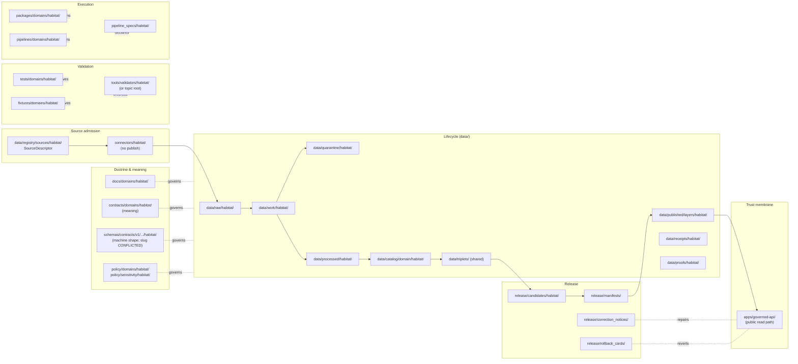

<!-- [KFM_META_BLOCK_V2]
doc_id: kfm://doc/habitat-file-system-plan
title: Habitat Domain — File System Plan
type: standard
version: v1
status: draft
owners: <TODO: domain-habitat-steward> + <TODO: docs-steward>
created: 2026-05-17
updated: 2026-06-05
policy_label: public
related:
  - docs/doctrine/directory-rules.md
  - docs/domains/habitat/README.md
  - docs/domains/habitat/ARCHITECTURE.md
  - docs/domains/habitat/CANONICAL_PATHS.md
  - docs/domains/habitat/CONTRACTS.md
  - docs/domains/fauna/FILE_SYSTEM_PLAN.md
  - docs/architecture/contract-schema-policy-split.md
  - docs/architecture/habitat-fauna-thin-slice.md
  - docs/doctrine/lifecycle-law.md
  - docs/doctrine/trust-membrane.md
  - ai-build-operating-contract.md
tags: [kfm, habitat, directory, governance, placement, ddd]
notes:
  - CONTRACT_VERSION = "3.0.0"
  - Specific paths are PROPOSED until verified against mounted-repo evidence.
  - Habitat × Fauna thin slice is the first proof-bearing lane.
  - "CONFLICTED schema-home: ADR-0001 OPEN per Atlas ADR-S-01 (confirm-or-amend; VB-11-01 NEEDS VERIFICATION); segmented .../domains/habitat/ (DIRRULES §12) vs flat .../habitat/ (Atlas §24.13) unresolved. See §1, §3."
[/KFM_META_BLOCK_V2] -->

# Habitat Domain — File System Plan

> Where every Habitat-domain file lives across KFM's responsibility roots, why it lives there, and what governs it on the way in and on the way out.

<!-- Badges: status / governance / lifecycle / authority. Placeholders until CI targets are confirmed. -->


<!-- TODO: replace last-updated, CI, and policy-conformance badges once concrete CI URLs are confirmed. -->


**Status:** draft · **Owners:** `<TODO: domain-habitat-steward>` + `<TODO: docs-steward>` · **Last updated:** 2026-06-05 · `CONTRACT_VERSION = "3.0.0"`

---

## Contents

1. [Scope and authority](#1-scope-and-authority)
2. [What Habitat owns (and what it does not)](#2-what-habitat-owns-and-what-it-does-not)
3. [Lane map — Habitat across responsibility roots](#3-lane-map--habitat-across-responsibility-roots)
4. [Proposed directory tree](#4-proposed-directory-tree)
5. [Object families → lane placement](#5-object-families--lane-placement)
6. [Habitat lifecycle (`data/`)](#6-habitat-lifecycle-data)
7. [Sensitivity posture and join-induced risk](#7-sensitivity-posture-and-join-induced-risk)
8. [Cross-domain joins and shared-kernel placement](#8-cross-domain-joins-and-shared-kernel-placement)
9. [Habitat × Fauna thin-slice file plan](#9-habitat--fauna-thin-slice-file-plan)
10. [Habitat-specific anti-patterns and drift fixes](#10-habitat-specific-anti-patterns-and-drift-fixes)
11. [Conformance checklist for Habitat PRs](#11-conformance-checklist-for-habitat-prs)
12. [Open questions and NEEDS VERIFICATION](#12-open-questions-and-needs-verification)
13. [Related docs](#13-related-docs)

---

## 1. Scope and authority

This document is the **Habitat domain's file-system plan**. It states, for every responsibility root, what Habitat content lives under that root, why, and what gates govern movement between phases. It does not redefine doctrine; it applies it.

- **Authority order (CONFIRMED doctrine).** [`directory-rules.md`] governs *where* Habitat files go. ADRs amending Directory Rules win over this plan when they explicitly apply. Per-root `README.md` files refine but cannot contradict. Domain dossiers ([DOM-HAB], [DOM-HF], [ENCY]) are lineage / proposed material for placement decisions, not new authority.
- **Authority of any specific path quoted here:** **PROPOSED** until verified against mounted-repo evidence. No live repo was inspected for this draft; treat trees, paths, file names, and route names as proposed unless a per-root README, ADR, or `git`-equivalent inspection has confirmed them.
- **Domain Placement Law (CONFIRMED).** Habitat **MUST NOT** appear as a root folder (`habitat/`). It appears as a **lane segment** inside each responsibility root that owns Habitat content. See [`directory-rules.md` §12].
- **Schema home (`CONFLICTED` — ADR-required).** `.schema.json` files live under `schemas/`, **never** under `contracts/` (CONFIRMED). But **which `schemas/` slug is canonical is unresolved** — see the §3 callout. ADR-0001 is **OPEN** (Atlas ADR-S-01, "confirm or amend"; App. G VB-11-01 `NEEDS VERIFICATION`), and the segmented `schemas/contracts/v1/domains/habitat/` (DIRRULES §12) vs flat `schemas/contracts/v1/habitat/` (Atlas §24.13) slug is a drift. [`directory-rules.md` §6.4]
- **Lifecycle invariant (CONFIRMED).** `RAW → WORK / QUARANTINE → PROCESSED → CATALOG / TRIPLET → PUBLISHED`. Promotion is a governed state transition, not a file move. [`directory-rules.md` §9]
- **Sensitive-domain disposition (CONFIRMED).** Rare-species, sensitive-occurrence, and steward-controlled habitat content routes through the `ai-build-operating-contract.md` §23.2 sensitive-domain matrix (most-restrictive applicable row). This plan does not re-derive it.

> [!IMPORTANT]
> If mounted-repo state conflicts with this plan, **the conflict is drift, not new authority**. Record it in `docs/registers/DRIFT_REGISTER.md` and resolve by ADR or migration — do not silently rewrite this plan to match the repo. [`directory-rules.md` §2.5]

[Back to top](#contents)

---

## 2. What Habitat owns (and what it does not)

**Habitat owns (CONFIRMED doctrine; PROPOSED field realization):** habitat patches, habitat classes, land-cover observations, ecological systems, suitability surfaces, habitat-quality scores, connectivity edges and corridors, restoration opportunities, stewardship zones, model-run receipts, uncertainty surfaces, and public-safe Habitat derivatives. [`kfm_encyclopedia.pdf §7.4`] [`KFM_Domains_Culmination_Atlas_v1_1.pdf` §6]

**Habitat explicitly does NOT own:**

| Boundary item | Owner | Why it matters |
|---|---|---|
| Species occurrence truth, taxonomic identity, sensitive occurrence geometry | **Fauna** ([DOM-FAUNA]) | Habitat may *join* to occurrence; it must not store or publish occurrence as habitat truth. |
| Plant taxonomy, specimen evidence, rare-plant records | **Flora** ([DOM-FLORA]) | Same join-only relationship as Fauna. |
| Hydrologic units, gauges, observed water conditions | **Hydrology** ([DOM-HYD]) | Habitat consumes hydrology as governed context only. |
| Soil map units, components, horizons, properties | **Soil** ([DOM-SOIL]) | Habitat consumes soil as governed context only. |
| Crop/field operations, agricultural economy | **Agriculture** ([DOM-AG]) | Governed-join context only. |
| Shared governance objects (`EvidenceBundle`, `EvidenceRef`, `SourceDescriptor`, `RunReceipt`, `PromotionDecision`, `ReleaseManifest`, `PolicyDecision`, `DecisionEnvelope`) | **Shared kernel** ([DDD]) | Habitat consumes; it MUST NOT redefine these per-lane. |

> [!CAUTION]
> A "habitat × fauna" or "habitat × flora" file is a **cross-domain artifact**, not a Habitat-only file. Place it under the lowest common responsibility root **without** a single-domain segment, per [`directory-rules.md` §12 "Multi-domain and cross-cutting files"]. Cross-domain *doctrine* lives under `docs/architecture/<topic>.md`, **not** a combined `docs/domains/habitat-fauna/` lane folder.

[Back to top](#contents)

---

## 3. Lane map — Habitat across responsibility roots

The diagram below shows the responsibility roots that carry Habitat content, the order in which trust flows through them, and the trust-membrane boundary the lane must respect.



> [!WARNING]
> **Schema-home slug is `CONFLICTED` and ADR-required.** Two questions are **open**: (1) is `schemas/contracts/v1/…` confirmed as the canonical home? This is **ADR-S-01** — "confirm `schemas/contracts/v1/…` by ADR-0001 **or amend**"; Atlas App. G VB-11-01 marks it `NEEDS VERIFICATION`. (2) Segmented `schemas/contracts/v1/domains/habitat/` (DIRRULES §12) vs flat `schemas/contracts/v1/habitat/` (Atlas §24.13). CONFIRMED regardless: `.schema.json` never lives under `contracts/`, and the repo MUST NOT maintain divergent definitions in both `schemas/` and `contracts/`. The table below uses the segmented slug; if ADR-S-01 selects the flat form, read `…/domains/habitat/` as `…/habitat/`. Open a `DRIFT_REGISTER.md` entry; do not create both slugs. [`directory-rules.md` §6.4, §13.1, §2.4(3)], [ATLAS §24.12 ADR-S-01], [§24.13], [App. G VB-11-01].

The table below names each lane explicitly. **CONFIRMED** entries are doctrinal placements that come directly from Directory Rules §12. **PROPOSED** entries are habitat-specific names that need confirmation against mounted-repo state.

| Responsibility root | Habitat lane (PROPOSED path) | Owns | Status |
|---|---|---|---|
| `docs/` | `docs/domains/habitat/` | Human-facing doctrine, this plan, README, runbooks (subfolder TBD) | CONFIRMED segment / PROPOSED files |
| `control_plane/` | `control_plane/domains/habitat/` (if needed) | Machine-readable governance maps for Habitat (registry refs, ADR index slices) | PROPOSED |
| `contracts/` | `contracts/domains/habitat/` | Habitat object **meaning** (Markdown contracts, ubiquitous-language definitions) | CONFIRMED segment / PROPOSED files |
| `schemas/` | `schemas/contracts/v1/domains/habitat/` *(slug CONFLICTED — see callout)* | Habitat object **machine shape** (JSON Schema / contracts v1) | CONFLICTED slug; ADR-S-01 open |
| `policy/` | `policy/domains/habitat/`, `policy/sensitivity/habitat/`, `policy/release/habitat/` | Allow / deny / restrict / abstain rules; sensitive-join controls; model-card requirements | CONFIRMED segment / PROPOSED splits |
| `tests/` | `tests/domains/habitat/` | Validators proving the rules above are enforceable | CONFIRMED segment |
| `fixtures/` | `fixtures/domains/habitat/` | Golden / valid / invalid Habitat sample data; thin-slice fixtures | CONFIRMED segment |
| `tools/` | `tools/validators/habitat/` (lane-internal) or `tools/validators/<topic>/` (cross-domain) | Repo-wide Habitat validators; cross-domain ecology validators | PROPOSED placement; see §8 |
| `connectors/` | `connectors/habitat/` (lane) or `connectors/<source>/` (source-rooted) | Source-specific fetchers / admitters that emit to `data/raw/` or `data/quarantine/` | PROPOSED — connector layout convention NEEDS VERIFICATION |
| `pipelines/` | `pipelines/domains/habitat/` | Executable pipeline logic (promotion, transforms, derivatives) | CONFIRMED segment |
| `pipeline_specs/` | `pipeline_specs/habitat/` | Declarative pipeline configuration | CONFIRMED segment |
| `packages/` | `packages/domains/habitat/` | Shared Habitat-domain libraries used by multiple deployables | CONFIRMED segment |
| `data/` | See [§6](#6-habitat-lifecycle-data) | All Habitat lifecycle data | CONFIRMED root, lifecycle phases CONFIRMED |
| `release/` | `release/candidates/habitat/` (+ shared `release/manifests/`, `release/rollback_cards/`, `release/correction_notices/`) | Habitat-specific release candidates; shared release decisions | CONFIRMED |
| `runtime/` | No habitat-specific lane by default | Adapters behind the governed API. Habitat-specific adapters appear only when a Habitat-specific runtime concern exists. | PROPOSED — assume no lane until justified |
| `infra/` | No habitat-specific lane by default | Deny-by-default, least privilege, audit. Habitat does not get its own infra root. | PROPOSED — assume no lane |
| `configs/` | `configs/domains/habitat/` if Habitat-specific non-secret config is needed | Templates and defaults only | PROPOSED |
| `examples/` | `examples/habitat/` if a runnable habitat example earns its keep | Runnable, kept current | PROPOSED |

> [!NOTE]
> The lane *segments* (e.g., `domains/habitat/` under `docs/`, `contracts/`, `policy/`, `tests/`, `fixtures/`, `packages/`, `pipelines/`) are the **CONFIRMED** pattern from [`directory-rules.md` §12]. Any concrete *path* listed above is **PROPOSED** until repo-evidence verification, and the `schemas/` slug is additionally `CONFLICTED` per the callout.

[Back to top](#contents)

---

## 4. Proposed directory tree

The tree below is **PROPOSED**. It illustrates how the lane segments expand for a realistic Habitat domain. It does not claim that any of these files or folders exist in the current repository. The `schemas/…/domains/habitat/` prefix below carries the §3 slug conflict.

```text
docs/domains/habitat/
├── README.md                                    # PROPOSED — domain landing page
├── FILE_SYSTEM_PLAN.md                          # this document
├── HABITAT_DOMAIN_MODEL.md                      # PROPOSED — object families, ubiquitous language
├── HABITAT_SOURCE_LEDGER.md                     # PROPOSED — accepted source families, roles, sensitivity
├── HABITAT_SENSITIVITY_PROFILE.md               # PROPOSED — public-safe rules, deny-by-default joins
├── runbooks/                                    # PROPOSED — subfolder NEEDS VERIFICATION (OPEN-DR-02)
│   ├── HABITAT_SOURCE_REFRESH_RUNBOOK.md
│   └── HABITAT_MODEL_REBUILD_RUNBOOK.md
└── decisions/                                   # PROPOSED — ADR slices specific to Habitat lane

contracts/domains/habitat/
├── habitat-patch.contract.md                    # PROPOSED — HabitatPatch meaning
├── land-cover-observation.contract.md           # PROPOSED
├── ecological-system.contract.md                # PROPOSED
├── habitat-quality-score.contract.md            # PROPOSED
├── suitability-model.contract.md                # PROPOSED — model-card requirements
├── connectivity-edge.contract.md                # PROPOSED
├── corridor.contract.md                         # PROPOSED
├── restoration-opportunity.contract.md          # PROPOSED
├── stewardship-zone.contract.md                 # PROPOSED
├── model-run-receipt.contract.md                # PROPOSED — lane reference to shared receipt
└── uncertainty-surface.contract.md              # PROPOSED

schemas/contracts/v1/domains/habitat/            # slug CONFLICTED (segmented vs flat) — §3
├── habitat-patch.schema.json                    # PROPOSED
├── land-cover-observation.schema.json           # PROPOSED
├── ecological-system.schema.json                # PROPOSED
├── habitat-quality-score.schema.json            # PROPOSED
├── suitability-model.schema.json                # PROPOSED
├── connectivity-edge.schema.json                # PROPOSED
├── corridor.schema.json                         # PROPOSED
├── restoration-opportunity.schema.json          # PROPOSED
├── stewardship-zone.schema.json                 # PROPOSED
├── uncertainty-surface.schema.json              # PROPOSED
└── layer-manifest.habitat.schema.json           # PROPOSED — Habitat layer manifest profile

policy/domains/habitat/
├── source-role.allow.rego                       # PROPOSED — habitat source-role admission
├── critical-habitat.deny.rego                   # PROPOSED — modeled-as-critical denial
├── model-card-required.deny.rego                # PROPOSED — suitability without model card → DENY
└── release-gate.habitat.rego                    # PROPOSED

policy/sensitivity/habitat/
├── join-with-fauna.deny.rego                    # PROPOSED — join-induced sensitivity
├── join-with-flora.deny.rego                    # PROPOSED
└── exact-occurrence-linked-derivative.deny.rego # PROPOSED

tests/domains/habitat/
├── source-descriptor.test.*                     # PROPOSED
├── critical-habitat-source-role.test.*          # PROPOSED
├── modeled-as-critical.deny.test.*              # PROPOSED
├── occurrence-geoprivacy.test.*                 # PROPOSED — joint with Fauna fixtures
├── catalog-closure.test.*                       # PROPOSED
└── thin-slice.habitat-fauna.test.*              # PROPOSED — §9

fixtures/domains/habitat/
├── nlcd_kansas_county_sample/                   # PROPOSED — public-safe NLCD slice
├── habitat_patch_kansas_county/                 # PROPOSED
├── suitability_model_v0_run/                    # PROPOSED — fixture model run + uncertainty
├── habitat_fauna_thin_slice/                    # PROPOSED — joint fixture, public-safe
└── negative/                                    # PROPOSED — invalid samples for closed-fail tests

packages/domains/habitat/
├── habitat-core/                                # PROPOSED — domain library (entities, value objects)
├── habitat-suitability/                         # PROPOSED — model adapter (no public path)
└── habitat-connectivity/                        # PROPOSED — patch graph utilities

pipelines/domains/habitat/
├── ingest_nlcd.pipeline.*                       # PROPOSED
├── derive_habitat_patches.pipeline.*            # PROPOSED
├── compute_suitability.pipeline.*               # PROPOSED — emits ModelRunReceipt
└── compute_connectivity.pipeline.*              # PROPOSED

pipeline_specs/habitat/
├── ingest_nlcd.spec.yaml                        # PROPOSED
├── derive_habitat_patches.spec.yaml             # PROPOSED
├── compute_suitability.spec.yaml                # PROPOSED
└── compute_connectivity.spec.yaml               # PROPOSED

data/registry/sources/habitat/
├── nlcd.source.yaml                             # PROPOSED — land cover
├── nwi.source.yaml                              # PROPOSED — wetlands
├── gap-landfire.source.yaml                     # PROPOSED
├── usfws-critical-habitat.source.yaml           # PROPOSED — NEEDS VERIFICATION rights
├── natureserve.source.yaml                      # PROPOSED — rights restricted
├── pad-us.source.yaml                           # PROPOSED — stewardship context
└── kdwp.source.yaml                             # PROPOSED — state review context

data/raw/habitat/             # PROPOSED — immutable source payloads or references
data/work/habitat/            # PROPOSED — normalization in progress
data/quarantine/habitat/      # PROPOSED — failed validation / policy hold (deny-by-default)
data/processed/habitat/       # PROPOSED — validated normalized objects + public-safe candidates
data/catalog/domain/habitat/  # PROPOSED — catalog records and EvidenceBundles
data/triplets/                # PROPOSED — graph / triplet projections (SHARED, non-domain-scoped; plural per Directory Rules §9)
data/published/layers/habitat/ # PROPOSED — released public-safe artifacts only
data/receipts/habitat/        # PROPOSED — RunReceipts, PromotionReceipts, RedactionReceipts
data/proofs/habitat/          # PROPOSED — EvidenceBundles, integrity envelopes
data/rollback/habitat/        # PROPOSED — alias-revert receipts (data-plane half of rollback)

release/candidates/habitat/   # PROPOSED — release candidates awaiting decision
release/manifests/            # SHARED — ReleaseManifests across domains live here
release/rollback_cards/       # SHARED — rollback decisions (release-plane half)
release/correction_notices/   # SHARED — corrections that name a Habitat artifact
```

> [!WARNING]
> This tree is illustrative. **Do not** create any of these paths from this document alone. Every actual placement requires the path-validation checklist in [`directory-rules.md` §4 / §16] and a per-root README that meets §15.

[Back to top](#contents)

---

## 5. Object families → lane placement

The object families below are **CONFIRMED** for Habitat per the encyclopedia and atlas. Their **identity rule** ("source id + object role + temporal scope + normalized digest") is **PROPOSED** at the field level; the **temporal handling** (distinct `source / observed / valid / retrieval / release / correction` times) is **CONFIRMED** doctrine across KFM. [`kfm_encyclopedia.pdf §7.4`] [`KFM_Domains_Culmination_Atlas_v1_1.pdf` §6, Appendix C]

> [!NOTE]
> The `schemas/contracts/v1/domains/habitat/…` paths in this table carry the §3 slug conflict; if ADR-S-01 selects the flat form, read them as `schemas/contracts/v1/habitat/…`. The relative position (meaning vs shape vs policy vs proof) is unaffected.

| Object family | `contracts/` (meaning) | `schemas/contracts/v1/` (shape) | `policy/` controls | `tests/` + `fixtures/` | Notes |
|---|---|---|---|---|---|
| `HabitatPatch` | `contracts/domains/habitat/habitat-patch.contract.md` | `…/domains/habitat/habitat-patch.schema.json` | source-role admission; sensitive-join deny | patch identity tests; NLCD-derived fixture | Patch graph node; observation-rooted. |
| `LandCoverObservation` | `…/land-cover-observation.contract.md` | `…/land-cover-observation.schema.json` | source-role; license/rights gate | golden + negative NLCD fixtures | Observation, not model. Label visibly. |
| `EcologicalSystem` | `…/ecological-system.contract.md` | `…/ecological-system.schema.json` | source-role (NatureServe rights NEEDS VERIFICATION) | classification fixtures | Authoritative classification source. |
| `HabitatQualityScore` | `…/habitat-quality-score.contract.md` | `…/habitat-quality-score.schema.json` | model-card required | scored fixtures + invalid | Derived; descriptive not prescriptive; model label visible. |
| `SuitabilityModel` | `…/suitability-model.contract.md` | `…/suitability-model.schema.json` | model-card required; deny without `ModelRunReceipt` | small model run fixture | Always paired with `UncertaintySurface`. |
| `ConnectivityEdge` | `…/connectivity-edge.contract.md` | `…/connectivity-edge.schema.json` | derivative labeling | patch-graph edge fixtures | Derived from patch graph. |
| `Corridor` | `…/corridor.contract.md` | `…/corridor.schema.json` | sensitive-species corridor exposure check | corridor fixtures | May trigger sensitivity join checks. |
| `RestorationOpportunity` | `…/restoration-opportunity.contract.md` | `…/restoration-opportunity.schema.json` | rights / steward review | candidate fixtures | Rights of restoration partners NEEDS VERIFICATION. |
| `StewardshipZone` | `…/stewardship-zone.contract.md` | `…/stewardship-zone.schema.json` | PAD-US source role | zone fixtures | Context, not authority; `T1` default. |
| `ModelRunReceipt` | shared-kernel reference | `schemas/contracts/v1/receipts/` (shared) | release-gate references it | model-run fixtures | **Shared kernel** — do not redefine in Habitat. |
| `UncertaintySurface` | `…/uncertainty-surface.contract.md` | `…/uncertainty-surface.schema.json` | derivative labeling | uncertainty fixtures | Must accompany suitability outputs; must not be erased. |

> [!NOTE]
> The kernel objects Habitat consumes (`EvidenceBundle`, `EvidenceRef`, `SourceDescriptor`, `RunReceipt`, `PromotionDecision`, `PromotionReceipt`, `ReleaseManifest`, `PolicyDecision`, `DecisionEnvelope`, `RollbackCard`, `CorrectionNotice`, `RuntimeResponseEnvelope`) live under shared, non-domain schemas (e.g., `schemas/contracts/v1/evidence/`, `…/release/`, `…/runtime/`). Habitat references them; it does not redefine them. Any divergent Habitat copy is a drift entry. [`KFM_Pass_20_Part_2_Idea_Index_Category_Atlas_and_Expansion_Dossier.md` KFM-IDX-DOC-005]

[Back to top](#contents)

---

## 6. Habitat lifecycle (`data/`)

The lifecycle invariant is **CONFIRMED**: `RAW → WORK / QUARANTINE → PROCESSED → CATALOG / TRIPLET → PUBLISHED`. Promotion is a governed state transition, **not a file move**. Watchers observe and record; they do not publish. [`directory-rules.md` §9, §13.5]

| Phase | Habitat lane (PROPOSED) | What it holds | Gate to next phase |
|---|---|---|---|
| **RAW** | `data/raw/habitat/<source>/<vintage>/…` | Immutable source payload or reference + `SourceDescriptor` reference | `SourceDescriptor` exists; rights & source-role known |
| **WORK** | `data/work/habitat/<batch>/…` | Normalization in progress: schema, geometry, time, identity, evidence, rights, policy | Validation pass + policy decision recorded |
| **QUARANTINE** | `data/quarantine/habitat/<batch>/…` | Failed validation or sensitive-hold material (deny-by-default access) | Resolution receipt or expiry |
| **PROCESSED** | `data/processed/habitat/<batch>/…` | Validated, normalized objects + receipts + public-safe candidates | `EvidenceRef` resolves; `ValidationReport` present; digest closed |
| **CATALOG / TRIPLET** | `data/catalog/domain/habitat/…`, `data/triplets/…` (shared) | Catalog records, `EvidenceBundle`s, graph/triplet projections, release candidates | Catalog & proof closure passes |
| **PUBLISHED** | `data/published/layers/habitat/…` | Released public-safe artifacts (e.g., generalized patch tiles, public suitability layer) | `ReleaseManifest`, correction path, rollback target exist |

**Emitted alongside lifecycle phases (not as replacements):**

- `data/receipts/habitat/` — `RunReceipt`, `PromotionReceipt`, `RedactionReceipt`, `IntegrityReceipt`.
- `data/proofs/habitat/` — `EvidenceBundle`, PMTiles `IntegrityEnvelope`, byte-range manifests where applicable.
- `data/rollback/habitat/` — alias-revert receipts (data-plane half of rollback). The release-plane half lives in `release/rollback_cards/`.

> [!CAUTION]
> A Habitat pipeline that writes directly from `data/raw/habitat/` to `data/published/layers/habitat/` violates the lifecycle invariant. Lifecycle skips are an anti-pattern even when "the data is fine." [`directory-rules.md` §13.5]

> [!NOTE]
> `data/triplets/` is **plural** and **shared / non-domain-scoped** per Directory Rules §9 — graph/triplet projections do **not** live under a `data/triplets/habitat/` domain segment. The plural-vs-singular form is itself a tracked open item (see §12 item 4).

[Back to top](#contents)

---

## 7. Sensitivity posture and join-induced risk

**CONFIRMED:** Sensitive occurrence details deny by default. Regulatory critical habitat, modeled habitat, species range, occurrence points, and landscape context **must not be flattened**. [`KFM_Domains_Culmination_Atlas_v1_1.pdf` §6.I] [`kfm_encyclopedia.pdf §13`]

> [!CAUTION]
> **Sensitive-domain routing.** Disposition for the rows below routes through the `ai-build-operating-contract.md` §23.2 sensitive-domain matrix (most-restrictive applicable row): DENY exact / GENERALIZE / REDACT / QUARANTINE / steward review / `RedactionReceipt` / ABSTAIN. This plan states the posture; it does not re-derive disposition.

**Key Habitat-specific risk:** *join-induced sensitivity*. A benign NLCD-derived patch becomes sensitive when joined to a sensitive Fauna occurrence (nest, den, roost, hibernaculum, spawning site) or a rare-plant record. Sensitivity is a property of the **resulting product**, not just the input. [`KFM_Pass_20_Part_2_Idea_Index_Category_Atlas_and_Expansion_Dossier.md` KFM-IDX-POL-003]

| Surface | Default outcome | Allowed only when |
|---|---|---|
| Exact occurrence-linked habitat output | **DENY** | Generalization or suppression + `RedactionReceipt` + steward review |
| Regulatory critical-habitat passthrough | **CONTEXT-LABELED**, never silently re-modeled | Source role = `regulatory / authority`; model-derived layers labeled distinctly |
| Modeled-as-critical relabel | **DENY** | Explicit denial test passes; model card present |
| Sensitive corridor exposure | **DENY** at exact precision | Generalized corridor + sensitivity review |
| Habitat × Fauna public join | **DENY** unless geoprivacy transform applied | `RedactionReceipt` + `PolicyDecision: ALLOW` + `ReleaseManifest` |

**Policy file homes (PROPOSED).** Habitat-specific sensitivity rules live in `policy/sensitivity/habitat/`. Join policies that span Habitat + Fauna live under `policy/sensitivity/` (or `policy/joins/…`, §8) without a single-domain segment, since the policy spans more than one domain.

> [!WARNING]
> Public observability — popups, AI-generated summaries, Evidence Drawer payloads, downloadable tiles — counts as exposure. The denial applies to the **rendered surface**, not just the underlying file. The trust membrane is the governed API; canonical stores are never a public read path. [`directory-rules.md` §13.5]

[Back to top](#contents)

---

## 8. Cross-domain joins and shared-kernel placement

Habitat joins to **Fauna**, **Flora**, **Hydrology**, **Soil**, **Agriculture**, and **People/Land** (the last as governed context only). Placement of join artifacts follows [`directory-rules.md` §12] *Multi-domain and cross-cutting files*: pick the **lowest common responsibility root** and **do not** put the file under a single-domain segment.

| Cross-domain artifact | Wrong placement (anti-pattern) | Correct placement (PROPOSED) |
|---|---|---|
| Habitat × Fauna geoprivacy validator | `tools/validators/habitat/fauna-geoprivacy.*` | `tools/validators/geoprivacy/habitat-fauna.*` |
| Habitat-Fauna join schema | `schemas/contracts/v1/domains/habitat/habitat-fauna-join.schema.json` | `schemas/contracts/v1/joins/habitat-fauna-join.schema.json` |
| Habitat × Hydrology riparian policy | `policy/domains/habitat/riparian-with-hydrology.*` | `policy/joins/habitat-hydrology/riparian.*` |
| Cross-domain ecology doctrine | `docs/domains/habitat/cross-domain.md` (or a `docs/domains/habitat-fauna/` lane folder) | `docs/architecture/ecology-cross-domain.md` |
| Shared-kernel governance schema (e.g., `EvidenceBundle`) | `schemas/contracts/v1/domains/habitat/evidence-bundle.schema.json` | `schemas/contracts/v1/evidence/evidence-bundle.schema.json` (shared kernel) |

**Shared-kernel rule.** Habitat must consume — not redefine — the kernel objects listed in [§5](#5-object-families--lane-placement). Any Habitat-local fork is a drift entry. [`KFM_Pass_20_Part_2_Idea_Index_Category_Atlas_and_Expansion_Dossier.md` KFM-IDX-DOC-005]

[Back to top](#contents)

---

## 9. Habitat × Fauna thin-slice file plan

**Status: PROPOSED.** The Habitat × Fauna thin slice is the **first credible proof slice** for the Habitat lane and a high-leverage early proof for the Fauna lane as well. It uses **public-safe fixtures**, not live sensitive connectors. [`kfm_encyclopedia.pdf §7.4`] [`KFM_Domains_Culmination_Atlas_v1_1.pdf` §6] [`KFM_Pass_20_Part_2_Idea_Index_Category_Atlas_and_Expansion_Dossier.md` KFM-IDX-APP-002]

Its file plan is intentionally small. Every entry below is **PROPOSED**. The cross-lane *doctrine* doc for this slice belongs under `docs/architecture/habitat-fauna-thin-slice.md` (not a `docs/domains/habitat-fauna/` lane folder, per §8).

<details>
<summary><strong>Click to expand the proposed thin-slice file plan</strong></summary>

```text
fixtures/domains/habitat/habitat_fauna_thin_slice/
├── nlcd_county_slice.geojson            # PROPOSED — public-safe land cover for one Kansas county
├── habitat_patch_derived.geojson        # PROPOSED — derived patches over the slice
├── public_safe_occurrence.geojson       # PROPOSED — non-sensitive species, generalized geometry
├── source_descriptor.nlcd.yaml          # PROPOSED — NLCD SourceDescriptor
├── source_descriptor.occurrence.yaml    # PROPOSED — occurrence SourceDescriptor
├── evidence_bundle.thin_slice.json      # PROPOSED — bundle covering both sources + derivation
├── redaction_receipt.json               # PROPOSED — proves generalization was applied
├── layer_manifest.habitat.json          # PROPOSED — public-safe habitat layer descriptor
├── evidence_drawer_payload.example.json # PROPOSED — drawer payload over the slice
└── release_manifest.dry_run.json        # PROPOSED — dry-run release decision, no public target

tests/domains/habitat/thin-slice.habitat-fauna.test.*
release/candidates/habitat/habitat_fauna_thin_slice/   # PROPOSED — dry-run candidate
```

**Closure criteria (PROPOSED):**

1. `SourceDescriptor` exists for both inputs.
2. `EvidenceBundle` resolves; digests closed.
3. `RedactionReceipt` proves geoprivacy transform was applied to the occurrence input.
4. `PolicyDecision` for the join returns `ALLOW` only after redaction.
5. `LayerManifest` describes the public-safe layer; canonical store is **not** publicly readable.
6. `ReleaseManifest` is a **dry-run** (no public target) until governed-API delivery is verified.
7. `RollbackCard` and `CorrectionNotice` paths exist and are reachable.

</details>

> [!TIP]
> The thin slice should be reviewable in one PR. If it grows past a single Kansas county and a single occurrence join, split it before merging. [`KFM_Pass_20_Part_2_Idea_Index_Category_Atlas_and_Expansion_Dossier.md` KFM-IDX-PLN-003]

[Back to top](#contents)

---

## 10. Habitat-specific anti-patterns and drift fixes

These are the placement mistakes most likely to appear in Habitat work. The first four come straight from Directory Rules [§13]; the last three are Habitat-specific extensions.

| Anti-pattern | Symptom | Fix |
|---|---|---|
| Root domain folder | `habitat/` at repo root with its own `data/`, `schemas/`, `policy/`, `docs/` | Apply Domain Placement Law (§3, §4). Migrate into responsibility-root lanes. [`directory-rules.md` §13.4] |
| Parallel schema home | Habitat schemas in both `contracts/domains/habitat/*.schema.json` and `schemas/…/habitat/*.schema.json`, **or** the segmented and flat `schemas/` slugs both holding definitions | `.schema.json` never under `contracts/` (CONFIRMED). The canonical `schemas/` slug is ADR-S-01 (`CONFLICTED`, §3). Migrate, freeze the old path, add drift entry. [`directory-rules.md` §13.1] |
| Suitability without uncertainty | `SuitabilityModel` output published without `UncertaintySurface` or `ModelRunReceipt` | Publication-gate validator must require both. Add tests under `tests/domains/habitat/`. |
| Regulatory critical habitat re-modeled | Modeled output sharing the label "critical habitat" with regulatory critical-habitat features | Source-role separation: `regulatory / authority` (USFWS) vs `model`. Add `modeled-as-critical.deny.rego` and matching test. |
| Habitat × Fauna join without geoprivacy | Public layer joining patches to exact sensitive occurrence geometry | Deny by default; require `RedactionReceipt` + `PolicyDecision: ALLOW`. Place policy in `policy/sensitivity/` (joint), not in `policy/domains/habitat/`. |
| Watcher writes published Habitat tiles | A connector or watcher writes directly to `data/published/layers/habitat/` | Watcher-as-non-publisher invariant: workers emit receipts and candidates only. [`directory-rules.md` §13.5] |
| Domain summary file used as authority | A `docs/domains/habitat/*.md` cited as the source of a canonical decision | Promote to ADR or `control_plane/` register. Docs explain; they do not adjudicate. [`directory-rules.md` §13.5] |

[Back to top](#contents)

---

## 11. Conformance checklist for Habitat PRs

Use this list for any PR that adds, moves, or renames a file inside a Habitat lane. It is the Habitat-specific overlay on top of [`directory-rules.md` §4 / §16] and SHOULD appear in the PR description.

- [ ] **Responsibility identified.** The file maps to exactly one Step-1 responsibility from [`directory-rules.md` §4].
- [ ] **Right root.** The chosen root carries that responsibility; Habitat is a **lane segment**, never a root.
- [ ] **Domain segment placement.** The Habitat segment appears inside the responsibility root (e.g., `tests/domains/habitat/`), not at root.
- [ ] **Cross-domain check.** If the file legitimately spans Habitat and another domain, it lives under the **lowest common responsibility root** *without* a single-domain segment (see [§8](#8-cross-domain-joins-and-shared-kernel-placement)).
- [ ] **Schema home.** Any Habitat schema lives under `schemas/` (never `contracts/`); the exact slug (`…/domains/habitat/` vs `…/habitat/`) is `CONFLICTED` pending ADR-S-01 (§3). `contracts/domains/habitat/` holds Markdown-only contract meaning.
- [ ] **Shared kernel respected.** No Habitat-local fork of `EvidenceBundle`, `EvidenceRef`, `SourceDescriptor`, `RunReceipt`, `PromotionDecision`, `ReleaseManifest`, `PolicyDecision`, `DecisionEnvelope`, `RollbackCard`, or `CorrectionNotice`.
- [ ] **Sensitivity check.** Any Habitat × Fauna or Habitat × Flora join carries a `RedactionReceipt` and a `PolicyDecision`. Exact occurrence-linked outputs deny by default; disposition routes through `ai-build-operating-contract.md` §23.2.
- [ ] **Lifecycle phase explicit** (data files). Phase named; no skipped phases; promotion handled as a governed state transition.
- [ ] **Trust-membrane discipline.** Habitat public reads go through `apps/governed-api/`. No public client reads `data/processed/`, `data/catalog/`, or `data/published/` directly.
- [ ] **Per-root README current.** Affected root carries a README meeting [`directory-rules.md` §15].
- [ ] **Drift entry filed** if mounted repo differs from this plan: write `docs/registers/DRIFT_REGISTER.md` entry; do **not** silently change this plan.

[Back to top](#contents)

---

## 12. Open questions and NEEDS VERIFICATION

| # | Item | Resolves when |
|---:|---|---|
| 1 | Whether `connectors/habitat/` (domain-rooted) or `connectors/<source>/` (source-rooted) is the chosen connector layout. | Repo inspection + ADR. |
| 2 | Whether `tools/validators/habitat/` is preferred over `tools/validators/<topic>/` for Habitat-only validators. | Per-root README of `tools/validators/` clarifies. |
| 3 | Whether `runtime/` carries a Habitat-specific adapter (e.g., for a habitat suitability model). | Implementation evidence. |
| 4 | Whether `data/triplets/` (plural) or `data/triplet/` (singular) is the live form. The plan uses `triplets/` (plural, shared) per Directory Rules §9. | ADR per [`directory-rules.md`] open drift item. |
| 5 | Whether `runbooks/` subfolder under `docs/domains/habitat/` is the established convention or whether runbooks use a flat-prefix naming convention (OPEN-DR-02). | Repo inspection + ADR. |
| 6 | USFWS ECOS / critical-habitat source terms, snapshot cadence, current endpoints. | `data/registry/sources/habitat/usfws-critical-habitat.source.yaml` filled and reviewed. |
| 7 | NatureServe / controlled biodiversity source rights. | Rights register entry + reviewer sign-off. |
| 8 | Exact route names for the governed-API Habitat resolvers (`HabitatDecisionEnvelope`, `LayerManifest`, Evidence Drawer payload, Focus Mode answer). | `apps/governed-api/` routing manifest. |
| 9 | Whether `policy/sensitivity/` for joint Habitat × Fauna policy is the chosen form vs. `policy/joins/habitat-fauna/`. | ADR. |
| 10 | Whether MapLibre / Evidence Drawer / Focus Mode have any Habitat-specific implementation today. | Repo inspection of `packages/maplibre/`, `apps/explorer-web/`, `apps/governed-api/`. |
| 11 | Whether `model-card` requirements for `SuitabilityModel` are codified anywhere (schema or policy). | Schema or `policy/domains/habitat/model-card-required.deny.rego` present. |
| 12 | **Schema-home slug for Habitat** — segmented `.../domains/habitat/` (DIRRULES §12) vs flat `.../habitat/` (Atlas §24.13); confirm/amend ADR-0001 (ADR-S-01; VB-11-01). | Accepted ADR-S-01 + DRIFT_REGISTER entry + mounted `schemas/` inspection. **CONFLICTED** |

[Back to top](#contents)

---

## 13. Related docs

<!-- Placeholders preserved where target docs are PROPOSED. -->

- [`docs/doctrine/directory-rules.md`](../../doctrine/directory-rules.md) — placement authority and lifecycle invariant. **Authoritative.**
- [`docs/domains/habitat/README.md`](./README.md) — Habitat domain landing page. **PROPOSED.**
- [`docs/domains/habitat/ARCHITECTURE.md`](./ARCHITECTURE.md) — lane architecture. **PROPOSED.**
- [`docs/domains/habitat/CANONICAL_PATHS.md`](./CANONICAL_PATHS.md) — full path enumeration. **PROPOSED.**
- [`docs/domains/habitat/CONTRACTS.md`](./CONTRACTS.md) — contract (meaning) index. **PROPOSED.**
- [`docs/domains/habitat/HABITAT_DOMAIN_MODEL.md`](./HABITAT_DOMAIN_MODEL.md) — object families, ubiquitous language. **PROPOSED.**
- [`docs/domains/habitat/HABITAT_SOURCE_LEDGER.md`](./HABITAT_SOURCE_LEDGER.md) — accepted source families and rights. **PROPOSED.**
- [`docs/domains/habitat/HABITAT_SENSITIVITY_PROFILE.md`](./HABITAT_SENSITIVITY_PROFILE.md) — sensitive-join controls. **PROPOSED.**
- [`docs/domains/fauna/FILE_SYSTEM_PLAN.md`](../fauna/FILE_SYSTEM_PLAN.md) — pairs with the Habitat × Fauna thin slice. **TODO** if absent.
- [`docs/domains/flora/FILE_SYSTEM_PLAN.md`](../flora/FILE_SYSTEM_PLAN.md) — adjacent boundary. **TODO** if absent.
- [`docs/architecture/contract-schema-policy-split.md`](../../architecture/contract-schema-policy-split.md) — contract vs schema vs policy boundary. **PROPOSED home.**
- [`docs/architecture/habitat-fauna-thin-slice.md`](../../architecture/habitat-fauna-thin-slice.md) — cross-lane thin-slice doctrine (corrected home, §8). **PROPOSED.**
- [`docs/architecture/ecology-cross-domain.md`](../../architecture/ecology-cross-domain.md) — cross-domain ecology doctrine. **PROPOSED home.**
- [`ai-build-operating-contract.md`](../../../ai-build-operating-contract.md) — operating law; §23.2 sensitive-domain matrix. **CONFIRMED** (`CONTRACT_VERSION = "3.0.0"`).
- [`docs/registers/DRIFT_REGISTER.md`](../../registers/DRIFT_REGISTER.md) — where mounted-repo vs plan conflicts get recorded (incl. the §3 schema-slug conflict).
- [`docs/registers/VERIFICATION_BACKLOG.md`](../../registers/VERIFICATION_BACKLOG.md) — `NEEDS VERIFICATION` items from §12.

---

<sub>**Last reviewed:** 2026-06-05 · **Plan version:** v1 (draft) · `CONTRACT_VERSION = "3.0.0"` · **Authority:** Directory Rules §12 (Domain Placement Law); ADR-0001 / ADR-S-01 (schema home — **OPEN / CONFLICTED**).</sub>

[Back to top](#contents)
