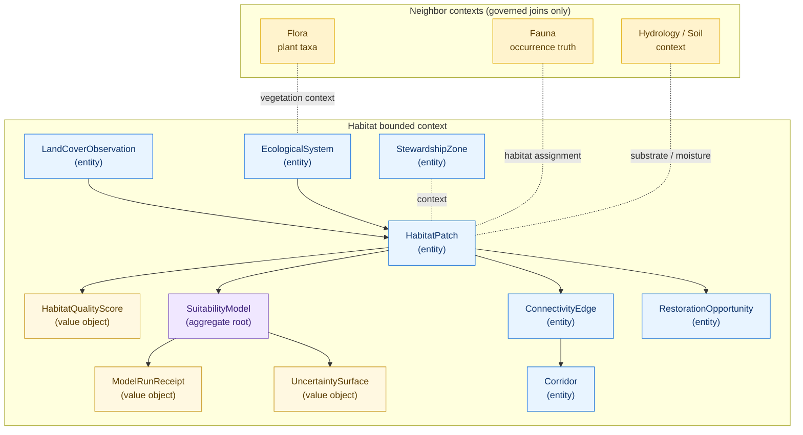

<!-- [KFM_META_BLOCK_V2]
doc_id: kfm://doc/habitat/domain-model
title: Habitat Domain — Domain Model & Ubiquitous Language
type: standard
version: v1
status: draft
owners: <TODO: domain-habitat-steward> + <TODO: contract-steward>
created: 2026-06-05
updated: 2026-06-05
policy_label: public
related:
  - docs/domains/habitat/README.md
  - docs/domains/habitat/ARCHITECTURE.md
  - docs/domains/habitat/CONTRACTS.md
  - docs/domains/habitat/CANONICAL_PATHS.md
  - docs/domains/habitat/FILE_SYSTEM_PLAN.md
  - docs/domains/habitat/DATA_LIFECYCLE.md
  - docs/doctrine/directory-rules.md
  - docs/architecture/contract-schema-policy-split.md
  - contracts/domains/habitat/
  - schemas/contracts/v1/domains/habitat/
  - ai-build-operating-contract.md
tags: [kfm, habitat, domain-model, ddd, ubiquitous-language, bounded-context, identity]
notes:
  - CONTRACT_VERSION = "3.0.0"
  - This is the lane MEANING spine; authoritative per-object meaning lives in contracts/domains/habitat/*.md, shape in schemas/.
  - DDD vocabulary (entity, value object, aggregate, bounded context) follows the Domain-Driven Design Reference in the corpus.
  - All repo-path claims are PROPOSED until verified against a mounted repo; the schema-home slug is CONFLICTED (see §10).
  - "CONFLICTED schema-home: ADR-0001 OPEN per Atlas ADR-S-01 (confirm-or-amend; VB-11-01 NEEDS VERIFICATION); segmented .../domains/habitat/ (DIRRULES §12) vs flat .../habitat/ (Atlas §24.13)."
[/KFM_META_BLOCK_V2] -->

# Habitat Domain — Domain Model & Ubiquitous Language

> The bounded-context model for the Habitat lane: the terms, entities, value objects, aggregates, identity rule, and temporal discipline that every Habitat contract, schema, validator, and UI string must use the same way. This file fixes *what the lane means*; it does not own machine shape or admissibility.

**Status:** `draft` · **Owners:** `<TODO: domain-habitat-steward>` + `<TODO: contract-steward>` · **Updated:** 2026-06-05 · `CONTRACT_VERSION = "3.0.0"`

> [!IMPORTANT]
> This document is the **meaning spine** for the Habitat lane. The **authoritative** per-object meaning lives in `contracts/domains/habitat/*.md`; machine **shape** lives under the canonical schema home (slug `CONFLICTED`, §10); **admissibility** lives in `policy/domains/habitat/`. Where this model and those authorities disagree, **they win** and the drift is filed in `docs/registers/DRIFT_REGISTER.md`.

---

## Contents

1. [Bounded context](#1-bounded-context)
2. [Method: DDD in KFM](#2-method-ddd-in-kfm)
3. [Ubiquitous language](#3-ubiquitous-language)
4. [The model at a glance](#4-the-model-at-a-glance)
5. [Entities](#5-entities)
6. [Value objects](#6-value-objects)
7. [Identity rule](#7-identity-rule)
8. [Temporal model](#8-temporal-model)
9. [Object families](#9-object-families)
10. [Where meaning binds to shape](#10-where-meaning-binds-to-shape)
11. [Relationships and aggregate boundaries](#11-relationships-and-aggregate-boundaries)
12. [Source roles (anti-collapse)](#12-source-roles-anti-collapse)
13. [Companion sections](#open-questions-register)
14. [Related docs](#related-docs)

---

## 0. Status & Authority

| Field | Value |
|---|---|
| **Document type** | Domain model / ubiquitous-language reference (standard doc). |
| **Authority of the model** | The model is **meaning doctrine**; the authoritative per-object meaning is the contract `.md` files it points to. |
| **Authority of any specific path** | **PROPOSED** until verified against mounted-repo evidence. |
| **Object-family membership** | **CONFIRMED** from `[ENCY §7.4]`, `[ATLAS §6]`. Field realization is **PROPOSED**. |
| **Schema-home convention** | Default `schemas/contracts/v1/…`; **segment slug `CONFLICTED`** and ADR-0001 **OPEN** (Atlas ADR-S-01). See §10. |
| **Method basis** | Domain-Driven Design (entities, value objects, aggregates, bounded context, ubiquitous language) per the corpus DDD Reference. |

[↑ Back to top](#contents)

---

## 1. Bounded context

The **Habitat bounded context** is the region of KFM where the Habitat ubiquitous language holds with one fixed meaning. Inside it, "patch", "suitability", "corridor", and "stewardship zone" mean exactly what §3 and §9 say — no more, no less.

**Habitat owns** the meaning of: habitat patches, land-cover observations, ecological systems, habitat-quality scores, suitability models, connectivity edges, corridors, restoration opportunities, stewardship zones, model-run receipts, and uncertainty surfaces. `[ENCY §7.4]` `[ATLAS §6.A]`

**Habitat does not own** (it *joins to*, never *absorbs*): species occurrence truth and taxonomy (**Fauna**), plant taxa and rare-plant records (**Flora**), hydrologic units (**Hydrology**), soil map units (**Soil**), agricultural operations (**Agriculture**), hazard events (**Hazards**), and the shared governance kernel (`EvidenceBundle`, `SourceDescriptor`, etc.). `[ATLAS §6.B]` `[DDD: bounded context]`

> [!IMPORTANT]
> A term that means one thing in Habitat and another thing in a neighbor lane must **not** be silently shared across the boundary. The relationship between contexts is a governed join with explicit ownership and source role, not a merged vocabulary. This is the DDD *context boundary* applied to KFM. `[DDD]`

[↑ Back to top](#contents)

---

## 2. Method: DDD in KFM

KFM uses Domain-Driven Design vocabulary, constrained by KFM governance. The mapping:

| DDD concept | KFM meaning in Habitat |
|---|---|
| **Ubiquitous language** | The lane's fixed terms (§3), used identically in contracts, schemas, validators, UI strings, and AI copy. |
| **Entity** | An object defined by a **thread of identity through time**, not by its attributes (e.g., a `HabitatPatch` whose geometry may be revised but whose identity persists). `[DDD: entities]` |
| **Value object** | An object defined **by its attributes**, with no independent identity (e.g., an `UncertaintySurface` value, a temporal stamp set). `[DDD: value objects]` |
| **Aggregate** | A cluster of entities/value objects with one **root** that enforces invariants at the boundary (e.g., a `SuitabilityModel` run as the root over its `ModelRunReceipt` + `UncertaintySurface`). `[DDD: aggregates]` |
| **Bounded context** | The Habitat lane itself (§1). `[DDD: bounded context]` |

> [!NOTE]
> KFM adds three rules DDD does not: (1) every entity carries **source role**, **evidence binding**, and **release state** as part of its identity context; (2) identity is **deterministic** where practical (§7); (3) **time is multi-axis** (§8). These are KFM invariants layered on top of classic DDD. `[ENCY]` `[DIRRULES §9]`

[↑ Back to top](#contents)

---

## 3. Ubiquitous language

Use these spellings and meanings everywhere in the lane. `CONFIRMED term` means the term is fixed in doctrine; `PROPOSED field realization` means the contract/schema fields are not yet repo-verified.

| Term | Meaning | Kind | Status |
|---|---|---|---|
| `HabitatPatch` | A bounded polygon of relatively homogeneous habitat character, carrying source role, time, evidence, and release state. | Entity | CONFIRMED term / PROPOSED fields |
| `LandCoverObservation` | An observation-class record from a land-cover inventory (e.g., NLCD) at a stated vintage and class-system version. | Entity | CONFIRMED term / PROPOSED fields |
| `EcologicalSystem` | A higher-order ecological classification (NatureServe / GAP style). | Entity | CONFIRMED term / PROPOSED fields |
| `HabitatQualityScore` | A descriptive quality value under a stated model. **Descriptive, never prescriptive.** | Value object (on a patch) | CONFIRMED term / PROPOSED fields |
| `SuitabilityModel` | A modeled suitability surface/score with version, support, resolution, uncertainty, release time. Labeled **model**, never observation. | Aggregate root | CONFIRMED term / PROPOSED fields |
| `ConnectivityEdge` | A patch-to-patch connectivity relation with a stated cost/permeability basis. | Entity (graph edge) | CONFIRMED term / PROPOSED fields |
| `Corridor` | A reviewed corridor geometry emitted from connectivity analysis; derivative, not a movement assertion about any taxon. | Entity | CONFIRMED term / PROPOSED fields |
| `RestorationOpportunity` | A candidate site/area for restoration with rationale and evidence; planning candidate, not commitment. | Entity | CONFIRMED term / PROPOSED fields |
| `StewardshipZone` | A management/stewardship-context polygon (e.g., PAD-US-derived). `T1` sensitivity default. | Entity | CONFIRMED term / PROPOSED fields |
| `ModelRunReceipt` | The run-identity object for any suitability/connectivity model emission: inputs, version, support, time, hash. | Value object (proof) | CONFIRMED term / PROPOSED fields |
| `UncertaintySurface` | The companion uncertainty raster/field for any modeled output. First-class; **must not be erased.** | Value object | CONFIRMED term / PROPOSED fields |
| **Modeled habitat** | A model output labeled as such; source role `model`. **Never** promoted to authority. | Role qualifier | CONFIRMED term |
| **Regulatory critical habitat** | A regulatory designation (e.g., USFWS); source role `regulatory / authority`. Habitat records the role, not the rule. | Role qualifier | CONFIRMED term |
| **Geoprivacy transform** | A documented public-safe transformation of sensitive geometry; emits a `RedactionReceipt`. | Operation | CONFIRMED term |
| **Habitat assignment** | A governed, public-safe association between a public-class occurrence and a habitat patch / ecological system. The DOM-HF proof unit. | Cross-lane relation | CONFIRMED term |

> [!CAUTION]
> Do not generalize any term above into a generic "polygon feature" or "score." External standards (STAC, GeoJSON, DCAT) are **shape carriers**, not the meaning authority. KFM source-role, evidence, temporal, and release-state binding are part of the meaning. `[DIRRULES §6.4]` `[DDD]`

[↑ Back to top](#contents)

---

## 4. The model at a glance

[↑ Back to top](#contents)

---

## 5. Entities

Entities carry a **thread of identity** that persists across attribute revision. For each, identity persists even as geometry, classification, or score is corrected.

- **`HabitatPatch`** — the core entity; identity persists across geometry refinement. Observation-rooted; derived from land cover, ecological systems, or fieldwork.
- **`LandCoverObservation`** — identity tied to source + vintage + class-system version. An observation, never a model.
- **`EcologicalSystem`** — identity tied to the classification authority and its version.
- **`ConnectivityEdge`** — a graph edge; identity is the ordered/unordered patch pair plus method basis.
- **`Corridor`** — a reviewed corridor; identity persists across boundary revision.
- **`RestorationOpportunity`** — a candidate; identity persists from proposal through review-state changes.
- **`StewardshipZone`** — a context polygon; identity tied to the stewardship source (e.g., PAD-US unit).

> [!NOTE]
> Identity vs. attributes is the DDD test: if two records describe the same real-world thing across time, they share identity even when attributes differ. Mistaken identity corrupts the graph and the catalog. `[DDD: entities]`

[↑ Back to top](#contents)

---

## 6. Value objects

Value objects are defined **by their attributes** and carry no independent identity; they belong to an entity or aggregate.

- **`HabitatQualityScore`** — a descriptive value attached to a patch under a stated model; replacing the value does not change patch identity.
- **`ModelRunReceipt`** — a proof value object: inputs, version, support, time, hash. Belongs to the model run that produced it. (Distinct from the shared-kernel `RunReceipt`.)
- **`UncertaintySurface`** — a companion value to a modeled output; co-released, never erased.
- **Temporal stamp set** — the six-axis time tuple (§8) is a value object carried by every entity.

[↑ Back to top](#contents)

---

## 7. Identity rule

**PROPOSED deterministic identity basis** (consistent across the lane): `source_id + object_role + temporal_scope + normalized_digest`.

- **`source_id`** — the admitted `SourceDescriptor` the object derives from.
- **`object_role`** — observation / regulatory / model / derivative / context (§12).
- **`temporal_scope`** — the material time axes for this object (§8).
- **`normalized_digest`** — a content digest over the canonicalized object.

> [!NOTE]
> Deterministic identity is a KFM core invariant ("use deterministic identity where practical"). It makes re-derivation, deduplication, and rollback auditable. The exact field realization is **PROPOSED** until the contract `.md` and schema land. `[ENCY]` `[DDD: entities]`

[↑ Back to top](#contents)

---

## 8. Temporal model

**CONFIRMED bitemporal-plus discipline:** the following time axes stay **distinct where material** and are never collapsed into a single "date":

| Axis | What it means |
|---|---|
| `source_time` | When the source produced/published the material (vintage). |
| `observed_time` | When the phenomenon was observed. |
| `valid_time` | The interval over which the fact holds in the world. |
| `retrieval_time` | When KFM retrieved/admitted the material. |
| `release_time` | When KFM published the derived artifact. |
| `correction_time` | When a correction was applied. |

> [!CAUTION]
> Flattening these axes (e.g., presenting `release_time` as if it were `observed_time`) is a meaning defect that downstream validators and the Evidence Drawer must be able to catch. Suitability and connectivity products especially must keep `source_time`, `valid_time`, and `release_time` separable. `[ENCY]`

[↑ Back to top](#contents)

---

## 9. Object families

The eleven Habitat-owned object families, with their DDD kind, key invariant the meaning must fix, and default sensitivity. Membership is **CONFIRMED**; field realization is **PROPOSED**. `[ENCY §7.4]` `[ATLAS §6]`

| # | Family | DDD kind | Key invariant the meaning fixes | Sensitivity default |
|---|---|---|---|---|
| 9.1 | `HabitatPatch` | Entity | Carries source role + evidence; geometry generalizes under sensitive joins. | T0 |
| 9.2 | `LandCoverObservation` | Entity | Vintage + class-system version required; `observed` role. | T0 |
| 9.3 | `EcologicalSystem` | Entity | Source role distinguishes authority vs derivative. | T0 |
| 9.4 | `HabitatQualityScore` | Value object | Descriptive, never prescriptive; model/observation label visible. | T0 |
| 9.5 | `SuitabilityModel` | Aggregate root | Labeled **model**; requires `ModelRunReceipt` + `UncertaintySurface`. | T0 |
| 9.6 | `ConnectivityEdge` | Entity | Method + support visible; derivative. | T0 |
| 9.7 | `Corridor` | Entity | Derivative; not a movement assertion about any taxon. | T1 where sensitive |
| 9.8 | `RestorationOpportunity` | Entity | Planning candidate, not commitment; steward-review for promotion. | T1 candidate |
| 9.9 | `StewardshipZone` | Entity | Stewardship context, not authority; named-party detail gated. | T1 |
| 9.10 | `ModelRunReceipt` | Value object | Inputs, version, support, time, hash; one per model run. | T0 |
| 9.11 | `UncertaintySurface` | Value object | First-class evidence; **must not be erased**. | T0 |

> [!IMPORTANT]
> **Sensitivity is a property of the resulting product, not just the input.** A T0 `HabitatPatch` joined to a sensitive Fauna occurrence (nest, den, roost, hibernaculum, spawning site) inherits the upstream posture and **fails closed**. Disposition routes through `ai-build-operating-contract.md` §23.2; the meaning model only ensures each family's fields make that condition expressible. `[DOM-HF]` `[DOM-FAUNA]`

[↑ Back to top](#contents)

---

## 10. Where meaning binds to shape

This model fixes meaning; it does not own shape or admissibility. The binding:

| Layer | Home (PROPOSED) | Owns |
|---|---|---|
| **Meaning** (this model points to) | `contracts/domains/habitat/<family>.md` | Authoritative per-object meaning. |
| **Shape** | `schemas/contracts/v1/domains/habitat/<family>.schema.json` *(slug CONFLICTED)* | JSON Schema validation. |
| **Admissibility** | `policy/domains/habitat/<rule>.rego` | allow / deny / restrict / abstain. |
| **Proof** | `tests/domains/habitat/`, `fixtures/domains/habitat/` | enforceability. |

> [!WARNING]
> **Schema-home slug is `CONFLICTED` and ADR-required.** (1) Is `schemas/contracts/v1/…` confirmed as the canonical home? This is **ADR-S-01** ("confirm `schemas/contracts/v1/…` by ADR-0001 **or amend**"; Atlas App. G VB-11-01 `NEEDS VERIFICATION`). (2) Segmented `schemas/contracts/v1/domains/habitat/` (DIRRULES §12) vs flat `schemas/contracts/v1/habitat/` (Atlas §24.13). CONFIRMED regardless: `.schema.json` never lives under `contracts/`; meaning lives in `contracts/`. Open a `DRIFT_REGISTER.md` entry; do not create both slugs. `[DIRRULES §6.4, §13.1, §2.4(3)]` `[ATLAS §24.12 ADR-S-01]` `[§24.13]`

[↑ Back to top](#contents)

---

## 11. Relationships and aggregate boundaries

| Relationship | From → To | Aggregate / boundary rule |
|---|---|---|
| Patch derives from cover/system | `LandCoverObservation` / `EcologicalSystem` → `HabitatPatch` | Patch is the entity; the inputs are referenced, not absorbed. |
| Quality scored on a patch | `HabitatQualityScore` → `HabitatPatch` | Score is a value object **on** the patch; descriptive only. |
| Model run produces surface + proof | `SuitabilityModel` (root) → `ModelRunReceipt` + `UncertaintySurface` | The model run is the **aggregate root**; receipt and uncertainty are bound to it and co-released. |
| Connectivity over the patch graph | `HabitatPatch` → `ConnectivityEdge` → `Corridor` | Edges and corridors are derivatives; they reference patches by identity. |
| Restoration sited on a patch/zone | `HabitatPatch` / `StewardshipZone` → `RestorationOpportunity` | Candidate entity; steward-review-gated for promotion. |
| Habitat assignment (cross-lane) | public-class `OccurrenceRecord` (**Fauna**) ↔ `HabitatPatch` / `EcologicalSystem` | Governed join; ownership and source role preserved; sensitive joins fail closed. |

> [!NOTE]
> Cross-lane relationships are **governed joins, not ownership transfers**. A habitat assignment does not make Habitat the owner of occurrence truth, and a Fauna sensitivity rule constraining a habitat layer does not transfer ownership of the patch. Shared cross-lane *artifacts* (validators, join schemas, doctrine) live under non-domain responsibility roots per Directory Rules §12. `[ATLAS §6.F]` `[DIRRULES §12]`

[↑ Back to top](#contents)

---

## 12. Source roles (anti-collapse)

Every Habitat object carries an explicit **source role**. The roles must stay distinct in fields, manifests, drawer payloads, and UI labels — collapsing them is a publication-class defect. `[ATLAS §24.1]` `[DOM-HAB §C, §I]`

| Role | Meaning | Hard rule |
|---|---|---|
| `observed` | A direct observation (e.g., NLCD land cover). | Never relabeled as model or authority. |
| `regulatory` / `authority` | A regulatory designation (e.g., USFWS critical habitat). | Habitat records the role, **not** the rule; never silently re-modeled. |
| `model` | A KFM- or third-party-modeled surface/score. | Labeled **model**; never promoted to authority or critical habitat. |
| `derivative` | A product derived from other objects (corridor, connectivity). | Carries method + support; not a movement/management assertion. |
| `context` | Consumed from a neighbor lane via governed join. | Ownership stays with the source lane. |

> [!CAUTION]
> **Modeled habitat ≠ Regulatory critical habitat.** A `SuitabilityModel` output (`model`) and a critical-habitat context layer (`regulatory`) are separate objects with separate roles, manifests, and badges. Flattening one into the other is `source_role_collapse` — DENY at publication, ABSTAIN at the AI surface. `[DOM-HAB]` `[ATLAS §24.1]`

[↑ Back to top](#contents)

---

## Open questions register

| ID | Question | Owner role | Resolution path |
|---|---|---|---|
| OQ-HAB-DM-01 | Schema-home slug: segmented `.../domains/habitat/` (DIRRULES §12) vs flat `.../habitat/` (Atlas §24.13); confirm/amend ADR-0001 (ADR-S-01). | Schema steward + Docs steward | ADR-S-01 + DRIFT_REGISTER |
| OQ-HAB-DM-02 | Per-family identity-rule field realization (`source_id + object_role + temporal_scope + normalized_digest`). | Contract steward | repo inspection + contract `.md` |
| OQ-HAB-DM-03 | Is `SuitabilityModel` the correct aggregate root over `ModelRunReceipt` + `UncertaintySurface`, or should the run be a separate aggregate? | Domain steward | contract review |
| OQ-HAB-DM-04 | Whether `HABITAT_DOMAIN_MODEL.md` is the canonical name for the lane model doc, vs folding it into `ARCHITECTURE.md`. | Docs steward | convention lock |
| OQ-HAB-DM-05 | Whether `habitat assignment` is a Habitat-owned object, a Fauna-owned object, or a cross-lane object under a non-domain root. | Domain stewards (Habitat + Fauna) | ADR (cf. CONTINUITY_INVENTORY §14) |

## Open verification backlog

Before promotion from `draft` to `published`:

1. Confirm `contracts/domains/habitat/` exists and which family `.md` files are present.
2. Resolve the schema-home slug (OQ-HAB-DM-01); confirm no `.schema.json` under `contracts/`.
3. Verify the per-family identity rule and temporal-axis realization against the contract `.md` and schema.
4. Confirm the aggregate boundaries in §11 match the contract definitions.
5. Confirm this file is linked from `docs/domains/habitat/README.md` and referenced by `FILE_SYSTEM_PLAN.md`.

## Changelog v0 → v1

| Change | Type | Reason |
|---|---|---|
| Initial Habitat domain model | new | Establish the lane meaning spine / ubiquitous language |

> **Backward compatibility.** New file; no prior anchors. If renamed (OQ-HAB-DM-04), in-doc anchors are preserved; the path changes — track in DRIFT_REGISTER.

## Definition of done

- placed per Directory Rules and named (OQ-HAB-DM-04 resolved);
- reviewed by a docs steward and the domain steward;
- linked from the Habitat README and any domain index;
- no conflict with accepted ADRs;
- schema-slug conflict (OQ-HAB-DM-01) logged in `docs/registers/DRIFT_REGISTER.md`;
- ubiquitous-language terms match `contracts/domains/habitat/` exactly.

---

## Related docs

- `docs/domains/habitat/README.md` — lane index *(PROPOSED)*
- `docs/domains/habitat/ARCHITECTURE.md` — lane architecture *(PROPOSED)*
- `docs/domains/habitat/CONTRACTS.md` — contract (meaning) index; authoritative per-object meaning *(PROPOSED)*
- `docs/domains/habitat/CANONICAL_PATHS.md` — path enumeration *(PROPOSED)*
- `docs/domains/habitat/FILE_SYSTEM_PLAN.md` — where this model's objects live across roots *(PROPOSED)*
- `docs/domains/habitat/DATA_LIFECYCLE.md` — how these objects move RAW→PUBLISHED *(PROPOSED)*
- `docs/architecture/contract-schema-policy-split.md` — the four-layer split *(PROPOSED)*
- `docs/doctrine/directory-rules.md` — §6.4, §9, §12
- `contracts/domains/habitat/` — authoritative per-object meaning *(PROPOSED)*
- `ai-build-operating-contract.md` — §23.2 sensitive-domain matrix *(`CONTRACT_VERSION = "3.0.0"`)*
- DDD Reference (corpus) — entities, value objects, aggregates, bounded context, ubiquitous language
- `docs/registers/DRIFT_REGISTER.md` — schema-slug `CONFLICTED` entry *(PROPOSED)*

_Last updated: 2026-06-05 · `CONTRACT_VERSION = "3.0.0"`_

[↑ Back to top](#contents)
