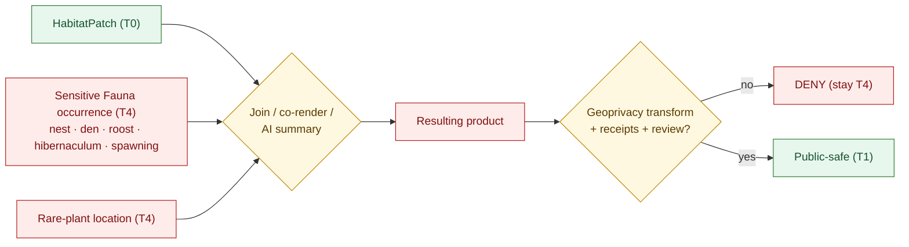
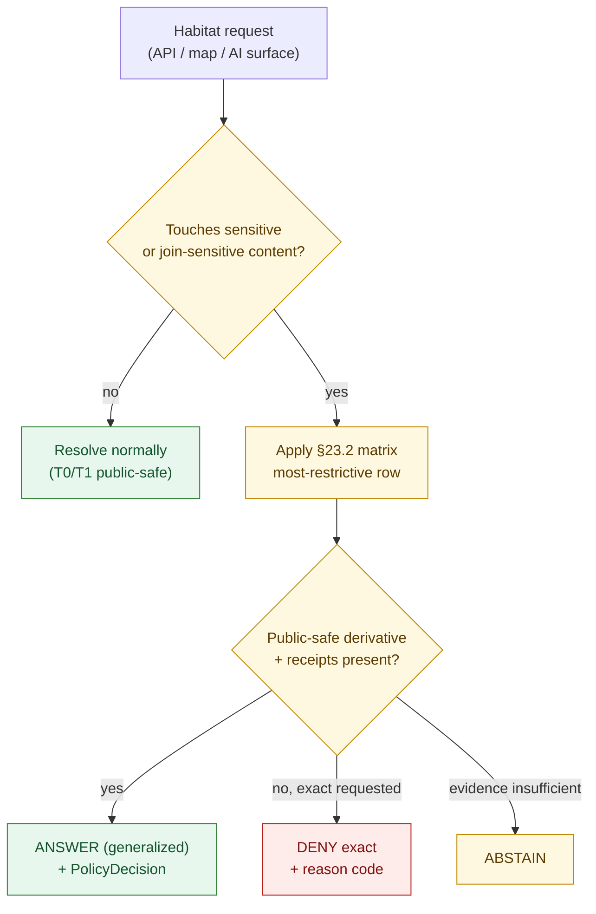

<!-- [KFM_META_BLOCK_V2]
doc_id: kfm://doc/habitat/sensitivity-profile
title: Habitat Domain — Sensitivity Profile
type: standard
status: draft
version: v1
owners: <TODO: domain-habitat-steward> + <TODO: sensitivity-steward>
created: 2026-06-05
updated: 2026-06-05
policy_label: public
related:
  - docs/domains/habitat/README.md
  - docs/domains/habitat/HABITAT_DOMAIN_MODEL.md
  - docs/domains/habitat/DATA_LIFECYCLE.md
  - docs/domains/habitat/FILE_SYSTEM_PLAN.md
  - docs/domains/habitat/MAP_UI_CONTRACTS.md
  - docs/domains/fauna/SENSITIVITY.md
  - docs/standards/sensitivity-rubric.md
  - docs/standards/redaction-profiles.md
  - ai-build-operating-contract.md
  - docs/doctrine/sensitivity.md
  - docs/doctrine/directory-rules.md
tags: [kfm, habitat, sensitivity, deny-by-default, geoprivacy, redaction, join-induced, fail-closed]
notes:
  - CONTRACT_VERSION = "3.0.0"
  - This profile PROFILES doctrine for the Habitat lane; disposition is OWNED by ai-build-operating-contract.md §23.2 and Atlas §24.5. This file does not re-derive it.
  - Deny-by-default is non-negotiable. Sensitivity is a property of the RESULTING product, not just the input.
  - Habitat owns no sensitive root truth; its dominant risk is JOIN-INDUCED sensitivity (one join from rare-species exposure).
  - All repo-path claims are PROPOSED; the schema-home slug is CONFLICTED (see §11).
[/KFM_META_BLOCK_V2] -->

# 🛡️ Habitat Domain — Sensitivity Profile

> How the Habitat lane stays public-safe: the tier scheme it inherits, the join-induced risk that defines it, the geoprivacy transforms it may apply, the receipts every transform must emit, and the surfaces where it must fail closed.

  <b>Deny-by-default · Fail-closed · Sensitivity-of-the-product · Cite-or-abstain · Reversible</b>

**Status:** draft · **Owners:** `<TODO: domain-habitat-steward>` + `<TODO: sensitivity-steward>` _(PROPOSED placeholders)_ · **Updated:** 2026-06-05 · `CONTRACT_VERSION = "3.0.0"`

> [!CAUTION]
> **This profile does not own disposition. It profiles it.** The authoritative sensitive-domain decision matrix is `ai-build-operating-contract.md` §23.2; the authoritative tier scheme is Atlas §24.5; the authoritative deny-by-default register is Atlas §20.5. Where this file and those authorities disagree, **they win** and the conflict is filed in `docs/registers/DRIFT_REGISTER.md`. Nothing here loosens a denial defined upstream.

---

## Contents

1. [Scope & the one rule that matters](#1-scope--the-one-rule-that-matters)
2. [Tier scheme (T0–T4)](#2-tier-scheme-t0t4)
3. [Habitat object default tiers](#3-habitat-object-default-tiers)
4. [Join-induced sensitivity — the core risk](#4-join-induced-sensitivity--the-core-risk)
5. [Geoprivacy transform vocabulary](#5-geoprivacy-transform-vocabulary)
6. [Required receipts](#6-required-receipts)
7. [Tier transitions](#7-tier-transitions)
8. [Disposition routing (§23.2)](#8-disposition-routing-232)
9. [Deny-by-default register (Habitat view)](#9-deny-by-default-register-habitat-view)
10. [Fail-closed surfaces](#10-fail-closed-surfaces)
11. [Where this binds to policy & schema](#11-where-this-binds-to-policy--schema)
12. [Anti-patterns](#12-anti-patterns)
13. [Open questions / verification / DoD](#open-questions-register)
14. [Related docs](#related-docs)

---

## 1. Scope & the one rule that matters

This document is the **sensitivity profile** for the Habitat lane. It states, per Habitat object family and per cross-lane join, the default sensitivity tier, the transforms that may carry an object to a public-safe tier, the receipts that must accompany every transform, and the surfaces where Habitat must fail closed.

**Habitat owns no sensitive root truth.** It does not own occurrence geometry (Fauna), rare-plant locations (Flora), archaeology sites, infrastructure detail, or living-person data. Its base objects — `HabitatPatch`, `LandCoverObservation`, `EcologicalSystem` — are public-safe (`T0`) on their own.

> [!IMPORTANT]
> **The one rule that matters: sensitivity is a property of the *resulting product*, not just the input.** A `T0` habitat patch joined to a sensitive Fauna occurrence (nest, den, roost, hibernaculum, spawning site) or a rare-plant record yields a **sensitive product**. Habitat is therefore *one join away* from rare-species exposure, and that join must **fail closed**. `[KFM-IDX-POL-003]` `[KFM-P25-PROG-0015]`

> [!NOTE]
> "Public observability" includes every rendered surface: map popups, downloadable tiles, Evidence Drawer payloads, and AI-generated summaries. The denial applies to the **surface**, not just the file on disk. `[DIRRULES §13.5]`

[↑ back to top](#top)

---

## 2. Tier scheme (T0–T4)

**CONFIRMED scheme** (Atlas §24.5.1). KFM publishes only the safest representation that still answers the reasonable need.

| Tier | Name | Definition | Default audience |
|---|---|---|---|
| **T0** | Open | Public-safe with no transformations required beyond standard release. | Any public client via the governed API. |
| **T1** | Generalized | Public-safe **only after** generalization, fuzzing, aggregation, or redaction; the transform is reviewed and recorded. | Any public client via the governed API. |
| **T2** | Reviewer | Released only to authenticated reviewers / domain stewards; policy-bounded; correction path active. | Stewards, reviewers, named collaborators. |
| **T3** | Restricted | Released only under named agreement (rights, sovereignty, consent), recorded. | Named authorized parties only. |
| **T4** | Denied | Not released to any audience; the *existence* of a record may be released only as steward review permits. | — |

> [!CAUTION]
> A tier is a **release posture**, not a data label you can overwrite by hand. Moving an object between tiers is a **governed transition** (§7) with required artifacts and a steward — never an attribute edit. `[ATLAS §24.5.1]`

[↑ back to top](#top)

---

## 3. Habitat object default tiers

Default tiers for the eleven Habitat object families, **before** any cross-lane join. These are the lane's own objects; join inheritance is §4.

| Object family | Default tier | Why | When it rises above T0 |
|---|---|---|---|
| `HabitatPatch` | **T0** | Derived from public land cover; carries no occurrence truth. | Inherits the join product's tier (§4). |
| `LandCoverObservation` | **T0** | Public inventory observation (e.g., NLCD). | Rarely; only if the source itself is restricted. |
| `EcologicalSystem` | **T0** | Public classification. | If sourced from a controlled provider (e.g., NatureServe rare records → see §4, `[KFM-P25-PROG-0023]`). |
| `HabitatQualityScore` | **T0** | Descriptive model value over a public patch. | If the score reveals a sensitive join. |
| `SuitabilityModel` | **T0** | Modeled surface; labeled `model`. | If the model is *trained on* or *resolves* sensitive occurrence locations. |
| `ConnectivityEdge` | **T0** | Derivative over the public patch graph. | If endpoints encode sensitive sites. |
| `Corridor` | **T1 where sensitive** | A corridor near a sensitive site can disclose it by inference. | Generalize precision; review. |
| `RestorationOpportunity` | **T1 candidate** | May reference partner / parcel detail; planning candidate. | Steward review for named-party / parcel precision. |
| `StewardshipZone` | **T1** | Stewardship context; named-party detail is gated. | Named agreement for restricted detail → T2/T3. |
| `ModelRunReceipt` | **T0** | Proof object; should not embed sensitive inputs in the clear. | If it would leak sensitive input geometry — redact. |
| `UncertaintySurface` | **T0** | Companion uncertainty; first-class, never erased. | If it would itself localize a sensitive feature. |

> [!WARNING]
> These defaults describe the object **in isolation**. They are **floors that rise under joins** (§4), never ceilings. No default in this table authorizes publishing a join product without re-evaluating the resulting tier.

[↑ back to top](#top)

---

## 4. Join-induced sensitivity — the core risk

The defining Habitat risk: a benign object becomes sensitive **by association**. Habitat is the lane most likely to launder sensitivity through a seemingly-public layer, because its joins are exactly what make it useful.

**Inheritance rule (PROPOSED realization of CONFIRMED doctrine).** The resulting product inherits the **most restrictive** tier of any input. A patch (`T0`) joined to a sensitive occurrence (`T4`) is **`T4` by default** and **fails closed** until a documented geoprivacy transform plus the required receipts (§6) and a `ReviewRecord` carry the *public-safe derivative* to `T1`. The exact-geometry product itself never becomes public. `[KFM-IDX-POL-003]` `[KFM-P24-IDEA-0002]` `[KFM-P25-PROG-0015]`

**Precision fail-closed.** A habitat assignment **fails closed** when spatial precision is below the policy threshold or a sensitivity label requires withholding — even when the inputs individually look public. `[KFM-P25-PROG-0015]`

**Controlled-source gate.** Where an `EcologicalSystem` or context layer draws on controlled rare-species data (e.g., NatureServe / Natural Heritage), access controls, license checks, redaction, and public-safe derivative rules apply before any publication. `[KFM-P25-PROG-0023]`

| Join | Most-restrictive input | Resulting default | Public-safe path |
|---|---|---|---|
| Habitat × sensitive Fauna occurrence | T4 | **T4** | Generalize + `RedactionReceipt` + `ReviewRecord` + `PolicyDecision` → T1 |
| Habitat × Fauna range polygon | T1 | **T1** | `AggregationReceipt` or `RedactionReceipt` → T1 |
| Habitat × rare/sensitive plant location | T4 | **T4** | Generalized geometry + steward review → T1 |
| Habitat × NatureServe rare ecological record | T4 (controlled) | **T4** | Access gate + license check + redaction → derivative T1 |
| Habitat × private parcel / named partner | T2–T4 | **T2+** | De-identify + generalize parcel; named agreement for detail |

[↑ back to top](#top)

---

## 5. Geoprivacy transform vocabulary

The transforms that may carry a sensitive join product to a public-safe tier. **Each emits a `RedactionReceipt`** (or `AggregationReceipt` for aggregation) and is recorded; none is applied silently. The choice and parameters are a steward decision, bounded by policy.

| Transform | What it does | Typical target |
|---|---|---|
| **Suppress** | Withhold the feature entirely from the public derivative. | T4 features with no safe generalization. |
| **Generalize to grid** | Snap geometry to a coarse cell so the precise point is unrecoverable. | Point occurrences, exact sites. |
| **Generalize to area** | Replace precise geometry with a watershed / county / management unit. | Range and corridor context. |
| **Aggregate / bin** | Report counts or presence over an aggregation unit, never per-feature. | Density, histograms. |
| **Buffer** | Replace exact location with a non-tight buffer (no centroid leakage). | Site protection where presence is public. |
| **Jitter (constrained)** | Randomized offset within bounds that defeats reverse-localization. | Where a coarse grid loses too much utility — **only** when reverse-localization is provably defeated. |
| **Delayed publication** | Embargo precise material until a sensitivity window closes. | Active nesting / spawning seasons. |
| **Steward-only exact access** | Keep exact geometry behind a T2/T3 surface; publish only a derivative. | Reviewer workflows. |

> [!CAUTION]
> A transform is valid **only if** the public derivative cannot be inverted to recover the protected feature — directly, by combining layers, by differencing time slices, or by AI inference. If inversion is possible, the correct outcome is **suppress** or **stay T4**, not a weaker transform. `[KFM-P25-PROG-0017]`

> [!NOTE]
> When an occurrence input is obscured / private / generalized, the conditional-schema rule requires a `public_safe_geometry` to be present on the derivative — the schema itself refuses an obscured record that lacks a public-safe geometry. `[KFM-P25-PROG-0017]`

[↑ back to top](#top)

---

## 6. Required receipts

Every transform and every tier transition leaves an auditable trail. These are **shared-kernel** receipts — Habitat references them, never redefines them.

| Receipt | Emitted when | Proves |
|---|---|---|
| `RedactionReceipt` | Any generalize / suppress / buffer / jitter transform crosses the publication boundary. | A specific transform was applied to specific geometry with stated parameters. |
| `AggregationReceipt` | Aggregation / binning produces the public derivative. | The aggregation unit and method; per-feature data was not exposed. |
| `ReviewRecord` | A steward authorizes a tier transition. | Who reviewed, what was decided, when. |
| `PolicyDecision` | The governed API resolves a request touching sensitive content. | `ALLOW` / `ABSTAIN` / `DENY` with reason code. |
| `EvidenceBundle` | The derivative is cataloged. | The evidence chain back to source, including the receipts above. |

> [!IMPORTANT]
> A public-safe Habitat join layer with **no** `RedactionReceipt` (or `AggregationReceipt`) in its evidence chain is, by definition, **not** public-safe. The release gate must reject it. `[ATLAS §20.5]` `[ATLAS §24.5.3]`

[↑ back to top](#top)

---

## 7. Tier transitions

**CONFIRMED** (Atlas §24.5.3). All transitions are **governed and reversible**. Downgrade to T4 via `CorrectionNotice` is **always** permitted.

| From → To | Required artifact | Reviewer | Reversibility |
|---|---|---|---|
| **T4 → T3** | `PolicyDecision` + `ReviewRecord` + agreement | Steward + rights-holder | Agreement revocation returns to T4 with `CorrectionNotice`. |
| **T4 → T2** | `PolicyDecision` + `ReviewRecord` | Steward | Review revocation returns to T4. |
| **T4 → T1** | `RedactionReceipt` + `ReviewRecord` (+ Promotion Gates A–G) | Steward | Redaction re-evaluable; correction may demote a published T1 to T4. |
| **T3 → T2** | `PolicyDecision` + `ReviewRecord` | Steward | Reversible. |
| **T2 → T1** | `RedactionReceipt` + `ReviewRecord` | Steward | Reversible. |
| **T1 → T0** | `ReleaseManifest` + `ReviewRecord` | Steward + release authority | Reversible via `RollbackCard`. |
| **any → T4** | `CorrectionNotice` | Steward | Always permitted; the safe direction. |

> [!NOTE]
> Promotion Gates A–G accompany the T4 → T1 motion. The **letter labels** are doctrinal-in-principle but the exact A–G assignment is **NEEDS VERIFICATION** against an accepted ADR. `[ATLAS §24.5.3]`

[↑ back to top](#top)

---

## 8. Disposition routing (§23.2)

The runtime decision for any Habitat request that touches sensitive or potentially-sensitive content routes through the `ai-build-operating-contract.md` **§23.2 sensitive-domain matrix**, applying the **most-restrictive applicable row**. This profile does **not** re-derive that matrix; it points at it.

**Most-restrictive-row outcomes** the matrix may return for Habitat content: **DENY exact** / **GENERALIZE** / **REDACT** / **QUARANTINE** / **steward review** / emit **RedactionReceipt** / **ABSTAIN**. The AI surface **never** reads RAW or WORK content; it reads only released `EvidenceBundle`s and emits an `AIReceipt`. `[GAI]` `[ATLAS §24.5.2]`

> [!CAUTION]
> Finite-outcome discipline holds here: the caller-facing surface returns `ANSWER / ABSTAIN / DENY / ERROR`; the **layer-manifest resolver returns `ANSWER / DENY / ERROR` only (no `ABSTAIN`)**. A sensitive request that cannot be satisfied safely is a `DENY`, not a degraded `ANSWER`. `[ATLAS §24.3.2]`

[↑ back to top](#top)

---

## 9. Deny-by-default register (Habitat view)

Habitat's slice of the deny-by-default register (Atlas §20.5), plus the neighbor rows it most often inherits through joins.

| Domain / surface | Denied by default | Allowed only when |
|---|---|---|
| **Habitat × Fauna** (inherited) | Exact sensitive occurrences; nests / dens / roosts / hibernacula / spawning sites | Geoprivacy + `RedactionReceipt` + public-safe derivative |
| **Habitat × Flora** (inherited) | Exact rare / protected / culturally sensitive plant locations | Review + generalized/withheld geometry + `RedactionReceipt` |
| **Habitat × controlled ecological data** | NatureServe / Natural Heritage rare records at precision | Access gate + license check + redaction + public-safe derivative |
| **Habitat × People/Land** (inherited) | Private person–parcel joins; named-partner detail | Consent + policy + restricted authorized surface |
| **Habitat as alert authority** | Any "this is safe / dangerous habitat now" emergency framing | **Never** — KFM is never an alert authority (`T4 forever`) |
| **Governed AI over Habitat** | RAW/WORK access; uncited claims; direct model→public traffic | Released `EvidenceBundle` + policy-safe context + `AIReceipt` |

> [!WARNING]
> The Hazards-style boundary applies to Habitat too: a habitat overlay must **never** be presented as an emergency, safety, or regulatory instruction. That boundary is `T4 forever` and no transform crosses it. `[DOM-HAZ]` `[ATLAS §24.5.2]`

[↑ back to top](#top)

---

## 10. Fail-closed surfaces

Every surface that can expose Habitat content must fail closed when sensitivity is unresolved.

- **Governed API.** No public client reads `data/processed/`, `data/catalog/`, or `data/published/` directly. The trust membrane is `apps/governed-api/`; canonical stores are never a public read path. `[DIRRULES §13.5]`
- **Map / MapLibre.** A habitat layer whose evidence chain lacks the required receipts is not renderable on a public surface. The layer manifest resolver returns `DENY` (not `ABSTAIN`) for an unsatisfiable sensitive layer.
- **Evidence Drawer.** Withheld precision is shown *as withheld* (a stated redaction), never silently omitted, so the user can see that something was protected rather than assuming it was absent.
- **Focus Mode / AI.** Insufficient evidence → `ABSTAIN`; sensitive request → `DENY`; never a plausible substitute. The AI reads only released bundles. `[GAI]`
- **Watchers / connectors.** Emit candidates to `data/raw/` or `data/quarantine/` with `publication_state: WORK_CANDIDATE`; they **never** write `data/published/`. Watcher-as-non-publisher. `[DIRRULES §13.5]`

[↑ back to top](#top)

---

## 11. Where this binds to policy & schema

This profile is doctrine-in-prose. Its **enforceable** counterparts:

| Layer | Home (PROPOSED) | Owns |
|---|---|---|
| **Lane sensitivity policy** | `policy/sensitivity/habitat/` | Habitat-only sensitivity rules. |
| **Join sensitivity policy** | `policy/sensitivity/` or `policy/joins/habitat-fauna/` *(no single-domain segment)* | Cross-lane join rules (Habitat × Fauna / Flora). |
| **Conditional schema** | `schemas/contracts/v1/domains/habitat/…` *(slug CONFLICTED)* | `public_safe_geometry`-required-when-obscured rule. `[KFM-P25-PROG-0017]` |
| **Proof** | `tests/domains/habitat/`, `fixtures/domains/habitat/` | Negative-path fixtures: deny-exact, allow-generalized. |

> [!WARNING]
> **Schema-home slug is `CONFLICTED` and ADR-required.** (1) Is `schemas/contracts/v1/…` confirmed as the canonical home? — **ADR-S-01** ("confirm by ADR-0001 **or amend**"; App. G VB-11-01 `NEEDS VERIFICATION`). (2) Segmented `…/domains/habitat/` (DIRRULES §12) vs flat `…/habitat/` (Atlas §24.13). CONFIRMED regardless: `.schema.json` never under `contracts/`. File the drift; do not create both slugs. `[DIRRULES §6.4]` `[ATLAS §24.12 ADR-S-01]` `[§24.13]`

> [!NOTE]
> Cross-lane join policy and any cross-lane sensitivity *doctrine* live under non-domain responsibility roots (`policy/joins/…`, `docs/architecture/…`), never under a `policy/domains/habitat-fauna/` or `docs/domains/habitat-fauna/` combined-lane folder. `[DIRRULES §12]`

[↑ back to top](#top)

---

## 12. Anti-patterns

| Anti-pattern | Why it's dangerous | Fix |
|---|---|---|
| Publishing a join layer with no `RedactionReceipt` | Launders sensitivity through a "public" habitat surface. | Release gate rejects; require the receipt chain (§6). |
| Treating object defaults (§3) as ceilings | A `T0` patch joined to a `T4` occurrence is `T4`, not `T0`. | Re-evaluate the **product** tier on every join (§4). |
| Invertible "generalization" | A coarse layer that can be differenced back to the point. | Suppress or stay T4 unless inversion is provably defeated (§5). |
| Silent omission of withheld precision | User assumes absence rather than protection; erodes trust. | Show redaction *as* redaction in the Evidence Drawer (§10). |
| Re-deriving §23.2 disposition locally | Drift from the canonical matrix; inconsistent denials. | Route through §23.2; never reimplement the matrix (§8). |
| Erasing the `UncertaintySurface` to "clean up" a layer | Destroys first-class evidence; misrepresents confidence. | Co-release uncertainty; never drop it. |
| Habitat overlay as emergency/regulatory instruction | Crosses the `T4 forever` alert-authority boundary. | Never frame habitat as an alert; context only (§9). |

[↑ back to top](#top)

---

## Open questions register

| ID | Question | Owner role | Resolution path |
|---|---|---|---|
| OQ-HAB-SEN-01 | Join-inheritance realization: exact field/threshold for "most-restrictive input" tier inheritance. | Sensitivity steward | `policy/sensitivity/` + fixtures |
| OQ-HAB-SEN-02 | Precision threshold for fail-closed habitat assignment (`KFM-P25-PROG-0015`). | Domain + sensitivity stewards | policy constant + ADR |
| OQ-HAB-SEN-03 | Allowed transform set and parameters per object family (which transforms are valid for corridors vs. patches). | Sensitivity steward | `docs/standards/redaction-profiles.md` |
| OQ-HAB-SEN-04 | Schema-home slug (segmented vs flat) and ADR-0001 status (ADR-S-01). | Schema + docs stewards | ADR-S-01 + DRIFT_REGISTER |
| OQ-HAB-SEN-05 | Promotion Gates A–G exact letter assignment for the T4→T1 motion. | Release steward | ADR |
| OQ-HAB-SEN-06 | Where the join sensitivity policy canonically lives (`policy/sensitivity/` vs `policy/joins/habitat-fauna/`). | Sensitivity steward | ADR |

## Open verification backlog

Before promotion from `draft` to `published`:

1. Confirm the per-object default tiers in §3 against `policy/sensitivity/habitat/`.
2. Confirm the join-inheritance rule (§4) is enforced by a negative-path fixture (deny-exact, allow-generalized).
3. Confirm the conditional-schema rule (`public_safe_geometry` required when obscured) exists in the Habitat schema. `[KFM-P25-PROG-0017]`
4. Confirm the receipt chain (§6) is required at the release gate.
5. Confirm the layer-manifest resolver returns `DENY` (not `ABSTAIN`) for an unsatisfiable sensitive layer.
6. Confirm this file is linked from the Habitat README and the Fauna sensitivity doc.

## Changelog v0 → v1

| Change | Type | Reason |
|---|---|---|
| Initial Habitat sensitivity profile | new | Establish the lane's public-safe / deny-by-default rules |

> **Backward compatibility.** New file; no prior anchors. The `#top` target is present; all in-doc links resolve.

## Definition of done

- placed per Directory Rules and linked from the Habitat README;
- reviewed by the domain steward **and** a sensitivity steward;
- every transform in §5 maps to a redaction profile and emits a receipt (§6);
- no conflict with `ai-build-operating-contract.md` §23.2 or Atlas §24.5 / §20.5;
- schema-slug conflict (OQ-HAB-SEN-04) logged in `docs/registers/DRIFT_REGISTER.md`;
- negative-path fixtures exist (deny-exact, allow-generalized) and pass.

---

## Related docs

- `docs/domains/habitat/README.md` — lane index *(PROPOSED)*
- `docs/domains/habitat/HABITAT_DOMAIN_MODEL.md` — object families & ubiquitous language *(PROPOSED)*
- `docs/domains/habitat/DATA_LIFECYCLE.md` — how objects move RAW→PUBLISHED *(PROPOSED)*
- `docs/domains/habitat/FILE_SYSTEM_PLAN.md` — where these objects live *(PROPOSED)*
- `docs/domains/habitat/MAP_UI_CONTRACTS.md` — drawer / redacted-view contracts *(PROPOSED)*
- `docs/domains/fauna/SENSITIVITY.md` — Fauna sensitivity (root owner of occurrence) *(PROPOSED)*
- `docs/standards/sensitivity-rubric.md` — the tier rubric *(PROPOSED)*
- `docs/standards/redaction-profiles.md` — transform parameters *(PROPOSED)*
- `ai-build-operating-contract.md` — **§23.2 sensitive-domain matrix (authority)** · `CONTRACT_VERSION = "3.0.0"`
- `docs/doctrine/sensitivity.md` — sensitivity doctrine *(referenced)*
- `docs/doctrine/directory-rules.md` — §6.4, §9, §12, §13.5
- Atlas §24.5 (tier scheme / matrix / transitions), §20.5 (deny-by-default register) — **authority**
- Idea cards: `KFM-P24-IDEA-0002`, `KFM-P25-PROG-0015`, `KFM-P25-PROG-0017`, `KFM-P25-PROG-0023`, `KFM-IDX-POL-003`
- `docs/registers/DRIFT_REGISTER.md` — schema-slug `CONFLICTED` entry *(PROPOSED)*

_Last updated: 2026-06-05 · `CONTRACT_VERSION = "3.0.0"`_

[↑ back to top](#top)
