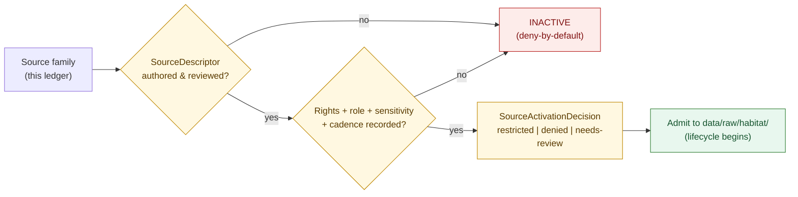

<!-- [KFM_META_BLOCK_V2]
doc_id: kfm://doc/habitat/source-ledger
title: Habitat Domain — Source Ledger
type: standard
status: draft
version: v1
owners: <TODO: domain-habitat-steward> + <TODO: source-steward>
created: 2026-06-05
updated: 2026-06-05
policy_label: public
related:
  - docs/domains/habitat/README.md
  - docs/domains/habitat/HABITAT_DOMAIN_MODEL.md
  - docs/domains/habitat/HABITAT_SENSITIVITY_PROFILE.md
  - docs/domains/habitat/DATA_LIFECYCLE.md
  - docs/domains/habitat/FILE_SYSTEM_PLAN.md
  - data/registry/sources/habitat/
  - docs/sources/catalog/
  - docs/standards/PROVENANCE.md
  - ai-build-operating-contract.md
  - docs/doctrine/directory-rules.md
tags: [kfm, habitat, sources, source-ledger, source-role, admission, rights, sensitivity]
notes:
  - CONTRACT_VERSION = "3.0.0"
  - This ledger INDEXES source families and their posture; the authoritative SourceDescriptor records live under data/registry/sources/habitat/.
  - Deny-by-default: a source is INACTIVE until a reviewed SourceDescriptor + SourceActivationDecision exist.
  - All per-source RIGHTS / TERMS / CADENCE cells are NEEDS VERIFICATION until a source-currentness review closes them.
  - All repo-path claims are PROPOSED; the schema-home slug is CONFLICTED (see §8).
[/KFM_META_BLOCK_V2] -->

# 📒 Habitat Domain — Source Ledger

> The authoritative inventory of source families the Habitat lane may admit: per family, the source role, default sensitivity tier, rights state, refresh cadence, and activation decision. A source is inactive until a reviewed descriptor says otherwise.

  <b>Deny-by-default admission · Source-role is declared, never inferred · Rights before activation</b>

**Status:** draft · **Owners:** `<TODO: domain-habitat-steward>` + `<TODO: source-steward>` _(PROPOSED placeholders)_ · **Updated:** 2026-06-05 · `CONTRACT_VERSION = "3.0.0"`

> [!IMPORTANT]
> This ledger is a **human-facing index**. The **authoritative** record for each source is its `SourceDescriptor` under `data/registry/sources/habitat/` (PROPOSED home). Where this ledger and a descriptor disagree, **the descriptor wins** and the drift is filed in `docs/registers/DRIFT_REGISTER.md`. This file does not activate any source.

---

## Contents

1. [Purpose & admission rule](#1-purpose--admission-rule)
2. [Source roles & how to read this ledger](#2-source-roles--how-to-read-this-ledger)
3. [Admission flow](#3-admission-flow)
4. [Source family ledger](#4-source-family-ledger)
5. [Per-source notes](#5-per-source-notes)
6. [Sensitivity & rights posture](#6-sensitivity--rights-posture)
7. [What Habitat does NOT admit as its own truth](#7-what-habitat-does-not-admit-as-its-own-truth)
8. [Where this binds to descriptors & schema](#8-where-this-binds-to-descriptors--schema)
9. [Open questions / verification / DoD](#open-questions-register)
10. [Related docs](#related-docs)

---

## 1. Purpose & admission rule

This document inventories the **source families** the Habitat lane may draw on, and fixes each family's **source role**, **default sensitivity tier**, **rights state**, **refresh cadence**, and **activation decision**.

> [!CAUTION]
> **Deny-by-default admission.** A Habitat source begins **inactive**. It may be admitted only after **all** of the following exist and are reviewed: a `SourceDescriptor` (role, rights, sensitivity, cadence, steward, attribution, public-release class), and a recorded `SourceActivationDecision`. No source in this ledger is set to `allowed` by this document. `[IMPL-PIPE §13]` `[BLD-COMP §8]`

> [!WARNING]
> **Source role is declared, reviewed, and recorded — never inferred** from a filename, URL, or "what other projects do." Mislabeling a regulatory designation as a model, or a model as an observation, is a source-role-collapse defect. `[ATLAS §24.1]` `[DOM-HAB §C]`

[↑ back to top](#top)

---

## 2. Source roles & how to read this ledger

| Role | Meaning | Hard rule |
|---|---|---|
| `observed` | A direct observation/inventory (e.g., NLCD land cover). | Never relabeled as model or authority. |
| `regulatory` / `authority` | A regulatory or authoritative designation (e.g., USFWS critical habitat, NWI). | Habitat records the role, **not** the rule; never silently re-modeled. |
| `model` | A modeled surface/class (e.g., some GAP/LANDFIRE products). | Labeled **model**; never promoted to authority. |
| `context` | Consumed from a neighbor lane or partner as governed context (e.g., PAD-US stewardship). | Ownership stays with the source. |
| `occurrence-context` | Foreign-owned occurrence aggregators read as join context (GBIF/iNaturalist/iDigBio). | **Habitat does not own occurrence truth**; geoprivacy applies. |

**Status vocabulary in the ledger:**

| Label | Meaning |
|---|---|
| **CONFIRMED** | The source *family* and its role are fixed in Habitat doctrine. |
| **PROPOSED** | Path, descriptor name, or activation shape consistent with doctrine, not repo-verified. |
| **NEEDS VERIFICATION** | Checkable but unchecked here — rights, terms, cadence, endpoints (no live source-terms review in scope). |

> [!NOTE]
> Every **rights / terms / cadence** cell below is **NEEDS VERIFICATION**. This ledger asserts the *role* and *posture* a family must carry; it does **not** assert current license terms, which require a source-currentness review per source. `[DOM-HAB §D]`

[↑ back to top](#top)

---

## 3. Admission flow

> [!NOTE]
> Admission emits to `data/raw/habitat/`; it does **not** publish. The lifecycle (`RAW → WORK/QUARANTINE → PROCESSED → CATALOG/TRIPLET → PUBLISHED`) governs everything after admission. Watchers/connectors emit candidates with `publication_state: WORK_CANDIDATE` and never write `data/published/`. `[DIRRULES §9, §13.5]`

[↑ back to top](#top)

---

## 4. Source family ledger

Source families the Habitat lane may admit. **Role** is CONFIRMED doctrine; **rights / cadence** are NEEDS VERIFICATION; **activation** is deny-by-default until a descriptor + decision exist.

| Source family | Role | Default tier | Rights state | Cadence | Activation | Descriptor (PROPOSED) |
|---|---|:--:|---|---|:--:|---|
| **NLCD** (land cover) | `observed` | T0 | NEEDS VERIFICATION | NEEDS VERIFICATION (multi-year vintages) | INACTIVE | `nlcd.source.yaml` |
| **NWI** (wetlands) | `regulatory` / `observed` | T0–T1 | NEEDS VERIFICATION | NEEDS VERIFICATION | INACTIVE | `nwi.source.yaml` |
| **GAP / LANDFIRE** | `observed` / `model` | T0 | NEEDS VERIFICATION | NEEDS VERIFICATION | INACTIVE | `gap-landfire.source.yaml` |
| **USFWS ECOS / critical habitat** | `regulatory` / `authority` | T0 (designation); joins sensitive | NEEDS VERIFICATION | NEEDS VERIFICATION | INACTIVE | `usfws-critical-habitat.source.yaml` |
| **NatureServe / ecological systems** | `authority` / `observed` (controlled) | T0 public class; **T4 rare records** | **NEEDS VERIFICATION — controlled** | NEEDS VERIFICATION | INACTIVE | `natureserve.source.yaml` |
| **KDWP** (state review context) | `authority` / `context` | T1–T2 | NEEDS VERIFICATION | NEEDS VERIFICATION | INACTIVE | `kdwp.source.yaml` |
| **PAD-US** (stewardship) | `context` | T0–T1 | NEEDS VERIFICATION | NEEDS VERIFICATION | INACTIVE | `pad-us.source.yaml` |
| **GBIF / iNaturalist / iDigBio** (occurrence inputs) | `occurrence-context` (foreign-owned) | **T1–T4** (sensitive taxa) | NEEDS VERIFICATION | NEEDS VERIFICATION | INACTIVE | `occurrence-aggregators.source.yaml` |
| **Remote-sensing vegetation indices** | `observed` / `context` | T0 | NEEDS VERIFICATION | NEEDS VERIFICATION | INACTIVE | `rs-vegetation.source.yaml` |
| **Field surveys / steward-reviewed models** | `observed` / `model` | varies; reviewed | NEEDS VERIFICATION | NEEDS VERIFICATION | INACTIVE | `field-survey.source.yaml` |

> [!CAUTION]
> The **default tier** column is the source's own posture. Under a **join** to sensitive Fauna/Flora occurrence, the *resulting product* inherits the most-restrictive tier and **fails closed** — see `HABITAT_SENSITIVITY_PROFILE.md` §4. A `T0` NLCD patch is not `T0` once joined to a `T4` occurrence.

[↑ back to top](#top)

---

## 5. Per-source notes

<b>Expand per-source admission notes</b>

- **NLCD.** Thematic land cover; an **observation**, never a model. Vintage and class-system version are required descriptor fields. The canonical first-slice input (`HABITAT_DOMAIN_MODEL.md`, thin slice). Rights NEEDS VERIFICATION.
- **NWI.** National Wetlands Inventory; carries an authority/observation character depending on product. Source terms NEEDS VERIFICATION.
- **GAP / LANDFIRE.** Mixed observation/model products; **the role per product must be declared** so a modeled layer is never served as observed. `[ATLAS §24.1]`
- **USFWS ECOS / critical habitat.** Source role is **`regulatory` / `authority`**, never `model`. Habitat records that a designation exists; it does not assert the regulatory rule itself. Joins to listed species are sensitive. `[DOM-HAB §C, §D]`
- **NatureServe / ecological systems.** Public ecological-system classes are usable; **rare-species / Natural Heritage records are controlled** and require access controls, license checks, redaction, and public-safe derivative rules before any publication — `T4` default for rare records. `[KFM-P25-PROG-0023]`
- **KDWP.** State wildlife/parks review context; sensitivity medium–high; treat as authority/context, not as occurrence truth.
- **PAD-US.** Protected-areas / stewardship context (feeds `StewardshipZone`); `context` role, not authority.
- **GBIF / iNaturalist / iDigBio.** **Foreign-owned occurrence aggregators**, read by Habitat as **join context only** — Habitat never owns occurrence truth (that is Fauna's). Sensitive-taxon geoprivacy applies; the conditional-schema rule requires `public_safe_geometry` when geoprivacy status is obscured/private/generalized. `[KFM-P25-PROG-0017]` `[DOM-FAUNA]`
- **Remote-sensing vegetation indices.** Observation/context; low sensitivity; vintage matters.
- **Field surveys / steward-reviewed models.** Reviewed inputs; role (`observed` vs `model`) declared per dataset; sensitivity varies.

[↑ back to top](#top)

---

## 6. Sensitivity & rights posture

- **Rights gate before activation.** Unclear rights, unresolved source role, or absent sensitivity class **blocks activation** — the source stays INACTIVE. `[ENCY]` `[DIRRULES]`
- **Controlled sources fail closed.** NatureServe rare records, and any occurrence aggregator feeding sensitive taxa, default to the restricted end and require redaction + public-safe derivative rules before any publication. `[KFM-P25-PROG-0023]` `[KFM-P24-IDEA-0002]`
- **Disposition routing.** Any admitted source that can contribute to a sensitive product routes its publication decision through the `ai-build-operating-contract.md` **§23.2 sensitive-domain matrix** (most-restrictive applicable row). This ledger states posture; it does not re-derive disposition.
- **Attribution & license terms** are descriptor obligations and travel with every published derivative; they are NEEDS VERIFICATION here and settle in the descriptor + `docs/sources/catalog/` entry.

> [!WARNING]
> Admitting a source is **not** a license to publish from it. Admission begins the lifecycle; publication requires the full promotion gate set, a `ReleaseManifest`, a correction path, and a rollback target. `[DOM-HAB §M]`

[↑ back to top](#top)

---

## 7. What Habitat does NOT admit as its own truth

| Material | Owner | Habitat's relationship |
|---|---|---|
| Species occurrence truth, taxonomy, sensitive occurrence geometry | **Fauna** | Join context only via `occurrence-context`; never stored as habitat truth. |
| Plant taxa, specimens, rare-plant records | **Flora** | Join context only. |
| Hydrologic units, gauges, water conditions | **Hydrology** | Governed context. |
| Soil map units, components, horizons | **Soil** | Governed context. |
| Hazard events, alert authority | **Hazards** | Context only; KFM is **never** an alert authority (`T4 forever`). |
| Living-person data, DNA | **People/DNA/Land** | Never admitted as habitat truth. |
| Shared kernel objects (`EvidenceBundle`, `SourceDescriptor`, …) | **Shared kernel** | Consumed, never redefined per-lane. |

> [!NOTE]
> A source that *looks* like it belongs to a neighbor lane (e.g., an occurrence feed) is admitted, if at all, as **context with the neighbor's ownership and source role preserved** — never absorbed as Habitat truth. `[DOM-HAB §F]` `[DIRRULES §12]`

[↑ back to top](#top)

---

## 8. Where this binds to descriptors & schema

| Layer | Home (PROPOSED) | Owns |
|---|---|---|
| **Authoritative descriptor** | `data/registry/sources/habitat/<source>.source.yaml` | Per-source role, rights, sensitivity, cadence, activation. |
| **Descriptor shape** | `schemas/contracts/v1/…/source-descriptor.schema.json` *(slug CONFLICTED)* | Machine validation of descriptors. |
| **Admission policy** | `policy/intake/`, `policy/domains/habitat/` | Source-role admission rules. |
| **Public source catalog** | `docs/sources/catalog/<source>.md` | Human-facing per-source provenance / attribution. |

> [!WARNING]
> **Schema-home slug is `CONFLICTED` and ADR-required.** (1) Is `schemas/contracts/v1/…` confirmed as the canonical home? — **ADR-S-01** ("confirm by ADR-0001 **or amend**"; App. G VB-11-01 `NEEDS VERIFICATION`). (2) Segmented `…/domains/habitat/` (DIRRULES §12) vs flat `…/habitat/` (Atlas §24.13). CONFIRMED regardless: `.schema.json` never under `contracts/`; the `SourceDescriptor` schema is a **shared-kernel** schema and lives under a non-domain root (e.g., `schemas/contracts/v1/sources/`), not a Habitat segment. File the drift; do not create both slugs. `[DIRRULES §6.4]` `[ATLAS §24.12 ADR-S-01]` `[§24.13]`

[↑ back to top](#top)

---

## Open questions register

| ID | Question | Owner role | Resolution path |
|---|---|---|---|
| OQ-HAB-SRC-01 | Per-source rights / license / attribution terms for every family in §4. | Source steward | source-currentness review + descriptor + `docs/sources/catalog/` |
| OQ-HAB-SRC-02 | Refresh cadence + freshness budget per source. | Source steward | descriptor `cadence` field |
| OQ-HAB-SRC-03 | NatureServe controlled-access gate terms (license, access controls). `[KFM-P25-PROG-0023]` | Source + sensitivity stewards | agreement + descriptor |
| OQ-HAB-SRC-04 | Whether occurrence aggregators get one combined descriptor or one per provider. | Source steward | descriptor convention |
| OQ-HAB-SRC-05 | Per-product role declaration for GAP/LANDFIRE (observed vs model). | Domain steward | per-product descriptor |
| OQ-HAB-SRC-06 | Schema-home slug + ADR-0001 status (ADR-S-01); `SourceDescriptor` shared-kernel home. | Schema + docs stewards | ADR-S-01 + DRIFT_REGISTER |
| OQ-HAB-SRC-07 | Whether this ledger's filename (`HABITAT_SOURCE_LEDGER.md`) vs `SOURCE_REGISTRY.md` / `SOURCES.md` is the canonical name. | Docs steward | convention lock |

## Open verification backlog

Before promotion from `draft` to `published`:

1. Confirm `data/registry/sources/habitat/` exists and which descriptors are present.
2. Close per-source rights / cadence (OQ-HAB-SRC-01, -02) against a source-currentness review.
3. Confirm the NatureServe access gate (OQ-HAB-SRC-03) and that rare records default T4.
4. Confirm no source is `allowed` without a reviewed `SourceActivationDecision`.
5. Confirm the `SourceDescriptor` schema home (shared-kernel, OQ-HAB-SRC-06) and that no `.schema.json` lives under `contracts/`.
6. Confirm this file is linked from the Habitat README and reconciled with `docs/sources/catalog/`.

## Changelog v0 → v1

| Change | Type | Reason |
|---|---|---|
| Initial Habitat source ledger | new | Inventory admissible source families, roles, sensitivity, activation posture |

> **Backward compatibility.** New file; no prior anchors. The `#top` target is present; all in-doc links resolve.

## Definition of done

- placed per Directory Rules and linked from the Habitat README;
- reviewed by the domain steward **and** a source steward;
- every family in §4 maps to a `SourceDescriptor` and a `SourceActivationDecision`;
- rights / cadence closed or explicitly carried as NEEDS VERIFICATION;
- no source set to `allowed` without a recorded decision;
- schema-slug conflict (OQ-HAB-SRC-06) logged in `docs/registers/DRIFT_REGISTER.md`.

---

## Related docs

- `docs/domains/habitat/README.md` — lane index *(PROPOSED)*
- `docs/domains/habitat/HABITAT_DOMAIN_MODEL.md` — object families & ubiquitous language *(PROPOSED)*
- `docs/domains/habitat/HABITAT_SENSITIVITY_PROFILE.md` — tiers, join-induced risk, transforms *(PROPOSED)*
- `docs/domains/habitat/DATA_LIFECYCLE.md` — what happens after admission *(PROPOSED)*
- `docs/domains/habitat/FILE_SYSTEM_PLAN.md` — where descriptors and data live *(PROPOSED)*
- `data/registry/sources/habitat/` — **authoritative** `SourceDescriptor` records *(PROPOSED home)*
- `docs/sources/catalog/` — public per-source provenance / attribution entries
- `docs/standards/PROVENANCE.md` — provenance profile (`PROV.md` vs `PROVENANCE.md` is an open drift item, OPEN-DR-01)
- `ai-build-operating-contract.md` — §23.2 sensitive-domain matrix *(`CONTRACT_VERSION = "3.0.0"`)*
- `docs/doctrine/directory-rules.md` — §6.4, §9, §12, §13.5
- Idea cards: `KFM-P24-IDEA-0002` (sensitive-species deny-by-default), `KFM-P25-PROG-0017` (occurrence geoprivacy conditional schema), `KFM-P25-PROG-0023` (NatureServe rare-data gate)
- `docs/registers/DRIFT_REGISTER.md` — schema-slug `CONFLICTED` entry *(PROPOSED)*

_Last updated: 2026-06-05 · `CONTRACT_VERSION = "3.0.0"`_

[↑ back to top](#top)
