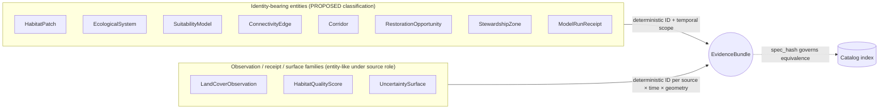
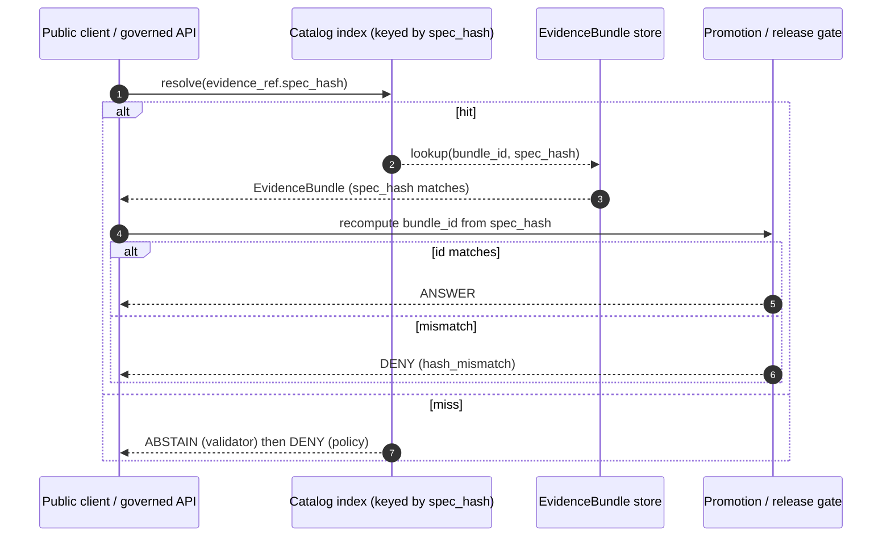
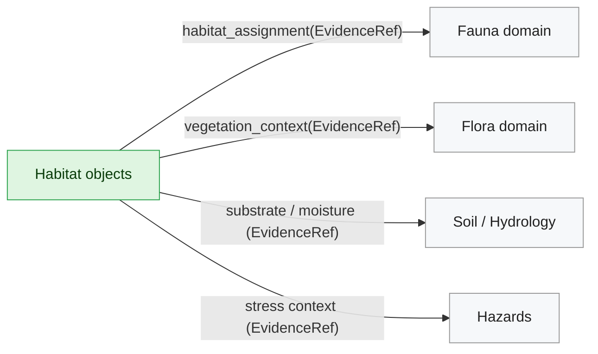

<!-- [KFM_META_BLOCK_V2]
doc_id: kfm://doc/habitat-identity-model
title: Habitat — Identity Model
type: standard
version: v1
status: draft
owners: TODO-habitat-domain-stewards
created: 2026-05-17
updated: 2026-06-05
policy_label: public
related:
  - docs/domains/habitat/README.md
  - docs/domains/habitat/HABITAT_DOMAIN_MODEL.md
  - docs/domains/habitat/HABITAT_SOURCE_LEDGER.md
  - docs/domains/habitat/HABITAT_SENSITIVITY_PROFILE.md
  - docs/domains/habitat/DATA_LIFECYCLE.md
  - docs/domains/fauna/IDENTITY_MODEL.md
  - docs/standards/PROVENANCE.md
  - docs/architecture/contract-schema-policy-split.md
  - schemas/contracts/v1/domains/habitat/
  - ai-build-operating-contract.md
tags: [kfm, habitat, identity, evidence, ddd, spec_hash]
notes:
  - 'CONTRACT_VERSION = "3.0.0"'
  - "owners is a placeholder; confirm via control_plane/object_family_register.yaml"
  - "All habitat-object identity rules are PROPOSED until verified against a mounted repo."
  - "CONFLICTED schema-home: ADR-0001 is OPEN per Atlas ADR-S-01 (confirm-or-amend; VB-11-01 NEEDS VERIFICATION); segmented schemas/contracts/v1/domains/habitat/ (DIRRULES §12) vs flat schemas/contracts/v1/habitat/ (Atlas §24.13) unresolved. See §2, §12."
[/KFM_META_BLOCK_V2] -->


# 🧬 Habitat — Identity Model

How the Habitat domain answers *“is this the same thing?”* — deterministically, evidentially, and across releases.


> **Status:** draft · **Owners:** `<habitat-domain-stewards>` *(placeholder)* · **Last updated:** 2026-06-05 · `CONTRACT_VERSION = "3.0.0"`

---

## 📑 Contents

- [1. Purpose & scope](#1-purpose--scope)
- [2. Doctrinal anchors](#2-doctrinal-anchors)
- [3. Identity philosophy: entity vs value object](#3-identity-philosophy-entity-vs-value-object)
- [4. The Habitat identity formula](#4-the-habitat-identity-formula)
- [5. `spec_hash`, `bundle_id`, `evidence_ref_id`](#5-spec_hash-bundle_id-evidence_ref_id)
- [6. Per-object identity table](#6-per-object-identity-table)
- [7. Temporal handling](#7-temporal-handling)
- [8. Sensitivity, geoprivacy, and identity exposure](#8-sensitivity-geoprivacy-and-identity-exposure)
- [9. Cross-lane identity coordination](#9-cross-lane-identity-coordination)
- [10. Validators, tests, and gate behavior](#10-validators-tests-and-gate-behavior)
- [11. Identity changes, renames, and migration](#11-identity-changes-renames-and-migration)
- [12. Open questions & verification backlog](#12-open-questions--verification-backlog)
- [13. Related docs](#13-related-docs)
- [Appendix A — Worked example: a `HabitatPatch` identity](#appendix-a--worked-example-a-habitatpatch-identity)
- [Appendix B — Truth labels used in this doc](#appendix-b--truth-labels-used-in-this-doc)

---

## 1. Purpose & scope

This document defines **what it means to be the same Habitat object** across releases, sources, and runs. It is the canonical identity contract for the Habitat domain — covering how identity is computed, how `EvidenceRef` resolves to `EvidenceBundle`, how temporal scope is kept distinct, and how identity interacts with sensitivity and publication gates.

**In scope.** Identity rules for every Habitat object family (CONFIRMED list: HabitatPatch, LandCoverObservation, EcologicalSystem, HabitatQualityScore, SuitabilityModel, ConnectivityEdge, Corridor, RestorationOpportunity, StewardshipZone, ModelRunReceipt, UncertaintySurface). The `spec_hash` construction. Bundle and reference ID derivation. Temporal scope. Identity-side behavior at promotion and rollback. Cross-lane identity coordination with Fauna, Flora, Soil/Hydrology, and Hazards.

**Out of scope.** Source-descriptor specifics (see [`HABITAT_SOURCE_LEDGER.md`](./HABITAT_SOURCE_LEDGER.md), PROPOSED). Pipeline mechanics (see [`DATA_LIFECYCLE.md`](./DATA_LIFECYCLE.md), PROPOSED). Sensitivity transform rules (see [`HABITAT_SENSITIVITY_PROFILE.md`](./HABITAT_SENSITIVITY_PROFILE.md), PROPOSED). MapLibre layer rendering. Schema *shape* — defined under the Habitat schema home, whose slug is **`CONFLICTED`** (see [§2](#2-doctrinal-anchors)).

> [!NOTE]
> This file is doctrine-first. Every implementation-level claim — schema paths, validator names, ID prefixes, gate code — is **PROPOSED** until verified against a mounted repo. See [§12](#12-open-questions--verification-backlog).

[⬆ Back to top](#-habitat--identity-model)

---

## 2. Doctrinal anchors

| Anchor | Source | Status |
|---|---|---|
| Domain ownership, scope, and non-ownership | `[DOM-HAB]` · `[DOM-HF]` · `[ENCY]` (Domains Culmination Atlas §6; Encyclopedia §7.4) | **CONFIRMED doctrine** |
| Object-family identity rule: *source id + object role + temporal scope + normalized digest* | `[DOM-HAB]` · `[ENCY]` (Habitat §E "Main object families") | **CONFIRMED doctrine** / **PROPOSED implementation** |
| Temporal-time separation: source / observed / valid / retrieval / release / correction | `[ENCY]` · `[DOM-HAB]` | **CONFIRMED doctrine** |
| `spec_hash` via RFC 8785 JCS + SHA-256 | New Ideas 5-8-26 (D1); Pass 10 C1-02; Pass 20 P2 EVD | **CONFIRMED doctrine** / **PROPOSED implementation** |
| Bundle/EvidenceRef derived IDs (`eb-…`, `er-…`) | New Ideas 5-8-26 (D2) | **CONFIRMED doctrine** / **PROPOSED implementation** |
| BLAKE3 considered for streaming artifact roots (tiles, large rasters) | New Ideas 5-10-26; Pass 20 P2 EVD | **CONFIRMED doctrine** / **PROPOSED implementation** |
| DDD entity-vs-value-object distinction | *Domain-Driven Design Reference* (corpus) | **CONFIRMED reference** |
| Habitat publication gates: ReleaseManifest, EvidenceBundle, validation/policy, review, correction, rollback | `[ENCY Appendix E]` · `[DOM-HAB]` · `[DOM-HF]` | **CONFIRMED doctrine** / **PROPOSED implementation** |
| Schema home for Habitat identity-bearing schemas | `directory-rules.md` §6.4 + ADR-0001 / Atlas ADR-S-01 | **CONFLICTED** — see callout below |

> [!WARNING]
> **Schema-home slug is `CONFLICTED` and ADR-required.** Two questions are **open**: (1) is `schemas/contracts/v1/…` confirmed as the canonical home? This is **ADR-S-01** — "confirm `schemas/contracts/v1/…` by ADR-0001 **or amend**"; Atlas App. G **VB-11-01** marks it `NEEDS VERIFICATION`. (2) Segmented `schemas/contracts/v1/domains/habitat/` (DIRRULES §12) vs flat `schemas/contracts/v1/habitat/` (Atlas §24.13). **CONFIRMED regardless:** `.schema.json` files never live under `contracts/`, and the repo MUST NOT keep divergent definitions in both `schemas/` and `contracts/`. This doc uses the segmented slug as illustration; if ADR-S-01 selects the flat form, read `…/domains/habitat/` as `…/habitat/`. Open a `DRIFT_REGISTER.md` entry; do not create both slugs. `[DIRRULES §6.4, §13.1, §2.4(3)]` · `[ATLAS §24.12 ADR-S-01]` · `[§24.13]` · `[App. G VB-11-01]`

[⬆ Back to top](#-habitat--identity-model)

---

## 3. Identity philosophy: entity vs value object

Habitat carries both kinds of objects. The identity model treats them differently on purpose.

> [!IMPORTANT]
> **Entity.** Identity persists through change — a `HabitatPatch` remains the same patch even when its boundary is refined or its quality score updates. Identity is primary; attributes are secondary.
>
> **Value object.** Identity does *not* matter independently — an `UncertaintySurface` cell value, a `Hydrologic Soil Group` code, or an attribute on a `HabitatQualityScore` is *what it is*; two instances with identical attributes are interchangeable.

The DDD source is explicit: the model must define what it means to be the same thing. This document defines that for Habitat.



> [!NOTE] *(PROPOSED classification)*
> The entity/value-object split above is a **PROPOSED** reading of the Habitat object families. The Atlas marks each family as "PROPOSED deterministic basis: source id + object role + temporal scope + normalized digest," which is consistent with treating all of them as identity-bearing in a governed catalog. The split here is a design hint, not a contract. Confirmation requires schema inspection. See [§12](#12-open-questions--verification-backlog).

[⬆ Back to top](#-habitat--identity-model)

---

## 4. The Habitat identity formula

Habitat follows the **single project-wide identity rule** that the Domains Culmination Atlas applies uniformly to every domain object family:

> **PROPOSED deterministic basis:** `source id + object role + temporal scope + normalized digest`.
> **CONFIRMED temporal posture:** source, observed, valid, retrieval, release, and correction times stay distinct where material.

Expanded for Habitat:

| Component | Meaning in Habitat | Status |
|---|---|---|
| **source id** | Stable identifier of the originating `SourceDescriptor` (e.g., NLCD vintage, USFWS critical habitat snapshot, KDWP review extract, NatureServe ecological systems version). | CONFIRMED doctrine / PROPOSED schema field |
| **object role** | The object family within Habitat (e.g., `HabitatPatch`, `SuitabilityModel`, `ConnectivityEdge`), plus its source role (`observed` / `regulatory` / `model` / `derivative` / `context`). | CONFIRMED doctrine |
| **temporal scope** | The bounded time window the object represents: `valid_from`, `valid_to`, plus the source/observed/retrieval times it derives from. | CONFIRMED doctrine |
| **normalized digest** | `spec_hash` over the canonicalized identity-bearing spec (see [§5](#5-spec_hash-bundle_id-evidence_ref_id)). | CONFIRMED doctrine / PROPOSED implementation |

This formula gives Habitat objects identity that is:

- **Reproducible** — the same logical content produces the same ID on any machine.
- **Path-free** — moving an artifact does not change its identity.
- **Evidence-anchored** — the ID resolves through `EvidenceRef → EvidenceBundle`, not through location.
- **Drift-detectable** — a hash mismatch is a refusal-to-publish event, not a warning.

[⬆ Back to top](#-habitat--identity-model)

---

## 5. `spec_hash`, `bundle_id`, `evidence_ref_id`

### 5.1 Canonical hash (`spec_hash`)

> **CONFIRMED doctrine / PROPOSED implementation.** `spec_hash` is computed as **SHA-256** over the **RFC 8785 JCS** canonicalization of the identity-bearing spec, recorded with an explicit algorithm prefix.

| Property | Value |
|---|---|
| Canonicalization | RFC 8785 — JSON Canonicalization Scheme (JCS) |
| Hash | SHA-256 |
| Recorded form | `jcs:sha256:<hex>` (PROPOSED prefix convention) |
| Algorithm stability | SHA-256 fixed for v1; future migration requires ADR + dual-hash window |
| Streaming-artifact roots (PMTiles, large rasters) | **BLAKE3** root / Bao outboard proof, recorded alongside `spec_hash` (PROPOSED for habitat tiles & suitability rasters) |

**Included in the hashed spec** (PROPOSED for Habitat, derived from New Ideas 5-8-26 D1):

- `object_type`, `schema_version`
- `source_refs[]` (SourceDescriptor IDs + source-side `spec_hash`)
- `dataset_refs[]`, `evidence_refs[]`, `object_refs[]`
- temporal-scope fields (`valid_from`, `valid_to`, `observed_*`, `retrieval_*` where material)
- geometry fingerprint (e.g., `geometry_hash`) where geometry is identity-bearing
- `policy_label`, `rights_status`, `sensitivity`
- for `SuitabilityModel` / `ModelRunReceipt`: `model_id`, `model_version`, `inputs[]`, `parameters`, `uncertainty_surface_ref`, `validation_ref`

**Excluded** (transport / runtime / transient, do not affect identity):

- storage URLs, file paths, container digests for transport only
- wall-clock timestamps of the run itself (those belong on the receipt, not the spec)
- signatures, nonces, ephemeral request IDs

### 5.2 Derived IDs

> **CONFIRMED doctrine** / **PROPOSED implementation** (per New Ideas 5-8-26 D2):

```text
bundle_id        = "eb-" + base32(lowercase(SHA-256(spec_hash)))[:26]
evidence_ref_id  = "er-" + base32(lowercase(SHA-256(target_bundle_spec_hash)))[:26]
```

IDs derive **only** from the normalized spec — no environment entropy, no UUIDs, no minting.

> [!TIP]
> Two Habitat artifacts with the same `spec_hash` **are** the same Habitat object, regardless of where they live, who built them, or when. Two artifacts with different `spec_hash`es are different objects — even if they were called the same name.

### 5.3 Resolution path (`EvidenceRef → EvidenceBundle`)



Finite outcomes follow the governed-API contract: caller-facing `ANSWER` / `ABSTAIN` / `DENY` / `ERROR`. The **layer-manifest resolver returns `ANSWER` / `DENY` / `ERROR` only (no `ABSTAIN`)** per Atlas §24.3.2. *(CONFIRMED doctrine / PROPOSED implementation.)*

[⬆ Back to top](#-habitat--identity-model)

---

## 6. Per-object identity table

The eleven Habitat object families and how the identity formula applies to each. All rows are **CONFIRMED doctrine** for the object family and **PROPOSED implementation** for field names and exact constituents.

| Habitat object | Identity-bearing inputs (PROPOSED) | Geometry role | Notable risk if identity drifts |
|---|---|---|---|
| **HabitatPatch** | source id (e.g., NLCD vintage) · `valid_from`/`valid_to` · `geometry_hash` (polygon footprint) · class assignment | Polygon (primary) | Same patch double-counted across vintages; broken corridor graph |
| **LandCoverObservation** | source id · observed time · pixel/cell scope · class code · CRS + grid spec | Raster cell or polygon | Re-classification falsely read as land-cover change |
| **EcologicalSystem** | source id (e.g., NatureServe version) · system code · `valid_from`/`valid_to` | Polygon / categorical surface | Classification-drift misread as ecological shift |
| **HabitatQualityScore** | source id · target object ref (e.g., `HabitatPatch.spec_hash`) · model spec ref · valid time · score units | Polygon (inherited) | Stale score served as current; uncertainty stripped |
| **SuitabilityModel** | `model_id` · `model_version` · ordered inputs[] · parameters · training/source support · spatial resolution · uncertainty surface ref · validation ref | Raster (typical) | Two runs of the “same” model collapsed; model-vs-observation label lost |
| **ConnectivityEdge** | endpoints (two `HabitatPatch.spec_hash`) · edge kind · `valid_from`/`valid_to` · derivation method ref | Linestring / abstract edge | Patch re-identity orphans edges; least-cost result irreproducible |
| **Corridor** | ordered patch refs · derivation method · `valid_from`/`valid_to` · cost surface ref | Polyline / polygon | Same corridor minted twice on rebuild |
| **RestorationOpportunity** | candidate site geometry · driver inputs[] · scoring method ref · valid time | Polygon | Conservation prioritization replays differ silently |
| **StewardshipZone** | source id (e.g., PAD-US version) · jurisdiction · authority role · `valid_from`/`valid_to` | Polygon | Stewardship boundary version conflated; access decision misapplied |
| **ModelRunReceipt** | model identity & version · inputs[] · parameters · `run_time` · uncertainty surface ref · validation ref | (none — process object) | Receipt re-bound to a different run = unauditable model |
| **UncertaintySurface** | source-of-uncertainty refs · method · spatial scope · `valid_from`/`valid_to` | Raster | Confidence misread as fact when surface is missing |

> [!CAUTION]
> **Model vs observation labels are part of identity in spirit, even if encoded as `object_type`.** A `SuitabilityModel` output (`model` role) must never be silently re-identified as a `LandCoverObservation` (`observed`) — nor as regulatory critical habitat (`regulatory`). The Encyclopedia is explicit: keep model vs observation labels visible. Flattening these roles is `source_role_collapse` — DENY at publication, ABSTAIN at the AI surface. `[DOM-HAB §C, §I]` · `[ATLAS §24.1]`

[⬆ Back to top](#-habitat--identity-model)

---

## 7. Temporal handling

**CONFIRMED doctrine** (Domains Culmination Atlas, Habitat §E; Encyclopedia §7.4):

> Source, observed, valid, retrieval, release, and correction times stay **distinct where material**.

| Time | What it pins | Habitat examples |
|---|---|---|
| **source time** | When the source was authored / issued | NLCD 2021 vintage; USFWS critical habitat designation date |
| **observed time** | When the underlying world-fact was observed | Aerial image acquisition date for a patch boundary |
| **valid time** | The world-time window the object applies to | `valid_from` / `valid_to` for a patch class |
| **retrieval time** | When KFM fetched the source | Wall-clock at RAW capture |
| **release time** | When KFM published the derived object | `ReleaseManifest.release_time` |
| **correction time** | When a published object was corrected | `CorrectionNotice.time` |

> [!IMPORTANT]
> The identity formula uses **temporal scope** (valid + observed where material) as an identity input. *Retrieval* and *release* times are recorded but do **not** rotate identity — otherwise every re-pull would mint a new object. *Correction* time rotates identity only when the correction changes evidentiary meaning (per New Ideas 5-8-26 D1).

**Failure modes** *(PROPOSED, derived from New Ideas 5-8-26 §4):*

| Condition | Outcome |
|---|---|
| Missing bundle for an `EvidenceRef` | ABSTAIN (validator) → DENY (policy) on publish; emit `ResolutionError.missing_bundle` |
| `evidence_ref.spec_hash` ≠ `bundle.spec_hash` | DENY; emit `ResolutionError.hash_mismatch` |
| Non-deterministic serialization (same logical spec → different bytes) | ERROR; emit `NormalizationError.nondeterministic_serialization` |
| Identity-bearing field present in data but excluded from hashed spec | DENY; emit `NormalizationError.field_exclusion_violation` |
| Unexpected hash algorithm tag | DENY; require explicit migration gate |
| Material temporal scope missing | ABSTAIN (per Encyclopedia §6 "Temporal modeling") |

[⬆ Back to top](#-habitat--identity-model)

---

## 8. Sensitivity, geoprivacy, and identity exposure

Habitat is unusual: its own objects are mostly public-safe, but **joined to fauna/flora occurrence**, they can create exposure risk that the joined identity itself encodes. The identity model must not become a side channel.

> [!WARNING]
> **CONFIRMED / PROPOSED** (Habitat §I; Habitat–Fauna thin slice; Encyclopedia):
> Regulatory critical habitat, modeled habitat, species range, occurrence points, and landscape context **must not be flattened**. Sensitive occurrence details **deny by default**. Exact occurrence-linked habitat outputs must be generalized, redacted, reviewed, or denied when they create exposure risk. Disposition routes through the `ai-build-operating-contract.md` **§23.2** sensitive-domain matrix (most-restrictive applicable row); this doc does not re-derive it. See [`HABITAT_SENSITIVITY_PROFILE.md`](./HABITAT_SENSITIVITY_PROFILE.md).

Identity-model implications:

- **Public-safe derivatives are distinct objects.** A generalized `HabitatPatch` (e.g., grid-aggregated) is a **different object** with a **different `spec_hash`** than its precise counterpart. They must not share identity. (PROPOSED rule.)
- **Geoprivacy transforms emit receipts.** When a sensitive habitat–fauna join is transformed for public release, a `RedactionReceipt` / transform receipt is created and pinned in the EvidenceBundle. The transform’s parameters are part of the *public* object's identity-bearing spec. (CONFIRMED doctrine / PROPOSED encoding.)
- **`EvidenceBundle` outranks generated text.** Identity references resolve to bundles, not summaries. Focus Mode and AI surfaces never substitute generated language for the identity-anchored bundle. (CONFIRMED doctrine.)
- **Fail-closed.** Unknown rights, unresolved source role, missing evidence, unresolved sensitivity, or absent release state → no public identity is minted; the candidate is held in QUARANTINE.

[⬆ Back to top](#-habitat--identity-model)

---

## 9. Cross-lane identity coordination

Habitat does **not** own fauna taxa, plant taxa, or animal occurrences. Cross-lane references travel **by `EvidenceRef`**, never by inlining foreign identity fields.



| Cross-lane relation | Identity discipline | Status |
|---|---|---|
| Habitat ↔ Fauna (habitat assignment, occurrence context) | Sensitive joins fail closed; identity of the public Habitat object differs from any restricted counterpart; transform receipt required for any geoprivacy-changing derivative. | CONFIRMED doctrine / PROPOSED implementation |
| Habitat ↔ Flora (vegetation community, rare plant context) | Rare-plant context obeys Flora’s sensitivity controls; Habitat identity does not encode Flora taxa. | CONFIRMED doctrine / PROPOSED implementation |
| Habitat ↔ Soil / Hydrology (substrate, moisture, wetlands, riparian) | Habitat carries refs to soil/hydrology objects by `EvidenceRef`; their identities remain owned upstream. | CONFIRMED doctrine / PROPOSED implementation |
| Habitat ↔ Hazards (fire, drought, flood, smoke stress) | Hazard context joined by ref; Habitat does not republish Hazard truth; KFM is never an alert authority. | CONFIRMED doctrine / PROPOSED implementation |

> [!NOTE]
> The Habitat × Fauna thin-slice proof is the canonical place where this discipline is exercised in practice. Its cross-lane *doctrine* lives under `docs/architecture/habitat-fauna-thin-slice.md` (a non-domain root, per Directory Rules §12 — never a `docs/domains/habitat-fauna/` combined-lane folder). See `[DOM-HF]` and the verification backlog in [§12](#12-open-questions--verification-backlog).

[⬆ Back to top](#-habitat--identity-model)

---

## 10. Validators, tests, and gate behavior

All items below are **PROPOSED**; verification requires a mounted repo. The `tools/validators/domains/habitat/` paths below carry the §2 schema-home slug conflict only insofar as they mirror the schema layout; the validator-home convention itself is `tools/validators/<topic>/` for cross-domain checks.

<details>
<summary><strong>Identity validators (PROPOSED locations)</strong></summary>

| Validator | Purpose | Proposed home |
|---|---|---|
| `validate_spec_hash` | Recomputes `spec_hash` from canonicalized spec; fails on mismatch | `tools/validators/evidence/` |
| `validate_identity_derivation` | Checks `bundle_id` / `evidence_ref_id` derive correctly from `spec_hash` | `tools/validators/evidence/` |
| `validate_habitat_object_identity` | Asserts every Habitat object includes the four identity inputs from [§4](#4-the-habitat-identity-formula) | `tools/validators/domains/habitat/` *(PROPOSED)* |
| `validate_temporal_scope_completeness` | Refuses publish when material temporal scope is missing | `tools/validators/evidence/` |
| `validate_model_run_receipt_linkage` | Asserts `SuitabilityModel` and `HabitatQualityScore` ids bind to a `ModelRunReceipt` | `tools/validators/domains/habitat/` |
| `validate_sensitivity_transform_separation` | Asserts public-safe derivatives carry distinct `spec_hash` from any restricted counterpart | `tools/validators/policy/` |

</details>

<details>
<summary><strong>Negative-path fixtures (PROPOSED)</strong></summary>

- `habitat/identity/missing_bundle.jsonl` — `EvidenceRef` with no resolvable `EvidenceBundle` → `ABSTAIN` → `DENY` on publish.
- `habitat/identity/hash_mismatch.jsonl` — `ref.spec_hash ≠ bundle.spec_hash` → `DENY`.
- `habitat/identity/nondeterministic_serialization.jsonl` — same logical spec, different bytes → `ERROR`.
- `habitat/identity/field_exclusion_violation.jsonl` — identity-bearing field omitted from hashed spec → `DENY`.
- `habitat/identity/algo_drift.jsonl` — unexpected hash algorithm tag → `DENY`.
- `habitat/identity/sensitivity_collision.jsonl` — public-safe derivative sharing `spec_hash` with restricted counterpart → `DENY`.

</details>

<details>
<summary><strong>Gate behavior at promotion (PROPOSED)</strong></summary>

| Stage | Identity-side requirement |
|---|---|
| RAW | `SourceDescriptor` exists with stable source id; raw payload checksum recorded. |
| WORK / QUARANTINE | Identity inputs reconstructible; quarantine reason recorded on failure. |
| PROCESSED | `EvidenceRef`, `ValidationReport`, and digest closure exist; `spec_hash` computed and stable. |
| CATALOG / TRIPLET | `EvidenceBundle` resolves; `bundle_id` re-derives; catalog index keyed by `spec_hash` first, `bundle_id` second. Triplet projections live under the shared, non-domain `data/triplets/` (plural, Directory Rules §9). |
| PUBLISHED | `ReleaseManifest` references current `spec_hash`; rollback target points to a prior `spec_hash`; correction path is identity-aware. |

</details>

[⬆ Back to top](#-habitat--identity-model)

---

## 11. Identity changes, renames, and migration

Per `directory-rules.md`, a rename that changes what an object **means** is a content change, not a placement change. For Habitat that implies:

- **ADR required** (e.g., new object family, semantic narrowing of `HabitatPatch`, change to identity-bearing input set).
- **Schema version bump** per the schema-home ADR (ADR-0001 / ADR-S-01 — **OPEN**, §2).
- **Compatibility map** for old fixtures (`old_spec_hash → new_spec_hash` where derivable; otherwise marked irreducible).
- **Dual-hash window** when the canonicalization or hash algorithm changes (see [§5.1](#51-canonical-hash-spec_hash)).
- **Old-fixture parity tests** in `tests/domains/habitat/identity/` *(PROPOSED).*
- **Correction notices** for any released artifacts referencing the old identity, with rollback targets recorded on the previous `ReleaseManifest`.

> [!TIP]
> Identity rotation is a release event. Treat it like one: it has a `PromotionDecision`, a `CorrectionNotice`, and a `RollbackCard`. It does not happen as part of a code refactor.

[⬆ Back to top](#-habitat--identity-model)

---

## 12. Open questions & verification backlog

| Item | What would settle it | Status |
|---|---|---|
| **Schema home for Habitat identity-bearing schemas** — segmented `…/domains/habitat/` (DIRRULES §12) vs flat `…/habitat/` (Atlas §24.13); confirm/amend ADR-0001 (ADR-S-01; VB-11-01). | Accepted ADR-S-01 + DRIFT_REGISTER entry + mounted `schemas/` inspection. | **CONFLICTED** |
| Confirm the precise identity-bearing field set per object family (the table in [§6](#6-per-object-identity-table) is PROPOSED). | Mounted schema files; `spec_normalization` doc; validator fixtures. | NEEDS VERIFICATION |
| Confirm `jcs:sha256:<hex>` algorithm-prefix convention is used uniformly in habitat artifacts. | Mounted receipts; CI workflows; validator behavior. | NEEDS VERIFICATION |
| Confirm whether BLAKE3 root-hash sidecars are emitted for habitat tiles and large suitability rasters. | Mounted tile sidecars; release manifests. | NEEDS VERIFICATION |
| Confirm public-safe derivative rule: distinct `spec_hash` from sensitive counterpart, with transform receipt linkage. | Mounted Habitat × Fauna thin-slice fixtures; policy gates. | NEEDS VERIFICATION |
| Confirm catalog index is keyed by `spec_hash` (primary) and `bundle_id` (secondary), not by mutable paths. | Mounted catalog index spec / code. | NEEDS VERIFICATION |
| Confirm rollback-target identity discipline for Habitat releases. | Mounted `ReleaseManifest`s; `RollbackCard` samples. | NEEDS VERIFICATION |
| Verify `ModelRunReceipt` linkage requirements for `SuitabilityModel` and `HabitatQualityScore`. | Mounted receipt schema; validator. | NEEDS VERIFICATION |
| Verify habitat MapLibre overlay registry and Focus Mode behavior tied to identity. | Mounted layer registry; Focus Mode tests. | NEEDS VERIFICATION (mirrors Atlas §6.N) |

[⬆ Back to top](#-habitat--identity-model)

---

## 13. Related docs

- [`docs/domains/habitat/README.md`](./README.md) — Habitat domain landing. *(TODO if absent.)*
- [`docs/domains/habitat/HABITAT_DOMAIN_MODEL.md`](./HABITAT_DOMAIN_MODEL.md) — object families & ubiquitous language. *(PROPOSED.)*
- [`docs/domains/habitat/HABITAT_SOURCE_LEDGER.md`](./HABITAT_SOURCE_LEDGER.md) — Habitat source families & roles. *(PROPOSED.)*
- [`docs/domains/habitat/HABITAT_SENSITIVITY_PROFILE.md`](./HABITAT_SENSITIVITY_PROFILE.md) — Habitat sensitivity posture & geoprivacy. *(PROPOSED.)*
- [`docs/domains/habitat/DATA_LIFECYCLE.md`](./DATA_LIFECYCLE.md) — RAW → PUBLISHED for Habitat. *(PROPOSED.)*
- [`docs/domains/fauna/IDENTITY_MODEL.md`](../fauna/IDENTITY_MODEL.md) — Fauna identity (counterparty for Habitat × Fauna thin slice). *(TODO if absent.)*
- [`docs/standards/PROVENANCE.md`](../../standards/PROVENANCE.md) — W3C PROV-O profile (`PROV.md` vs `PROVENANCE.md` is OPEN-DR-01).
- [`docs/architecture/contract-schema-policy-split.md`](../../architecture/contract-schema-policy-split.md) — Contract/schema/policy split.
- [`ai-build-operating-contract.md`](../../../ai-build-operating-contract.md) — operating law; §23.2 sensitive-domain matrix (`CONTRACT_VERSION = "3.0.0"`).
- `schemas/contracts/v1/domains/habitat/` — Habitat schemas (PROPOSED path; slug **CONFLICTED**, §2).
- `control_plane/object_family_register.yaml` — Cross-domain object-family register.

[⬆ Back to top](#-habitat--identity-model)

---

## Appendix A — Worked example: a `HabitatPatch` identity

> **Illustrative only.** All values below are placeholders; none reference a real published artifact.

A patch in a 2021 NLCD-derived layer, valid through the next NLCD vintage:

```json
{
  "object_type": "HabitatPatch",
  "schema_version": "v1",
  "source_refs": [
    { "source_id": "src:nlcd:2021:conus", "source_spec_hash": "jcs:sha256:9a3f…" }
  ],
  "evidence_refs": [
    { "evidence_ref_id": "er-bktz4…" }
  ],
  "geometry_hash": "blake3:7c2a…",
  "valid_from": "2021-01-01",
  "valid_to":   "2025-12-31",
  "patch_class": "mixed-prairie",
  "policy_label": "public",
  "rights_status": "open",
  "sensitivity": "T0"
}
```

After JCS canonicalization + SHA-256:

```text
spec_hash       = jcs:sha256:1b9e4f7c…  (illustrative)
bundle_id       = eb-2g4h5j6k7m8n9p0qrstuvwxyz
evidence_ref_id = er-9m8n7l6k5j4h3g2fedcba0987
```

Promotion-time gate:

1. Recompute `spec_hash` from the canonicalized spec → must match the value above.
2. Resolve `evidence_ref_id` → bundle whose `spec_hash` equals the ref → must match.
3. Recompute `bundle_id` from `spec_hash` → must match the stored `bundle_id`.
4. Confirm `ReleaseManifest` references this `spec_hash`; confirm rollback target points at a prior valid `spec_hash`.

Any failure → `DENY` (publication) or `ABSTAIN` (validator), per [§7](#7-temporal-handling) failure modes.

[⬆ Back to top](#-habitat--identity-model)

---

## Appendix B — Truth labels used in this doc

| Label | Meaning here |
|---|---|
| **CONFIRMED** | Verified from attached KFM doctrine: Domains Culmination Atlas, Encyclopedia, Pass 20 Idea Index, New Ideas 5-8-26 / 5-10-26, Master MapLibre Components, Directory Rules, DDD Reference. |
| **PROPOSED** | Design / placement / implementation detail consistent with doctrine but not yet verified against a mounted repo. |
| **CONFLICTED** | Sources disagree (or doctrine and prior planning diverge); held until an ADR or drift entry resolves it. |
| **NEEDS VERIFICATION** | Checkable against repo evidence (schemas, validators, manifests, fixtures, CI) but not yet checked in this session. |
| **UNKNOWN** | Not resolvable without further evidence. |

---

<sub>**Related docs:** [README](./README.md) · [Domain Model](./HABITAT_DOMAIN_MODEL.md) · [Source Ledger](./HABITAT_SOURCE_LEDGER.md) · [Sensitivity Profile](./HABITAT_SENSITIVITY_PROFILE.md) · [Data Lifecycle](./DATA_LIFECYCLE.md) · [Fauna Identity Model](../fauna/IDENTITY_MODEL.md) · [PROVENANCE standard](../../standards/PROVENANCE.md)</sub>
<sub>**Last updated:** 2026-06-05 · **Doc version:** v1 (draft) · `CONTRACT_VERSION = "3.0.0"` · [⬆ Back to top](#-habitat--identity-model)</sub>
