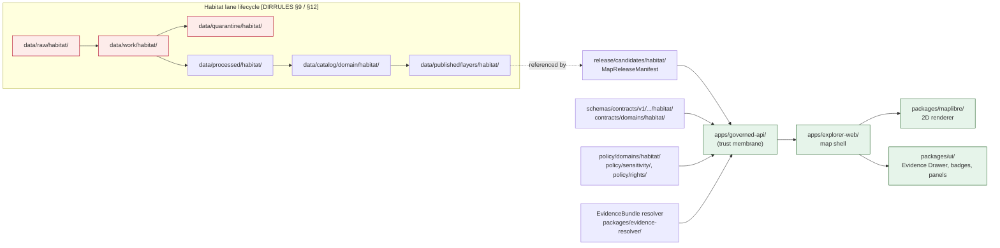
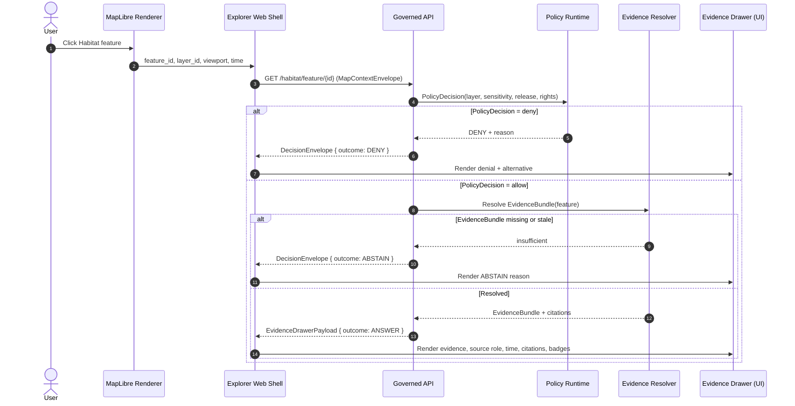
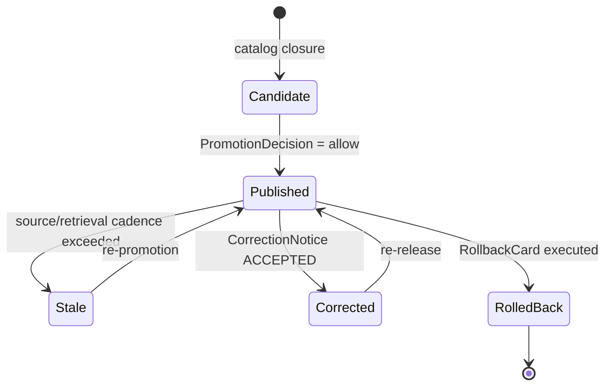

<!-- [KFM_META_BLOCK_V2]
doc_id: kfm://doc/domains/habitat/map-ui-contracts
title: Habitat — Map and UI Contracts
type: standard
version: v1
status: draft
owners: <TBD: habitat-domain-steward>, <TBD: map-ui-steward>, <TBD: governance-reviewer>
created: 2026-05-17
updated: 2026-06-05
policy_label: public
related:
  - docs/domains/habitat/README.md
  - docs/domains/habitat/HABITAT_SOURCE_LEDGER.md
  - docs/domains/habitat/HABITAT_SENSITIVITY_PROFILE.md
  - docs/domains/habitat/CONTRACTS.md
  - docs/domains/habitat/IDENTITY_MODEL.md
  - docs/domains/fauna/MAP_UI_CONTRACTS.md
  - docs/architecture/map-shell.md
  - docs/architecture/governed-api.md
  - docs/standards/PROVENANCE.md
  - docs/standards/PMTILES.md
  - docs/standards/OGC-API-TILES.md
  - docs/doctrine/trust-membrane.md
  - docs/doctrine/lifecycle-law.md
  - contracts/runtime/decision_envelope.md
  - schemas/contracts/v1/domains/habitat/
  - policy/domains/habitat/
  - ai-build-operating-contract.md
tags: [kfm, domain:habitat, map, ui, contracts, evidence-drawer, focus-mode, governed-api]
notes:
  - 'CONTRACT_VERSION = "3.0.0"'
  - Domain doc per Directory Rules §12 Domain Placement Law.
  - Cross-cutting map UI primitives are CONFIRMED doctrine; habitat-specific viewing products are PROPOSED per DOM-HAB §G.
  - All file paths outside docs/domains/habitat/ are PROPOSED until verified against a mounted repo.
  - "CONFLICTED schema-home: ADR-0001 OPEN per Atlas ADR-S-01 (confirm-or-amend; VB-11-01 NEEDS VERIFICATION); segmented schemas/contracts/v1/domains/habitat/ (DIRRULES §12) vs flat schemas/contracts/v1/habitat/ (Atlas §24.13). See §13, §15."
[/KFM_META_BLOCK_V2] -->

# Habitat — Map and UI Contracts

> Governance contract between the **Habitat** domain lane and KFM's map shell, Evidence Drawer, Focus Mode, and governed-API trust membrane. Specifies which Habitat objects render publicly, in what shape, under which finite outcomes, and with what sensitivity, evidence, and release controls.


| Field | Value |
|---|---|
| **Status** | `draft` |
| **Owners** | `<TBD: habitat-domain-steward>`, `<TBD: map-ui-steward>` |
| **Last updated** | 2026-06-05 · `CONTRACT_VERSION = "3.0.0"` |
| **Doctrinal authority** | `[DOM-HAB]`, `[DOM-HF]`, `[MAP-MASTER]`, `[GAI]`, `[DIRRULES]`, `[ENCY]`, `ai-build-operating-contract.md` |
| **Implementation maturity** | PROPOSED — no live route, schema, or component is asserted here |

---

## Contents

- [1. Purpose and Scope](#1-purpose-and-scope)
- [2. Trust Posture (Cross-Cutting)](#2-trust-posture-cross-cutting)
- [3. Architecture and Trust Membrane](#3-architecture-and-trust-membrane)
- [4. Habitat Viewing Products](#4-habitat-viewing-products)
- [5. UI Surface Contracts](#5-ui-surface-contracts)
- [6. Finite Outcomes and Envelope Mapping](#6-finite-outcomes-and-envelope-mapping)
- [7. Click Resolution and Evidence Drawer Flow](#7-click-resolution-and-evidence-drawer-flow)
- [8. Focus Mode and Governed AI](#8-focus-mode-and-governed-ai)
- [9. Sensitivity, Geoprivacy, and Redaction](#9-sensitivity-geoprivacy-and-redaction)
- [10. Time-Aware State and Temporal Contracts](#10-time-aware-state-and-temporal-contracts)
- [11. Release, Stale, and Rollback Visibility](#11-release-stale-and-rollback-visibility)
- [12. Validators, Tests, and Fixtures](#12-validators-tests-and-fixtures)
- [13. Anti-Patterns](#13-anti-patterns)
- [14. Open Questions and Verification Backlog](#14-open-questions-and-verification-backlog)
- [15. Related Docs](#15-related-docs)
- [Appendix A. Object Family Reference](#appendix-a-object-family-reference)
- [Appendix B. Glossary](#appendix-b-glossary)

---

## 1. Purpose and Scope

This document is the contract between **Habitat** (the domain owning `HabitatPatch`, `LandCoverObservation`, `EcologicalSystem`, `HabitatQualityScore`, `SuitabilityModel`, `ConnectivityEdge`, `Corridor`, `RestorationOpportunity`, `StewardshipZone`, `ModelRunReceipt`, and `UncertaintySurface`) and KFM's map and UI surfaces. It pins down:

- which **Habitat viewing products** the map shell may expose,
- which **objects, manifests, and envelopes** carry those views,
- what **finite outcomes** the governed API may return on Habitat surfaces,
- what **sensitivity, geoprivacy, evidence, and release state** must be visible before any consequential claim is rendered,
- which **anti-patterns** are forbidden, and
- which items remain **open verification** pending mounted-repo evidence.

**In scope.** Map layer presentation, click resolution into Evidence Drawer, Focus Mode answers, trust badges, time-aware state, sensitivity-redacted view, correction/stale state, and rollback visibility — all as they apply to Habitat layers.

**Out of scope.** Truth ownership of species occurrence (Fauna), plant records (Flora), and other adjacent lanes; raw source connector behavior; pipeline internals; the 3D scene admission policy; and any non-Habitat domain's UI specifics.

> [!NOTE]
> **Truth labels.** CONFIRMED = verified from attached doctrine in this session. PROPOSED = design or placement not verified in implementation. CONFLICTED = sources disagree, held until an ADR resolves it. NEEDS VERIFICATION = checkable but not yet confirmed against a mounted repo. The cross-cutting map UI primitives (Evidence Drawer, Focus Mode, trust badges, sensitivity-redacted view, correction/stale-state view, time-aware state) are CONFIRMED doctrine. Their **Habitat-specific** realizations (overlay registry contents, source-role badges, critical-habitat view, modeled-habitat view, occurrence summary view, connectivity/corridor view, Evidence Drawer Habitat panel) are PROPOSED per `[DOM-HAB §G]`.

[Back to top](#contents)

---

## 2. Trust Posture (Cross-Cutting)

Habitat map and UI surfaces inherit KFM's general trust posture without exception. These five rules apply to every rendered Habitat feature, popup, drawer, badge, time control, and AI answer.

> [!IMPORTANT]
> 1. **Public clients consume the governed API, not canonical stores.** `apps/explorer-web/` reads through `apps/governed-api/`; it never fetches from `data/raw/`, `data/work/`, `data/quarantine/`, `data/processed/`, or `data/catalog/` directly. `[DIRRULES §13.5]` `[MAP-MASTER]`
> 2. **EvidenceBundle outranks generated language and tiles.** Rendered features, popups, screenshots, and AI answers identify candidates — they do not constitute proof. `[MAP-MASTER]` `[GAI]`
> 3. **Cite-or-abstain.** Consequential claims (e.g., "this patch is regulatory critical habitat for species X") MUST resolve through Evidence Drawer or Focus Mode with citations validated; otherwise the surface returns ABSTAIN or DENY. `[GAI]` `[ENCY]`
> 4. **Sensitive geometry is transformed before tile generation.** Style filters MUST NOT be the only thing hiding sensitive features. Public exact occurrence-linked Habitat outputs are denied or generalized; disposition routes through `ai-build-operating-contract.md` §23.2. `[DOM-HAB §I]` `[DOM-HF]`
> 5. **Promotion is a governed state transition.** Only `PUBLISHED` Habitat artifacts referenced by a `MapReleaseManifest` are loadable in public clients; promotion requires `EvidenceBundle`, `ValidationReport`, `PolicyDecision`, `PromotionDecision`, and a rollback target. `[DIRRULES §9]` `[MAP-MASTER]`

The rest of this document operationalizes those five rules for the Habitat lane specifically.

[Back to top](#contents)

---

## 3. Architecture and Trust Membrane

The architectural picture below shows the **only** path by which Habitat data may reach a public map client. Direct reads from internal stores, candidate releases, or raw model output are anti-patterns (§13).



> [!NOTE]
> **Path status.** `[DIRRULES §9]` confirms the lifecycle invariant and `[DIRRULES §12]` the per-domain lane structure. Specific repo paths (`apps/governed-api/`, `apps/explorer-web/`, `packages/maplibre/`, `packages/ui/`) are **canonical roots per Directory Rules** but their **internal Habitat-specific components, routes, and route names are NEEDS VERIFICATION** until inspected in a mounted repo. The renderer package name is OPEN pending Cesium retirement (OPEN-DR-10/-11). The diagram describes responsibilities, not extant files.

[Back to top](#contents)

---

## 4. Habitat Viewing Products

`[DOM-HAB §G]` enumerates the **PROPOSED** Habitat-specific viewing products and the **CONFIRMED** cross-cutting viewing modes that must apply to every Habitat layer. The table below binds each viewing product to its underlying objects, the manifest that releases it, and the dominant trust controls.

| Viewing product | Status | Backing objects | Release vehicle | Dominant controls |
|---|---|---|---|---|
| Habitat patch map | PROPOSED `[DOM-HAB §G]` | `HabitatPatch`, `LandCoverObservation` | `LayerManifest` → `MapReleaseManifest` | release state, source role, time scope |
| Habitat suitability view | PROPOSED `[DOM-HAB §G]` `[ENCY §11]` | `SuitabilityModel`, `HabitatQualityScore`, `UncertaintySurface` | `LayerManifest` + `ModelRunReceipt` | model-vs-observation labeling, uncertainty, model card |
| Connectivity / corridor view | PROPOSED `[DOM-HAB §G]` | `ConnectivityEdge`, `Corridor` | `LayerManifest` | source role, evidence support |
| Restoration opportunity view | PROPOSED `[ENCY §7.4 E]` | `RestorationOpportunity`, `StewardshipZone` | `LayerManifest` | review state, steward attribution |
| Critical habitat view | PROPOSED `[DOM-HAB §G]` | `HabitatPatch` (regulatory role) | `LayerManifest` | regulatory source role, no model→regulatory collapse |
| Modeled habitat view | PROPOSED `[DOM-HAB §G]` | `SuitabilityModel`, `HabitatPatch` (model role) | `LayerManifest` + `ModelRunReceipt` | model card, uncertainty surfacing |
| Occurrence summary view | PROPOSED `[DOM-HAB §G]` | Cross-lane: Fauna occurrence summary joined to `HabitatPatch` | `LayerManifest` (Habitat-derived) | **geoprivacy transform receipt required** |
| Habitat–fauna join view | PROPOSED `[DOM-HF]` `[ENCY §7.4 E]` | `HabitatPatch` × Fauna `OccurrencePublic` | `LayerManifest` + transform receipt | sensitivity, geoprivacy, generalized geometry only |
| Uncertainty mode | PROPOSED `[ENCY §7.4 E]` | `UncertaintySurface` | `LayerManifest` | confidence class, support metadata |
| Sensitivity-redacted view | **CONFIRMED doctrine** `[MAP-MASTER]` `[GAI]` | any Habitat object touching sensitive context | `LayerManifest` + redaction receipt | deny-by-default for exact sensitive geometry |
| Evidence Drawer (Habitat panel) | PROPOSED placement; **CONFIRMED pattern** `[MAP-MASTER]` `[GAI]` | resolved `EvidenceBundle` for clicked feature | `EvidenceDrawerPayload` | citation validation, source role, time scope |
| Time slider | **CONFIRMED doctrine** `[MAP-MASTER]` | `LayerManifest` temporal metadata | snapshot selection over released layers | reject unreleased snapshots |
| Trust-badge map | **CONFIRMED doctrine** `[MAP-MASTER]` | layer metadata only | `LayerManifest` | evidence, policy, review, release, stale, correction badges |
| Story Node (habitat) | PROPOSED `[KFM-IDX-MAP-007]` | curated `EvidenceBundle` collection | StoryManifest (PROPOSED) | release state, citation chain |

> [!TIP]
> **Reading the table.** "PROPOSED" against the **viewing product** means the product exists in doctrine but its component, route, and configuration are not yet verifiable. "CONFIRMED doctrine" against a cross-cutting product (e.g., Evidence Drawer pattern) means the **pattern** is governance-fixed even though the **Habitat-specific instance** is PROPOSED.

[Back to top](#contents)

---

## 5. UI Surface Contracts

Every Habitat-rendering UI surface is bound to a controlling object family. The map shell MUST NOT invent surface-only state — every visible Habitat element traces to a named contract.

### 5.1 Controlling object families

| Object family | Role on the map UI | Required content (intent) | Status |
|---|---|---|---|
| `SourceDescriptor` | Backs source-role badges and attribution | `source_id`, `source_family`, `role` (`regulatory`/`authority` \| `observed` \| `context` \| `model`), `rights`, `cadence`, `license_spdx`, `sensitivity`, `authoritative_scope` | PROPOSED placement `[MAP-MASTER §11]` |
| `LayerManifest` | Defines a releasable Habitat layer | `layer_id`, `source_id` refs, catalog refs, policy labels, `release_state`, tile/style refs, attribution | PROPOSED placement `[MAP-MASTER §11]` |
| `StyleManifest` | Defines the visual rendering of a Habitat layer | `style_id`, `style_json_digest`, renderer version, sprite/glyph refs | PROPOSED placement |
| `TileArtifactManifest` | Binds a tile artifact (e.g., PMTiles) to digest, sidecar, and source layer | `artifact_id`, `type`, `uri`, `sha256`, sidecar hashes, zooms, Range/CORS | PROPOSED placement |
| `MapReleaseManifest` | Declares the active public release set | `release_id`, `LayerManifest` refs, `StyleManifest` refs, `TileArtifactManifest` refs, `PromotionDecision`, rollback target, cache invalidation | PROPOSED placement |
| `EvidenceBundle` | Authority carrier for any claim about Habitat features | claim/evidence refs, source role, paraphrase, temporal/spatial scope, review state | CONFIRMED central; placement PROPOSED |
| `EvidenceDrawerPayload` | UI DTO for click resolution | clicked feature id, evidence refs, catalog refs, policy state, citations, digests, related Story Nodes | PROPOSED placement |
| `MapContextEnvelope` | Bounded context for Focus Mode requests | viewport, selected feature IDs, released layer IDs, time context, policy state, evidence refs | PROPOSED placement |
| `FocusModeRequest` / `FocusModeResponse` | Governed AI surface over Habitat context | request: question/scope, context, evidence refs; response: finite outcome, citations, limitations, `AIReceipt` ref | PROPOSED placement |
| `AIReceipt` | Audit record for any AI answer | model/provider, prompt/context hash, evidence refs, policy decisions, output digest, citation report | PROPOSED placement |
| `PolicyDecision` | Records allow/deny/abstain/error with reason | input facts, policy version, decision, reasons, obligations | PROPOSED placement |
| `RuntimeResponseEnvelope` | Generic finite-outcome envelope for runtime surfaces | finite outcome, evidence refs, policy decision, rights posture, release state | CONFIRMED pattern `[GAI]` |

### 5.2 Surface → required contracts matrix

| UI surface | Backed by | Returns | Fails closed on |
|---|---|---|---|
| Habitat layer load | `LayerManifest` (released) → `TileArtifactManifest` → `StyleManifest` | tile bytes via governed-API or signed artifact endpoint | missing manifest, unreleased state, missing digest, missing rollback target |
| Trust badge bar | `LayerManifest` metadata + `PolicyDecision` | evidence / policy / review / release / stale / correction badges | missing policy label, missing release state |
| Feature click → drawer | governed-API click resolver | `EvidenceDrawerPayload` (ANSWER) or finite refusal | unresolved `EvidenceBundle`, missing citations, sensitive geometry, unreleased |
| Focus Mode panel | `MapContextEnvelope` → `FocusModeRequest` | `FocusModeResponse` (ANSWER/ABSTAIN/DENY/ERROR) + `AIReceipt` | uncited claim, missing evidence, sensitive coordinate exposure |
| Time slider | `LayerManifest.temporal_metadata` | released snapshot selection | unreleased snapshot, stale-policy violation |
| Sensitivity-redacted toggle | redaction receipt + `PolicyDecision` | generalized/suppressed view | missing transform receipt |
| Correction submission | governed-API correction endpoint | `CorrectionNoticeCandidate` ACCEPTED/DENY/ERROR | missing identity, broken rights state |

[Back to top](#contents)

---

## 6. Finite Outcomes and Envelope Mapping

Per `[GAI]` and `[ATLAS §24.3]`, every governed Habitat surface returns one of a small, well-known set of outcomes. Map UI components MUST switch on these outcomes — not parse free-form text or assume empty responses are success.

### 6.1 Outcome reference

| Outcome | When | Public-surface effect |
|---|---|---|
| `ANSWER` | Evidence resolved, policy permits, release state allows, review state recorded if required | Substantive Habitat answer with Evidence Drawer + citations |
| `ABSTAIN` | Evidence insufficient, citations cannot validate, or stale with no released alternative | Non-substantive note + reason; never invents |
| `DENY` | Policy, rights, sensitivity, or release state forbids | Denial reason; offers a non-restricted alternative where possible |
| `ERROR` | Schema, query, contract, or infrastructure failure | Finite, actionable error; no claim leakage |
| `HOLD` | Promotion / correction paused pending steward review (review/release plane) | Surface remains in prior state; no silent rollback |

> [!NOTE]
> Outcome vocabularies are surface-scoped (Atlas §24.3.1/§24.3.2): caller-facing surfaces use `ANSWER`/`ABSTAIN`/`DENY`/`ERROR`; the **layer-manifest resolver uses `ANSWER`/`DENY`/`ERROR` only — no `ABSTAIN`**; validators are internal `PASS`/`FAIL`; review/release uses `HOLD`/`ALLOW`/`RESTRICT`. `HOLD` above is a review/release-plane state, not a caller-facing answer outcome.

### 6.2 Habitat surface → outcome mapping

| Habitat surface | DTO / schema | Allowed outcomes | Forbidden behavior | Status |
|---|---|---|---|---|
| Habitat feature/detail resolver | `HabitatDecisionEnvelope` (or generic `DecisionEnvelope`) | ANSWER / ABSTAIN / DENY / ERROR | exposing internal store IDs; returning unreleased candidates as ANSWER | PROPOSED; exact route UNKNOWN `[DOM-HAB §J]` |
| Habitat layer manifest resolver | `LayerManifest` | ANSWER / DENY / ERROR *(no ABSTAIN — Atlas §24.3.2)* | serving `WORK` or `CATALOG` layers; serving without `ReleaseManifest` | PROPOSED `[DOM-HAB §J]` |
| Habitat Evidence Drawer payload | `EvidenceDrawerPayload` + `EvidenceBundle` projection | ANSWER / ABSTAIN / DENY / ERROR | popups replacing the drawer; uncited claims | PROPOSED `[DOM-HAB §J]` |
| Habitat Focus Mode answer | `RuntimeResponseEnvelope` + `AIReceipt` | ANSWER / ABSTAIN / DENY / ERROR | AI as root truth; sensitive coordinate leakage; uncited synthesis | PROPOSED `[DOM-HAB §J]` `[GAI]` |
| Habitat correction submission | `CorrectionNoticeCandidate` | ACCEPTED / DENY / ERROR | accepting without identity / rights check | PROPOSED `[ENCY §J]` |

> [!IMPORTANT]
> **Deny is a first-class outcome, not an error.** A Habitat surface that returns DENY because sensitivity controls fired is operating **correctly**; the UI must render the denial reason and (when possible) suggest a non-restricted alternative (e.g., generalized range tile in place of exact occurrence geometry).

[Back to top](#contents)

---

## 7. Click Resolution and Evidence Drawer Flow

The click-to-drawer flow is governed in three legs: the click identifies a **candidate**, the governed API resolves the candidate's `EvidenceBundle`, and the drawer renders only what evidence and policy permit. Popups MAY summarize but MUST NOT substitute for the drawer `[MAP-MASTER §N]`.



### 7.1 `EvidenceDrawerPayload` (Habitat) — required content (intent)

The Habitat realization of the cross-cutting `EvidenceDrawerPayload` `[MAP-MASTER §11]` is expected to surface, at minimum:

- the clicked feature id and its `layer_id`,
- resolved `EvidenceBundle` refs (one or more),
- source role(s) per evidence ref (`regulatory`/`authority` / `observed` / `context` / `model`) — collapse is forbidden,
- temporal scope (source, observed, valid, retrieval, release, correction times where material),
- `PolicyDecision` posture and reason codes (if any obligations apply),
- citation validation state (pass/fail per claim),
- digests (feature, artifact) for verification,
- related Story Node refs (when present),
- correction-link and stale-state indicators.

> [!CAUTION]
> **No popup-as-drawer substitution.** A popup may show the feature name, summary attribute, and a link to "Open Evidence Drawer." It MUST NOT carry consequential claims (e.g., conservation status, regulatory designation, suitability score interpretation) by itself. Claims that influence decisions resolve through the drawer or Focus Mode. `[MAP-MASTER §N]`

[Back to top](#contents)

---

## 8. Focus Mode and Governed AI

Focus Mode answers questions over Habitat map context but is **interpretive, never sovereign**. The doctrine in `[GAI]` and `[DOM-HAB §L]` applies in full: AI may summarize released Habitat `EvidenceBundle`s, compare evidence, explain limitations, and draft steward-review notes; AI MUST ABSTAIN when evidence is insufficient and MUST DENY when policy, rights, sensitivity, or release state blocks the request.

### 8.1 Focus request → response shape

```mermaid
flowchart LR
    CTX["MapContextEnvelope<br/>(viewport, layers, time, selected feature, policy posture, evidence refs)"]
    REQ["FocusModeRequest<br/>(question, scope, evidence refs, user role)"]
    PRE["policy/focus/focus_request.rego<br/>(precheck: direct model? restricted source? unsupported scope?)"]
    LLM["Governed AI Adapter<br/>(no direct model client in UI)"]
    POST["policy/focus/focus_response.rego<br/>(postcheck: uncited? invalid citation? sensitive coordinate?)"]
    CV["CitationValidationReport"]
    RES["FocusModeResponse<br/>ANSWER / ABSTAIN / DENY / ERROR"]
    AIR["AIReceipt"]

    CTX --> REQ --> PRE --> LLM --> POST --> RES
    LLM --> CV --> POST
    RES --> AIR
```



### 8.2 Habitat-specific Focus Mode constraints

| Constraint | Source | Behavior |
|---|---|---|
| AI is never the root truth source. | `[GAI]` `[DOM-HAB §L]` | `EvidenceBundle` outranks generated language. |
| Critical habitat is a regulatory source role; do not collapse model output into it. | `[DOM-HAB §G]` `[DOM-HAB §I]` `[ATLAS §24.1]` | Focus Mode MUST surface the source role distinction; model output is labeled "modeled," not "critical." Collapse → DENY at publication, ABSTAIN at AI surface. |
| Sensitive coordinates MUST NOT appear in answers. | `[KFM-IDX-POL-005]` `[DOM-HF]` | Postcheck denies any response containing exact sensitive geometry; disposition routes through §23.2. |
| Citations MUST validate before public answer. | `[GAI]` `[MAP-MASTER §O]` | `CitationValidationReport` fail → ABSTAIN. |
| Model context length and runtime config are recorded. | `[MAP-MASTER §O]` | `AIReceipt` captures provider, model, prompt/context hash, evidence refs, output digest, citation report. |
| AI never reads RAW or WORK. | `[GAI]` | Only released `EvidenceBundle`s are in scope for Focus Mode. |
| Stale Habitat sources trigger ABSTAIN. | `[MAP-MASTER]` | When source freshness fails policy and no released alternative exists, return ABSTAIN with reason. |

> [!WARNING]
> **No direct model client on the public path.** The UI does not embed a model client. All AI traffic for Habitat surfaces routes through `apps/governed-api/` and a governed adapter that enforces pre/post-checks and emits an `AIReceipt`. A failed pre-check returns DENY before the model is invoked.

[Back to top](#contents)

---

## 9. Sensitivity, Geoprivacy, and Redaction

Habitat sits one cross-lane join away from rare-species occurrence data, sensitive nests, dens, roosts, hibernacula, and spawning sites `[DOM-FAUNA §I]` `[DOM-HF]`. The map UI inherits a strict deny-by-default posture for those joins.

> [!CAUTION]
> **Disposition routing.** The decisions in this section profile the lane; the authoritative sensitive-domain matrix is `ai-build-operating-contract.md` §23.2 (most-restrictive applicable row), the tier scheme is Atlas §24.5, and the full rule set is `HABITAT_SENSITIVITY_PROFILE.md`. This section does not re-derive disposition.

### 9.1 Sensitivity rules on the map UI

| Rule | Status | Citation |
|---|---|---|
| Regulatory critical habitat, modeled habitat, species range, occurrence points, and landscape context MUST NOT be flattened into one another. | CONFIRMED doctrine | `[DOM-HAB §I]` `[ATLAS §24.1]` |
| Sensitive occurrence details deny by default. | CONFIRMED doctrine | `[DOM-HAB §I]` `[DOM-HF]` |
| Exact occurrence-linked Habitat outputs MUST be generalized, redacted, reviewed, or denied when they create exposure risk. | CONFIRMED doctrine | `[KFM_Unified_Implementation_Architecture_Build_Manual §6.3]` |
| Geoprivacy transforms emit a **redaction / transform receipt** stating input class, output class, reason, policy, reviewer, residual risk. | CONFIRMED doctrine | `[KFM-IDX-POL-005]` |
| Style filters MUST NOT be the sole mechanism hiding sensitive geometry; geometry is transformed before tile generation. | CONFIRMED doctrine | `[MAP-MASTER]` |
| Public exact occurrence tiles for sensitive taxa are denied — even for habitat-join derivatives. | CONFIRMED doctrine | `[DOM-FAUNA §I]` |

### 9.2 Permitted geoprivacy transform types (PROPOSED)

Per `[KFM-IDX-POL-005]`, the public-safe Habitat map should support a finite, named set of geoprivacy transforms. Each transform's application emits a receipt. Parameters (grid resolution, buffer distance, window length) are steward decisions bounded by policy and are NEEDS VERIFICATION here.

| Transform | Effect | UI consequence |
|---|---|---|
| `suppress` | Feature removed from public tile | No render; drawer returns DENY with reason |
| `generalize_to_grid` | Geometry snapped to coarse grid | Render generalized cell with badge |
| `generalize_to_watershed` | Aggregated to HUC unit | Render HUC polygon; drawer cites generalization |
| `generalize_to_county` | Aggregated to county | Render county polygon; drawer cites generalization |
| `buffer` | Geometry buffered (no centroid leakage) | Render buffered geometry; badge shown |
| `delayed_publication` | Release deferred by policy window | Surface returns DENY until window opens |
| `steward_only_exact` | Exact geometry visible only in review console | Public surface returns DENY; review console surfaces exact |

> [!IMPORTANT]
> **No transform → no public render.** If a Habitat layer that joins to sensitive occurrence data lacks a resolvable transform receipt, the governed API MUST return DENY, and the map shell MUST NOT load tiles for that layer. A transform is valid only if the public derivative cannot be inverted to recover the protected feature; otherwise the correct outcome is `suppress` or stay denied.

[Back to top](#contents)

---

## 10. Time-Aware State and Temporal Contracts

KFM keeps **source, observed, valid, retrieval, release, and correction** times distinct where material `[DOM-HAB §E]`. The Habitat map UI exposes that distinction through the time slider, badges, and drawer fields.

### 10.1 Temporal fields surfaced

| Field | Meaning | Where it appears |
|---|---|---|
| `source_time` | When the source captured / published the observation | Drawer; badge if stale |
| `observed_time` | When the phenomenon was observed | Drawer; time slider axis |
| `valid_time` | The interval over which the observation applies | Drawer |
| `retrieval_time` | When KFM retrieved the source | Drawer; basis for stale check |
| `release_time` | When the layer was published via `MapReleaseManifest` | Drawer; release badge |
| `correction_time` | When a correction was issued (if any) | Drawer; correction badge |

### 10.2 Time slider contract

| Rule | Status | Citation |
|---|---|---|
| Time slider only loads released snapshots. | CONFIRMED doctrine | `[MAP-MASTER §P]` |
| Selecting an unreleased version returns DENY. | CONFIRMED doctrine | `[MAP-MASTER §P]` |
| Focus Mode version lock freezes layers to selected version. | CONFIRMED pattern | `[MAP-MASTER §O]` |
| Stale source state surfaces a stale badge and may trigger ABSTAIN on Focus Mode. | CONFIRMED pattern | `[MAP-MASTER]` |

[Back to top](#contents)

---

## 11. Release, Stale, and Rollback Visibility

Per `[DOM-HAB §M]`, Habitat publication requires `ReleaseManifest`, `EvidenceBundle`, validation/policy support, review state where required, correction path, stale-state rule, and rollback target. The map UI surfaces all of these.



### 11.1 Required UI visibility

| State | UI signal | Drawer content |
|---|---|---|
| `Published` | Release badge + release_time | `MapReleaseManifest` ref, `LayerManifest` ref |
| `Stale` | Stale badge | reason, expected cadence, last `retrieval_time` |
| `Corrected` | Correction badge | `CorrectionNotice` ref + diff summary |
| `RolledBack` | Rollback indicator | prior manifest ref, restore receipt |
| `Denied / Restricted` | Denial reason badge | `PolicyDecision` reason codes |

[Back to top](#contents)

---

## 12. Validators, Tests, and Fixtures

The validator catalog below combines the Habitat-specific test obligations from `[DOM-HAB §K]` with the cross-cutting map UI test families from `[MAP-MASTER]`. All entries are PROPOSED until verified in repo.

| Test family | Minimum cases | Status | Citation |
|---|---|---|---|
| Habitat source descriptor tests | valid/invalid descriptors; unknown rights deny | PROPOSED | `[DOM-HAB §K]` |
| Critical habitat source-role tests | regulatory role must not be collapsed with model role | PROPOSED | `[DOM-HAB §K]` |
| Modeled-as-critical denial tests | model output rendered as critical habitat → DENY | PROPOSED | `[DOM-HAB §K]` |
| Occurrence geoprivacy tests | exact sensitive geometry on public path → DENY/generalized | PROPOSED | `[DOM-HAB §K]` `[KFM-IDX-POL-005]` |
| Catalog closure tests | unresolved `EvidenceRef` or missing `ValidationReport` blocks promotion | PROPOSED | `[DOM-HAB §K]` |
| Habitat + Fauna thin-slice fixtures | one public-safe occurrence→patch assignment with full envelope | PROPOSED | `[DOM-HF]` `[KFM-IDX-APP-002]` |
| `LayerManifest` schema validation | digest, source refs, release_state, policy labels present | PROPOSED | `[MAP-MASTER §12]` |
| Click-to-EvidenceBundle test | click resolves to released `EvidenceBundle`; abstain otherwise | PROPOSED | `[MAP-MASTER §N]` |
| No-public-RAW path test | UI never reads `data/raw/`, `data/work/`, `data/quarantine/`, `data/processed/`, `data/catalog/` | PROPOSED | `[DIRRULES §13.5]` |
| No-unreleased-tile load test | tiles without `MapReleaseManifest` ref fail to load | PROPOSED | `[MAP-MASTER]` |
| Stale-source fixture | old `retrieval_time` triggers stale badge + ABSTAIN | PROPOSED | `[MAP-MASTER]` |
| Sensitive-geometry deny fixture | exact sensitive coordinate fails closed; style filter is insufficient | PROPOSED | `[MAP-MASTER]` `[DOM-HF]` |
| Citation validation tests | uncited Focus Mode output abstains | PROPOSED | `[GAI]` `[MAP-MASTER §O]` |
| Rollback drill | rollback restores prior manifest and invalidates cache | PROPOSED | `[MAP-MASTER]` |
| Accessibility / keyboard nav | map controls keyboard-operable; non-map alternative present | PROPOSED | `[KFM_Whole_UI_Governed_AI_Expansion_Report]` |

<details>
<summary><b>Fixture seed: minimal Habitat thin-slice (illustrative)</b></summary>

This illustrates the **intent** of a Habitat + Fauna thin-slice fixture per `[DOM-HF]` and `[KFM-IDX-APP-002]`. It is **not** a normative schema — actual field names, types, and homes are PROPOSED until validated by the Habitat schema home (slug **CONFLICTED**, §13) and `policy/domains/habitat/`.

```json
{
  "fixture_id": "hab-fauna-thinslice-001",
  "scope": "public-safe occurrence -> habitat patch assignment",
  "habitat_patch": {
    "object_type": "HabitatPatch",
    "id": "patch-illustrative-001",
    "ecological_system_ref": "kfm://es/illustrative",
    "source_role": "observed",
    "geometry_class": "generalized"
  },
  "fauna_occurrence_public": {
    "object_type": "OccurrencePublic",
    "taxon_ref": "kfm://taxon/illustrative",
    "geoprivacy_transform_receipt_ref": "kfm://receipt/transform/illustrative",
    "geometry_class": "generalized_to_grid"
  },
  "evidence_bundle": {
    "object_type": "EvidenceBundle",
    "claim": "patch X is potential habitat for taxon Y under model Z",
    "source_roles": ["observed", "model"],
    "citations": ["..."],
    "temporal_scope": { "valid_time": "..." },
    "review_state": "draft"
  },
  "layer_manifest": {
    "object_type": "LayerManifest",
    "layer_id": "habitat.assignment.illustrative",
    "release_state": "candidate"
  },
  "expected_outcomes": {
    "feature_resolver": "ANSWER",
    "focus_mode_with_sufficient_evidence": "ANSWER",
    "focus_mode_with_missing_citation": "ABSTAIN",
    "exact_occurrence_request": "DENY"
  }
}
```

</details>

[Back to top](#contents)

---

## 13. Anti-Patterns

Patterns that look like helpful shortcuts but break Habitat's trust posture. All are **forbidden** on the public Habitat path.

| Anti-pattern | Why it breaks Habitat | Fix |
|---|---|---|
| Map shell reads `data/processed/habitat/` or `data/catalog/domain/habitat/` directly | Bypasses governed-API trust membrane | Reads MUST go through `apps/governed-api/` `[DIRRULES §13.5]` |
| Treating popups as Evidence Drawer | Renders consequential claims without citation validation | Popups summarize; claims resolve in drawer `[MAP-MASTER §N]` |
| Style filter hides sensitive Habitat-occurrence geometry | Style can be bypassed; geometry is still in tiles | Transform geometry before tile generation `[MAP-MASTER]` |
| AI answer treated as Habitat truth | Generation outranks evidence — forbidden | `EvidenceBundle` outranks generation; ABSTAIN if missing `[GAI]` |
| Modeled suitability rendered as "critical habitat" | Collapses model role into regulatory role (`source_role_collapse`) | Source role distinction MUST be visible; DENY at publish, ABSTAIN at AI `[DOM-HAB §I]` `[ATLAS §24.1]` |
| Loading an unreleased Habitat snapshot from the time slider | Bypasses promotion gate | Time slider only loads released snapshots `[MAP-MASTER §P]` |
| Watcher emits a published Habitat tile directly | Watcher-as-non-publisher invariant violated | Workers emit receipts and candidate decisions only `[DIRRULES §13.5]` |
| Connector writes to `data/published/layers/habitat/` | Connectors do not publish | Connectors emit to `data/raw/` or `data/quarantine/` with `publication_state: WORK_CANDIDATE` `[DIRRULES §13.5]` |
| `contracts/habitat/*.schema.json` and `schemas/contracts/v1/.../habitat/` both edited as authority | Schema-home drift; and `.schema.json` must never live under `contracts/` | `.schema.json` lives only under `schemas/`; `contracts/` keeps semantic Markdown. The exact `schemas/` slug is **CONFLICTED** (segmented vs flat, ADR-S-01 open). File the drift; do not create both. `[DIRRULES §13.1, §6.4]` `[ATLAS §24.12 ADR-S-01]` |
| Story Node renders Habitat narrative without `EvidenceBundle` refs | Narrative outruns evidence | Story Nodes are evidence-bound, release-aware, policy-filtered `[KFM-IDX-MAP-007]` |
| Cross-lane join doctrine placed under `docs/domains/habitat-fauna/` | Combined-lane folder violates Domain Placement Law | Cross-domain doctrine lives under `docs/architecture/<topic>.md` `[DIRRULES §12]` |

[Back to top](#contents)

---

## 14. Open Questions and Verification Backlog

These items are inherited from `[DOM-HAB §N]` and from the trust-membrane verification posture defined in `[DIRRULES]` and `[MAP-MASTER]`. None can be resolved without mounted-repo inspection or steward input.

| Item | Status | Evidence that would settle it |
|---|---|---|
| **Schema home for Habitat machine schemas** — segmented `…/domains/habitat/` (DIRRULES §12) vs flat `…/habitat/` (Atlas §24.13); confirm/amend ADR-0001 (ADR-S-01; VB-11-01) | **CONFLICTED** | Accepted ADR-S-01 + DRIFT_REGISTER entry + mounted `schemas/` inspection |
| Verify official critical habitat source descriptors | NEEDS VERIFICATION | mounted repo files, registry entries, tests |
| Verify sensitive occurrence policy and geoprivacy transforms | NEEDS VERIFICATION | `policy/domains/habitat/`, `policy/sensitivity/`, fixtures |
| Verify model-card requirements for suitability products | NEEDS VERIFICATION | schemas + `ModelRunReceipt` fixtures |
| Verify Habitat MapLibre overlay registry and Focus behavior | NEEDS VERIFICATION | layer registry, route inventory, Focus adapter tests |
| Confirm the exact governed-API route for the Habitat feature/detail resolver | UNKNOWN | route inventory ADR per `[KFM-IDX-API-001]` |
| Confirm whether `HabitatDecisionEnvelope` is a Habitat-specific subtype or a generic `DecisionEnvelope` | PROPOSED, choice not settled | ADR + schema in `schemas/contracts/v1/runtime/` |
| Confirm Habitat-specific Story Node payload contract | PROPOSED | StoryManifest spec, fixtures |
| Confirm Habitat layer naming and `layer_id` convention | PROPOSED | layer registry entries in repo |
| Confirm rollback receipt shape for Habitat releases | PROPOSED | `release/candidates/habitat/` + rollback fixtures |
| Confirm renderer package name (Cesium retirement) | OPEN | OPEN-DR-10/-11 ADR |

> [!NOTE]
> **Posture.** Every PROPOSED row above is **doctrine-grounded but implementation-ungrounded**. Promotion of any row to CONFIRMED requires direct repo inspection or a merged ADR — not memory, not external research, not analogy to neighboring domains.

[Back to top](#contents)

---

## 15. Related Docs

- `docs/domains/habitat/README.md` — Habitat domain landing page <!-- TODO: confirm presence -->
- `docs/domains/habitat/HABITAT_SOURCE_LEDGER.md` — source families and rights <!-- PROPOSED -->
- `docs/domains/habitat/HABITAT_SENSITIVITY_PROFILE.md` — geoprivacy and redaction posture <!-- PROPOSED -->
- `docs/domains/habitat/CONTRACTS.md` — Habitat object-meaning index <!-- PROPOSED -->
- `docs/domains/habitat/IDENTITY_MODEL.md` — identity & spec_hash discipline <!-- PROPOSED -->
- `docs/domains/fauna/MAP_UI_CONTRACTS.md` — adjacent lane; relevant for sensitive-occurrence joins <!-- TODO: confirm presence -->
- `docs/architecture/map-shell.md` — cross-cutting map shell architecture <!-- TODO: confirm presence -->
- `docs/architecture/governed-api.md` — trust membrane architecture <!-- TODO: confirm presence -->
- `docs/architecture/habitat-fauna-thin-slice.md` — cross-lane thin-slice doctrine (non-domain home) <!-- PROPOSED -->
- `docs/standards/PMTILES.md` — PMTiles governance profile
- `docs/standards/OGC-API-TILES.md` — Tiles delivery profile
- `docs/standards/PROVENANCE.md` — provenance profile (`PROV.md` vs `PROVENANCE.md` is OPEN-DR-01)
- `ai-build-operating-contract.md` — operating law; §23.2 sensitive-domain matrix (`CONTRACT_VERSION = "3.0.0"`)
- `docs/doctrine/trust-membrane.md` — `[DIRRULES §13.5]` materialization <!-- TODO: confirm presence -->
- `docs/doctrine/lifecycle-law.md` — RAW → PUBLISHED invariant (`[DIRRULES §9]`) <!-- TODO: confirm presence -->
- `schemas/contracts/v1/domains/habitat/` — machine schemas (PROPOSED home; slug **CONFLICTED**, §13)
- `policy/domains/habitat/` — Habitat policy bundles (PROPOSED home)
- `tests/domains/habitat/` — Habitat tests (PROPOSED home)

[Back to top](#contents)

---

## Appendix A. Object Family Reference

Habitat's owned and cited object families, scoped to map and UI surfaces. Identity rules and temporal handling follow `[DOM-HAB §E]`.

<details>
<summary><b>A.1 Owned by Habitat</b></summary>

| Object family | Purpose on the map | Identity rule (PROPOSED) | Temporal handling (CONFIRMED) |
|---|---|---|---|
| `HabitatPatch` | Polygonal habitat unit; basis for patch map, critical/modeled views | source id + object role + temporal scope + normalized digest | distinct source/observed/valid/retrieval/release/correction times |
| `LandCoverObservation` | Backing observation for patch derivation | same | same |
| `EcologicalSystem` | Class label for patches | same | same |
| `HabitatQualityScore` | Suitability scalar; surfaced in suitability view; descriptive not prescriptive | same | same |
| `SuitabilityModel` | Model artifact behind modeled views | same | same |
| `ConnectivityEdge` | Edge in connectivity graph | same | same |
| `Corridor` | Aggregated connectivity feature | same | same |
| `RestorationOpportunity` | Candidate restoration polygon | same | same |
| `StewardshipZone` | Steward-managed area context | same | same |
| `ModelRunReceipt` | Receipt for model runs; required for modeled views | same | same |
| `UncertaintySurface` | Surface backing uncertainty mode; must not be erased | same | same |

</details>

<details>
<summary><b>A.2 Cited by Habitat (cross-cutting)</b></summary>

| Object family | Owner | Role on Habitat surfaces |
|---|---|---|
| `SourceDescriptor` | cross-cutting (source steward) | source-role badges, attribution, rights gating |
| `EvidenceBundle` | cross-cutting (ENCY doctrine) | Habitat claim support; drawer payload core |
| `EvidenceDrawerPayload` | cross-cutting (map UI) | click resolution surface |
| `MapContextEnvelope` | cross-cutting (map UI) | Focus Mode input |
| `LayerManifest` | cross-cutting (map release) | layer release contract |
| `StyleManifest` | cross-cutting (map release) | layer style contract |
| `TileArtifactManifest` | cross-cutting (map release) | tile artifact binding |
| `MapReleaseManifest` | cross-cutting (release) | active public release |
| `PolicyDecision` | cross-cutting (policy) | allow/deny/abstain/error with reasons |
| `PromotionDecision` | cross-cutting (release) | promotion gate result |
| `AIReceipt` | cross-cutting (governed AI) | audit for Focus Mode answers |
| `CitationValidationReport` | cross-cutting (governed AI) | required before public answer |
| `RunReceipt` | cross-cutting (pipelines) | process memory |
| Rollback target | cross-cutting (release) | prior release pointer |
| Cache invalidation record | cross-cutting (release) | cache control on rollback |

</details>

[Back to top](#contents)

---

## Appendix B. Glossary

<details>
<summary><b>Selected Habitat and map-UI terms</b></summary>

- **HabitatPatch** — polygonal unit of habitat carrying source role, evidence, time scope, and release state `[DOM-HAB §C]`.
- **Regulatory critical habitat** — legally designated habitat; source role is `regulatory`/`authority`. Distinct from modeled habitat and MUST NOT be collapsed `[DOM-HAB §C]` `[ATLAS §24.1]`.
- **Modeled habitat** — habitat derived from a `SuitabilityModel`; source role is `model`. Always labeled distinctly from regulatory or observed habitat `[DOM-HAB §C]`.
- **Geoprivacy transform** — a named transformation (`suppress`, `generalize_to_grid`, `generalize_to_watershed`, `generalize_to_county`, `buffer`, `delayed_publication`, `steward_only_exact`) producing a public-safe representation; each application emits a receipt `[DOM-HAB §C]` `[KFM-IDX-POL-005]`.
- **EvidenceBundle** — authority carrier for a claim, with source role, citations, temporal/spatial scope, and review state. Outranks rendered tiles and AI answers `[ENCY]`.
- **EvidenceDrawerPayload** — UI DTO returned by the governed-API click resolver `[MAP-MASTER §11]`.
- **MapContextEnvelope** — bounded map state envelope used as Focus Mode input `[MAP-MASTER §11]`.
- **FocusModeRequest / FocusModeResponse** — governed AI surface over `MapContextEnvelope` + `EvidenceBundle` refs; response is finite `[MAP-MASTER §11]`.
- **AIReceipt** — audit record for any AI answer, including model, prompt/context hash, evidence refs, policy decisions, output digest, citation report `[MAP-MASTER §11]`.
- **PolicyDecision** — allow/deny/abstain/error with reason codes and obligations; backs trust badges `[MAP-MASTER §11]`.
- **MapReleaseManifest** — active public map release bundle: layer/style/tile manifests, promotion decision, rollback target, cache invalidation `[MAP-MASTER §11]`.
- **Trust membrane** — the governed-API boundary between public clients and internal stores `[DIRRULES §13.5]` `[KFM-IDX-API-001]`.

</details>

[Back to top](#contents)

---

**Related docs:** [Habitat README](./README.md) · [Habitat Source Ledger](./HABITAT_SOURCE_LEDGER.md) · [Habitat Sensitivity Profile](./HABITAT_SENSITIVITY_PROFILE.md) · [Map Shell Architecture](../../architecture/map-shell.md) · [Governed API Architecture](../../architecture/governed-api.md)
**Last updated:** 2026-06-05 · `CONTRACT_VERSION = "3.0.0"`
[Back to top](#contents)
