<!-- [KFM_META_BLOCK_V2]
doc_id: kfm://doc/habitat-missing-or-planned-files
title: Habitat Domain — Missing or Planned Files
type: standard
version: v1
status: draft
owners: <habitat-domain-steward> · <docs-steward>
created: 2026-05-17
updated: 2026-06-05
policy_label: public
related:
  - docs/domains/habitat/README.md
  - docs/domains/habitat/FILE_SYSTEM_PLAN.md
  - docs/domains/habitat/HABITAT_SOURCE_LEDGER.md
  - docs/domains/habitat/HABITAT_SENSITIVITY_PROFILE.md
  - docs/doctrine/directory-rules.md
  - docs/registers/DRIFT_REGISTER.md
  - docs/registers/VERIFICATION_BACKLOG.md
  - docs/runbooks/fauna/SOURCE_REFRESH_RUNBOOK.md
  - ai-build-operating-contract.md
tags: [kfm, habitat, domain, tracker, planning, directory-rules]
notes:
  - All path claims are PROPOSED until verified against mounted-repo evidence.
  - Implementation maturity remains UNKNOWN without repo inspection.
  - Sensitive joins (Habitat × Fauna occurrences) deny by default.
  - "CONFLICTED schema-home: ADR-0001 OPEN per Atlas ADR-S-01 (confirm-or-amend; VB-11-01 NEEDS VERIFICATION); segmented schemas/contracts/v1/domains/habitat/ (DIRRULES §12) vs flat schemas/contracts/v1/habitat/ (Atlas §24.13). See schemas section + open-conflicts table."
[/KFM_META_BLOCK_V2] -->

# Habitat Domain — Missing or Planned Files

> Lane-wide tracker for habitat files that should exist, are intentionally deferred, or are intentionally not created — held to KFM doctrine, Directory Rules, and the trust membrane.

[](#status--authority)
[](#status--authority)
[](#scope--purpose)
[](#lane-shape)
[](#status-posture)
[](#sensitivity-rights-and-publication-posture)
[](#open-file-home-conflicts-and-adr-pending-decisions)
[](#status-posture)
[](#open-questions-and-verification-backlog)
[](#footer)

| Field | Value |
|---|---|
| **Status** | `draft` |
| **Authority** | Tracker / planning artifact (NOT canonical for object meaning, schemas, policy, or release decisions) |
| **Owners** | `<habitat-domain-steward>` · `<docs-steward>` *(placeholders — TODO confirm against CODEOWNERS)* |
| **Last reviewed** | 2026-06-05 · `CONTRACT_VERSION = "3.0.0"` |
| **Implementation maturity** | **UNKNOWN** — repository not mounted in this session; every file path below is **PROPOSED** until verified against repo evidence |
| **Lane phase** | Phase 2 (Soil and Habitat/Fauna) per ENCY §12 backlog — **PROPOSED** |

---

## Quick jump

- [Scope & purpose](#scope--purpose)
- [Status posture](#status-posture)
- [Lane shape](#lane-shape)
- [Inventory at a glance](#inventory-at-a-glance)
- [Files that should exist next — by responsibility root](#files-that-should-exist-next--by-responsibility-root)
  - [`docs/domains/habitat/`](#docsdomainshabitat)
  - [`contracts/domains/habitat/`](#contractsdomainshabitat)
  - [`schemas/contracts/v1/domains/habitat/`](#schemascontractsv1domainshabitat)
  - [`policy/domains/habitat/`](#policydomainshabitat)
  - [`tests/domains/habitat/` and `fixtures/domains/habitat/`](#testsdomainshabitat-and-fixturesdomainshabitat)
  - [`tools/validators/domains/habitat/`](#toolsvalidatorsdomainshabitat)
  - [`pipelines/domains/habitat/` and `pipeline_specs/habitat/`](#pipelinesdomainshabitat-and-pipeline_specshabitat)
  - [`connectors/`](#connectors)
  - [`data/<phase>/habitat/`](#datapasehabitat)
  - [`release/candidates/habitat/`](#releasecandidateshabitat)
  - [`control_plane/`](#control_plane)
- [Habitat–Fauna thin-slice fixture pack](#habitatfauna-thin-slice-fixture-pack)
- [Intentionally deferred](#intentionally-deferred)
- [Intentionally not created and why](#intentionally-not-created-and-why)
- [Open file-home conflicts and ADR-pending decisions](#open-file-home-conflicts-and-adr-pending-decisions)
- [Open questions and verification backlog](#open-questions-and-verification-backlog)
- [Sensitivity, rights, and publication posture](#sensitivity-rights-and-publication-posture)
- [Related docs](#related-docs)
- [Footer](#footer)

---

## Scope & purpose

This document inventories the files **expected to exist** for the Habitat domain lane, separated from those **intentionally deferred** and those **intentionally not created**. It exists so that habitat-lane work is plannable, reviewable, and reversible without inventing repo facts.

It explicitly does **not**:

- decide whether a file should exist (that is decided by `contracts/`, `schemas/`, `policy/`, source descriptors, ADRs, and reviews);
- claim any file currently exists in the repository (no repo was mounted in this drafting session);
- override Directory Rules, doctrine, or any accepted ADR;
- substitute for an Evidence Drawer, release manifest, or promotion decision.

It does:

- enumerate the habitat-lane file footprint **PROPOSED** by KFM doctrine (DOM-HAB, DOM-HF, ENCY) under each canonical responsibility root, per Directory Rules §12 (Domain Placement Law);
- record dependencies, blockers, and ADR-pending decisions for each file family;
- surface the verification backlog so habitat work does not silently promote PROPOSED items to CONFIRMED.

> [!NOTE]
> "Missing" here means "not yet inspected as present" — **not** "absent from the repository." Distinguish *workspace-not-mounted* from *repository-does-not-exist* per the project's repository-preflight discipline.

[Back to top](#habitat-domain--missing-or-planned-files)

---

## Status posture

This tracker follows KFM truth labels:

| Label | Meaning |
|---|---|
| **CONFIRMED** | Verified this session from attached doctrine, workspace evidence, or generated artifacts. |
| **PROPOSED** | Design or path not yet verified in implementation. |
| **INFERRED** | Reasonably derivable from visible evidence but not directly stated. |
| **CONFLICTED** | Sources disagree (or doctrine and prior planning diverge); held until an ADR or drift entry resolves it. |
| **UNKNOWN** | Not resolvable without more evidence. |
| **NEEDS VERIFICATION** | Checkable, but not yet checked strongly enough to act as fact. |

In this session **every habitat lane path is PROPOSED**. The habitat lane appears in ENCY §12 Phase 2 of the programming-possibilities backlog as **PROPOSED**, and the DOM-HAB verification backlog lists four open habitat items as **NEEDS VERIFICATION**: official critical habitat source descriptors, sensitive occurrence policy and geoprivacy transforms, model-card requirements for suitability products, and habitat MapLibre overlay registry / Focus behavior. The Habitat **schema home** is additionally **CONFLICTED** (ADR-0001 OPEN per ADR-S-01; segmented vs flat slug — see the [open-conflicts table](#open-file-home-conflicts-and-adr-pending-decisions)).

> [!IMPORTANT]
> Memory is not evidence. Recollection, guessed paths, likely behavior, and generic best practice are not facts. Treat every row in the inventory tables below as a placement proposal, not a repo claim.

[Back to top](#habitat-domain--missing-or-planned-files)

---

## Lane shape

Habitat is a **domain segment** under each canonical responsibility root (Directory Rules §12). It must not become a root folder. The diagram below shows the PROPOSED habitat lane spread across responsibility roots — the topology is doctrine; the individual paths are PROPOSED until verified.

```mermaid
flowchart LR
    classDef gov fill:#eef6ff,stroke:#356bb3,color:#0b2a4a;
    classDef shape fill:#f3eefe,stroke:#6c4eb5,color:#2a1a55;
    classDef policy fill:#fff1f0,stroke:#b53a3a,color:#5c1010;
    classDef proof fill:#eef9ee,stroke:#3a8a3a,color:#103c10;
    classDef code fill:#fff7e6,stroke:#b08a2a,color:#3a2a05;
    classDef data fill:#f0f0f0,stroke:#666,color:#222;
    classDef release fill:#fef0f7,stroke:#a8418d,color:#4d0f3a;

    subgraph DOCS["Governance and meaning"]
      D1["docs/domains/habitat/"]:::gov
      D2["contracts/domains/habitat/"]:::gov
    end

    subgraph SHAPE["Machine shape"]
      S1["schemas/contracts/v1/.../habitat/<br/>(slug CONFLICTED)"]:::shape
    end

    subgraph POL["Admissibility"]
      P1["policy/domains/habitat/"]:::policy
    end

    subgraph PROOF["Proof and fixtures"]
      T1["tests/domains/habitat/"]:::proof
      T2["fixtures/domains/habitat/"]:::proof
      T3["tools/validators/domains/habitat/"]:::proof
    end

    subgraph CODE["Executable lane"]
      C1["pipelines/domains/habitat/"]:::code
      C2["pipeline_specs/habitat/"]:::code
      C3["packages/domains/habitat/"]:::code
      C4["connectors/..."]:::code
    end

    subgraph DATA["Lifecycle"]
      L1["data/raw/habitat/"]:::data
      L2["data/work/habitat/ · quarantine/habitat/"]:::data
      L3["data/processed/habitat/"]:::data
      L4["data/catalog/domain/habitat/"]:::data
      L5["data/published/layers/habitat/"]:::data
      L6["data/registry/sources/habitat/"]:::data
    end

    subgraph REL["Release decisions"]
      R1["release/candidates/habitat/"]:::release
    end

    DOCS --> SHAPE --> POL --> PROOF --> CODE --> DATA --> REL

    L1 --> L2 --> L3 --> L4 --> L5
```



<sub>**NEEDS VERIFICATION** — diagram reflects the §12 Domain Placement Law topology; mapping to the live repo tree requires mounted-repo inspection.</sub>

[Back to top](#habitat-domain--missing-or-planned-files)

---

## Inventory at a glance

The high-level habitat-lane file footprint, grouped by responsibility root. Detail tables follow.

| Responsibility root | Habitat segment | What lives here | Aggregate status |
|---|---|---|---|
| `docs/` | `docs/domains/habitat/` | Habitat README, lane overview, missing/planned tracker, sensitivity guide, source-role guide | **PROPOSED** |
| `contracts/` | `contracts/domains/habitat/` | Semantic `.md` for HabitatPatch, SuitabilityModel, ConnectivityEdge, RestorationOpportunity, StewardshipZone, ModelRunReceipt, UncertaintySurface | **PROPOSED** |
| `schemas/` | `schemas/contracts/v1/domains/habitat/` | Machine-checkable JSON Schemas for each habitat object family (slug **CONFLICTED** — segmented vs flat, ADR-S-01 open) | **CONFLICTED slug / PROPOSED files** |
| `policy/` | `policy/domains/habitat/` | Source-role authority, sensitivity, geoprivacy, model-vs-observation labeling, critical-habitat distinction | **PROPOSED** |
| `tests/`, `fixtures/` | `tests/domains/habitat/` · `fixtures/domains/habitat/` | Source-descriptor tests, modeled-as-critical denial, occurrence geoprivacy, catalog closure, Habitat+Fauna thin slice | **PROPOSED** |
| `tools/` | `tools/validators/domains/habitat/` | Domain-specific validators (e.g., critical-habitat source-role validator) | **PROPOSED** |
| `pipelines/`, `pipeline_specs/` | `pipelines/domains/habitat/` · `pipeline_specs/habitat/` | Executable and declarative pipeline definitions for the habitat lane | **PROPOSED** |
| `connectors/` | `connectors/usfws/`, `connectors/usgs/` (NLCD), `connectors/nrcs/`, `connectors/kansas/` (KDWP), `connectors/gbif/` | Source-specific fetchers (no domain segment under connectors) | **PROPOSED** |
| `data/` | `data/<phase>/habitat/` | Lifecycle artifacts; phases per Directory Rules §9 | **PROPOSED** |
| `data/registry/sources/habitat/` | (same) | SourceDescriptors for habitat-lane sources | **PROPOSED** |
| `release/` | `release/candidates/habitat/` | Habitat release candidates and decisions | **PROPOSED** |
| `control_plane/` | (shared, no domain segment) | Habitat entries in `source_authority_register.yaml`, `domain_lane_register.yaml`, `verification_backlog.yaml` | **PROPOSED** |

[Back to top](#habitat-domain--missing-or-planned-files)

---

## Files that should exist next — by responsibility root

Each table lists the file family, its truth-label posture, the dependency or blocker that gates its creation, and any ADR-pending item that affects placement. Path strings are **PROPOSED** placements consistent with Directory Rules; they are not claims of presence.

### `docs/domains/habitat/`

| Path (PROPOSED) | Purpose | Priority | Status | Blocker / dependency |
|---|---|---|---|---|
| `docs/domains/habitat/README.md` | Lane landing page (identity, boundary, ubiquitous language, source families, object families, cross-lane relations, pipeline shape, sensitivity posture) | High | PROPOSED | DOM-HAB blueprint; confirm habitat README contract per Directory Rules §15. |
| `docs/domains/habitat/MISSING_OR_PLANNED_FILES.md` | **This file.** | — | PROPOSED (draft) | — |
| `docs/domains/habitat/SOURCE_FAMILIES.md` *(see also `HABITAT_SOURCE_LEDGER.md`)* | Source-role reference (USFWS ECOS, NLCD, NWI, GAP/LANDFIRE, NatureServe, GBIF/iNaturalist/iDigBio, PAD-US, KDWP) with rights/sensitivity/freshness columns | High | PROPOSED | NEEDS VERIFICATION of source rights & cadence (DOM-HAB §D); reconcile name with `HABITAT_SOURCE_LEDGER.md`. |
| `docs/domains/habitat/SENSITIVITY_AND_GEOPRIVACY.md` *(see also `HABITAT_SENSITIVITY_PROFILE.md`)* | Habitat-specific sensitivity guide: modeled vs. critical habitat distinction, occurrence-linked exposure risk, generalization / redaction rules, transform-receipt expectations | High | PROPOSED | NEEDS VERIFICATION of geoprivacy transforms (DOM-HAB §N); reconcile name with `HABITAT_SENSITIVITY_PROFILE.md`. |
| `docs/domains/habitat/MODEL_VS_OBSERVATION.md` | Doctrine for keeping modeled and observed habitat layers distinguishable; model-card expectations for SuitabilityModel | Medium | PROPOSED | NEEDS VERIFICATION of model-card requirements (DOM-HAB §N). |
| `docs/runbooks/habitat/SOURCE_REFRESH_RUNBOOK.md` | Operational runbook mirroring the fauna pattern (`docs/runbooks/fauna/SOURCE_REFRESH_RUNBOOK.md`) | Medium | PROPOSED | Runbook subfolder convention is ADR-pending (OPEN-DR-02; see [Open file-home conflicts](#open-file-home-conflicts-and-adr-pending-decisions)). |

### `contracts/domains/habitat/`

`contracts/` files are `.md` describing **object meaning**. Executable validation belongs in `schemas/`, `policy/`, and `tests/` per the contract/schema/policy split.

| Path (PROPOSED) | Object family | Status | Notes |
|---|---|---|---|
| `contracts/domains/habitat/habitat_patch.md` | `HabitatPatch` | PROPOSED | Field intent, identity rule, temporal handling (source/observed/valid/retrieval/release/correction). |
| `contracts/domains/habitat/land_cover_observation.md` | `LandCoverObservation` | PROPOSED | NLCD / LANDFIRE / local-survey observation semantics. |
| `contracts/domains/habitat/ecological_system.md` | `EcologicalSystem` | PROPOSED | NatureServe / state ecological inventory semantics. |
| `contracts/domains/habitat/habitat_quality_score.md` | `HabitatQualityScore` | PROPOSED | Score basis, support, uncertainty fields; descriptive not prescriptive. |
| `contracts/domains/habitat/suitability_model.md` | `SuitabilityModel` | PROPOSED | Model version, training/source support, resolution, uncertainty, model-card link. |
| `contracts/domains/habitat/connectivity_edge.md` | `ConnectivityEdge` | PROPOSED | Patch-graph edge semantics; least-cost-path basis. |
| `contracts/domains/habitat/corridor.md` | `Corridor` | PROPOSED | Corridor scope and support evidence. |
| `contracts/domains/habitat/restoration_opportunity.md` | `RestorationOpportunity` | PROPOSED | Restoration prioritization fields and source basis. |
| `contracts/domains/habitat/stewardship_zone.md` | `StewardshipZone` | PROPOSED | PAD-US / KDWP stewardship semantics. |
| `contracts/domains/habitat/model_run_receipt.md` | `ModelRunReceipt` | PROPOSED | Model-run provenance; pairs with cross-cutting `RunReceipt`. |
| `contracts/domains/habitat/uncertainty_surface.md` | `UncertaintySurface` | PROPOSED | Raster/polygon uncertainty representation; must not be erased. |

### `schemas/contracts/v1/domains/habitat/`

> [!WARNING]
> **Schema-home slug is `CONFLICTED` and ADR-required.** Two questions are **open**: (1) is `schemas/contracts/v1/…` confirmed as the canonical home? This is **ADR-S-01** — "confirm `schemas/contracts/v1/…` by ADR-0001 **or amend**"; Atlas App. G **VB-11-01** marks it `NEEDS VERIFICATION`. (2) Segmented `schemas/contracts/v1/domains/habitat/` (DIRRULES §12) vs flat `schemas/contracts/v1/habitat/` (Atlas §24.13). **CONFIRMED regardless:** `.schema.json` never lives under `contracts/`, and the repo MUST NOT keep divergent definitions in both `schemas/` and `contracts/`. The paths below use the segmented slug; if ADR-S-01 selects the flat form, read `…/domains/habitat/` as `…/habitat/`. Any `contracts/<domain>/*.schema.json` form is drift → migrate per Directory Rules §13.1. `[DIRRULES §6.4, §13.1]` · `[ATLAS §24.12 ADR-S-01]` · `[§24.13]`

| Path (PROPOSED) | Pairs with contract | Status | Notes |
|---|---|---|---|
| `schemas/contracts/v1/domains/habitat/habitat_patch.schema.json` | `HabitatPatch` | PROPOSED | Polygon/raster aware; release-state fields. |
| `schemas/contracts/v1/domains/habitat/land_cover_observation.schema.json` | `LandCoverObservation` | PROPOSED | Source-vintage discipline. |
| `schemas/contracts/v1/domains/habitat/ecological_system.schema.json` | `EcologicalSystem` | PROPOSED | — |
| `schemas/contracts/v1/domains/habitat/habitat_quality_score.schema.json` | `HabitatQualityScore` | PROPOSED | — |
| `schemas/contracts/v1/domains/habitat/suitability_model.schema.json` | `SuitabilityModel` | PROPOSED | Model-card linkage field required (per DOM-HAB §N model-card NEEDS VERIFICATION). |
| `schemas/contracts/v1/domains/habitat/connectivity_edge.schema.json` | `ConnectivityEdge` | PROPOSED | — |
| `schemas/contracts/v1/domains/habitat/corridor.schema.json` | `Corridor` | PROPOSED | — |
| `schemas/contracts/v1/domains/habitat/restoration_opportunity.schema.json` | `RestorationOpportunity` | PROPOSED | — |
| `schemas/contracts/v1/domains/habitat/stewardship_zone.schema.json` | `StewardshipZone` | PROPOSED | — |
| `schemas/contracts/v1/domains/habitat/model_run_receipt.schema.json` | `ModelRunReceipt` | PROPOSED | Aligns with cross-cutting `RunReceipt` schema (shared-kernel home). |
| `schemas/contracts/v1/domains/habitat/uncertainty_surface.schema.json` | `UncertaintySurface` | PROPOSED | — |
| `schemas/contracts/v1/domains/habitat/habitat_decision_envelope.schema.json` | `HabitatDecisionEnvelope` (API DTO) | PROPOSED | Outcomes: ANSWER / ABSTAIN / DENY / ERROR (DOM-HAB §J). |
| `schemas/tests/valid/domains/habitat/...` and `schemas/tests/invalid/domains/habitat/...` | (per-schema valid & invalid fixtures) | PROPOSED | Mirrors `schemas/tests/{valid,invalid}/` convention. |

> [!TIP]
> Schema-home reconciliation is one of the highest-priority open ADR items (ADR-S-01). Before adding any new habitat schema, verify against the canonical slug once ADR-S-01 lands and add a drift entry if a legacy `contracts/<domain>/*.schema.json` form is found.

[Back to top](#habitat-domain--missing-or-planned-files)

### `policy/domains/habitat/`

Habitat policy must distinguish **regulatory critical habitat** from **modeled habitat**, fail closed on sensitive occurrence joins, and carry transform-receipt expectations for any public-safe derivative. Disposition routes through `ai-build-operating-contract.md` §23.2; policy does not re-derive it.

| Path (PROPOSED) | Decision surface | Status | Notes |
|---|---|---|---|
| `policy/domains/habitat/source_role_authority.rego` | Source-role authority (regulatory/authority / observed / context / model) | PROPOSED | DOM-HAB §D source families. |
| `policy/domains/habitat/critical_habitat_vs_modeled.rego` | Modeled-as-critical denial (`source_role_collapse`) | PROPOSED | DOM-HAB §K modeled-as-critical denial tests; DENY at publish, ABSTAIN at AI. |
| `policy/domains/habitat/occurrence_geoprivacy.rego` | Sensitive occurrence joins (Habitat × Fauna) | PROPOSED | Deny-by-default; pairs with `policy/sensitivity/` (joint, no single-domain segment). |
| `policy/domains/habitat/model_card_required.rego` | SuitabilityModel publication gate | PROPOSED | Model-card requirement is NEEDS VERIFICATION. |
| `policy/domains/habitat/release_gate.rego` | Habitat release gate (ReleaseManifest + EvidenceBundle closure) | PROPOSED | Mirrors cross-cutting `policy/release/`. |
| `policy/sensitivity/habitat_classes.yaml` | Habitat-specific sensitivity classes | PROPOSED | Compatibility with cross-cutting `policy/sensitivity/`. |

### `tests/domains/habitat/` and `fixtures/domains/habitat/`

The DOM-HAB blueprint lists the following habitat-lane tests as **PROPOSED** (DOM-HAB §K). Fixtures live under `fixtures/domains/habitat/` unless the repo authority for fixtures is `tests/fixtures/` (subject to convention check — see [Open file-home conflicts](#open-file-home-conflicts-and-adr-pending-decisions)).

| Path (PROPOSED) | What it proves | Status |
|---|---|---|
| `tests/domains/habitat/test_source_descriptors.py` | SourceDescriptor coverage for all key habitat source families | PROPOSED |
| `tests/domains/habitat/test_critical_habitat_source_role.py` | Source-role authority rules for critical habitat services | PROPOSED |
| `tests/domains/habitat/test_modeled_as_critical_denied.py` | Modeled outputs cannot be labeled as regulatory critical habitat | PROPOSED |
| `tests/domains/habitat/test_occurrence_geoprivacy.py` | Sensitive occurrence joins fail closed without geoprivacy transform | PROPOSED |
| `tests/domains/habitat/test_catalog_closure.py` | EvidenceRef → EvidenceBundle closure across the catalog | PROPOSED |
| `tests/domains/habitat/test_habitat_fauna_thin_slice.py` | One public-safe occurrence → habitat assignment, end-to-end | PROPOSED |
| `tests/domains/habitat/test_release_manifest.py` | ReleaseManifest, RollbackCard, CorrectionNotice presence and consistency | PROPOSED |
| `fixtures/domains/habitat/valid/...` | Valid HabitatPatch, SuitabilityModel, ConnectivityEdge fixtures | PROPOSED |
| `fixtures/domains/habitat/invalid/...` | Invalid fixtures (missing source role, missing model card, exact-geometry leak) | PROPOSED |
| `fixtures/domains/habitat/thin_slice/...` | Habitat × Fauna thin-slice fixture pack — see [dedicated section](#habitatfauna-thin-slice-fixture-pack) | PROPOSED |

### `tools/validators/domains/habitat/`

Cross-domain validators (e.g., a habitat × fauna × hydrology validator) belong **without** a domain segment per Directory Rules §12 ("multi-domain and cross-cutting files") — e.g. `tools/validators/<topic>/`.

| Path (PROPOSED) | Validates | Status |
|---|---|---|
| `tools/validators/domains/habitat/validate_habitat_patch.py` | `HabitatPatch` schema + identity + temporal | PROPOSED |
| `tools/validators/domains/habitat/validate_suitability_model.py` | `SuitabilityModel` + model-card linkage | PROPOSED |
| `tools/validators/domains/habitat/validate_critical_habitat_source_role.py` | Source-role authority for critical habitat services | PROPOSED |
| `tools/validators/domains/habitat/validate_model_run_receipt.py` | `ModelRunReceipt` closure | PROPOSED |
| (cross-cutting) `tools/validators/geoprivacy/...` | Geoprivacy transforms (shared with fauna) | PROPOSED — no domain segment per §12. |

### `pipelines/domains/habitat/` and `pipeline_specs/habitat/`

`pipeline_specs/` declares **what** runs; `pipelines/` is **how** it runs.

| Path (PROPOSED) | Role | Status |
|---|---|---|
| `pipeline_specs/habitat/nlcd_landcover.yaml` | NLCD ingest → normalize → patch derivation spec | PROPOSED |
| `pipeline_specs/habitat/nwi_wetlands.yaml` | NWI wetlands ingest & contextual join spec | PROPOSED |
| `pipeline_specs/habitat/critical_habitat.yaml` | USFWS ECOS critical-habitat services ingest spec | PROPOSED |
| `pipeline_specs/habitat/suitability_model.yaml` | SuitabilityModel run spec (model card + receipt) | PROPOSED |
| `pipeline_specs/habitat/connectivity.yaml` | Patch-graph and least-cost-path connectivity spec | PROPOSED |
| `pipelines/domains/habitat/ingest_nlcd.py` (or equivalent) | Executable NLCD ingest pipeline | PROPOSED |
| `pipelines/domains/habitat/build_habitat_patch.py` | Executable patch builder | PROPOSED |
| `pipelines/domains/habitat/run_suitability_model.py` | Executable suitability runner | PROPOSED |

### `connectors/`

Per Directory Rules, connectors are **source-specific**, **not domain-specific**, and write only to `data/raw/<domain>/...` or `data/quarantine/...`. Habitat-relevant connectors are:

| Path (PROPOSED) | Source family | Status |
|---|---|---|
| `connectors/usfws/...` | USFWS ECOS / critical habitat services | PROPOSED |
| `connectors/usgs/nlcd/...` | NLCD land cover (MRLC) | PROPOSED |
| `connectors/nrcs/...` *(shared with soil lane)* | Substrate / soil context | PROPOSED |
| `connectors/natureserve/...` | NatureServe ecological systems | PROPOSED |
| `connectors/gbif/...` *(shared with fauna lane)* | Occurrence inputs for habitat joins | PROPOSED |
| `connectors/kansas/kdwp/...` | KDWP state stewardship / review context | PROPOSED |
| `connectors/usfws/nwi/...` | NWI wetlands | PROPOSED |
| `connectors/lf/...` | GAP / LANDFIRE vegetation | PROPOSED |
| `connectors/usgs/padus/...` | PAD-US stewardship | PROPOSED |

> [!WARNING]
> Connectors must not publish. Any connector writing to `data/processed/`, `data/catalog/`, `data/published/`, or `release/` is a §13.5 anti-pattern (watcher-as-non-publisher). Habitat connectors land in `data/raw/habitat/<source_id>/<run_id>/` or `data/quarantine/...` with `publication_state: WORK_CANDIDATE`.

### `data/<phase>/habitat/`

Lifecycle phases per Directory Rules §9. Receipts, proofs, registry, and rollback are emitted **alongside** lifecycle directories, not as substitutes.

| Path (PROPOSED) | Phase | Status |
|---|---|---|
| `data/raw/habitat/<source_id>/<run_id>/` | RAW | PROPOSED |
| `data/work/habitat/...` | WORK | PROPOSED |
| `data/quarantine/habitat/...` | QUARANTINE | PROPOSED |
| `data/processed/habitat/...` | PROCESSED | PROPOSED |
| `data/catalog/domain/habitat/...` | CATALOG | PROPOSED |
| `data/triplets/...` *(shared, non-domain-scoped — see note)* | TRIPLET | PROPOSED |
| `data/published/layers/habitat/...` | PUBLISHED | PROPOSED |
| `data/registry/sources/habitat/...` | REGISTRY (alongside) | PROPOSED |
| `data/receipts/habitat/...` | RECEIPTS (alongside) | PROPOSED |
| `data/proofs/habitat/...` | PROOFS (alongside) | PROPOSED |
| `data/rollback/habitat/...` | ROLLBACK (alongside) | PROPOSED |

> [!NOTE]
> `data/triplets/` is **plural** and **shared / non-domain-scoped** per Directory Rules §9 — graph/triplet projections do **not** live under a `data/triplets/habitat/` domain segment. (Plural-vs-singular form is itself a tracked open item.)

### `release/candidates/habitat/`

| Path (PROPOSED) | Role | Status |
|---|---|---|
| `release/candidates/habitat/<release_id>/release_manifest.json` | Habitat release candidate ReleaseManifest | PROPOSED |
| `release/candidates/habitat/<release_id>/promotion_decision.json` | PromotionDecision | PROPOSED |
| `release/candidates/habitat/<release_id>/rollback_card.json` | RollbackCard with prior release target and cache invalidation | PROPOSED |
| `release/candidates/habitat/<release_id>/correction_notice.json` *(when applicable)* | CorrectionNotice for already-published artifacts | PROPOSED |

> [!NOTE]
> `PromotionDecision` records a review/release-plane outcome (`ALLOW`/`HOLD`/`RESTRICT`), not the caller-facing `ANSWER`/`ABSTAIN`/`DENY`/`ERROR` set used by the governed API. The two outcome vocabularies are surface-scoped (Atlas §24.3).

### `control_plane/`

`control_plane/` files are shared and do not carry domain segments under their own paths; habitat entries appear **inside** the canonical registers.

| Register | Habitat entries expected | Status |
|---|---|---|
| `control_plane/document_registry.yaml` | Habitat lane docs registered, including this tracker | PROPOSED |
| `control_plane/source_authority_register.yaml` | USFWS, NLCD, NWI, GAP/LANDFIRE, NatureServe, GBIF/iNat/iDigBio, PAD-US, KDWP entries | PROPOSED |
| `control_plane/domain_lane_register.yaml` | Habitat lane definition, phase status, lane owner | PROPOSED |
| `control_plane/policy_gate_register.yaml` | Habitat-specific gates (critical-habitat, model-card-required, occurrence-geoprivacy) | PROPOSED |
| `control_plane/release_state_register.yaml` | Habitat release-state transitions | PROPOSED |
| `control_plane/verification_backlog.yaml` | Four DOM-HAB §N items (see [Verification backlog](#open-questions-and-verification-backlog)) | PROPOSED |
| `control_plane/contradiction_register.yaml` | Any habitat-related drift (e.g., legacy `contracts/<domain>/*.schema.json`; schema-slug conflict) | PROPOSED |

[Back to top](#habitat-domain--missing-or-planned-files)

---

## Habitat–Fauna thin-slice fixture pack

The Habitat–Fauna thin slice is the first credible proof point for the habitat lane and the most consequential single fixture set. KFM doctrine describes it as: *one public-safe occurrence-to-habitat assignment with evidence, sensitivity, release, map, drawer, and interpretation controls*. The fixture pack is **PROPOSED** to live under `fixtures/domains/habitat/thin_slice/`. Its cross-lane *doctrine* doc belongs under `docs/architecture/habitat-fauna-thin-slice.md` (a non-domain root per §12), not a `docs/domains/habitat-fauna/` lane folder.

| Fixture (PROPOSED path) | Purpose | Status |
|---|---|---|
| `.../taxon.json` | One non-sensitive taxon for the join | PROPOSED |
| `.../occurrence_public.json` | One public-safe (non-sensitive) `OccurrencePublic` record | PROPOSED |
| `.../habitat_patch.json` | One NLCD-derived Kansas habitat patch | PROPOSED |
| `.../habitat_assignment.json` | The governed occurrence-to-habitat assignment object | PROPOSED |
| `.../source_descriptor.{taxon,nlcd,...}.json` | SourceDescriptors for every input | PROPOSED |
| `.../redaction_receipt.json` | Transform receipt (suppress / generalize / buffer) recording input class, output class, reason, policy, reviewer, residual risk | PROPOSED |
| `.../evidence_bundle.json` | Closed EvidenceBundle for the assignment | PROPOSED |
| `.../layer_manifest.public.json` | Public-safe generalized layer manifest | PROPOSED |
| `.../evidence_drawer_payload.json` | EvidenceDrawerPayload for click-to-drawer rendering | PROPOSED |
| `.../release_manifest.json` | ReleaseManifest closing the slice | PROPOSED |
| `.../rollback_card.json` | RollbackCard naming the prior release | PROPOSED |
| `.../runtime_response_envelope.deny.json` | DENY case for an exact-occurrence query on a sensitive taxon | PROPOSED |
| `.../runtime_response_envelope.abstain.json` | ABSTAIN case where evidence is insufficient | PROPOSED |

> [!CAUTION]
> The thin slice must not load live sensitive source connectors. It is a **fixture-first** proof of the governed flow, not a production lane. Activation of live sensitive sources requires source-rights, cadence, and policy verification first, and disposition routes through `ai-build-operating-contract.md` §23.2.

[Back to top](#habitat-domain--missing-or-planned-files)

---

## Intentionally deferred

These habitat-lane file families are real future work but are **intentionally not in the next-up queue**. Deferral reasons are recorded so they do not silently become absent.

| File family | Deferred until | Why |
|---|---|---|
| Live sensitive-source connectors (e.g., KDWP exact-occurrence joins) | After geoprivacy transforms, transform-receipt schema, and steward-review are CONFIRMED | Default-deny on sensitive joins (DOM-HAB §I). |
| Cesium / 3D habitat overlays | After 2D Habitat overlay registry, LayerManifest, and EvidenceDrawerPayload are CONFIRMED | Cesium is an alternate renderer, not an alternate truth path (renderer name OPEN, OPEN-DR-10/-11). |
| Cross-domain habitat × hazards (fire / drought / flood / smoke) lane | After habitat lane CATALOG closure is CONFIRMED | Cross-lane relations require ownership, source role, sensitivity, and EvidenceBundle support (DOM-HAB §F). |
| Cross-domain habitat × hydrology (riparian / wetlands) joins | After NWI lane is CONFIRMED and hydrology proof lane is published | Substrate/moisture relations require evidence closure first (DOM-HAB §F). |
| Habitat Focus Mode answer route | After habitat governed-API surface and CitationValidationReport are CONFIRMED | AI must never be the root truth source (DOM-HAB §L). |

## Intentionally not created and why

| File family | Why not created |
|---|---|
| `habitat/` as a **root folder** | Forbidden by Directory Rules §12 (Domain Placement Law). Habitat is a segment under responsibility roots. |
| Parallel schema definitions under `contracts/domains/habitat/*.schema.json` | `.schema.json` never lives under `contracts/`; the canonical `schemas/` slug is `CONFLICTED` (ADR-S-01 open). Any such file is drift. |
| Habitat-specific "live alert" surfaces | Habitat is not a life-safety domain; alert content belongs to Hazards (and even there, the no-emergency-alert boundary applies — `T4 forever`). |
| Public exact-geometry tiles for sensitive habitat × occurrence | Deny by default (DOM-HAB §I; DOM-FAUNA §§12-13). |
| Direct-from-browser model client for habitat Focus Mode | Forbidden by trust-membrane doctrine; Focus Mode answers route through the governed API (DOM-HAB §L). |
| New compatibility roots for habitat fixtures (`habitat-fixtures/`, etc.) | ADR-required (§2.4) and not justified — fixtures belong in canonical `fixtures/` or `tests/fixtures/`. |
| Watcher publishing directly to `data/catalog/` or `data/published/` | Watcher-as-non-publisher invariant; watchers emit receipts and candidate decisions only. |
| Combined `docs/domains/habitat-fauna/` cross-lane folder | Cross-domain doctrine lives under `docs/architecture/<topic>.md`, not a combined-lane domain folder (§12). |

[Back to top](#habitat-domain--missing-or-planned-files)

---

## Open file-home conflicts and ADR-pending decisions

The following decisions affect habitat file placement and should be resolved before the lane scales beyond the thin slice.

| Item | Question | Affects | Status |
|---|---|---|---|
| **Schema-home slug + ADR-0001 status** | (1) Confirm/amend ADR-0001 (ADR-S-01; VB-11-01). (2) Segmented `schemas/contracts/v1/domains/habitat/` (DIRRULES §12) vs flat `schemas/contracts/v1/habitat/` (Atlas §24.13). `.schema.json` never under `contracts/` (CONFIRMED). | All habitat schemas | **CONFLICTED** — ADR-S-01 + DRIFT_REGISTER entry. |
| **Fixture-home authority** | Canonical fixture home: root `fixtures/` or `tests/fixtures/`? | All habitat fixtures (`fixtures/domains/habitat/...` vs. `tests/fixtures/domains/habitat/...`) | NEEDS VERIFICATION against repo + ADR. Documented in both READMEs once resolved. |
| **Runbook subfolder convention** | Habitat runbooks under `docs/runbooks/habitat/` mirror the existing `docs/runbooks/fauna/...` form, but the broader runbook subfolder convention (flat-prefix vs. domain-subfolder) is ADR-pending. | `docs/runbooks/habitat/SOURCE_REFRESH_RUNBOOK.md` | ADR-PENDING (OPEN-DR-02). |
| **Validator exit-code contract** | Repo-wide exit-code contract for validators affects every habitat validator under `tools/validators/domains/habitat/`. | All habitat validators | ADR-PENDING (OPEN-DR-03). |
| **`PROV.md` vs. `PROVENANCE.md` naming** | Naming discrepancy between `docs/standards/PROV.md` and corpus references to `PROVENANCE.md`; resolution affects how habitat docs cite provenance doctrine. | Habitat docs that link provenance doctrine | ADR-PENDING (OPEN-DR-01). |
| **Critical-habitat source-role authority** | Which source qualifies as "authority" for regulatory critical habitat, and which qualifies as "model" or "context"? | `policy/domains/habitat/source_role_authority.rego`; SourceDescriptors | NEEDS VERIFICATION (DOM-HAB §N). |

[Back to top](#habitat-domain--missing-or-planned-files)

---

## Open questions and verification backlog

Lifted from DOM-HAB §N and ENCY §12, normalized to the verification-backlog form.

| ID | Item | Evidence that would settle it | Status |
|---|---|---|---|
| HAB-V0 | Resolve the schema-home slug (segmented vs flat) and ADR-0001 status (ADR-S-01). | Accepted ADR-S-01 + DRIFT_REGISTER entry + mounted `schemas/` inspection. | **CONFLICTED** |
| HAB-V1 | Verify official critical habitat source descriptors. | Mounted repo files, schemas, registry entries, tests, logs, emitted artifacts, review records, or release manifests for USFWS ECOS critical-habitat sources. | **NEEDS VERIFICATION** |
| HAB-V2 | Verify sensitive occurrence policy and geoprivacy transforms. | `policy/domains/habitat/...`, `policy/sensitivity/...`, transform-receipt schemas, fauna lane convergence. | **NEEDS VERIFICATION** |
| HAB-V3 | Verify model-card requirements for `SuitabilityModel` products. | Model-card schema, `ModelRunReceipt` schema, validator presence. | **NEEDS VERIFICATION** |
| HAB-V4 | Verify Habitat MapLibre overlay registry and Focus behavior. | LayerManifest, layer catalog, EvidenceDrawerPayload schema and fixtures for habitat. | **NEEDS VERIFICATION** |
| HAB-V5 | Verify habitat-lane phase status (Phase 2 of ENCY §12 backlog). | Repository inspection, current release manifests, current ADR status. | **UNKNOWN** |
| HAB-V6 | Verify owners and CODEOWNERS for habitat lane. | `CODEOWNERS` and `docs/domains/habitat/README.md`. | **UNKNOWN** |
| HAB-V7 | Verify whether any of the listed files already exist (and if so, whether they CONFIRM or CONFLICT with this tracker). | Mounted-repo evidence pass. | **UNKNOWN** |

> [!NOTE]
> Items HAB-V1 through HAB-V4 are the four habitat verification items recorded in DOM-HAB §N as NEEDS VERIFICATION. HAB-V0 is the schema-home conflict (ADR-S-01). HAB-V5–V7 are this-tracker-specific items.

[Back to top](#habitat-domain--missing-or-planned-files)

---

## Sensitivity, rights, and publication posture

This tracker is a **public** doc. The files it inventories may not be.

- **Regulatory critical habitat, modeled habitat, species range, occurrence points, and landscape context must not be flattened.** Sensitive occurrence details deny by default (DOM-HAB §I).
- **Unclear rights, unresolved source role, missing evidence, unresolved sensitivity, or absent release state blocks public promotion** (ENCY; Directory Rules).
- **Model vs. observation labels must remain visible** through every pipeline stage and every map product (DOM-HAB §D); collapsing `model` into `regulatory` is `source_role_collapse` (Atlas §24.1).
- **Habitat × Fauna joins** must preserve fauna geoprivacy. The Habitat lane never publishes exact sensitive fauna occurrence as a habitat-derived product. Disposition routes through `ai-build-operating-contract.md` §23.2.
- **Transform receipts** are first-class. Any public-safe derivative produced from sensitive habitat-linked data must emit a `RedactionReceipt` / transform receipt recording input class, output class, reason, policy, reviewer, and residual risk.

[Back to top](#habitat-domain--missing-or-planned-files)

---

## Appendix — collapsible per-root file listings

<details>
<summary><strong>Per-root habitat-lane file listing (PROPOSED, expanded form)</strong></summary>

```text
docs/
└── domains/
    └── habitat/
        ├── README.md                          # PROPOSED
        ├── MISSING_OR_PLANNED_FILES.md        # PROPOSED (this file)
        ├── SOURCE_FAMILIES.md                 # PROPOSED (reconcile w/ HABITAT_SOURCE_LEDGER.md)
        ├── SENSITIVITY_AND_GEOPRIVACY.md      # PROPOSED (reconcile w/ HABITAT_SENSITIVITY_PROFILE.md)
        └── MODEL_VS_OBSERVATION.md            # PROPOSED

docs/runbooks/
└── habitat/
    └── SOURCE_REFRESH_RUNBOOK.md              # PROPOSED (ADR-pending subfolder convention, OPEN-DR-02)

contracts/
└── domains/
    └── habitat/
        ├── habitat_patch.md                   # PROPOSED
        ├── land_cover_observation.md          # PROPOSED
        ├── ecological_system.md               # PROPOSED
        ├── habitat_quality_score.md           # PROPOSED
        ├── suitability_model.md               # PROPOSED
        ├── connectivity_edge.md               # PROPOSED
        ├── corridor.md                        # PROPOSED
        ├── restoration_opportunity.md         # PROPOSED
        ├── stewardship_zone.md                # PROPOSED
        ├── model_run_receipt.md               # PROPOSED
        └── uncertainty_surface.md             # PROPOSED

schemas/                                       # slug CONFLICTED (segmented vs flat, ADR-S-01)
└── contracts/
    └── v1/
        └── domains/
            └── habitat/
                ├── habitat_patch.schema.json          # PROPOSED
                ├── land_cover_observation.schema.json # PROPOSED
                ├── ecological_system.schema.json      # PROPOSED
                ├── habitat_quality_score.schema.json  # PROPOSED
                ├── suitability_model.schema.json      # PROPOSED
                ├── connectivity_edge.schema.json      # PROPOSED
                ├── corridor.schema.json               # PROPOSED
                ├── restoration_opportunity.schema.json# PROPOSED
                ├── stewardship_zone.schema.json       # PROPOSED
                ├── model_run_receipt.schema.json      # PROPOSED
                ├── uncertainty_surface.schema.json    # PROPOSED
                └── habitat_decision_envelope.schema.json # PROPOSED

policy/
└── domains/
    └── habitat/
        ├── source_role_authority.rego               # PROPOSED
        ├── critical_habitat_vs_modeled.rego         # PROPOSED
        ├── occurrence_geoprivacy.rego               # PROPOSED
        ├── model_card_required.rego                 # PROPOSED
        └── release_gate.rego                        # PROPOSED

tests/
└── domains/
    └── habitat/
        ├── test_source_descriptors.py               # PROPOSED
        ├── test_critical_habitat_source_role.py     # PROPOSED
        ├── test_modeled_as_critical_denied.py       # PROPOSED
        ├── test_occurrence_geoprivacy.py            # PROPOSED
        ├── test_catalog_closure.py                  # PROPOSED
        ├── test_habitat_fauna_thin_slice.py         # PROPOSED
        └── test_release_manifest.py                 # PROPOSED

fixtures/                                            # fixture-home authority NEEDS VERIFICATION
└── domains/
    └── habitat/
        ├── valid/...                                # PROPOSED
        ├── invalid/...                              # PROPOSED
        └── thin_slice/...                           # PROPOSED

tools/validators/
└── domains/
    └── habitat/
        ├── validate_habitat_patch.py                # PROPOSED
        ├── validate_suitability_model.py            # PROPOSED
        ├── validate_critical_habitat_source_role.py # PROPOSED
        └── validate_model_run_receipt.py            # PROPOSED

pipelines/domains/habitat/                           # PROPOSED
pipeline_specs/habitat/                              # PROPOSED

connectors/                                          # source-specific, no domain segment
├── usfws/...                                        # PROPOSED
├── usgs/nlcd/...                                    # PROPOSED
├── natureserve/...                                  # PROPOSED
├── lf/                                              # GAP / LANDFIRE — PROPOSED
├── usfws/nwi/...                                    # PROPOSED
├── usgs/padus/...                                   # PROPOSED
└── kansas/kdwp/...                                  # PROPOSED

data/
├── raw/habitat/<source_id>/<run_id>/                # PROPOSED
├── work/habitat/...                                 # PROPOSED
├── quarantine/habitat/...                           # PROPOSED
├── processed/habitat/...                            # PROPOSED
├── catalog/domain/habitat/...                       # PROPOSED
├── triplets/...                                     # PROPOSED (SHARED, non-domain-scoped, plural — §9)
├── published/layers/habitat/...                     # PROPOSED
├── registry/sources/habitat/...                     # PROPOSED
├── receipts/habitat/...                             # PROPOSED
├── proofs/habitat/...                               # PROPOSED
└── rollback/habitat/...                             # PROPOSED

release/
└── candidates/
    └── habitat/
        └── <release_id>/
            ├── release_manifest.json                # PROPOSED
            ├── promotion_decision.json              # PROPOSED
            ├── rollback_card.json                   # PROPOSED
            └── correction_notice.json               # PROPOSED, when applicable
```

</details>

<details>
<summary><strong>How to use this tracker in a PR</strong></summary>

When opening a PR that adds, moves, or renames a habitat-lane file:

1. Find the row in this tracker for the file (or add it as PROPOSED).
2. Walk the Directory Rules **Placement Protocol** (§4): responsibility → lifecycle phase → domain segment → authority.
3. Run the Directory Rules **Path-Validation Checklist** (§16).
4. Flip the row's status (PROPOSED → CONFIRMED) only when the PR actually lands the file with tests, README, and any required ADR.
5. If a row in this tracker conflicts with the live repo, open a **drift entry** in `docs/registers/DRIFT_REGISTER.md` rather than silently rewriting this file.

</details>

[Back to top](#habitat-domain--missing-or-planned-files)

---

## Related docs

- `docs/domains/habitat/README.md` *(PROPOSED)*
- `docs/domains/habitat/FILE_SYSTEM_PLAN.md` *(PROPOSED — the placement companion to this tracker)*
- `docs/domains/habitat/HABITAT_SOURCE_LEDGER.md` *(PROPOSED — source families & roles)*
- `docs/domains/habitat/HABITAT_SENSITIVITY_PROFILE.md` *(PROPOSED — deny-by-default joins)*
- `docs/doctrine/directory-rules.md` *(canonical placement rules)*
- `docs/doctrine/lifecycle-law.md` *(RAW → PUBLISHED invariant, §9)*
- `docs/doctrine/trust-membrane.md` *(public path through governed API, §13.5)*
- `docs/registers/AUTHORITY_LADDER.md` *(PROPOSED)*
- `docs/registers/DRIFT_REGISTER.md` *(PROPOSED — schema-slug `CONFLICTED` entry)*
- `docs/registers/VERIFICATION_BACKLOG.md` *(PROPOSED)*
- `docs/runbooks/fauna/SOURCE_REFRESH_RUNBOOK.md` *(habitat counterpart PROPOSED at `docs/runbooks/habitat/SOURCE_REFRESH_RUNBOOK.md`)*
- `ai-build-operating-contract.md` *(operating law; §23.2 sensitive-domain matrix; `CONTRACT_VERSION = "3.0.0"`)*
- `docs/standards/PROVENANCE.md` *(provenance profile; `PROV.md` vs `PROVENANCE.md` naming is OPEN-DR-01)*
- `docs/standards/PMTILES.md` *(PMTiles governance profile)*
- `docs/standards/OGC-API-TILES.md` *(OGC API Tiles delivery)*
- `docs/standards/ISO-19115.md` *(ISO 19115 crosswalk)*
- DOM-HAB blueprint *(see project knowledge: KFM Domains Culmination Atlas)*
- DOM-HF Habitat–Fauna thin-slice blueprint *(see project knowledge)*

---

<a id="footer"></a>

---

**Last updated:** 2026-06-05 · `CONTRACT_VERSION = "3.0.0"` · **Doc owner:** `<habitat-domain-steward>` · **Status:** `draft` · **Authority:** tracker (non-canonical for object meaning, schemas, policy, or release decisions).

[Back to top](#habitat-domain--missing-or-planned-files)
