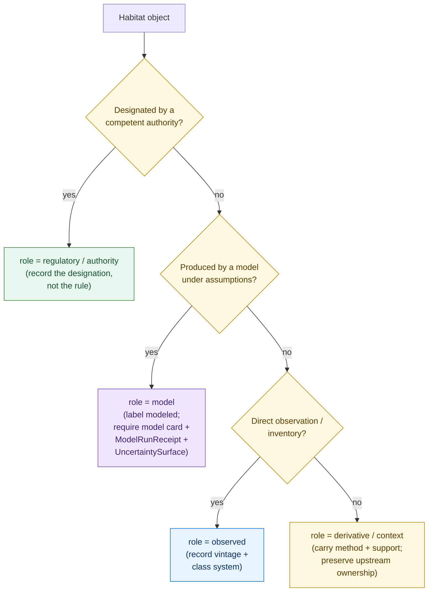
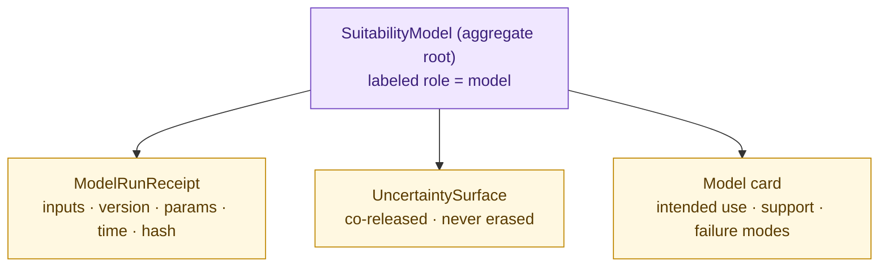

<!-- [KFM_META_BLOCK_V2]
doc_id: kfm://doc/habitat/model-vs-observation
title: Habitat Domain — Model vs Observation (Source-Role Anti-Collapse)
type: standard
status: draft
version: v1
owners: <TODO: domain-habitat-steward> + <TODO: contract-steward>
created: 2026-06-05
updated: 2026-06-05
policy_label: public
related:
  - docs/domains/habitat/README.md
  - docs/domains/habitat/HABITAT_DOMAIN_MODEL.md
  - docs/domains/habitat/HABITAT_SOURCE_LEDGER.md
  - docs/domains/habitat/HABITAT_SENSITIVITY_PROFILE.md
  - docs/domains/habitat/MAP_UI_CONTRACTS.md
  - docs/domains/habitat/IDENTITY_MODEL.md
  - contracts/domains/habitat/suitability_model.md
  - policy/domains/habitat/critical_habitat_vs_modeled.rego
  - schemas/contracts/v1/domains/habitat/
  - ai-build-operating-contract.md
  - docs/doctrine/directory-rules.md
tags: [kfm, habitat, source-role, anti-collapse, model-card, suitability, observation, regulatory]
notes:
  - CONTRACT_VERSION = "3.0.0"
  - This doc owns the source-role anti-collapse discipline for Habitat; tiers live in HABITAT_SENSITIVITY_PROFILE, families in HABITAT_DOMAIN_MODEL.
  - Source-role collapse is a publication-class defect: DENY at publication, ABSTAIN at the AI surface (Atlas §24.1).
  - Model-card requirement for SuitabilityModel is doctrine-intended but the field set is NEEDS VERIFICATION (DOM-HAB §N).
  - All repo-path claims are PROPOSED; the schema-home slug is CONFLICTED (see §8).
[/KFM_META_BLOCK_V2] -->

# 🪶 Habitat Domain — Model vs Observation

> The role-separation discipline for the Habitat lane: **observed**, **modeled**, and **regulatory** habitat are different things, with different source roles, badges, and burdens of proof — and flattening one into another is a publication-class defect. This doc fixes the distinctions and the model-card burden that keeps a `SuitabilityModel` honest.

  <b>Modeled ≠ Observed ≠ Regulatory · Labels stay visible · Models carry cards · Uncertainty is never erased</b>

**Status:** draft · **Owners:** `<TODO: domain-habitat-steward>` + `<TODO: contract-steward>` _(PROPOSED placeholders)_ · **Updated:** 2026-06-05 · `CONTRACT_VERSION = "3.0.0"`

> [!CAUTION]
> **The single most dangerous Habitat defect is source-role collapse.** A modeled suitability surface presented or queried as if it were observed land cover, or as if it were a regulatory critical-habitat designation, is a publication-class defect: **DENY at publication, ABSTAIN at the AI surface.** This document exists to make that collapse impossible to commit by accident. `[ATLAS §24.1]` `[DOM-HAB §C, §I]`

---

## Contents

1. [Why this distinction is load-bearing](#1-why-this-distinction-is-load-bearing)
2. [The three roles](#2-the-three-roles)
3. [Role decision rule](#3-role-decision-rule)
4. [What each role may and may not claim](#4-what-each-role-may-and-may-not-claim)
5. [The model-card requirement](#5-the-model-card-requirement)
6. [SuitabilityModel as an aggregate](#6-suitabilitymodel-as-an-aggregate)
7. [Where the distinction is enforced](#7-where-the-distinction-is-enforced)
8. [Binding to contract, schema & policy](#8-binding-to-contract-schema--policy)
9. [Anti-patterns](#9-anti-patterns)
10. [Open questions / verification / DoD](#open-questions-register)
11. [Related docs](#related-docs)

---

## 1. Why this distinction is load-bearing

KFM is an evidence-first system. The most consequential thing a habitat layer carries is **not its geometry but its source role** — the answer to "what kind of claim is this?" Three answers dominate the Habitat lane, and a reader who confuses them is misled in a way that geometry alone cannot reveal:

- **Observed** — "the land cover here was *observed* to be X" (e.g., NLCD).
- **Modeled** — "a model *predicts* this area is suitable habitat for Y under stated assumptions."
- **Regulatory** — "an authority has *designated* this area as critical habitat for Z."

These differ in **burden of proof**, **authority**, **error mode**, and **consequence of being wrong**. A modeled suitability surface dressed up as a regulatory designation invents authority KFM does not have. A model output relabeled as an observation hides its assumptions and uncertainty. The distinction is therefore not cosmetic — it is the spine of habitat trust. `[ENCY]` `[DOM-HAB §C]`

[↑ back to top](#top)

---

## 2. The three roles

| Role | Means | KFM's posture | Example source |
|---|---|---|---|
| **`observed`** | A direct observation / inventory. | KFM records the observation with its vintage and class system. | NLCD land cover; NWI wetlands (observation product) |
| **`model`** | A modeled surface/score under stated assumptions. | KFM labels it **modeled**; never promotes to authority or observation. | `SuitabilityModel` output; some GAP/LANDFIRE products |
| **`regulatory` / `authority`** | A designation made by a competent authority. | KFM records *that the designation exists*; it does **not** assert the rule itself. | USFWS ECOS critical habitat |

Two further roles complete the lane vocabulary (defined fully in `HABITAT_DOMAIN_MODEL.md`):

- **`derivative`** — a product derived from other objects (corridor, connectivity edge), carrying method and support; not a movement or management assertion.
- **`context`** — consumed from a neighbor lane via governed join; ownership stays with the source.

> [!IMPORTANT]
> "Modeled habitat" and "Regulatory critical habitat" are **distinct objects with distinct source roles**, not two views of one thing. A `SuitabilityModel` output is `model`; a critical-habitat layer is `regulatory`. They get separate manifests, separate badges, and separate burdens. `[DOM-HAB §C]` `[ATLAS §24.1]`

[↑ back to top](#top)

---

## 3. Role decision rule

When admitting or deriving a habitat object, the role is **declared, reviewed, and recorded** — never inferred from filename, URL, or convenience. `[IMPL-PIPE §13]`

> [!WARNING]
> If a single layer would need **two** roles to describe it honestly (e.g., "observed land cover, but reclassified by a model"), it is **two objects**, not one. Split it. A blended single object is how collapse happens. `[DOM-HAB §I]`

[↑ back to top](#top)

---

## 4. What each role may and may not claim

| | `observed` | `model` | `regulatory` |
|---|---|---|---|
| **May claim** | "X was observed here at vintage V." | "Under model M v.N, this area scores S for suitability, ± uncertainty." | "Authority A designated this area as critical habitat for Z on date D." |
| **May NOT claim** | a prediction or a designation | that it *is* the habitat, or that it is regulatory | a biological fact beyond the designation; the underlying rule's correctness |
| **Required companions** | vintage, class-system version | model card, `ModelRunReceipt`, `UncertaintySurface` | authority id, designation date, citation to the designation |
| **Error mode if wrong** | misclassification | model error / overconfidence | stale or misattributed designation |
| **Badge** | "observed" | "modeled" | "regulatory" |

> [!CAUTION]
> A `HabitatQualityScore` is **descriptive, never prescriptive** — it describes modeled quality under a stated model; it does not instruct management or assert regulatory status. And KFM is **never an alert/management authority** — no habitat layer may be framed as an emergency, safety, or regulatory instruction (`T4 forever`). `[DOM-HAB]` `[DOM-HAZ]`

[↑ back to top](#top)

---

## 5. The model-card requirement

Every published `SuitabilityModel` (and any `HabitatQualityScore` derived from a model) **carries a model card**. The card is what lets a reader judge whether a modeled claim is trustworthy for their purpose.

> [!NOTE]
> The model-card *requirement* is doctrine-intended (DOM-HAB §N lists "model-card requirements for suitability products" as an open verification item). The exact **field set** below is **PROPOSED / NEEDS VERIFICATION** until the contract `.md` and schema land.

**PROPOSED model-card fields:**

| Field | Why it matters |
|---|---|
| `model_id`, `model_version` | Identity; two versions are two objects. |
| `intended_use` | What the model is *for* — and, by implication, what it is not for. |
| `training / source support` | What evidence the model rests on; which sources, which vintages. |
| `spatial_resolution`, `valid_extent` | Where the model is meaningful; outside the extent it must not be read. |
| `uncertainty_bounds` | Carried on the companion `UncertaintySurface`; never omitted. |
| `fitness / validation metrics` | How well the model performs, and against what. |
| `known_failure_modes` | Where the model is known to mislead. |
| `model_run_receipt_ref` | Link to the `ModelRunReceipt` (inputs, parameters, time, hash). |

**Publication gate.** A `SuitabilityModel` output **without** a resolvable model card and `ModelRunReceipt` is **DENY**ed at publication; an AI surface asked to interpret a card-less model **ABSTAIN**s. `[DOM-HAB §K]` `[KFM-P25-PROG-0015]`

[↑ back to top](#top)

---

## 6. SuitabilityModel as an aggregate

A modeled suitability product is not a lone raster — it is an **aggregate** whose root is the model run, binding the surface, its proof, and its uncertainty so they cannot drift apart.

> [!IMPORTANT]
> The three companions are **co-released with the surface or not at all.** Publishing the suitability surface while dropping the `UncertaintySurface` (to "clean up" the layer) misrepresents confidence and is forbidden. `[ENCY]` `[DOM-HAB]`

[↑ back to top](#top)

---

## 7. Where the distinction is enforced

The role separation is enforced at every surface, not just at admission:

| Surface | Enforcement |
|---|---|
| **Admission (RAW)** | `SourceDescriptor` declares the role; unknown role → fail closed. |
| **Schema** | `object_type` + `source_role` are required fields; a model object missing a `model_run_receipt_ref` fails validation. |
| **Policy** | `critical_habitat_vs_modeled.rego` denies a modeled object queried/labeled as regulatory; `model_card_required.rego` denies a card-less model at publication. |
| **Map UI** | Critical-habitat view (`regulatory`) and modeled-habitat view (`model`) are **separate layers** with separate manifests and visible role badges. `[MAP-UI]` |
| **Evidence Drawer** | Source role per evidence ref is shown; collapse is forbidden in the drawer payload. |
| **Focus Mode / AI** | AI surfaces the role distinction; a model output is labeled "modeled," never "critical." Collapse → ABSTAIN. `[GAI]` |

> [!NOTE]
> The same fact must read the same way across all six surfaces. If the schema says `model` but the map badge says "critical habitat," that inconsistency is itself the defect. `[ATLAS §24.1]`

[↑ back to top](#top)

---

## 8. Binding to contract, schema & policy

| Layer | Home (PROPOSED) | Owns |
|---|---|---|
| **Meaning** | `contracts/domains/habitat/suitability_model.md`, `.../habitat_quality_score.md` | Authoritative role semantics. |
| **Shape** | `schemas/contracts/v1/domains/habitat/suitability_model.schema.json` *(slug CONFLICTED)* | `source_role`, `model_run_receipt_ref`, model-card linkage as required fields. |
| **Admissibility** | `policy/domains/habitat/critical_habitat_vs_modeled.rego`, `.../model_card_required.rego` | DENY on collapse / card-less publication. |
| **Proof** | `tests/domains/habitat/test_modeled_as_critical_denied.py`, `fixtures/domains/habitat/invalid/` | Negative path: modeled-as-critical → DENY. |

> [!WARNING]
> **Schema-home slug is `CONFLICTED` and ADR-required.** (1) Is `schemas/contracts/v1/…` confirmed as the canonical home? — **ADR-S-01** ("confirm by ADR-0001 **or amend**"; App. G VB-11-01 `NEEDS VERIFICATION`). (2) Segmented `…/domains/habitat/` (DIRRULES §12) vs flat `…/habitat/` (Atlas §24.13). CONFIRMED regardless: `.schema.json` never under `contracts/`; meaning lives in `contracts/`. File the drift; do not create both slugs. `[DIRRULES §6.4]` `[ATLAS §24.12 ADR-S-01]` `[§24.13]`

[↑ back to top](#top)

---

## 9. Anti-patterns

| Anti-pattern | Why it's dangerous | Fix |
|---|---|---|
| Modeled suitability rendered/labeled as "critical habitat" | Invents regulatory authority KFM does not have (`source_role_collapse`). | Separate `model` and `regulatory` layers + badges; DENY at publish, ABSTAIN at AI. |
| Model output relabeled as observation | Hides assumptions and uncertainty. | Keep `model` role visible; require the model card. |
| Publishing a `SuitabilityModel` without a model card | Reader cannot judge fitness; overconfidence leaks. | `model_card_required.rego` → DENY. |
| Dropping the `UncertaintySurface` to simplify a layer | Misrepresents confidence as fact. | Co-release uncertainty; never erase. |
| One layer carrying two roles ("observed but model-reclassified") | Collapse by construction. | Split into two objects (§3). |
| `HabitatQualityScore` read as a management instruction | Descriptive value treated as prescriptive directive. | Label descriptive; KFM is never a management/alert authority. |
| AI summary that calls a modeled patch "critical habitat" | Generation outranks evidence and invents authority. | AI surfaces the role; collapse → ABSTAIN; `EvidenceBundle` outranks generation. |

[↑ back to top](#top)

---

## Open questions register

| ID | Question | Owner role | Resolution path |
|---|---|---|---|
| OQ-HAB-MVO-01 | Exact model-card field set and which fields are publication-blocking. | Contract steward | DOM-HAB §N + contract `.md` + schema |
| OQ-HAB-MVO-02 | Which sources qualify as `regulatory`/`authority` for critical habitat vs `model` vs `context`. | Source + domain stewards | `HABITAT_SOURCE_LEDGER.md` + SourceDescriptors |
| OQ-HAB-MVO-03 | Schema-home slug (segmented vs flat) + ADR-0001 status (ADR-S-01). | Schema + docs stewards | ADR-S-01 + DRIFT_REGISTER |
| OQ-HAB-MVO-04 | Whether this doc's filename (`MODEL_VS_OBSERVATION.md`) is canonical or folds into `HABITAT_DOMAIN_MODEL.md`. | Docs steward | convention lock |
| OQ-HAB-MVO-05 | Whether `HabitatQualityScore` always implies `model` role, or can be `observed` (e.g., field-survey quality). | Domain steward | contract review |

## Open verification backlog

Before promotion from `draft` to `published`:

1. Confirm `critical_habitat_vs_modeled.rego` and `model_card_required.rego` exist and a negative-path fixture (modeled-as-critical → DENY) passes.
2. Confirm the `SuitabilityModel` schema requires `source_role`, `model_run_receipt_ref`, and a model-card linkage.
3. Confirm the model-card field set (OQ-HAB-MVO-01) against the contract `.md`.
4. Confirm the map UI renders `model` and `regulatory` as separate badged layers.
5. Confirm this file is linked from the Habitat README, `HABITAT_DOMAIN_MODEL.md`, and `MAP_UI_CONTRACTS.md`.

## Changelog v0 → v1

| Change | Type | Reason |
|---|---|---|
| Initial model-vs-observation doctrine | new | Fix source-role anti-collapse + model-card burden for Habitat |

> **Backward compatibility.** New file; no prior anchors. The `#top` target is present; all in-doc links resolve.

## Definition of done

- placed per Directory Rules and linked from the Habitat README + domain model;
- reviewed by the domain steward and a contract steward;
- the three roles map to enforceable schema + policy + tests;
- model-card requirement codified (or carried as NEEDS VERIFICATION with a tracking item);
- no conflict with Atlas §24.1 or `ai-build-operating-contract.md`;
- schema-slug conflict (OQ-HAB-MVO-03) logged in `docs/registers/DRIFT_REGISTER.md`.

---

## Related docs

- `docs/domains/habitat/README.md` — lane index *(PROPOSED)*
- `docs/domains/habitat/HABITAT_DOMAIN_MODEL.md` — object families & ubiquitous language; full role vocabulary *(PROPOSED)*
- `docs/domains/habitat/HABITAT_SOURCE_LEDGER.md` — which source carries which role *(PROPOSED)*
- `docs/domains/habitat/HABITAT_SENSITIVITY_PROFILE.md` — tiers & deny-by-default joins *(PROPOSED)*
- `docs/domains/habitat/MAP_UI_CONTRACTS.md` — separate badged layers for model vs regulatory *(PROPOSED)*
- `docs/domains/habitat/IDENTITY_MODEL.md` — role as part of identity; model run as aggregate *(PROPOSED)*
- `contracts/domains/habitat/suitability_model.md` — authoritative model meaning *(PROPOSED)*
- `policy/domains/habitat/critical_habitat_vs_modeled.rego` — collapse-denial policy *(PROPOSED)*
- `ai-build-operating-contract.md` — operating law; §23.2 sensitive-domain matrix *(`CONTRACT_VERSION = "3.0.0"`)*
- Atlas §24.1 (source-role anti-collapse) — **authority**
- `docs/doctrine/directory-rules.md` — §6.4, §9, §12
- Idea card: `KFM-P25-PROG-0015` (fail-closed habitat-assignment precision rule)
- `docs/registers/DRIFT_REGISTER.md` — schema-slug `CONFLICTED` entry *(PROPOSED)*

_Last updated: 2026-06-05 · `CONTRACT_VERSION = "3.0.0"`_

[↑ back to top](#top)
