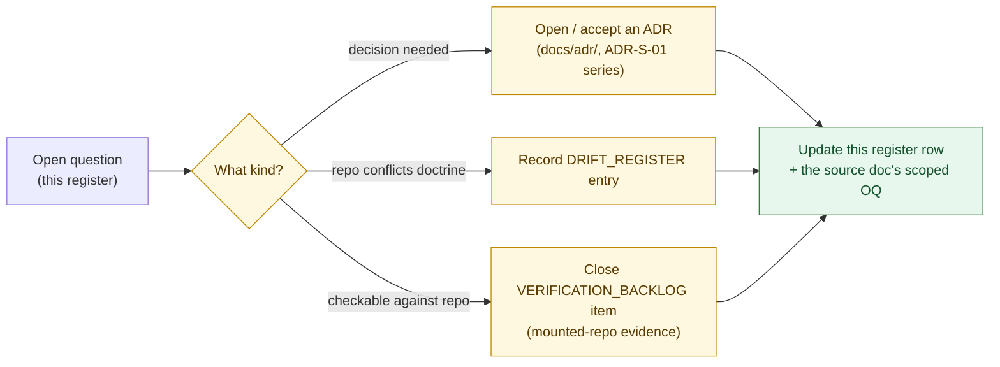

<!-- [KFM_META_BLOCK_V2]
doc_id: kfm://doc/habitat/open-questions
title: Habitat Domain — Open Questions Register
type: standard
status: draft
version: v1
owners: <TODO: domain-habitat-steward> + <TODO: docs-steward>
created: 2026-06-05
updated: 2026-06-05
policy_label: public
related:
  - docs/domains/habitat/README.md
  - docs/domains/habitat/MISSING_OR_PLANNED_FILES.md
  - docs/domains/habitat/HABITAT_DOMAIN_MODEL.md
  - docs/domains/habitat/HABITAT_SENSITIVITY_PROFILE.md
  - docs/domains/habitat/HABITAT_SOURCE_LEDGER.md
  - docs/domains/habitat/MODEL_VS_OBSERVATION.md
  - docs/registers/DRIFT_REGISTER.md
  - docs/registers/VERIFICATION_BACKLOG.md
  - docs/adr/
  - docs/doctrine/directory-rules.md
  - ai-build-operating-contract.md
tags: [kfm, habitat, open-questions, register, adr, drift, verification, tracker]
notes:
  - CONTRACT_VERSION = "3.0.0"
  - This is a TRACKER (non-canonical). Authoritative resolution lives in ADRs, the DRIFT_REGISTER, and the VERIFICATION_BACKLOG; this doc points at them.
  - The lane-wide blocker is the schema-home CONFLICT (ADR-S-01); it gates schema binding across the whole suite.
  - Rows aggregate the scoped OQ-HAB-* items from the individual Habitat docs; resolving a row here does not edit those docs.
  - All repo-path claims are PROPOSED until verified against a mounted repo.
[/KFM_META_BLOCK_V2] -->

# ❓ Habitat Domain — Open Questions Register

> The single roll-up of every unresolved decision in the Habitat lane: schema-home conflict, ADR-class questions, naming conflicts, source-rights verification, and the deny-by-default sensitivity items. A tracker, not an authority — it points at the ADRs, drift entries, and verification items that actually settle each question.

  <b>One place to see what's unresolved · Conflicts surfaced, not silently resolved · Deny-by-default until settled</b>

-lightgrey)

**Status:** draft · **Authority:** tracker — non-canonical for object meaning, schemas, policy, or release decisions · **Owners:** `<TODO: domain-habitat-steward>` + `<TODO: docs-steward>` _(PROPOSED placeholders)_ · **Updated:** 2026-06-05 · `CONTRACT_VERSION = "3.0.0"`

> [!IMPORTANT]
> This register **aggregates** the scoped `OQ-HAB-*` items raised across the individual Habitat docs. It does **not** resolve them. Each row points at the authoritative home — an ADR (incl. the open ADR-S-01 series), a `docs/registers/DRIFT_REGISTER.md` entry, or a `docs/registers/VERIFICATION_BACKLOG.md` item. Closing a row here means "the authoritative home recorded a decision," not "this file decided it."

---

## Contents

1. [How to read this register](#1-how-to-read-this-register)
2. [The lane-wide blocker: schema home](#2-the-lane-wide-blocker-schema-home)
3. [ADR-class open questions](#3-adr-class-open-questions)
4. [Naming & convention conflicts](#4-naming--convention-conflicts)
5. [Source-rights & verification backlog](#5-source-rights--verification-backlog)
6. [Sensitivity & deny-by-default items](#6-sensitivity--deny-by-default-items)
7. [Doc-scoped open questions (roll-up)](#7-doc-scoped-open-questions-roll-up)
8. [Resolution workflow](#8-resolution-workflow)
9. [Companion sections](#changelog-v0--v1)
10. [Related docs](#related-docs)

---

## 1. How to read this register

| Field | Meaning |
|---|---|
| **ID** | `OQ-HAB-NN` for register-level questions; scoped doc IDs (`OQ-HAB-DM-01`, etc.) are listed in §7. |
| **Status** | `CONFLICTED` (sources disagree), `NEEDS VERIFICATION` (checkable, unchecked), `OPEN` (decision not made), `UNKNOWN` (needs more evidence). |
| **Owner role** | The steward role that should drive resolution (placeholder until CODEOWNERS confirmed). |
| **Resolution home** | Where the authoritative decision lands: an ADR, the DRIFT_REGISTER, or the VERIFICATION_BACKLOG. |

> [!NOTE]
> "Resolving" a row means an ADR is accepted, a drift entry is recorded, or a verification item is closed against mounted-repo evidence. This tracker is then updated to reflect that — it never leads the decision. No repository was mounted in this session, so every repo-state claim referenced below is **PROPOSED**.

[↑ back to top](#top)

---

## 2. The lane-wide blocker: schema home

> [!CAUTION]
> **One conflict gates schema binding across the entire Habitat suite.** Until ADR-S-01 lands, every Habitat doc that names a `schemas/contracts/v1/…/habitat/` path is **CONFLICTED** on the slug, and schema *binding* (not authoring against meaning contracts) should not be frozen.

| ID | Question | Status | Owner role | Resolution home |
|---|---|---|---|---|
| **OQ-HAB-01** | **Is `schemas/contracts/v1/…` the canonical schema home?** ADR-0001 is **OPEN** per Atlas **ADR-S-01** ("confirm by ADR-0001 **or amend**"); App. G **VB-11-01** marks it `NEEDS VERIFICATION`. | **CONFLICTED** | Schema steward + Docs steward | ADR-S-01 + DRIFT_REGISTER |
| **OQ-HAB-02** | **Segmented vs flat slug.** Segmented `schemas/contracts/v1/domains/habitat/` (DIRRULES §12) vs flat `schemas/contracts/v1/habitat/` (Atlas §24.13 crosswalk). | **CONFLICTED** | Schema steward | ADR-S-01 + DRIFT_REGISTER |

**CONFIRMED regardless of how OQ-HAB-01/02 resolve:** `.schema.json` files never live under `contracts/`; `contracts/` holds object *meaning* (Markdown); the repo MUST NOT keep divergent definitions in both `schemas/` and `contracts/`. `[DIRRULES §6.4, §13.1]` `[ATLAS §24.12 ADR-S-01]` `[§24.13]`

[↑ back to top](#top)

---

## 3. ADR-class open questions

Decisions that require an ADR before the corresponding work is merged.

| ID | Question | Status | Owner role | Resolution home |
|---|---|---|---|---|
| OQ-HAB-03 | Model-card requirement for `SuitabilityModel`: mandatory field set + publication-gate enforcement. | NEEDS VERIFICATION | Contract steward | ADR + DOM-HAB §N |
| OQ-HAB-04 | Sensitivity tier scheme applied to Habitat × Fauna joins (T4-inheritance realization). | OPEN | Sensitivity steward | ADR (cf. Atlas §24.5) |
| OQ-HAB-05 | Modeled-vs-regulatory anti-collapse: DTO field discipline, OPA rule shape, drawer-badge contract. | OPEN | Domain steward | ADR (cf. Atlas §24.1) |
| OQ-HAB-06 | Cross-lane join policy (Habitat ↔ Fauna / Flora / Hydrology / Hazards): allowed join shapes, sensitivity inheritance, source-role preservation. | OPEN | Domain stewards | ADR |
| OQ-HAB-07 | Habitat PMTiles attestation profile (`.pmtiles.attest.json` sidecar shape). | OPEN | Release steward | ADR |
| OQ-HAB-08 | Rollback-propagation surface for derived Habitat artifacts (tiles, graph projections, AI caches). | OPEN | Release steward | ADR |
| OQ-HAB-09 | Promotion Gates A–G exact letter assignment for the T4→T1 / publication motion. | NEEDS VERIFICATION | Release steward | ADR |
| OQ-HAB-10 | `HabitatDecisionEnvelope` — Habitat-specific subtype or generic `DecisionEnvelope`? | OPEN | Contract steward | ADR + schema |
| OQ-HAB-11 | "Habitat assignment" ownership — Habitat-owned, Fauna-owned, or a cross-lane object under a non-domain root? | OPEN | Domain stewards (Habitat + Fauna) | ADR |
| OQ-HAB-12 | `SuitabilityModel` aggregate boundary — is the model run the right root over `ModelRunReceipt` + `UncertaintySurface`, or a separate aggregate? | OPEN | Domain steward | contract review + ADR |

[↑ back to top](#top)

---

## 4. Naming & convention conflicts

Open drift items (`OPEN-DR-*`) and doc-name reconciliations that affect Habitat.

| ID | Question | Status | Owner role | Resolution home |
|---|---|---|---|---|
| OQ-HAB-13 | `PROV.md` vs `PROVENANCE.md` standard filename (OPEN-DR-01). | OPEN | Docs steward | ADR + DRIFT_REGISTER |
| OQ-HAB-14 | Runbook layout: flat-prefix vs `docs/runbooks/<domain>/` subfolder (OPEN-DR-02). | OPEN | Docs steward | ADR |
| OQ-HAB-15 | Validator exit-code contract (PASS/FAIL/ERROR/ABSTAIN mapping) (OPEN-DR-03). | OPEN | Tooling steward | ADR |
| OQ-HAB-16 | Renderer package name (Cesium retirement) (OPEN-DR-10/-11). | OPEN | Map-UI steward | ADR |
| OQ-HAB-17 | `data/triplets/` plural-vs-singular form; confirm shared, non-domain-scoped placement (§9). | OPEN | Schema steward | ADR + DRIFT_REGISTER |
| OQ-HAB-18 | Fixture-home authority: root `fixtures/` vs `tests/fixtures/`. | NEEDS VERIFICATION | Tooling steward | repo inspection + ADR |
| OQ-HAB-19 | Doc-name reconciliation: `SOURCE_FAMILIES.md` ↔ `HABITAT_SOURCE_LEDGER.md`; `SENSITIVITY_AND_GEOPRIVACY.md` ↔ `HABITAT_SENSITIVITY_PROFILE.md`; whether `MODEL_VS_OBSERVATION.md` and `HABITAT_DOMAIN_MODEL.md` stay separate. | OPEN | Docs steward | convention lock |
| OQ-HAB-20 | Lane-doc filename conventions generally (e.g., `CONTRACTS.md` vs `*_LEDGER`/`*_PROFILE`). | OPEN | Docs steward | convention lock |

[↑ back to top](#top)

---

## 5. Source-rights & verification backlog

Checkable items requiring a mounted repo, a source-currentness review, or validator/runtime evidence. **Every per-source rights cell in the suite is NEEDS VERIFICATION** until a source-currentness review closes it.

| ID | Item | Status | Owner role | Resolution home |
|---|---|---|---|---|
| OQ-HAB-21 | Official critical-habitat (USFWS ECOS) source descriptors exist and validate. | NEEDS VERIFICATION | Source steward | VERIFICATION_BACKLOG (DOM-HAB §N) |
| OQ-HAB-22 | Per-source rights / license / attribution / cadence for every family (NLCD, NWI, GAP/LANDFIRE, NatureServe, KDWP, PAD-US, GBIF/iNat/iDigBio, USFWS). | NEEDS VERIFICATION | Source steward | source-currentness review + descriptor |
| OQ-HAB-23 | NatureServe controlled rare-data access gate terms (license, access controls). | NEEDS VERIFICATION | Source + sensitivity stewards | agreement + descriptor |
| OQ-HAB-24 | Sensitive-occurrence policy and geoprivacy transforms exist and are testable. | NEEDS VERIFICATION | Sensitivity steward | policy + fixtures |
| OQ-HAB-25 | Habitat MapLibre overlay registry and Focus Mode behavior are governed. | NEEDS VERIFICATION | Map-UI steward | layer registry + Focus tests |
| OQ-HAB-26 | Habitat × Fauna thin-slice fixtures exist and produce a closed catalog entry. | NEEDS VERIFICATION | Domain steward | mounted fixtures + dry-run logs |
| OQ-HAB-27 | Habitat owner/steward roles assigned in `CODEOWNERS` and `docs/governance/`. | UNKNOWN | Docs steward | mounted repo |
| OQ-HAB-28 | Habitat-lane phase status (Phase 2 of ENCY §12 backlog). | UNKNOWN | Domain steward | repo + ADR status |
| OQ-HAB-29 | Whether any listed Habitat file already exists (and CONFIRMs or CONFLICTs with the trackers). | UNKNOWN | Docs steward | mounted-repo evidence pass |

[↑ back to top](#top)

---

## 6. Sensitivity & deny-by-default items

> [!CAUTION]
> The items below are **fail-closed by default**. None may be resolved in the loosening direction without an ADR, a `ReviewRecord`, and the receipts the sensitivity profile requires. Disposition routes through `ai-build-operating-contract.md` §23.2; the tier rules live in `HABITAT_SENSITIVITY_PROFILE.md`. An *unresolved* sensitivity item means **deny**, not "allow pending review."

| ID | Question | Status | Owner role | Resolution home |
|---|---|---|---|---|
| OQ-HAB-30 | Join-inheritance realization: exact field/threshold for "most-restrictive input" tier inheritance on Habitat × sensitive-occurrence joins. | OPEN (fail-closed) | Sensitivity steward | `policy/sensitivity/` + ADR |
| OQ-HAB-31 | Precision threshold for fail-closed habitat assignment (`KFM-P25-PROG-0015`). | OPEN (fail-closed) | Domain + sensitivity stewards | policy constant + ADR |
| OQ-HAB-32 | Allowed geoprivacy transform set + parameters per object family (corridors vs patches). | NEEDS VERIFICATION | Sensitivity steward | `docs/standards/redaction-profiles.md` |
| OQ-HAB-33 | Where the joint Habitat × Fauna sensitivity policy canonically lives (`policy/sensitivity/` vs `policy/joins/habitat-fauna/`). | OPEN | Sensitivity steward | ADR |
| OQ-HAB-34 | Conditional-schema rule (`public_safe_geometry` required when occurrence geoprivacy is obscured/private/generalized) is present in the Habitat schema (`KFM-P25-PROG-0017`). | NEEDS VERIFICATION | Schema steward | schema + fixtures |

> [!IMPORTANT]
> These items are **non-negotiable in the safe direction.** A downgrade to T4 (more restrictive) is always permitted via `CorrectionNotice`; any move toward broader release requires the full receipt + review chain. `[ATLAS §24.5.3]`

[↑ back to top](#top)

---

## 7. Doc-scoped open questions (roll-up)

The scoped `OQ-HAB-*-NN` IDs raised in each Habitat doc, for traceability. These remain owned by their source docs; this table is an index, not a replacement.

| Source doc | Scoped IDs | Rolls up into |
|---|---|---|
| `HABITAT_DOMAIN_MODEL.md` | `OQ-HAB-DM-01..05` | OQ-HAB-01/02 (schema), -12 (aggregate), -11 (assignment), -19 (doc name) |
| `HABITAT_SENSITIVITY_PROFILE.md` | `OQ-HAB-SEN-01..06` | OQ-HAB-30/31/32/33, -01/02, -09 |
| `HABITAT_SOURCE_LEDGER.md` | `OQ-HAB-SRC-01..07` | OQ-HAB-22/23, -01/02, -19/-20 |
| `MODEL_VS_OBSERVATION.md` | `OQ-HAB-MVO-01..05` | OQ-HAB-03/05, -01/02, -19 |
| `IDENTITY_MODEL.md` | schema-home + identity-field items | OQ-HAB-01/02, -10 |
| `MAP_UI_CONTRACTS.md` | route / DTO / story-node items | OQ-HAB-10/-16/-25 |
| `EXPANSION_BACKLOG.md` / `EXPANSION_PLAN.md` | `ADR-HAB-001..006`, `VB-HAB-01..10` | OQ-HAB-01..09, -21..26 |
| `FILE_SYSTEM_PLAN.md` / `MISSING_OR_PLANNED_FILES.md` | placement / fixture-home / runbook items | OQ-HAB-14/-17/-18, -01/02 |
| `CONTINUITY_INVENTORY.md` | `habitat-fauna-thin-slice` placement | OQ-HAB-11, -06 |

> [!NOTE]
> When a scoped ID is closed in its source doc, update the matching register row here (and vice versa). The two are kept in sync by review, not automatically.

[↑ back to top](#top)

---

## 8. Resolution workflow

**Rules.** (1) No register row is marked resolved without a pointer to its authoritative home. (2) A `CONFLICTED` row stays `CONFLICTED` until an ADR or drift entry resolves it — it is never silently downgraded. (3) Sensitivity items (§6) fail closed while open. (4) Memory is not evidence: a row moves to CONFIRMED only on mounted-repo evidence or an accepted ADR.

[↑ back to top](#top)

---

## Changelog v0 → v1

| Change | Type | Reason |
|---|---|---|
| Initial Habitat open-questions register | new | Consolidate scoped OQ-HAB-* items into one lane roll-up |

> **Backward compatibility.** New file; no prior anchors. The `#top` target is present; all in-doc links resolve.

## Definition of done

- placed per Directory Rules and linked from the Habitat README;
- every row points at an authoritative resolution home (ADR / DRIFT_REGISTER / VERIFICATION_BACKLOG);
- the schema-home blocker (OQ-HAB-01/02) is reflected in `docs/registers/DRIFT_REGISTER.md`;
- sensitivity items (§6) are marked fail-closed;
- the §7 roll-up matches the scoped IDs in the source docs;
- reviewed by a docs steward and the domain steward.

## Open verification backlog (this file)

1. Confirm `docs/registers/DRIFT_REGISTER.md` and `VERIFICATION_BACKLOG.md` exist and carry the Habitat entries referenced here.
2. Confirm the ADR-S-01 series IDs against `docs/adr/`.
3. Reconcile the §7 scoped IDs against the actual source-doc registers once the suite is mounted.
4. Confirm CODEOWNERS for the owner-role placeholders (OQ-HAB-27).

---

## Related docs

- `docs/domains/habitat/README.md` — lane index *(PROPOSED)*
- `docs/domains/habitat/MISSING_OR_PLANNED_FILES.md` — file tracker (shares the verification items) *(PROPOSED)*
- `docs/domains/habitat/HABITAT_DOMAIN_MODEL.md` — families & ubiquitous language *(PROPOSED)*
- `docs/domains/habitat/HABITAT_SENSITIVITY_PROFILE.md` — tiers & deny-by-default (owns §6 rules) *(PROPOSED)*
- `docs/domains/habitat/HABITAT_SOURCE_LEDGER.md` — source rights (owns §5 rows) *(PROPOSED)*
- `docs/domains/habitat/MODEL_VS_OBSERVATION.md` — source-role anti-collapse (owns OQ-HAB-05) *(PROPOSED)*
- `docs/registers/DRIFT_REGISTER.md` — schema-slug `CONFLICTED` + OPEN-DR-* entries *(PROPOSED)*
- `docs/registers/VERIFICATION_BACKLOG.md` — repo-wide verification queue *(PROPOSED)*
- `docs/adr/` — accepted & proposed ADRs (incl. ADR-S-01 series)
- `ai-build-operating-contract.md` — §23.2 sensitive-domain matrix *(`CONTRACT_VERSION = "3.0.0"`)*
- `docs/doctrine/directory-rules.md` — §6.4, §9, §12

_Last updated: 2026-06-05 · `CONTRACT_VERSION = "3.0.0"`_

[↑ back to top](#top)
