<!-- [KFM_META_BLOCK_V2]
doc_id: kfm://doc/habitat/pipeline
title: Habitat Domain — Pipeline (Execution View)
type: standard
status: draft
version: v1
owners: <TODO: domain-habitat-steward> + <TODO: pipeline-steward>
created: 2026-06-05
updated: 2026-06-05
policy_label: public
related:
  - docs/domains/habitat/README.md
  - docs/domains/habitat/DATA_LIFECYCLE.md
  - docs/domains/habitat/HABITAT_SOURCE_LEDGER.md
  - docs/domains/habitat/HABITAT_SENSITIVITY_PROFILE.md
  - docs/domains/habitat/IDENTITY_MODEL.md
  - docs/domains/habitat/MODEL_VS_OBSERVATION.md
  - docs/domains/habitat/FILE_SYSTEM_PLAN.md
  - pipeline_specs/habitat/
  - pipelines/domains/habitat/
  - schemas/contracts/v1/domains/habitat/
  - ai-build-operating-contract.md
  - docs/doctrine/directory-rules.md
tags: [kfm, habitat, pipeline, execution, lifecycle, runner, spec, receipts, no-network]
notes:
  - CONTRACT_VERSION = "3.0.0"
  - This is the EXECUTION view (specs + runners). Phase SEMANTICS live in DATA_LIFECYCLE.md; the roadmap lives in EXPANSION_PLAN.md. Naming overlap PIPELINE vs DATA_LIFECYCLE is an open question.
  - pipeline_specs/ declares WHAT runs; pipelines/ is HOW it runs.
  - Promotion is a governed state transition, never a file move (DIRRULES §9). Watchers/connectors never publish (DIRRULES §13.5).
  - All repo-path claims are PROPOSED; the schema-home slug is CONFLICTED (see §9).
[/KFM_META_BLOCK_V2] -->

# ⚙️ Habitat Domain — Pipeline (Execution View)

> How a Habitat object actually moves from a fetched source to a public-safe released layer: the specs that declare the runs, the runners that execute them, the gate each stage must pass, and the receipts each stage emits — all no-network and fixture-first by default.

  <b>Specs declare · Runners execute · Gates govern · Receipts prove · No-network by default</b>

-1f6feb)

**Status:** draft · **Owners:** `<TODO: domain-habitat-steward>` + `<TODO: pipeline-steward>` _(PROPOSED placeholders)_ · **Updated:** 2026-06-05 · `CONTRACT_VERSION = "3.0.0"`

> [!IMPORTANT]
> This is the **execution** view of the Habitat lane. The **phase semantics** (what each lifecycle stage holds and the gate to the next) live in `DATA_LIFECYCLE.md`; the **phased roadmap** lives in `EXPANSION_PLAN.md`. This doc owns the **specs + runners + receipts** picture and does not restate the lifecycle law it depends on.

---

## Contents

1. [Scope & the spec/runner split](#1-scope--the-specrunner-split)
2. [Pipeline shape across the lifecycle](#2-pipeline-shape-across-the-lifecycle)
3. [Stage-by-stage: gate in, work, receipt out](#3-stage-by-stage-gate-in-work-receipt-out)
4. [The Habitat pipelines](#4-the-habitat-pipelines)
5. [Receipts & proofs emitted](#5-receipts--proofs-emitted)
6. [Watcher / connector discipline](#6-watcher--connector-discipline)
7. [Run discipline (no-network, deterministic)](#7-run-discipline-no-network-deterministic)
8. [Sensitivity in the pipeline](#8-sensitivity-in-the-pipeline)
9. [Where this binds to specs & schema](#9-where-this-binds-to-specs--schema)
10. [Anti-patterns](#10-anti-patterns)
11. [Open questions / verification / DoD](#open-questions-register)
12. [Related docs](#related-docs)

---

## 1. Scope & the spec/runner split

A Habitat pipeline has two halves, kept in separate responsibility roots:

| Half | Home (PROPOSED) | Owns | Answers |
|---|---|---|---|
| **Declarative spec** | `pipeline_specs/habitat/<name>.yaml` | inputs, source refs, steps, gates, outputs, expected receipts | *what* runs |
| **Executable runner** | `pipelines/domains/habitat/<name>.py` (or equiv.) | the code that performs the steps | *how* it runs |

The spec is the contract; the runner is the implementation. A run is reproducible because the spec pins its inputs (by `SourceDescriptor` ref and `spec_hash`) and the runner is deterministic (§7).

> [!NOTE]
> The lifecycle invariant — `RAW → WORK / QUARANTINE → PROCESSED → CATALOG / TRIPLET → PUBLISHED` — is **CONFIRMED doctrine** (Directory Rules §9). Promotion across it is a **governed state transition, not a file move**. A pipeline run *proposes* promotions; it does not *perform* publication by writing a file into `data/published/`. `[DIRRULES §9, §13.5]`

[↑ back to top](#top)

---

## 2. Pipeline shape across the lifecycle

```mermaid
flowchart LR
  classDef stage fill:#eef7ee,stroke:#2e7d32,color:#1b5e20;
  classDef block fill:#fdecea,stroke:#b71c1c,color:#7f1010;
  classDef gate fill:#fff8e1,stroke:#bf8700,color:#5a3b00;

  SRC["SourceDescriptor<br/>(data/registry/sources/habitat/)"]:::gate
  RAW["RAW<br/>data/raw/habitat/"]:::stage
  WORK["WORK<br/>data/work/habitat/"]:::stage
  QUAR["QUARANTINE<br/>data/quarantine/habitat/"]:::block
  PROC["PROCESSED<br/>data/processed/habitat/"]:::stage
  CAT["CATALOG / TRIPLET<br/>data/catalog/domain/habitat/ + data/triplets/"]:::stage
  CAND["release/candidates/habitat/<br/>(PromotionDecision)"]:::gate
  PUB["PUBLISHED<br/>data/published/layers/habitat/"]:::stage

  SRC -->|admit| RAW
  RAW -->|normalize| WORK
  WORK -->|gate fail| QUAR
  WORK -->|gate pass| PROC
  PROC -->|catalog + proof closure| CAT
  CAT -->|release candidate| CAND
  CAND -->|PromotionDecision: ALLOW| PUB
  PUB -.->|CorrectionNotice / RollbackCard| CAND
```

> [!NOTE]
> `data/triplets/` is **plural** and **shared / non-domain-scoped** (Directory Rules §9) — triplet projections do not live under a `data/triplets/habitat/` segment. The publication arrow is the **only** way into `data/published/`, and it is gated by a `PromotionDecision`; no runner writes there directly.

[↑ back to top](#top)

---

## 3. Stage-by-stage: gate in, work, receipt out

Each stage has an **entry gate**, the **work** the runner performs, and a **receipt/proof** it emits. (Phase *semantics* — what each stage means — are owned by `DATA_LIFECYCLE.md`; this is the execution mapping.)

| Stage | Entry gate | Work the runner does | Emits |
|---|---|---|---|
| **RAW** | `SourceDescriptor` exists; role + rights + sensitivity recorded | Capture immutable payload/reference; record source `spec_hash`, retrieval time | `RunReceipt` (ingest) |
| **WORK** | RAW present; spec resolvable | Normalize schema, geometry, time, identity, evidence; run validators | `ValidationReport` (PASS/FAIL) |
| **QUARANTINE** | WORK validation FAIL or sensitive hold | Hold material; record reason | quarantine reason record |
| **PROCESSED** | validation PASS + policy decision | Emit normalized objects + public-safe candidates; close digests | `EvidenceRef`, digest closure |
| **CATALOG / TRIPLET** | `EvidenceRef` resolves; `ValidationReport` present | Emit catalog records, `EvidenceBundle`, graph/triplet projections | `EvidenceBundle`, `AggregationReceipt` (where aggregated) |
| **RELEASE CANDIDATE** | catalog + proof closure | Assemble `ReleaseManifest` candidate + `RollbackCard`; request decision | `PromotionDecision` (ALLOW/HOLD/RESTRICT) |
| **PUBLISHED** | `PromotionDecision: ALLOW` | Publish public-safe artifacts via the trust membrane | `ReleaseManifest`; release badge |

> [!IMPORTANT]
> Validators are **PASS/FAIL** (internal); the caller-facing API uses `ANSWER/ABSTAIN/DENY/ERROR`; the **layer-manifest resolver uses `ANSWER/DENY/ERROR` only**; review/release uses `HOLD/ALLOW/RESTRICT`. A runner must not collapse these vocabularies. `[ATLAS §24.3.1/§24.3.2]`

[↑ back to top](#top)

---

## 4. The Habitat pipelines

The PROPOSED pipeline set for the lane. Each pairs a `pipeline_specs/habitat/<name>.yaml` (what) with a `pipelines/domains/habitat/<name>.*` runner (how).

| Pipeline | Source(s) | Produces | Source role | Notes |
|---|---|---|---|---|
| `ingest_nlcd` | NLCD | `LandCoverObservation` | `observed` | vintage + class-system version required |
| `build_habitat_patch` | `LandCoverObservation`, `EcologicalSystem` | `HabitatPatch` | `observed` / derived | patch identity per `IDENTITY_MODEL.md` |
| `ingest_critical_habitat` | USFWS ECOS | critical-habitat context layer | `regulatory` / `authority` | records the designation, not the rule |
| `compute_suitability` | patches + drivers + model | `SuitabilityModel` + `ModelRunReceipt` + `UncertaintySurface` | `model` | model card required; never labeled regulatory |
| `compute_connectivity` | patch graph | `ConnectivityEdge`, `Corridor` | `derivative` | least-cost path; carries method + support |
| `derive_restoration` | patches + stewardship | `RestorationOpportunity` | `derivative` | steward-review gated; T1 candidate |
| `ingest_padus` | PAD-US | `StewardshipZone` | `context` | T1 default |
| `habitat_fauna_assignment` *(cross-lane)* | `HabitatPatch` × Fauna `OccurrencePublic` | habitat assignment (public-safe) | join | **fail-closed**; geoprivacy + receipts required (§8) |

> [!CAUTION]
> `compute_suitability` produces a `model`-role object and **must not** be wired to emit into a critical-habitat (`regulatory`) layer, and vice versa. The role-separation discipline is owned by `MODEL_VS_OBSERVATION.md`; collapse is DENY at publication, ABSTAIN at the AI surface. The cross-lane `habitat_fauna_assignment` runner's *doctrine* lives at `docs/architecture/habitat-fauna-thin-slice.md` (non-domain root, §12). `[ATLAS §24.1]`

[↑ back to top](#top)

---

## 5. Receipts & proofs emitted

Pipelines emit receipts and proofs **alongside** the lifecycle directories, never as substitutes for them. These are shared-kernel objects — Habitat references, never redefines.

| Artifact | Emitted by stage | Home (PROPOSED) | Proves |
|---|---|---|---|
| `RunReceipt` | RAW, every run | `data/receipts/habitat/` | a run happened with stated inputs/version/time |
| `ValidationReport` | WORK | (with the run) | shape/policy checks PASS/FAIL |
| `EvidenceBundle` | CATALOG | `data/proofs/habitat/` | the evidence chain back to source |
| `ModelRunReceipt` | `compute_suitability` | `data/receipts/habitat/` | model inputs, version, params, time, hash |
| `RedactionReceipt` | any geoprivacy transform (§8) | `data/receipts/habitat/` | a specific transform was applied |
| `AggregationReceipt` | aggregation/binning | `data/receipts/habitat/` | the aggregation unit/method |
| `PromotionDecision` | release candidate | `release/candidates/habitat/<id>/` | the ALLOW/HOLD/RESTRICT release decision |
| `ReleaseManifest` | PUBLISHED | `release/candidates/habitat/<id>/` | what was published, with rollback target |
| `RollbackCard` | release candidate | `release/candidates/habitat/<id>/` | the prior release to restore |
| `CorrectionNotice` | post-publish correction | `release/candidates/habitat/<id>/` | a correction against a released artifact |

> [!NOTE]
> A modeled output (`SuitabilityModel`) is published only when its `ModelRunReceipt` **and** `UncertaintySurface` are co-released; dropping the uncertainty surface to "simplify" a layer is forbidden. `[ENCY]` `[DOM-HAB]`

[↑ back to top](#top)

---

## 6. Watcher / connector discipline

> [!WARNING]
> **Watcher-as-non-publisher.** Watchers and connectors **propose**, they never **promote**. A connector emits candidates to `data/raw/habitat/<source_id>/<run_id>/` or `data/quarantine/habitat/...` with `publication_state: WORK_CANDIDATE`. A connector that writes to `data/processed/`, `data/catalog/`, `data/published/`, or `release/` is a §13.5 anti-pattern. `[DIRRULES §13.5]`

- Connectors are **source-specific**, not domain-specific (e.g., `connectors/usgs/nlcd/`, `connectors/usfws/`), and they land only in RAW or QUARANTINE.
- A class-map / source drift watcher hashes inputs and emits a `WORK_CANDIDATE` on drift; a clean run emits nothing. It does not decide admission — policy does.
- Promotion past WORK is always a governed `PromotionDecision`, never a side effect of a fetch.

[↑ back to top](#top)

---

## 7. Run discipline (no-network, deterministic)

| Rule | Why |
|---|---|
| **No-network by default.** | Runs execute from fixtures (`fixtures/domains/habitat/`); live source fetches are a separate, gated connector step. A pipeline test must pass with no network. |
| **Deterministic.** | The same logical inputs produce the same `spec_hash` and the same outputs on any machine; non-deterministic serialization is an `ERROR` (per `IDENTITY_MODEL.md`). |
| **Fixture-first.** | The Habitat × Fauna thin slice proves the governed flow on synthetic public-safe fixtures before any live sensitive source is activated. |
| **Idempotent re-runs.** | Re-running a spec over the same inputs does not mint new identities (retrieval/release time do not rotate identity). |
| **Dry-run release.** | A release candidate can be assembled and a `PromotionDecision` requested **without** a public target, to prove the flow before publishing. |

[↑ back to top](#top)

---

## 8. Sensitivity in the pipeline

> [!CAUTION]
> **The cross-lane join stage fails closed.** When a pipeline joins a `HabitatPatch` to a sensitive Fauna/Flora occurrence, the *resulting product* inherits the most-restrictive tier and is **denied** until a documented geoprivacy transform plus `RedactionReceipt` + `ReviewRecord` + `PolicyDecision` carry the public-safe derivative to T1. Disposition routes through `ai-build-operating-contract.md` §23.2; the tier rules and transform vocabulary live in `HABITAT_SENSITIVITY_PROFILE.md`. This doc does not re-derive them. `[KFM-IDX-POL-003]` `[KFM-P25-PROG-0015]`

Pipeline-stage sensitivity behavior:

- **Geometry is transformed before tile generation**, not hidden by a style filter; the transform emits a `RedactionReceipt`.
- A habitat assignment **fails closed** when spatial precision is below the policy threshold or a sensitivity label requires withholding. `[KFM-P25-PROG-0015]`
- Controlled sources (NatureServe rare records) pass an access gate + license check before any derivative is produced. `[KFM-P25-PROG-0023]`
- A public-safe derivative cannot be inverted to recover the protected feature; if inversion is possible the correct pipeline outcome is **suppress** / stay denied.

[↑ back to top](#top)

---

## 9. Where this binds to specs & schema

| Layer | Home (PROPOSED) | Owns |
|---|---|---|
| **Declarative spec** | `pipeline_specs/habitat/<name>.yaml` | what runs, inputs, gates, expected receipts |
| **Runner** | `pipelines/domains/habitat/<name>.*` | how it runs |
| **Object shape** | `schemas/contracts/v1/domains/habitat/…` *(slug CONFLICTED)* | validates emitted objects |
| **Admissibility** | `policy/domains/habitat/`, `policy/sensitivity/` | per-stage allow/deny |
| **Proof** | `tests/domains/habitat/`, `fixtures/domains/habitat/` | no-network run tests |

> [!WARNING]
> **Schema-home slug is `CONFLICTED` and ADR-required.** (1) Is `schemas/contracts/v1/…` confirmed as the canonical home? — **ADR-S-01** ("confirm by ADR-0001 **or amend**"; App. G VB-11-01 `NEEDS VERIFICATION`). (2) Segmented `…/domains/habitat/` (DIRRULES §12) vs flat `…/habitat/` (Atlas §24.13). CONFIRMED regardless: `.schema.json` never under `contracts/`. File the drift; do not create both slugs. `[DIRRULES §6.4]` `[ATLAS §24.12 ADR-S-01]` `[§24.13]`

> [!NOTE]
> The validator exit-code contract (PASS/FAIL/ERROR/ABSTAIN mapping) used by these runners is an open drift item (OPEN-DR-03); a runner should not assume an exit-code mapping until that ADR lands.

[↑ back to top](#top)

---

## 10. Anti-patterns

| Anti-pattern | Why it's dangerous | Fix |
|---|---|---|
| Runner writes directly to `data/published/` | Bypasses the `PromotionDecision` gate; publication is not a file move. | Emit a release candidate; publish only on `ALLOW`. `[DIRRULES §9, §13.5]` |
| Connector writes past RAW/QUARANTINE | Violates watcher-as-non-publisher. | Land in `data/raw/` or `data/quarantine/` with `WORK_CANDIDATE`. |
| Lifecycle skip (RAW → PUBLISHED) | Skips validation, policy, catalog closure. | Walk every stage; each has a gate (§3). |
| `compute_suitability` emits into a regulatory layer | `source_role_collapse`. | Keep `model` and `regulatory` outputs separate; DENY at publish. |
| Dropping `UncertaintySurface` to simplify a modeled layer | Misrepresents confidence. | Co-release uncertainty + `ModelRunReceipt`. |
| Network fetch inside a transform/derivation step | Non-deterministic, untestable runs. | No-network; fetches are a separate gated connector step. |
| Style filter hides sensitive geometry instead of transforming it | Geometry still in tiles; bypassable. | Transform before tile generation; emit `RedactionReceipt`. |
| Re-run mints new identities | Breaks dedup/rollback. | Idempotent; retrieval/release time do not rotate identity. |

[↑ back to top](#top)

---

## Open questions register

| ID | Question | Owner role | Resolution path |
|---|---|---|---|
| OQ-HAB-PIPE-01 | Naming overlap: `PIPELINE.md` (execution) vs `DATA_LIFECYCLE.md` (semantics) vs `EXPANSION_PLAN.md` (roadmap) — confirm the three are distinct and named canonically. | Docs steward | convention lock (rolls into OQ-HAB-19/-20) |
| OQ-HAB-PIPE-02 | Exact `pipeline_specs/habitat/` spec schema (steps, gates, expected-receipts grammar). | Pipeline steward | spec schema + ADR |
| OQ-HAB-PIPE-03 | Validator exit-code contract for runners (OPEN-DR-03). | Tooling steward | ADR |
| OQ-HAB-PIPE-04 | Schema-home slug + ADR-0001 status (ADR-S-01). | Schema + docs stewards | ADR-S-01 + DRIFT_REGISTER |
| OQ-HAB-PIPE-05 | Where the cross-lane `habitat_fauna_assignment` runner lives (lane vs `tools/`/`pipelines/` topic root) given it spans Habitat + Fauna. | Domain stewards | ADR (§12 cross-cutting) |
| OQ-HAB-PIPE-06 | Promotion Gates A–G exact letter assignment in the release-candidate stage. | Release steward | ADR |

## Open verification backlog

Before promotion from `draft` to `published`:

1. Confirm `pipeline_specs/habitat/` and `pipelines/domains/habitat/` exist and which specs/runners are present.
2. Confirm a no-network thin-slice run produces the receipt chain in §5 and a dry-run `PromotionDecision`.
3. Confirm the cross-lane join stage fails closed (deny-exact, allow-generalized) with a `RedactionReceipt`.
4. Confirm no runner writes to `data/published/` outside a `PromotionDecision: ALLOW`.
5. Confirm this file is linked from the Habitat README and reconciled with `DATA_LIFECYCLE.md` (OQ-HAB-PIPE-01).

## Changelog v0 → v1

| Change | Type | Reason |
|---|---|---|
| Initial Habitat pipeline (execution) doc | new | Document specs + runners + receipts; separate execution from lifecycle semantics |

> **Backward compatibility.** New file; no prior anchors. The `#top` target is present; all in-doc links resolve.

## Definition of done

- placed per Directory Rules and linked from the Habitat README;
- the spec/runner split and the per-stage receipt chain match `DATA_LIFECYCLE.md` gates;
- no-network thin-slice run passes and emits the §5 chain;
- cross-lane join stage fails closed;
- naming overlap (OQ-HAB-PIPE-01) resolved or tracked;
- schema-slug conflict (OQ-HAB-PIPE-04) logged in `docs/registers/DRIFT_REGISTER.md`.

---

## Related docs

- `docs/domains/habitat/README.md` — lane index *(PROPOSED)*
- `docs/domains/habitat/DATA_LIFECYCLE.md` — phase semantics (this doc's companion) *(PROPOSED)*
- `docs/domains/habitat/HABITAT_SOURCE_LEDGER.md` — sources feeding these pipelines *(PROPOSED)*
- `docs/domains/habitat/HABITAT_SENSITIVITY_PROFILE.md` — owns the §8 tier/transform rules *(PROPOSED)*
- `docs/domains/habitat/IDENTITY_MODEL.md` — `spec_hash`, determinism, idempotent re-runs *(PROPOSED)*
- `docs/domains/habitat/MODEL_VS_OBSERVATION.md` — role separation for `compute_suitability` *(PROPOSED)*
- `docs/domains/habitat/FILE_SYSTEM_PLAN.md` — where specs, runners, data live *(PROPOSED)*
- `pipeline_specs/habitat/` — declarative specs *(PROPOSED home)*
- `pipelines/domains/habitat/` — executable runners *(PROPOSED home)*
- `ai-build-operating-contract.md` — §23.2 sensitive-domain matrix *(`CONTRACT_VERSION = "3.0.0"`)*
- `docs/doctrine/directory-rules.md` — §6.4, §9, §12, §13.5
- Idea cards: `KFM-P25-PROG-0015`, `KFM-P25-PROG-0017`, `KFM-P25-PROG-0023`, `KFM-IDX-POL-003`
- `docs/registers/DRIFT_REGISTER.md` — schema-slug `CONFLICTED` + OPEN-DR-03 entries *(PROPOSED)*

_Last updated: 2026-06-05 · `CONTRACT_VERSION = "3.0.0"`_

[↑ back to top](#top)
