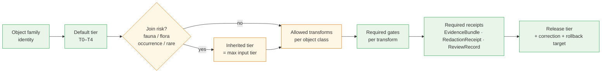

<!-- [KFM_META_BLOCK_V2]
doc_id: kfm://doc/<uuid-pending>
title: Habitat Preservation Matrix
type: standard
version: v1
status: draft
owners: <Habitat domain steward> · <Sensitivity reviewer> (placeholders pending owner registry verification)
created: 2026-05-17
updated: 2026-05-17
policy_label: public
related:
  - docs/domains/habitat/README.md
  - docs/domains/fauna/README.md
  - docs/architecture/cross-lane-join-policy.md
  - docs/standards/PROV.md
  - docs/runbooks/fauna/SOURCE_REFRESH_RUNBOOK.md
  - control_plane/policy_gate_register.yaml
  - control_plane/release_state_register.yaml
tags: [kfm, habitat, preservation, sensitivity, tier, governance, deny-default]
notes:
  - Tier scheme T0–T4 remains PROPOSED pending ADR-S-05.
  - All paths, route names, and schema homes labeled PROPOSED until mounted-repo verification.
  - Cross-lane join sensitivity (habitat × fauna) is CONFIRMED doctrine; precise generalization radii are PROPOSED.
[/KFM_META_BLOCK_V2] -->

# 🌿 Habitat Preservation Matrix

> Normative reference: how each Habitat-owned object family is **preserved** across the KFM lifecycle — what tier it defaults to, what transforms are allowed, what gates must fire, and how cross-lane joins change its preservation posture.

<!-- BADGE ROW -->

-orange)

<!-- TODO: replace placeholders with CI-driven Shields endpoints once owner & build URLs are confirmed. -->

**Status:** draft &middot; **Owners:** Habitat domain steward · Sensitivity reviewer *(placeholders)* &middot; **Last updated:** 2026-05-17

---

## Mini Table of Contents

- [1. Purpose](#1-purpose)
- [2. Scope and Boundaries](#2-scope-and-boundaries)
- [3. Preservation Dimensions](#3-preservation-dimensions)
- [4. Object Family × Preservation Matrix](#4-object-family--preservation-matrix)
- [5. Allowed Transforms](#5-allowed-transforms)
- [6. Tier Transitions (Allowed Motion)](#6-tier-transitions-allowed-motion)
- [7. Cross-Lane Join Sensitivity](#7-cross-lane-join-sensitivity)
- [8. Model vs Observation Discipline](#8-model-vs-observation-discipline)
- [9. Lifecycle Gate Reference](#9-lifecycle-gate-reference)
- [10. AI Surface Preservation](#10-ai-surface-preservation)
- [11. Required Receipts and Artifacts](#11-required-receipts-and-artifacts)
- [12. Open Questions and Verification Backlog](#12-open-questions-and-verification-backlog)
- [13. Related Docs](#13-related-docs)
- [Appendix A — Per-Object Preservation Cards](#appendix-a--per-object-preservation-cards)

---

## 1. Purpose

This document is the **habitat-specific preservation regime**: a single matrix that names, per Habitat object family, the sensitivity tier default, the transforms that are allowed to move the object between tiers, the gates that must fire to authorize each transform, and the join conditions that change the preservation posture. It localizes the master sensitivity / rights tier scheme to the realities of the Habitat lane.

> [!NOTE]
> The Habitat Preservation Matrix is a **reference**, not a publisher. It is read by validators, policy bundles, the Evidence Drawer, governed AI surfaces, and human stewards. Promotion still happens through the governed lifecycle described in §9; this doc defines the *contents* of those decisions, not the *fact* of them. **(CONFIRMED doctrine; PROPOSED operational binding to specific validator / policy artifacts.)**

[⬆ Back to top](#mini-table-of-contents)

---

## 2. Scope and Boundaries

### In scope (CONFIRMED doctrine for Habitat ownership)

| Habitat owns | Definition source |
|---|---|
| HabitatPatch | Atlas §6 · Encyclopedia §7.4 |
| LandCoverObservation | Atlas §6 · Encyclopedia §7.4 |
| EcologicalSystem | Atlas §6 · Encyclopedia §7.4 |
| HabitatQualityScore | Atlas §6 · Encyclopedia §7.4 |
| SuitabilityModel | Atlas §6 · Encyclopedia §7.4 |
| ConnectivityEdge | Atlas §6 · Encyclopedia §7.4 |
| Corridor | Atlas §6 · Encyclopedia §7.4 |
| RestorationOpportunity | Atlas §6 · Encyclopedia §7.4 |
| StewardshipZone | Atlas §6 · Encyclopedia §7.4 |
| ModelRunReceipt | Atlas §6 · Encyclopedia §7.4 |
| UncertaintySurface | Atlas §6 · Encyclopedia §7.4 |

### Explicitly out of scope (CONFIRMED non-ownership)

- **Fauna taxa, occurrence records, sensitive sites, range polygons** — owned by Fauna. Habitat joins through governed relations only.
- **Plant taxa, rare plant records, vegetation communities (taxonomic identity)** — owned by Flora. Habitat references vegetation as ecological context, not taxonomic truth.
- **Hydrology / Soil / Agriculture / Hazards** — provide ecological context through governed joins, not preservation rules for Habitat objects.

> [!IMPORTANT]
> Habitat outputs that are joined to Fauna or Flora records **inherit the sensitivity of the joined party**. This matrix governs the Habitat side of the join; the Fauna and Flora preservation rules govern theirs. The join product's tier is the **maximum** (most restrictive) of the inputs' tiers, never the minimum. **(CONFIRMED doctrine; see §7.)**

[⬆ Back to top](#mini-table-of-contents)

---

## 3. Preservation Dimensions

Five dimensions define the preservation posture of every Habitat object on every release. Each dimension is enforced at a different gate; none can be silently waived.

*Diagram status:* **CONFIRMED** for the existence of each gate stage (lifecycle invariant). **PROPOSED** for the specific data-flow shape and the conditional join branch as drawn — exact binding to validator code and policy IDs is NEEDS VERIFICATION pending mounted-repo inspection.

| # | Dimension | What it preserves | Authority |
|---|---|---|---|
| 1 | **Default tier (T0–T4)** | The least-public-safe representation that is also still useful. | Atlas §24.5.1–§24.5.2 (PROPOSED tier scheme; ADR-S-05). |
| 2 | **Allowed transforms** | The named ways an object may move toward less-restrictive tiers (generalize, aggregate, redact, withhold). | Atlas §24.5.2; Habitat dossier §I. |
| 3 | **Required gates** | The pipeline gates and review states that must fire to authorize a transform. | Atlas §24.6 master lifecycle gates; Habitat dossier §H. |
| 4 | **Join sensitivity** | The inherited tier when an object is joined to a sensitive lane (typically Fauna occurrence). | Encyclopedia §7.4; New Ideas 5-15; CONFIRMED doctrine. |
| 5 | **Model vs observation label** | The distinction between modeled output and observed evidence, preserved across all releases. | Habitat dossier §D; Encyclopedia §7.4. |

[⬆ Back to top](#mini-table-of-contents)

---

## 4. Object Family × Preservation Matrix

The core matrix. Each row is one Habitat-owned object family. Each cell is **PROPOSED** unless an explicit citation is given to the Atlas, Encyclopedia, or Directory Rules.

> [!CAUTION]
> All **Default tier** values for object families not named in Atlas §24.5.2 are **PROPOSED** for ADR-S-05 review. The only object families with directly cited defaults in the master supplement are *HabitatPatch / EcologicalSystem* (T0 mostly; T1 for stewardship zones). All others below are proposed by inference from doctrine and require sensitivity-reviewer sign-off.

<!-- markdownlint-disable MD013 -->

| Object family | Default tier (PROPOSED unless cited) | Allowed transforms | Required gates | Join-sensitivity rule | Model/observation label | Citation |
|---|---|---|---|---|---|---|
| **HabitatPatch** | T0 (CONFIRMED supplement default for HabitatPatch / EcologicalSystem) | Generalize boundary; aggregate to coarse cell → T0; redact patches that disclose sensitive occurrence → T1; withhold → T4. | RAW → WORK validator; PROCESSED catalog closure; ReviewRecord if join to sensitive Fauna. | Joined to sensitive occurrence ⇒ inherits T4 unless RedactionReceipt + ReviewRecord. | observation (derived from LandCover or stewardship survey) | Atlas §24.5.2; Encyclopedia §7.4 |
| **LandCoverObservation** | T0 (PROPOSED — open authoritative source families: NLCD, GAP, LANDFIRE, NWI) | Reclassify to coarser legend; resample to coarser grid; clip to release AOI. | RAW → WORK validator; ValidationReport; source-role check. | Generally low-risk; T1 only if joined product reveals a sensitive site. | observation | Encyclopedia §7.4; Habitat dossier §D |
| **EcologicalSystem** | T0 (CONFIRMED supplement default) | Generalize community label; aggregate to ecological-region scale. | PROCESSED catalog closure; ReviewRecord on community-rarity flagging. | T2 or T4 if the system identifies a rare community whose location implies sensitive species presence. | observation/classification | Atlas §24.5.2; Encyclopedia §7.4 |
| **HabitatQualityScore** | T1 (PROPOSED) | Bin to coarse score classes; aggregate to grid; suppress when score density implies sensitive species concentration. | ModelRunReceipt + ValidationReport; ReviewRecord required if joined to sensitive Fauna inputs. | Inherits sensitive-fauna tier through training inputs; AggregationReceipt required for T0. | **model** | Habitat dossier §G; Encyclopedia §7.4 |
| **SuitabilityModel** | T1 (PROPOSED) | Generalize score bands; release model-card without raw training points; release surface clipped of sensitive areas. | ModelRunReceipt; ValidationReport; ReviewRecord; PolicyDecision if training data is sensitive. | If trained on sensitive occurrence, surface inherits T2 minimum; exact training points never published. | **model** (label REQUIRED on every release) | Habitat dossier §D, §G; New Ideas 5-15 join-induced sensitivity |
| **ConnectivityEdge** | T1 (PROPOSED) | Generalize endpoints to patch centroids; aggregate edges by ecological-region pair. | PROCESSED catalog closure; ReviewRecord if endpoints implicate sensitive sites. | Inherits sensitive-fauna tier if connectivity is computed against sensitive occurrence data. | **model** (least-cost path is modeled) | Habitat dossier §G; Encyclopedia §7.4 |
| **Corridor** | T1 (PROPOSED) | Generalize corridor polygon; widen buffer to obscure precise paths near sensitive sites. | ReviewRecord; RedactionReceipt for sensitive overlap. | T2 or T4 when corridor coincides with sensitive-species movement evidence. | **model** | Habitat dossier §G; Encyclopedia §7.4 |
| **RestorationOpportunity** | T1 (PROPOSED) | Generalize parcel boundary; redact owner identity; aggregate by stewardship zone. | ReviewRecord (private-land join always); PolicyDecision. | T2 minimum if joined to private parcel data; never directly publishes owner identity. | **model** (prioritization is modeled) | Habitat dossier §G; cross-lane policy with People/Land |
| **StewardshipZone** | T1 (CONFIRMED supplement default) | Generalize boundary; redact internal management notes; suppress location entirely if steward requests. | ReviewRecord by named steward; PolicyDecision; CorrectionNotice path active. | T2 or T4 by steward request; deny-by-default for tribal / sovereign stewardship areas. | observation/declaration | Atlas §24.5.2; Encyclopedia §7.4 |
| **ModelRunReceipt** | T0 (PROPOSED — receipt itself is meta) | Redact embedded source identifiers if they reference sensitive sources. | EvidenceBundle closure; spec_hash present. | If receipt references training data that itself is T4, the receipt's *content* may need redaction but the receipt's *existence* remains T0. | meta | Encyclopedia §7.4; PROV.md alignment |
| **UncertaintySurface** | matches parent (PROPOSED) | Generalize at the same scale as the surface it qualifies; never published at finer resolution than its parent. | Same gates as parent model output. | Inherits parent tier; never escapes it. | **model** | Habitat dossier §D, §G |

<!-- markdownlint-enable MD013 -->

> [!WARNING]
> **Modeled-as-critical denial.** A modeled suitability surface, ConnectivityEdge, or Corridor must **never** be presented as if it were a regulatory critical-habitat designation. The label `model` is required on every release; flattening model output into observation is a release-class drift event and triggers `MODEL_LABEL_COLLAPSE` (PROPOSED reason code). **(CONFIRMED doctrine; PROPOSED reason-code identifier.)**

[⬆ Back to top](#mini-table-of-contents)

---

## 5. Allowed Transforms

Transforms are named, deterministic, receipt-bearing operations. Improvised or undocumented redaction is not a transform; it is a release defect. Each transform listed below is **PROPOSED** as a Habitat-lane realization of the broader transform vocabulary referenced across the Atlas and Fauna dossier.

| Transform | What it does | Allowed on | Receipt class | Notes |
|---|---|---|---|---|
| `generalize:boundary` | Snap polygon to coarser cell or simplify perimeter. | HabitatPatch, EcologicalSystem, StewardshipZone, Corridor, RestorationOpportunity | RedactionReceipt | Records cell size or simplification tolerance. |
| `generalize:legend` | Reclassify to a coarser categorical legend. | LandCoverObservation, EcologicalSystem | RedactionReceipt | Preserves classification provenance. |
| `aggregate:grid` | Roll up to a fixed grid (e.g., HUC12, county). | HabitatQualityScore, SuitabilityModel, ConnectivityEdge | AggregationReceipt | Records grid identity and inclusion rule. |
| `bin:score` | Coarsen continuous score to discrete bands. | HabitatQualityScore, SuitabilityModel, UncertaintySurface | RedactionReceipt | Records bin edges. |
| `clip:area` | Restrict surface to a release AOI. | SuitabilityModel, UncertaintySurface, ConnectivityEdge | RedactionReceipt | Records clip geometry hash. |
| `withhold:feature` | Suppress an individual record from a release. | any | RedactionReceipt | Records reason class (rights, sensitivity, review, rollback). |
| `suppress:layer` | Remove an entire layer pending review. | any | RedactionReceipt + RollbackCard | Used during quarantine and rollback. |
| `relabel:model` | Re-assert `model` label on a release where labeling was ambiguous. | SuitabilityModel, HabitatQualityScore, ConnectivityEdge, Corridor, RestorationOpportunity, UncertaintySurface | CorrectionNotice | Used to correct a model/observation collapse. |

> [!NOTE]
> Every transform emits a receipt; the receipt is itself a first-class object that travels with the release. A release that claims a transform without a receipt is not a release — it is a defect, and downstream validators are expected to reject it. **(CONFIRMED doctrine; PROPOSED specific schema homes.)**

[⬆ Back to top](#mini-table-of-contents)

---

## 6. Tier Transitions (Allowed Motion)

The motion rules below are a habitat-lane reading of Atlas §24.5.3. **A tier upgrade (toward more public) always needs both a transform receipt and a review record; a tier downgrade (toward less public) only needs a correction record.**

| From → To | Required artifact | Required reviewer | Reversibility |
|---|---|---|---|
| T4 → T2 | PolicyDecision + ReviewRecord | Habitat steward + Sensitivity reviewer | Reversible: review revocation returns object to T4. |
| T4 → T1 | RedactionReceipt + ReviewRecord | Habitat steward + Sensitivity reviewer | Reversible: correction may demote a published T1 to T4. |
| T2 → T1 | RedactionReceipt + ReviewRecord | Habitat steward | Reversible. |
| T1 → T0 | ReleaseManifest + ReviewRecord | Habitat steward + Release authority | Reversible via RollbackCard. |
| any → T4 (downgrade) | CorrectionNotice + ReviewRecord | Habitat steward; rights-holder if applicable | Always permitted; precedes derivative invalidation. |

> [!IMPORTANT]
> **Any released Habitat artifact joined to a Fauna occurrence that is later reclassified as sensitive** must be demoted via the `any → T4` rule above. Demotion does not erase audit history; it withdraws the public surface and points downstream consumers at a CorrectionNotice. **(CONFIRMED doctrine; PROPOSED specific tooling.)**

[⬆ Back to top](#mini-table-of-contents)

---

## 7. Cross-Lane Join Sensitivity

The most important habitat-specific rule. A habitat object is rarely sensitive on its own; it becomes sensitive when joined to a sensitive lane. The Encyclopedia and Habitat dossier are explicit on this point: *"Habitat layers may reveal sensitive species context when joined to occurrence records; exact occurrence-linked habitat outputs must be generalized, redacted, reviewed, or denied when they create exposure risk."* (Habitat dossier §I; Encyclopedia §7.4. **CONFIRMED**.)

### 7.1 Join targets and inherited tiers

| Join | Inherited tier | Required posture | Citation |
|---|---|---|---|
| Habitat × Fauna **OccurrenceRestricted / SensitiveSite** | T4 unless RedactionReceipt + ReviewRecord move the *derived* product to T1. | Deny by default; fail-closed; never publish join product at finer resolution than the generalized Fauna product. | Atlas §24.5.2; Fauna dossier §I. |
| Habitat × Fauna **OccurrencePublic** (already generalized) | T1 (matches the joined Fauna tier). | RedactionReceipt on the join product; preserve the geoprivacy already applied by Fauna. | Fauna dossier §I; New Ideas 5-15. |
| Habitat × Fauna **RangePolygon** | T1. | AggregationReceipt or RedactionReceipt on the join product. | Atlas §24.5.2. |
| Habitat × Flora **RarePlantRecord** | T4 unless transform + review move it to T1. | Same posture as Fauna sensitive occurrence. | Atlas §24.5.2; Flora dossier §I. |
| Habitat × People/Land **private parcel** | T2 minimum; T4 if owner identity surfaces. | Reject the join at validation time unless an aggregation rule is named. | People/Land dossier (cross-lane). |
| Habitat × Hydrology / Soil / Atmosphere | T0 (no inherited sensitivity by default). | Standard release gates apply. | Encyclopedia §7.4. |

### 7.2 Join receipts

Every habitat × sensitive-lane join product carries, at minimum:

1. A **RedactionReceipt** documenting the transform that converted the sensitive input into a public-safe representation (radius, grid, bin, withhold reason).
2. A **ReviewRecord** signed by the named sensitivity reviewer.
3. A **PolicyDecision** referencing the policy rule that authorized the release.
4. A reference back to both inputs' **EvidenceBundles** so the join is auditable.

> [!CAUTION]
> Sensitivity is a property of the **product**, not just the inputs. A LandCoverObservation joined to a public Occurrence may still produce a T4 surface if the resulting density map reveals nesting concentrations. Validators must evaluate the *output*, not infer safety from the *inputs*. **(CONFIRMED doctrine, New Ideas 5-15; PROPOSED validator binding.)**

[⬆ Back to top](#mini-table-of-contents)

---

## 8. Model vs Observation Discipline

Habitat is unusual among KFM domains because much of its public output is **modeled**: suitability surfaces, connectivity edges, corridors, restoration prioritizations, and uncertainty surfaces. The doctrine is clear and **CONFIRMED**: *"Keep model vs observation labels visible."* (Encyclopedia §7.4.)

| Class | Examples | Required preservation |
|---|---|---|
| **Observation** | HabitatPatch (derived from LandCover survey), LandCoverObservation, EcologicalSystem (classification), StewardshipZone (declaration) | Label `observation`; preserve source role; preserve observed time vs valid time. |
| **Model** | SuitabilityModel, HabitatQualityScore, ConnectivityEdge, Corridor, RestorationOpportunity, UncertaintySurface | Label `model`; carry ModelRunReceipt; expose model card (version, training support, spatial resolution, uncertainty); never flatten into "critical habitat" framing. |

### 8.1 Model release expectations

A modeled Habitat output requires, before release:

- **ModelRunReceipt** — version, parameters, training source identity, spatial resolution, support, uncertainty band, release time.
- **UncertaintySurface** — must travel with the parent model output; never released at finer resolution than its parent.
- **Model card** — concise, human-readable. *(PROPOSED file location: `docs/domains/habitat/model_cards/<model-id>.md` — NEEDS VERIFICATION.)*
- **`relabel:model` correction path** active in case a downstream consumer collapses the label.

> [!WARNING]
> Suitability surfaces are not regulatory critical habitat. The Habitat lane consumes critical-habitat designations (e.g., USFWS ECOS) as a regulatory **authority** source role; it never emits a designation. Confusing the two is a release-class drift event. **(CONFIRMED doctrine; source rights for ECOS-style sources remain NEEDS VERIFICATION.)**

[⬆ Back to top](#mini-table-of-contents)

---

## 9. Lifecycle Gate Reference

Habitat objects follow the universal invariant `RAW → WORK / QUARANTINE → PROCESSED → CATALOG / TRIPLET → PUBLISHED`. The gates below are habitat-localized — each names what an object class needs to clear the gate.

| Stage | Habitat-side handling | Gate (must hold) | Status |
|---|---|---|---|
| **RAW** | Capture immutable source payload (NLCD tile, GAP raster, USFWS critical habitat feature service response, NatureServe export, field-survey form) with role / rights / sensitivity / citation / time / hash. | SourceDescriptor exists. | CONFIRMED doctrine / PROPOSED implementation. |
| **WORK / QUARANTINE** | Normalize schema, geometry, time, identity, evidence, rights, and policy. Sensitive joins fail closed into QUARANTINE. | ValidationReport + PolicyDecision pass, or quarantine reason recorded. | CONFIRMED doctrine / PROPOSED implementation. |
| **PROCESSED** | Emit validated HabitatPatches, EcologicalSystems, modeled surfaces with ModelRunReceipt, redaction-aware public-safe candidates. | EvidenceRef, ValidationReport, digest closure exist. | CONFIRMED doctrine / PROPOSED implementation. |
| **CATALOG / TRIPLET** | Emit catalog records, EvidenceBundles, graph/triplet projections, release candidates. | Catalog/proof closure passes. | CONFIRMED doctrine / PROPOSED implementation. |
| **PUBLISHED** | Serve released public-safe artifacts through governed API and LayerManifest; correction path active; rollback target named. | ReleaseManifest + rollback target + correction path + ReviewRecord (where required). | CONFIRMED doctrine / PROPOSED implementation. |
| **CORRECTION (PUBLISHED → PUBLISHED′)** | Detected error or new evidence; downstream derivatives identified; superseding release. | CorrectionNotice + RollbackCard if rollback required. | CONFIRMED doctrine / PROPOSED implementation. |

### 9.1 Habitat-specific quarantine reasons (PROPOSED)

| Reason code | When it fires |
|---|---|
| `JOIN_SENSITIVE_OCCURRENCE` | A habitat product attempts to publish at a resolution finer than the joined Fauna geoprivacy product. |
| `MODEL_LABEL_COLLAPSE` | A modeled output is labeled or framed as observation / regulatory designation. |
| `CRITICAL_HABITAT_FRAMING` | A modeled suitability surface is framed as critical habitat or regulatory designation. |
| `STEWARD_ZONE_OVERRIDE` | A release would override a steward-declared withholding of a StewardshipZone. |
| `UNCERTAINTY_MISSING` | A modeled surface is being released without a paired UncertaintySurface. |

> [!NOTE]
> Reason codes are **PROPOSED** for ADR-S-04-class vocabulary review and remain NEEDS VERIFICATION until a mounted policy-gate register confirms them.

[⬆ Back to top](#mini-table-of-contents)

---

## 10. AI Surface Preservation

The governed AI surface is bound to the same preservation rules as the public map and API.

- AI **may** summarize released Habitat EvidenceBundles, compare evidence across model versions, explain limitations, and draft steward-review notes. **(CONFIRMED doctrine.)**
- AI **must** ABSTAIN when evidence is insufficient and **DENY** where policy, rights, sensitivity, or release state blocks the request. **(CONFIRMED doctrine.)**
- AI **never** reads RAW or WORK content; only released EvidenceBundle. **(CONFIRMED doctrine.)**
- AI must **never** narrate a modeled Habitat output as if it were observation or regulatory designation; the `model` label is enforced in the response envelope.

| AI behavior | Habitat rule | Receipt |
|---|---|---|
| Summarize habitat patch | Allowed on released EvidenceBundle only; cite back to bundle. | AIReceipt with EvidenceRef. |
| Explain suitability surface | Must surface `model` label, model version, and uncertainty band. | AIReceipt + ModelRunReceipt reference. |
| Compare habitat over time | Allowed; must surface land-cover version and observed-vs-modeled distinction. | AIReceipt. |
| Discuss sensitive occurrence association | Denied unless the join product is at a published public-safe tier. | DENY outcome; PolicyDecision recorded. |

[⬆ Back to top](#mini-table-of-contents)

---

## 11. Required Receipts and Artifacts

The receipts below are the minimum the preservation matrix expects to see traveling with a Habitat release. Each is a **CONFIRMED doctrine** object family; specific schema homes are **PROPOSED** until verified against `schemas/contracts/v1/habitat/` and `schemas/contracts/v1/receipts/` in a mounted repo (ADR-S-03 pending).

- **SourceDescriptor** — role, authority, rights, sensitivity, cadence.
- **EvidenceBundle** — resolved evidence package backing each public claim.
- **EvidenceRef** — reference that must resolve to an EvidenceBundle before public claim authority.
- **ValidationReport** — deterministic validator outcomes (finite enum: ANSWER / ABSTAIN / DENY / ERROR).
- **PolicyDecision** — the policy rule that authorized (or denied) a release transition.
- **RedactionReceipt** — geoprivacy / generalization / withhold transform record.
- **AggregationReceipt** — grid/aggregation transform record.
- **ModelRunReceipt** — model identity, version, training support, parameters, uncertainty band.
- **ReviewRecord** — steward or sensitivity-reviewer signature on a transition.
- **LayerManifest** — the public-safe layer descriptor served through the governed API.
- **ReleaseManifest** — the release object naming all of the above plus rollback target.
- **CorrectionNotice** — superseding-release record on PUBLISHED → PUBLISHED′.
- **RollbackCard** — rollback target and drill object.

[⬆ Back to top](#mini-table-of-contents)

---

## 12. Open Questions and Verification Backlog

These items are blocked on either ADR resolution, mounted-repo verification, or named-source rights confirmation. They are tracked here so the matrix is honest about its own limits.

| # | Item | Evidence that would settle it | Status |
|---|---|---|---|
| 1 | Adoption of T0–T4 tier scheme as canonical Habitat vocabulary. | ADR-S-05 decision; policy bundle binding. | PROPOSED / NEEDS VERIFICATION |
| 2 | Receipt schema home (`schemas/contracts/v1/receipts/` vs. `schemas/contracts/v1/habitat/receipts/`). | ADR-S-03; mounted repo schema tree. | PROPOSED / NEEDS VERIFICATION |
| 3 | Source-role vocabulary used by Habitat validators (authority / observation / context / model). | ADR-S-04; mounted validator code. | NEEDS VERIFICATION |
| 4 | Specific generalization radii for habitat × sensitive Fauna join products. | Policy bundle in `policy/sensitivity/habitat/` (NEEDS VERIFICATION) plus sensitivity-reviewer sign-off. | NEEDS VERIFICATION |
| 5 | USFWS ECOS / critical habitat services source rights and cadence. | Source registry entry + current terms inspection. | NEEDS VERIFICATION |
| 6 | KDWP-style state review context source rights and review path. | Source registry entry + steward memo. | NEEDS VERIFICATION |
| 7 | Cross-lane join policy ADR (ADR-S-14) outcome. | ADR text; binding in `policy/sensitivity/` and validator code. | PROPOSED |
| 8 | Habitat MapLibre overlay registry and Focus Mode behavior. | `packages/maplibre/` source; `apps/explorer-web/` integration; LayerManifests on disk. | NEEDS VERIFICATION |
| 9 | Model-card requirements and storage location for SuitabilityModel and HabitatQualityScore. | Model-card template + ADR (if doctrine-class). | NEEDS VERIFICATION |
| 10 | Reason-code vocabulary stability for Habitat-specific quarantine reasons. | Policy gate register entry. | PROPOSED |

[⬆ Back to top](#mini-table-of-contents)

---

## 13. Related Docs

Cross-references the matrix expects to interoperate with. **All targets PROPOSED until confirmed against mounted repo.**

- `docs/domains/habitat/README.md` — habitat domain orientation (TBD).
- `docs/domains/fauna/README.md` — fauna ownership and sensitivity baseline.
- `docs/architecture/cross-lane-join-policy.md` — cross-domain join governance (PROPOSED — ADR-S-14).
- `docs/standards/PROV.md` — provenance vocabulary.
- `docs/runbooks/fauna/SOURCE_REFRESH_RUNBOOK.md` — operational reference for the Fauna side of habitat × fauna joins.
- `control_plane/policy_gate_register.yaml` — operational binding for the reason codes named in §9.1.
- `control_plane/release_state_register.yaml` — release state vocabulary used in §9.
- `policy/sensitivity/habitat/` — habitat sensitivity rules (NEEDS VERIFICATION).
- `schemas/contracts/v1/habitat/` — habitat contracts and schemas (NEEDS VERIFICATION).
- `contracts/habitat/` — habitat semantic Markdown (NEEDS VERIFICATION).

[⬆ Back to top](#mini-table-of-contents)

---

## Appendix A — Per-Object Preservation Cards

A compact, expandable reference for each Habitat object family. Each card restates the matrix row in narrative form and adds local notes. **All non-cited claims are PROPOSED.**

<strong>HabitatPatch</strong> — T0 default; sensitive when joined.

- **Default tier:** T0 (CONFIRMED supplement default for HabitatPatch / EcologicalSystem).
- **Source roles:** observation (derived from LandCover); occasionally context.
- **Label:** observation.
- **Transforms:** `generalize:boundary`, `aggregate:grid`, `withhold:feature`, `suppress:layer`.
- **Required gates:** RAW → WORK validator; PROCESSED catalog closure.
- **Join risk:** Habitat × sensitive Fauna ⇒ inherits T4 unless RedactionReceipt + ReviewRecord.
- **Receipts:** SourceDescriptor, ValidationReport, EvidenceBundle; RedactionReceipt + ReviewRecord on sensitive join product.
- **Open items:** Verify exact generalization radius for "patches that disclose sensitive occurrence" (item 4 in §12).

<strong>LandCoverObservation</strong> — T0 default; backbone of habitat classification.

- **Default tier:** T0 (PROPOSED — NLCD / GAP / LANDFIRE / NWI are open authoritative).
- **Source roles:** authority (NLCD), observation, context.
- **Label:** observation.
- **Transforms:** `generalize:legend`, `aggregate:grid`, `clip:area`.
- **Required gates:** RAW → WORK validator; ValidationReport; source-role check.
- **Join risk:** Generally low; T1 if joined product reveals sensitive site.
- **Receipts:** SourceDescriptor, ValidationReport, EvidenceBundle.
- **Open items:** Confirm NLCD / GAP / LANDFIRE / NWI rights and cadence (item 5 in §12 by analogy).

<strong>EcologicalSystem</strong> — T0 default; T2/T4 when system implies rare community location.

- **Default tier:** T0 (CONFIRMED supplement default).
- **Source roles:** observation, classification.
- **Label:** observation/classification.
- **Transforms:** `generalize:legend`, `aggregate:grid`.
- **Required gates:** PROCESSED catalog closure; ReviewRecord when community is rare or sensitive.
- **Join risk:** Rare community ⇒ may imply sensitive species presence.
- **Receipts:** SourceDescriptor, ValidationReport, EvidenceBundle; ReviewRecord on rare-community flagging.

<strong>HabitatQualityScore</strong> — T1 default; modeled; sensitive if trained on sensitive inputs.

- **Default tier:** T1 (PROPOSED).
- **Source roles:** model output.
- **Label:** **model** (required).
- **Transforms:** `bin:score`, `aggregate:grid`, `clip:area`.
- **Required gates:** ModelRunReceipt + ValidationReport; ReviewRecord if joined to sensitive Fauna inputs.
- **Join risk:** Inherits sensitive-fauna tier through training inputs.
- **Receipts:** ModelRunReceipt, UncertaintySurface, EvidenceBundle, AggregationReceipt on grid release.
- **Open items:** Model card location + format (item 9 in §12).

<strong>SuitabilityModel</strong> — T1 default; modeled surface; raw training points never published.

- **Default tier:** T1 (PROPOSED).
- **Source roles:** model output.
- **Label:** **model** (required).
- **Transforms:** `bin:score`, `clip:area`, `aggregate:grid`.
- **Required gates:** ModelRunReceipt; ValidationReport; ReviewRecord; PolicyDecision when training data is sensitive.
- **Join risk:** Always. Training inputs may be sensitive; surface inherits at least T2 in those cases.
- **Receipts:** ModelRunReceipt, UncertaintySurface, EvidenceBundle, RedactionReceipt for clipped sensitive areas.
- **Open items:** Model card; uncertainty publication policy (item 9 in §12).

<strong>ConnectivityEdge</strong> — T1 default; modeled; endpoints may implicate sensitive sites.

- **Default tier:** T1 (PROPOSED).
- **Source roles:** model output.
- **Label:** **model**.
- **Transforms:** `generalize:boundary` (endpoint to centroid), `aggregate:grid`.
- **Required gates:** PROCESSED catalog closure; ReviewRecord if endpoints implicate sensitive sites.
- **Join risk:** When computed against sensitive occurrence data.
- **Receipts:** ModelRunReceipt, EvidenceBundle, RedactionReceipt on sensitive endpoints.

<strong>Corridor</strong> — T1 default; modeled; widen buffer near sensitive sites.

- **Default tier:** T1 (PROPOSED).
- **Source roles:** model output.
- **Label:** **model**.
- **Transforms:** `generalize:boundary`, `clip:area`.
- **Required gates:** ReviewRecord; RedactionReceipt for sensitive overlap.
- **Join risk:** When corridor coincides with sensitive-species movement evidence.
- **Receipts:** ModelRunReceipt, RedactionReceipt, EvidenceBundle.

<strong>RestorationOpportunity</strong> — T1 default; modeled; never publishes owner identity.

- **Default tier:** T1 (PROPOSED).
- **Source roles:** model output; prioritization.
- **Label:** **model**.
- **Transforms:** `generalize:boundary`, `withhold:feature` (owner identity), `aggregate:grid`.
- **Required gates:** ReviewRecord (private-land join always); PolicyDecision.
- **Join risk:** Habitat × People/Land private parcel ⇒ T2 minimum.
- **Receipts:** ModelRunReceipt, RedactionReceipt, EvidenceBundle, PolicyDecision.

<strong>StewardshipZone</strong> — T1 default; steward may withhold; deny-default for sovereign/tribal areas.

- **Default tier:** T1 (CONFIRMED supplement default).
- **Source roles:** observation, declaration.
- **Label:** observation/declaration.
- **Transforms:** `generalize:boundary`, `withhold:feature`, `suppress:layer`.
- **Required gates:** ReviewRecord by named steward; PolicyDecision; CorrectionNotice path active.
- **Join risk:** Steward-controlled; tribal/sovereign zones deny by default.
- **Receipts:** ReviewRecord, RedactionReceipt, EvidenceBundle, CorrectionNotice on revocation.

<strong>ModelRunReceipt</strong> — T0 default; meta object; redact embedded sensitive source identifiers.

- **Default tier:** T0 (PROPOSED — receipt itself is meta).
- **Source roles:** meta.
- **Label:** meta.
- **Transforms:** `withhold:feature` (sensitive source identifier inside the receipt).
- **Required gates:** EvidenceBundle closure; spec_hash present.
- **Join risk:** Receipt referencing T4 training data may need internal redaction; receipt existence remains T0.
- **Receipts:** the receipt itself, plus EvidenceBundle.
- **Open items:** Receipt schema home (item 2 in §12).

<strong>UncertaintySurface</strong> — matches parent; never finer than parent.

- **Default tier:** matches parent (PROPOSED).
- **Source roles:** model output.
- **Label:** **model**.
- **Transforms:** same as parent.
- **Required gates:** same as parent.
- **Join risk:** inherits parent's; never escapes it.
- **Receipts:** travels with parent ModelRunReceipt and EvidenceBundle.

[⬆ Back to top](#mini-table-of-contents)

---

### Related docs (quick links)

- [Habitat domain README](README.md) *(TBD)*
- [Fauna domain README](../fauna/README.md) *(TBD)*
- [Cross-lane join policy](../../architecture/cross-lane-join-policy.md) *(PROPOSED — ADR-S-14)*
- [PROV standard profile](../../standards/PROV.md)
- [Fauna source refresh runbook](../../runbooks/fauna/SOURCE_REFRESH_RUNBOOK.md)

**Last updated:** 2026-05-17 &middot; **Doc version:** v1 (draft) &middot; **Citation short-names:** [DOM-HAB], [DOM-HF], [DOM-FAUNA], [DOM-FLORA], [ENCY], [DIRRULES], [MAP-MASTER], [GAI]

[⬆ Back to top](#mini-table-of-contents)
