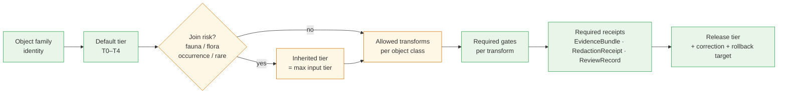

<!-- [KFM_META_BLOCK_V2]
doc_id: kfm://doc/<uuid-pending>
title: Habitat Preservation Matrix
type: standard
version: v1.1
status: draft
owners: <Habitat domain steward> · <Sensitivity reviewer>   # placeholders pending owner-registry verification
created: 2026-05-17
updated: 2026-06-05
policy_label: public
contract_version: "3.0.0"   # pinned per ai-build-operating-contract.md
related:
  - contracts/habitat/README.md            # PROPOSED home per Atlas §24.13 responsibility-root crosswalk
  - schemas/contracts/v1/habitat/           # PROPOSED schema home per Atlas §24.13 + Directory Rules §11
  - contracts/fauna/README.md               # PROPOSED home per Atlas §24.13
  - docs/architecture/cross-lane-join-policy.md   # PROPOSED — ADR-S-14
  - docs/standards/PROV.md
  - docs/runbooks/fauna/SOURCE_REFRESH_RUNBOOK.md
  - control_plane/policy_gate_register.yaml
  - control_plane/release_state_register.yaml
  - ai-build-operating-contract.md          # doctrine-adjacent: operating contract is canonical spine
notes:
  - "Tier scheme T0-T4 is doctrine-PROPOSED pending ADR-S-05 (CONFIRMED as named backlog ADR; adoption not yet accepted)."
  - "All repo paths, route names, and schema homes are PROPOSED until mounted-repo verification."
  - "Cross-lane join sensitivity (habitat x fauna) is CONFIRMED doctrine; precise generalization radii are PROPOSED."
  - "PATH DRIFT: prior version used docs/domains/habitat/ form. Atlas §24.13 + Directory Rules §11 place domain files as lane segments under responsibility roots (contracts/, schemas/, policy/), not as docs/domains/ folders. Conflict surfaced in §13.1; route to DRIFT_REGISTER + ADR-class naming decision."
  - "policy/sensitivity/habitat/ is NOT listed in the Atlas §24.13 crosswalk (only fauna/flora/infrastructure/archaeology/people carry policy/sensitivity/ roots). Habitat sensitivity may inherit through the joined lane's policy home; flagged in §12."
  - "CONTRACT_VERSION = \"3.0.0\""
[/KFM_META_BLOCK_V2] -->

# 🌿 Habitat Preservation Matrix

> Normative reference: how each Habitat-owned object family is **preserved** across the KFM lifecycle — what tier it defaults to, what transforms are allowed, what gates must fire, and how cross-lane joins change its preservation posture.

<!-- BADGE ROW -->

-orange)

<!-- TODO: replace static badges with CI-driven Shields endpoints once owner + build URLs are confirmed (NEEDS VERIFICATION). -->

**Status:** draft &middot; **Owners:** Habitat domain steward · Sensitivity reviewer *(placeholders)* &middot; **Contract:** `CONTRACT_VERSION = "3.0.0"` &middot; **Last updated:** 2026-06-05

---

## Mini Table of Contents

- [1. Purpose](#1-purpose)
- [2. Scope and Boundaries](#2-scope-and-boundaries)
- [3. Preservation Dimensions](#3-preservation-dimensions)
- [4. Object Family × Preservation Matrix](#4-object-family--preservation-matrix)
- [5. Allowed Transforms](#5-allowed-transforms)
- [6. Tier Transitions (Allowed Motion)](#6-tier-transitions-allowed-motion)
- [7. Cross-Lane Join Sensitivity](#7-cross-lane-join-sensitivity)
- [8. Model vs Observation Discipline](#8-model-vs-observation-discipline)
- [9. Lifecycle Gate Reference](#9-lifecycle-gate-reference)
- [10. AI Surface Preservation](#10-ai-surface-preservation)
- [11. Required Receipts and Artifacts](#11-required-receipts-and-artifacts)
- [12. Open Questions Register](#12-open-questions-register)
- [13. Open Verification Backlog](#13-open-verification-backlog)
- [14. Changelog](#14-changelog)
- [15. Definition of Done](#15-definition-of-done)
- [16. Related Docs](#16-related-docs)
- [Appendix A — Per-Object Preservation Cards](#appendix-a--per-object-preservation-cards)

---

## 1. Purpose

This document is the **habitat-specific preservation regime**: a single matrix that names, per Habitat object family, the sensitivity-tier default, the transforms allowed to move the object between tiers, the gates that must fire to authorize each transform, and the join conditions that change the preservation posture. It localizes the master sensitivity / rights tier scheme (Atlas §24.5) to the realities of the Habitat lane.

> [!NOTE]
> The Habitat Preservation Matrix is a **reference**, not a publisher. It is read by validators, policy bundles, the Evidence Drawer, governed AI surfaces, and human stewards. Promotion still happens through the governed lifecycle described in §9; this doc defines the *contents* of those decisions, not the *fact* of them. **(CONFIRMED doctrine; PROPOSED operational binding to specific validator / policy artifacts.)**

[⬆ Back to top](#mini-table-of-contents)

---

## 2. Scope and Boundaries

### In scope (CONFIRMED doctrine for Habitat ownership)

The eleven object families below are the Habitat lane's confirmed object-family spine, as named in the Atlas Habitat dossier §B and §E and the Master Object-Family Reference. *(Object-family spine CONFIRMED; field-level realization PROPOSED.)*

| Habitat owns | Definition source |
|---|---|
| HabitatPatch | Atlas §6.B/§6.E · Encyclopedia §7.4 |
| LandCoverObservation | Atlas §6.B/§6.E · Encyclopedia §7.4 |
| EcologicalSystem | Atlas §6.B/§6.E · Encyclopedia §7.4 |
| Habitat Quality Score | Atlas §6.B/§6.E · Encyclopedia §7.4 |
| SuitabilityModel | Atlas §6.B/§6.E · Encyclopedia §7.4 |
| ConnectivityEdge | Atlas §6.B/§6.E · Encyclopedia §7.4 |
| Corridor | Atlas §6.B/§6.E · Encyclopedia §7.4 |
| Restoration Opportunity | Atlas §6.B/§6.E · Encyclopedia §7.4 |
| StewardshipZone | Atlas §6.B/§6.E · Encyclopedia §7.4 |
| Model Run Receipt | Atlas §6.B/§6.E · Encyclopedia §7.4 |
| UncertaintySurface | Atlas §6.B/§6.E · Encyclopedia §7.4 |

### Explicitly out of scope (CONFIRMED non-ownership)

The Habitat dossier §B is explicit: *Fauna owns taxa and animal occurrence; Flora owns plant taxa, specimens, occurrences, and rare plant records; soil, hydrology, agriculture, hazards, and archaeology retain their own truth.* **(CONFIRMED.)**

- **Fauna taxa, occurrence records, sensitive sites, range polygons** — owned by Fauna. Habitat joins through governed relations only.
- **Plant taxa, rare plant records, vegetation communities (taxonomic identity)** — owned by Flora. Habitat references vegetation as ecological context, not taxonomic truth.
- **Hydrology / Soil / Agriculture / Hazards** — provide ecological context through governed joins, not preservation rules for Habitat objects.

> [!IMPORTANT]
> Habitat outputs joined to Fauna or Flora records **inherit the sensitivity of the joined party**. This matrix governs the Habitat side of the join; the Fauna and Flora preservation rules govern theirs. The join product's tier is the **maximum** (most restrictive) of the inputs' tiers, never the minimum. **(CONFIRMED doctrine; see §7. Aligns with Atlas §24.5.2 "sensitive joins fail closed" and the Master Object-Family row for sensitive OccurrenceRecord: "T4 default; T1 via generalization.")**

[⬆ Back to top](#mini-table-of-contents)

---

## 3. Preservation Dimensions

Five dimensions define the preservation posture of every Habitat object on every release. Each dimension is enforced at a different gate; none may be silently waived.

*Diagram status:* **CONFIRMED** for the existence of each gate stage (lifecycle invariant) and for the max-tier join rule. **PROPOSED** for the specific data-flow shape and the conditional join branch as drawn — exact binding to validator code and policy IDs is NEEDS VERIFICATION pending mounted-repo inspection.

| # | Dimension | What it preserves | Authority |
|---|---|---|---|
| 1 | **Default tier (T0–T4)** | The least-public-safe representation that is still useful. | Atlas §24.5.1–§24.5.2 (tier scheme PROPOSED; ADR-S-05). |
| 2 | **Allowed transforms** | The named ways an object may move toward less-restrictive tiers (generalize, aggregate, redact, withhold). | Atlas §24.5.2; Habitat dossier §I. |
| 3 | **Required gates** | The pipeline gates and review states that must fire to authorize a transform. | Atlas §24.6 master lifecycle gates; Habitat dossier §H. |
| 4 | **Join sensitivity** | The inherited tier when an object is joined to a sensitive lane (typically Fauna occurrence). | Encyclopedia §7.4; Atlas §24.5.2; CONFIRMED doctrine. |
| 5 | **Model vs observation label** | The distinction between modeled output and observed evidence, preserved across all releases. | Habitat dossier §I; Encyclopedia §7.4. |

[⬆ Back to top](#mini-table-of-contents)

---

## 4. Object Family × Preservation Matrix

The core matrix. Each row is one Habitat-owned object family. Each cell is **PROPOSED** unless an explicit citation is given to the Atlas, Encyclopedia, or Directory Rules.

> [!CAUTION]
> The Atlas Master Object-Family matrix records the Habitat default as **"T0 mostly; T1 for stewardship zones"** for *HabitatPatch / EcologicalSystem* **(CONFIRMED)**. Default tiers for every other Habitat object family are **PROPOSED** for ADR-S-05 review and require sensitivity-reviewer sign-off; they are inferred from doctrine, not directly tabulated in the master supplement.

<!-- markdownlint-disable MD013 -->

| Object family | Default tier | Allowed transforms | Required gates | Join-sensitivity rule | Model/obs label | Citation |
|---|---|---|---|---|---|---|
| **HabitatPatch** | T0 (**CONFIRMED** — Atlas master matrix: HabitatPatch/EcologicalSystem "T0 mostly") | Generalize boundary; aggregate to coarse cell → T0; redact patches that disclose sensitive occurrence → T1; withhold → T4. | RAW→WORK validator; PROCESSED catalog closure; ReviewRecord if join to sensitive Fauna. | Joined to sensitive occurrence ⇒ inherits T4 unless RedactionReceipt + ReviewRecord. | observation (derived from LandCover or stewardship survey) | Atlas §24.5.2; §24.14; Ency §7.4 |
| **LandCoverObservation** | T0 (PROPOSED — source families NLCD/GAP/LANDFIRE/NWI rights NEEDS VERIFICATION) | Reclassify to coarser legend; resample to coarser grid; clip to release AOI. | RAW→WORK validator; ValidationReport; source-role check. | Generally low-risk; T1 only if joined product reveals a sensitive site. | observation | Ency §7.4; Habitat dossier §D |
| **EcologicalSystem** | T0 (**CONFIRMED** — Atlas master matrix default) | Generalize community label; aggregate to ecological-region scale. | PROCESSED catalog closure; ReviewRecord on community-rarity flagging. | T2 or T4 if the system identifies a rare community whose location implies sensitive species presence. | observation/classification | Atlas §24.5.2; §24.14; Ency §7.4 |
| **Habitat Quality Score** | T1 (PROPOSED) | Bin to coarse score classes; aggregate to grid; suppress when score density implies sensitive-species concentration. | ModelRunReceipt + ValidationReport; ReviewRecord required if joined to sensitive Fauna inputs. | Inherits sensitive-fauna tier through training inputs; AggregationReceipt required for T0. | **model** | Habitat dossier §I; Ency §7.4 |
| **SuitabilityModel** | T1 (PROPOSED) | Generalize score bands; release model card without raw training points; release surface clipped of sensitive areas. | ModelRunReceipt; ValidationReport; ReviewRecord; PolicyDecision if training data is sensitive. | If trained on sensitive occurrence, surface inherits T2 minimum; exact training points never published. | **model** (label REQUIRED on every release) | Habitat dossier §I; Atlas §24.5.2 |
| **ConnectivityEdge** | T1 (PROPOSED) | Generalize endpoints to patch centroids; aggregate edges by ecological-region pair. | PROCESSED catalog closure; ReviewRecord if endpoints implicate sensitive sites. | Inherits sensitive-fauna tier if connectivity is computed against sensitive occurrence data. | **model** (least-cost path is modeled) | Habitat dossier §I; Ency §7.4 |
| **Corridor** | T1 (PROPOSED) | Generalize corridor polygon; widen buffer to obscure precise paths near sensitive sites. | ReviewRecord; RedactionReceipt for sensitive overlap. | T2 or T4 when corridor coincides with sensitive-species movement evidence. | **model** | Habitat dossier §I; Ency §7.4 |
| **Restoration Opportunity** | T1 (PROPOSED) | Generalize parcel boundary; redact owner identity; aggregate by stewardship zone. | ReviewRecord (private-land join always); PolicyDecision. | T2 minimum if joined to private parcel data; never directly publishes owner identity. | **model** (prioritization is modeled) | Habitat dossier §I; cross-lane with People/Land |
| **StewardshipZone** | T1 (**CONFIRMED** — Atlas master matrix: "T1 for stewardship zones") | Generalize boundary; redact internal management notes; suppress location entirely if steward requests. | ReviewRecord by named steward; PolicyDecision; CorrectionNotice path active. | T2 or T4 by steward request; deny-by-default for tribal / sovereign stewardship areas. | observation/declaration | Atlas §24.5.2; §24.14; Ency §7.4 |
| **Model Run Receipt** | T0 (PROPOSED — receipt itself is meta) | Redact embedded source identifiers if they reference sensitive sources. | EvidenceBundle closure; `spec_hash` present. | If receipt references training data that itself is T4, the receipt's *content* may need redaction but the receipt's *existence* remains T0. | meta | Ency §7.4; PROV.md alignment |
| **UncertaintySurface** | matches parent (PROPOSED) | Generalize at the same scale as the surface it qualifies; never published at finer resolution than its parent. | Same gates as parent model output. | Inherits parent tier; never escapes it. | **model** | Habitat dossier §I; Ency §7.4 |

<!-- markdownlint-enable MD013 -->

> [!WARNING]
> **Modeled-as-critical denial.** A modeled suitability surface, ConnectivityEdge, or Corridor must **never** be presented as a regulatory critical-habitat designation. The Habitat dossier §I is explicit that regulatory critical habitat, modeled habitat, species range, occurrence points, and landscape context **must not be flattened** **(CONFIRMED)**. The `model` label is required on every release; flattening model output into observation is a release-class drift event and triggers `MODEL_LABEL_COLLAPSE` (PROPOSED reason code; see §9.1).

[⬆ Back to top](#mini-table-of-contents)

---

## 5. Allowed Transforms

Transforms are named, deterministic, receipt-bearing operations. Improvised or undocumented redaction is not a transform; it is a release defect. Each transform below is a **PROPOSED** Habitat-lane realization of the broader transform vocabulary referenced across the Atlas (§24.5.2 "allowed transforms") and Fauna dossier.

| Transform | What it does | Allowed on | Receipt class | Notes |
|---|---|---|---|---|
| `generalize:boundary` | Snap polygon to coarser cell or simplify perimeter. | HabitatPatch, EcologicalSystem, StewardshipZone, Corridor, Restoration Opportunity | RedactionReceipt | Records cell size or simplification tolerance. |
| `generalize:legend` | Reclassify to a coarser categorical legend. | LandCoverObservation, EcologicalSystem | RedactionReceipt | Preserves classification provenance. |
| `aggregate:grid` | Roll up to a fixed grid (e.g., HUC12, county). | Habitat Quality Score, SuitabilityModel, ConnectivityEdge | AggregationReceipt | Records grid identity and inclusion rule. |
| `bin:score` | Coarsen continuous score to discrete bands. | Habitat Quality Score, SuitabilityModel, UncertaintySurface | RedactionReceipt | Records bin edges. |
| `clip:area` | Restrict surface to a release AOI. | SuitabilityModel, UncertaintySurface, ConnectivityEdge | RedactionReceipt | Records clip geometry hash. |
| `withhold:feature` | Suppress an individual record from a release. | any | RedactionReceipt | Records reason class (rights, sensitivity, review, rollback). |
| `suppress:layer` | Remove an entire layer pending review. | any | RedactionReceipt + RollbackCard | Used during quarantine and rollback. |
| `relabel:model` | Re-assert the `model` label on a release where labeling was ambiguous. | SuitabilityModel, Habitat Quality Score, ConnectivityEdge, Corridor, Restoration Opportunity, UncertaintySurface | CorrectionNotice | Corrects a model/observation collapse. |

> [!NOTE]
> Every transform emits a receipt; the receipt is itself a first-class object that travels with the release. A release that claims a transform without a receipt is not a release — it is a defect, and downstream validators are expected to reject it. **(CONFIRMED doctrine; PROPOSED specific schema homes — see §13 item 2 and ADR-S-03.)**

[⬆ Back to top](#mini-table-of-contents)

---

## 6. Tier Transitions (Allowed Motion)

The motion rules below are a Habitat-lane reading of Atlas §24.5.3. The Atlas reading note is **CONFIRMED verbatim**: *a tier upgrade (toward more public) always needs both a transform receipt and a review record; a tier downgrade (toward less public) never needs both — correction alone is sufficient to remove or restrict.*

| From → To | Required artifact | Required reviewer | Reversibility |
|---|---|---|---|
| T4 → T2 | PolicyDecision + ReviewRecord | Habitat steward + Sensitivity reviewer | Reversible: review revocation returns object to T4. |
| T4 → T1 | RedactionReceipt + ReviewRecord | Habitat steward + Sensitivity reviewer | Reversible: correction may demote a published T1 to T4. |
| T2 → T1 | RedactionReceipt + ReviewRecord | Habitat steward | Reversible. |
| T1 → T0 | ReleaseManifest + ReviewRecord | Habitat steward + Release authority | Reversible via RollbackCard. |
| any → T4 (downgrade) | CorrectionNotice + ReviewRecord | Habitat steward; rights-holder if applicable | Always permitted; precedes derivative invalidation. |

> [!IMPORTANT]
> **Any released Habitat artifact joined to a Fauna occurrence later reclassified as sensitive** must be demoted via the `any → T4` rule above. Demotion does not erase audit history; it withdraws the public surface and points downstream consumers at a CorrectionNotice. **(CONFIRMED doctrine — matches Atlas §24.5.3 "Any tier → T4 downgrade … precedes derivative invalidation"; PROPOSED specific tooling.)**

[⬆ Back to top](#mini-table-of-contents)

---

## 7. Cross-Lane Join Sensitivity

The most important habitat-specific rule. A habitat object is rarely sensitive on its own; it becomes sensitive when joined to a sensitive lane. The Habitat dossier §F names the Habitat × Fauna relation as *"habitat assignment and occurrence context, with geoprivacy,"* and the cross-lane constraint requires every relation to *preserve ownership, source role, sensitivity, and EvidenceBundle support* **(CONFIRMED)**.

### 7.1 Join targets and inherited tiers

| Join | Inherited tier | Required posture | Citation |
|---|---|---|---|
| Habitat × Fauna **Occurrence Restricted / SensitiveSite** | T4 unless RedactionReceipt + ReviewRecord move the *derived* product to T1. | Deny by default; fail-closed; never publish join product at finer resolution than the generalized Fauna product. | Atlas §24.5.2; §24.14 ("T4 default; T1 via generalization"); Fauna dossier §I. |
| Habitat × Fauna **Occurrence Public** (already generalized) | T1 (matches the joined Fauna tier). | RedactionReceipt on the join product; preserve the geoprivacy already applied by Fauna. | Fauna dossier §I. |
| Habitat × Fauna **RangePolygon** | T1. | AggregationReceipt or RedactionReceipt on the join product. | Atlas §24.5.2; §24.14. |
| Habitat × Flora **Rare Plant Record** | T4 unless transform + review move it to T1. | Same posture as Fauna sensitive occurrence. | Atlas §24.5.2; §24.14 ("T4 default; T1 via generalization"); Flora dossier §I. |
| Habitat × People/Land **private parcel** | T2 minimum; T4 if owner identity surfaces. | Reject the join at validation time unless an aggregation rule is named. | Atlas §24.5.2 (People/Land private person-parcel join → T2); People/Land dossier (cross-lane). |
| Habitat × Hydrology / Soil / Atmosphere | T0 (no inherited sensitivity by default). | Standard release gates apply. | Atlas §24.14 (HUC/SoilMapUnit/WeatherObservation default T0); Ency §7.4. |

### 7.2 Join receipts

Every habitat × sensitive-lane join product carries, at minimum:

1. A **RedactionReceipt** documenting the transform that converted the sensitive input into a public-safe representation (radius, grid, bin, withhold reason).
2. A **ReviewRecord** signed by the named sensitivity reviewer.
3. A **PolicyDecision** referencing the policy rule that authorized the release.
4. A reference back to both inputs' **EvidenceBundles** so the join is auditable.

> [!CAUTION]
> Sensitivity is a property of the **product**, not just the inputs. A LandCoverObservation joined to a public Occurrence may still produce a T4 surface if the resulting density map reveals nesting concentrations. Validators must evaluate the *output*, not infer safety from the *inputs*. This is precisely the inference-risk that ADR-S-14 (cross-lane join policy) exists to govern. **(CONFIRMED doctrine — Atlas §24.5.2 "sensitive joins fail closed"; cross-lane joins named in ADR-S-14 as "inference-risk multipliers"; PROPOSED validator binding.)**

[⬆ Back to top](#mini-table-of-contents)

---

## 8. Model vs Observation Discipline

Habitat is unusual among KFM domains because much of its public output is **modeled**: suitability surfaces, connectivity edges, corridors, restoration prioritizations, and uncertainty surfaces. The Habitat dossier §I is explicit and **CONFIRMED**: *regulatory critical habitat, modeled habitat, species range, occurrence points, and landscape context must not be flattened.*

| Class | Examples | Required preservation |
|---|---|---|
| **Observation** | HabitatPatch (derived from LandCover survey), LandCoverObservation, EcologicalSystem (classification), StewardshipZone (declaration) | Label `observation`; preserve source role; preserve observed time vs valid time. |
| **Model** | SuitabilityModel, Habitat Quality Score, ConnectivityEdge, Corridor, Restoration Opportunity, UncertaintySurface | Label `model`; carry Model Run Receipt; expose model card (version, training support, spatial resolution, uncertainty); never flatten into "critical habitat" framing. |

### 8.1 Model release expectations

A modeled Habitat output requires, before release:

- **Model Run Receipt** — version, parameters, training-source identity, spatial resolution, support, uncertainty band, release time.
- **UncertaintySurface** — must travel with the parent model output; never released at finer resolution than its parent.
- **Model card** — concise, human-readable. *(PROPOSED location: `contracts/habitat/model_cards/<model-id>.md` per Atlas §24.13 responsibility-root crosswalk — NEEDS VERIFICATION; the prior `docs/domains/habitat/...` form is a PATH-DRIFT candidate, see §13.1.)*
- **`relabel:model` correction path** active in case a downstream consumer collapses the label.

> [!WARNING]
> Suitability surfaces are not regulatory critical habitat. The Habitat lane consumes critical-habitat designations (e.g., USFWS ECOS) as a regulatory **authority** source role; it never emits a designation. Confusing the two is a release-class drift event. **(CONFIRMED doctrine; USFWS ECOS / critical-habitat-service source rights and current terms remain NEEDS VERIFICATION per Habitat dossier §D and §N.)**

[⬆ Back to top](#mini-table-of-contents)

---

## 9. Lifecycle Gate Reference

Habitat objects follow the universal invariant `RAW → WORK / QUARANTINE → PROCESSED → CATALOG / TRIPLET → PUBLISHED`. The gates below are habitat-localized from the Habitat dossier §H pipeline-shape table — each names what an object class needs to clear the gate. *(Lifecycle invariant CONFIRMED doctrine; per-stage handling marked PROPOSED in the dossier itself.)*

| Stage | Habitat-side handling | Gate (must hold) | Status |
|---|---|---|---|
| **RAW** | Capture immutable source payload (NLCD tile, GAP raster, USFWS critical-habitat feature-service response, NatureServe export, field-survey form) with role / rights / sensitivity / citation / time / hash. | SourceDescriptor exists. | CONFIRMED doctrine / PROPOSED impl. |
| **WORK / QUARANTINE** | Normalize schema, geometry, time, identity, evidence, rights, and policy. Sensitive joins fail closed into QUARANTINE. | ValidationReport + PolicyDecision pass, or quarantine reason recorded. | CONFIRMED doctrine / PROPOSED impl. |
| **PROCESSED** | Emit validated HabitatPatches, EcologicalSystems, modeled surfaces with Model Run Receipt, redaction-aware public-safe candidates. | EvidenceRef, ValidationReport, digest closure exist. | CONFIRMED doctrine / PROPOSED impl. |
| **CATALOG / TRIPLET** | Emit catalog records, EvidenceBundles, graph/triplet projections, release candidates. | Catalog/proof closure passes. | CONFIRMED doctrine / PROPOSED impl. |
| **PUBLISHED** | Serve released public-safe artifacts through governed API and LayerManifest; correction path active; rollback target named. | ReleaseManifest + rollback target + correction path + ReviewRecord (where required). | CONFIRMED doctrine / PROPOSED impl. |
| **CORRECTION (PUBLISHED → PUBLISHED′)** | Detected error or new evidence; downstream derivatives identified; superseding release. | CorrectionNotice + RollbackCard if rollback required. | CONFIRMED doctrine / PROPOSED impl. |

### 9.1 Habitat-specific quarantine reasons (PROPOSED)

| Reason code | When it fires |
|---|---|
| `JOIN_SENSITIVE_OCCURRENCE` | A habitat product attempts to publish at a resolution finer than the joined Fauna geoprivacy product. |
| `MODEL_LABEL_COLLAPSE` | A modeled output is labeled or framed as observation / regulatory designation. |
| `CRITICAL_HABITAT_FRAMING` | A modeled suitability surface is framed as critical habitat or regulatory designation. |
| `STEWARD_ZONE_OVERRIDE` | A release would override a steward-declared withholding of a StewardshipZone. |
| `UNCERTAINTY_MISSING` | A modeled surface is being released without a paired UncertaintySurface. |

> [!NOTE]
> These reason codes are **PROPOSED** for ADR-S-04-class vocabulary review (source-role / reason-code stability) and remain NEEDS VERIFICATION until a mounted `control_plane/policy_gate_register.yaml` confirms them.

[⬆ Back to top](#mini-table-of-contents)

---

## 10. AI Surface Preservation

The governed AI surface is bound to the same preservation rules as the public map and API. The Habitat dossier §L is **CONFIRMED**: *AI may summarize released Habitat EvidenceBundles, compare evidence, explain limitations, and draft steward-review notes; AI must ABSTAIN when evidence is insufficient and DENY where policy, rights, sensitivity, or release state blocks the request.*

- AI **may** summarize released Habitat EvidenceBundles, compare evidence across model versions, explain limitations, and draft steward-review notes. **(CONFIRMED.)**
- AI **must** ABSTAIN when evidence is insufficient and **DENY** where policy, rights, sensitivity, or release state blocks the request. **(CONFIRMED.)**
- AI **never** reads RAW or WORK content; only released EvidenceBundle. **(CONFIRMED — Atlas §24.5.2 "Governed AI — RAW/WORK access via AI surface: T4.")**
- AI must **never** narrate a modeled Habitat output as observation or regulatory designation; the `model` label is enforced in the response envelope.

| AI behavior | Habitat rule | Receipt |
|---|---|---|
| Summarize habitat patch | Allowed on released EvidenceBundle only; cite back to bundle. | AIReceipt with EvidenceRef. |
| Explain suitability surface | Must surface `model` label, model version, and uncertainty band. | AIReceipt + Model Run Receipt reference. |
| Compare habitat over time | Allowed; must surface land-cover version and observed-vs-modeled distinction. | AIReceipt. |
| Discuss sensitive occurrence association | Denied unless the join product is at a published public-safe tier. | DENY outcome; PolicyDecision recorded. |

[⬆ Back to top](#mini-table-of-contents)

---

## 11. Required Receipts and Artifacts

The receipts below are the minimum the preservation matrix expects to see traveling with a Habitat release. Each is a **CONFIRMED doctrine** object family; specific schema homes are **PROPOSED** until verified against `schemas/contracts/v1/habitat/` and the receipt-class home decided in ADR-S-03 in a mounted repo.

- **SourceDescriptor** — role, authority, rights, sensitivity, cadence.
- **EvidenceBundle** — resolved evidence package backing each public claim.
- **EvidenceRef** — reference that must resolve to an EvidenceBundle before public-claim authority.
- **ValidationReport** — deterministic validator outcomes (finite enum: `ANSWER` / `ABSTAIN` / `DENY` / `ERROR`).
- **PolicyDecision** — the policy rule that authorized (or denied) a release transition.
- **RedactionReceipt** — geoprivacy / generalization / withhold transform record.
- **AggregationReceipt** — grid/aggregation transform record.
- **Model Run Receipt** — model identity, version, training support, parameters, uncertainty band.
- **ReviewRecord** — steward or sensitivity-reviewer signature on a transition.
- **LayerManifest** — the public-safe layer descriptor served through the governed API.
- **ReleaseManifest** — the release object naming all of the above plus rollback target.
- **CorrectionNotice** — superseding-release record on PUBLISHED → PUBLISHED′.
- **RollbackCard** — rollback target and drill object.

[⬆ Back to top](#mini-table-of-contents)

---

## 12. Open Questions Register

| ID | Question | Owner role | Resolution path |
|---|---|---|---|
| OQ-HAB-PRES-01 | Adopt T0–T4 tier scheme as canonical Habitat vocabulary? | Sensitivity reviewer | ADR-S-05 decision; policy-bundle binding. |
| OQ-HAB-PRES-02 | Receipt schema home: `schemas/contracts/v1/receipts/` vs `schemas/contracts/v1/habitat/receipts/`? | Schema steward | ADR-S-03; mounted-repo schema tree. |
| OQ-HAB-PRES-03 | Source-role vocabulary used by Habitat validators (authority / observation / context / model)? | Source steward | ADR-S-04; mounted validator code. |
| OQ-HAB-PRES-04 | Specific generalization radii for habitat × sensitive-Fauna join products? | Sensitivity reviewer + Habitat steward | Policy bundle (home NEEDS VERIFICATION — see note) + reviewer sign-off. |
| OQ-HAB-PRES-05 | Does Habitat carry its own `policy/sensitivity/habitat/` home, or inherit through the joined lane's policy home? | Directory steward | Directory-Rules check; Atlas §24.13 lists no Habitat `policy/sensitivity/` root. |
| OQ-HAB-PRES-06 | Cross-lane join policy outcome (which joins steward-reviewed, denied, open)? | Governance steward | ADR-S-14 text; binding in `policy/` + validator code. |
| OQ-HAB-PRES-07 | Model-card requirements and storage location for SuitabilityModel and Habitat Quality Score? | Habitat steward | Model-card template + ADR if doctrine-class. |
| OQ-HAB-PRES-08 | Reason-code vocabulary stability for Habitat-specific quarantine reasons (§9.1)? | Governance steward | `control_plane/policy_gate_register.yaml` entry; ADR-S-04 alignment. |

> [!IMPORTANT]
> **OQ-HAB-PRES-05 is a Directory-Rules question, not a guess.** The Atlas §24.13 crosswalk assigns `policy/sensitivity/<domain>/` roots to **Fauna, Flora, Settlements/Infrastructure, Archaeology, and People** — **not** to Habitat. Habitat's responsibility roots are `schemas/contracts/v1/habitat/` and `contracts/habitat/` only. This suggests Habitat sensitivity is governed through the **joined lane's** policy home (e.g., `policy/sensitivity/fauna/`) rather than a Habitat-owned one. Surfaced for ADR; do not create `policy/sensitivity/habitat/` without one.

[⬆ Back to top](#mini-table-of-contents)

---

## 13. Open Verification Backlog

These items remain `NEEDS VERIFICATION` before promotion from `draft` to `published`. They are blocked on ADR resolution, mounted-repo verification, or named-source rights confirmation.

1. **T0–T4 tier-scheme adoption** — settled by ADR-S-05 decision + policy-bundle binding. *(Tier scheme CONFIRMED as named PROPOSED scheme; adoption not accepted.)*
2. **Receipt schema home** — settled by ADR-S-03 + mounted-repo schema tree.
3. **Source-role vocabulary** used by Habitat validators — settled by ADR-S-04 + mounted validator code.
4. **Generalization radii** for habitat × sensitive-Fauna join products — settled by policy bundle + sensitivity-reviewer sign-off.
5. **USFWS ECOS / critical-habitat-service** source rights and cadence — settled by source-registry entry + current-terms inspection. *(Habitat dossier §D/§N: NEEDS VERIFICATION.)*
6. **KDWP-style state review context** source rights and review path — settled by source-registry entry + steward memo. *(Habitat dossier §D: NEEDS VERIFICATION.)*
7. **NLCD / GAP / LANDFIRE / NWI / NatureServe / PAD-US** source rights and cadence — settled by source-registry entries. *(Habitat dossier §D: NEEDS VERIFICATION.)*
8. **Cross-lane join policy (ADR-S-14)** outcome — settled by ADR text + `policy/` binding + validator code.
9. **Habitat MapLibre overlay registry and Focus Mode behavior** — settled by `packages/maplibre/` source, `apps/explorer-web/` integration, and LayerManifests on disk. *(Habitat dossier §N: NEEDS VERIFICATION.)*
10. **Model-card requirements and storage location** for SuitabilityModel and Habitat Quality Score — settled by model-card template + ADR. *(Habitat dossier §N: "Verify model-card requirements for suitability products" — NEEDS VERIFICATION.)*

### 13.1 Path-drift candidate (CONFLICTED — route to DRIFT_REGISTER + ADR)

> [!WARNING]
> The prior version of this doc placed habitat documents and model cards under `docs/domains/habitat/...`. The Atlas §24.13 responsibility-root crosswalk and Directory Rules §11 place domain object-family material as **lane segments inside responsibility roots** — `contracts/habitat/` (object meaning) and `schemas/contracts/v1/habitat/` (machine shape) — and reserve `docs/` for human-facing doctrine/explanations. This is the known **segment-form vs flat-form** naming conflict.
>
> **Disposition:** mark all `docs/domains/habitat/` paths `PROPOSED / CONFLICTED`, open a `docs/registers/DRIFT_REGISTER.md` entry, and route the choice to an ADR-class decision before any file is created at either location. This matrix does **not** silently pick a side.

[⬆ Back to top](#mini-table-of-contents)

---

## 14. Changelog

| Change | Type (per contract §37) | Reason |
|---|---|---|
| Added doctrine companion sections (Open Questions register in `OQ-HAB-PRES-NN` form, Verification backlog, Changelog, Definition of Done). | new | Aligns standard/doctrine-adjacent doc with contract §37 companion-section pattern. |
| Upgraded HabitatPatch / EcologicalSystem / StewardshipZone default-tier labels from PROPOSED to CONFIRMED. | reconciliation | Atlas Master Object-Family matrix directly tabulates "T0 mostly; T1 for stewardship zones." |
| Surfaced `docs/domains/habitat/` vs `contracts/habitat/` + `schemas/contracts/v1/habitat/` path drift (§13.1). | gap closure | Atlas §24.13 + Directory Rules §11 assign domain files to responsibility roots, not `docs/domains/`. |
| Surfaced absence of a `policy/sensitivity/habitat/` root in Atlas §24.13 (OQ-HAB-PRES-05). | gap closure | Prior version listed `policy/sensitivity/habitat/` without noting it is not in the crosswalk. |
| Anchored join rule to Atlas §24.14 master row "T4 default; T1 via generalization." | clarification | Strengthens cited basis for inherited-tier table (§7.1). |
| Pinned `CONTRACT_VERSION = "3.0.0"` in meta block, badge row, and status line. | housekeeping | Required for doctrine-adjacent docs. |
| Made all Mermaid node labels quoted (parentheses / slashes / en-dashes wrapped). | housekeeping | Mermaid-safety rule for labels containing `(`, `)`, `/`, en-dash. |
| Bumped version v1 → v1.1; updated `updated` to 2026-06-05. | housekeeping | MINOR bump: clarification + gap closure, no operating-law change. |

> **Backward compatibility.** Section anchors §1–§11 are preserved. New sections were appended as §12–§16; the prior "Open Questions and Verification Backlog" combined section was split into §12 (register) and §13 (backlog) — any inbound link to `#12-open-questions-and-verification-backlog` will break and should be repointed to `#12-open-questions-register`. Object-family display names were normalized to the Atlas spelling (`Habitat Quality Score`, `Restoration Opportunity`, `Model Run Receipt`); the `KFM_META_BLOCK_V2` inner annotations use `#` comments only (no nested `<!-- -->`).

[⬆ Back to top](#mini-table-of-contents)

---

## 15. Definition of Done

This document is done enough to enter the repository when:

- it is placed according to Directory Rules — **and the §13.1 path-drift conflict is resolved by ADR** before any sibling file is created;
- a docs steward and the sensitivity reviewer review it;
- it is linked from the Habitat domain index and the doctrine/standards index;
- it does not conflict with accepted ADRs (notably ADR-S-03, ADR-S-04, ADR-S-05, ADR-S-14);
- the path conflict in §13.1 and the `policy/sensitivity/habitat/` question (OQ-HAB-PRES-05) are logged in `docs/registers/DRIFT_REGISTER.md`;
- the `GENERATED_RECEIPT.json` planned in the PR is wired into CI with `contract_version: "3.0.0"`;
- future changes follow the operating contract's §37 lifecycle.

[⬆ Back to top](#mini-table-of-contents)

---

## 16. Related Docs

Cross-references the matrix expects to interoperate with. **All targets PROPOSED until confirmed against a mounted repo; path forms reflect the Atlas §24.13 responsibility-root crosswalk, not the prior `docs/domains/` form (see §13.1).**

- `contracts/habitat/README.md` — habitat object-family meaning *(PROPOSED home)*.
- `contracts/fauna/README.md` — fauna ownership and sensitivity baseline *(PROPOSED home)*.
- `schemas/contracts/v1/habitat/` — habitat machine shape *(PROPOSED — NEEDS VERIFICATION)*.
- `docs/architecture/cross-lane-join-policy.md` — cross-domain join governance *(PROPOSED — ADR-S-14)*.
- `docs/standards/PROV.md` — provenance vocabulary.
- `docs/runbooks/fauna/SOURCE_REFRESH_RUNBOOK.md` — operational reference for the Fauna side of habitat × fauna joins.
- `policy/sensitivity/fauna/` — fauna sensitivity rules Habitat may inherit through on join *(PROPOSED — see OQ-HAB-PRES-05)*.
- `control_plane/policy_gate_register.yaml` — operational binding for the reason codes named in §9.1 *(NEEDS VERIFICATION)*.
- `control_plane/release_state_register.yaml` — release-state vocabulary used in §9 *(NEEDS VERIFICATION)*.
- `ai-build-operating-contract.md` — canonical operating contract (`CONTRACT_VERSION = "3.0.0"`).

[⬆ Back to top](#mini-table-of-contents)

---

## Appendix A — Per-Object Preservation Cards

A compact, expandable reference for each Habitat object family. Each card restates the matrix row in narrative form and adds local notes. **All non-cited claims are PROPOSED.**

<strong>HabitatPatch</strong> — T0 default (CONFIRMED); sensitive when joined.

- **Default tier:** T0 (**CONFIRMED** — Atlas master matrix "T0 mostly" for HabitatPatch/EcologicalSystem).
- **Source roles:** observation (derived from LandCover); occasionally context.
- **Label:** observation.
- **Transforms:** `generalize:boundary`, `aggregate:grid`, `withhold:feature`, `suppress:layer`.
- **Required gates:** RAW→WORK validator; PROCESSED catalog closure.
- **Join risk:** Habitat × sensitive Fauna ⇒ inherits T4 unless RedactionReceipt + ReviewRecord.
- **Receipts:** SourceDescriptor, ValidationReport, EvidenceBundle; RedactionReceipt + ReviewRecord on sensitive join product.
- **Open items:** Verify exact generalization radius for "patches that disclose sensitive occurrence" (OQ-HAB-PRES-04).

<strong>LandCoverObservation</strong> — T0 default; backbone of habitat classification.

- **Default tier:** T0 (PROPOSED — NLCD / GAP / LANDFIRE / NWI are open authoritative; rights NEEDS VERIFICATION).
- **Source roles:** authority (NLCD), observation, context.
- **Label:** observation.
- **Transforms:** `generalize:legend`, `aggregate:grid`, `clip:area`.
- **Required gates:** RAW→WORK validator; ValidationReport; source-role check.
- **Join risk:** Generally low; T1 if joined product reveals sensitive site.
- **Receipts:** SourceDescriptor, ValidationReport, EvidenceBundle.
- **Open items:** Confirm NLCD / GAP / LANDFIRE / NWI rights and cadence (backlog item 7).

<strong>EcologicalSystem</strong> — T0 default (CONFIRMED); T2/T4 when system implies rare-community location.

- **Default tier:** T0 (**CONFIRMED** — Atlas master matrix default).
- **Source roles:** observation, classification.
- **Label:** observation/classification.
- **Transforms:** `generalize:legend`, `aggregate:grid`.
- **Required gates:** PROCESSED catalog closure; ReviewRecord when community is rare or sensitive.
- **Join risk:** Rare community ⇒ may imply sensitive-species presence.
- **Receipts:** SourceDescriptor, ValidationReport, EvidenceBundle; ReviewRecord on rare-community flagging.

<strong>Habitat Quality Score</strong> — T1 default; modeled; sensitive if trained on sensitive inputs.

- **Default tier:** T1 (PROPOSED).
- **Source roles:** model output.
- **Label:** **model** (required).
- **Transforms:** `bin:score`, `aggregate:grid`, `clip:area`.
- **Required gates:** Model Run Receipt + ValidationReport; ReviewRecord if joined to sensitive Fauna inputs.
- **Join risk:** Inherits sensitive-fauna tier through training inputs.
- **Receipts:** Model Run Receipt, UncertaintySurface, EvidenceBundle, AggregationReceipt on grid release.
- **Open items:** Model-card location + format (OQ-HAB-PRES-07).

<strong>SuitabilityModel</strong> — T1 default; modeled surface; raw training points never published.

- **Default tier:** T1 (PROPOSED).
- **Source roles:** model output.
- **Label:** **model** (required).
- **Transforms:** `bin:score`, `clip:area`, `aggregate:grid`.
- **Required gates:** Model Run Receipt; ValidationReport; ReviewRecord; PolicyDecision when training data is sensitive.
- **Join risk:** Always. Training inputs may be sensitive; surface inherits at least T2 in those cases.
- **Receipts:** Model Run Receipt, UncertaintySurface, EvidenceBundle, RedactionReceipt for clipped sensitive areas.
- **Open items:** Model card; uncertainty-publication policy (OQ-HAB-PRES-07).

<strong>ConnectivityEdge</strong> — T1 default; modeled; endpoints may implicate sensitive sites.

- **Default tier:** T1 (PROPOSED).
- **Source roles:** model output.
- **Label:** **model**.
- **Transforms:** `generalize:boundary` (endpoint to centroid), `aggregate:grid`.
- **Required gates:** PROCESSED catalog closure; ReviewRecord if endpoints implicate sensitive sites.
- **Join risk:** When computed against sensitive occurrence data.
- **Receipts:** Model Run Receipt, EvidenceBundle, RedactionReceipt on sensitive endpoints.

<strong>Corridor</strong> — T1 default; modeled; widen buffer near sensitive sites.

- **Default tier:** T1 (PROPOSED).
- **Source roles:** model output.
- **Label:** **model**.
- **Transforms:** `generalize:boundary`, `clip:area`.
- **Required gates:** ReviewRecord; RedactionReceipt for sensitive overlap.
- **Join risk:** When corridor coincides with sensitive-species movement evidence.
- **Receipts:** Model Run Receipt, RedactionReceipt, EvidenceBundle.

<strong>Restoration Opportunity</strong> — T1 default; modeled; never publishes owner identity.

- **Default tier:** T1 (PROPOSED).
- **Source roles:** model output; prioritization.
- **Label:** **model**.
- **Transforms:** `generalize:boundary`, `withhold:feature` (owner identity), `aggregate:grid`.
- **Required gates:** ReviewRecord (private-land join always); PolicyDecision.
- **Join risk:** Habitat × People/Land private parcel ⇒ T2 minimum (Atlas §24.5.2).
- **Receipts:** Model Run Receipt, RedactionReceipt, EvidenceBundle, PolicyDecision.

<strong>StewardshipZone</strong> — T1 default (CONFIRMED); steward may withhold; deny-default for sovereign/tribal areas.

- **Default tier:** T1 (**CONFIRMED** — Atlas master matrix "T1 for stewardship zones").
- **Source roles:** observation, declaration.
- **Label:** observation/declaration.
- **Transforms:** `generalize:boundary`, `withhold:feature`, `suppress:layer`.
- **Required gates:** ReviewRecord by named steward; PolicyDecision; CorrectionNotice path active.
- **Join risk:** Steward-controlled; tribal/sovereign zones deny by default.
- **Receipts:** ReviewRecord, RedactionReceipt, EvidenceBundle, CorrectionNotice on revocation.

<strong>Model Run Receipt</strong> — T0 default; meta object; redact embedded sensitive source identifiers.

- **Default tier:** T0 (PROPOSED — receipt itself is meta).
- **Source roles:** meta.
- **Label:** meta.
- **Transforms:** `withhold:feature` (sensitive source identifier inside the receipt).
- **Required gates:** EvidenceBundle closure; `spec_hash` present.
- **Join risk:** Receipt referencing T4 training data may need internal redaction; receipt existence remains T0.
- **Receipts:** the receipt itself, plus EvidenceBundle.
- **Open items:** Receipt schema home (OQ-HAB-PRES-02; ADR-S-03).

<strong>UncertaintySurface</strong> — matches parent; never finer than parent.

- **Default tier:** matches parent (PROPOSED).
- **Source roles:** model output.
- **Label:** **model**.
- **Transforms:** same as parent.
- **Required gates:** same as parent.
- **Join risk:** inherits parent's; never escapes it.
- **Receipts:** travels with parent Model Run Receipt and EvidenceBundle.

[⬆ Back to top](#mini-table-of-contents)

---

### Related docs (quick links)

- [Habitat contract README](../../contracts/habitat/README.md) *(PROPOSED home; TBD)*
- [Fauna contract README](../../contracts/fauna/README.md) *(PROPOSED home; TBD)*
- [Cross-lane join policy](../architecture/cross-lane-join-policy.md) *(PROPOSED — ADR-S-14)*
- [PROV standard profile](../standards/PROV.md)
- [Fauna source-refresh runbook](../runbooks/fauna/SOURCE_REFRESH_RUNBOOK.md)
- [AI Build Operating Contract](../../ai-build-operating-contract.md) *(`CONTRACT_VERSION = "3.0.0"`)*

**Last updated:** 2026-06-05 &middot; **Doc version:** v1.1 (draft) &middot; **Contract:** `CONTRACT_VERSION = "3.0.0"` &middot; **Citation short-names:** [DOM-HAB], [DOM-HF], [DOM-FAUNA], [DOM-FLORA], [ENCY], [DIRRULES], [MAP-MASTER], [GAI]

[⬆ Back to top](#mini-table-of-contents)
