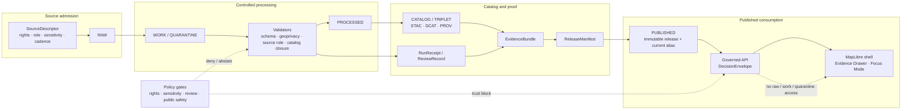

<!-- [KFM_META_BLOCK_V2]
doc_id: TODO(kfm://doc/<uuid>)
title: Habitat Domain README
type: standard
version: v1
status: draft
owners: TODO(confirm habitat lane steward and documentation-control owner)
created: TODO(verify initial creation date)
updated: 2026-04-22
policy_label: TODO(confirm public|restricted)
related: [docs/architecture/habitat/HABITAT_CONTROL_PLANE_INDEX.md, docs/architecture/habitat/ADR-0001-habitat-schema-home.md, data/registry/habitat/MASTER_REGISTRY_INDEX.md]
tags: [kfm, habitat, domain, evidence, map-first, geoprivacy]
notes: [Repository checkout was not mounted during authoring; owner, created date, policy label, badge targets, and companion-path links require verification before publication.]
[/KFM_META_BLOCK_V2] -->

<a id="top"></a>

# Habitat Domain

Governed orientation for the KFM Habitat lane: source-role-safe habitat evidence, public-safe publication, and EvidenceBundle-backed map/runtime use.

> [!IMPORTANT]
> **Status:** `experimental`  
> **Owners:** `TODO(confirm habitat lane steward and documentation-control owner)`  
> **Path:** `docs/domains/habitat/README.md`  
> **Badges:**        
> **Quick jumps:** [Scope](#scope) · [Repo fit](#repo-fit) · [Accepted inputs](#accepted-inputs) · [Exclusions](#exclusions) · [Directory tree](#directory-tree) · [Quickstart](#quickstart) · [Usage](#usage) · [Diagram](#diagram) · [Reference tables](#reference-tables) · [Definition of done](#definition-of-done) · [FAQ](#faq) · [Appendix](#appendix)

> [!NOTE]
> This README is intentionally **evidence-bounded**. It states KFM Habitat doctrine confidently where the attached corpus supports it, but marks repo implementation, owners, exact paths, CI, routes, and live source behavior as `NEEDS VERIFICATION` until the real checkout is inspected.

---

## Scope

The Habitat lane exists to preserve, expand, and govern habitat knowledge from source intake through public runtime answers while keeping source role, evidence traceability, policy posture, review status, geoprivacy, and rollback visible.

In KFM, Habitat is not one flat dataset. It is a governed domain lane that may include:

- regulatory critical habitat;
- Kansas state listed-species and ecological review context;
- modeled habitat and species-range context;
- occurrence or specimen signals used only with quality, rights, and sensitivity controls;
- landscape state, disturbance, vegetation, and environmental context;
- habitat communities, ecological systems, and vegetation associations;
- connectivity, corridor, barrier, stewardship, restoration, and cross-domain context;
- correction, supersession, and rollback records for released Habitat products.

The lane follows the KFM truth path:

```text
RAW -> WORK / QUARANTINE -> PROCESSED -> CATALOG / TRIPLET -> PUBLISHED
```

Public clients, MapLibre layers, Focus Mode, and Evidence Drawer payloads must consume governed, release-safe artifacts and runtime envelopes. They must not read `RAW`, `WORK`, `QUARANTINE`, or internal canonical stores directly.

[Back to top](#top)

---

## Repo fit

This file is the orientation README for the Habitat domain lane. It should point maintainers toward the control-plane docs, source registries, schemas, validators, policy gates, tests, and released artifacts that make Habitat outputs inspectable.

> [!WARNING]
> The companion paths below are **expected/proposed KFM homes**, not confirmed active-checkout facts from this authoring run. Verify them after mounting the repository and update this table before publishing.

| Relationship | Path / link | Status | Role |
|---|---|---:|---|
| This README | `docs/domains/habitat/README.md` | `PROPOSED / target file` | Domain landing page and navigation surface. |
| Upstream control plane | [`../../architecture/habitat/HABITAT_CONTROL_PLANE_INDEX.md`](../../architecture/habitat/HABITAT_CONTROL_PLANE_INDEX.md) | `NEEDS VERIFICATION` | Index for authoritative, derived, registry, proof, release, backlog, and deferred file families. |
| Schema-home decision | [`../../architecture/habitat/ADR-0001-habitat-schema-home.md`](../../architecture/habitat/ADR-0001-habitat-schema-home.md) | `NEEDS VERIFICATION` | Resolves `contracts/` vs `schemas/` authority before machine contracts are duplicated. |
| Continuity inventory | [`../../architecture/habitat/HABITAT_CONTINUITY_INVENTORY.md`](../../architecture/habitat/HABITAT_CONTINUITY_INVENTORY.md) | `NEEDS VERIFICATION` | Records discovered, expected, migrated, superseded, and deferred Habitat surfaces. |
| Source registry | `../../../data/registry/habitat/MASTER_REGISTRY_INDEX.md` | `NEEDS VERIFICATION` | SourceDescriptor index for Habitat sources, rights, source roles, sensitivity, cadence, and activation state. |
| Machine contracts | `../../../schemas/contracts/v1/habitat/` or `../../../contracts/habitat/` | `CONFLICTED / NEEDS VERIFICATION` | Chosen by ADR before implementation. |
| Validators | `../../../tools/validators/habitat/` | `PROPOSED` | Fail-closed checks for source descriptors, critical habitat, occurrences, geoprivacy, catalog closure, release bundles, and no-regression. |
| Policy gates | `../../../policy/habitat/` | `PROPOSED` | Deny or abstain rules for source-role misuse, sensitive exact locations, rights gaps, and public-release posture. |
| Tests and fixtures | `../../../tests/habitat/` and `../../../tests/fixtures/habitat/` | `PROPOSED` | No-network valid/invalid fixtures and regression tests. |
| Downstream runtime | `../../../apps/<governed-api>/` and `../../../apps/<web-or-ui>/` | `UNKNOWN` | Governed API, MapLibre shell, Evidence Drawer, and Focus Mode bindings after proof objects pass. |

### Upstream / downstream rule

Habitat outputs may support Fauna, Flora, Hydrology, Soils, Atmosphere, Hazards, Agriculture, Infrastructure, Geology, Archaeology, and People/Land contexts only through explicit relation edges, dependency manifests, and EvidenceBundle references. Cross-domain fusion must preserve provenance and source-role meaning.

[Back to top](#top)

---

## Accepted inputs

Use this directory and its companion Habitat control-plane files for materials that belong to the Habitat lane and can be governed through KFM’s evidence path.

| Input family | Belongs here when… | Required posture |
|---|---|---|
| **Source descriptors** | The descriptor identifies Habitat source role, authority, rights, sensitivity, access mode, update cadence, normalization, and downstream consumers. | `SourceDescriptor` first; no live fetch until verified. |
| **Regulatory critical habitat fixtures** | The fixture is small, reviewable, and contains species linkage, designation/legal status, effective date, source record ID, geometry hash, and spec hash. | `regulatory_critical_habitat`; not modeled habitat. |
| **Kansas state review/list context** | KDWP or state-review context is represented with source date, status meaning, county/context semantics, and public-safe geometry. | Review context, not permit/legal conclusion unless source and review support that claim. |
| **Modeled habitat and range context** | A model release has model version, support/resolution, covariates, uncertainty, limitations, and source-role labels. | `modeled`; never used to answer “in designated critical habitat.” |
| **Occurrence/specimen signals** | Records include taxon, time, geometry, precision, source, rights, sensitivity, and publication eligibility. | Quarantine or deny when rights, precision, provenance, or sensitivity are unresolved. |
| **Landscape and community context** | NLCD, GAP, LANDFIRE, HLS/NDVI, NWI, PAD-US, local surveys, or similar products are represented with source version, acquisition/valid time, classification, masks, support scale, and uncertainty. | Context layer unless promoted with source-role-appropriate claims. |
| **Derived habitat assignments** | Joins or point-to-raster samples are reproducible derived artifacts with derivation parameters, dependency refs, and validation state. | Derived artifact, not canonical truth. |
| **Catalog/proof/release objects** | STAC/DCAT/PROV records, ReleaseManifest, EvidenceBundle, DecisionEnvelope examples, ReviewRecord, CorrectionNotice, and RollbackReceipt link coherently. | Complete local refs and stable digest/spec alignment. |
| **Documentation-control updates** | A change updates scope, file expectations, compatibility, preservation, source-role taxonomy, publication rules, or no-regression logic. | Update this README and the relevant control-plane doc together. |

[Back to top](#top)

---

## Exclusions

Do not place these in the Habitat lane without an explicit ADR, source admission review, or a narrower downstream home.

| Exclusion | Where it goes instead | Why |
|---|---|---|
| Live GBIF, eBird, iNaturalist, KDWP, NatureServe, USFWS, LANDFIRE, GAP, NLCD, NWI, or PAD-US connectors without SourceDescriptor review | `pipelines/` or connector-specific work after registry approval | Live source activation depends on rights, terms, cadence, credentials, and sensitivity checks. |
| Exact sensitive species or occurrence locations in public files | Restricted source stores and reviewed generalized public derivatives | Habitat and biodiversity lanes fail closed on sensitive exact-location exposure. |
| Raw source dumps, work-in-progress outputs, quarantine records, or internal canonical stores | `data/raw/`, `data/work/`, `data/quarantine/`, or internal canonical homes | Public domain docs and UI surfaces must not normalize direct internal-store access. |
| Modeled habitat used as regulatory critical habitat | Policy denial / source-role correction | Critical habitat, modeled habitat, range, and occurrence data are separate evidence roles. |
| Browser-side evidence stitching or policy inference | Governed API and prepared Evidence Drawer payloads | The UI renders trust; it does not manufacture truth. |
| AI-generated habitat conclusions without EvidenceBundle resolution | Governed AI / Focus Mode only after evidence and policy checks | AI is interpretive support, not a root truth source. |
| Multi-source fusion that erases provenance | Derived release with dependency manifest and EvidenceBundle refs | Cross-domain outputs must preserve source roles and support scale. |
| Generic GIS tutorials or textbook material | `docs/reference/`, training, or learning docs | This README is a lane control surface, not a general GIS primer. |

[Back to top](#top)

---

## Directory tree

### Confirmed target file

```text
docs/domains/habitat/
└── README.md
```

### Expected companion surfaces

```text
docs/architecture/habitat/
├── HABITAT_CONTROL_PLANE_INDEX.md
├── HABITAT_CONTINUITY_INVENTORY.md
├── HABITAT_PRESERVATION_MATRIX.md
├── HABITAT_COMPATIBILITY_MAP.md
├── HABITAT_FILE_EXPECTATIONS_LEDGER.md
├── HABITAT_CHANGE_LEDGER.md
├── HABITAT_EXPANSION_BACKLOG.md
├── RUNTIME_EVIDENCE_MODEL.md
├── PUBLICATION_RULES.md
└── ADR-0001-habitat-schema-home.md

data/registry/habitat/
├── MASTER_REGISTRY_INDEX.md
├── usfws_critical_habitat.yaml
├── kdwp_listed_species.yaml
├── kdwp_ecological_review.yaml
├── usgs_gap_habitat_models.yaml
├── landfire_landscape_state.yaml
├── gbif_occurrences.yaml
├── idigbio_occurrences.yaml
├── natureserve_public.yaml
├── habitat_communities.yaml
└── connectivity_context.yaml

schemas/contracts/v1/habitat/        # or contracts/habitat/, after ADR
policy/habitat/
tools/validators/habitat/
tests/habitat/
tests/fixtures/habitat/
data/catalog/habitat/
data/receipts/habitat/
data/proofs/habitat/
data/manifests/habitat/
data/published/habitat/
```

> [!CAUTION]
> This tree is **not** a claim that these files already exist. It is the expected Habitat lane shape to verify, create, migrate, or explicitly reject in the first control-plane PR.

[Back to top](#top)

---

## Quickstart

### 1. Verify the checkout before editing

Run this from the repository root before changing Habitat docs:

```bash
git status --short
git branch --show-current

test -f docs/domains/habitat/README.md && sed -n '1,120p' docs/domains/habitat/README.md

find docs/domains/habitat \
     docs/architecture/habitat \
     data/registry/habitat \
     schemas/contracts/v1/habitat \
     contracts/habitat \
     policy/habitat \
     tools/validators/habitat \
     tests/habitat \
     tests/fixtures/habitat \
     -maxdepth 3 -type f 2>/dev/null | sort
```

### 2. Check for schema-home drift

```bash
find schemas contracts -maxdepth 5 -type f \
  \( -iname '*habitat*schema*.json' -o -ipath '*habitat*' \) \
  2>/dev/null | sort
```

If both `schemas/contracts/v1/habitat/` and `contracts/habitat/` contain machine-authoritative versions, stop and update `docs/architecture/habitat/ADR-0001-habitat-schema-home.md` before adding more definitions.

### 3. Keep the first Habitat PR no-network

```bash
# Adapt to repo-native tooling after inspection.
# This command is intentionally non-network and may need path updates.
python -m pytest tests/habitat -q
```

> [!NOTE]
> Prefer fixture-based validation first: valid examples pass, invalid examples fail, sensitive exact public output is denied, missing rights quarantine, and missing PROV catalog closure fails.

[Back to top](#top)

---

## Usage

### Add or revise a Habitat source

1. Create or update a source descriptor under `data/registry/habitat/`.
2. Record source role, authority, rights, sensitivity, access mode, update cadence, and downstream consumers.
3. Add at least one valid fixture and one invalid fixture.
4. Run the source descriptor validator.
5. Keep live fetch disabled until source terms, endpoint behavior, cadence, and steward review are verified.

### Publish a Habitat-derived artifact

A Habitat artifact is not publication-ready until all of these resolve:

- source descriptor;
- validation report;
- catalog refs: STAC, DCAT, and PROV;
- run receipt;
- EvidenceBundle;
- ReleaseManifest;
- review record;
- policy decision;
- rollback or correction path;
- DecisionEnvelope-compatible runtime outcome.

### Bind to MapLibre, Evidence Drawer, or Focus Mode

Only bind UI/API surfaces after backend proof objects and policy gates pass.

The UI may show:

- released layer metadata;
- evidence refs;
- freshness and review state;
- source-role labels;
- public-safe geometry;
- denial or abstention reasons;
- correction and supersession state.

The UI must not compute policy significance, infer source authority, or reconstruct catalog closure in browser code.

[Back to top](#top)

---

## Diagram



[Back to top](#top)

---

## Reference tables

### Source-role matrix

| ID | Family | Primary source family | Preserved semantics | Hard boundary |
|---:|---|---|---|---|
| A | Regulatory Critical Habitat | USFWS ECOS / official critical-habitat services | Species linkage, designation type, legal status, effective date, source record ID, geometry hash, spec hash, review state | Critical habitat is not modeled habitat, species range, occurrence data, stewardship context, or community classification. |
| B | Kansas State Review Context | KDWP listed species / ecological review context | State status, review language, county or generalized context, source date, limitations | Review context is not a permit conclusion unless source and review explicitly support it. |
| C | Modeled Habitat / Species Range | USGS GAP, NatureServe public products, approved models | Model version, support scale, input covariates, confidence, limitations | Modeled habitat and range never answer “in designated critical habitat.” |
| D | Occurrence / Specimen Signal | GBIF, iDigBio, controlled local fixture, approved occurrence sources | Taxon, time, geometry, precision, rights, sensitivity, provenance, quality flags | Occurrence points are not habitat boundaries or proof of absence/presence without quality context. |
| E | Landscape State / Disturbance / Environmental Context | LANDFIRE, HLS/NDVI, land cover, hydrology, soils, elevation, climate context | Source version, acquisition date, resolution/support, masks, uncertainty, observed vs interpreted state | Context layers remain context unless promoted with source-role-appropriate claims. |
| F | Habitat Communities / Ecological Systems | GAP/LANDFIRE ecosystems, vegetation associations, local surveys | Classification system, version, crosswalk basis, confidence, scale/support | Do not silently collapse communities into single-species habitat. |
| G | Connectivity / Corridor / Barrier Context | Movement models, fragmentation layers, road/rail/hydrology barrier context | Method, assumptions, support scale, observed/model/inferred state, uncertainty | Connectivity is not direct occurrence or regulatory designation. |
| H | Management / Stewardship / Restoration Context | PAD-US, easements, stewardship/restoration records where admissible | Rights, public-safe status, activity/effective dates, steward review | Ownership or stewardship does not become habitat truth without evidence. |
| I | Temporal Habitat State / Change / Correction Lineage | Versioned releases, change products, correction notices | Effective dates, observation windows, release time, correction lineage, supersession lineage | Changes must preserve old releases and explain differences. |
| J | Cross-Domain Linkage | Fauna, flora, hydrology, soils, atmosphere, hazards, agriculture, infrastructure, geology, archaeology, people/land context | Source roles, crosswalk method, linked evidence refs, confidence, policy constraints | Fusion may derive outputs, but must not erase provenance or source-role meaning. |

### Runtime outcome grammar

| Outcome | Use when | Habitat example |
|---|---|---|
| `ANSWER` | EvidenceBundle resolves, release is approved, policy permits output, and source role supports the question. | Released USFWS critical-habitat fixture intersects the requested AOI. |
| `ABSTAIN` | Evidence is missing, not released, not reviewed, stale, or source role cannot support the question. | Modeled habitat exists but the user asks whether an area is designated critical habitat. |
| `DENY` | Policy blocks the request. | Public caller requests exact sensitive occurrence coordinates. |
| `ERROR` | System/schema/runtime failure occurs. | Runtime envelope cannot be validated or required proof object is malformed. |

### Required proof surfaces

| Surface | Must prove | Failure should |
|---|---|---|
| `SourceDescriptor` | Authority, source role, rights, sensitivity, access, cadence, and activation state are explicit. | Block live fetch and public release. |
| `ValidationReport` | Valid fixtures pass; invalid fixtures fail for the intended reason. | Fail closed. |
| `RunReceipt` | Processing inputs, code/spec version, time, hashes, and output refs are auditable. | Prevent promotion. |
| `CatalogMatrix` / catalog refs | STAC, DCAT, and PROV refs are complete and aligned. | Fail catalog closure. |
| `EvidenceBundle` | Claims resolve to sources, reviews, policy, limitations, integrity, and release refs. | Force `ABSTAIN` or `ERROR`. |
| `ReleaseManifest` | Published artifact is immutable, versioned, and rollback-capable. | Prevent public alias update. |
| `DecisionEnvelope` | Runtime result is finite, explainable, and policy-visible. | Block UI/Focus consumption. |

[Back to top](#top)

---

## Definition of done

A Habitat PR is not done because a layer renders. It is done when the claim path is inspectable.

- [ ] README metadata block is current, placeholders are either resolved or intentionally documented.
- [ ] Owner and policy label are verified or marked with explicit TODOs.
- [ ] Habitat control-plane index exists or this README clearly points to its pending home.
- [ ] Schema-home ADR resolves `schemas/contracts/v1/habitat/` vs `contracts/habitat/`.
- [ ] SourceDescriptor schema and validator exist in the chosen machine-contract home.
- [ ] USFWS critical-habitat descriptor fixture exists and validates.
- [ ] Critical-habitat valid fixture passes; missing `effective_date` or source role fails.
- [ ] Occurrence fixtures cover valid public-safe record, missing-license quarantine, and precise sensitive public denial.
- [ ] Geoprivacy transform receipt is emitted for generalized public output.
- [ ] STAC/DCAT/PROV closure passes for a full fixture and fails when PROV is missing.
- [ ] EvidenceBundle and ReleaseManifest refs resolve.
- [ ] DecisionEnvelope examples cover `ANSWER`, `ABSTAIN`, `DENY`, and `ERROR`.
- [ ] No public route reads `RAW`, `WORK`, `QUARANTINE`, or internal canonical stores.
- [ ] MapLibre / Evidence Drawer / Focus Mode bindings consume governed API payloads only.
- [ ] Rollback or correction path preserves old release refs and records current-alias changes.
- [ ] Compatibility map explains any migrated path, field, or bundle ref.
- [ ] No-regression report records preserved, extended, migrated, or intentionally deferred surfaces.

[Back to top](#top)

---

## FAQ

### Is Habitat the source of species truth?

No. Habitat may link to fauna, flora, occurrence, range, review, and regulatory records, but it must preserve their source roles. A habitat layer does not become taxonomic truth, occurrence proof, legal status truth, or regulatory designation unless the evidence and source role support that exact claim.

### Can modeled habitat answer a critical-habitat question?

No. Modeled habitat can provide context with uncertainty and support-scale disclosure. It cannot answer whether an area is federally designated critical habitat.

### Can public maps show exact sensitive occurrences?

No by default. Public outputs use generalized, aggregated, withheld, or otherwise reviewed public-safe geometry. Exact sensitive details require authorization, restricted handling, and secure logging.

### Are derived joins stored as canonical truth?

No. Habitat assignments and cross-domain fusions are derived artifacts with dependency refs, derivation parameters, policy state, evidence refs, and rollback behavior.

### Can Focus Mode summarize Habitat results?

Yes, after EvidenceBundle resolution and policy checks. Focus Mode can summarize released, governed evidence; it cannot invent or authorize claims.

[Back to top](#top)

---

## Appendix

<details>
<summary>Open verification backlog</summary>

| Item | Label | Why it matters |
|---|---:|---|
| Mounted repository inventory | `NEEDS VERIFICATION` | Actual file presence, naming, owners, links, routes, CI, and package manager are unknown. |
| Habitat lane owners | `TODO / NEEDS VERIFICATION` | CODEOWNERS or stewardship docs must confirm who reviews changes. |
| Created date and policy label | `TODO / NEEDS VERIFICATION` | Meta block must not fabricate publication metadata. |
| Schema-home authority | `CONFLICTED / NEEDS VERIFICATION` | Parallel `contracts/` and `schemas/` homes would weaken machine authority. |
| Source rights and endpoint terms | `NEEDS VERIFICATION` | Live source activation and redistribution depend on current source terms. |
| Sensitive occurrence authorization | `NEEDS VERIFICATION` | Exact rare/protected locations require explicit policy and secure handling. |
| OPA/Conftest/Cosign/toolchain availability | `UNKNOWN` | Policy and signing gates cannot be claimed until tooling is present or adapted. |
| UI/API path spelling | `CONFLICTED / NEEDS VERIFICATION` | Prior lineage mentions `apps/governed-api` and `apps/governed_api`; use repo evidence and ADR if needed. |

</details>

<details>
<summary>Maintainer review prompts</summary>

Before publishing this README, answer:

1. Does the active branch already contain a Habitat README or adjacent docs that should be preserved?
2. Are the proposed relative links valid from `docs/domains/habitat/README.md`?
3. Which owner or team is authoritative for Habitat lane review?
4. Which schema home is canonical?
5. Are source descriptors inactive by default?
6. Do public routes and UI layers avoid raw/work/quarantine access?
7. Can a reviewer trace one Habitat claim to EvidenceBundle, ReleaseManifest, catalog refs, policy, and rollback state?
8. Are all sensitive-location examples synthetic, generalized, or explicitly restricted?

</details>

[Back to top](#top)
