<!-- [KFM_META_BLOCK_V2]
doc_id: kfm://doc/domains/habitat/readme
title: Habitat Domain — Lane README
type: standard
version: v1
status: draft
owners: [NEEDS_VERIFICATION — habitat domain steward, docs steward]
created: 2026-05-17
updated: 2026-05-17
policy_label: public
related:
  - docs/domains/README.md
  - docs/domains/fauna/README.md
  - docs/domains/flora/README.md
  - docs/doctrine/directory-rules.md
  - docs/doctrine/lifecycle-law.md
  - docs/doctrine/trust-membrane.md
  - docs/standards/PROV.md
  - docs/standards/ISO-19115.md
tags: [kfm, domain, habitat, ecology, suitability, connectivity, sensitivity]
notes:
  - "Domain README — orients the Habitat lane across all responsibility roots."
  - "Implementation maturity is PROPOSED pending mounted-repo verification."
[/KFM_META_BLOCK_V2] -->

<a id="top"></a>

# Habitat — Domain Lane

> Governed, evidence-first lane for **habitat patches, classes, suitability, connectivity, corridors, restoration opportunity, and stewardship zones** in the Kansas Frontier Matrix (KFM). Habitat models landscape; it does not own species records.

<p align="center">
  <b>Map-first · Time-aware · Evidence-bounded · Sensitivity-redacted by default</b>
</p>


<!-- TODO: replace placeholder Shields.io badges with CI/version/last-updated badges once owners and CI targets are verified. -->

| Field | Value |
|---|---|
| **Domain** | `habitat` |
| **Path** | `docs/domains/habitat/README.md` |
| **Authority level** | **Canonical** (under `docs/`, the human-facing control plane) |
| **Status** | **PROPOSED** lane implementation; **CONFIRMED** doctrine |
| **Owners** | NEEDS VERIFICATION — habitat domain steward (CODEOWNERS placeholder) |
| **Reviewers** | Habitat domain steward + docs steward; policy steward for sensitivity changes |
| **Last reviewed** | 2026-05-17 |

---

## Contents

1. [Purpose & one-line scope](#1-purpose--one-line-scope)
2. [Repo fit — where Habitat lives](#2-repo-fit--where-habitat-lives)
3. [Inputs — accepted source families](#3-inputs--accepted-source-families)
4. [Exclusions — what does NOT belong here](#4-exclusions--what-does-not-belong-here)
5. [Object families & ubiquitous language](#5-object-families--ubiquitous-language)
6. [Lifecycle — RAW → PUBLISHED](#6-lifecycle--raw--published)
7. [Sensitivity, rights, & publication posture](#7-sensitivity-rights--publication-posture)
8. [Cross-lane relations](#8-cross-lane-relations)
9. [Map & viewing products](#9-map--viewing-products)
10. [Governed AI behavior](#10-governed-ai-behavior)
11. [Validation, tests, fixtures](#11-validation-tests-fixtures)
12. [API & contract surfaces](#12-api--contract-surfaces)
13. [Lane diagram](#13-lane-diagram)
14. [Open questions & verification backlog](#14-open-questions--verification-backlog)
15. [Related folders & docs](#15-related-folders--docs)
16. [ADRs](#16-adrs)

---

## 1. Purpose & one-line scope

**Habitat** models land cover, ecological systems, habitat quality and connectivity as **evidence-backed observations and models**, and emits **public-safe derivatives** for sensitive ecological contexts. Habitat is the landscape lane: it owns *places of habitat* and *modeled habitat suitability*, and joins to species records owned by **Fauna** and **Flora** through governed relationships only.

- **Status — doctrine.** CONFIRMED via the KFM Encyclopedia §7.4 and the Domains Culmination Atlas v1.1 Ch. 6.
- **Status — implementation.** PROPOSED. Existing habitat files, schema home, source rights, model fitness, live data permissions, and MapLibre/Evidence Drawer wiring remain NEEDS VERIFICATION pending mounted-repo inspection.

> [!IMPORTANT]
> **Habitat owns landscape, not species.** Occurrence truth belongs to **Fauna**; plant records belong to **Flora**. A modeled habitat patch is not a critical habitat designation, and a suitability raster is not an occurrence. Source-role anti-collapse is enforced: *observed*, *regulatory*, *modeled*, *aggregate*, and *administrative* roles are never interchangeable.

[⬆ back to top](#top)

---

## 2. Repo fit — where Habitat lives

Per **Directory Rules §12 — Domain Placement Law**, a domain MUST NOT become a root folder. The Habitat lane appears as a **segment** inside each responsibility root. This README anchors only the `docs/` segment; sibling segments live in their own responsibility roots and link back here.

```text
docs/domains/habitat/                         ← this README (canonical)
contracts/domains/habitat/                    ← object meanings — PROPOSED
schemas/contracts/v1/domains/habitat/         ← machine shape (ADR-0001 home) — PROPOSED
policy/domains/habitat/                       ← allow/deny/restrict/abstain — PROPOSED
tests/domains/habitat/                        ← enforceability proofs — PROPOSED
fixtures/domains/habitat/                     ← golden / negative samples — PROPOSED
packages/domains/habitat/                     ← shared lane library — PROPOSED
pipelines/domains/habitat/                    ← executable pipeline logic — PROPOSED
pipeline_specs/habitat/                       ← declarative pipeline configs — PROPOSED
data/raw/habitat/                             ← immutable source payloads
data/work/habitat/                            ← in-progress normalization
data/quarantine/habitat/                      ← failed-gate holds
data/processed/habitat/                       ← validated normalized objects
data/catalog/domain/habitat/                  ← catalog/triplet/bundles
data/published/layers/habitat/                ← released, public-safe artifacts
data/registry/sources/habitat/                ← SourceDescriptors for the lane
release/candidates/habitat/                   ← release candidates + manifests
```

> [!NOTE]
> All paths above are **PROPOSED** until verified against the mounted repo. The pattern itself is **CONFIRMED** by Directory Rules §12; the exact siblings present in your branch may lag.

[⬆ back to top](#top)

---

## 3. Inputs — accepted source families

The Habitat lane admits sources only via a `SourceDescriptor` carrying source role, rights, sensitivity, citation, time, and hash. **Source role is a first-class identity attribute** (Atlas v1.1 Ch. 24.1) and is never collapsed.

| Source family | Typical source role(s) | Rights / sensitivity | Freshness | Status |
|---|---|---|---|---|
| **USFWS ECOS / Critical Habitat services** | regulatory / aggregate | rights & current terms NEEDS VERIFICATION; sensitive joins fail closed | source-vintage / cadence specific | PROPOSED |
| **NLCD land cover** | observed (remote-sensed) / modeled (classification) | rights & current terms NEEDS VERIFICATION | source-vintage / cadence specific | PROPOSED |
| **NWI wetlands** | regulatory / observed | rights & current terms NEEDS VERIFICATION | source-vintage / cadence specific | PROPOSED |
| **GAP / LANDFIRE ecological systems** | modeled / observed | rights & current terms NEEDS VERIFICATION | source-vintage / cadence specific | PROPOSED |
| **NatureServe & controlled biodiversity** | aggregate / authority context | rights & current terms NEEDS VERIFICATION; **steward-controlled** | source-vintage / cadence specific | PROPOSED |
| **KDWP state ecological / habitat context** | regulatory / aggregate | rights & current terms NEEDS VERIFICATION | source-vintage / cadence specific | PROPOSED |
| **PAD-US stewardship context** | administrative | rights & current terms NEEDS VERIFICATION | source-vintage / cadence specific | PROPOSED |
| **GBIF / iNaturalist / iDigBio (occurrence inputs)** | observed (occurrence) — **owned by Fauna**; admitted here only as join context under geoprivacy | rights & current terms NEEDS VERIFICATION; geoprivacy applies | source-vintage / cadence specific | PROPOSED |
| **Remote-sensing vegetation indices** | observed / modeled | rights & current terms NEEDS VERIFICATION | source-vintage / cadence specific | PROPOSED |
| **Field surveys & steward-reviewed habitat models** | observed / modeled | rights & current terms NEEDS VERIFICATION | source-vintage / cadence specific | PROPOSED |

[⬆ back to top](#top)

---

## 4. Exclusions — what does NOT belong here

Habitat is a lane, not a topic bucket. The following are explicitly out of scope; misplaced content should be moved to the indicated home before review.

| Out-of-scope content | Correct home | Why |
|---|---|---|
| Animal taxonomic identity, conservation status, occurrence evidence | `docs/domains/fauna/` | Owned by **Fauna**. Habitat may cite occurrence context only under geoprivacy. |
| Plant taxonomic identity, specimens, rare-plant locations | `docs/domains/flora/` | Owned by **Flora**. Habitat may cite vegetation community context only. |
| Watersheds, gauges, wetlands hydrology root truth | `docs/domains/hydrology/` | Hydrology owns water lineage; Habitat consumes context joins. |
| Soil map units, components, horizons | `docs/domains/soil/` | Soil owns substrate; Habitat consumes context joins. |
| Crop & field records | `docs/domains/agriculture/` | Agriculture owns crop lineage. |
| Cross-domain validators (e.g., habitat × fauna × hydrology) | `tools/validators/<topic>/...` | Per Directory Rules §12 "Multi-domain & cross-cutting files" — lowest common responsibility root, no domain segment. |
| Release decisions, signed manifests, rollback cards | `release/candidates/habitat/`, `release/decisions/`, `data/receipts/` | Release lives in `release/`; receipts and proofs live under `data/`. `artifacts/` is not a trust-content home. |
| New schema home outside `schemas/contracts/v1/domains/habitat/` | An accepted ADR is required first | Per **ADR-0001**, `schemas/contracts/v1/...` is canonical. No parallel schema homes. |

> [!WARNING]
> Watcher-as-non-publisher invariant: any process under `tools/`, `pipelines/`, or `connectors/` that observes habitat source state MUST emit candidate decisions and receipts, never write to `data/catalog/` or `data/published/`. Promotion is a governed state transition, not a file move.

[⬆ back to top](#top)

---

## 5. Object families & ubiquitous language

Habitat's canonical object families (CONFIRMED as terms; field realization PROPOSED):

| Object | Purpose | Identity (PROPOSED) | Temporal handling (CONFIRMED) |
|---|---|---|---|
| **HabitatPatch** | Discrete polygonal habitat unit | source id + object role + temporal scope + normalized digest | source / observed / valid / retrieval / release / correction times kept distinct |
| **LandCoverObservation** | Observed land cover at place + time | same | same |
| **EcologicalSystem** | Classified ecological system unit | same | same |
| **HabitatQualityScore** | Scalar / categorical patch quality | same | same |
| **SuitabilityModel** | Modeled suitability surface w/ version & bounds | same | same |
| **ConnectivityEdge** | Patch-graph edge (least-cost / resistance) | same | same |
| **Corridor** | Linear corridor derived from connectivity | same | same |
| **RestorationOpportunity** | Restoration candidate site | same | same |
| **StewardshipZone** | Stewardship / management context | same | same |
| **ModelRunReceipt** | Receipt for a habitat model run (inputs, params, digests) | same | same |
| **UncertaintySurface** | Spatial uncertainty for modeled products | same | same |

**Ubiquitous-language terms** (kept stable; never silently aliased to generic equivalents):
`HabitatPatch`, `LandCoverObservation`, `EcologicalSystem`, `Habitat Quality Score`, `SuitabilityModel`, `ConnectivityEdge`, `Corridor`, `Restoration Opportunity`, `StewardshipZone`, `Regulatory critical habitat`, `Modeled habitat`, `Geoprivacy transform`.

> [!IMPORTANT]
> **"Modeled habitat" is not "regulatory critical habitat."** A suitability surface, however confident, is a **modeled** product and MUST NOT be presented or labeled as a **regulatory** determination. The validator suite includes a modeled-as-critical denial test (PROPOSED).

[⬆ back to top](#top)

---

## 6. Lifecycle — RAW → PUBLISHED

Habitat follows the KFM lifecycle invariant: **RAW → WORK / QUARANTINE → PROCESSED → CATALOG / TRIPLET → PUBLISHED.** Promotion is a **governed state transition**, not a file move.

| Stage | Handling | Gate | Status |
|---|---|---|---|
| **RAW** | Capture immutable source payload or reference with source role, rights, sensitivity, citation, time, and hash. | `SourceDescriptor` exists. | PROPOSED |
| **WORK / QUARANTINE** | Normalize schema, geometry, time, identity, evidence, rights, and policy; hold failures. | Validation + policy gate pass, **or** quarantine reason is recorded. | PROPOSED |
| **PROCESSED** | Emit validated normalized objects, receipts, and public-safe candidates. | `EvidenceRef`, `ValidationReport`, and digest closure exist. | PROPOSED |
| **CATALOG / TRIPLET** | Emit catalog records, `EvidenceBundle`s, graph/triplet projections, and release candidates. | Catalog / proof closure passes. | PROPOSED |
| **PUBLISHED** | Serve released public-safe artifacts through governed APIs and manifests. | `ReleaseManifest`, correction path, rollback target, and review/policy state exist. | PROPOSED |

<details>
<summary><b>Promotion preconditions (expand)</b></summary>

A habitat artifact MAY only advance to **PUBLISHED** when **all** of the following resolve:

- `SourceDescriptor` admissibility — source role, rights, sensitivity, citation, time, hash.
- `EvidenceRef` resolves to a complete `EvidenceBundle` for every supporting claim.
- `ValidationReport` is clean (or accompanied by a documented quarantine path).
- `PolicyDecision` returns **allow** (deny-by-default for any unresolved sensitivity).
- `PromotionDecision` exists, signed by the responsible role(s); separation of duties where maturity justifies it.
- `ReleaseManifest` references all artifacts, model run receipts, and tile/style digests.
- `RollbackCard` and a correction path are in place.

Any unresolved gate fails closed.
</details>

[⬆ back to top](#top)

---

## 7. Sensitivity, rights, & publication posture

Habitat layers can reveal sensitive species context when joined to occurrence records. Exact occurrence-linked habitat outputs **must be generalized, redacted, reviewed, or denied** when they create exposure risk.

> [!CAUTION]
> **Deny-by-default joins.** Critical habitat unit + sensitive-species occurrence + exact geometry is a fail-closed combination. Public-safe derivatives (generalized patches, summary suitability, grid- or watershed-level reporting) are the **only** path to publication unless a documented `Geoprivacy transform` receipt and review state allow it.

Publication posture, in short:
- **Regulatory critical habitat**, **modeled habitat**, **species range**, **occurrence points**, and **landscape context** are not flattened into one another.
- **Sensitive occurrence details deny by default.**
- **Unclear rights, unresolved source role, missing evidence, unresolved sensitivity, or absent release state** blocks public promotion.
- All transforms (generalize, suppress, jitter under constraints, delayed publication, steward-only exact access) emit a **transform receipt** stating input class, output class, reason, policy, reviewer, and residual risk.

[⬆ back to top](#top)

---

## 8. Cross-lane relations

Habitat joins to other lanes through governed relationships that **preserve ownership, source role, sensitivity, and EvidenceBundle support**. Habitat never adopts the truth of a related lane.

| This domain | Related lane | Relation type | Constraint |
|---|---|---|---|
| Habitat | **Fauna** | Habitat assignment & occurrence context (with geoprivacy) | Ownership, source role, sensitivity, evidence preserved |
| Habitat | **Flora** | Vegetation community & rare-plant context under Flora controls | Ownership, source role, sensitivity, evidence preserved |
| Habitat | **Soil / Hydrology** | Substrate, moisture, wetlands, riparian context | Ownership, source role, sensitivity, evidence preserved |
| Habitat | **Hazards** | Fire, drought, flood, smoke, resilience-stress context | Ownership, source role, sensitivity, evidence preserved |
| Habitat | **Agriculture** | Land-use adjacency, CDL crosswalks | Context join only; not a truth path |

The **Habitat × Fauna thin slice** (DOM-HF) is the proposed first proof for ecological lanes: one public-safe occurrence-to-habitat assignment with evidence, sensitivity, release, map, drawer, and Focus-Mode controls — fixture-first, not live-sensitive-source.

[⬆ back to top](#top)

---

## 9. Map & viewing products

PROPOSED Habitat-specific viewing products (all subject to the governed UI rules — popups are never an Evidence Drawer substitute, and clicks must resolve through governed APIs):

- Habitat overlay registry (with source-role badges).
- Critical habitat view (regulatory layer, clearly labeled).
- Modeled habitat view (suitability surface + uncertainty mode).
- Habitat patch map (polygonal patches + class).
- Connectivity / corridor view.
- Restoration opportunity view.
- Sensitivity-redacted mode (deny-by-default for sensitive joins).
- Habitat–Fauna / Habitat–Flora join view (public-safe).
- Evidence Drawer **Habitat panel** with citations, digests, and model run receipts.

Cross-cutting viewing products (CONFIRMED doctrine, applied here): Evidence Drawer, time-aware state, trust badges, correction / stale-state view, governed Focus Mode.

> [!NOTE]
> **No sensitive geometry hidden only by style.** Sensitive geometry must be generalized, redacted, delayed, restricted, or denied **before** tile generation. Style filters are not a sensitivity control.

[⬆ back to top](#top)

---

## 10. Governed AI behavior

CONFIRMED doctrine / PROPOSED implementation. Within this lane, AI is interpretive and evidence-subordinate. The Habitat Focus-Mode adapter:

- **MAY** summarize **released** Habitat `EvidenceBundle`s, compare evidence across versions, explain limitations, and draft steward-review notes.
- **MUST ABSTAIN** when evidence is insufficient, when citations cannot be validated, or when a confidence bound cannot be supported.
- **MUST DENY** where policy, rights, sensitivity (e.g., exact location of a sensitive habitat–occurrence join), or release state blocks the request.
- **MUST NOT** treat a tile, popup, AI summary, search index, or graph projection as sovereign truth.
- **MUST** emit an `AIReceipt` and a `RuntimeResponseEnvelope` with a finite outcome — `ANSWER` / `ABSTAIN` / `DENY` / `ERROR` — plus `evidence_refs`, `policy_decision`, and `citation_validation`.

[⬆ back to top](#top)

---

## 11. Validation, tests, fixtures

PROPOSED test families for the Habitat lane (all expected to fail closed):

- Source descriptor tests — rights, role, sensitivity, freshness completeness.
- Critical-habitat source-role tests — never relabel an aggregate as regulatory or modeled.
- **Modeled-as-critical denial tests** — suitability surface MUST NOT be served as a regulatory critical-habitat designation.
- Occurrence geoprivacy tests — generalized, redacted, or denied outputs for sensitive joins.
- Geometry validity, identity-determinism, and temporal-logic tests.
- Catalog closure & digest closure tests.
- Release-manifest validation & rollback-drill tests.
- No-network fixtures — public-safe, fixture-first.
- **Habitat + Fauna thin-slice fixtures** — one Kansas habitat patch (e.g., NLCD-derived) plus one public-safe fauna occurrence association, uncertainty / citation report, and one generalized public tile.

> [!NOTE]
> Test homes follow Directory Rules: `tests/domains/habitat/...` for enforceability proofs, `fixtures/domains/habitat/...` for golden / negative samples. Validator code, when cross-domain, lives under `tools/validators/<topic>/`, not under a domain segment.

[⬆ back to top](#top)

---

## 12. API & contract surfaces

PROPOSED governed surfaces for the Habitat lane. Public clients reach Habitat **only** through the governed-API trust membrane; canonical stores are never read directly.

| Endpoint / artifact | DTO / schema | Finite outcomes | Status |
|---|---|---|---|
| Habitat feature / detail resolver (route TBD) | `HabitatDecisionEnvelope` | `ANSWER` / `ABSTAIN` / `DENY` / `ERROR` | PROPOSED; exact route UNKNOWN |
| Habitat layer-manifest resolver | `LayerManifest` (domain layer descriptor) | `ANSWER` / `DENY` / `ERROR` | PROPOSED; public-safe release only |
| Habitat Evidence Drawer payload | `EvidenceDrawerPayload` + `EvidenceBundle` projection | `ANSWER` / `ABSTAIN` / `DENY` / `ERROR` | PROPOSED; evidence + policy filtered |
| Habitat Focus-Mode answer | `RuntimeResponseEnvelope` + `AIReceipt` | `ANSWER` / `ABSTAIN` / `DENY` / `ERROR` | PROPOSED; AI never root truth |
| Schema responsibility root | `schemas/contracts/v1/domains/habitat/` | finite validator outcomes | PROPOSED; ADR-0001 home |

[⬆ back to top](#top)

---

## 13. Lane diagram

```mermaid
flowchart LR
  classDef raw fill:#fff7e6,stroke:#d28b00,color:#5a3b00;
  classDef work fill:#fff0f0,stroke:#cc3333,color:#660000;
  classDef proc fill:#eef7ff,stroke:#2e6fb5,color:#0b3a66;
  classDef cat fill:#eef9ee,stroke:#2e7d32,color:#1b4d1f;
  classDef pub fill:#f0eafc,stroke:#5e35b1,color:#2d1a5e;
  classDef gov fill:#f5f5f5,stroke:#666,color:#222;
  classDef ext fill:#ffffff,stroke:#888,color:#333,stroke-dasharray: 4 3;

  subgraph SOURCES["Source families (SourceDescriptor required)"]
    direction TB
    NLCD["NLCD / NWI / GAP / LANDFIRE\n(observed / modeled)"]:::ext
    USFWS["USFWS Critical Habitat\n(regulatory)"]:::ext
    NSERVE["NatureServe / KDWP / PAD-US\n(authority / admin)"]:::ext
    OCC["GBIF / iNat / iDigBio\n(occurrence — Fauna-owned)"]:::ext
  end

  R["data/raw/habitat/"]:::raw
  W["data/work/habitat/"]:::work
  Q["data/quarantine/habitat/"]:::work
  P["data/processed/habitat/"]:::proc
  C["data/catalog/domain/habitat/"]:::cat
  PUB["data/published/layers/habitat/"]:::pub

  SOURCES -->|connector + admit| R
  R -->|normalize · validate · policy| W
  W -. fail-closed .-> Q
  W -->|EvidenceRef · ValidationReport| P
  P -->|EvidenceBundle · catalog closure| C
  C -->|PromotionDecision · ReleaseManifest| PUB

  subgraph GOV["Governed delivery (trust membrane)"]
    direction TB
    API["apps/governed-api/"]:::gov
    UI["apps/explorer-web/\n(MapLibre + Evidence Drawer + Focus Mode)"]:::gov
  end

  PUB --> API --> UI

  subgraph LATERAL["Lateral relations (governed joins only)"]
    direction TB
    F["Fauna (occurrence — geoprivacy)"]:::ext
    FL["Flora (vegetation / rare plants)"]:::ext
    H["Hydrology / Soil (substrate · wetlands)"]:::ext
    HZ["Hazards (fire / drought / flood)"]:::ext
  end
  C <-->|EvidenceBundle-preserving| LATERAL
```



> [!NOTE]
> Diagram reflects **CONFIRMED doctrine** (lifecycle invariant, trust membrane, source-role anti-collapse, governed joins). Specific path siblings are **PROPOSED** until the mounted repo confirms them.

[⬆ back to top](#top)

---

## 14. Open questions & verification backlog

The following items remain **NEEDS VERIFICATION** until resolved against mounted-repo files, schemas, registry entries, tests, logs, emitted artifacts, review records, or release manifests.

| # | Item | Evidence that would settle it | Status |
|---|---|---|---|
| HAB-V-001 | Official critical-habitat source descriptors (USFWS ECOS endpoint, terms, cadence, rights). | `data/registry/sources/habitat/*` + SourceDescriptor validator pass | NEEDS VERIFICATION |
| HAB-V-002 | Sensitive-occurrence policy and geoprivacy-transform receipt schema for habitat × fauna joins. | `policy/domains/habitat/*`, `schemas/contracts/v1/domains/habitat/geoprivacy_transform_receipt.schema.json`, denial tests | NEEDS VERIFICATION |
| HAB-V-003 | Model-card requirements for suitability products (inputs, training/source support, bounds, uncertainty). | `contracts/domains/habitat/SuitabilityModel.md` + model-run receipt schema + sample card | NEEDS VERIFICATION |
| HAB-V-004 | Habitat MapLibre overlay registry & Focus-Mode behavior. | `data/published/layers/habitat/*` registry, layer manifest fixture, Focus Mode citation-validation tests | NEEDS VERIFICATION |
| HAB-V-005 | Habitat × Fauna thin-slice fixture set (one Kansas patch + one public-safe occurrence + uncertainty report + generalized tile). | `fixtures/domains/habitat/thin_slice/*` + green CI run | NEEDS VERIFICATION |
| HAB-V-006 | Validator exit-code contract for habitat-specific denials (modeled-as-critical, sensitive-join). | `tools/validators/...` + pinned exit-code matrix (pending ADR) | NEEDS VERIFICATION |
| HAB-V-007 | Owners + CODEOWNERS for `docs/domains/habitat/` and sibling segments. | `.github/CODEOWNERS` + per-root README owner lines | NEEDS VERIFICATION |
| HAB-V-008 | Runbook subfolder convention (e.g., `docs/runbooks/habitat/` vs. flat `docs/runbooks/habitat_*.md`). | ADR or accepted convention in `docs/runbooks/README.md` | NEEDS VERIFICATION |

[⬆ back to top](#top)

---

## 15. Related folders & docs

- **Doctrine.** [`docs/doctrine/directory-rules.md`](../../doctrine/directory-rules.md) · [`docs/doctrine/lifecycle-law.md`](../../doctrine/lifecycle-law.md) · [`docs/doctrine/trust-membrane.md`](../../doctrine/trust-membrane.md) · [`docs/doctrine/truth-posture.md`](../../doctrine/truth-posture.md)
- **Sibling domain READMEs.** [`docs/domains/fauna/README.md`](../fauna/README.md) · [`docs/domains/flora/README.md`](../flora/README.md) · [`docs/domains/hydrology/README.md`](../hydrology/README.md) · [`docs/domains/soil/README.md`](../soil/README.md) · [`docs/domains/hazards/README.md`](../hazards/README.md)
- **Architecture.** [`docs/architecture/governed-api.md`](../../architecture/governed-api.md) · [`docs/architecture/map-shell.md`](../../architecture/map-shell.md) · [`docs/architecture/contract-schema-policy-split.md`](../../architecture/contract-schema-policy-split.md)
- **Standards.** [`docs/standards/PROV.md`](../../standards/PROV.md) · [`docs/standards/ISO-19115.md`](../../standards/ISO-19115.md) · [`docs/standards/PMTILES.md`](../../standards/PMTILES.md) · [`docs/standards/OGC-API-TILES.md`](../../standards/OGC-API-TILES.md) · [`docs/standards/OAI-PMH.md`](../../standards/OAI-PMH.md)
- **Sources.** [`docs/sources/SOURCE_DESCRIPTOR_STANDARD.md`](../../sources/SOURCE_DESCRIPTOR_STANDARD.md)
- **Registers.** [`docs/registers/AUTHORITY_LADDER.md`](../../registers/AUTHORITY_LADDER.md) · [`docs/registers/DRIFT_REGISTER.md`](../../registers/DRIFT_REGISTER.md) · [`docs/registers/VERIFICATION_BACKLOG.md`](../../registers/VERIFICATION_BACKLOG.md)
- **Lane siblings (responsibility roots).**
  - `contracts/domains/habitat/` — object meanings
  - `schemas/contracts/v1/domains/habitat/` — object shape (ADR-0001 home)
  - `policy/domains/habitat/` — allow / deny / restrict / abstain
  - `tests/domains/habitat/` · `fixtures/domains/habitat/`
  - `pipelines/domains/habitat/` · `pipeline_specs/habitat/`
  - `data/raw|work|quarantine|processed/habitat/` · `data/catalog/domain/habitat/` · `data/published/layers/habitat/`
  - `data/registry/sources/habitat/`
  - `release/candidates/habitat/`

> [!NOTE]
> Links above are **relative** and **PROPOSED**. Any link to a file not yet present should remain in this list as a placeholder so the verification backlog stays explicit.

[⬆ back to top](#top)

---

## 16. ADRs

| ADR | Title | Status | Bearing on Habitat |
|---|---|---|---|
| **ADR-0001** | Schema home (`schemas/contracts/v1/...` canonical) | accepted | Habitat schemas MUST land under `schemas/contracts/v1/domains/habitat/`. No parallel home. |
| **ADR-TBD** | Validator exit-code contract (pending) | proposed | Pins finite-outcome codes for habitat denials (e.g., modeled-as-critical, sensitive-join). See HAB-V-006. |
| **ADR-TBD** | `PROV.md` vs. `PROVENANCE.md` naming (pending) | proposed | Affects how this README's `docs/standards/PROV.md` link resolves once normalized. |
| **ADR-TBD** | Runbook subfolder convention (pending) | proposed | Affects the path for `docs/runbooks/habitat/...` vs. flat prefix. See HAB-V-008. |

[⬆ back to top](#top)

---

<details>
<summary><b>Appendix A — Source-role anti-collapse quick reference (expand)</b></summary>

KFM treats source role as a first-class identity attribute (Atlas v1.1 Ch. 24.1). For Habitat in particular:

| Role | Habitat example | Forbidden relabeling |
|---|---|---|
| **Observed** | NLCD land-cover classification at a place + time; field survey | Never call an observed land-cover sample a "regulatory" designation. |
| **Regulatory** | USFWS designated critical habitat unit; NWI wetland regulatory class | Never call a critical-habitat unit an "observation" or a "modeled" estimate. |
| **Modeled** | GAP/LANDFIRE ecological system classification; suitability raster; corridor least-cost surface | Never serve a modeled suitability surface as a regulatory critical habitat. |
| **Aggregate** | NatureServe summary; county-level habitat totals | Never treat as per-place evidence. |
| **Administrative** | PAD-US stewardship boundary | Never collapse with observation or regulation. |

The lifecycle and the governed API both fail closed when these roles are conflated.

</details>

<details>
<summary><b>Appendix B — Habitat × Fauna thin-slice acceptance sketch (expand)</b></summary>

The thin slice (PROPOSED) is the proof that the Habitat lane can publish one occurrence-to-habitat assignment **safely**:

1. **One Kansas habitat patch fixture** (e.g., NLCD-derived) under `fixtures/domains/habitat/thin_slice/`.
2. **One public-safe fauna occurrence** (Fauna-owned, geoprivacy-transformed) cited via EvidenceRef.
3. **One assignment** linking the patch to the occurrence under a governed relation, with EvidenceBundle support.
4. **One ValidationReport** clean for schema, geometry, time, identity, evidence, rights, sensitivity.
5. **One PolicyDecision** = allow (deny-by-default for any unresolved sensitivity).
6. **One PromotionDecision** + **ReleaseManifest** + **RollbackCard**.
7. **One LayerManifest** + **generalized public tile** + **EvidenceDrawerPayload**.
8. **One Focus-Mode answer** with finite outcome and AIReceipt; citation validation green.
9. **One rollback drill** completing cleanly.

Acceptance is reached when each of (1)–(9) exists, is digest-closed, and a no-network CI run passes.

</details>

---

**Last updated:** 2026-05-17 · **Status:** draft · **Authority:** canonical (under `docs/`) · **Lifecycle posture:** deny-by-default for sensitive joins.

[⬆ back to top](#top)
