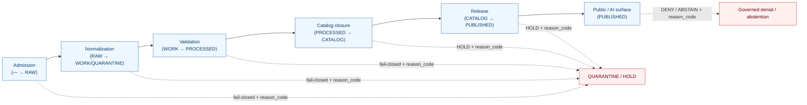

<!-- [KFM_META_BLOCK_V2]
doc_id: kfm://doc/domains/habitat/reason-codes
title: Habitat Domain — Reason Code Catalog
type: standard
version: v1
status: draft
owners: [NEEDS_VERIFICATION — habitat domain steward, policy steward, docs steward]
created: 2026-06-05
updated: 2026-06-05
policy_label: public
contract_version: "3.0.0"   # pinned per ai-build-operating-contract.md
related:
  - docs/domains/habitat/README.md
  - docs/domains/habitat/PRESERVATION_MATRIX.md
  - docs/domains/fauna/README.md
  - docs/doctrine/directory-rules.md
  - docs/doctrine/policy-aware.md
  - docs/standards/PROV.md
  - control_plane/policy_gate_register.yaml
  - control_plane/release_state_register.yaml
  - ai-build-operating-contract.md
tags: [kfm, domain, habitat, reason-codes, policy, deny, abstain, quarantine, governance]
notes:
  - "Reason-code catalog localizes the Atlas §24.6.3 master gate-failure reason codes and the §24.3 finite-outcome classes to the Habitat lane."
  - "Master outcome classes (ANSWER/ABSTAIN/DENY/ERROR/HOLD + PASS/FAIL) are CONFIRMED doctrine; all reason-code identifiers are PROPOSED pending ADR-S-04-class vocabulary review and a mounted policy_gate_register."
  - "Habitat-local reason codes (JOIN_SENSITIVE_OCCURRENCE, MODEL_LABEL_COLLAPSE, etc.) are PROPOSED extensions of the master catalog."
  - "Path uses the Directory Rules §12 segment form (docs/domains/habitat/); Atlas §24.13 flat-form drift is tracked in the lane README (HAB-V-009)."
  - "CONTRACT_VERSION = \"3.0.0\""
[/KFM_META_BLOCK_V2] -->

<a id="top"></a>

# 🌿 Habitat — Reason Code Catalog

> The Habitat lane's localized catalog of **finite outcomes** and **reason codes** — the fixed vocabulary that every Habitat validator, policy gate, governed-API surface, and Focus-Mode answer uses to explain *why* a transition failed closed, was denied, abstained, or was held.

<p align="center">
  <b>Fail-closed · Reason-coded · Auditable · Deny-by-default for sensitive joins</b>
</p>


-orange)


<!-- TODO: replace static badges with CI-driven Shields endpoints once owners and policy_gate_register are verified (NEEDS VERIFICATION). -->

**Status:** draft &middot; **Owners:** habitat domain steward · policy steward · docs steward *(placeholders)* &middot; **Contract:** `CONTRACT_VERSION = "3.0.0"` &middot; **Last updated:** 2026-06-05

---

## Contents

1. [Purpose & scope](#1-purpose--scope)
2. [How reason codes fit the lifecycle](#2-how-reason-codes-fit-the-lifecycle)
3. [Finite outcome classes](#3-finite-outcome-classes)
4. [Reason-code grammar & conventions](#4-reason-code-grammar--conventions)
5. [Inherited master gate-failure codes](#5-inherited-master-gate-failure-codes)
6. [Habitat-specific reason codes](#6-habitat-specific-reason-codes)
7. [Code → outcome → recovery matrix](#7-code--outcome--recovery-matrix)
8. [Where reason codes are emitted](#8-where-reason-codes-are-emitted)
9. [Worked examples](#9-worked-examples)
10. [Open questions register](#10-open-questions-register)
11. [Open verification backlog](#11-open-verification-backlog)
12. [Changelog](#12-changelog)
13. [Definition of done](#13-definition-of-done)
14. [Related docs](#14-related-docs)

---

## 1. Purpose & scope

This catalog gives the Habitat lane **one fixed vocabulary** for explaining a fail-closed event. Reason codes are the machine-readable tail of a governed decision: they travel inside `PolicyDecision.reason_code`, `AIReceipt.reason_codes[]`, `ValidationReport.failures[]`, and the `reasons[]` field of a `DecisionEnvelope`. Without a stable code, a denial is just prose; with one, it is auditable, comparable across runs, and tied to a documented recovery path.

This document does **two** things:
1. **Inherits** the Atlas §24.6.3 master gate-failure reason codes (the cross-domain catalog) without restating them as new codes — Habitat does not fork the master vocabulary.
2. **Adds** a small set of Habitat-specific reason codes for failure modes that are unique to the landscape lane — chiefly model/observation collapse and habitat × sensitive-occurrence joins.

> [!NOTE]
> This catalog is a **reference**, not an enforcement surface. It is read by validators, policy bundles, the Evidence Drawer, governed-AI surfaces, and human stewards. The codes here become binding only when an accepted ADR (ADR-S-04-class vocabulary review) and a mounted `control_plane/policy_gate_register.yaml` confirm them. **(CONFIRMED that a fixed reason vocabulary is required doctrine; PROPOSED for every specific identifier below.)**

[⬆ back to top](#top)

---

## 2. How reason codes fit the lifecycle

A reason code is what a gate emits when a transition **does not** close. The Habitat lane follows the universal invariant `RAW → WORK / QUARANTINE → PROCESSED → CATALOG / TRIPLET → PUBLISHED`; every gate either closes (PASS / ANSWER) or fails closed with a reason code and the prior state is preserved.



*Diagram status:* **CONFIRMED** for the gate sequence and the fail-closed-with-reason rule (Atlas §24.6.1–§24.6.2). **PROPOSED** for the exact routing of each code, pending validator/policy binding.

> [!IMPORTANT]
> A transition closes only when (i) required artifacts exist, (ii) every required artifact **resolves** its dependencies (`EvidenceRef → EvidenceBundle`, `model_id → ModelRunReceipt`), and (iii) the policy gate evaluated and recorded its decision. Missing any of these fails closed with a reason code. **(CONFIRMED — Atlas §24.6.2 universal closure rules.)**

[⬆ back to top](#top)

---

## 3. Finite outcome classes

Every Habitat governed surface returns a finite outcome from the small, well-known set below. Reason codes qualify the non-`ANSWER` / non-`PASS` outcomes. **(CONFIRMED doctrine — Atlas §24.3.1.)**

| Outcome | When it fires | Carries reason code? | Required artifacts |
|---|---|---|---|
| `ANSWER` | Evidence sufficient, policy permits, release state allows, review (if required) recorded. | No | Resolved `EvidenceBundle`; `PolicyDecision = allow`; `ReleaseManifest` applies. |
| `ABSTAIN` | Evidence insufficient, surface cannot cite, or evidence stale with no released alternative. | **Yes** | `AIReceipt` with reason; no claim emitted. |
| `DENY` | Policy, rights, sensitivity, or release state forbids the answer. Sensitive lanes default here. | **Yes** | `PolicyDecision = deny` + `reason_code`; `AIReceipt` records denial. |
| `ERROR` | Governed API cannot evaluate — missing schema, malformed query, contract violation, infra failure. | **Yes** | Error envelope with diagnostic code; no claim leakage. |
| `HOLD` | Promotion / release / correction paused pending steward, rights-holder, or policy review. | **Yes** | `ReviewRecord` pending; `PolicyDecision = hold`; no public claim while held. |
| `PASS` *(validator-class)* | Validator / admission check completed; input acceptable. | No | `ValidationReport` pass. Internal only. |
| `FAIL` *(validator-class)* | Validator / admission check completed; input unacceptable. | **Yes** | `ValidationReport` with failure list; quarantine where appropriate. |

> [!CAUTION]
> For the Habitat lane, **sensitive habitat × occurrence joins default to `DENY`**, not `ANSWER`. The default posture is fail-closed; a reason code explains the denial and points the consumer at a public-safe surface where one exists. **(CONFIRMED — Atlas §24.3.1; Habitat dossier §I; deny-by-default register §20.5.)**

[⬆ back to top](#top)

---

## 4. Reason-code grammar & conventions

The conventions below are **PROPOSED** for ADR-S-04-class vocabulary review. They keep the Habitat codes aligned with the master catalog so a reviewer can read any code without a lookup table.

- **Casing.** `UPPER_SNAKE_CASE`, ASCII only. *(Matches the master catalog: `MISSING_RECEIPT`, `ROLE_COLLAPSE`.)*
- **No domain prefix on inherited codes.** Habitat reuses master codes verbatim — never `HAB_MISSING_RECEIPT`. Forking the master vocabulary is a drift event.
- **Habitat-specific codes are unprefixed but lane-scoped by documentation.** They are registered here and in `control_plane/policy_gate_register.yaml`; the register, not the string, scopes them to Habitat.
- **One code per distinct, recoverable failure.** A code names a failure *family* with a documented recovery path, not a stack trace.
- **Codes are stable vocabulary.** Renaming or removing a code requires an ADR; codes may be **deprecated** (kept, marked superseded, forward-linked) but not silently deleted. *(Mirrors the source-role / object-family stability rule.)*
- **Emission, not invention.** A surface emits only registered codes. An unregistered string is itself an `ERROR` (`CONTRACT_DRIFT`).

> [!NOTE]
> Reason codes are distinct from **finite outcomes** (§3) and from **policy families**. A `DecisionEnvelope` carries `outcome` (the finite class), `policy_family` (`promotion | access | render | capability | consent | sensitivity`), and `reasons[]` (the codes). This catalog governs the last of the three. **(Outcome classes CONFIRMED; `DecisionEnvelope` shape PROPOSED per KFM-P5-PROG-0001.)**

[⬆ back to top](#top)

---

## 5. Inherited master gate-failure codes

Habitat **inherits** the Atlas §24.6.3 master gate-failure reason codes verbatim. They are listed here for navigability with their Habitat-relevant trigger; the master catalog remains authoritative. **(Master catalog is a PROPOSED catalog in Atlas §24.6.3; Habitat does not redefine these codes.)**

| Reason code (inherited) | Failure family | Habitat-relevant trigger | Recovery path |
|---|---|---|---|
| `MISSING_RECEIPT` | Missing required artifact | A modeled surface lacks its `ModelRunReceipt`; a transform lacks its `RedactionReceipt` / `AggregationReceipt`. | Re-emit the missing receipt; re-run the gate. |
| `MISSING_EVIDENCE` | Missing required artifact | An `EvidenceRef` does not resolve to an `EvidenceBundle` for a habitat claim. | Resolve the bundle; re-validate. |
| `MISSING_REVIEW` | Missing required artifact | A StewardshipZone or sensitive-join release lacks a required `ReviewRecord`. | Run the required review; supply the record. |
| `SCHEMA_MISMATCH` | Schema / contract mismatch | A HabitatPatch or SuitabilityModel object fails its `schemas/contracts/v1/domains/habitat/` schema. | Fix the object or the schema (ADR if schema changes); re-run the validator. |
| `CONTRACT_DRIFT` | Schema / contract mismatch | A habitat object uses a field or code not in the contract (incl. an unregistered reason code). | Reconcile against `contracts/domains/habitat/`; ADR if doctrine-class. |
| `RIGHTS_UNKNOWN` | Rights / sensitivity unresolved | USFWS ECOS / KDWP / NatureServe source rights are unverified at admission. | Steward review; resolve rights in the `SourceDescriptor`. |
| `SENSITIVITY_UNRESOLVED` | Rights / sensitivity unresolved | A habitat product's sensitivity tier cannot be determined (e.g., unknown join exposure). | Steward / sensitivity review; tier reassignment. |
| `ROLE_COLLAPSE` | Source-role collapse risk | A regulatory critical-habitat layer is treated as observed, or a modeled surface as observed. | Restore the source role; refuse the upcast. |
| `ROLE_DOWNCAST_FORBIDDEN` | Source-role collapse risk | An attempt to relabel a role in-place (e.g., modeled → observed) during promotion. | Reject; promotion never relabels a role. |
| `REVIEW_NEEDED` | Review state inadequate | A sensitive habitat release reaches a gate without the required review. | Run the required review. |
| `REVIEW_INSUFFICIENT` | Review state inadequate | A review exists but does not cover the sensitivity or rights at issue. | Escalate to the correct reviewer role. |
| `REVIEW_REJECTED` | Review state inadequate | A steward or sensitivity reviewer rejected the transition. | Address the rejection reason; resubmit. |
| `RELEASE_MANIFEST_INVALID` | Release infrastructure error | A habitat `ReleaseManifest` is malformed or incomplete. | Fix the manifest; re-run release closure. |
| `ROLLBACK_TARGET_MISSING` | Release infrastructure error | A habitat release lacks a named rollback target. | Supply the rollback target (`RollbackCard`). |

[⬆ back to top](#top)

---

## 6. Habitat-specific reason codes

These codes name failure modes unique to the landscape lane. Each is a **PROPOSED** extension of the master catalog, registered (PROPOSED) in `control_plane/policy_gate_register.yaml`. They exist because the Habitat lane's distinctive risks — heavily modeled public output, and joins to sensitive Fauna / Flora records — are not fully covered by the generic master families.

| Reason code (Habitat-specific) | Outcome | Fires when | Recovery path | Basis |
|---|---|---|---|---|
| `JOIN_SENSITIVE_OCCURRENCE` | `DENY` / `FAIL` → QUARANTINE | A habitat product attempts to publish at a resolution finer than the joined Fauna geoprivacy product, or a join to Occurrence-Restricted / SensitiveSite is attempted without a `RedactionReceipt` + `ReviewRecord`. | Apply geoprivacy generalization; attach `RedactionReceipt` + `ReviewRecord` + `PolicyDecision`; re-evaluate the *output* (not the inputs). | Atlas §24.5.2 "sensitive joins fail closed"; Habitat dossier §I; ADR-S-14. |
| `MODEL_LABEL_COLLAPSE` | `DENY` / `FAIL` | A modeled output (SuitabilityModel, Habitat Quality Score, ConnectivityEdge, Corridor) is labeled or framed as observation. | Re-assert the `model` label via `relabel:model` + `CorrectionNotice`; restore source role. | Atlas §24.1.2 "modeled product labeled as observed → DENY"; Habitat dossier §I. |
| `CRITICAL_HABITAT_FRAMING` | `DENY` / `FAIL` | A modeled suitability surface is framed or served as a **regulatory** critical-habitat designation. | Separate the modeled lane from the regulatory lane; relabel; banner in UI. | Atlas §24.1.2 regulatory-vs-modeled anti-collapse; Habitat dossier §I. |
| `STEWARD_ZONE_OVERRIDE` | `DENY` / `HOLD` | A release would override a steward-declared withholding of a StewardshipZone (incl. tribal / sovereign deny-by-default zones). | Restore the steward's withholding; route to steward review; no publication until resolved. | Atlas §24.5.2 (StewardshipZone T1; deny-by-default for sovereign zones); Habitat dossier §I. |
| `UNCERTAINTY_MISSING` | `FAIL` / `HOLD` | A modeled surface is being released without a paired `UncertaintySurface`. | Attach the `UncertaintySurface` (never at finer resolution than its parent); re-run release closure. | Atlas §24.1.2 (run receipt + uncertainty surface guardrail); Habitat dossier §D/§I. |

> [!WARNING]
> `JOIN_SENSITIVE_OCCURRENCE` is the Habitat lane's most consequential code. **Sensitivity is a property of the output, not the inputs** — a LandCoverObservation joined to a *public* occurrence can still produce a `DENY` if the resulting density surface reveals nesting concentrations. Validators MUST evaluate the produced surface, not infer safety from the inputs. **(CONFIRMED doctrine — Atlas §24.5.2; cross-lane joins are "inference-risk multipliers" per ADR-S-14.)**

[⬆ back to top](#top)

---

## 7. Code → outcome → recovery matrix

A consolidated quick-reference. Outcome mapping is **PROPOSED** for the Habitat-specific codes and follows the master semantics for inherited codes.

<details>
<summary><b>Full code → outcome → recovery matrix (expand)</b></summary>

| Reason code | Source | Typical outcome(s) | Gate(s) | Recovery |
|---|---|---|---|---|
| `MISSING_RECEIPT` | master | `FAIL` / `HOLD` | Normalization · Validation · Catalog · Release | Re-emit receipt; re-run gate. |
| `MISSING_EVIDENCE` | master | `FAIL` / `ABSTAIN` | Validation · Catalog | Resolve `EvidenceBundle`; re-validate. |
| `MISSING_REVIEW` | master | `HOLD` | Catalog · Release | Run review; supply `ReviewRecord`. |
| `SCHEMA_MISMATCH` | master | `ERROR` / `FAIL` | Normalization · Validation | Fix object/schema; re-run validator. |
| `CONTRACT_DRIFT` | master | `ERROR` | Normalization · Validation | Reconcile contract; ADR if doctrine-class. |
| `RIGHTS_UNKNOWN` | master | `DENY` / `HOLD` | Admission · Validation · Catalog · Release | Steward review; resolve rights. |
| `SENSITIVITY_UNRESOLVED` | master | `DENY` / `HOLD` | Admission · Validation · Catalog · Release | Sensitivity review; tier reassignment. |
| `ROLE_COLLAPSE` | master | `DENY` / `FAIL` | Validation · Catalog · Release | Restore role; refuse upcast. |
| `ROLE_DOWNCAST_FORBIDDEN` | master | `DENY` / `FAIL` | Validation · Catalog · Release | Reject relabel; promotion never relabels. |
| `REVIEW_NEEDED` | master | `HOLD` | Catalog · Release | Run required review. |
| `REVIEW_INSUFFICIENT` | master | `HOLD` | Catalog · Release | Escalate to correct reviewer. |
| `REVIEW_REJECTED` | master | `DENY` / `HOLD` | Catalog · Release | Address rejection; resubmit. |
| `RELEASE_MANIFEST_INVALID` | master | `ERROR` / `FAIL` | Release | Fix manifest; re-run closure. |
| `ROLLBACK_TARGET_MISSING` | master | `FAIL` / `HOLD` | Release | Supply rollback target. |
| `JOIN_SENSITIVE_OCCURRENCE` | habitat | `DENY` / `FAIL` | Normalization · Validation · Catalog · Release · Surface | Geoprivacy transform + `RedactionReceipt` + `ReviewRecord`; re-evaluate output. |
| `MODEL_LABEL_COLLAPSE` | habitat | `DENY` / `FAIL` | Validation · Catalog · Release · Surface | `relabel:model` + `CorrectionNotice`. |
| `CRITICAL_HABITAT_FRAMING` | habitat | `DENY` / `FAIL` | Validation · Catalog · Release · Surface | Separate lanes; relabel; UI banner. |
| `STEWARD_ZONE_OVERRIDE` | habitat | `DENY` / `HOLD` | Catalog · Release | Restore withholding; steward review. |
| `UNCERTAINTY_MISSING` | habitat | `FAIL` / `HOLD` | Validation · Release | Attach `UncertaintySurface`; re-run closure. |

</details>

[⬆ back to top](#top)

---

## 8. Where reason codes are emitted

Reason codes are not free-floating strings; they live inside governed artifacts. The Habitat lane emits them in the following carriers. **(Carrier object families CONFIRMED doctrine; field shapes PROPOSED per Atlas §24.2 receipt catalog and KFM-P5-PROG-0001.)**

| Carrier | Field | Emitted at | Notes |
|---|---|---|---|
| `PolicyDecision` | `reason_code` | every governed gate | A `DENY` MUST carry a reason code (Atlas §24.3.1). |
| `AIReceipt` | `reason_codes[]` | every Focus-Mode answer | Records `ABSTAIN` / `DENY` reasons for AI surfaces. |
| `ValidationReport` | `failures[]` | WORK → PROCESSED, catalog & release closure | Each failure names a reason code. |
| `DecisionEnvelope` | `reasons[]` | policy-module output | Normalized envelope `{decision_id, outcome, policy_family, reasons[], obligations[], evaluated_at}` (PROPOSED, KFM-P5-PROG-0001). |
| `RedactionReceipt` | reason / `removed_fields` context | sensitive-join transform | Pairs with `JOIN_SENSITIVE_OCCURRENCE` recovery. |
| `CorrectionNotice` | correction reason | `relabel:model` correction | Pairs with `MODEL_LABEL_COLLAPSE` / `CRITICAL_HABITAT_FRAMING` recovery. |

> [!NOTE]
> The governed AI surface reads only released `EvidenceBundle`s and emits `ABSTAIN` / `DENY` with a reason code — it never reaches RAW / WORK / QUARANTINE content (Atlas §24.5.2: Governed-AI RAW/WORK access = T4). A reason code on an `AIReceipt` is the AI's accountable explanation of a non-answer. **(CONFIRMED doctrine.)**

[⬆ back to top](#top)

---

## 9. Worked examples

Illustrative only — these are **illustrative**, not fixtures drawn from a mounted repo.

<details>
<summary><b>Example 1 — Suitability surface published without uncertainty (expand)</b></summary>

A SuitabilityModel surface reaches the Release gate but no `UncertaintySurface` is attached.

```text
gate:         Release (CATALOG → PUBLISHED)
outcome:      HOLD
policy_family: promotion
reason_code:  UNCERTAINTY_MISSING
recovery:     attach UncertaintySurface (≤ parent resolution); re-run release closure
```

Result: surface remains at CATALOG; no public edge; prior state preserved.
</details>

<details>
<summary><b>Example 2 — Habitat patch joined to a restricted occurrence (expand)</b></summary>

A HabitatPatch is joined to a Fauna Occurrence-Restricted record and the join product is offered at patch resolution.

```text
gate:         Validation (WORK → PROCESSED)
outcome:      FAIL → QUARANTINE
policy_family: sensitivity
reason_code:  JOIN_SENSITIVE_OCCURRENCE
recovery:     generalize to ≥ joined Fauna geoprivacy product;
              attach RedactionReceipt + ReviewRecord + PolicyDecision;
              re-evaluate the OUTPUT surface, not the inputs
```

Result: join product held in QUARANTINE until a public-safe derivative is produced and reviewed.
</details>

<details>
<summary><b>Example 3 — Modeled surface framed as critical habitat at the AI surface (expand)</b></summary>

A Focus-Mode query asks the AI to describe a suitability surface as a regulatory critical-habitat designation.

```text
surface:      Habitat Focus Mode
outcome:      DENY
policy_family: render
reason_code:  CRITICAL_HABITAT_FRAMING
carrier:      AIReceipt.reason_codes[] + PolicyDecision.reason_code
recovery:     answer with the `model` label and uncertainty band, or ABSTAIN
```

Result: the AI does not narrate the modeled surface as a regulatory determination; it returns a reason-coded denial and may offer the correctly-labeled modeled view.
</details>

[⬆ back to top](#top)

---

## 10. Open questions register

| ID | Question | Owner role | Resolution path |
|---|---|---|---|
| OQ-HAB-RC-01 | Are the Habitat-specific codes (§6) adopted into the canonical reason-code vocabulary? | Policy steward | ADR-S-04-class vocabulary review; `control_plane/policy_gate_register.yaml` entry. |
| OQ-HAB-RC-02 | Exact outcome mapping for `JOIN_SENSITIVE_OCCURRENCE` — `DENY` at surface vs `FAIL`→QUARANTINE at validation, or both by gate? | Sensitivity reviewer + policy steward | Validator design + policy bundle; ADR-S-14. |
| OQ-HAB-RC-03 | Is `DecisionEnvelope` (`{decision_id, outcome, policy_family, reasons[], obligations[], evaluated_at}`) the canonical carrier, and is its home `schemas/contracts/v1/runtime/`? | Schema steward | KFM-P5-PROG-0001 acceptance; ADR. |
| OQ-HAB-RC-04 | Do Habitat-specific codes stay unprefixed (register-scoped) or take a lane prefix? | Policy steward | ADR-S-04 naming rule. |
| OQ-HAB-RC-05 | Deprecation mechanics for a retired Habitat code (superseded marker + forward link)? | Docs steward | `docs/registers/DEPRECATION_REGISTER.md` convention. |
| OQ-HAB-RC-06 | Should `UNCERTAINTY_MISSING` be `FAIL` (validation) or `HOLD` (release), or gate-dependent? | Habitat steward | Validator exit-code contract (HAB-V-006 in lane README). |

[⬆ back to top](#top)

---

## 11. Open verification backlog

These items remain `NEEDS VERIFICATION` before promotion from `draft` to `published`:

1. The Atlas §24.6.3 master reason-code catalog is itself PROPOSED — confirm it is adopted (ADR-S-04) before treating inherited codes as binding.
2. `control_plane/policy_gate_register.yaml` exists and registers both the inherited and Habitat-specific codes — verify against a mounted repo.
3. Validator exit-code contract pins the outcome for each code — verify against `tools/validators/...` and the HAB-V-006 backlog item in the lane README.
4. `DecisionEnvelope` schema home (`schemas/contracts/v1/runtime/decision_envelope.schema.json`) — verify presence and field names.
5. `PolicyDecision`, `AIReceipt`, `ValidationReport`, `RedactionReceipt`, `CorrectionNotice` schemas carry a `reason_code` / `reasons[]` / `failures[]` field — verify against `schemas/contracts/v1/`.
6. Cross-lane join policy (ADR-S-14) outcome — confirms the `JOIN_SENSITIVE_OCCURRENCE` posture.
7. Source-role vocabulary (ADR-S-04) — confirms `ROLE_COLLAPSE` / `ROLE_DOWNCAST_FORBIDDEN` apply to the Habitat source families as documented.

[⬆ back to top](#top)

---

## 12. Changelog

| Change | Type (per contract §37) | Reason |
|---|---|---|
| Initial catalog: inherited master codes (§5) + Habitat-specific codes (§6). | new | First reason-code reference for the Habitat lane. |
| Anchored finite-outcome classes and `DENY`-carries-reason-code rule to Atlas §24.3.1. | clarification | Establishes the CONFIRMED basis for the outcome column. |
| Pinned `CONTRACT_VERSION = "3.0.0"` in meta block, badges, and status line. | housekeeping | Required for doctrine-adjacent docs. |
| Used Directory Rules §12 segment path (`docs/domains/habitat/`); noted Atlas §24.13 flat-form drift (HAB-V-009 in lane README). | housekeeping | Consistency with the revised Habitat lane README. |

> **Backward compatibility.** New document — no prior anchors to preserve. The Habitat-specific codes are introduced as PROPOSED; if a later ADR renames any, this catalog will retain the prior code with a superseded marker and a forward link rather than deleting it.

[⬆ back to top](#top)

---

## 13. Definition of done

This document is done enough to enter the repository when:

- it is placed at `docs/domains/habitat/REASON_CODES.md` per Directory Rules §12 (segment form), with the HAB-V-009 path-form conflict tracked in the lane README's DRIFT_REGISTER entry;
- a docs steward, the habitat domain steward, and the policy steward review it;
- it is linked from `docs/domains/habitat/README.md` and the `PRESERVATION_MATRIX.md` §9.1 (which names the Habitat-specific reason codes);
- the inherited codes match the accepted Atlas §24.6.3 catalog (or are reconciled via DRIFT_REGISTER);
- the Habitat-specific codes are registered in `control_plane/policy_gate_register.yaml`;
- the `GENERATED_RECEIPT.json` planned in the PR is wired into CI with `contract_version: "3.0.0"`;
- future changes follow the operating contract's §37 lifecycle and the §4 deprecation rule.

[⬆ back to top](#top)

---

## 14. Related docs

**All targets PROPOSED until confirmed against a mounted repo; path form follows Directory Rules §12 (segment form).**

- [`docs/domains/habitat/README.md`](README.md) — Habitat lane orientation.
- [`docs/domains/habitat/PRESERVATION_MATRIX.md`](PRESERVATION_MATRIX.md) — §9.1 names the Habitat-specific quarantine reasons this catalog formalizes.
- [`docs/domains/fauna/README.md`](../fauna/README.md) — Fauna ownership and the sensitive-occurrence baseline that `JOIN_SENSITIVE_OCCURRENCE` protects.
- [`docs/doctrine/directory-rules.md`](../../doctrine/directory-rules.md) — §12 Domain Placement Law; §2.4 ADR triggers.
- [`docs/doctrine/policy-aware.md`](../../doctrine/policy-aware.md) — fail-safe / deny-by-default doctrine.
- [`docs/standards/PROV.md`](../../standards/PROV.md) — provenance vocabulary for receipts that carry codes.
- [`control_plane/policy_gate_register.yaml`](../../../control_plane/policy_gate_register.yaml) — operational registry for these codes *(NEEDS VERIFICATION)*.
- [`control_plane/release_state_register.yaml`](../../../control_plane/release_state_register.yaml) — release-state vocabulary referenced by `HOLD` outcomes *(NEEDS VERIFICATION)*.
- [`ai-build-operating-contract.md`](../../../ai-build-operating-contract.md) — canonical operating contract (`CONTRACT_VERSION = "3.0.0"`).

---

**Last updated:** 2026-06-05 &middot; **Status:** draft &middot; **Contract:** `CONTRACT_VERSION = "3.0.0"` &middot; **Posture:** fail-closed; deny-by-default for sensitive joins &middot; **Citation short-names:** [DOM-HAB], [DOM-HF], [DOM-FAUNA], [ENCY], [DIRRULES], [GAI]

[⬆ back to top](#top)
