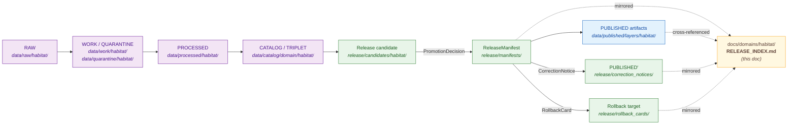
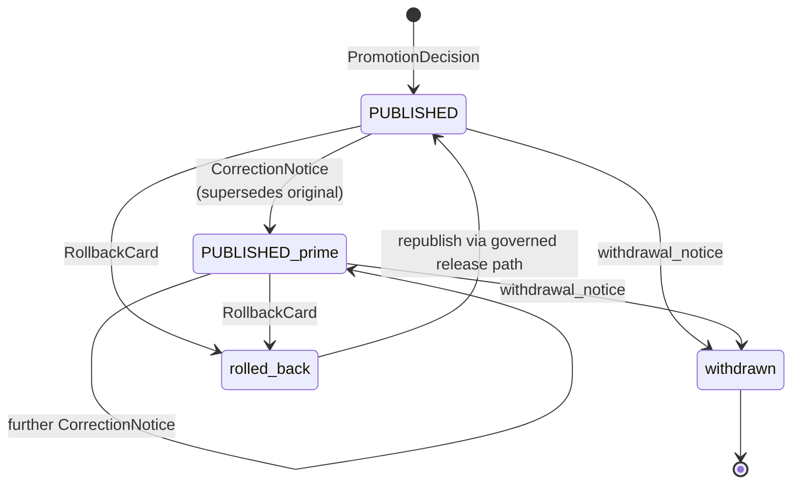

<!-- [KFM_META_BLOCK_V2]
doc_id: kfm://doc/habitat-release-index
title: Habitat Domain Release Index
type: standard
version: v1
status: draft
owners: <habitat-domain-steward>, <release-authority>, <docs-steward>
created: 2026-05-17
updated: 2026-05-17
policy_label: public
related:
  - docs/domains/habitat/README.md
  - docs/standards/PROV.md
  - docs/standards/PMTILES.md
  - release/README.md
  - release/manifests/
  - release/promotion_decisions/
  - release/rollback_cards/
  - release/correction_notices/
  - release/candidates/habitat/
  - data/published/layers/habitat/
  - data/registry/sources/habitat/
  - docs/runbooks/fauna/SOURCE_REFRESH_RUNBOOK.md
tags: [kfm, domain:habitat, release, index, navigation, governance]
notes:
  - This doc is a human-readable navigation index, not the release authority store.
  - Authority for ReleaseManifest, PromotionDecision, RollbackCard, CorrectionNotice lives under release/.
  - Authority for published habitat artifacts lives under data/published/layers/habitat/.
  - Index entries and field set are PROPOSED until ADR/per-root README confirmation.
[/KFM_META_BLOCK_V2] -->

# Habitat Domain Release Index

> **Human-readable navigation index of governed releases in the Habitat domain — pointers to `ReleaseManifest`, `PromotionDecision`, `CorrectionNotice`, `RollbackCard`, and supporting evidence and validation artifacts. This document is a mirror, not an authority store.**

| Field | Value |
|---|---|
| **Status** | Draft — `PROPOSED` placement, fields, and scope |
| **Owners** | `<habitat-domain-steward>` · `<release-authority>` · `<docs-steward>` |
| **Last updated** | 2026-05-17 |
| **Authority role** | Navigational mirror of `release/` and `data/published/layers/habitat/`. **Not** the release authority. |
| **Lifecycle anchor** | `CATALOG / TRIPLET → PUBLISHED → PUBLISHED′ (correction) → withdrawn / rolled-back` |

---

## Contents

1. [Scope and role](#1-scope-and-role)
2. [Authority and source-of-truth pointers](#2-authority-and-source-of-truth-pointers)
3. [Release flow and where this index sits](#3-release-flow-and-where-this-index-sits)
4. [Index record schema](#4-index-record-schema)
5. [Habitat release index — entry table](#5-habitat-release-index--entry-table)
6. [Sensitivity posture for Habitat releases](#6-sensitivity-posture-for-habitat-releases)
7. [Cross-lane release interactions](#7-cross-lane-release-interactions)
8. [Correction, withdrawal, and rollback handling](#8-correction-withdrawal-and-rollback-handling)
9. [Stale-state and supersession markers](#9-stale-state-and-supersession-markers)
10. [Governed AI behavior over indexed releases](#10-governed-ai-behavior-over-indexed-releases)
11. [Validators and closure checks](#11-validators-and-closure-checks)
12. [Open questions and verification backlog](#12-open-questions-and-verification-backlog)
13. [Related docs](#13-related-docs)

---

## 1. Scope and role

The Habitat Domain Release Index is a **docs-side, human-readable mirror** of governed release activity in the Habitat lane. It surfaces — in one place — the released, withdrawn, corrected, superseded, and rolled-back states of Habitat artifacts, with pointers into the authority records under `release/` and the public artifacts under `data/published/layers/habitat/`.

> [!IMPORTANT]
> **This document does not decide anything.** A release is not “released” because it appears here. It appears here because a `ReleaseManifest` exists in `release/manifests/` and a `PromotionDecision` recorded the governed state transition. *(CONFIRMED doctrine — promotion is a governed state transition, not a file move.)* Likewise, withdrawal, correction, or rollback are reflected here only after the corresponding `CorrectionNotice` / `RollbackCard` / `withdrawal_notice` has been issued under `release/`.

**This index does the following:**

- Provides a discoverable list of Habitat releases for stewards, reviewers, and public-facing consumers.
- Surfaces lifecycle state, sensitivity tier, evidence support, and review status for each release entry.
- Cross-links to release authority records, evidence bundles, validation reports, and rollback targets.
- Highlights stale-state, withdrawal, correction, and supersession status.
- Documents the cross-lane releases that involve Habitat as an adjacent derivative (e.g., Habitat × Fauna thin slice).

**This index does *not* do the following:**

- It does not own release decisions.
- It does not store `ReleaseManifest`, `PromotionDecision`, `RollbackCard`, or `CorrectionNotice` objects.
- It does not store published artifacts (PMTiles, GeoParquet, COG, layer manifests).
- It does not store source descriptors, evidence bundles, or validation reports.
- It does not authorize promotion, withdrawal, or rollback.

> [!NOTE]
> If this document and a `release/` record conflict, the `release/` record wins. Open a `docs/registers/DRIFT_REGISTER.md` entry rather than treating the doc as authority. *(CONFIRMED doctrine — “Documentation as truth” is a named anti-pattern in `directory-rules.md`.)*

[⬆ Back to top](#contents)

---

## 2. Authority and source-of-truth pointers

This index resolves to the actual authority records below. **PROPOSED paths**, pending mounted-repo verification.

| Concern | Authority location (PROPOSED) | What lives there |
|---|---|---|
| Release decisions | `release/manifests/` | `ReleaseManifest` records, by `release_id`, declaring contents, digests, evidence refs, and rollback target. |
| Promotion records | `release/promotion_decisions/` | `PromotionDecision` records for `CATALOG → PUBLISHED` transitions. |
| Rollback records | `release/rollback_cards/` | `RollbackCard` records — rollback target, reason, invalidates, review ref. |
| Corrections | `release/correction_notices/` | `CorrectionNotice` records for post-publication corrections. |
| Withdrawals | `release/withdrawal_notices/` | Withdrawal records and reasons. |
| Signatures | `release/signatures/` | DSSE / Sigstore / cosign artifacts and Rekor index references. |
| Release candidates | `release/candidates/habitat/` | Habitat lane release-candidate dossiers prior to `PUBLISHED`. |
| Published artifacts | `data/published/layers/habitat/` | The actual public-safe outputs consumers read. |
| Evidence support | `data/proofs/evidence_bundle/` | `EvidenceBundle` and `EvidenceRef` resolution targets. |
| Process memory | `data/receipts/release/` (and adjacent) | Run, validation, AI, ingest, and release receipts. |
| Source registry | `data/registry/sources/habitat/` | Append-only source descriptors and admission records. |
| Catalog closure | `data/catalog/domain/habitat/` | STAC/DCAT/PROV records for Habitat datasets. |
| Per-root governance | `release/README.md`, `data/published/README.md`, `data/registry/README.md` | Per-root rules refining placement. |

> [!TIP]
> If a row above is missing from the mounted repo, that is a drift signal — not a license to backfill the data here. Open a drift entry and surface it under [§12](#12-open-questions-and-verification-backlog).

[⬆ Back to top](#contents)

---

## 3. Release flow and where this index sits

The KFM lifecycle invariant is **`RAW → WORK / QUARANTINE → PROCESSED → CATALOG / TRIPLET → PUBLISHED`** — promotion is a governed state transition, not a file move. *(CONFIRMED doctrine.)* This index attaches to the right-hand side of the lifecycle and reflects `PUBLISHED` and post-publication state.

> [!WARNING]
> `NEEDS VERIFICATION` — exact paths under `data/`, `release/`, and any compatibility roots (`artifacts/`, `policies/`, `jsonschema/`, `ui/`, `web/`) require mounted-repo inspection. The diagram reflects `directory-rules.md` doctrine, not a confirmed file tree.

[⬆ Back to top](#contents)

---

## 4. Index record schema

Each entry in [§5](#5-habitat-release-index--entry-table) carries the following fields. The schema below is **PROPOSED**; the canonical field set lives with the `ReleaseManifest` schema in `schemas/contracts/v1/`. This doc mirrors, it does not define.

| Field | Type | Description | Authoritative source |
|---|---|---|---|
| `release_id` | string | Deterministic release identifier. | `ReleaseManifest.release_id` |
| `title` | string | Short human-readable release title. | `ReleaseManifest` / candidate dossier |
| `artifact_kinds` | enum[] | Subset of `{pmtiles, stac, geojson, parquet, model, manifest, receipt}`. | `ReleaseManifest.contents[]` |
| `object_families` | string[] | Habitat object families covered (`HabitatPatch`, `LandCoverObservation`, `EcologicalSystem`, `HabitatQualityScore`, `SuitabilityModel`, `ConnectivityEdge`, `Corridor`, `RestorationOpportunity`, `StewardshipZone`, `ModelRunReceipt`, `UncertaintySurface`). | Catalog closure record |
| `source_roles` | string[] | Source-role coverage drawn from `SourceDescriptor` entries (authority / observation / context / model). | `data/registry/sources/habitat/` |
| `sensitivity_tier` | enum | One of `T0_public`, `T1_public_safe_redacted`, `T2_restricted`, `T3_steward_only`, `T4_withheld`. | `PolicyDecision` + `RedactionReceipt` |
| `lifecycle_state` | enum | `PUBLISHED`, `PUBLISHED′ (corrected)`, `withdrawn`, `superseded`, `rolled_back`. | `release/` records |
| `evidence_ref` | uri | Resolves to one or more `EvidenceBundle` objects. | `data/proofs/evidence_bundle/` |
| `validation_ref` | uri | `ValidationReport` reference, including catalog-closure tests. | `data/receipts/validation/` |
| `policy_decision_ref` | uri | `PolicyDecision` reference. | `policy/domains/habitat/` |
| `review_ref` | uri | `ReviewRecord` reference where review is required. | `release/` adjacency |
| `manifest_ref` | uri | The `ReleaseManifest` itself. | `release/manifests/` |
| `rollback_target` | uri | `RollbackCard` reference or `null` if not yet exercised. | `release/rollback_cards/` |
| `correction_refs` | uri[] | Any `CorrectionNotice` records that supersede or amend this release. | `release/correction_notices/` |
| `signature_ref` | uri | DSSE / cosign keyless bundle and Rekor index reference. | `release/signatures/` |
| `spec_hash` | string | Canonicalized (JCS+SHA-256) hash of the manifest sidecar input, excluding `spec_hash` itself. | Sidecar generation step |
| `released_at` | datetime | Time of `PUBLISHED` transition. | `PromotionDecision.time` |
| `stale_after` | datetime \| null | Declared freshness tolerance, if any. | `SourceDescriptor.cadence` + policy |
| `supersedes` | uri \| null | Prior `release_id` superseded by this one. | Release lineage |
| `notes` | string | Free-form steward/release-authority notes. | n/a |

> [!NOTE]
> `NEEDS VERIFICATION` — exact schema home (`schemas/contracts/v1/release/release_manifest.schema.json` is the default under ADR-0001 schema-home; live placement requires mounted-repo confirmation). The field list above is **PROPOSED** and converges across `directory-rules.md` §9.2, the Domains Atlas §24.2 Receipt ↔ lifecycle mapping, and the Master MapLibre Atlas `ML-058-044` / `ML-058-045` ReleaseManifest expansions.

[⬆ Back to top](#contents)

---

## 5. Habitat release index — entry table

> [!IMPORTANT]
> **No releases are currently indexed.** This table is a **PROPOSED** template form. Entries are added only after a `ReleaseManifest` exists under `release/manifests/` and a `PromotionDecision` records the transition. Do not pre-seed rows from intent, plan, or candidate state.

| `release_id` | Title | Kinds | Sensitivity | State | Released | Evidence | Manifest | Rollback | Notes |
|---|---|---|---|---|---|---|---|---|---|
| _(empty — `NEEDS VERIFICATION` against mounted repo)_ | — | — | — | — | — | — | — | — | — |

<b>Illustrative — Habitat × Fauna thin-slice fixture (NOT a real release; PROPOSED format only)</b>

The Habitat × Fauna thin slice is repeatedly identified as the **first proof lane** for Habitat releases, using *public-safe fixtures, not live sensitive source connectors*. *(CONFIRMED doctrine — `[DOM-HF §§1-5]`, `[KFM-IDX-APP-002]`.)* If and when that thin slice produces a `ReleaseManifest`, the index row would look like:

| Field | Illustrative value |
|---|---|
| `release_id` | `kfm:release:habitat-fauna-thinslice:vYYYY-MM-DD-N` |
| `title` | “Habitat × Fauna thin-slice public-safe assignment, fixture release” |
| `artifact_kinds` | `pmtiles`, `geojson`, `stac`, `manifest`, `receipt` |
| `object_families` | `HabitatPatch`, `UncertaintySurface`, *(Fauna)* `RangePolygon` (public), `RedactionReceipt` |
| `source_roles` | NLCD: observation; NWI: observation; GBIF/iNaturalist: observation (geoprivacy-transformed); USFWS critical habitat: authority (excluded from public layer); KDWP: review context (excluded) |
| `sensitivity_tier` | `T1_public_safe_redacted` |
| `lifecycle_state` | _(illustrative)_ `PUBLISHED` |
| `evidence_ref` | `kfm://evidence/bundle/<...>` |
| `validation_ref` | catalog-closure + geoprivacy-transform tests pass |
| `policy_decision_ref` | `policy/domains/habitat/` ALLOW (public-safe lane) |
| `manifest_ref` | `release/manifests/<release_id>.json` |
| `rollback_target` | `release/rollback_cards/<release_id>.json` |
| `notes` | Cross-lane: Fauna owns occurrence truth; this release exposes Habitat-side context only. |

This row is **illustrative**; do not treat as evidence that the release exists. *(PROPOSED — implementation depth UNKNOWN until mounted-repo inspection.)*

[⬆ Back to top](#contents)

---

## 6. Sensitivity posture for Habitat releases

Habitat publication touches several distinct sensitivity surfaces that this index must reflect honestly. *(CONFIRMED doctrine / PROPOSED implementation — `[DOM-HAB]`, `[DOM-HF]`, `[ENCY]`.)*

| Surface | Posture | Index implication |
|---|---|---|
| **Regulatory critical habitat** | Source-role-bound — USFWS ECOS authority. MUST NOT be collapsed with modeled habitat. | Source role recorded in `source_roles`; modeled-as-critical denial test required (see [§11](#11-validators-and-closure-checks)). |
| **Modeled habitat / suitability surfaces** | Must carry model identity, version, support, and uncertainty. Model vs observation labels stay visible. | `object_families` includes `SuitabilityModel`, `ModelRunReceipt`, `UncertaintySurface`. |
| **Sensitive occurrence joins** | Habitat outputs that reveal sensitive occurrence context (nests, dens, roosts, hibernacula, spawning sites, rare-plant locations) **fail closed**. | `sensitivity_tier` ≥ `T1_public_safe_redacted`; `RedactionReceipt` recorded under evidence. |
| **Geoprivacy transforms** | Generalization, gridding, watershed/county aggregation, buffering, jitter-with-constraints, delayed publication, or steward-only exact access. Each transform emits a receipt. | `evidence_ref` resolves to bundle containing transform receipt; transform type surfaced in `notes`. |
| **Stewardship zones / PAD-US context** | Context source; rights and current terms `NEEDS VERIFICATION`. | Source-role check at admission; not promoted as authority. |
| **Unclear rights / unresolved source role / unresolved sensitivity** | Blocks public promotion. | Entry never appears in [§5](#5-habitat-release-index--entry-table); held in `release/candidates/habitat/` with quarantine reason. |

> [!CAUTION]
> Sensitive surfaces are **deny-by-default**. The presence of a release candidate under `release/candidates/habitat/` is **not** authorization to index it here. Only `PUBLISHED` state (or post-publication states like withdrawn/superseded) belongs in the entry table.

[⬆ Back to top](#contents)

---

## 7. Cross-lane release interactions

Habitat releases routinely interact with adjacent domain lanes. Habitat **owns** habitat patches, ecological systems, suitability, connectivity, corridors, restoration opportunity, and stewardship zones. It **does not own** species occurrence truth (Fauna), plant taxonomy (Flora), or the truth of Soil, Hydrology, Agriculture, Hazards, or Archaeology. *(CONFIRMED / PROPOSED — `[DOM-HAB]`, `[DOM-HF]`, `[ENCY]`.)*

| Related lane | Relation | Index implication |
|---|---|---|
| **Fauna** | Habitat assignment and occurrence context with geoprivacy. *(Habitat × Fauna thin slice is the proposed first proof lane.)* | Cross-link to Fauna release index entries when a Habitat release exposes assignment context. Geoprivacy transform receipts required. |
| **Flora** | Vegetation community and rare-plant context under Flora controls. | Cross-link; rare-plant geometry never bound into Habitat public layers. |
| **Soil / Hydrology** | Substrate, moisture, wetlands, riparian support. | Cross-link to relevant lane releases; do not absorb their truth. |
| **Hazards** | Fire, drought, flood, smoke, and resilience stress context. | Hazard layers consumed as context, not authority. |
| **Agriculture / Roads-Rail-Trade / Settlements-Infrastructure / Archaeology / People-DNA-Land** | Adjacent; not Habitat truth. | Joined only through governed relationships; not co-released. |

> [!NOTE]
> Cross-lane index navigation is **PROPOSED**. The doctrine names the relations clearly; the operational form of cross-lane index linking awaits the first published cross-lane release.

[⬆ Back to top](#contents)

---

## 8. Correction, withdrawal, and rollback handling

Correction, withdrawal, and rollback are **publication requirements, not afterthoughts**. *(CONFIRMED doctrine — `[BLD-GREEN §20]`, `[IMPL-PIPE §21]`, `[BLD-COMP §§21-22]`.)* When any of them occurs, the entry in [§5](#5-habitat-release-index--entry-table) is updated to reflect the new state — the row is **not** deleted, and the original `release_id` remains.

| Action | Trigger | `lifecycle_state` becomes | Required record | Index row behavior |
|---|---|---|---|---|
| **Correction** | Detected error or new evidence; downstream derivatives identified. | `PUBLISHED′ (corrected)` | `CorrectionNotice` + `ReviewRecord` (if material) | Row updated in place; `correction_refs[]` appended; `supersedes` set on the successor row. |
| **Withdrawal** | Rights, sensitivity, or evidence retraction. | `withdrawn` | `withdrawal_notice` | Row updated in place; reason surfaced in `notes`. |
| **Rollback** | Failed release or steward-significant defect. | `rolled_back` | `RollbackCard` | Row updated; `rollback_target` populated; prior `release_id` becomes the current `PUBLISHED` state via republish. |
| **Supersession** | New release replaces an earlier one. | `superseded` | New `ReleaseManifest` with `supersedes` link | Old row retained; new row added; cross-link both ways. |

> [!WARNING]
> Rollback must not be a hidden file copy. *(CONFIRMED doctrine.)* Rollback updates this index only after a `RollbackCard` is recorded and the rollback target is verified by digests and manifests.

[⬆ Back to top](#contents)

---

## 9. Stale-state and supersession markers

KFM separates **stale** from **wrong**: a stale claim is one whose evidence, source freshness, or context has aged past its declared tolerance; a wrong claim is one whose substance is incorrect. *(CONFIRMED doctrine — `[ENCY §24.8]`, `[DIRRULES]`.)* The index reflects both, but does not invent either.

| Marker | Trigger | Index column | UI signal it pairs with |
|---|---|---|---|
| `stale_after` reached | `SourceDescriptor.cadence` passed without a new admission. | `stale_after` populated, current time exceeds it | Stale source badge in Evidence Drawer |
| Source dependency stale | Upstream domain released a `CorrectionNotice` invalidating a Habitat input. | `notes` annotated; downstream review queued | Derived-stale badge |
| Supersession | New `release_id` `supersedes` this one. | `lifecycle_state = superseded`; `supersedes` set on successor | Superseded banner |
| Withdrawn | `withdrawal_notice` posted. | `lifecycle_state = withdrawn` | Withdrawn banner |

[⬆ Back to top](#contents)

---

## 10. Governed AI behavior over indexed releases

AI surfaces (Focus Mode, summarization, drafting) may operate **over released Habitat `EvidenceBundle`s only**. AI is interpretive, not the root truth source. *(CONFIRMED doctrine — `[GAI]`, `[DOM-HAB]`, `[DOM-HF]`, `[ENCY]`.)*

| AI behavior | Posture | Index relevance |
|---|---|---|
| Summarize released Habitat `EvidenceBundle`s | **Allowed**, citation-bound | AI consumes only rows where `lifecycle_state ∈ {PUBLISHED, PUBLISHED′}` and `evidence_ref` resolves. |
| Compare evidence across Habitat releases | **Allowed** if both rows resolve evidence and policy. | Cross-references via `release_id` and `evidence_ref`. |
| Explain limitations, uncertainty, or stale state | **Allowed** | Index supplies `sensitivity_tier`, `stale_after`, `correction_refs`. |
| Draft steward-review notes | **Allowed** | AI returns drafts, not decisions. |
| Answer where evidence is insufficient | **ABSTAIN** | Index does not promote a `release_id` whose evidence is unresolved. |
| Answer where policy, rights, sensitivity, or release state block | **DENY** | Withdrawn, rolled-back, or `T2`+ tier rows are off-limits for public answers. |
| Operate without citation | **DENY** | Cite-or-abstain is default truth posture. |

> [!IMPORTANT]
> AI surfaces over this index follow the **Runtime Response Envelope** (`ANSWER / ABSTAIN / DENY / ERROR`) and emit `AIReceipt`s. The index does not change those envelopes; it scopes them.

[⬆ Back to top](#contents)

---

## 11. Validators and closure checks

Index entries are an output of release closure, not a substitute for it. The validator set below is **PROPOSED** and converges across Habitat-domain expectations in the Domains Atlas §6.K and Master MapLibre Atlas `ML-058-044` / `ML-058-045`.

- **Catalog closure** — STAC/DCAT/PROV records present and resolved before any `PUBLISHED` entry appears here. *(PROPOSED)*
- **Critical-habitat source-role test** — USFWS ECOS critical habitat treated as `authority`; never collapsed with modeled habitat. *(PROPOSED — `[DOM-HAB §K]`)*
- **Modeled-as-critical denial test** — modeled habitat MUST NOT be presented as regulatory critical habitat. *(PROPOSED — `[DOM-HAB §K]`)*
- **Occurrence geoprivacy test** — joins to Fauna/Flora occurrence pass through geoprivacy transforms; transform receipts present. *(PROPOSED — `[DOM-HAB §K]`)*
- **Source descriptor test** — every `source_roles` entry resolves to a `SourceDescriptor` with rights, sensitivity, cadence, and authority recorded. *(PROPOSED — `[DOM-HAB §K]`)*
- **Habitat × Fauna thin-slice fixtures** — the first-proof lane uses public-safe fixtures only. *(PROPOSED — `[DOM-HF]`)*
- **ReleaseManifest artifact-kind coverage** — `artifact_kinds[]` is a subset of `{pmtiles, stac, geojson, parquet, model, manifest, receipt}`. *(PROPOSED — `[ML-058-044]`)*
- **ReleaseManifest policy gate** — Rego policy denies unknown `policy_label`, unknown `rights_status`, non-public sensitivity, missing `evidence_refs[]` / artifacts, or unsupported rollback. *(PROPOSED — `[ML-058-045]`)*
- **`spec_hash` canonicalization** — JCS + SHA-256; `manifestSpecHash` excludes `spec_hash` itself. *(PROPOSED — `[ML-M-046]`)*
- **Rollback drill** — at least one rollback drill receipt exists for the lane before a steward-significant release is treated as reliable. *(PROPOSED — Pass-20 REL doctrine)*

> [!NOTE]
> CI workflows that emit these checks are **NEEDS VERIFICATION**. The doctrine names them; the implementation home (e.g., `.github/workflows/`, `tools/validators/`) requires mounted-repo confirmation.

[⬆ Back to top](#contents)

---

## 12. Open questions and verification backlog

These items are explicitly **not resolved** by this document and SHOULD be tracked in `docs/registers/VERIFICATION_BACKLOG.md` and addressed via ADR or per-root README.

| Item | Status | What would settle it |
|---|---|---|
| Whether `docs/domains/habitat/RELEASE_INDEX.md` is the canonical filename, or whether a different convention (e.g., `RELEASES.md`, `release-index.md`, subfolder `docs/domains/habitat/releases/`) applies. | `PROPOSED` | Per-root README in `docs/domains/` or ADR. |
| Whether the index is maintained by hand, generated from `release/manifests/`, or both (hand-curated summary + generated body). | `OPEN` | ADR or per-root README; CI generator if generated. |
| Exact `ReleaseManifest` schema home under `schemas/contracts/v1/`. | `NEEDS VERIFICATION` | Mounted-repo inspection; default per ADR-0001 is `schemas/contracts/v1/`. |
| Per-domain `release/candidates/habitat/` structure and dossier shape. | `NEEDS VERIFICATION` | `release/README.md` or mounted-repo inspection. |
| Habitat-domain sensitivity tier vocabulary alignment (`T0..T4`) with the Atlas §24 tier reference. | `NEEDS VERIFICATION` | Cross-check against `policy/sensitivity/`. |
| `correction_refs[]` cardinality and ordering rules for multi-step corrections. | `OPEN` | ADR on correction lineage. |
| Whether `data/registry/sources/habitat/` or `data/registry/habitat/` is the registry path. *(Directory Rules §12 lists both forms; resolution `NEEDS VERIFICATION`.)* | `NEEDS VERIFICATION` | Per-root README in `data/registry/`. |
| Stale-state cadence values for Habitat sources (NLCD, NWI, GAP/LANDFIRE, NatureServe, GBIF/iNaturalist, PAD-US). | `NEEDS VERIFICATION` | `SourceDescriptor` registry entries. |
| AI Focus Mode template binding for Habitat — exact prompt / citation / abstain rules. | `NEEDS VERIFICATION` | `docs/architecture/governed-ai/FOCUS_FLOW.md` and policy. |
| Whether this index should also reflect `release/candidates/habitat/` state (pre-published), or only `PUBLISHED+` state. | `OPEN` | ADR. The current default in this draft is **`PUBLISHED+` only**. |

<b>Doctrine touchstones used in this draft (reference)</b>

- **Lifecycle invariant** — `RAW → WORK / QUARANTINE → PROCESSED → CATALOG / TRIPLET → PUBLISHED`; promotion is a governed state transition. *(`directory-rules.md` §0, §9.1.)*
- **Trust membrane** — public clients use governed APIs; `release/` holds decisions; `data/published/` holds artifacts; the two are distinct. *(`directory-rules.md` §7.1, §9.2.)*
- **Domain Placement Law** — domains never become root folders; Habitat content lives under `docs/domains/habitat/`, `release/candidates/habitat/`, `data/published/layers/habitat/`, etc. *(`directory-rules.md` §12.)*
- **Documentation-as-truth is an anti-pattern** — docs reflect, they do not decide. *(`directory-rules.md` §13.5.)*
- **Habitat sensitivity posture** — regulatory critical habitat, modeled habitat, occurrence-linked outputs, and stewardship zones each carry distinct controls; sensitive joins fail closed. *(KFM Domains Atlas §6.I, §6.K; Encyclopedia §7.4.)*
- **ReleaseManifest content** — `release_id`, `contents[]`, digests, `evidence_refs[]`, `rollback_target`, `time`; artifact kinds include `pmtiles, stac, geojson, parquet, model, manifest, receipt`. *(Atlas §24.2; MapLibre Atlas `ML-058-044`.)*
- **Cite-or-abstain truth posture** — AI surfaces ABSTAIN on insufficient evidence and DENY on policy/sensitivity/release blocks. *(`directory-rules.md` §2.1; Governed AI dossier.)*

[⬆ Back to top](#contents)

---

## 13. Related docs

- `docs/domains/habitat/README.md` — Habitat lane overview *(PROPOSED — `NEEDS VERIFICATION`)*
- `docs/standards/PROV.md` — Provenance profile (W3C PROV-O / PAV)
- `docs/standards/PMTILES.md` — PMTiles governance and conformance profile
- `docs/standards/OGC-API-TILES.md` — OGC API Tiles delivery
- `docs/standards/ISO-19115.md` — ISO 19115 crosswalk
- `docs/runbooks/fauna/SOURCE_REFRESH_RUNBOOK.md` — Cross-lane reference for Fauna source refresh discipline
- `release/README.md` — Release authority root *(PROPOSED — `NEEDS VERIFICATION`)*
- `data/published/README.md` — Published artifacts root *(PROPOSED — `NEEDS VERIFICATION`)*
- `data/registry/README.md` — Registry root *(PROPOSED — `NEEDS VERIFICATION`)*
- `docs/registers/VERIFICATION_BACKLOG.md` — Verification backlog *(PROPOSED — `NEEDS VERIFICATION`)*
- `docs/registers/DRIFT_REGISTER.md` — Drift register *(PROPOSED — `NEEDS VERIFICATION`)*
- `docs/doctrine/directory-rules.md` *(CONFIRMED doctrine; canonical path `PROPOSED`)*

---

**Last updated:** 2026-05-17 · **Version:** v1 (draft) · [⬆ Back to top](#contents)
