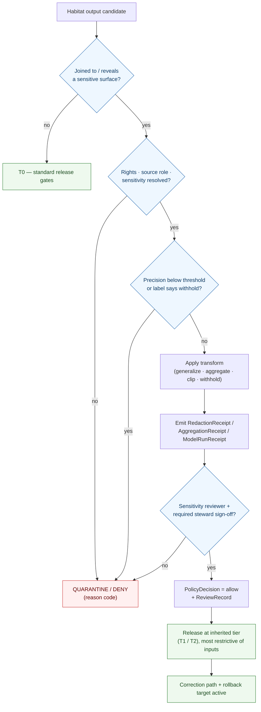

<!-- [KFM_META_BLOCK_V2]
doc_id: kfm://doc/domains/habitat/sensitivity
title: Habitat Domain — Sensitivity & Deny-by-Default Posture
type: standard
version: v1
status: draft
owners: <habitat-domain-steward>, <sensitivity-reviewer>, <wildlife-steward>, <docs-steward>   # placeholders pending owner-registry verification
created: 2026-06-05
updated: 2026-06-05
policy_label: public
contract_version: "3.0.0"   # pinned per ai-build-operating-contract.md
related:
  - docs/domains/habitat/README.md
  - docs/domains/habitat/PRESERVATION_MATRIX.md
  - docs/domains/habitat/REASON_CODES.md
  - docs/domains/habitat/RELEASE_INDEX.md
  - docs/domains/fauna/README.md
  - docs/doctrine/sensitivity.md
  - docs/doctrine/policy-aware.md
  - docs/doctrine/directory-rules.md
  - docs/standards/PROV.md
  - ai-build-operating-contract.md
tags: [kfm, domain:habitat, sensitivity, deny-by-default, geoprivacy, redaction, rare-species, governance]
notes:
  - "Sensitive-domain document. Disposition is routed through the ai-build-operating-contract.md §23.2 sensitive-domain decision matrix; this doc does NOT re-derive disposition."
  - "Most-restrictive-applicable-row rule applies until domain stewards ratify per-row defaults (§23.2 is PROPOSED as of v3.0)."
  - "Contains NO exact coordinates, identifiers, restricted-source-derived fields, or method detail that could defeat a control. It describes governance posture only."
  - "Habitat sensitivity is largely INHERITED through the joined lane (Fauna/Flora). Atlas §24.13 lists no policy/sensitivity/habitat/ root; see Open Question OQ-HAB-SEN-01."
  - "Tier scheme T0-T4 and per-domain matrix are CONFIRMED doctrine; adoption is PROPOSED pending ADR-S-05. Reason codes per docs/domains/habitat/REASON_CODES.md."
  - "CONTRACT_VERSION = \"3.0.0\""
[/KFM_META_BLOCK_V2] -->

# 🌿 Habitat — Sensitivity & Deny-by-Default Posture

> The Habitat lane's sensitivity contract: **what fails closed, why, what transform and review are required before any release, and which reviewer signs off.** Habitat is rarely sensitive on its own — it becomes sensitive when joined to a sensitive lane. This document governs the Habitat side of that exposure.

  <b>Deny-by-default · Fail-closed · Generalize-before-publish · Most-restrictive-row-applies</b>

-orange)

<!-- TODO: replace static badges with CI-driven Shields endpoints once owners + policy bundle are verified (NEEDS VERIFICATION). -->

**Status:** draft &middot; **Owners:** habitat steward · sensitivity reviewer · wildlife steward · docs steward *(placeholders)* &middot; **Contract:** `CONTRACT_VERSION = "3.0.0"` &middot; **Last updated:** 2026-06-05

> [!CAUTION]
> **This is a sensitive-domain document.** Disposition for every surface below is governed by the **`ai-build-operating-contract.md` §23.2 sensitive-domain decision matrix**, not by this doc. Where no row clearly matches, the **most restrictive applicable row applies**. This document contains no exact coordinates, identifiers, restricted-source-derived fields, or generalization parameters — it describes the *posture*, never how to defeat it. Exact values live in the policy bundle and are steward-gated.

---

## Contents

1. [Purpose & scope](#1-purpose--scope)
2. [Core principle: sensitivity is a property of the output](#2-core-principle-sensitivity-is-a-property-of-the-output)
3. [Sensitive surfaces in the Habitat lane](#3-sensitive-surfaces-in-the-habitat-lane)
4. [Deny-by-default register](#4-deny-by-default-register)
5. [Sensitivity tiers & allowed motion](#5-sensitivity-tiers--allowed-motion)
6. [Required transforms & receipts](#6-required-transforms--receipts)
7. [Required reviewers](#7-required-reviewers)
8. [Decision flow](#8-decision-flow)
9. [Map, UI & AI surface rules](#9-map-ui--ai-surface-rules)
10. [Reason codes & negative states](#10-reason-codes--negative-states)
11. [Policy home & where rules live](#11-policy-home--where-rules-live)
12. [Open questions register](#12-open-questions-register)
13. [Open verification backlog](#13-open-verification-backlog)
14. [Changelog & definition of done](#14-changelog--definition-of-done)
15. [Related docs](#15-related-docs)

---

## 1. Purpose & scope

This document states the **sensitivity and deny-by-default posture** for the Habitat lane: which Habitat outputs are restricted, what must happen before any of them is published, and how that decision is reviewed and recorded. It localizes three CONFIRMED doctrine surfaces to Habitat — the operating contract's §23.2 sensitive-domain decision matrix, the Atlas §20.5 deny-by-default register, and the Atlas §24.5 sensitivity / rights tier reference — without re-deriving any of them.

The Habitat lane's distinctive sensitivity profile is **join-induced**. A habitat patch, a land-cover classification, or a suitability surface is usually low-risk on its own. It becomes sensitive when it is joined to, derived from, or reveals the location of a sensitive Fauna occurrence, a rare-plant record, a stewardship withholding, or any context that could enable harm to a species or a protected place.

> [!NOTE]
> This document is a **reference and a contract**, not an enforcement surface and not the policy bundle. Enforcement lives in `policy/` and the validators; the exact generalization parameters, thresholds, and source-rights gates live there and are steward-gated. This doc names *what* fails closed and *why*; the bundle holds the *how*. **(CONFIRMED that posture is doctrine; PROPOSED for the specific policy-home binding — see §11 and OQ-HAB-SEN-01.)**

[⬆ back to top](#top)

---

## 2. Core principle: sensitivity is a property of the output

The single most important rule in this lane: **validators evaluate the produced output, not the inputs.** Safety is never inferred from the inputs' tiers.

> [!IMPORTANT]
> A `LandCoverObservation` joined to a *public* Fauna occurrence can still produce a **T4** surface if the resulting density map reveals nesting concentrations. The join product's tier is the **maximum** (most restrictive) of the inputs' tiers, and may exceed all of them if the *combination* creates new exposure. Cross-lane joins are inference-risk multipliers. **(CONFIRMED doctrine — Atlas §24.5.2 "sensitive joins fail closed"; cross-lane join policy ADR-S-14.)**

Two CONFIRMED Habitat-specific policy positions follow directly (both PROPOSED for ADR adoption, recorded in the project's policy idea-set):

- **Fail-closed on insufficient precision.** A habitat assignment policy fails closed when spatial precision is below a threshold *or* a sensitivity label requires withholding. *(KFM-P25-PROG-0015, CONFIRMED card / PROPOSED rule.)*
- **Precision degradation before exposure.** Sensitive fauna-linked habitat records require policy-controlled precision degradation, generalized geometry, or abstention before any public exposure. *(KFM-P25-IDEA-0006 / KFM-P24-IDEA-0002, CONFIRMED cards / PROPOSED rules.)*

[⬆ back to top](#top)

---

## 3. Sensitive surfaces in the Habitat lane

The surfaces below are the Habitat-lane instances of the operating contract's §23.1 sensitive-domain list. Each maps to a §23.2 matrix row (named in §4).

| Surface | Why it is sensitive | Governing §23.2 row |
|---|---|---|
| **Habitat × sensitive Fauna occurrence** (nests, dens, roosts, hibernacula, spawning sites) | Reveals or narrows the location of a protected or rare animal; enables harm/harassment/collection. | Rare species (occurrence) |
| **Habitat × rare-plant record** | Reveals the location of a rare, protected, or culturally sensitive plant; enables collection. | Rare species (occurrence) / restricted source terms |
| **Suitability surface trained on sensitive occurrence** | A modeled surface can reconstruct sensitive locations from its training support. | Rare species; exact-harm coordinates |
| **Connectivity edge / corridor near a sensitive site** | Endpoints or paths can implicate a sensitive site. | Rare species; exact-harm coordinates |
| **Stewardship zone — tribal / sovereign / steward-withheld** | Sovereignty and steward control; cultural sensitivity. | Indigenous / cultural records; steward-controlled records |
| **Restoration opportunity × private parcel** | Surfaces private land-ownership context. | Private land assertions |
| **Any output at coordinates that could enable harm** | Direct harm-enablement. | Exact-harm coordinates |
| **Restricted-source-derived fields** (e.g., NatureServe / Natural Heritage rare-data) | Source terms restrict redistribution and require access gating. | Restricted source terms |

> [!CAUTION]
> **Nests, dens, roosts, hibernacula, and spawning sites are named deny-by-default categories.** Exact locations of these — whether owned by Fauna or surfaced through a Habitat join — fail closed. The Habitat lane never publishes them at finer resolution than the generalized Fauna product. **(CONFIRMED — Atlas §20.5 deny-by-default register; operating contract §23.1.)**

[⬆ back to top](#top)

---

## 4. Deny-by-default register

The Habitat-lane register below restates the operating contract's §23.2 matrix and the Atlas §20.5 register for the surfaces Habitat touches. **Default disposition is the most restrictive applicable row** until stewards ratify per-row defaults (the §23.2 matrix is PROPOSED as of v3.0).

| Surface | Default disposition (public) | Required transform before any release | Reviewer beyond domain steward | Required receipts |
|---|---|---|---|---|
| Habitat × sensitive Fauna occurrence | `DENY` exact geometry | Generalize to public-safe grid (parameters steward-gated) | Wildlife steward + sensitivity reviewer | `RedactionReceipt`; `PolicyDecision`; `LayerManifest` (sensitive-flag) |
| Habitat × rare-plant record | `DENY` exact geometry | Generalize / withhold geometry | Sensitivity reviewer; rights reviewer if restricted-source | `RedactionReceipt`; `PolicyDecision` |
| Suitability surface trained on sensitive occurrence | `DENY` raw training points; surface inherits ≥ T2 | Release surface clipped of sensitive areas; never publish training points | Sensitivity reviewer | `RedactionReceipt`; `ModelRunReceipt` |
| Connectivity edge / corridor near sensitive site | `DENY` precise endpoints/paths | Generalize endpoints to centroids; widen buffer | Wildlife steward | `RedactionReceipt` |
| Stewardship zone — tribal / sovereign | `DENY` unless steward-approved | Steward gate; withhold on request | Rights-holder representative / sovereignty review | `PolicyDecision`; `ReviewRecord` |
| Restoration opportunity × private parcel | `ABSTAIN` / `DENY` unless rights documented | Strip owner identity; generalize parcel | Rights reviewer | `RedactionReceipt`; `PolicyDecision` |
| Exact-harm coordinates (any object) | `DENY` | Generalize or full denial | Security / sensitivity reviewer | `RedactionReceipt` |
| Restricted-source-derived fields | `DENY` public redistribution | Strip restricted-source-derived fields; access-gate | Rights reviewer | `PolicyDecision`; `SourceDescriptor` rights field |

> [!IMPORTANT]
> **Unclear rights, unresolved source role, missing evidence, unresolved sensitivity, or absent release state blocks public promotion.** This is not specific to the rows above — it is the universal precondition. A Habitat artifact in any of those states stays in `release/candidates/habitat/` with a quarantine reason code. **(CONFIRMED doctrine — Habitat dossier §I; Encyclopedia; Directory Rules.)**

[⬆ back to top](#top)

---

## 5. Sensitivity tiers & allowed motion

Habitat uses the **CONFIRMED** Atlas §24.5.1 tier scheme. Tier names are doctrine; adoption as canonical Habitat vocabulary is PROPOSED pending ADR-S-05.

| Tier | Name | Meaning | Default audience |
|---|---|---|---|
| `T0` | Open | Public-safe, no transformation required. | Any public client via governed API. |
| `T1` | Generalized | Public-safe only after generalization / fuzzing / aggregation / redaction; transform reviewed and recorded. | Any public client via governed API. |
| `T2` | Reviewer | Released only to authenticated reviewers or domain stewards. | Stewards, reviewers, named collaborators. |
| `T3` | Restricted | Released only under named agreement (rights, sovereignty, consent). | Named authorized parties only. |
| `T4` | Denied | Not released to any audience; existence may be acknowledged only as steward review permits. | — |

### 5.1 Allowed motion (Atlas §24.5.3)

The reading rule is **CONFIRMED verbatim**: a tier *upgrade* (toward more public) always needs both a transform receipt and a review record; a tier *downgrade* (toward less public) needs only a correction record.

| From → To | Required artifact | Required reviewer | Reversibility |
|---|---|---|---|
| `T4 → T2` | `PolicyDecision` + `ReviewRecord` | Habitat steward + sensitivity reviewer | Reversible: review revocation returns object to T4. |
| `T4 → T1` | `RedactionReceipt` + `ReviewRecord` | Habitat steward + sensitivity reviewer | Reversible: correction may demote a published T1 to T4. |
| `T2 → T1` | `RedactionReceipt` + `ReviewRecord` | Habitat steward | Reversible. |
| `T1 → T0` | `ReleaseManifest` + `ReviewRecord` | Habitat steward + release authority | Reversible via `RollbackCard`. |
| any `→ T4` (downgrade) | `CorrectionNotice` + `ReviewRecord` | Habitat steward; rights-holder if applicable | Always permitted; precedes derivative invalidation. |

> [!NOTE]
> The Habitat lane has **no `T3` default surface** in normal operation — restricted named-agreement releases are a Fauna / People / Archaeology pattern. A Habitat object reaches `T3` only by inheritance from a joined lane under that lane's agreement. **(INFERRED from Atlas §24.5.2, which assigns no Habitat row to T3; NEEDS VERIFICATION against a ratified Habitat policy bundle.)**

[⬆ back to top](#top)

---

## 6. Required transforms & receipts

A transform is a named, deterministic, receipt-bearing operation. Improvised redaction is not a transform — it is a release defect. Every transform below emits a receipt that travels with the release.

| Transform | What it does (posture, not parameters) | Receipt | Receipt fields (CONFIRMED shape) |
|---|---|---|---|
| Generalize geometry | Coarsen boundary / snap to a public-safe cell. | `RedactionReceipt` | `policy_ref`, `redaction_method`, `kept_fields`, `removed_fields`, `geometry_transform`, `reviewer` |
| Aggregate to grid | Roll up to HUC / county / coarse grid. | `AggregationReceipt` | `geometry_scope`, `time_scope`, `aggregation_method`, `input_source_refs`, `suppression_rule`, `output_unit` |
| Withhold / suppress | Remove a feature or an entire layer pending review. | `RedactionReceipt` (+ `RollbackCard` for layer suppression) | as above |
| Clip sensitive areas | Restrict a modeled surface away from sensitive zones. | `RedactionReceipt` | as above |
| Model-run disclosure | Attach model identity, support, uncertainty for a modeled surface. | `ModelRunReceipt` | `model_id`, `model_version`, `inputs[]`, `parameters`, `run_time`, `uncertainty_surface_ref`, `validation_ref` |

### 6.1 The geoprivacy conditional

A Habitat output carrying occurrence context MUST carry a public-safe geometry whenever its geoprivacy status is anything other than open.

> [!IMPORTANT]
> When `geoprivacy_status ∈ {obscured, private, generalized}`, a `public_safe_geometry` is **required**; the exact geometry is never the published geometry. **(CONFIRMED card KFM-P25-PROG-0017 / PROPOSED schema rule.)** The exact generalization radius and grid are steward-gated and live in the policy bundle — they are deliberately **not** stated in this document.

[⬆ back to top](#top)

---

## 7. Required reviewers

Sensitive Habitat releases require review beyond the domain steward. Roles are CONFIRMED doctrine (Atlas §24.7 separation-of-duties matrix); the specific named holders are NEEDS VERIFICATION.

| Role | When required for Habitat | Authority |
|---|---|---|
| **Habitat domain steward** | All Habitat promotions. | Domain contracts, validators, domain-internal promotion. |
| **Sensitivity reviewer** | Any redaction, generalization, withholding, or tier transition for sensitive content. | `RedactionReceipt`; sensitive-lane tier transitions. |
| **Wildlife steward** | Rare-species occurrence joins (the §23.2 "rare species" row names the wildlife steward). | Sensitive-occurrence generalization sign-off. |
| **Rights-holder representative** | Tribal / sovereign stewardship zones; restricted-source data. | Sovereignty / consent-based release decisions. |
| **Rights reviewer** | Restricted-source-derived fields; private-parcel joins. | Rights resolution; restricted-source gating. |
| **Release authority** | The `PUBLISHED` transition; distinct from the author when materiality applies. | `ReleaseManifest`; rollback authorization. |

> [!CAUTION]
> **Two distinct people for material sensitive releases.** Where materiality applies, the release authority MUST be distinct from the artifact's author. A self-approved sensitive release is a separation-of-duties failure. **(CONFIRMED — Atlas §24.7; ADR-S-09 separation-of-duties threshold.)**

[⬆ back to top](#top)

---

## 8. Decision flow

How a Habitat output reaches (or is denied) a public surface.

*Diagram status:* **CONFIRMED** for the fail-closed structure, the resolve-rights-first rule, the transform-then-review sequence, and the most-restrictive-tier outcome. **PROPOSED** for the exact branch ordering pending validator/policy binding.

[⬆ back to top](#top)

---

## 9. Map, UI & AI surface rules

The sensitivity posture is enforced at every surface, not just at release.

- **No style-only hiding.** Sensitive geometry MUST be generalized, redacted, delayed, restricted, or denied **before** tile generation. A style filter or a hidden layer is not a sensitivity control. **(CONFIRMED — operating contract §22.3 denied map behaviors.)**
- **No popup as Evidence Drawer substitute**, and no Focus-Mode answer from rendered features alone.
- **Governed API only.** Public clients never read RAW / WORK / QUARANTINE / canonical stores; a sensitive Habitat join product reaches the public only as a released, generalized, public-safe derivative.
- **AI surface.** The governed AI may summarize released, public-safe Habitat `EvidenceBundle`s and MUST `DENY` any request that would surface a sensitive occurrence association below a published public-safe tier. AI reads only released `EvidenceBundle`s (RAW/WORK access = `T4`) and emits an `AIReceipt` with a reason code on every `DENY` / `ABSTAIN`. **(CONFIRMED — Habitat dossier §L; Governed AI dossier; Atlas §24.5.2.)**

[⬆ back to top](#top)

---

## 10. Reason codes & negative states

When a sensitive Habitat surface fails closed, it emits a reason code (see `docs/domains/habitat/REASON_CODES.md`) and the UI shows a negative state.

| Situation | Reason code | UI negative state |
|---|---|---|
| Join to sensitive occurrence below public-safe resolution | `JOIN_SENSITIVE_OCCURRENCE` | `GENERALIZED_GEOMETRY` / `DENIED_BY_POLICY` |
| Rights or sensitivity unresolved | `SENSITIVITY_UNRESOLVED` / `RIGHTS_UNKNOWN` | `DENIED_BY_POLICY` |
| Restricted-source-derived field present | `RIGHTS_UNKNOWN` | `RESTRICTED_ACCESS` |
| Steward withholding overridden | `STEWARD_ZONE_OVERRIDE` | `RESTRICTED_ACCESS` |
| Required review missing/insufficient | `REVIEW_NEEDED` / `REVIEW_INSUFFICIENT` | `DENIED_BY_POLICY` |
| AI asked for sensitive association | (AI `DENY`) | `DENIED_BY_POLICY` |

> [!NOTE]
> UI negative states (`GENERALIZED_GEOMETRY`, `RESTRICTED_ACCESS`, `DENIED_BY_POLICY`, etc.) are **CONFIRMED** in the operating contract §22.2. Their exact binding to Habitat reason codes is **PROPOSED** pending the validator exit-code contract.

[⬆ back to top](#top)

---

## 11. Policy home & where rules live

This document is doctrine; the enforceable rules live in `policy/`. The Habitat lane's policy home is an **open question**.

| Concern | Likely home | Status |
|---|---|---|
| Habitat sensitivity rules (if Habitat-owned) | `policy/domains/habitat/` *(Directory Rules §12 segment form)* | PROPOSED |
| Inherited sensitivity rules (Fauna/Flora joins) | `policy/sensitivity/fauna/`, `policy/sensitivity/flora/` | CONFIRMED homes for those lanes (Atlas §24.13) |
| Consent / restricted-source gating | `policy/sensitivity/` + `SourceDescriptor` rights field | CONFIRMED concern / PROPOSED Habitat binding |
| Decision records (`PolicyDecision`) | `schemas/contracts/v1/policy/policy_decision.schema.json` | CONFIRMED schema home / PROPOSED presence |

> [!IMPORTANT]
> **Habitat may not own a `policy/sensitivity/habitat/` root.** The Atlas §24.13 responsibility-root crosswalk assigns `policy/sensitivity/<domain>/` roots to **Fauna, Flora, Settlements/Infrastructure, Archaeology, and People** — **not** Habitat. This strongly suggests Habitat sensitivity is governed through the **joined lane's** policy home (most often `policy/sensitivity/fauna/`). Do **not** create `policy/sensitivity/habitat/` without an ADR. Surfaced as OQ-HAB-SEN-01. **(CONFIRMED absence from the crosswalk; PROPOSED interpretation.)**

[⬆ back to top](#top)

---

## 12. Open questions register

| ID | Question | Owner role | Resolution path |
|---|---|---|---|
| OQ-HAB-SEN-01 | Does Habitat own a `policy/sensitivity/habitat/` root, or inherit sensitivity through the joined lane's policy home? | Directory steward + policy steward | ADR; Atlas §24.13 lists no Habitat sensitivity root. |
| OQ-HAB-SEN-02 | Exact generalization radii / grid sizes for habitat × sensitive-occurrence join products. | Sensitivity reviewer + wildlife steward | Steward-gated policy bundle; never published in docs. |
| OQ-HAB-SEN-03 | Spatial-precision threshold below which a habitat assignment fails closed (KFM-P25-PROG-0015). | Habitat steward + sensitivity reviewer | Policy bundle + validator design. |
| OQ-HAB-SEN-04 | NatureServe / Natural Heritage rare-data access-gate terms (KFM-P25-PROG-0023). | Rights reviewer | Source-registry entry + current-terms inspection. |
| OQ-HAB-SEN-05 | Whether `T3` (named-agreement) ever applies to a Habitat-owned object, or only by inheritance. | Sensitivity reviewer | Ratified Habitat policy bundle; Atlas §24.5.2 assigns no Habitat T3 row. |
| OQ-HAB-SEN-06 | Adoption of the T0–T4 tier scheme as canonical Habitat vocabulary. | Sensitivity reviewer | ADR-S-05. |
| OQ-HAB-SEN-07 | Ratification of the §23.2 matrix per-row defaults for Habitat surfaces. | Domain stewards | v3.x adoption; until then most-restrictive-row applies. |

[⬆ back to top](#top)

---

## 13. Open verification backlog

These items remain `NEEDS VERIFICATION` before promotion from `draft` to `published`:

1. Habitat policy home (`policy/sensitivity/habitat/` vs inherited) — verify against a mounted repo and ADR (OQ-HAB-SEN-01).
2. Geoprivacy generalization parameters and the geoprivacy conditional schema (`public_safe_geometry` when `geoprivacy_status` obscured/private/generalized) — verify against `schemas/contracts/v1/domains/habitat/` and the policy bundle.
3. Spatial-precision fail-closed threshold — verify against validator code (KFM-P25-PROG-0015).
4. Reviewer assignments (named holders for habitat steward, sensitivity reviewer, wildlife steward, rights-holder rep) — verify against `.github/CODEOWNERS` and the governance charters.
5. USFWS ECOS / KDWP / NatureServe source rights and access-gate terms — verify against source-registry entries.
6. Reason-code → negative-state binding — verify against the validator exit-code contract and `docs/domains/habitat/REASON_CODES.md`.
7. Cross-lane join policy (ADR-S-14) and tier-scheme adoption (ADR-S-05) outcomes.
8. The §23.2 matrix ratification status for Habitat rows (PROPOSED as of v3.0).

[⬆ back to top](#top)

---

## 14. Changelog & definition of done

### 14.1 Changelog

| Change | Type (per contract §37) | Reason |
|---|---|---|
| Initial Habitat sensitivity & deny-by-default posture. | new | First sensitivity contract for the Habitat lane. |
| Routed all disposition through the operating contract §23.2 matrix; applied most-restrictive-row default. | clarification | `<sensitive_domain_handling>` requires deferring to §23.2, not re-deriving. |
| Anchored tiers (§5), transforms/receipts (§6), reviewers (§7), and the geoprivacy conditional to CONFIRMED Atlas §24.5/§24.2/§24.7 and CONFIRMED policy idea-cards (KFM-P25-PROG-0015/0017, KFM-P25-IDEA-0006, KFM-P24-IDEA-0002, KFM-P25-PROG-0023). | clarification | Establishes the CONFIRMED basis for each control. |
| Surfaced the `policy/sensitivity/habitat/` ownership question (OQ-HAB-SEN-01) as CONFIRMED-absence-from-crosswalk. | gap closure | Consistent with the Preservation Matrix (OQ-HAB-PRES-05) and lane README (HAB-V-010). |
| Pinned `CONTRACT_VERSION = "3.0.0"`; used Directory Rules §12 segment path; no exact coordinates/parameters included. | housekeeping / safety | Required for doctrine-adjacent docs; sensitive-domain content discipline. |

> **Backward compatibility.** New document — no prior anchors to preserve. Cross-references the rest of the Habitat lane suite (README, Preservation Matrix, Reason Codes, Release Index).

### 14.2 Definition of done

This document is done enough to enter the repository when:

- it is placed at `docs/domains/habitat/SENSITIVITY.md` per Directory Rules §12, with OQ-HAB-SEN-01 (policy home) and the lane HAB-V-009 path-form conflict logged in `docs/registers/DRIFT_REGISTER.md`;
- the sensitivity reviewer, wildlife steward, habitat domain steward, and docs steward review it; a rights-holder representative reviews the tribal/sovereign and restricted-source rows;
- it is linked from `docs/domains/habitat/README.md` §7 and the doctrine sensitivity index;
- it does not conflict with accepted ADRs (notably ADR-S-05, ADR-S-14) and the §23.2 matrix;
- it contains no exact coordinates, generalization parameters, identifiers, or restricted-source-derived fields (confirmed at review);
- the `GENERATED_RECEIPT.json` planned in the PR is wired into CI with `contract_version: "3.0.0"`;
- future changes follow the operating contract's §37 lifecycle.

[⬆ back to top](#top)

---

## 15. Related docs

**All targets PROPOSED until confirmed against a mounted repo; path form follows Directory Rules §12 (segment form).**

- [`docs/domains/habitat/README.md`](README.md) — Habitat lane orientation (§7 sensitivity summary).
- [`docs/domains/habitat/PRESERVATION_MATRIX.md`](PRESERVATION_MATRIX.md) — per-object tiers, transforms, and join-sensitivity rules.
- [`docs/domains/habitat/REASON_CODES.md`](REASON_CODES.md) — finite outcomes and the reason codes named in §10.
- [`docs/domains/habitat/RELEASE_INDEX.md`](RELEASE_INDEX.md) — release navigation; sensitivity tier per release.
- [`docs/domains/fauna/README.md`](../fauna/README.md) — Fauna ownership and the sensitive-occurrence baseline Habitat inherits on join.
- [`docs/doctrine/sensitivity.md`](../../doctrine/sensitivity.md) — cross-cutting sensitivity doctrine.
- [`docs/doctrine/policy-aware.md`](../../doctrine/policy-aware.md) — fail-safe / deny-by-default doctrine.
- [`docs/doctrine/directory-rules.md`](../../doctrine/directory-rules.md) — §12 Domain Placement Law.
- `policy/sensitivity/fauna/` — Fauna sensitivity rules Habitat inherits through on join *(CONFIRMED home for Fauna; PROPOSED Habitat binding)*.
- [`docs/standards/PROV.md`](../../standards/PROV.md) — provenance vocabulary for the receipts that carry transforms.
- [`ai-build-operating-contract.md`](../../../ai-build-operating-contract.md) — §23 sensitive-domain matrix; canonical operating contract (`CONTRACT_VERSION = "3.0.0"`).

---

**Last updated:** 2026-06-05 &middot; **Status:** draft &middot; **Contract:** `CONTRACT_VERSION = "3.0.0"` &middot; **Posture:** deny-by-default; fail-closed; most-restrictive-row-applies &middot; **Citation short-names:** [DOM-HAB], [DOM-HF], [DOM-FAUNA], [DOM-FLORA], [ENCY], [DIRRULES], [GAI], [OPCON §23]

[⬆ back to top](#top)
