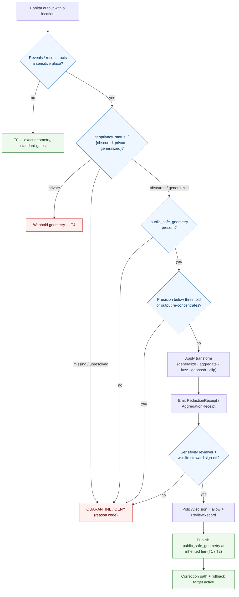

<!-- [KFM_META_BLOCK_V2]
doc_id: kfm://doc/domains/habitat/sensitivity-and-geoprivacy
title: Habitat Domain — Sensitivity & Geoprivacy Posture
type: standard
version: v1
status: draft
owners: <habitat-domain-steward>, <sensitivity-reviewer>, <wildlife-steward>, <docs-steward>   # placeholders pending owner-registry verification
created: 2026-06-05
updated: 2026-06-05
policy_label: public
contract_version: "3.0.0"   # pinned per ai-build-operating-contract.md
related:
  - docs/domains/habitat/README.md
  - docs/domains/habitat/SENSITIVITY.md
  - docs/domains/habitat/PRESERVATION_MATRIX.md
  - docs/domains/habitat/REASON_CODES.md
  - docs/domains/habitat/RELEASE_INDEX.md
  - docs/domains/fauna/README.md
  - docs/doctrine/sensitivity.md
  - docs/doctrine/policy-aware.md
  - docs/standards/PROV.md
  - docs/standards/DARWIN-CORE.md
  - ai-build-operating-contract.md
tags: [kfm, domain:habitat, sensitivity, geoprivacy, deny-by-default, redaction, generalization, rare-species, governance]
notes:
  - "Sensitive-domain document. Disposition is routed through the ai-build-operating-contract.md §23.2 sensitive-domain decision matrix; this doc does NOT re-derive disposition."
  - "OVERLAP / SUPERSESSION CANDIDATE: docs/domains/habitat/SENSITIVITY.md (created previously) covers deny-by-default + geoprivacy for the same responsibility. Per Directory Rules, two docs claiming the same authority is a parallel-home drift risk. This doc is built per explicit user instruction with overlap accepted; reconciliation (merge or supersede) is tracked in OQ-HAB-SG-01 and the DRIFT_REGISTER. Until reconciled, SENSITIVITY.md remains the broader posture doc and this doc goes deeper on the geoprivacy mechanics."
  - "Contains NO exact coordinates, identifiers, restricted-source-derived fields, generalization radii, geohash precisions, or thresholds. Those are steward-gated and live in the policy bundle."
  - "Habitat sensitivity is largely INHERITED through the joined lane (Fauna/Flora). Atlas §24.13 lists no policy/sensitivity/habitat/ root; see OQ-HAB-SG-02."
  - "CONTRACT_VERSION = \"3.0.0\""
[/KFM_META_BLOCK_V2] -->

# 🌿 Habitat — Sensitivity & Geoprivacy Posture

> How the Habitat lane keeps sensitive locations safe: the **deny-by-default** rule for occurrence-linked outputs, the **geoprivacy transforms** that convert an exact location into a public-safe representation, and the **receipts and reviews** that make every such transform inspectable. Habitat is rarely sensitive alone — it becomes sensitive when it reveals where a protected species or place is.

  <b>Deny-by-default · Generalize-before-publish · Receipt-bearing · Most-restrictive-row-applies</b>

<!-- TODO: replace static badges with CI-driven Shields endpoints once owners + policy bundle are verified (NEEDS VERIFICATION). -->

**Status:** draft &middot; **Owners:** habitat steward · sensitivity reviewer · wildlife steward · docs steward *(placeholders)* &middot; **Contract:** `CONTRACT_VERSION = "3.0.0"` &middot; **Last updated:** 2026-06-05

> [!CAUTION]
> **This is a sensitive-domain document.** Disposition for every surface below is governed by the **`ai-build-operating-contract.md` §23.2 sensitive-domain decision matrix**, not by this doc. Where no row clearly matches, the **most restrictive applicable row applies**. This document contains no exact coordinates, identifiers, restricted-source-derived fields, generalization radii, geohash precisions, or thresholds — it describes the *posture and mechanics*, never the values that would let someone reconstruct a protected location. Exact values live in the policy bundle and are steward-gated.

> [!IMPORTANT]
> **Overlap notice (supersession candidate).** [`docs/domains/habitat/SENSITIVITY.md`](SENSITIVITY.md) already states the Habitat deny-by-default and tier posture, including a geoprivacy section. This document deepens the **geoprivacy mechanics** specifically. Two docs covering one responsibility is a parallel-authority risk under Directory Rules; the two MUST be reconciled (merged, or one marked superseded with a forward link) before either is promoted from `draft`. Tracked as **OQ-HAB-SG-01** and a `DRIFT_REGISTER` entry.

---

## Contents

1. [Purpose & scope](#1-purpose--scope)
2. [Relationship to SENSITIVITY.md](#2-relationship-to-sensitivitymd)
3. [Core principle: protect the location, not just the record](#3-core-principle-protect-the-location-not-just-the-record)
4. [What triggers geoprivacy in the Habitat lane](#4-what-triggers-geoprivacy-in-the-habitat-lane)
5. [The geoprivacy conditional](#5-the-geoprivacy-conditional)
6. [Geoprivacy transforms](#6-geoprivacy-transforms)
7. [Transform receipts](#7-transform-receipts)
8. [Tiers, motion & reviewers](#8-tiers-motion--reviewers)
9. [Decision flow](#9-decision-flow)
10. [Map, UI & AI surface rules](#10-map-ui--ai-surface-rules)
11. [Reason codes & negative states](#11-reason-codes--negative-states)
12. [Policy & schema homes](#12-policy--schema-homes)
13. [Open questions register](#13-open-questions-register)
14. [Open verification backlog](#14-open-verification-backlog)
15. [Changelog & definition of done](#15-changelog--definition-of-done)
16. [Related docs](#16-related-docs)

---

## 1. Purpose & scope

This document is the Habitat lane's **geoprivacy contract**: the detailed mechanics of how an exact, sensitive location becomes a public-safe representation, what triggers that obligation, which transform applies, what receipt records it, and who reviews it. It sits beneath the broader sensitivity posture: the *what-and-why* lives in `SENSITIVITY.md`; the *how-the-location-is-protected* lives here.

The Habitat lane's geoprivacy exposure is **join-induced and derivation-induced**. A habitat patch or a suitability surface acquires a sensitive location when it is joined to, derived from, or capable of reconstructing a sensitive Fauna occurrence (nests, dens, roosts, hibernacula, spawning sites), a rare-plant record, or a steward-withheld place. Geoprivacy is the discipline of cutting that exposure before publication while keeping the output useful.

> [!NOTE]
> This document is a **reference and a contract**, not the policy bundle and not an enforcement surface. The exact generalization radii, grid sizes, geohash precisions, and precision thresholds are steward-gated and live in `policy/`. Stating them in a public-label doc would itself be a sensitivity leak. **(CONFIRMED that geoprivacy posture is doctrine; PROPOSED for the specific parameter and policy-home bindings — see §12.)**

[⬆ back to top](#top)

---

## 2. Relationship to SENSITIVITY.md

These two documents share a responsibility and MUST be reconciled. Until they are, the split below is the working boundary.

| Concern | Lives in | This doc |
|---|---|---|
| Sensitive-surface inventory; deny-by-default register; tier defaults; reviewer roles | `SENSITIVITY.md` (broader posture) | Summarized only, cross-linked. |
| Geoprivacy triggers, transforms, the `public_safe_geometry` conditional, receipt shapes, geohash/grid mechanics | this doc | Authoritative depth. |
| §23.2 matrix routing | both defer to the operating contract | Deferred, not re-derived. |

> [!WARNING]
> **Do not let the two docs drift apart.** If a tier default, reviewer, or deny-rule changes, it changes in **one** place and the other links to it. Duplicated normative statements across the two files are a drift defect. The reconciliation decision (merge into one, or keep two with one as the canonical posture doc) is **OQ-HAB-SG-01**.

[⬆ back to top](#top)

---

## 3. Core principle: protect the location, not just the record

Geoprivacy protects a **place**, not a database row. Suppressing an occurrence record while publishing a habitat surface that pinpoints the same place is not geoprivacy — it is a leak with extra steps.

> [!IMPORTANT]
> Validators evaluate the **produced geometry**, not the inputs. A `LandCoverObservation` joined to a *public* occurrence can still produce a sensitive surface if the result narrows a protected location; the join product's tier is the **maximum** of the inputs' and may exceed all of them. **(CONFIRMED doctrine — Atlas §24.5.2 "sensitive joins fail closed"; cross-lane joins are inference-risk multipliers, ADR-S-14.)**

Two CONFIRMED Habitat-specific policy positions anchor this (both CONFIRMED cards stating PROPOSED rules):

- **Fail-closed on insufficient precision.** A habitat assignment policy fails closed when spatial precision is below a threshold *or* a sensitivity label requires withholding. *(KFM-P25-PROG-0015.)*
- **Precision degradation before exposure.** Sensitive fauna-linked records require policy-controlled precision degradation, generalized geometry, or abstention before public exposure. *(KFM-P25-IDEA-0006; KFM-P24-IDEA-0002.)*

[⬆ back to top](#top)

---

## 4. What triggers geoprivacy in the Habitat lane

Geoprivacy applies whenever a Habitat output carries, reveals, or can reconstruct a sensitive location. Each trigger maps to a §23.2 matrix row; the disposition is the most restrictive applicable.

| Trigger | Why | §23.2 row |
|---|---|---|
| Join to a sensitive Fauna occurrence (nests, dens, roosts, hibernacula, spawning) | Pinpoints a protected animal location. | Rare species (occurrence) |
| Join to a rare-plant record | Pinpoints a collectable rare plant. | Rare species / restricted source terms |
| Suitability surface trained on sensitive occurrence | Surface can reconstruct training locations. | Rare species; exact-harm coordinates |
| Connectivity edge / corridor with endpoints near a sensitive site | Endpoints/paths implicate the site. | Rare species; exact-harm coordinates |
| Any density or hot-spot surface that concentrates around a protected place | Aggregation can re-expose what individual redaction hid. | Exact-harm coordinates |
| Output carrying a restricted-source `geoprivacy_status` | Source terms require obscuring. | Restricted source terms |

> [!CAUTION]
> **Nests, dens, roosts, hibernacula, and spawning sites are named deny-by-default categories** in the Atlas §20.5 register; the allowed path is *geoprivacy + RedactionReceipt + public-safe derivative*. The Habitat lane never publishes these at finer resolution than the generalized Fauna product. **(CONFIRMED — Atlas §20.5; operating contract §23.1.)**

[⬆ back to top](#top)

---

## 5. The geoprivacy conditional

The single hard rule that defines this lane's geoprivacy behavior:

> [!IMPORTANT]
> When a Habitat output's `geoprivacy_status ∈ {obscured, private, generalized}`, a **`public_safe_geometry` is REQUIRED**, and the exact geometry is **never** the published geometry. A record in one of those states without a public-safe geometry fails closed. **(CONFIRMED card KFM-P25-PROG-0017 / PROPOSED schema rule.)**

This mirrors the Darwin Core geoprivacy convention the project adopts for biodiversity occurrences: the STAC × Darwin Core hybrid generalizes or suppresses sensitive coordinates before public display and carries transform receipts. *(CONFIRMED — KFM-P1-PROG-0022; the GeoPrivacy record shape binds to Darwin Core terms, ML-Q-010.)*

| `geoprivacy_status` | Published geometry | Required artifact |
|---|---|---|
| `open` | exact (if no other sensitivity applies) | standard release gates |
| `generalized` | coarsened public-safe geometry | `RedactionReceipt` |
| `obscured` | fuzzed / grid-snapped public-safe geometry | `RedactionReceipt` |
| `private` | withheld; existence may be shown only as steward review permits | `RedactionReceipt` + `ReviewRecord` (T4 posture) |

> [!NOTE]
> The exact coarsening level for each status — grid size, geohash precision, fuzz radius — is **steward-gated and intentionally not stated here**. Geohash precision is constrained by policy (ML-Q-028); masked geometry assets are governed separately (ML-Q-013). These are PROPOSED and live in the policy bundle. *(CONFIRMED that the parameters are policy-controlled; values NEEDS VERIFICATION and withheld by design.)*

[⬆ back to top](#top)

---

## 6. Geoprivacy transforms

A geoprivacy transform is a named, deterministic, receipt-bearing operation that lowers spatial precision or withholds geometry. Improvised obscuring is not a transform — it is a release defect.

| Transform | What it does (posture, not parameters) | Receipt |
|---|---|---|
| Generalize geometry | Coarsen the boundary or snap to a public-safe cell. | `RedactionReceipt` |
| Aggregate to grid | Roll up points to a coarse grid (HUC / county / fixed cell). | `AggregationReceipt` |
| Fuzz / jitter (constrained) | Displace within a policy-bounded envelope so the true point is not recoverable. | `RedactionReceipt` |
| Geohash truncation | Reduce geohash precision to a policy-set maximum. | `RedactionReceipt` |
| Clip sensitive areas | Remove a modeled surface within sensitive zones. | `RedactionReceipt` |
| Withhold / suppress | Drop the feature, or the whole layer, pending review. | `RedactionReceipt` (+ `RollbackCard` for a layer) |

> [!WARNING]
> **Aggregation can re-expose what point-redaction hid.** A density or hot-spot surface built from many individually-fuzzed points can still concentrate around a protected place. The transform that produces the surface is itself evaluated for exposure; safety is judged on the *output*, not on the fact that inputs were already transformed. **(CONFIRMED doctrine — output-not-input rule, Atlas §24.5.2.)**

[⬆ back to top](#top)

---

## 7. Transform receipts

Every geoprivacy transform emits a receipt that travels with the release and makes the obscuring inspectable. The `RedactionReceipt` field shape below is **CONFIRMED** (Atlas §24.2); the `AggregationReceipt` shape is the aggregate counterpart.

| Receipt | When | Required fields (CONFIRMED shape) |
|---|---|---|
| `RedactionReceipt` | generalize, fuzz, geohash-truncate, clip, withhold | `policy_ref`, `redaction_method`, `kept_fields`, `removed_fields`, `geometry_transform`, `reviewer` |
| `AggregationReceipt` | roll-up to grid / unit | `geometry_scope`, `time_scope`, `aggregation_method`, `input_source_refs`, `suppression_rule`, `output_unit` |
| `PolicyDecision` | the gate that allowed/denied the release | `policy_id`, `target_object`, `decision`, `reason_code`, `time`, `evidence_refs[]` |
| `ReviewRecord` | sensitivity / steward sign-off on the transform | `reviewer`, `role`, `decision`, `evidence_refs[]`, `policy_ref`, `time` |

> [!NOTE]
> A release that claims a geoprivacy transform without a receipt is not a release — it is a defect, and downstream validators reject it. The receipt records *that* obscuring happened and *which method*; it does **not** record the recoverable original, and the `RedactionReceipt` itself is reviewed so it cannot leak `removed_fields` content. **(CONFIRMED doctrine — Atlas §24.2 "if no receipt exists, the operation did not happen in the governed sense.")**

[⬆ back to top](#top)

---

## 8. Tiers, motion & reviewers

Geoprivacy outcomes land on the **CONFIRMED** Atlas §24.5 tier scheme. A sensitive occurrence defaults to **T4** and reaches **T1** only via geoprivacy generalization + `RedactionReceipt` + `ReviewRecord` + `PolicyDecision`.

| Tier | Geoprivacy meaning |
|---|---|
| `T0` Open | No geoprivacy needed; exact geometry public-safe. |
| `T1` Generalized | Public only after a recorded geoprivacy transform. |
| `T2` Reviewer | Released to reviewers/stewards only. |
| `T3` Restricted | Named-agreement only (inherited from a joined lane). |
| `T4` Denied | Geometry withheld entirely. |

**Allowed motion (Atlas §24.5.3, CONFIRMED):** a tier *upgrade* toward more public always needs both a transform receipt and a review record; a *downgrade* toward less public needs only a correction record.

| From → To | Required artifact | Reviewer |
|---|---|---|
| `T4 → T1` | `RedactionReceipt` + `ReviewRecord` | Habitat steward + sensitivity reviewer |
| `T2 → T1` | `RedactionReceipt` + `ReviewRecord` | Habitat steward |
| `T1 → T0` | `ReleaseManifest` + `ReviewRecord` | Habitat steward + release authority |
| any `→ T4` | `CorrectionNotice` + `ReviewRecord` | Habitat steward; rights-holder if applicable |

**Reviewers** (CONFIRMED roles, Atlas §24.7; named holders NEEDS VERIFICATION): the **wildlife steward** signs off on rare-species occurrence generalization; the **sensitivity reviewer** signs off on any redaction/generalization/withholding; a **rights-holder representative** reviews tribal/sovereign withholdings and restricted-source data; for material releases the **release authority** is distinct from the author (separation of duties, ADR-S-09).

[⬆ back to top](#top)

---

## 9. Decision flow

How a location-bearing Habitat output reaches (or is denied) a public surface.

*Diagram status:* **CONFIRMED** for the fail-closed structure, the `public_safe_geometry` requirement, the transform-then-review sequence, and the most-restrictive-tier outcome. **PROPOSED** for the exact branch ordering pending validator/policy binding.

[⬆ back to top](#top)

---

## 10. Map, UI & AI surface rules

- **No style-only hiding.** Sensitive geometry MUST be generalized, fuzzed, aggregated, withheld, or denied **before** tile generation. A style filter, opacity, or a hidden layer is **not** a geoprivacy control — the underlying tile still carries the exact point. **(CONFIRMED — operating contract §22.3; "sensitive geometry cannot be" style-only, ML-Q-030.)**
- **Masked geometry assets are governed.** A masked/obscured geometry asset is a distinct, policy-bound artifact, not a styling of the original. *(CONFIRMED concern — ML-Q-013; PROPOSED implementation.)*
- **Authorized unmasking is signed and gated.** Any path that reveals exact geometry to an authorized party requires a signed, recorded authorization — never a public toggle. *(CONFIRMED concern — ML-Q-011; PROPOSED implementation.)*
- **Governed API only.** Public clients never read RAW / WORK / QUARANTINE / canonical stores; the public sees only the released `public_safe_geometry`.
- **AI surface.** The governed AI may summarize released public-safe Habitat `EvidenceBundle`s and MUST `DENY` any request to surface a sensitive occurrence association below a published public-safe tier. AI reads only released `EvidenceBundle`s (RAW/WORK = `T4`) and emits an `AIReceipt` with a reason code on every `DENY` / `ABSTAIN`. **(CONFIRMED — Habitat dossier §L; Atlas §24.5.2.)**

[⬆ back to top](#top)

---

## 11. Reason codes & negative states

When a geoprivacy obligation fails closed, the surface emits a reason code (see [`REASON_CODES.md`](REASON_CODES.md)) and the UI shows a negative state (operating contract §22.2).

| Situation | Reason code | UI negative state |
|---|---|---|
| Join/derivation below public-safe resolution | `JOIN_SENSITIVE_OCCURRENCE` | `GENERALIZED_GEOMETRY` / `DENIED_BY_POLICY` |
| `geoprivacy_status` set but `public_safe_geometry` missing | `SENSITIVITY_UNRESOLVED` | `DENIED_BY_POLICY` |
| Precision below fail-closed threshold | `SENSITIVITY_UNRESOLVED` | `GENERALIZED_GEOMETRY` |
| Restricted-source geometry without rights | `RIGHTS_UNKNOWN` | `RESTRICTED_ACCESS` |
| Steward withholding overridden | `STEWARD_ZONE_OVERRIDE` | `RESTRICTED_ACCESS` |
| Required review missing/insufficient | `REVIEW_NEEDED` / `REVIEW_INSUFFICIENT` | `DENIED_BY_POLICY` |

> [!NOTE]
> UI negative states are **CONFIRMED** (operating contract §22.2). The exact reason-code → negative-state binding is **PROPOSED** pending the validator exit-code contract.

[⬆ back to top](#top)

---

## 12. Policy & schema homes

This doc is doctrine; the enforceable geoprivacy rules and the recoverable parameters live in `policy/` and `schemas/`.

| Concern | Likely home | Status |
|---|---|---|
| Habitat geoprivacy rules (if Habitat-owned) | `policy/domains/habitat/` *(Directory Rules §12 segment form)* | PROPOSED |
| Inherited geoprivacy rules (Fauna/Flora joins) | `policy/sensitivity/fauna/`, `policy/sensitivity/flora/` | CONFIRMED homes for those lanes (Atlas §24.13) |
| Geoprivacy conditional schema (`public_safe_geometry` when status obscured/private/generalized) | `schemas/contracts/v1/domains/habitat/` | PROPOSED (KFM-P25-PROG-0017) |
| `RedactionReceipt` / `AggregationReceipt` schemas | `schemas/contracts/v1/receipts/` (default; ADR-S-03) | PROPOSED home / PROPOSED presence |
| `PolicyDecision` record schema | `schemas/contracts/v1/policy/policy_decision.schema.json` | CONFIRMED home / PROPOSED presence |
| Exact radii / grid / geohash precision / thresholds | the policy bundle (steward-gated) | PROPOSED; **never published in docs** |

> [!IMPORTANT]
> **Habitat may not own a `policy/sensitivity/habitat/` root.** Atlas §24.13 assigns `policy/sensitivity/<domain>/` roots to **Fauna, Flora, Settlements/Infrastructure, Archaeology, and People** — **not** Habitat. Habitat geoprivacy is most likely governed through the **joined lane's** policy home (usually `policy/sensitivity/fauna/`). Do not create `policy/sensitivity/habitat/` without an ADR. Surfaced as OQ-HAB-SG-02. **(CONFIRMED absence from crosswalk; PROPOSED interpretation.)**

[⬆ back to top](#top)

---

## 13. Open questions register

| ID | Question | Owner role | Resolution path |
|---|---|---|---|
| OQ-HAB-SG-01 | Reconcile this doc with `SENSITIVITY.md` — merge into one, or keep two with one canonical? | Docs steward + sensitivity reviewer | ADR / DRIFT_REGISTER decision before promotion. |
| OQ-HAB-SG-02 | Does Habitat own a `policy/sensitivity/habitat/` root, or inherit through the joined lane? | Directory steward + policy steward | ADR; Atlas §24.13 lists no Habitat sensitivity root. |
| OQ-HAB-SG-03 | Exact generalization radii / grid sizes / geohash precision for habitat geoprivacy. | Sensitivity reviewer + wildlife steward | Steward-gated policy bundle; never published in docs. |
| OQ-HAB-SG-04 | Spatial-precision threshold below which a habitat assignment fails closed (KFM-P25-PROG-0015). | Habitat steward + sensitivity reviewer | Policy bundle + validator design. |
| OQ-HAB-SG-05 | `geoprivacy_status` enum and the `public_safe_geometry` schema binding to Darwin Core terms (ML-Q-010). | Schema steward | ADR; schema PR; KFM-P25-PROG-0017 / KFM-P1-PROG-0022. |
| OQ-HAB-SG-06 | Authorized-unmasking signing/gating mechanics (ML-Q-011) for Habitat. | Sensitivity reviewer + security reviewer | Policy bundle; signed-authorization design. |
| OQ-HAB-SG-07 | Re-concentration test design (when aggregation re-exposes a protected place). | Sensitivity reviewer | Validator design; output-evaluation fixtures. |

[⬆ back to top](#top)

---

## 14. Open verification backlog

These items remain `NEEDS VERIFICATION` before promotion from `draft` to `published`:

1. Reconciliation with `SENSITIVITY.md` (OQ-HAB-SG-01) — must be resolved before either promotes.
2. Habitat geoprivacy policy home (`policy/sensitivity/habitat/` vs inherited) — verify against a mounted repo and ADR (OQ-HAB-SG-02).
3. `public_safe_geometry` conditional schema and `geoprivacy_status` enum — verify against `schemas/contracts/v1/domains/habitat/` (KFM-P25-PROG-0017).
4. Generalization parameters, geohash precision policy (ML-Q-028), masked-asset governance (ML-Q-013), authorized-unmasking signing (ML-Q-011) — verify against the policy bundle.
5. Spatial-precision fail-closed threshold — verify against validator code (KFM-P25-PROG-0015).
6. `RedactionReceipt` / `AggregationReceipt` schema homes and field presence — verify against `schemas/contracts/v1/`.
7. Reviewer assignments (wildlife steward, sensitivity reviewer, rights-holder rep) — verify against CODEOWNERS and governance charters.
8. Reason-code → negative-state binding — verify against the validator exit-code contract and `REASON_CODES.md`.

[⬆ back to top](#top)

---

## 15. Changelog & definition of done

### 15.1 Changelog

| Change | Type (per contract §37) | Reason |
|---|---|---|
| Initial Habitat sensitivity & geoprivacy posture (geoprivacy mechanics depth). | new | Created per explicit user instruction with overlap accepted. |
| Surfaced the overlap with `SENSITIVITY.md` as a supersession candidate (OQ-HAB-SG-01) and a DRIFT_REGISTER item. | gap closure | Two docs on one responsibility is a parallel-authority risk under Directory Rules; not silently produced. |
| Routed disposition through operating contract §23.2; applied most-restrictive-row default. | clarification | `<sensitive_domain_handling>` requires deferring to §23.2. |
| Anchored the geoprivacy conditional, transforms, and receipt shapes to CONFIRMED cards (KFM-P25-PROG-0015/0017, KFM-P25-IDEA-0006, KFM-P24-IDEA-0002, KFM-P1-PROG-0022) and Atlas §24.2/§24.5/§24.7 + Master MapLibre §7.Q (ML-Q-010/011/013/028/030). | clarification | Establishes the CONFIRMED basis for each mechanic. |
| Surfaced the `policy/sensitivity/habitat/` ownership question (OQ-HAB-SG-02). | gap closure | Consistent with SENSITIVITY.md OQ-HAB-SEN-01 and Preservation Matrix OQ-HAB-PRES-05. |
| Pinned `CONTRACT_VERSION = "3.0.0"`; used Directory Rules §12 segment path; withheld all exact parameters. | housekeeping / safety | Required for doctrine-adjacent docs; sensitive-domain content discipline. |

> **Backward compatibility.** New document — no prior anchors to preserve. Shares a responsibility with `SENSITIVITY.md`; reconciliation pending (OQ-HAB-SG-01).

### 15.2 Definition of done

This document is done enough to enter the repository when:

- **OQ-HAB-SG-01 is resolved** — this doc and `SENSITIVITY.md` are merged, or one is marked `superseded` with a forward link and a `DRIFT_REGISTER` entry — **before** either promotes from `draft`;
- it is placed at `docs/domains/habitat/SENSITIVITY_AND_GEOPRIVACY.md` per Directory Rules §12, with OQ-HAB-SG-02 (policy home) and the lane HAB-V-009 path-form conflict logged in `docs/registers/DRIFT_REGISTER.md`;
- the sensitivity reviewer, wildlife steward, habitat domain steward, and docs steward review it; a rights-holder representative reviews tribal/sovereign and restricted-source rows;
- it contains no exact coordinates, generalization parameters, geohash precisions, identifiers, or restricted-source-derived fields (confirmed at review);
- it does not conflict with accepted ADRs (notably ADR-S-03, ADR-S-05, ADR-S-14) or the §23.2 matrix;
- the `GENERATED_RECEIPT.json` planned in the PR is wired into CI with `contract_version: "3.0.0"`;
- future changes follow the operating contract's §37 lifecycle.

[⬆ back to top](#top)

---

## 16. Related docs

**All targets PROPOSED until confirmed against a mounted repo; path form follows Directory Rules §12 (segment form).**

- [`docs/domains/habitat/SENSITIVITY.md`](SENSITIVITY.md) — **overlapping** broader sensitivity posture; reconciliation pending (OQ-HAB-SG-01).
- [`docs/domains/habitat/README.md`](README.md) — Habitat lane orientation (§7 sensitivity summary).
- [`docs/domains/habitat/PRESERVATION_MATRIX.md`](PRESERVATION_MATRIX.md) — per-object tiers, transforms, join-sensitivity.
- [`docs/domains/habitat/REASON_CODES.md`](REASON_CODES.md) — finite outcomes and the reason codes named in §11.
- [`docs/domains/habitat/RELEASE_INDEX.md`](RELEASE_INDEX.md) — release navigation; sensitivity tier per release.
- [`docs/domains/fauna/README.md`](../fauna/README.md) — Fauna ownership and the sensitive-occurrence baseline Habitat inherits on join.
- [`docs/doctrine/sensitivity.md`](../../doctrine/sensitivity.md) — cross-cutting sensitivity doctrine.
- [`docs/doctrine/policy-aware.md`](../../doctrine/policy-aware.md) — fail-safe / deny-by-default doctrine.
- [`docs/standards/PROV.md`](../../standards/PROV.md) — provenance vocabulary for transform receipts.
- `docs/standards/DARWIN-CORE.md` — Darwin Core geoprivacy terms the `geoprivacy_status` enum binds to *(PROPOSED — NEEDS VERIFICATION)*.
- `policy/sensitivity/fauna/` — Fauna geoprivacy rules Habitat inherits through on join *(CONFIRMED home for Fauna; PROPOSED Habitat binding)*.
- [`ai-build-operating-contract.md`](../../../ai-build-operating-contract.md) — §23 sensitive-domain matrix; canonical operating contract (`CONTRACT_VERSION = "3.0.0"`).

---

**Last updated:** 2026-06-05 &middot; **Status:** draft &middot; **Contract:** `CONTRACT_VERSION = "3.0.0"` &middot; **Posture:** deny-by-default; generalize-before-publish; most-restrictive-row-applies &middot; **Citation short-names:** [DOM-HAB], [DOM-HF], [DOM-FAUNA], [DOM-FLORA], [ENCY], [DIRRULES], [MAP-MASTER], [GAI], [OPCON §23]

[⬆ back to top](#top)
