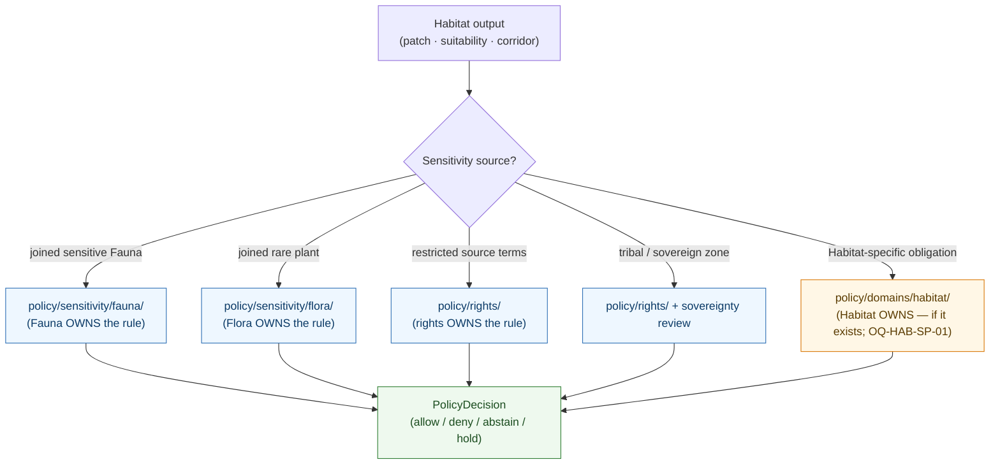

<!-- [KFM_META_BLOCK_V2]
doc_id: kfm://doc/domains/habitat/sensitivity-policy-index
title: Habitat Domain — Sensitivity Policy Index
type: standard
version: v1
status: draft
owners: <habitat-domain-steward>, <policy-steward>, <sensitivity-reviewer>, <docs-steward>   # placeholders pending owner-registry verification
created: 2026-06-05
updated: 2026-06-05
policy_label: public
contract_version: "3.0.0"   # pinned per ai-build-operating-contract.md
related:
  - docs/domains/habitat/README.md
  - docs/domains/habitat/SENSITIVITY.md
  - docs/domains/habitat/SENSITIVITY_AND_GEOPRIVACY.md
  - docs/domains/habitat/REASON_CODES.md
  - docs/domains/habitat/PRESERVATION_MATRIX.md
  - docs/doctrine/policy-aware.md
  - docs/doctrine/directory-rules.md
  - policy/README.md
  - policy/sensitivity/
  - policy/sensitivity/fauna/
  - policy/domains/habitat/
  - schemas/contracts/v1/policy/policy_decision.schema.json
  - ai-build-operating-contract.md
tags: [kfm, domain:habitat, sensitivity, policy, index, navigation, deny-by-default, governance]
notes:
  - "INDEX ONLY. This is a docs-side navigation surface that POINTS INTO policy/. It does NOT contain, restate, or own any allow/deny/restrict/abstain rule. Enforceable rules live under policy/ (Directory Rules §6.5)."
  - "Putting policy logic in docs/ is a named anti-pattern; this doc deliberately avoids it. If a rule appears to be stated here rather than linked, that is a defect."
  - "Habitat sensitivity is largely INHERITED through the joined lane (Fauna/Flora). Atlas §24.13 lists no policy/sensitivity/habitat/ root; the Habitat policy home is an open question (OQ-HAB-SP-01)."
  - "policy/ singular is canonical per ADR-0003 (PROPOSED); legacy policies/ is mirror/deprecated."
  - "All policy/ paths are PROPOSED until mounted-repo verification; the policy/ subtree shape is CONFIRMED by Directory Rules §6.5."
  - "CONTRACT_VERSION = \"3.0.0\""
[/KFM_META_BLOCK_V2] -->

<a id="top"></a>

# 🌿 Habitat — Sensitivity Policy Index

> **A docs-side map of the Habitat lane's sensitivity enforcement.** This document does not contain rules — it tells you *where the rules live* under `policy/`, *what each one is responsible for*, and *which receipt and reason code each produces*. The enforceable allow/deny/restrict/abstain logic is policy-as-code; this is the index that points at it.

<p align="center">
  <b>Index only · Points into <code>policy/</code> · No rules restated · Trust-membrane-respecting</b>
</p>


-lightgrey)

-blue)


<!-- TODO: replace static badges with CI-driven Shields endpoints once owners + policy bundle are verified (NEEDS VERIFICATION). -->

**Status:** draft &middot; **Owners:** habitat steward · policy steward · sensitivity reviewer · docs steward *(placeholders)* &middot; **Contract:** `CONTRACT_VERSION = "3.0.0"` &middot; **Last updated:** 2026-06-05

> [!IMPORTANT]
> **This is an index, not a policy.** It contains no enforceable rule. Every disposition, threshold, radius, or allow/deny condition lives under `policy/` and is referenced here by location and responsibility only. If you need *why* a surface is sensitive, read [`SENSITIVITY.md`](SENSITIVITY.md); if you need *how a location is protected*, read [`SENSITIVITY_AND_GEOPRIVACY.md`](SENSITIVITY_AND_GEOPRIVACY.md); if you need *what the rule actually is*, follow the link into `policy/`. **(CONFIRMED — "documentation as truth" / policy-logic-in-`docs/` is a named anti-pattern; Directory Rules.)**

---

## Contents

1. [Purpose & role](#1-purpose--role)
2. [Why an index and not a policy](#2-why-an-index-and-not-a-policy)
3. [Where Habitat sensitivity policy lives](#3-where-habitat-sensitivity-policy-lives)
4. [Policy index — by sensitive surface](#4-policy-index--by-sensitive-surface)
5. [Policy index — by responsibility](#5-policy-index--by-responsibility)
6. [Inherited vs Habitat-owned policy](#6-inherited-vs-habitat-owned-policy)
7. [How a policy decision is produced & recorded](#7-how-a-policy-decision-is-produced--recorded)
8. [Policy ↔ receipt ↔ reason code map](#8-policy--receipt--reason-code-map)
9. [Policy-as-code parity & validation](#9-policy-as-code-parity--validation)
10. [Open questions register](#10-open-questions-register)
11. [Open verification backlog](#11-open-verification-backlog)
12. [Changelog & definition of done](#12-changelog--definition-of-done)
13. [Related docs](#13-related-docs)

---

## 1. Purpose & role

This index answers one question: **"Where is the rule that governs this Habitat sensitivity decision?"** It maps each sensitive Habitat surface to the policy location responsible for it, the receipt that records the decision, and the reason code emitted on a denial. It is read by stewards, reviewers, and contributors who need to *find* or *audit* a rule — not by the runtime, which loads the policy bundle directly.

| This index does | This index does NOT |
|---|---|
| Point to policy locations under `policy/`. | Contain or restate any allow/deny/restrict/abstain rule. |
| Name the responsibility of each policy area. | Set thresholds, radii, tiers, or dispositions. |
| Map surfaces → policy → receipt → reason code. | Authorize, promote, or enforce anything. |
| Surface open questions about the Habitat policy home. | Decide where the Habitat policy home is (that is an ADR). |

> [!NOTE]
> The index is a **reference**. The authority for any rule is the policy artifact under `policy/`; the authority for *posture* is the two sensitivity docs; the authority for *placement* is Directory Rules and the ADRs. This doc binds them together for navigation. **(CONFIRMED that an index is appropriate in `docs/`; PROPOSED for every specific `policy/` path until mounted-repo verification.)**

[⬆ back to top](#top)

---

## 2. Why an index and not a policy

Per the contract / schema / policy split, **admissibility and allow/deny/restrict/abstain logic belong under `policy/`, never as a `docs/` Markdown file.** Policy in KFM is policy-as-code: Rego/OPA bundles, deny-by-default, pinned by digest, run identically in CI (Conftest) and at runtime (PDP). A Markdown file cannot be that — so this lane keeps the *rules* in `policy/` and the *navigation* here.

> [!WARNING]
> If any row in this index ever states a concrete rule — a tier default, a generalization radius, a deny condition — that is a **defect**, not a feature. Move the rule into `policy/` and leave only the pointer. Policy logic living in `docs/` creates a competing authority and breaks CI-equals-runtime parity. **(CONFIRMED — policy-as-code parity, C5-03; Directory Rules §6.5.)**

[⬆ back to top](#top)

---

## 3. Where Habitat sensitivity policy lives

The `policy/` root is the **canonical singular** policy home (ADR-0003, PROPOSED; legacy `policies/` is a mirror). Its subtree is **CONFIRMED** by Directory Rules §6.5; the presence of Habitat-specific files within it is **PROPOSED** pending mounted-repo verification.

```text
policy/
├── README.md
├── bundles/          # Rego/OPA bundles (the enforceable rules)
├── fixtures/         # policy fixtures (allow/deny/abstain samples)
├── tests/            # policy tests (Conftest/OPA)
├── runtime/          # runtime gate policy (Focus Mode abstain, evidence resolution)
├── promotion/        # promotion-gate policy (gates A–G)
├── sensitivity/      # sensitivity classes, redaction rules
│   ├── fauna/        # ← Habitat inherits sensitive-occurrence rules here (CONFIRMED home for Fauna)
│   ├── flora/        # ← Habitat inherits rare-plant rules here
│   └── …             # (no habitat/ root in Atlas §24.13 crosswalk — see OQ-HAB-SP-01)
├── rights/           # rights status, license enforcement (restricted-source gating)
├── domains/
│   └── habitat/      # ← Habitat-OWNED policy, IF Habitat owns any (PROPOSED — OQ-HAB-SP-01)
└── release/          # release-gate policy
```

> [!CAUTION]
> **Habitat may not own a `policy/sensitivity/habitat/` root.** Atlas §24.13 assigns `policy/sensitivity/<domain>/` roots to **Fauna, Flora, Settlements/Infrastructure, Archaeology, and People** — **not** Habitat. The strong reading is that Habitat sensitivity is governed through the **joined lane's** home (most often `policy/sensitivity/fauna/`), with any genuinely Habitat-owned rule under `policy/domains/habitat/`. Do **not** create `policy/sensitivity/habitat/` without an ADR. Surfaced as OQ-HAB-SP-01. **(CONFIRMED absence from the crosswalk; PROPOSED interpretation.)**

[⬆ back to top](#top)

---

## 4. Policy index — by sensitive surface

Each sensitive Habitat surface maps to the policy location responsible for the decision. **Locations are PROPOSED; no row states the rule itself — follow the link to read it.**

| Sensitive surface | Governing policy location (PROPOSED) | Owns the rule | §23.2 row it implements |
|---|---|---|---|
| Habitat × sensitive Fauna occurrence (nests/dens/roosts/hibernacula/spawning) | `policy/sensitivity/fauna/` (inherited) | Fauna lane | Rare species (occurrence) |
| Habitat × rare-plant record | `policy/sensitivity/flora/` (inherited) | Flora lane | Rare species / restricted source |
| Suitability surface trained on sensitive occurrence | `policy/sensitivity/fauna/` + `policy/domains/habitat/` (if Habitat-owned) | Fauna (inputs) / Habitat (surface rule) | Rare species; exact-harm coordinates |
| Connectivity edge / corridor near a sensitive site | `policy/domains/habitat/` (PROPOSED) | Habitat (if owned) | Rare species; exact-harm coordinates |
| Stewardship zone — tribal / sovereign | `policy/sensitivity/` + `policy/rights/` (sovereignty) | rights / sovereignty | Indigenous / cultural records |
| Restoration opportunity × private parcel | `policy/sensitivity/` (people-land join) + `policy/rights/` | People-Land / rights | Private land assertions |
| Restricted-source-derived field (e.g., NatureServe rare-data) | `policy/rights/` + `SourceDescriptor` rights field | rights | Restricted source terms |
| Geoprivacy conditional (`public_safe_geometry` required) | `policy/domains/habitat/` or `policy/sensitivity/fauna/` (PROPOSED) | OQ-HAB-SP-01 | Rare species; exact-harm coordinates |
| Promotion gate (evidence/spec_hash/review/sensitivity obligations) | `policy/promotion/` | promotion | Gate D (Security & Sensitivity) |
| Focus-Mode abstain/deny conditions | `policy/runtime/` | runtime | Governed AI |

[⬆ back to top](#top)

---

## 5. Policy index — by responsibility

The same policy areas, indexed by what they decide rather than by surface.

| Responsibility | `policy/` location (PROPOSED) | What it decides | Decision record |
|---|---|---|---|
| Sensitivity classification & redaction | `policy/sensitivity/{fauna,flora,…}/` | Which surfaces are sensitive; what transform is required | `PolicyDecision` + `RedactionReceipt` |
| Rights & license enforcement | `policy/rights/` | Whether restricted-source-derived fields may be published | `PolicyDecision` |
| Promotion gating | `policy/promotion/` | Whether a candidate may advance toward `PUBLISHED` | `PolicyDecision` + `PromotionDecision` |
| Release gating | `policy/release/` | Whether a release manifest may publish | `PolicyDecision` |
| Runtime / Focus-Mode | `policy/runtime/` | Whether the AI surface answers, abstains, or denies | `PolicyDecision` + `AIReceipt` |
| Habitat-owned domain rules (if any) | `policy/domains/habitat/` | Habitat-specific obligations not owned by a joined lane | `PolicyDecision` |

[⬆ back to top](#top)

---

## 6. Inherited vs Habitat-owned policy

Habitat's defining sensitivity characteristic is that most of its sensitivity is **inherited**, not owned.



*Diagram status:* **CONFIRMED** for the inheritance pattern (Habitat joins through governed relations; the joined lane owns its sensitivity rule). **PROPOSED** for the `policy/domains/habitat/` branch, which depends on OQ-HAB-SP-01.

> [!NOTE]
> When sensitivity is **inherited**, the Habitat output is bound by the joined lane's rule and reviewers — Habitat does not get a more permissive answer than the source. When (and only when) Habitat owns a genuinely Habitat-specific obligation, it lives under `policy/domains/habitat/`. The boundary between the two is itself an open question. **(CONFIRMED inheritance doctrine — Habitat dossier §F cross-lane constraint; PROPOSED ownership boundary.)**

[⬆ back to top](#top)

---

## 7. How a policy decision is produced & recorded

This index points at rules; the rules produce a `PolicyDecision`. The decision is a **recorded artifact**, not a transient log line.

- A governed gate evaluates the applicable policy bundle (Rego/OPA), **deny-by-default**.
- The result is a `PolicyDecision` with `decision_id`, `input_ref`, `policy_id`, `outcome`, `obligations`, `reasons`, `timestamps`, `reviewer`. *(CONFIRMED schema home `schemas/contracts/v1/policy/policy_decision.schema.json`.)*
- A promotion gate **denies** when `evidence_refs`, `spec_hash`, source-asset validators, steward review, or sensitivity obligations are missing. *(CONFIRMED card KFM-P32-PROG-0008 / PROPOSED rule.)*
- Sensitivity obligations (generalize, withhold, attach `RedactionReceipt`) are emitted as obligations on the decision and discharged before release.

> [!IMPORTANT]
> The same Rego bundle, pinned by digest, runs in CI (Conftest) and at runtime (PDP) — **policy parity**. What is enforced in production is exactly what was tested. This index never duplicates the bundle; it points at where the bundle lives so the digest stays single-sourced. **(CONFIRMED — C5-03 policy parity.)**

[⬆ back to top](#top)

---

## 8. Policy ↔ receipt ↔ reason code map

Closes the loop between this index, the receipts that record decisions, and the reason codes in [`REASON_CODES.md`](REASON_CODES.md).

| Policy area | Receipt produced | Reason code on denial (see REASON_CODES.md) |
|---|---|---|
| `policy/sensitivity/{fauna,flora}/` | `RedactionReceipt` + `PolicyDecision` | `JOIN_SENSITIVE_OCCURRENCE`, `SENSITIVITY_UNRESOLVED` |
| `policy/rights/` | `PolicyDecision` (+ `SourceDescriptor` rights field) | `RIGHTS_UNKNOWN` |
| `policy/promotion/` | `PolicyDecision` + `PromotionDecision` | `MISSING_EVIDENCE`, `MISSING_REVIEW`, `REVIEW_NEEDED` |
| `policy/release/` | `PolicyDecision` (+ `ReleaseManifest` gate) | `RELEASE_MANIFEST_INVALID`, `ROLLBACK_TARGET_MISSING` |
| `policy/runtime/` | `PolicyDecision` + `AIReceipt` | (AI `DENY` / `ABSTAIN` with reason) |
| `policy/domains/habitat/` (if owned) | `PolicyDecision` | `MODEL_LABEL_COLLAPSE`, `STEWARD_ZONE_OVERRIDE`, `UNCERTAINTY_MISSING` |

> [!NOTE]
> Reason-code identifiers are **PROPOSED** (ADR-S-04-class vocabulary review) and defined in `docs/domains/habitat/REASON_CODES.md`; the master gate-failure catalog is Atlas §24.6.3. Their binding to specific policy areas is PROPOSED pending the validator exit-code contract.

[⬆ back to top](#top)

---

## 9. Policy-as-code parity & validation

How the linked policies are kept honest. **(CONFIRMED doctrine — C5 policy-as-code; Directory Rules §6.5 policy validation; PROPOSED implementation homes.)**

- **Deny-by-default.** Absence of evidence blocks promotion; the bundle's default is deny.
- **CI = runtime parity.** The Rego bundle is pinned by OCI digest / git SHA in both CI workflows and runtime manifests; fixtures pinned with a lock; golden allow/deny/abstain suite every PR must pass.
- **Validation set.** OPA/Conftest tests, deny-by-default tests, policy-bundle digest checks, and (for release) keyless-cosign + Rekor + SBOM + SLSA-predicate negative-fixture tests. *(Directory Rules §6.5 / repo guiding doc.)*
- **Tests & fixtures.** Policy tests under `policy/tests/` (or `tests/policy/`); policy fixtures under `policy/fixtures/`; habitat-scoped enforceability proofs under `tests/domains/habitat/`.

> [!NOTE]
> This index does not run or own any of these checks. It records *where they live* so a reviewer can trace a Habitat sensitivity decision from this page to the rule, to the test that proves it, to the receipt that records it. CI homes (`.github/workflows/`, `tools/validators/`) are **NEEDS VERIFICATION**.

[⬆ back to top](#top)

---

## 10. Open questions register

| ID | Question | Owner role | Resolution path |
|---|---|---|---|
| OQ-HAB-SP-01 | Does Habitat own a `policy/sensitivity/habitat/` (or `policy/domains/habitat/`) root, or inherit entirely through joined lanes? | Directory steward + policy steward | ADR; Atlas §24.13 lists no Habitat sensitivity root. (Same question as OQ-HAB-SEN-01 / OQ-HAB-SG-02 / OQ-HAB-PRES-05.) |
| OQ-HAB-SP-02 | Which Habitat obligations are genuinely Habitat-owned vs inherited (the ownership boundary in §6)? | Policy steward + habitat steward | Policy bundle authorship; ADR-S-14 (cross-lane join). |
| OQ-HAB-SP-03 | Reconcile this index against `SENSITIVITY.md` and `SENSITIVITY_AND_GEOPRIVACY.md` so the three do not drift. | Docs steward | DRIFT_REGISTER; single-source each normative statement. |
| OQ-HAB-SP-04 | Canonical reason-code → policy-area binding (§8). | Policy steward | Validator exit-code contract; ADR-S-04. |
| OQ-HAB-SP-05 | Policy-test and fixture homes for Habitat (`policy/tests/` vs `tests/policy/`; `tests/domains/habitat/`). | QA steward | Per-root README; Directory Rules §6.6. |
| OQ-HAB-SP-06 | `policy/` vs legacy `policies/` resolution. | Policy steward | ADR-0003 (PROPOSED). |

[⬆ back to top](#top)

---

## 11. Open verification backlog

These items remain `NEEDS VERIFICATION` before promotion from `draft` to `published`:

1. Habitat policy home — `policy/sensitivity/habitat/` vs `policy/domains/habitat/` vs inherited-only (OQ-HAB-SP-01); verify against a mounted repo and ADR.
2. Presence of each linked `policy/` location in the branch (the subtree shape is CONFIRMED; the files are not).
3. `policy_decision.schema.json` presence and field names at `schemas/contracts/v1/policy/`.
4. OPA bundle digest and the CI/runtime parity wiring (C5-03) — verify against workflows and runtime manifests.
5. Promotion-gate deny conditions (KFM-P32-PROG-0008) — verify against `policy/promotion/` and tests.
6. Reason-code → policy-area binding (§8) — verify against the validator exit-code contract and `REASON_CODES.md`.
7. Reconciliation of the three Habitat sensitivity docs (OQ-HAB-SP-03) so no rule is stated in more than one place — and no rule is stated in `docs/` at all.

[⬆ back to top](#top)

---

## 12. Changelog & definition of done

### 12.1 Changelog

| Change | Type (per contract §37) | Reason |
|---|---|---|
| Initial Habitat sensitivity **policy index** (navigation into `policy/`, no rules restated). | new | Created per explicit user instruction ("policy INDEX that points to policy/ rules"). |
| Anchored the `policy/` subtree to Directory Rules §6.5 and ADR-0003 (singular canonical). | clarification | Establishes the CONFIRMED policy-root structure the index points at. |
| Surfaced the Habitat policy-home question (OQ-HAB-SP-01) as CONFIRMED-absence-from-crosswalk. | gap closure | Consistent with OQ-HAB-SEN-01 / OQ-HAB-SG-02 / OQ-HAB-PRES-05. |
| Mapped policy areas → receipts → reason codes (§8); linked REASON_CODES.md. | gap closure | Closes the loop between policy, audit artifact, and denial vocabulary. |
| Pinned `CONTRACT_VERSION = "3.0.0"`; used Directory Rules §12 segment path; restated no rules. | housekeeping / safety | Required for doctrine-adjacent docs; trust-membrane discipline (no policy logic in docs/). |

> **Backward compatibility.** New document — no prior anchors. Joins the Habitat sensitivity doc set (`SENSITIVITY.md`, `SENSITIVITY_AND_GEOPRIVACY.md`, this index); the three must be kept single-sourced (OQ-HAB-SP-03).

### 12.2 Definition of done

This document is done enough to enter the repository when:

- it remains an **index** — confirmed at review that it states no allow/deny/restrict/abstain rule, threshold, radius, or tier default;
- the Habitat policy home (OQ-HAB-SP-01) is resolved, or the index clearly marks each `policy/` target PROPOSED with a DRIFT_REGISTER entry;
- it is placed at `docs/domains/habitat/SENSITIVITY_POLICY.md` per Directory Rules §12, with the lane HAB-V-009 path-form conflict logged;
- the policy steward, habitat domain steward, sensitivity reviewer, and docs steward review it;
- it is linked from `docs/domains/habitat/README.md`, `SENSITIVITY.md`, and `policy/README.md`;
- the three Habitat sensitivity docs are reconciled so no normative statement is duplicated (OQ-HAB-SP-03);
- the `GENERATED_RECEIPT.json` planned in the PR is wired into CI with `contract_version: "3.0.0"`;
- future changes follow the operating contract's §37 lifecycle.

[⬆ back to top](#top)

---

## 13. Related docs

**All targets PROPOSED until confirmed against a mounted repo; path form follows Directory Rules §12 / §6.5.**

- [`docs/domains/habitat/SENSITIVITY.md`](SENSITIVITY.md) — Habitat sensitivity posture (the *why*).
- [`docs/domains/habitat/SENSITIVITY_AND_GEOPRIVACY.md`](SENSITIVITY_AND_GEOPRIVACY.md) — geoprivacy mechanics (the *how a location is protected*).
- [`docs/domains/habitat/REASON_CODES.md`](REASON_CODES.md) — reason codes a denial emits.
- [`docs/domains/habitat/PRESERVATION_MATRIX.md`](PRESERVATION_MATRIX.md) — per-object tiers and transforms.
- [`docs/domains/habitat/README.md`](README.md) — Habitat lane orientation.
- [`docs/doctrine/policy-aware.md`](../../doctrine/policy-aware.md) — fail-safe / deny-by-default doctrine.
- [`docs/doctrine/directory-rules.md`](../../doctrine/directory-rules.md) — §6.5 `policy/` structure; §12 Domain Placement Law.
- `policy/README.md` — policy root authority *(PROPOSED — NEEDS VERIFICATION)*.
- `policy/sensitivity/fauna/` — inherited sensitive-occurrence rules *(CONFIRMED home for Fauna; PROPOSED Habitat binding)*.
- `policy/domains/habitat/` — Habitat-owned policy, if any *(PROPOSED — OQ-HAB-SP-01)*.
- `schemas/contracts/v1/policy/policy_decision.schema.json` — `PolicyDecision` record schema *(CONFIRMED home / PROPOSED presence)*.
- [`ai-build-operating-contract.md`](../../../ai-build-operating-contract.md) — §23 sensitive-domain matrix; canonical operating contract (`CONTRACT_VERSION = "3.0.0"`).

---

**Last updated:** 2026-06-05 &middot; **Status:** draft &middot; **Contract:** `CONTRACT_VERSION = "3.0.0"` &middot; **Role:** policy index (navigational; no rules restated) &middot; **Citation short-names:** [DOM-HAB], [DOM-HF], [DOM-FAUNA], [DOM-FLORA], [ENCY], [DIRRULES], [GAI], [OPCON §23]

[⬆ back to top](#top)
