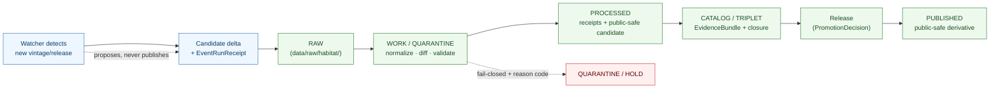

<!-- [KFM_META_BLOCK_V2]
doc_id: kfm://doc/runbooks/habitat/source-refresh
title: Habitat — Source Refresh Runbook
type: runbook
version: v1
status: draft
owners: <habitat-domain-steward>, <source-steward>, <rights-reviewer>, <ops-steward>   # placeholders pending owner-registry verification
created: 2026-06-05
updated: 2026-06-05
policy_label: public
contract_version: "3.0.0"   # pinned per ai-build-operating-contract.md
related:
  - docs/runbooks/fauna/SOURCE_REFRESH_RUNBOOK.md
  - docs/domains/habitat/SOURCES.md
  - docs/domains/habitat/SOURCE_FAMILIES.md
  - docs/domains/habitat/SENSITIVITY.md
  - docs/domains/habitat/RELEASE_INDEX.md
  - docs/domains/habitat/REASON_CODES.md
  - docs/doctrine/directory-rules.md
  - data/registry/sources/habitat/
  - data/raw/habitat/
  - ai-build-operating-contract.md
tags: [kfm, domain:habitat, runbook, source-refresh, ops, watcher, promotion, governance]
notes:
  - "PLACEMENT CONFLICT: requested at docs/domains/habitat/SOURCE_REFRESH_RUNBOOK.md, but Directory Rules §6.1.b makes docs/runbooks/ the canonical home for operational procedures. A runbook under docs/domains/ is a responsibility-root violation (a runbook is procedure, not domain documentation). This artifact is placed at docs/runbooks/habitat/SOURCE_REFRESH_RUNBOOK.md (Pattern A — domain subfolder, matching the fauna runbook). The requested path is recorded as a drift candidate (OQ-HAB-RB-01)."
  - "Runbook subfolder-vs-flat convention is OPEN-DR-02 (ADR pending); Pattern A adopted because the fauna runbook already uses it."
  - "Watcher-as-non-publisher invariant: a watcher proposes a candidate delta and emits a receipt; it NEVER promotes or publishes."
  - "Refresh is a governed lifecycle pass (RAW → … → PUBLISHED), not a file overwrite. Source role is set at admission and never edited in-place; a changed role needs a new descriptor + CorrectionNotice."
  - "Sensitive sources (NatureServe rare-data, occurrence inputs, KDWP SGCN) fail closed. No exact coordinates, tokens, or restricted-source fields appear. CONTRACT_VERSION = \"3.0.0\"."
[/KFM_META_BLOCK_V2] -->

# 🌿 Habitat — Source Refresh Runbook

> Operational procedure for refreshing a Habitat source family — detecting a new vintage/release, admitting it through the governed lifecycle, diffing it against the prior version, re-validating rights and sensitivity, and promoting a public-safe derivative. **A refresh is a governed lifecycle pass, not a file overwrite.**

  <b>Watcher proposes · Operator validates · Steward approves · Promotion publishes</b>

<!-- TODO: replace static badges with CI-driven Shields endpoints once owners + workflows are verified (NEEDS VERIFICATION). -->

**Status:** draft &middot; **Owners:** habitat steward · source steward · rights reviewer · ops steward *(placeholders)* &middot; **Contract:** `CONTRACT_VERSION = "3.0.0"` &middot; **Last updated:** 2026-06-05

> [!IMPORTANT]
> **Placement note.** This runbook was requested at `docs/domains/habitat/SOURCE_REFRESH_RUNBOOK.md`, but Directory Rules §6.1.b makes **`docs/runbooks/`** the canonical home for operational procedures — a runbook under `docs/domains/` is a responsibility-root violation. It is placed here at **`docs/runbooks/habitat/SOURCE_REFRESH_RUNBOOK.md`** (Pattern A — domain subfolder, matching the authored fauna runbook). The requested path is logged as a drift candidate (OQ-HAB-RB-01). **(CONFIRMED — Directory Rules §6.1.b; OPEN-DR-02 for subfolder-vs-flat.)**

---

## Contents

1. [Purpose & scope](#1-purpose--scope)
2. [Preconditions](#2-preconditions)
3. [The refresh is a lifecycle pass](#3-the-refresh-is-a-lifecycle-pass)
4. [Procedure](#4-procedure)
5. [Per-family refresh notes](#5-per-family-refresh-notes)
6. [Sensitivity & rights re-checks](#6-sensitivity--rights-re-checks)
7. [No-network / dry-run testing](#7-no-network--dry-run-testing)
8. [Failure handling & reason codes](#8-failure-handling--reason-codes)
9. [Rollback & correction](#9-rollback--correction)
10. [Operator checklist](#10-operator-checklist)
11. [Open questions register](#11-open-questions-register)
12. [Open verification backlog](#12-open-verification-backlog)
13. [Changelog & definition of done](#13-changelog--definition-of-done)
14. [Related docs](#14-related-docs)

---

## 1. Purpose & scope

This runbook tells an operator how to refresh a Habitat source family when a new vintage or release appears (e.g., a new NLCD vintage, a new PAD-US version, a new GAP/LANDFIRE model run). It covers detection, admission, diff, re-validation, and promotion of a public-safe derivative.

**In scope:** the eight Habitat source families (see [`SOURCES.md`](../../domains/habitat/SOURCES.md)) and the adjacent context-fabric families. **Out of scope:** source *intake* of a brand-new source (use the Source Intake runbook), rights resolution from scratch (Rights Review runbook), and Fauna-owned occurrence truth (Fauna source-refresh runbook).

> [!NOTE]
> A refresh does not change what a source *is*. The `source_role` is set at admission and **never edited in-place**; if a refresh reveals a role change, that is a *new descriptor* plus a `CorrectionNotice`, not an edit. **(CONFIRMED — Atlas §24.1.3.)**

[⬆ back to top](#top)

---

## 2. Preconditions

Before starting a refresh, confirm:

- The family already has an admitted `SourceDescriptor` in `data/registry/sources/habitat/` (if not, this is *intake*, not refresh).
- The family's rights/terms are resolved (Gate B) — or the refresh stops at WORK until they are.
- The operator has the family dossier ([`SOURCE_FAMILIES.md`](../../domains/habitat/SOURCE_FAMILIES.md)) open for the diff strategy and crosswalk.
- For sensitive families, the sensitivity reviewer and (for occurrence) wildlife steward are available to sign off.

[⬆ back to top](#top)

---

## 3. The refresh is a lifecycle pass

A refresh re-runs the governed lifecycle for the changed source. It is **not** a copy over the old file.

> [!CAUTION]
> **Watcher-as-non-publisher.** The watcher detects change and emits a receipt and a *candidate* delta. It never writes to `data/catalog/` or `data/published/` and never promotes. Promotion is a governed state transition requiring a `PromotionDecision`. **(CONFIRMED invariant.)**

[⬆ back to top](#top)

---

## 4. Procedure

| Step | Action | Gate / artifact |
|---|---|---|
| 1 | **Detect.** Watcher (or operator) identifies a new vintage/release; record an `EventRunReceipt`. | Pre-RAW event |
| 2 | **Capture to RAW.** Store the immutable source payload/reference under `data/raw/habitat/` with role, rights, sensitivity, citation, time, hash. | `SourceDescriptor` exists (refreshed entry) |
| 3 | **Normalize in WORK.** Reproject, normalize geometry/time/identity; preserve native classification. | Validation + policy gate, or quarantine reason |
| 4 | **Diff.** Apply the family's diff strategy (boundary-diff for PAD-US/NWI; vintage-diff for NLCD; model-run delta for GAP/LANDFIRE). Record what changed. | `TransformReceipt` |
| 5 | **Re-validate rights (Gate B).** Re-check license/terms; a refresh can change terms. | `RightsReviewRecord` |
| 6 | **Re-validate sensitivity (Gate C).** Re-check geoprivacy status and sensitive-join exposure of the *new* data. | `PolicyDecision` + `RedactionReceipt` if applies |
| 7 | **Emit PROCESSED candidate.** Validated objects + receipts + public-safe candidate. | `EvidenceRef`, `ValidationReport`, digest closure |
| 8 | **Close CATALOG.** STAC/DCAT/PROV + `EvidenceBundle` + digests. | Catalog closure |
| 9 | **Promote.** Release authority issues a `PromotionDecision` and `ReleaseManifest` with a rollback target; supersede the prior release. | `PromotionDecision` + `ReleaseManifest` |
| 10 | **Update indices.** Add/supersede the row in [`RELEASE_INDEX.md`](../../domains/habitat/RELEASE_INDEX.md); update freshness. | Release-index mirror |

> [!IMPORTANT]
> If any gate fails, the refresh **stops at the prior state** with a reason code (see §8). The previous published version remains live until the new one is fully promoted — no half-published vintage. **(CONFIRMED — universal closure rules; promotion is atomic at the gate.)**

[⬆ back to top](#top)

---

## 5. Per-family refresh notes

Diff and cadence specifics per family (full dossiers in [`SOURCE_FAMILIES.md`](../../domains/habitat/SOURCE_FAMILIES.md)).

| Family | Detect | Diff strategy | Refresh note |
|---|---|---|---|
| **NLCD** | New national vintage | Vintage-diff; never overwrite prior vintage | Preserve native classes; crosswalk advisory only. |
| **NWI** | Wetlands Mapper update | Project delta strategy (per descriptor) | Preserve Cowardin classes. |
| **GAP / LANDFIRE** | New modeled release | Model-run delta | New run = new `ModelRunReceipt` + uncertainty surface. |
| **PAD-US** | New protected-area/easement version | Boundary-diff strategy (per descriptor) | Re-check tribal/sovereign withholdings. |
| **NatureServe** | Controlled release | Rank/definition delta | **Re-check rights every release**; access-gated. |
| **USFWS ECOS** | Designation change | Designation-diff | A designation change may trigger a downstream `CorrectionNotice`. |
| **KDWP** | List/designation update | Per-product diff | Confirm regulatory-vs-observed role per product. |
| **Occurrence (GBIF/iNat/iDigBio)** | Continuous / per-record | Per-record; geoprivacy re-check | Re-check `geoprivacy_status` on every ingest. |
| **NEON** *(adjacent)* | Released vs Provisional change | Provisional may change without notice | Treat Provisional as `candidate` (no PUBLISHED edge). |

[⬆ back to top](#top)

---

## 6. Sensitivity & rights re-checks

A refresh re-opens both rights and sensitivity. New data can carry new exposure.

- **Rights (Gate B).** Re-run the rights review; terms can change between vintages. A refresh that loses public-release rights demotes the layer (downgrade → `CorrectionNotice`).
- **Sensitivity (Gate C).** Re-evaluate the *new output*, not just the inputs. A new vintage can introduce a sensitive concentration that the prior vintage did not have.
- **Occurrence geoprivacy.** Re-check `geoprivacy_status`; `public_safe_geometry` required when status ∈ {obscured, private, generalized}.
- **Sovereign/steward zones.** Re-check PAD-US tribal/sovereign withholdings on each boundary update.

> [!CAUTION]
> **Sensitive families fail closed on refresh.** NatureServe rare-data, occurrence inputs, and KDWP SGCN re-enter the sensitive lane on every refresh; deny-by-default until geoprivacy + receipts + review are re-satisfied. This runbook names *that a re-check is required*; the thresholds, radii, and gate terms are steward-gated in `policy/` and are **not** stated here. See [`SENSITIVITY.md`](../../domains/habitat/SENSITIVITY.md). **(Sensitive-source discipline.)**

[⬆ back to top](#top)

---

## 7. No-network / dry-run testing

A refresh should be exercised against fixtures before touching live connectors. **(CONFIRMED — no-network fixture testing; release/rollback dry-run acceptance, Build Manual §24.)**

- Use public-safe **fixtures**, not live sensitive connectors, for the dry run.
- Run the loop end-to-end (`detect → … → release candidate`) with **no publication target** — loop records and validation reports only.
- Confirm the diff, the receipts, and the `ValidationReport` are produced deterministically (replay must not drift).
- Confirm a **rollback dry-run** passes before any steward-significant refresh is treated as reliable.

[⬆ back to top](#top)

---

## 8. Failure handling & reason codes

When a refresh gate fails, it fails closed with a reason code (see [`REASON_CODES.md`](../../domains/habitat/REASON_CODES.md)).

| Failure | Reason code | Operator action |
|---|---|---|
| Rights unresolved after refresh | `RIGHTS_UNKNOWN` | Stop at WORK; route to rights reviewer. |
| Sensitivity unresolved on new data | `SENSITIVITY_UNRESOLVED` | Stop; sensitivity review; apply transform. |
| Sensitive occurrence join exposed | `JOIN_SENSITIVE_OCCURRENCE` | Generalize; attach `RedactionReceipt`; re-evaluate output. |
| Modeled surface missing uncertainty | `UNCERTAINTY_MISSING` | Attach `UncertaintySurface`; re-run closure. |
| Role appears to have changed | `ROLE_DOWNCAST_FORBIDDEN` / `ROLE_COLLAPSE` | New descriptor + `CorrectionNotice`; never relabel in-place. |
| Missing receipt / evidence | `MISSING_RECEIPT` / `MISSING_EVIDENCE` | Re-emit; re-run the gate. |

> [!NOTE]
> A failed refresh is **not** a published failure — the prior release stays live. Quarantine the candidate with its reason code and resolve before retrying. **(CONFIRMED — fail-closed; prior state preserved.)**

[⬆ back to top](#top)

---

## 9. Rollback & correction

If a refresh is promoted and later found defective:

- **Rollback** to the prior release via a `RollbackCard` (rollback target named in the `ReleaseManifest`); verify by digests and manifests — never a hidden file copy.
- **Correction** if the defect is data, not release: issue a `CorrectionNotice`, identify downstream derivatives, supersede the release. Correction-lineage failures emit `CORRECTION_DERIVATIVES_UNRESOLVED` / `CORRECTION_PRIOR_RELEASE_MISSING`.
- **Update the release index** to reflect `rolled_back` or `PUBLISHED′ (corrected)` — the row is updated, never deleted.

See [`RELEASE_INDEX.md`](../../domains/habitat/RELEASE_INDEX.md) §8.

[⬆ back to top](#top)

---

## 10. Operator checklist

- [ ] Family already admitted (this is refresh, not intake).
- [ ] `EventRunReceipt` recorded for the detected change.
- [ ] RAW captured with role, rights, sensitivity, citation, time, hash.
- [ ] Diff applied per the family strategy; `TransformReceipt` recorded.
- [ ] Rights re-validated (Gate B); `RightsReviewRecord`.
- [ ] Sensitivity re-validated on the **new output** (Gate C); `PolicyDecision`.
- [ ] Occurrence `geoprivacy_status` re-checked; `public_safe_geometry` present where required.
- [ ] PROCESSED candidate + receipts + `ValidationReport` produced.
- [ ] CATALOG closed (STAC/DCAT/PROV + `EvidenceBundle`).
- [ ] `PromotionDecision` + `ReleaseManifest` with rollback target; release authority distinct from author if material.
- [ ] Release index row added/superseded; freshness updated.
- [ ] No-network dry run + rollback dry run passed before live promotion.
- [ ] Source role unchanged in-place (any change = new descriptor + `CorrectionNotice`).

[⬆ back to top](#top)

---

## 11. Open questions register

| ID | Question | Owner role | Resolution path |
|---|---|---|---|
| OQ-HAB-RB-01 | Canonical home: `docs/runbooks/habitat/` (this doc) vs the requested `docs/domains/habitat/`. | Directory steward | Directory Rules §6.1.b favors `docs/runbooks/`; log requested path as drift. |
| OQ-HAB-RB-02 | Runbook subfolder-vs-flat convention (Pattern A vs B). | Docs steward | OPEN-DR-02 ADR; Pattern A adopted here. |
| OQ-HAB-RB-03 | Whether Habitat shares the Fauna source-refresh runbook for occurrence inputs or keeps its own. | Habitat + Fauna stewards | Cross-lane runbook ownership. |
| OQ-HAB-RB-04 | Watcher cadence and quarantine-recovery policy per family. | Source steward | ADR-S-12 (connector cadence & quarantine recovery). |
| OQ-HAB-RB-05 | CI workflow home for the refresh dry-run + rollback drill. | Ops steward | `.github/workflows/`; validator orchestrator. |
| OQ-HAB-RB-06 | Exact diff parameters per family (boundary tolerance, vintage matching). | Source steward | Per-descriptor; policy bundle where sensitive. |

[⬆ back to top](#top)

---

## 12. Open verification backlog

These items remain `NEEDS VERIFICATION` before promotion from `draft` to `published`:

1. Runbook home (OQ-HAB-RB-01) and subfolder convention (OQ-HAB-RB-02) — verify against a mounted repo and the OPEN-DR-02 ADR.
2. Presence of `data/raw/habitat/`, `data/registry/sources/habitat/`, and the release subtree.
3. Watcher implementation and the watcher-as-non-publisher enforcement.
4. Per-family diff strategies and cadence values (none resolved in this docs-only pass).
5. No-network fixture homes and the rollback-drill workflow.
6. Reason-code bindings (§8) against the validator exit-code contract.
7. Whether the occurrence refresh is shared with the Fauna runbook (OQ-HAB-RB-03).

[⬆ back to top](#top)

---

## 13. Changelog & definition of done

### 13.1 Changelog

| Change | Type (per contract §37) | Reason |
|---|---|---|
| Initial Habitat source-refresh runbook. | new | First operational refresh procedure for the Habitat lane. |
| Placed at `docs/runbooks/habitat/` (not the requested `docs/domains/habitat/`); surfaced the placement conflict (OQ-HAB-RB-01). | reconciliation | Directory Rules §6.1.b makes `docs/runbooks/` the canonical runbook home; a runbook under `docs/domains/` is a responsibility-root violation. |
| Adopted Pattern A (domain subfolder), matching the authored fauna runbook. | clarification | OPEN-DR-02 recommendation for domains with a subfolder in flight. |
| Anchored the lifecycle pass, watcher-as-non-publisher invariant, gates, and no-network/rollback dry-run to CONFIRMED doctrine. | clarification | Establishes the CONFIRMED basis for the procedure. |
| Pinned `CONTRACT_VERSION = "3.0.0"`; sensitive re-checks stated without exact parameters. | housekeeping / safety | Doctrine-adjacent + sensitive-source discipline. |

> **Backward compatibility.** New document — no prior anchors. Companion to `docs/runbooks/fauna/SOURCE_REFRESH_RUNBOOK.md` and the Habitat source docs.

### 13.2 Definition of done

This runbook is done enough to enter the repository when:

- the runbook home is confirmed (`docs/runbooks/habitat/` per §6.1.b) and the requested `docs/domains/habitat/` path is logged as drift (OQ-HAB-RB-01), with OPEN-DR-02 resolved or noted;
- the habitat domain steward, source steward, rights reviewer, and ops steward review it; sensitivity reviewer signs off on §6;
- it is linked from `docs/domains/habitat/SOURCES.md`, the runbooks index, and the fauna runbook (cross-lane);
- per-family diff strategies and watcher cadence are confirmed against descriptors;
- it states no exact coordinates, tokens, diff tolerances for sensitive families, or restricted-source-derived fields (confirmed at review);
- the no-network dry-run and rollback-drill workflows exist or are tracked;
- the `GENERATED_RECEIPT.json` planned in the PR is wired into CI with `contract_version: "3.0.0"`;
- future changes follow the operating contract's §37 lifecycle.

[⬆ back to top](#top)

---

## 14. Related docs

**All targets PROPOSED until confirmed against a mounted repo; runbook home per Directory Rules §6.1.b.**

- [`docs/runbooks/fauna/SOURCE_REFRESH_RUNBOOK.md`](../fauna/SOURCE_REFRESH_RUNBOOK.md) — the sibling Fauna runbook (Pattern A precedent; cross-lane for occurrence).
- [`docs/domains/habitat/SOURCES.md`](../../domains/habitat/SOURCES.md) — source index (role, rights posture, freshness).
- [`docs/domains/habitat/SOURCE_FAMILIES.md`](../../domains/habitat/SOURCE_FAMILIES.md) — per-family dossiers (diff strategy, descriptor fields).
- [`docs/domains/habitat/SENSITIVITY.md`](../../domains/habitat/SENSITIVITY.md) — sensitivity posture re-checked on refresh.
- [`docs/domains/habitat/RELEASE_INDEX.md`](../../domains/habitat/RELEASE_INDEX.md) — where the refreshed release is indexed; rollback/correction handling.
- [`docs/domains/habitat/REASON_CODES.md`](../../domains/habitat/REASON_CODES.md) — reason codes a failed refresh emits.
- [`docs/doctrine/directory-rules.md`](../../doctrine/directory-rules.md) — §6.1.b runbook placement; OPEN-DR-02.
- `data/registry/sources/habitat/` — append-only descriptor authority *(CONFIRMED home / PROPOSED presence)*.
- `data/raw/habitat/` — RAW capture home *(PROPOSED)*.
- [`ai-build-operating-contract.md`](../../../ai-build-operating-contract.md) — gates A–G; §23 runbooks-to-create; canonical operating contract (`CONTRACT_VERSION = "3.0.0"`).

---

**Last updated:** 2026-06-05 &middot; **Status:** draft &middot; **Contract:** `CONTRACT_VERSION = "3.0.0"` &middot; **Home:** `docs/runbooks/habitat/` (per §6.1.b) &middot; **Invariant:** watcher-as-non-publisher &middot; **Citation short-names:** [DOM-HAB], [DOM-HF], [DIRRULES], [ENCY]

[⬆ back to top](#top)
