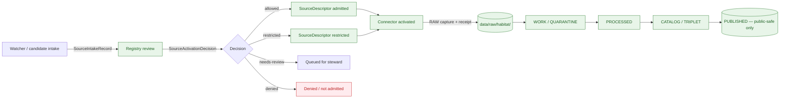
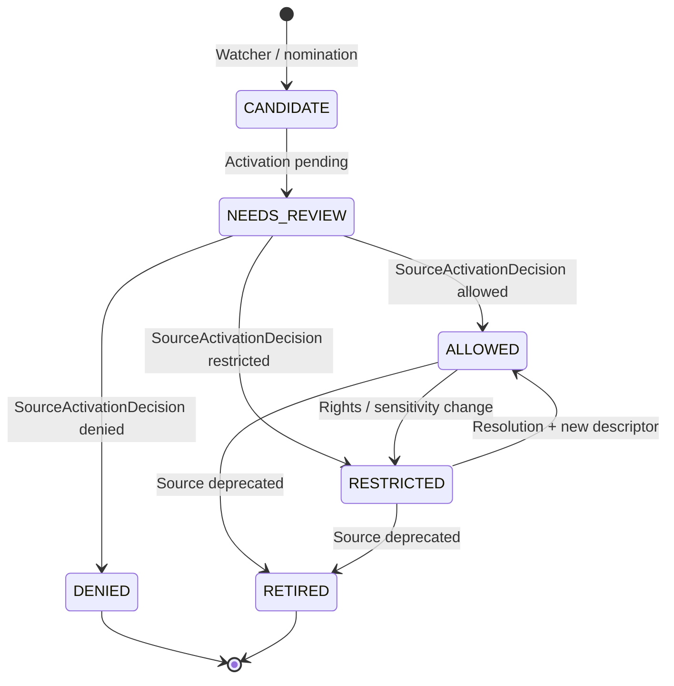

<!-- [KFM_META_BLOCK_V2]
doc_id: kfm://doc/domains/habitat/source-registry
title: Habitat Domain — Source Registry
type: standard
version: v1.1
status: draft
owners: TODO — habitat domain steward; source-registry steward; rights reviewer; docs steward
created: 2026-05-17
updated: 2026-06-05
policy_label: public
contract_version: "3.0.0"   # pinned per ai-build-operating-contract.md
related:
  - docs/domains/habitat/README.md
  - docs/domains/habitat/SOURCES.md
  - docs/domains/habitat/SOURCE_FAMILIES.md
  - docs/runbooks/habitat/SOURCE_REFRESH_RUNBOOK.md
  - docs/sources/SOURCE_DESCRIPTOR_STANDARD.md
  - docs/runbooks/fauna/SOURCE_REFRESH_RUNBOOK.md
  - directory-rules.md
  - schemas/contracts/v1/source/source-descriptor.json
  - data/registry/sources/habitat/
  - policy/domains/habitat/
  - ai-build-operating-contract.md
tags: [kfm, habitat, source-registry, governance, admission]
notes:
  - Path placement follows Directory Rules §12 domain lane pattern.
  - This document is a human-facing control surface, not the machine-readable registry.
  - "Three Habitat source docs now exist — SOURCES.md (index), SOURCE_FAMILIES.md (per-family dossiers), and this SOURCE_REGISTRY.md (admission/activation control surface). They share the family catalog and MUST be kept single-sourced; reconciliation tracked in OQ-HAB-SR-13."
  - "Source-role labels use the CONFIRMED 7-role enum (Atlas §24.1.1 / ADR-S-04). Per-family role assignments are PROPOSED; the NWI/NLCD multi-role labels here diverge from SOURCE_FAMILIES.md and are flagged in OQ-HAB-SR-14."
  - "Sensitivity outcomes route through the §20.5 deny-by-default register; tier scheme T0–T4 (Atlas §24.5.1 / ADR-S-05) referenced, adoption PROPOSED."
  - "CONTRACT_VERSION = \"3.0.0\""
[/KFM_META_BLOCK_V2] -->

# 🌿 Habitat Domain — Source Registry

> Human-facing admission and authority-control surface for source families the **Habitat** domain may admit, quarantine, restrict, or deny. Not a bibliography. Not the truth store. Not a publication authority.


<!-- TODO: replace static badges with CI-driven Shields endpoints once owners + registry are verified (NEEDS VERIFICATION). -->

**Status:** draft &nbsp;·&nbsp; **Owners:** TODO — habitat domain steward; source-registry steward &nbsp;·&nbsp; **Contract:** `CONTRACT_VERSION = "3.0.0"` &nbsp;·&nbsp; **Last updated:** 2026-06-05

---

<a id="contents"></a>

## Contents

1. [Purpose and scope](#1-purpose-and-scope)
2. [How this registry fits the trust spine](#2-how-this-registry-fits-the-trust-spine)
3. [Repo fit and authority](#3-repo-fit-and-authority)
4. [Relationship to SOURCES.md and SOURCE_FAMILIES.md](#4-relationship-to-sourcesmd-and-source_familiesmd)
5. [What belongs here — and what does not](#5-what-belongs-here--and-what-does-not)
6. [Source-role vocabulary](#6-source-role-vocabulary)
7. [Habitat source families](#7-habitat-source-families)
8. [Sensitivity posture](#8-sensitivity-posture)
9. [Admission lifecycle](#9-admission-lifecycle)
10. [Watcher discipline](#10-watcher-discipline)
11. [Schema, policy, and validator surfaces](#11-schema-policy-and-validator-surfaces)
12. [Cross-domain joins](#12-cross-domain-joins)
13. [Open questions and verification backlog](#13-open-questions-and-verification-backlog)
14. [Changelog and definition of done](#14-changelog-and-definition-of-done)
15. [Related docs](#15-related-docs)
16. [Appendix A — Source-descriptor field reference](#appendix-a--source-descriptor-field-reference-proposed)
17. [Appendix B — Registry entry template](#appendix-b--registry-entry-template-proposed)

---

## 1. Purpose and scope

This document is the **Habitat domain's** human-facing source registry. It records:

- which source families the Habitat lane may consider for admission,
- the **declared role** each source family is allowed to play (from the CONFIRMED 7-role enum),
- the **rights, sensitivity, and freshness posture** each family carries,
- the **admission state** of each family (active, restricted, denied, needs-review),
- and the pointer to the **machine-readable descriptor** governing each admitted source.

It is **not** a bibliography, **not** a citation surface, **not** an authority over what a source means, and **not** the publication path. The registry decides **whether a source may shape Habitat claims**, not what those claims are.

> [!IMPORTANT]
> **The ledger states what each source supports and what it cannot prove** — it is an active control surface, not a passive bibliography. Source role is set at admission, recorded in the `SourceDescriptor`, and never edited in place — corrections must produce a new descriptor and a `CorrectionNotice`. *(CONFIRMED doctrine — source-ledger-as-control-surface KFM-P1-IDEA-0014; Atlas §24.1.3.)*

[⬆ back to top](#contents)

---

## 2. How this registry fits the trust spine

The source registry is **CONFIRMED doctrine** in the KFM trust spine: it is an *admission and authority-control surface, not a bibliography*, recording source identity, role, rights posture, access method, cadence, steward, sensitivity, freshness expectations, attribution requirements, and public-release class so source material can be admitted, quarantined, restricted, or denied **before** it shapes public claims. *(CONFIRMED — Unified Manual §3.6; KFM-P1-IDEA-0014.)*



*Diagram is **PROPOSED** illustrative; arrows reflect KFM lifecycle doctrine and the source-activation flow described in Unified Manual §3.6 and Encyclopedia Appendix E. Specific connector wiring and route names are NEEDS VERIFICATION.*

> [!NOTE]
> The descriptor records *that the source exists* and *how it should be treated*, not *what the source says*. Downstream evidence resolution depends on it — without it, there is no stable anchor for rights, role, cadence, or rollback. *(CONFIRMED — Pass 20 Part 2 §6.3.2, KFM-IDX-SRC-001.)*

[⬆ back to top](#contents)

---

## 3. Repo fit and authority

| Aspect | Value | Status |
|---|---|---|
| Path | `docs/domains/habitat/SOURCE_REGISTRY.md` | **PROPOSED** — Directory Rules §12 domain lane pattern (`docs/domains/<domain>/`). |
| Responsibility root | `docs/` (human-facing control plane) | CONFIRMED — Directory Rules §5. |
| Machine-readable registry home | `data/registry/sources/habitat/` | **PROPOSED** — Directory Rules §12; path form `sources/habitat/` vs `habitat/` open (§13 item 13). |
| Descriptor schema home | `schemas/contracts/v1/source/source-descriptor.json` | **PROPOSED** — Directory Rules §7.4 and ADR-0001; NEEDS VERIFICATION of file presence. |
| Policy gates | `policy/domains/habitat/` (admissibility, sensitivity, rights) | **PROPOSED** — Directory Rules §12. |
| Connector home | `connectors/<vendor>/` with `data/raw/habitat/<source_id>/<run_id>/` output | CONFIRMED pattern — Directory Rules §7.3. |
| Authority over published artifacts | **None.** Registry is not the truth store, publication authority, policy authority, citation authority, or AI authority. | CONFIRMED doctrine — Directory Rules §11; Atlas §24.1.3. |

> [!WARNING]
> Do **not** treat this Markdown as the registry of record. The machine-readable registry under `data/registry/sources/habitat/` is the executable surface; this document explains it, lists declared families, and surfaces open questions for steward review. If the two diverge, the machine-readable registry plus accepted ADRs win for admission decisions; Directory Rules §2.5 and §13 govern drift resolution.

[⬆ back to top](#contents)

---

## 4. Relationship to SOURCES.md and SOURCE_FAMILIES.md

Three Habitat source documents now exist and **share the family catalog**. They split by responsibility and MUST stay single-sourced.

| Document | Responsibility | Authority over |
|---|---|---|
| [`SOURCES.md`](SOURCES.md) | One-row-per-family **index** + SourceDescriptor model + admission gates A–C summary. | Quick discovery. |
| [`SOURCE_FAMILIES.md`](SOURCE_FAMILIES.md) | Per-family **deep dossiers** (descriptor fields, ingest/diff, crosswalk, sensitivity gate, freshness). | Per-family depth. |
| **`SOURCE_REGISTRY.md`** *(this doc)* | **Admission / activation control surface** — declared families, `SourceActivationDecision` states, watcher discipline, the registry↔policy↔validator wiring. | The *admission decision* posture. |

> [!WARNING]
> **Keep the shared facts single-sourced.** Role, rights posture, sensitivity, and freshness for each family appear in all three docs; they MUST agree. Where they diverge — notably the per-family role labels in §7 vs `SOURCE_FAMILIES.md` — that is a drift defect, tracked as **OQ-HAB-SR-13** (three-doc reconciliation) and **OQ-HAB-SR-14** (NWI/NLCD role-label divergence). Reconcile before any of the three promotes from `draft`. *(CONFIRMED — Directory Rules §13 parallel-authority anti-pattern.)*

[⬆ back to top](#contents)

---

## 5. What belongs here — and what does not

### Accepted inputs

- **Declared source families** for the Habitat lane: land cover, ecological systems, critical habitat services, wetland inventories, biodiversity context, occurrence aggregators when joined to habitat, stewardship overlays. *(CONFIRMED scope — Atlas §6.D; Encyclopedia §7.4.B.)*
- **Source-role declarations** per family (from the CONFIRMED 7-role enum).
- **Admission status** per family (active, restricted, denied, needs-review).
- **Pointers** to the canonical `SourceDescriptor` for each admitted source.
- **Steward, rights, sensitivity, cadence, and freshness annotations** at the family level. Per-source specifics live in descriptors.

### Exclusions

| Concern | Belongs in | Why not here |
|---|---|---|
| Object **meaning** (HabitatPatch, LandCoverObservation, etc.) | `contracts/domains/habitat/` | Registry is admission, not vocabulary. |
| Machine **shape** of descriptors | `schemas/contracts/v1/source/...` | Registry is human-facing; schema is canonical. |
| Habitat **map layers** and tiles | `data/published/layers/habitat/` | Publication is downstream of admission. |
| **Connector code** and fetch logic | `connectors/<vendor>/` | Registry declares; connectors enact. |
| **Policy decisions** (allow / deny / restrict / abstain) | `policy/domains/habitat/` | Registry surfaces posture; policy enforces. |
| **Source watchers** (CDL/PLANTS drift detectors) | `tools/ingest/<watcher>/` or `pipelines/ingest/` | Watchers emit candidates only — they are not the registry. |
| **Bibliography** or citation rendering | Evidence Drawer / `EvidenceBundle` | Registry is not citation. |

[⬆ back to top](#contents)

---

## 6. Source-role vocabulary

KFM declares a fixed source-role enumeration that constrains what a source is **allowed to support**. The Habitat lane uses the project-wide enum without extension. *(CONFIRMED — Atlas §24.1.1; vocabulary stability governed by ADR-S-04.)*

| Role | Definition | Habitat use |
|---|---|---|
| `observed` | Empirical observation evidence (survey, sensor, photograph, occurrence record). | Field surveys, vegetation index pixels, remote-sensing observations. |
| `regulatory` | A formally designated layer issued by an authority (designation, classification, listing). | USFWS critical habitat designations; wetland regulatory boundaries. |
| `modeled` | Output of a model run with explicit inputs, parameters, and version. | Suitability surfaces; connectivity models; habitat-quality scores. |
| `aggregate` | A statistic over a geometry/time scope (county, HUC, year, decade). | Land-cover class summaries at HUC or county scale. |
| `administrative` | Compiled administrative record (designation listings, stewardship inventories). | PAD-US stewardship strata; conservation-plan inventories. |
| `candidate` | Pending intake material not yet promoted. | Watcher-emitted `SourceIntakeRecord` candidates. |
| `synthetic` | Generated/representational content (rendering, training-data, ML augmentation). | Reserved — flagged for Reality Boundary Note where used. |

> [!CAUTION]
> **Habitat-specific anti-pattern.** A `regulatory` critical-habitat layer must **not** be cited as `observed` evidence of species presence. A `modeled` suitability surface must **not** be cited as a `regulatory` designation. Both collapses fail closed at the validator and at AI. *(CONFIRMED — Atlas §24.1.2; Encyclopedia §13.)*

*Field shape of `source_role` and its role-conditional fields (`role_authority`, `role_aggregation_unit`, `role_model_run_ref`, `role_synthetic_basis`, `role_candidate_disposition`) is **PROPOSED** in Atlas §24.1.3; NEEDS VERIFICATION in the mounted `SourceDescriptor` schema.*

[⬆ back to top](#contents)

---

## 7. Habitat source families

> [!NOTE]
> Each row below is a **declared family**, not an admission decision. Active admission requires a `SourceDescriptor` plus a `SourceActivationDecision` (allowed / restricted / denied / needs-review). Rights, terms, exact endpoints, version, contact, and current cadence for every listed family are **NEEDS VERIFICATION** until the mounted registry and live descriptors are inspected. Sensitive joins fail closed regardless of family.

> [!WARNING]
> **Role-label divergence (OQ-HAB-SR-14).** The multi-role labels below (e.g., NWI `regulatory`/`observed`, NLCD `observed`/`aggregate`) are a *per-product* reading: a family can yield more than one descriptor, one role each. The sibling [`SOURCE_FAMILIES.md`](SOURCE_FAMILIES.md) assigns single primary roles (NWI = `observed`, NLCD = `observed`). Both are defensible, but they **must be reconciled** — the authoritative role is whatever each admitted `SourceDescriptor` records. Treat the labels here as PROPOSED until verified.

### 7.1 Land cover, vegetation, and ecological systems

| Family | Primary declared role | Habitat use | Status |
|---|---|---|---|
| **NLCD** (National Land Cover Database) | `observed` / `aggregate` | Patch derivation, land-cover observation, change detection. | CONFIRMED listing / **PROPOSED** activation — *Atlas §6.D; Encyclopedia §7.4.B.* |
| **LANDFIRE** | `observed` / `modeled` | Vegetation, fuels, disturbance/condition context. | CONFIRMED listing / **PROPOSED** activation. |
| **GAP** (USGS Gap Analysis) | `modeled` | Ecological systems and habitat representation context. | CONFIRMED listing / **PROPOSED** activation. |
| **NatureServe ecological systems** | `administrative` / `aggregate` | Ecological system classifications and controlled biodiversity context. | CONFIRMED listing / **PROPOSED** activation; rights **NEEDS VERIFICATION**. |
| **State ecological inventories** (e.g., KDWP review context) | `administrative` / `observed` | State-level habitat, stewardship, and review context. | CONFIRMED listing / **PROPOSED** activation. |
| **Remote-sensing vegetation indices** (NDVI/EVI families) | `observed` / `modeled` | Phenology, productivity, condition signals. | CONFIRMED listing / **PROPOSED** activation. |

### 7.2 Regulatory and stewardship overlays

| Family | Primary declared role | Habitat use | Status |
|---|---|---|---|
| **USFWS ECOS / critical habitat services** | `regulatory` | Critical-habitat boundaries and species-listing context. | CONFIRMED listing / **PROPOSED** activation. |
| **USFWS NWI** (National Wetlands Inventory) | `observed` *(regulatory boundaries where designated — see OQ-HAB-SR-14)* | Wetland inventory and riparian habitat context. | CONFIRMED listing / **PROPOSED** activation. |
| **USGS PAD-US** (Protected Areas Database) | `administrative` | Stewardship and protected-area context for habitat. | CONFIRMED listing / **PROPOSED** activation. |

### 7.3 Biodiversity and occurrence inputs (joined, not owned)

> [!IMPORTANT]
> **Habitat does not own occurrence truth.** These families enter Habitat only as **context** under governed joins to Fauna/Flora; they support habitat assignment and association analytics but are not promoted to habitat-domain authority. *(CONFIRMED boundary — Encyclopedia §7.4.A; Atlas §6.B.)*

| Family | Primary declared role | Habitat use | Status |
|---|---|---|---|
| **GBIF** | `observed` (aggregator) | Habitat-association context via Fauna/Flora joins. | CONFIRMED listing / **PROPOSED** activation. |
| **iNaturalist** | `observed` (community science) | Same as above; community-science role distinguished from steward-reviewed evidence. | CONFIRMED listing / **PROPOSED** activation. |
| **iDigBio** | `observed` (specimen aggregator) | Specimen-backed habitat associations. | CONFIRMED listing / **PROPOSED** activation. |
| **NatureServe / heritage-style biodiversity sources** | `aggregate` / `administrative` | Conservation status and rare-element context. | CONFIRMED listing / **PROPOSED** activation; **sensitive — see §8**. |

### 7.4 Conservation, restoration, and project inventories

| Family | Primary declared role | Habitat use | Status |
|---|---|---|---|
| **Conservation plans** (federal / state / tribal / NGO) | `administrative` | Stewardship-zone and restoration-priority context. | CONFIRMED listing / **PROPOSED** activation. |
| **Restoration-project records** | `administrative` / `observed` | Restoration-opportunity context; project lineage. | CONFIRMED listing / **PROPOSED** activation. |
| **Steward-reviewed habitat models** | `modeled` | Habitat suitability, connectivity, quality scoring. | CONFIRMED listing / **PROPOSED** activation; requires `ModelRunReceipt`. |

*All family entries above are drawn from Habitat domain doctrine in Atlas §6.D and Encyclopedia §7.4.B. Rights and current terms for every family are **NEEDS VERIFICATION** against current source pages and licenses; sensitive joins fail closed in every case. Freshness is **source-vintage or cadence specific** per declared cadence.*

[⬆ back to top](#contents)

---

## 8. Sensitivity posture

Habitat layers can reveal sensitive species context when joined to occurrence records, and several Habitat source families themselves carry sensitivity controls. The registry encodes the posture below; enforcement happens in policy and validators. Outcomes route through the **§20.5 deny-by-default register**; tier labels follow the Atlas §24.5.1 scheme (`T0` Open … `T4` Denied; adoption PROPOSED per ADR-S-05).

| Class | Default outcome | Tier | Required controls | Source basis |
|---|---|---|---|---|
| Exact occurrence-linked habitat outputs | **DENY** public exact precision | T4 → T1 on transform | Generalization, redaction, steward review, geoprivacy transform receipt | *Unified Manual §6.3; Atlas §I (Habitat).* |
| Rare-species exact location, nest / den / roost / hibernacula / spawning sites (via Fauna join) | **DENY** public exact location | T4 → T1 on transform | Geoprivacy transform receipt; steward review | *Atlas §20.5; Encyclopedia §13; Atlas §I (Fauna).* |
| Modeled-as-regulatory presentation (suitability shown as critical habitat) | **DENY** publication; ABSTAIN at AI | — | Source-role tag preserved; modeled-as-critical denial test | *Atlas §24.1.2 (collapse table); Atlas §K (Habitat).* |
| Regulatory layer cited as observed event | **DENY** publication | — | Separate lanes; UI banner | *Atlas §24.1.2.* |
| Unclear rights, unresolved source role, missing evidence, unresolved sensitivity, or absent release state | **BLOCKS** public promotion | — | Resolve in registry / policy / review before promotion | *Encyclopedia §10; Directory Rules §11.* |

> [!WARNING]
> **Watcher-as-publisher is a core anti-pattern.** Watchers emit `SourceIntakeRecord` candidates; they do **not** admit, publish, or promote. Any source-drift watcher attached to Habitat — including CDL- or PLANTS-style watchers ported into Habitat context — must remain non-publishing and must route through the registry. *(CONFIRMED — Pass 20 Part 2 §6.3.2 KFM-IDX-SRC-003; MapLibre Master ML-067-012.)*

> [!CAUTION]
> This registry records sensitivity *posture and outcomes*; it states **no exact coordinates, generalization parameters, access tokens, or restricted-source-derived fields**. NatureServe rare-data is access-gated; the gate and the public-safe-derivative rule live in `policy/` and the sensitivity docs. *(Sensitive-source discipline.)*

[⬆ back to top](#contents)

---

## 9. Admission lifecycle

CONFIRMED doctrine for source admission (Unified Manual §3.6, BLD-COMP §§8.1–8.2):

1. **Create or update** a `SourceDescriptor` for the candidate family or instance.
2. **Review** declared role, rights, sensitivity, cadence, and access.
3. **Issue a `SourceActivationDecision`** with one of: `allowed`, `restricted`, `denied`, `needs-review`.
4. **Hold connectors / watchers inactive** until activation, fixtures, validators, and policy gates exist.
5. **Record** the descriptor pointer and decision in the machine-readable registry under `data/registry/sources/habitat/`.

State transitions are governed; **promotion of source material is never a file move** — it is a recorded decision backed by an `EvidenceBundle`, validation, and policy support. *(CONFIRMED — Directory Rules §3; Encyclopedia Appendix E.)*



*Diagram is **PROPOSED** illustrative state model; canonical states live in the `SourceActivationDecision` schema, which is **NEEDS VERIFICATION**.*

[⬆ back to top](#contents)

---

## 10. Watcher discipline

Habitat may use ingest-edge watchers (e.g., CDL-style or PLANTS-style drift detectors adapted for habitat-relevant signals). All watchers MUST:

- emit a `SourceIntakeRecord` envelope with `publication_state: WORK_CANDIDATE` and `promotion_required: true`;
- persist `source_head` evidence (`sha256`, `etag`, `last_modified`, `content_length`) — recognizing that ETag alone is insufficient because publishers may republish under the same URL;
- record `classmap_version` where the source has class semantics that can drift (NLCD/LANDFIRE/GAP class IDs occasionally change meaning);
- compute a stable `spec_hash` over canonicalized JSON for no-op detection;
- include geometry-scope fingerprints for the AOI; and
- **never** mutate canonical truth, write under `data/processed/`, `data/catalog/`, or `data/published/`, or expose state on a public surface.

*(CONFIRMED doctrine — MapLibre Master ML-067-001 … ML-067-015; Pass 20 Part 2 KFM-IDX-SRC-002, KFM-IDX-SRC-003, KFM-IDX-API-004.)*

> [!TIP]
> **Useful boundary check.** A new watcher proposal passes when *every* of its outputs is a candidate envelope and *none* of them is a published-surface write. If it would render anything on the public map without a release and EvidenceBundle, it is mis-scoped.

[⬆ back to top](#contents)

---

## 11. Schema, policy, and validator surfaces

| Surface | Proposed home | Status |
|---|---|---|
| `SourceDescriptor` schema | `schemas/contracts/v1/source/source-descriptor.json` | **PROPOSED** — Directory Rules §7.4 / ADR-0001; **NEEDS VERIFICATION** of file presence and exact fields. |
| `SourceIntakeRecord` schema | `schemas/contracts/v1/source/source-intake-record.json` | **PROPOSED** — Pass 20 Part 2 KFM-IDX-API-004; **NEEDS VERIFICATION**. |
| `DriftSummary` schema | `schemas/contracts/v1/source/drift-summary.json` | **PROPOSED** — Pass 19 / New Ideas 5-15 lineage; **NEEDS VERIFICATION**. |
| `SourceActivationDecision` schema | `schemas/contracts/v1/source/source-activation-decision.json` | **PROPOSED** — Unified Manual §3.6; **NEEDS VERIFICATION**. |
| Habitat-specific admissibility policy | `policy/domains/habitat/` | **PROPOSED**. |
| Habitat sensitivity policy (occurrence joins) | `policy/sensitivity/fauna/` and `policy/domains/habitat/` | **PROPOSED** — note Habitat may have no `policy/sensitivity/habitat/` root (Atlas §24.13). |
| Validators | `tools/validators/source_descriptor/`, `tools/validators/connector_gate/`, `tools/validators/domains/habitat/` | **PROPOSED** — Directory Rules §7.5. |
| Machine-readable registry | `data/registry/sources/habitat/` | **PROPOSED** — Directory Rules §12. |

### Validator coverage expected (PROPOSED)

- Source-descriptor schema validation (positive + negative fixtures: missing rights, missing `source_head`, missing contact, missing cadence).
- Source-role authority tests (role declared vs role used).
- Critical-habitat source-role tests (deny `modeled` framed as `regulatory`).
- Occurrence geoprivacy tests for any Fauna/Flora join.
- Classmap-drift gate (deny when class IDs change meaning without remap).
- Source-head authenticity gate (deny missing `content_length`/hash when required).
- No-network fixture coverage and dry-run watcher receipts.

*(All PROPOSED — Atlas §K (Habitat) and §K (Fauna); MapLibre Master ML-067-013, ML-067-014.)*

[⬆ back to top](#contents)

---

## 12. Cross-domain joins

Habitat joins to other lanes through **governed relations**; the registry surfaces those joins so that source-role and sensitivity posture cross-cuts are visible.

| Habitat → | Relation | Sensitivity gate | Source basis |
|---|---|---|---|
| Fauna | Habitat assignment and occurrence context | Geoprivacy fail-closed for sensitive taxa, nests, dens, roosts, hibernacula, spawning | *Atlas §F (Habitat); Atlas §I (Fauna); Unified Manual §6.4.* |
| Flora | Vegetation community and rare-plant context | Rare-plant fail-closed under Flora controls | *Atlas §F (Habitat); Encyclopedia §13.* |
| Soil / Hydrology | Substrate, moisture, wetlands, riparian support | Standard relation; preserve source-role | *Atlas §F (Habitat).* |
| Hazards | Fire, drought, flood, smoke, resilience stress context | KFM is never an alert authority; do not surface hazards as warnings | *Atlas §F (Habitat); Atlas §24.13.* |

> [!NOTE]
> Cross-domain validators that span habitat × fauna × hydrology live under `tools/validators/<topic>/...` (Directory Rules §12 "Multi-domain and cross-cutting files"), **not** under a single domain segment. Cross-lane joins are inference-risk multipliers and may require steward review (ADR-S-14).

[⬆ back to top](#contents)

---

## 13. Open questions and verification backlog

| # / ID | Item | Evidence that would settle it | Status |
|---|---|---|---|
| OQ-HAB-SR-01 | Verify official **critical habitat source descriptors** and current USFWS ECOS access terms. | mounted repo files; live descriptor under `data/registry/sources/habitat/`; rights record | **NEEDS VERIFICATION** *(Atlas §N — Habitat)* |
| OQ-HAB-SR-02 | Verify **NLCD / LANDFIRE / GAP** current versions, classmaps, redistribution terms, and watcher fixtures. | mounted descriptors; classmap registry entry; watcher fixture pair | **NEEDS VERIFICATION** |
| OQ-HAB-SR-03 | Verify **NWI** retrieval method, license, and version pinning for Kansas extent. | live descriptor; rights record | **NEEDS VERIFICATION** |
| OQ-HAB-SR-04 | Verify **PAD-US** stewardship version and attribution requirements. | live descriptor; attribution string in `LayerManifest` | **NEEDS VERIFICATION** |
| OQ-HAB-SR-05 | Verify **NatureServe** controlled-biodiversity rights state and admissible roles for public surfaces. | rights record; activation decision | **NEEDS VERIFICATION** |
| OQ-HAB-SR-06 | Verify **sensitive-occurrence policy** and **geoprivacy transforms** that apply when Habitat joins to Fauna. | `policy/domains/habitat/` and `policy/sensitivity/fauna/`; redaction-receipt fixtures | **NEEDS VERIFICATION** *(Atlas §N — Habitat)* |
| OQ-HAB-SR-07 | Verify **model-card requirements** for suitability and connectivity products. | `ModelRunReceipt` schema; model-card template; fixtures | **NEEDS VERIFICATION** *(Atlas §N — Habitat)* |
| OQ-HAB-SR-08 | Verify **Habitat MapLibre overlay registry** and Focus Mode behavior for habitat layers. | `LayerManifest` set; Focus Mode fixtures; renderer boundary tests | **NEEDS VERIFICATION** *(Atlas §N — Habitat)* |
| OQ-HAB-SR-09 | Confirm `SourceDescriptor` / `SourceIntakeRecord` / `DriftSummary` / `SourceActivationDecision` schema paths and field names. | mounted schema files | **NEEDS VERIFICATION** |
| OQ-HAB-SR-10 | Decide whether watcher subfolder convention follows `tools/ingest/<watcher>/` or `pipelines/ingest/` for Habitat-specific watchers. | accepted ADR or local README | **OPEN** |
| OQ-HAB-SR-11 | Confirm Habitat-specific runbook naming/home aligns with `docs/runbooks/<domain>/` (cf. fauna; and the placement question for the Habitat refresh runbook). | mounted runbook directory; runbook ADR (OPEN-DR-02) | **OPEN** |
| OQ-HAB-SR-12 | Confirm whether this document is `SOURCE_REGISTRY.md` or aligns to a different filename used by Hydrology / Soil. | repo inspection; ADR on registry document naming | **OPEN** |
| OQ-HAB-SR-13 | Reconcile the three Habitat source docs (`SOURCES.md`, `SOURCE_FAMILIES.md`, this) so shared facts are single-sourced. | DRIFT_REGISTER decision; single-sourcing pass | **OPEN** |
| OQ-HAB-SR-14 | Reconcile per-family role labels here (NWI `regulatory`/`observed`, NLCD `observed`/`aggregate`) with `SOURCE_FAMILIES.md` single-role assignments. | admitted descriptors; per-product role decision | **OPEN** |
| OQ-HAB-SR-15 | Whether source-ledger records should carry explicit **negative authority** (`not_authoritative_for`) as a required field. | KFM-P1-IDEA-0014 open question; descriptor schema | **OPEN** |
| OQ-HAB-SR-16 | Whether Habitat owns a `policy/sensitivity/habitat/` root or inherits through Fauna/Flora (Atlas §24.13 lists none). | ADR; crosswalk | **OPEN** *(same as OQ-HAB-SEN-01 / SP-01)* |

[⬆ back to top](#contents)

---

## 14. Changelog and definition of done

### 14.1 Changelog v1 → v1.1

| Change | Type (per contract §37) | Reason |
|---|---|---|
| Pinned `CONTRACT_VERSION = "3.0.0"` in the meta block, badge row, and status line. | housekeeping | Required for doctrine-adjacent docs. |
| Fixed `doc_id` (`kfm://doc/docs/domains/...` → `kfm://doc/domains/habitat/source-registry`). | housekeeping | Removed the doubled `doc/docs/` segment. |
| Added §4 "Relationship to SOURCES.md and SOURCE_FAMILIES.md" with a responsibility split and an anti-drift warning. | gap closure | Three Habitat source docs now exist; parallel-authority risk must be governed (OQ-HAB-SR-13). |
| Surfaced the per-family role-label divergence (NWI/NLCD) vs `SOURCE_FAMILIES.md` as OQ-HAB-SR-14; adjusted the NWI row to lead with `observed` and note regulatory-where-designated. | reconciliation | Source-role labels must agree across the lane; the divergence is flagged, not silently flipped. |
| Added the tier scheme (`T0`–`T4`, ADR-S-05) and §20.5 deny-by-default register reference to §8. | clarification | Aligns the sensitivity posture vocabulary with the rest of the Habitat suite. |
| Added OQ-HAB-SR-15 (negative-authority field) and OQ-HAB-SR-16 (`policy/sensitivity/habitat/` ownership). | gap closure | Captures the KFM-P1-IDEA-0014 open question and the lane-wide policy-home question. |
| Renumbered the open-questions table to a stable `OQ-HAB-SR-NN` scheme; merged the old §12 backlog into §13. | housekeeping | Stable IDs for cross-doc tracking; companion-section pattern. |
| Added §14 changelog + definition of done; quoted Mermaid edge labels; simplified `stateDiagram` transition labels. | housekeeping | Companion-section pattern; Mermaid-safety. |
| Bumped version v1 → v1.1; `updated` → 2026-06-05. | housekeeping | MINOR bump: reconciliation + gap closure, no operating-law change. |

> **Backward compatibility.** All original §1–§11 content is preserved; sections renumbered after the inserted §4 (old §4–§11 → §5–§12; old §12 backlog merged into §13; old §13 Related → §15; appendices unchanged). Inbound links to old anchors should be repointed — see the DoD.

### 14.2 Definition of done

This registry is done enough to enter the repository when:

- the three-doc reconciliation (OQ-HAB-SR-13) and the role-label divergence (OQ-HAB-SR-14) are resolved, with shared facts single-sourced;
- it is placed per Directory Rules §12, with the filename question (OQ-HAB-SR-12) and any path-form/registry conflicts logged in `docs/registers/DRIFT_REGISTER.md`;
- the habitat domain steward, source-registry steward, rights reviewer, and docs steward review it; sensitivity reviewer signs off on §8;
- per-family role assignments are confirmed against admitted descriptors;
- rights/terms are resolved or each unresolved family is clearly marked NEEDS VERIFICATION and not asserted as admitted;
- it remains an admission control surface — confirmed at review that it stores no descriptor, restates no policy rule, and asserts no admitted source without registry evidence;
- the `GENERATED_RECEIPT.json` planned in the PR is wired into CI with `contract_version: "3.0.0"`;
- future changes follow the operating contract's §37 lifecycle.

[⬆ back to top](#contents)

---

## 15. Related docs

- [`docs/domains/habitat/README.md`](./README.md) — Habitat domain landing page *(TODO if not yet present)*
- [`docs/domains/habitat/SOURCES.md`](./SOURCES.md) — one-row-per-family source index
- [`docs/domains/habitat/SOURCE_FAMILIES.md`](./SOURCE_FAMILIES.md) — per-family deep dossiers
- [`docs/runbooks/habitat/SOURCE_REFRESH_RUNBOOK.md`](../../runbooks/habitat/SOURCE_REFRESH_RUNBOOK.md) — Habitat source-refresh runbook *(per §6.1.b runbook home)*
- [`docs/runbooks/fauna/SOURCE_REFRESH_RUNBOOK.md`](../../runbooks/fauna/SOURCE_REFRESH_RUNBOOK.md) — Fauna runbook (cross-domain pattern reference)
- [`docs/sources/SOURCE_DESCRIPTOR_STANDARD.md`](../../sources/SOURCE_DESCRIPTOR_STANDARD.md) — Project-wide descriptor standard *(PROPOSED — Whole-UI report §23)*
- [`docs/standards/PROV.md`](../../standards/PROV.md) — W3C PROV-O / PAV provenance profile
- [`directory-rules.md`](../../../directory-rules.md) — Canonical placement law (§§5, 7.3, 7.4, 7.5, 12)
- `schemas/contracts/v1/source/source-descriptor.json` — Descriptor schema *(PROPOSED home; NEEDS VERIFICATION)*
- `policy/domains/habitat/` — Habitat-specific admissibility and sensitivity policy *(PROPOSED)*
- `data/registry/sources/habitat/` — Machine-readable habitat source registry *(PROPOSED)*
- [`ai-build-operating-contract.md`](../../../ai-build-operating-contract.md) — canonical operating contract (`CONTRACT_VERSION = "3.0.0"`)

[⬆ back to top](#contents)

---

## Appendix A — Source-descriptor field reference (PROPOSED)

<details>
<summary>Click to expand: role-conditional descriptor fields used across the project (illustrative, not authoritative)</summary>

The fields below summarize the PROPOSED `SourceDescriptor` surface from Atlas §24.1.3. Exact field names and presence in the mounted schema are **NEEDS VERIFICATION**.

| Field | Type / vocabulary | Required when | Notes |
|---|---|---|---|
| `source_id` | string (stable identifier) | always | Stable, opaque, never re-used. |
| `source_role` | enum: `observed` \| `regulatory` \| `modeled` \| `aggregate` \| `administrative` \| `candidate` \| `synthetic` | always | Set at admission; never edited in place. |
| `role_authority` | string (issuing body / model identity / steward) | role ∈ {regulatory, modeled, aggregate} | Disambiguates authoring authority for cite text. |
| `role_aggregation_unit` | geometry-scope token (county, HUC, tract, year, decade) | role = `aggregate` | Prevents geometry-scope drift on join. |
| `role_model_run_ref` | `EvidenceRef` → `ModelRunReceipt` | role = `modeled` | Pins inputs, parameters, version. |
| `role_synthetic_basis` | `{ method, inputs, reality_boundary_note_ref }` | role = `synthetic` | Records what is and is not real. |
| `role_candidate_disposition` | enum: `pending` \| `merged` \| `rejected` \| `quarantined` | role = `candidate` | PUBLISHED edge forbidden until `merged`. |
| `rights` | structured rights record | always | License, attribution, redistribution class, terms URI. |
| `sensitivity` | structured sensitivity class | always | Deny-by-default classes from Encyclopedia §13 / Atlas §20.5. |
| `cadence` | structured cadence record | always | Update frequency, retrieval method, freshness expectation. |
| `endpoint` | URI / structured access record | always | Where the source is retrieved from. |
| `version` | string | always when known | Source-declared version or vintage. |
| `contact` | structured contact record | always | Steward, license contact. |
| `source_head` | `{ sha256, etag, last_modified, content_length }` | watcher-driven sources | Intake evidence; not a substitute for substantive validation. |
| `admissibility_limits` | structured constraints | always | `not_authoritative_for` declarations, scope caps (see OQ-HAB-SR-15). |

*Source: Atlas §24.1.3 (illustrative PROPOSED surface). NEEDS VERIFICATION against the live schema.*

</details>

[⬆ back to top](#contents)

---

## Appendix B — Registry entry template (PROPOSED)

<details>
<summary>Click to expand: PROPOSED Markdown template for a registry entry (one per source family)</summary>

```text
### <Family display name>

| Field | Value |
|---|---|
| Family id | <family_id>                       # stable opaque id
| Declared role(s) | observed / regulatory / modeled / aggregate / administrative / candidate / synthetic
| Authority / steward | <issuing body or steward>
| Endpoint(s) | <URI(s) — NEEDS VERIFICATION>
| Version / vintage | <version> (NEEDS VERIFICATION)
| Rights | <license + redistribution class> (NEEDS VERIFICATION)
| Sensitivity | <class from Encyclopedia §13 / Atlas §20.5>
| Cadence | <update frequency>
| Source-head policy | sha256 + etag + last_modified + content_length required: yes / no
| Classmap pinned? | yes / no — classmap_version: <id>
| Activation state | allowed / restricted / denied / needs-review
| Descriptor pointer | data/registry/sources/habitat/<family_id>/descriptor.json
| Notes | <admissibility limits, not_authoritative_for, cross-domain joins>
```

*This template is **PROPOSED**. Exact field set should match the canonical `SourceDescriptor` schema once verified.*

</details>

[⬆ back to top](#contents)

---

<sub>
<strong>Related:</strong>
<a href="./README.md">Habitat README</a> ·
<a href="./SOURCES.md">Source index</a> ·
<a href="./SOURCE_FAMILIES.md">Source family dossiers</a> ·
<a href="../../runbooks/habitat/SOURCE_REFRESH_RUNBOOK.md">Habitat refresh runbook</a> ·
<a href="../../standards/PROV.md">PROV profile</a> ·
<a href="../../../directory-rules.md">Directory Rules</a>
</sub>

<sub><strong>Last updated:</strong> 2026-06-05 &nbsp;·&nbsp; <strong>Contract:</strong> CONTRACT_VERSION = "3.0.0" &nbsp;·&nbsp; <strong>Owners:</strong> TODO &nbsp;·&nbsp; <a href="#contents">⬆ back to top</a></sub>
