<!-- [KFM_META_BLOCK_V2]
doc_id: kfm://doc/habitat-source-registry-readme
title: Habitat — Source Registry
type: standard
version: v1
status: draft
owners: <habitat-domain-steward> · <source-registry-steward> · <docs-steward>   # placeholder — confirm in CODEOWNERS
created: 2026-06-04
updated: 2026-06-04
policy_label: public
related:
  - docs/domains/habitat/README.md
  - schemas/contracts/v1/source/source-descriptor.json
  - ai-build-operating-contract.md   # CONTRACT_VERSION = "3.0.0"
  - docs/doctrine/directory-rules.md
  - docs/doctrine/trust-membrane.md
  - docs/doctrine/lifecycle-law.md
  - data/registry/sources/habitat/
tags: [kfm, habitat, source-registry, governance, doctrine]
notes:
  - Source-admission / authority-control doctrine surface for the Habitat lane [DOM-HAB] [DOM-HF], Atlas Ch. 6.
  - Doctrine-adjacent; pins CONTRACT_VERSION = "3.0.0".
  - This file is a directory-form README (SOURCE_REGISTRY/README.md). Whether the registry should be a flat SOURCE_REGISTRY.md (as in the geology lane) or a SOURCE_REGISTRY/ directory is a Directory Rules §15 convention question, surfaced as CONFLICTED.
  - Source families inherited from Atlas §6.D (eight families, all rights NEEDS VERIFICATION, sensitive joins fail closed).
  - Habitat carries deny-by-default for sensitive-species / critical-habitat / rare-occurrence exact geometry; geoprivacy transforms required.
  - All repo paths PROPOSED pending mounted-repo verification.
[/KFM_META_BLOCK_V2] -->

<a id="top"></a>

# 🌿 Habitat — Source Registry

> Domain source-**admission** and authority-control surface for the Kansas Frontier
> Matrix **Habitat** lane (`[DOM-HAB]` / `[DOM-HF]`). Records which sources may shape
> public Habitat claims, at what source role, under what rights and sensitivity
> posture, and through which gates — before connectors, watchers, or layers are
> activated.


**Status:** draft · **Owners:** `<habitat-domain-steward>` · `<source-registry-steward>` · `<docs-steward>` *(placeholders — confirm in CODEOWNERS)* · **Last updated:** 2026-06-04

> [!IMPORTANT]
> **Directory-form note (CONFLICTED).** This registry is authored as a directory with a
> README (`docs/domains/habitat/SOURCE_REGISTRY/README.md`). The geology lane uses a
> **flat** `SOURCE_REGISTRY.md`. Whether a domain source registry should be a flat file
> or a `SOURCE_REGISTRY/` directory (with per-source entry files beneath it) is a
> Directory Rules §15 (Required README Contract) convention question — surfaced in
> [§15](#15-open-questions-and-verification-backlog), not resolved here.

---

## 📑 Contents

- [1. Purpose and scope](#1-purpose-and-scope)
- [2. Repo fit and placement](#2-repo-fit-and-placement)
- [3. What this registry covers — and what it does not](#3-what-this-registry-covers--and-what-it-does-not)
- [4. Source-role taxonomy for Habitat](#4-source-role-taxonomy-for-habitat)
- [5. Source family register](#5-source-family-register)
- [6. SourceDescriptor surface (illustrative, PROPOSED)](#6-sourcedescriptor-surface-illustrative-proposed)
- [7. Admission lifecycle: pre-RAW → PUBLISHED](#7-admission-lifecycle-pre-raw--published)
- [8. Anti-collapse register: Habitat knowledge-character rules](#8-anti-collapse-register-habitat-knowledge-character-rules)
- [9. Sensitivity, rights, and publication posture](#9-sensitivity-rights-and-publication-posture)
- [10. Activation workflow: from descriptor to first PR](#10-activation-workflow-from-descriptor-to-first-pr)
- [11. Validators, tests, and no-network fixtures](#11-validators-tests-and-no-network-fixtures)
- [12. Cross-lane relations](#12-cross-lane-relations)
- [13. Governed AI behavior for Habitat sources](#13-governed-ai-behavior-for-habitat-sources)
- [14. Directory placement (PROPOSED)](#14-directory-placement-proposed)
- [15. Open questions and verification backlog](#15-open-questions-and-verification-backlog)
- [16. Related docs](#16-related-docs)

---

<a id="1-purpose-and-scope"></a>

## 1. Purpose and scope

This registry is the **doctrine surface** that decides whether an external habitat,
land-cover, or biodiversity source may shape public KFM claims, what kind of claim it
may support, and under which gates it must enter the lifecycle. It is the human-facing
companion to whatever lives at `data/registry/sources/habitat/` (PROPOSED, see §14) and
to the canonical `SourceDescriptor` schema (PROPOSED home:
`schemas/contracts/v1/source/source-descriptor.json` per Directory Rules §7.4 and ADR-0001).

**Three things this registry is.** (1) An **authority-control surface** — who may say
what about Habitat, in which role, under which rights, at which sensitivity tier.
(2) A **trust-membrane boundary** — every admitted source is bound to a source-role and
sensitivity posture before any connector or watcher runs. (3) A **doctrine anchor** —
it preserves the habitat-specific anti-collapse rules (regulatory critical habitat ≠
modeled habitat; suitability model ≠ observed presence; habitat ≠ the occurrence
records that feed it).

**Three things this registry is not.** (1) Not a **catalog** — released data and layers
live under `data/catalog/`, `data/published/`, and `release/`. (2) Not a **connector** —
fetcher code lives under `connectors/`. (3) Not a **publication authority** — admission
permits intake and review; promotion is a separate governed transition.

> [!NOTE]
> Adding a source family here is a **doctrine decision**, not an implementation step.
> Descriptor instances, fixtures, validators, policies, and connectors are separate,
> governed artifacts produced after the source-role and sensitivity posture are
> recorded here. **[CONFIRMED doctrine; PROPOSED implementation]**

[⬆ back to top](#top)

---

<a id="2-repo-fit-and-placement"></a>

## 2. Repo fit and placement

| Property | Value |
|---|---|
| **Canonical path** | `docs/domains/habitat/SOURCE_REGISTRY/README.md` *(directory form — see CONFLICTED note above)* |
| **Responsibility root** | `docs/` — human-facing control plane |
| **Domain segment** | `domains/habitat/` per Directory Rules §12 (Domain Placement Law) |
| **Doc type** | Standard doc + directory README (KFM Meta Block v2 + §15 README Contract apply) |
| **Authority** | CONFIRMED for **placement under `docs/domains/habitat/`**; PROPOSED for any specific repo path quoted below until verified |
| **Governs** | Source admission, source-role, rights, sensitivity, freshness, activation gates for the Habitat lane |
| **Does not govern** | Object meaning (`contracts/`), machine shape (`schemas/`), allow/deny policy (`policy/`), connector implementation (`connectors/`), pipeline behavior (`pipelines/`), or release decisions (`release/`) |
| **Schema-home convention** | `schemas/contracts/v1/source/source-descriptor.json` per Directory Rules §7.4 + ADR-0001 — PROPOSED, NEEDS VERIFICATION |
| **Data registry home** | `data/registry/sources/habitat/` (PROPOSED, Directory Rules §9.1) |

**Why this path.** Directory Rules §12 establishes the lane pattern uniformly: domain
files live as **segments inside responsibility roots**, never as new root folders.
`habitat` is one of the enumerated domains. The human-explanation responsibility lives
under `docs/`; the doctrine for one domain therefore lives under
`docs/domains/<domain>/`. **[CONFIRMED — Directory Rules §3, §12]**

> [!NOTE]
> **Lane-path form (CONFLICTED).** Segment paths here (`policy/domains/habitat/`,
> `schemas/contracts/v1/domains/habitat/`) follow Directory Rules §12. The Atlas §24.13
> crosswalk uses a *flat* form. This doc uses the §12 segment form pending ADR. See §15.

[⬆ back to top](#top)

---

<a id="3-what-this-registry-covers--and-what-it-does-not"></a>

## 3. What this registry covers — and what it does not

### 3.1 In scope (this registry decides)

- **Source identity**: who/what the source is, where it lives, who maintains it. **[CONFIRMED doctrine]**
- **Source role**: the kind of claim this source may support. **[CONFIRMED doctrine — Atlas §24.1.1; PROPOSED enum surface — §24.1.3]**
- **Rights state**: license, terms, attribution, redistribution class, consent or steward conditions. **[CONFIRMED doctrine]**
- **Sensitivity posture**: default exposure class — notably sensitive habitat, critical habitat, and the occurrence inputs that feed habitat models. **[CONFIRMED doctrine — Atlas §6.I/§6.B]**
- **Freshness expectations**: cadence, retrieval method, source-head evidence, drift posture. **[CONFIRMED doctrine — Build Manual §6 Pre-RAW]**
- **Activation gate**: prerequisites before a connector or watcher may run. **[CONFIRMED doctrine; PROPOSED implementation]**

### 3.2 Out of scope (these registries / docs decide)

| Concern | Home |
|---|---|
| What a Habitat object *means* | `contracts/domains/habitat/` (PROPOSED) |
| Field-level *shape* of Habitat objects | `schemas/contracts/v1/domains/habitat/` (PROPOSED) |
| Allow / deny / abstain / error decisions at the gate | `policy/domains/habitat/` (PROPOSED) |
| Source-specific fetcher code | `connectors/<source_id>/` (PROPOSED) |
| Pipeline orchestration | `pipelines/domains/habitat/` (PROPOSED) |
| Released catalog records | `data/catalog/domain/habitat/` (PROPOSED) |
| Public-safe layers | `data/published/layers/habitat/` (PROPOSED) |
| Release decisions and rollback | `release/candidates/habitat/` + `data/rollback/habitat/` (PROPOSED) |
| **Fauna taxa / animal occurrence** | `docs/domains/fauna/` — Habitat does **not** own these (§6.B) |
| **Flora plant taxa / specimens / rare-plant records** | `docs/domains/flora/` — Habitat does **not** own these (§6.B) |

> [!IMPORTANT]
> This registry is a **doctrine surface**. The presence of a source family here does not
> imply a working connector, an admitted descriptor instance, a passing validator, a
> published layer, or any other implementation artifact. **[CONFIRMED doctrine]**

[⬆ back to top](#top)

---

<a id="4-source-role-taxonomy-for-habitat"></a>

## 4. Source-role taxonomy for Habitat

A Habitat source enters with **exactly one** source role per `SourceDescriptor`. Where a
publisher plays more than one role, each role is a **separate** descriptor.

The seven role classes are **CONFIRMED doctrine** (Atlas §24.1.1); the descriptor field
surface carrying them is **PROPOSED** (§24.1.3, "illustrative, not authoritative").

| Role | What it can support (habitat) | What it cannot support |
|---|---|---|
| `observed` | A field-mapped land-cover observation; a surveyed patch | A modeled suitability surface; a regulatory designation |
| `regulatory` | **Regulatory critical habitat** (USFWS designation) | An observed presence; a modeled habitat-quality score |
| `modeled` | **Modeled habitat**, suitability models, connectivity/corridor surfaces, habitat-quality scores | A direct observation; a regulatory designation |
| `aggregate` | Statewide / unit-level land-cover summaries | Per-patch or per-place truth |
| `administrative` | Stewardship-zone compilations (PAD-US), program registries | Observed ecology; legal status |
| `candidate` | Pre-review intake from watchers (e.g., NLCD vintage change) | Public exposure; truth at any surface |
| `synthetic` | Generated/illustrative habitat scenes | Reality claims; observed habitat |

> [!WARNING]
> The most consequential habitat collapse is **modeled habitat presented as observed
> presence** and **regulatory critical habitat conflated with modeled habitat**. A
> suitability score is a model output, not a sighting; a USFWS critical-habitat
> designation is a regulatory determination, not a model. Anti-collapse validators
> enforce this at the gate (see §8 and §11). **[CONFIRMED doctrine — Atlas §24.1.2; §6.C distinguishes "Regulatory critical habitat" from "Modeled habitat"]**

[⬆ back to top](#top)

---

<a id="5-source-family-register"></a>

## 5. Source family register

**CONFIRMED (Atlas §6.D):** the eight habitat source families below. **Names and topical
scope are CONFIRMED**; **per-source rights, terms, cadence, and endpoint state are
`NEEDS VERIFICATION`** and sensitive joins fail closed for all.

| # | Source family | Indicative roles | Sensitivity posture | Status |
|---|---|---|---|---|
| 1 | **USFWS ECOS / critical habitat services** | regulatory · authority · observation | Regulatory critical habitat; some designations sensitive — review-gated | CONFIRMED family (§6.D) · descriptor PROPOSED |
| 2 | **KDWP state review context** | authority · regulatory · context | **Sensitive species/habitat review-gated; deny-by-default for exact sensitive locations** | CONFIRMED family (§6.D) · descriptor PROPOSED |
| 3 | **NLCD land cover** | observation · aggregate · model | Public-safe at standard resolutions | CONFIRMED family (§6.D) · descriptor PROPOSED |
| 4 | **NWI wetlands** | authority · observation | Public-safe at mapped scale | CONFIRMED family (§6.D) · descriptor PROPOSED |
| 5 | **GAP / LANDFIRE** | model · observation · aggregate | Public-safe at compiled scale | CONFIRMED family (§6.D) · descriptor PROPOSED |
| 6 | **NatureServe and controlled biodiversity sources** | authority · model · context | **Controlled — rights/redistribution NEEDS VERIFICATION; sensitive elements review-gated** | CONFIRMED family (§6.D) · descriptor PROPOSED |
| 7 | **GBIF / iNaturalist / iDigBio occurrence inputs** | observation · candidate | **Occurrence inputs feed habitat models; sensitive/obscured occurrences fail closed (geoprivacy)** | CONFIRMED family (§6.D) · descriptor PROPOSED |
| 8 | **PAD-US stewardship context** | administrative · authority · context | Public-safe stewardship boundaries | CONFIRMED family (§6.D) · descriptor PROPOSED |

> [!CAUTION]
> Several habitat families carry **deny-by-default** posture for sensitive content:
> sensitive/critical habitat (USFWS, KDWP), controlled biodiversity records
> (NatureServe), and **obscured/sensitive species occurrences** (GBIF/iNaturalist). A
> **geoprivacy transform** is required before any sensitive location reaches a public
> surface, and sensitive joins fail closed regardless of source rights. See §9.
> **[CONFIRMED doctrine — Atlas §6.B/§6.C (Geoprivacy transform); §6.D; §24.4 edges]**

[⬆ back to top](#top)

---

<a id="6-sourcedescriptor-surface-illustrative-proposed"></a>

## 6. SourceDescriptor surface (illustrative, PROPOSED)

The `SourceDescriptor` is the canonical envelope through which a Habitat source enters
KFM. The surface below is **illustrative** (Atlas §24.1.3, "illustrative, not
authoritative"); field names, types, and required-ness are **PROPOSED** until the
mounted schema is verified.

### 6.1 Required across all Habitat descriptors

| Field | Type / vocab | Required? | Notes |
|---|---|---|---|
| `source_id` | URI / stable string | MUST | Stable identity for the source family + role |
| `source_role` | enum (see §4) | MUST | One role per descriptor; new role → new descriptor |
| `domain` | enum | MUST | `habitat` |
| `rights_state` | enum: `cleared` · `restricted` · `unknown` · `denied` | MUST | `unknown` fails closed; cannot reach `cleared` without steward sign-off |
| `sensitivity_class` | enum | MUST | Tied to §9; controls geometry-publication and geoprivacy defaults |
| `update_cadence` | structured: `{ kind, interval, basis }` | MUST | `unknown` quarantines freshness checks |
| `retrieval_method` | enum: `http_pull` · `file_drop` · `api_query` · `manual` · `mirror` | MUST | Drives connector contract |
| `endpoint` | URL or identifier | MUST | May be a registry handle |
| `contact` | structured: `{ org, role, email }` | MUST | Disambiguates authoring authority |
| `permitted_claims` | list of object families this source may carry | MUST | e.g. `[LandCoverObservation]` for NLCD |
| `not_authoritative_for` | list of object families this source must *not* carry | MUST | Anti-collapse anchor — e.g. NLCD is not authoritative for `Regulatory critical habitat` |
| `admissibility_limits` | free-text + structured caveats | MUST | e.g. "occurrence inputs are model evidence, not public points" |

### 6.2 Required when role demands it

| Field | Required when | Why |
|---|---|---|
| `role_authority` | role ∈ {`regulatory`, `modeled`, `aggregate`} | Names the authoring body (USFWS, KDWP, model identity) |
| `role_aggregation_unit` | role = `aggregate` | Prevents geometry-scope drift on join |
| `role_model_run_ref` | role = `modeled` | Pins inputs/parameters/version (`EvidenceRef → ModelRunReceipt`); **required for suitability models / habitat-quality scores** |
| `role_synthetic_basis` | role = `synthetic` | `{ method, inputs, reality_boundary_note_ref }` |
| `role_candidate_disposition` | role = `candidate` | `pending` · `merged` · `rejected` · `quarantined`; `PUBLISHED` edge forbidden |
| `geoprivacy_transform_ref` | sensitive occurrence / sensitive habitat | Pins the `RedactionReceipt` / generalization applied before public exposure |

### 6.3 Companion records (PROPOSED)

| Record | Purpose | Lifecycle binding |
|---|---|---|
| `SourceIntakeRecord` | Admission decision for a new source; pre-RAW candidate state | Pre-RAW / Registry (Build Manual §6); never public |
| `EventEnvelope` / `EventRunReceipt` | Capture and sign a watcher / source-change event before RAW | Pre-RAW (Build Manual §6) |
| `ModelRunReceipt` | Pins a suitability/connectivity model run | Bound to a modeled descriptor by `role_model_run_ref` |
| `RedactionReceipt` | Records a geoprivacy transform on a sensitive location | Bound to the sensitive source/occurrence |

**Source.** Atlas §24.1.3 (descriptor surface); Build Manual §6 (pre-RAW records). Fields and required-ness are **PROPOSED**.

[⬆ back to top](#top)

---

<a id="7-admission-lifecycle-pre-raw--published"></a>

## 7. Admission lifecycle: pre-RAW → PUBLISHED

```mermaid
flowchart LR
    A["external<br/>habitat source"] -->|"register"| B["SourceDescriptor<br/>draft"]
    B -->|"steward review<br/>rights + role + sensitivity"| C{"descriptor<br/>signed?"}
    C -- "no" --> Q1["QUARANTINE<br/>rights/sensitivity unknown"]
    C -- "yes" --> D["connector / watcher<br/>activated"]
    D -->|"fetch"| E["RAW<br/>data/raw/habitat/"]
    E -->|"normalize + geoprivacy"| F["WORK<br/>data/work/habitat/"]
    F -->|"validate"| G{"policy +<br/>schema gates"}
    G -- "fail" --> Q2["QUARANTINE<br/>reason recorded"]
    G -- "pass" --> H["PROCESSED<br/>data/processed/habitat/"]
    H -->|"catalog closure"| I["CATALOG / TRIPLET<br/>data/catalog/domain/habitat/"]
    I -->|"PromotionDecision"| J{"ReleaseManifest<br/>complete?"}
    J -- "no" --> R["review / hold"]
    J -- "yes" --> K["PUBLISHED<br/>data/published/layers/habitat/"]
    K -.->|"rollback target"| RB[("data/rollback/habitat/")]
```



> [!NOTE]
> Promotion is a **governed state transition, not a file move.** A descriptor moving
> from `unknown` to `cleared` rights is itself a governed event; any pipeline that
> bypasses validators, policy gates, evidence-bundle creation, catalog closure, and a
> `PromotionDecision` violates the invariant. **[CONFIRMED — Directory Rules §9.1; operating-contract lifecycle law]**

[⬆ back to top](#top)

---

<a id="8-anti-collapse-register-habitat-knowledge-character-rules"></a>

## 8. Anti-collapse register: Habitat knowledge-character rules

| # | Collapse to deny | What it would do wrong | Anti-collapse rule |
|---|---|---|---|
| 1 | **Modeled habitat → observed presence** | Treat a suitability surface as a confirmed sighting | `modeled` role requires `role_model_run_ref`; never relabeled `observed` (Atlas §24.1.2 M→O) |
| 2 | **Suitability score → reality** | Present a `Habitat Quality Score` as ground truth | Model-card + `UncertaintySurface` required; score is interpretive |
| 3 | **Regulatory critical habitat → modeled habitat** | Conflate a USFWS designation with a model output | Distinct `permitted_claims`; `Regulatory critical habitat` ≠ `Modeled habitat` (§6.C) |
| 4 | **Occurrence input → habitat truth** | Treat a GBIF/iNaturalist occurrence as a habitat patch | Occurrence inputs are **Fauna/Flora-owned evidence** feeding habitat models; habitat does not own them (§6.B) |
| 5 | **Aggregate land cover → per-place truth** | Join a statewide NLCD summary to a single patch | `role_aggregation_unit` preserved; aggregation receipt required |
| 6 | **Sensitive occurrence → public point** | Publish an obscured/sensitive species occurrence at exact geometry | DENY by default; **geoprivacy transform** + `RedactionReceipt` required (§9) |
| 7 | **Habitat ↔ Fauna/Flora ownership** | Treat habitat patches as taxa/occurrence records (or vice versa) | Habitat owns patches/suitability; Fauna owns taxa/occurrence; Flora owns plant records (§6.B) |
| 8 | **Conservation framing → land-management instruction** | Turn a habitat-quality score into a directive to Agriculture | Conservation-practice candidates are *framed by* scores, **never used to instruct** land management (§24.4.4) |

**Source.** [CONFIRMED doctrine — Atlas §6.B/§6.C; §24.1.2 anti-collapse register; §24.4.4 Habitat-owned edges]. **PROPOSED** implementation across the validator suite.

[⬆ back to top](#top)

---

<a id="9-sensitivity-rights-and-publication-posture"></a>

## 9. Sensitivity, rights, and publication posture

### 9.1 Default sensitivity classes for Habitat sources

Defaults at descriptor creation; a steward may narrow/widen with a documented
`PolicyDecision` + transform receipt. Classes map onto the T0–T4 tier scheme.

| Class | Description | Default public posture | ~Tier |
|---|---|---|---|
| `public-safe-aggregate` | Statewide / unit land-cover summaries | ALLOW at the aggregated unit | T0 |
| `public-safe-generalized` | NLCD, NWI, PAD-US at mapped scale | ALLOW at published scale | T0 / T1 |
| `restricted-sensitive-habitat` | Sensitive/critical habitat; sensitive species occurrence locations | **DENY public exact geometry**; generalized derivative only after geoprivacy transform + steward review | T4 → T1 |
| `controlled-source` | NatureServe / controlled biodiversity content | DENY redistribution until rights cleared | T3 / T4 |
| `review-only` | Pre-promotion candidate records | DENY public surface; stewards only | T2 |
| `denied` | Unresolved rights / role / active denial | DENY all public derivatives | T4 |

### 9.2 Habitat-specific deny defaults (CONFIRMED doctrine)

> [!CAUTION]
> **Sensitive habitat, critical-habitat, and sensitive-species occurrence locations
> default to denied or geoprivacy-generalized public geometry.** A **geoprivacy
> transform** (with `RedactionReceipt`) is a precondition of any public exposure of a
> sensitive location. Regulatory critical habitat, modeled habitat, and suitability
> scores MUST remain distinct. Unclear rights, unresolved source role, missing
> evidence, unresolved sensitivity, or absent release state **blocks public promotion**.
> Disposition routes through `ai-build-operating-contract.md §23.2` (rare-species
> locations / restricted-source rows) / §23.3 default. **[CONFIRMED — Atlas §6.B/§6.C/§6.I; §24.4]**

### 9.3 Rights gates

Every Habitat source clears a rights gate **before** connector activation:

- **License / terms** of the publisher (USFWS, KDWP, USGS NLCD/GAP/LANDFIRE, FWS NWI, NatureServe, GBIF/iNaturalist/iDigBio, PAD-US).
- **Attribution** and propagation to derivatives.
- **Redistribution class** — especially **NatureServe / controlled biodiversity** sources, which may forbid redistribution.
- **Joins** — sensitive occurrence × location, sensitive habitat × parcel/owner: fail closed.
- **Geoprivacy obligations** — obscured-coordinate handling from GBIF/iNaturalist MUST be honored, never reversed.

Rights `unknown` is **not** `cleared`. Unknown fails closed into QUARANTINE.

[⬆ back to top](#top)

---

<a id="10-activation-workflow-from-descriptor-to-first-pr"></a>

## 10. Activation workflow: from descriptor to first PR

1. **Propose the source family** here via PR.
2. **Open a draft `SourceDescriptor`** at `data/registry/sources/habitat/<source_id>/descriptor.draft.yaml` (PROPOSED) with `rights_state: unknown`.
3. **Run the rights + sensitivity review**: license, attribution, redistribution, joins, geoprivacy obligations, API keys, contact.
4. **Steward signs**: `rights_state` → `cleared`/`restricted`; `source_role`, `permitted_claims`, `not_authoritative_for`, and `geoprivacy_transform_ref` pinned.
5. **Author the connector** under `connectors/<source_id>/` (PROPOSED): bounded, persisted, tested, rate-aware, rights-aware, **non-publishing** (watcher-as-non-publisher).
6. **Author no-network fixtures** under `fixtures/domains/habitat/<source_id>/` (PROPOSED): positive, negative-rights, negative-role, **sensitive-occurrence deny**, stale-data, quarantine-reason.
7. **Author the policy bundle** under `policy/domains/habitat/` (PROPOSED): role-mismatch deny, geoprivacy transforms, sensitive-habitat deny, public-safe geometry.
8. **Wire the watcher** (if cadence-sensitive) to emit `SourceIntakeRecord` / `EventEnvelope` — never to publish.
9. **Catalog closure & release manifest**: only after PROCESSED → CATALOG → release-candidate gates pass, with `PromotionDecision` recorded.

> [!IMPORTANT]
> Steps 1–4 are **doctrine work**; steps 5–9 are **implementation work**. A connector
> for an unsigned descriptor — or one that exposes a sensitive occurrence without a
> geoprivacy transform — violates the workflow regardless of how useful the data looks.
> **[CONFIRMED doctrine — Build Manual §6; watcher-as-non-publisher invariant]**

[⬆ back to top](#top)

---

<a id="11-validators-tests-and-no-network-fixtures"></a>

## 11. Validators, tests, and no-network fixtures

**Family names CONFIRMED** per Atlas §6.K-equivalent and the §6.N backlog; **paths,
exit codes, harness wiring are PROPOSED**.

| Family | Purpose | PROPOSED home |
|---|---|---|
| Source-role validators | Enforce role enum; deny role mismatch (modeled vs observed vs regulatory) | `tools/validators/source_role/` |
| Rights validators | Enforce `rights_state ≠ unknown`; redistribution coverage (NatureServe) | `tools/validators/rights/` |
| Habitat-class anti-collapse | Keep `Regulatory critical habitat`, `Modeled habitat`, `Habitat Quality Score`, `SuitabilityModel` distinct | `tools/validators/habitat/class/` |
| Geoprivacy / sensitive-geometry | Enforce geoprivacy transform on sensitive habitat / occurrence before public emission | `tools/validators/habitat/geoprivacy/` |
| Model-card requirement | Suitability/connectivity products carry `ModelRunReceipt` + `UncertaintySurface` | `tools/validators/habitat/model_card/` |
| Catalog closure | Every published habitat layer resolves an `EvidenceBundle` + `ValidationReport` chain | `tools/validators/catalog_closure/` |
| AI evidence-before-model | Focus Mode habitat answers resolve evidence before composing; abstain otherwise | `tools/validators/ai/evidence_before_model/` |
| No-network fixtures | Offline reproduction; positive + negative (incl. sensitive-occurrence deny) | `fixtures/domains/habitat/<source_id>/` |

> [!NOTE]
> A validator family without **negative-case fixtures** (especially a **sensitive-occurrence
> deny** fixture) is not coverage. Each habitat validator MUST DENY when DENY is required,
> ABSTAIN when ABSTAIN is required, and ERROR cleanly otherwise.

[⬆ back to top](#top)

---

<a id="12-cross-lane-relations"></a>

## 12. Cross-lane relations

**CONFIRMED doctrine (Atlas §24.4.4 — edges owned by Habitat).** Habitat consumes from
these owners; every relation preserves ownership, source role, sensitivity, and
`EvidenceBundle` support.

| Owner | Habitat consumes | Relation (CONFIRMED) | Habitat-side constraint |
|---|---|---|---|
| **Fauna / Flora** | occurrence context | "Habitat patch, ecological system, and stewardship zone provide the context for occurrence interpretation." | Habitat provides context to occurrence interpretation; **public-safe occurrences only feed habitat models; restricted occurrences never cross** (§24.4.5/.6). |
| **Agriculture** | conservation framing | "Conservation-practice candidates are framed by habitat-quality scores; never used to instruct land management." | Framing only — never a land-management instruction. |
| **Planetary / 3D** | scene admission | "Habitat patches are admitted to 3D scenes only via generalized geometry; sensitive habitat denied." | Generalized geometry only; sensitive habitat denied. |

> [!IMPORTANT]
> The Fauna/Flora boundary is doctrine: **Habitat owns patches and suitability; Fauna
> owns taxa and occurrence; Flora owns plant records.** Occurrence records flow *into*
> habitat models as evidence (public-safe only), but habitat never owns or republishes
> them, and **rare-plant / restricted-fauna exact locations are denied to public
> consumers**. **[CONFIRMED — Atlas §6.B; §24.4.4–24.4.6]**

[⬆ back to top](#top)

---

<a id="13-governed-ai-behavior-for-habitat-sources"></a>

## 13. Governed AI behavior for Habitat sources

**CONFIRMED doctrine / PROPOSED implementation (Atlas §6.L).** AI may summarize
**released** Habitat `EvidenceBundle`s, compare evidence, explain limitations and
model uncertainty, and draft steward-review notes.

**AI must ABSTAIN when:** evidence is insufficient; a source's role does not support the
claim; release state is missing.

**AI must DENY when:** policy, rights, sensitivity, or release state blocks the request;
the request would expose sensitive habitat, critical-habitat, or sensitive-species
occurrence locations not authorized for public derivation; the request would present a
modeled habitat/suitability score as observed reality.

**AI never:** acts as the root source of truth for Habitat; substitutes for
`SourceDescriptor`, `EvidenceBundle`, validators, or release decisions; treats modeled,
aggregate, administrative, candidate, or synthetic material as observed; reverses a
geoprivacy transform.

**Source.** [CONFIRMED doctrine — Atlas §6.L; governed-AI doctrine].

[⬆ back to top](#top)

---

<a id="14-directory-placement-proposed"></a>

## 14. Directory placement (PROPOSED)

<details>
<summary><strong>📁 Habitat lane placement table (PROPOSED)</strong></summary>

```text
docs/domains/habitat/                            # human-facing doctrine
  ├── README.md                                  # PROPOSED — domain README
  └── SOURCE_REGISTRY/                            # ← THIS REGISTRY (directory form)
      ├── README.md                              # ← THIS DOCUMENT
      └── <source_id>.md                         # PROPOSED — per-source entry pages (if directory form is adopted)

contracts/domains/habitat/                       # object-family meaning
schemas/contracts/v1/domains/habitat/            # machine shape, per ADR-0001
schemas/contracts/v1/source/source-descriptor.json   # canonical SourceDescriptor home

policy/domains/habitat/                          # ALLOW / DENY / ABSTAIN / ERROR
  ├── role_mismatch.rego
  ├── geoprivacy_transform.rego
  └── sensitive_habitat_deny.rego

tests/domains/habitat/                           # enforceability proof
fixtures/domains/habitat/<source_id>/            # golden / valid / invalid (incl. sensitive-occurrence deny)

connectors/                                      # source-specific fetchers
  ├── usfws_ecos/
  ├── kdwp_state_review/
  ├── usgs_nlcd/
  ├── fws_nwi/
  ├── usgs_gap_landfire/
  ├── natureserve/
  ├── gbif_inaturalist_idigbio/
  └── padus/

data/raw/habitat/<source_id>/<run_id>/           # RAW
data/work/habitat/<run_id>/                      # WORK
data/quarantine/habitat/<reason>/<run_id>/       # QUARANTINE
data/processed/habitat/<dataset_id>/<version>/   # PROCESSED
data/catalog/domain/habitat/                     # CATALOG
data/published/layers/habitat/                   # PUBLISHED
data/registry/sources/habitat/                   # SourceDescriptor instances
data/rollback/habitat/<release_id>/              # rollback targets
release/candidates/habitat/                      # release decisions
```

**All paths above are PROPOSED.** Directory Rules authority is CONFIRMED; any specific
path is PROPOSED until verified against mounted-repo evidence.

</details>

[⬆ back to top](#top)

---

<a id="15-open-questions-and-verification-backlog"></a>

## 15. Open questions and verification backlog

| # | Item | Status | Evidence that would settle it |
|---|---|---|---|
| **HAB-AQ-01** | **Registry file form**: flat `SOURCE_REGISTRY.md` (geology lane) vs `SOURCE_REGISTRY/` directory-with-README (this lane) + per-source entry pages. | **CONFLICTED** | Directory Rules §15 decision / ADR; drift entry |
| **HAB-AQ-02** | Lane-path form: §12 segment vs Atlas §24.13 flat. | **CONFLICTED** | ADR; drift entry |
| **HAB-VB-01** | Verify official critical-habitat source descriptors (USFWS, KDWP). | NEEDS VERIFICATION | `data/registry/sources/habitat/` + validator output (Atlas §6.N) |
| **HAB-VB-02** | Verify sensitive-occurrence policy and geoprivacy transforms. | NEEDS VERIFICATION | `policy/domains/habitat/` + geoprivacy fixtures (Atlas §6.N) |
| **HAB-VB-03** | Verify model-card requirements for suitability products (`ModelRunReceipt` + `UncertaintySurface`). | NEEDS VERIFICATION | `schemas/contracts/v1/domains/habitat/` + tests (Atlas §6.N) |
| **HAB-VB-04** | Verify Habitat MapLibre overlay registry and Focus behavior. | NEEDS VERIFICATION | `apps/governed-api/` + `schemas/contracts/v1/map/` (Atlas §6.N) |
| **HAB-VB-05** | Confirm NatureServe / controlled-biodiversity redistribution class. | NEEDS VERIFICATION | Source rights review record |
| **HAB-AQ-03** | Source-role vocabulary: reconcile the §6.D envelope (`authority/observation/context/model`) with the §24.1.1 seven-class set. | OPEN | ADR-S-04 |
| **HAB-AQ-04** | Sensitivity tier scheme (T0–T4) adoption for habitat. | OPEN | ADR-S-05 |
| **HAB-AQ-05** | `SourceDescriptor` schema home / field names. | NEEDS VERIFICATION | Directory Rules §7.4 + ADR-0001 check |

[⬆ back to top](#top)

---

<a id="16-related-docs"></a>

## 16. Related docs

- `docs/domains/habitat/README.md` — Habitat lane landing page · *TODO if absent*
- `docs/domains/fauna/` — Fauna lane (owns taxa / occurrence — Habitat does not).
- `docs/domains/flora/` — Flora lane (owns plant records — Habitat does not).
- `docs/doctrine/directory-rules.md` — §12 placement; §15 README Contract (the directory-form question).
- `ai-build-operating-contract.md` — operating law, §23 sensitive-domain matrix (`CONTRACT_VERSION = "3.0.0"`).
- `schemas/contracts/v1/source/source-descriptor.json` — `SourceDescriptor` schema home *(PROPOSED; §7.4 / ADR-0001)*.
- `data/registry/sources/habitat/` — canonical `SourceDescriptor` records *(PROPOSED)*.
- `docs/domains/geology/SOURCE_REGISTRY.md` — sibling registry (flat form); structural precedent and the form contrast.
- Atlas Ch. 6 (Habitat) §6.A–§6.N; §24.1 (Source-Role Anti-Collapse Register); §24.4.4 (Habitat-owned edges); Build Manual §6 (Pre-RAW).

---

<sub>🌿 **KFM** · Habitat — Source Registry · v1 (draft) · `CONTRACT_VERSION = "3.0.0"` · Last updated 2026-06-04</sub>

[⬆ back to top](#top)
