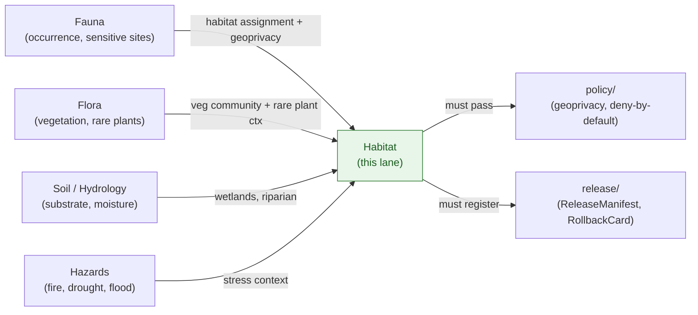
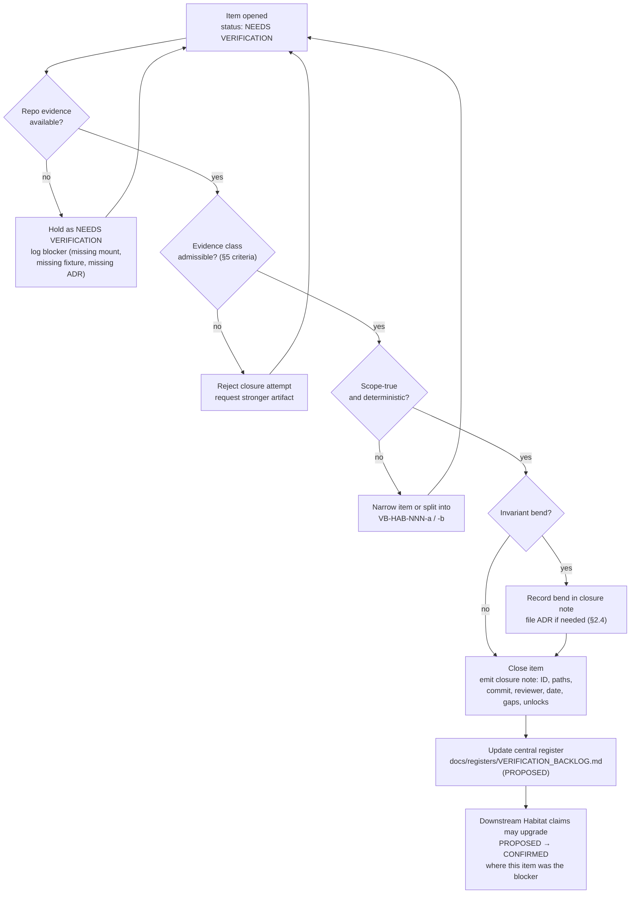

<!-- [KFM_META_BLOCK_V2]
doc_id: kfm://doc/domains/habitat/verification-backlog
title: Habitat Verification Backlog
type: standard
version: v1.1
status: draft
owners: <Habitat domain steward; Verification steward; Docs steward>  # NEEDS VERIFICATION
created: 2026-05-17
updated: 2026-06-05
policy_label: public
contract_version: "3.0.0"   # pinned per ai-build-operating-contract.md
related:
  - docs/domains/habitat/README.md                    # PROPOSED neighbor
  - docs/domains/habitat/SOURCES.md                   # source index (VB-HAB-007/009 feeders)
  - docs/domains/habitat/SOURCE_FAMILIES.md           # per-family dossiers
  - docs/domains/habitat/SOURCE_REGISTRY.md           # admission control surface
  - docs/domains/habitat/SENSITIVITY.md               # VB-HAB-002 posture
  - docs/domains/habitat/REASON_CODES.md              # finite outcomes / reason codes
  - docs/domains/habitat/RELEASE_INDEX.md             # VB-HAB-012 rollback/release
  - docs/runbooks/habitat/SOURCE_REFRESH_RUNBOOK.md   # operational refresh
  - docs/registers/VERIFICATION_BACKLOG.md            # PROPOSED central register
  - docs/registers/DRIFT_REGISTER.md                  # PROPOSED central register
  - docs/doctrine/directory-rules.md                  # CONFIRMED doctrine
  - docs/adr/                                          # PROPOSED ADR home
  - docs/domains/fauna/VERIFICATION_BACKLOG.md         # PROPOSED sibling (cross-domain joins)
  - ai-build-operating-contract.md
tags: [kfm, habitat, verification, backlog, governance, needs-verification]
notes:
  - "Per-domain backlog feeder for docs/registers/VERIFICATION_BACKLOG.md; placement PROPOSED."
  - "All implementation-layer claims labeled per <truth_labels>; no repo mounted this session."
  - "Owning items derived from Atlas v1.1 Ch. 6 §N (CONFIRMED) and extended from Atlas Ch. 24.12, Unified Manual §6.3, ENCY §7.4."
  - "Source-role placeholder in §7 is reproduced from Atlas §D as the thing to verify; the CONFIRMED canonical vocabulary is the 7-role enum (Atlas §24.1.1) with concrete assignments in SOURCES.md / SOURCE_FAMILIES.md. See VB-HAB-007 note."
  - "Feeds and is fed by the Habitat lane doc suite; VB items map to OQ-IDs tracked in those docs (see §3 cross-reference column). CONTRACT_VERSION = \"3.0.0\"."
[/KFM_META_BLOCK_V2] -->

# 🌿 Habitat Verification Backlog

> Domain-specific feeder for the central verification register, tracking items the Habitat lane must check against mounted-repo evidence before claims of compliance, enforcement, or readiness may be made.

  
  
  
  
  
  
  
  <!-- TODO Shields.io endpoints to be wired against CI once the central VERIFICATION_BACKLOG.md ingestion job exists. -->

**Status:** draft · **Owners:** *Habitat domain steward; Verification steward; Docs steward* (NEEDS VERIFICATION) · **Contract:** `CONTRACT_VERSION = "3.0.0"` · **Updated:** 2026-06-05

> [!IMPORTANT]
> This file is a **feeder register**, not an authority surface. Items here describe what must be checked against mounted-repo evidence — files, schemas, registry entries, tests, logs, emitted artifacts, review records, or release manifests — before any Habitat claim is upgraded from PROPOSED or NEEDS VERIFICATION to CONFIRMED. Closing an item requires a citable repo artifact, **not** a doc revision.

---

## Contents

- [1. Scope and intent](#1-scope-and-intent)
- [2. Authority, lineage, and feeder relationship](#2-authority-lineage-and-feeder-relationship)
- [3. Habitat verification item ledger](#3-habitat-verification-item-ledger)
- [4. Item detail — the four CONFIRMED items](#4-item-detail--the-four-confirmed-items)
- [5. Evidence acceptance criteria](#5-evidence-acceptance-criteria)
- [6. Cross-domain dependencies](#6-cross-domain-dependencies)
- [7. Source-family rights and freshness backlog](#7-source-family-rights-and-freshness-backlog)
- [8. Validator and fixture backlog](#8-validator-and-fixture-backlog)
- [9. Open-ADR crosswalk](#9-open-adr-crosswalk)
- [10. Workflow — how an item closes](#10-workflow--how-an-item-closes)
- [11. Update cadence and review](#11-update-cadence-and-review)
- [12. Open questions](#12-open-questions)
- [13. Changelog and definition of done](#13-changelog-and-definition-of-done)
- [14. Related docs](#14-related-docs)

---

## 1. Scope and intent

This document is the **Habitat domain's** verification backlog: a labeled, citable inventory of items whose resolution requires evidence that does **not** exist in any attached dossier and **cannot** be settled by argument or doctrine alone.

The backlog is governed by three rules:

1. **Doctrine is not proof.** Atlas, encyclopedia, and dossier statements about Habitat are CONFIRMED *as doctrine* and PROPOSED *as implementation*. Items here track the implementation half.
2. **Evidence must be admissible.** Per the KFM Evidence Rule, only mounted repo files, schemas, registry entries, tests, logs, emitted artifacts, review records, or release manifests close an item.
3. **Closure does not retroactively rewrite doctrine.** Closing a backlog item upgrades the implementation claim, not the doctrinal claim that motivated it.

This file does **not** decide:

- Whether a habitat object family *should* exist (governed by `contracts/`, `schemas/`, `policy/`).
- Where a habitat file *belongs* (governed by Directory Rules).
- Whether a habitat release *may* publish (governed by `release/` decisions and policy gates).

It records **what must be checked** before such decisions may treat a Habitat claim as CONFIRMED.

[Back to top ↑](#top)

---

## 2. Authority, lineage, and feeder relationship

> [!NOTE]
> **Placement is PROPOSED.** The canonical register is `docs/registers/VERIFICATION_BACKLOG.md` per the Whole-UI + Governed AI Expansion plan and Directory Rules §18. A per-domain feeder at `docs/domains/habitat/VERIFICATION_BACKLOG.md` is consistent with Directory Rules §3 (domain-as-segment under the `docs/` responsibility root) but is not itself doctrine. A per-root README or ADR-S clarifying feeder/central authority is recommended.

### 2.1 Authority class

| Field | Value |
|---|---|
| Authority class | **Feeder register** (not canonical authority) |
| Status | draft |
| Truth posture | cite-or-abstain |
| Parent register | `docs/registers/VERIFICATION_BACKLOG.md` (PROPOSED) |
| Owning lane | Habitat (Atlas v1.1 Ch. 6) |
| Conformance language | RFC 2119-style per Directory Rules §2.2 |
| Conflict rule | If this file disagrees with Atlas v1.1, **Atlas wins** and a `DRIFT_REGISTER.md` entry is filed per Directory Rules §2.5 |

### 2.2 Lineage of items

| Source | Citation | Contribution | Status |
|---|---|---|---|
| Atlas v1.1, Ch. 6 §N (Habitat — Verification backlog) | [DOM-HAB] [DOM-HF] [ENCY] | The four canonical items below | CONFIRMED as backlog |
| Atlas v1.1, Ch. 24.12 (Open-ADR Backlog) | [DIRRULES] [ENCY] | ADR-class crosswalk for habitat-touching decisions | CONFIRMED as register |
| Unified Implementation Architecture Build Manual §6.3 | [BLD-COMP] [DOM-HAB §§1-2] | Extended open verification items (schema home, source rights, model fitness, live permissions, MapLibre/Evidence Drawer impl) | CONFIRMED as register |
| Encyclopedia §7.4 (Habitat) and Appendix K | [ENCY] | Validator/feature/risk backlog rows | CONFIRMED as register |
| Whole-UI + Governed AI Expansion Report §11 | [UIAI] | Names `docs/registers/VERIFICATION_BACKLOG.md` as PROPOSED central home | PROPOSED |

### 2.3 Non-collapse rule

Per Atlas v1.1 front matter, registers and master atlases are **navigational aids**. EvidenceBundle and the governing dossiers remain authoritative. Nothing in this file lets a closed item substitute for evidence, policy, review state, source authority, or release state.

[Back to top ↑](#top)

---

## 3. Habitat verification item ledger

The four items below are the **CONFIRMED backlog** for Habitat per Atlas v1.1 Ch. 6 §N. Each item's status is **NEEDS VERIFICATION** by Atlas itself; the "evidence that would settle it" column is reproduced from the Atlas verbatim in normalized form. Items VB-HAB-005 through VB-HAB-012 are extended from the Unified Manual §6.3 and Encyclopedia §7.4 and are **NEEDS VERIFICATION** with the same evidence class. The **Tracked in** column links each item to the lane doc and open-question ID that already carries it, so closing a backlog item and resolving its sibling-doc OQ stay in sync.

| ID | Item to verify | Evidence class that would settle it | Source | Status | Severity | Tracked in |
|---|---|---|---|---|---|---|
| **VB-HAB-001** | Official critical habitat source descriptors exist and are admissible. | mounted repo files; schemas; registry entries; tests; logs; emitted artifacts; review records; release manifests | Atlas v1.1 Ch. 6 §N | NEEDS VERIFICATION | high | `SOURCES.md` OQ-HAB-SRC-01; `SOURCE_REGISTRY.md` OQ-HAB-SR-01 |
| **VB-HAB-002** | Sensitive occurrence policy and geoprivacy transforms are implemented and tested. | mounted repo files; schemas; registry entries; tests; logs; emitted artifacts; review records; release manifests | Atlas v1.1 Ch. 6 §N | NEEDS VERIFICATION | high | `SENSITIVITY.md` OQ-HAB-SEN-02; `SENSITIVITY_AND_GEOPRIVACY.md` OQ-HAB-SG-03 |
| **VB-HAB-003** | Model-card requirements for suitability products are defined and enforced. | mounted repo files; schemas; registry entries; tests; logs; emitted artifacts; review records; release manifests | Atlas v1.1 Ch. 6 §N | NEEDS VERIFICATION | high | `REASON_CODES.md` (`UNCERTAINTY_MISSING`) |
| **VB-HAB-004** | Habitat MapLibre overlay registry and Focus Mode behavior conform to map/UI doctrine. | mounted repo files; schemas; registry entries; tests; logs; emitted artifacts; review records; release manifests | Atlas v1.1 Ch. 6 §N | NEEDS VERIFICATION | medium | *(MAP_UI_CONTRACTS — PROPOSED)* |
| VB-HAB-005 | Existing Habitat files match the proposed responsibility-root layout. | mounted repo file inventory; per-root READMEs | Unified Manual §6.3 | NEEDS VERIFICATION | medium | HAB-V-009 (path-form, lane README) |
| VB-HAB-006 | Schema-home convention for Habitat DTOs (`schemas/contracts/v1/domains/habitat/...`) is the live authority. | accepted ADR-0001 or amendment; schema files in repo | Unified Manual §6.3; Directory Rules §2.4(3) | NEEDS VERIFICATION | high | ADR-0001 |
| VB-HAB-007 | Per-source rights and current terms recorded for each Habitat source family (see §7). | source descriptors with `license_spdx`, `rights`, `cadence`, `role`; rights review record | Atlas v1.1 Ch. 6 §D; ENCY Appendix J | NEEDS VERIFICATION | high | `SOURCES.md` OQ-HAB-SRC-02; `SOURCE_REGISTRY.md` OQ-HAB-SR-05 |
| VB-HAB-008 | Suitability-model fitness, training support, and uncertainty fields are recorded and tested. | model run receipts; uncertainty surface artifacts; validator runs | ENCY §7.4 §§D, G | NEEDS VERIFICATION | medium | `SOURCE_FAMILIES.md` (GAP/LANDFIRE) |
| VB-HAB-009 | Live data permissions (USFWS ECOS, KDWP, NatureServe, GBIF, etc.) are reviewed before any non-fixture connector is activated. | SourceActivationDecision records; rights review notes | Atlas v1.1 Ch. 6 §D; ENCY App. J | NEEDS VERIFICATION | high | `SOURCE_REGISTRY.md` §9 (admission lifecycle) |
| VB-HAB-010 | Habitat + Fauna thin-slice fixture exists and exercises evidence, policy, release, drawer, and Focus controls end-to-end. | fixture files; test runs; layer manifest; release dry-run | DOM-HF §§1-12 | NEEDS VERIFICATION | high | `RELEASE_INDEX.md` §5 (thin-slice) |
| VB-HAB-011 | Habitat lifecycle gates (RAW → WORK/QUARANTINE → PROCESSED → CATALOG/TRIPLET → PUBLISHED) are enforced as governed state transitions, not file moves. | pipeline runs; promotion decisions; gate logs | Atlas v1.1 Ch. 6 §H; Directory Rules §0 | NEEDS VERIFICATION | high | `RELEASE_INDEX.md` §3; `SOURCE_REFRESH_RUNBOOK.md` §3 |
| VB-HAB-012 | Rollback drill for the Habitat lane has executed at least once. | RollbackCard; release manifest restore record; rollback receipt | ENCY §7.4 §M; Atlas Ch. 6 §M | NEEDS VERIFICATION | medium | `RELEASE_INDEX.md` §8; `SOURCE_REFRESH_RUNBOOK.md` §9 |

> [!CAUTION]
> Items in this ledger are **not** invitations to claim implementation. Until each item's evidence class is produced and cited, the corresponding Habitat capability remains **PROPOSED** in any other document, README, ADR, or release surface. Doc-only resolution is not closure.

[Back to top ↑](#top)

---

## 4. Item detail — the four CONFIRMED items

### 4.1 VB-HAB-001 — Critical habitat source descriptors

**Doctrine basis.** Atlas v1.1 Ch. 6 §D lists USFWS ECOS / critical habitat services as a source whose role assignment, rights, and freshness require verification. Atlas §I states that **Regulatory critical habitat, modeled habitat, species range, occurrence points, and landscape context must not be flattened**; sensitive occurrence details deny by default.

**What must be verified.**

- Each Habitat source family carries a SourceDescriptor with `source_id`, `source_family`, `endpoint`, `rights`, `cadence`, `role`, `license_spdx`, `sensitivity`, and `authoritative_scope` populated.
- The `role` field uses the CONFIRMED 7-role enum (Atlas §24.1.1) and distinguishes **regulatory** authority (USFWS ECOS critical habitat) from **observed** (GBIF/iNat occurrences), **modeled** (GAP/LANDFIRE-derived suitability), and **administrative** (PAD-US stewardship). *(See VB-HAB-007 note on the §D placeholder vs the canonical enum.)*
- A no-network fixture exercises a regulatory-authority descriptor end-to-end.

**Failure consequence.** Until this item closes, every Habitat claim involving "critical habitat," "designated habitat," "protected habitat," or any regulatory-authority phrasing is **PROPOSED** in user-facing surfaces and **must abstain** in Focus Mode.

### 4.2 VB-HAB-002 — Sensitive occurrence policy and geoprivacy transforms

**Doctrine basis.** Atlas v1.1 Ch. 6 §I: sensitive occurrence details deny by default. The Atlas §20.5 register confirms the Fauna allowance is *geoprivacy + Redaction Receipt + public-safe derivative*; transform types include suppress, generalize to grid, generalize to watershed or county, buffer, jitter (with constraints), delayed publication, or steward-only exact access — each emitting a transform receipt stating input class, output class, reason, policy, reviewer, and residual risk.

**What must be verified.**

- A `policy/domains/habitat/` (or inherited `policy/sensitivity/fauna/`) bundle exists and encodes deny-by-default for sensitive occurrence-derived habitat outputs. *(Note the policy-home question — Atlas §24.13 lists no `policy/sensitivity/habitat/` root; tracked as OQ-HAB-SEN-01.)*
- Each transform type has a fixture and a receipt schema (Redaction Receipt / geoprivacy transform receipt).
- A negative fixture proves **style-only hiding is not accepted** (operating contract §22.3; MapLibre `ML-Q-030`).
- The Habitat-Fauna thin slice exercises at least one transform end-to-end.

**Failure consequence.** Until this item closes, no occurrence-linked habitat output, no Habitat+Fauna join product, and no Habitat Focus Mode answer that touches sensitive taxa may be published.

### 4.3 VB-HAB-003 — Model-card requirements for suitability products

**Doctrine basis.** Atlas v1.1 Ch. 6 §E lists `SuitabilityModel` and `Model Run Receipt` as owned object families. ENCY §7.4 §D requires "model version, training/source support, spatial resolution, support, uncertainty and release time" with **model vs observation labels visible**. Suitability surfaces are derivatives, not authoritative root claims.

**What must be verified.**

- A model-card schema or contract for `SuitabilityModel` and `ModelRunReceipt` exists in the canonical schema home.
- Required fields are present: model_id, model_version, training data references, predictor list, spatial resolution, temporal scope, performance metrics, uncertainty representation, fitness statement, known limitations, source role labels, review state.
- An `UncertaintySurface` artifact accompanies each released suitability product (else `UNCERTAINTY_MISSING` per `REASON_CODES.md`).
- Validator rejects suitability outputs lacking a resolvable model card.
- Evidence Drawer surfaces the model card and uncertainty for any clicked suitability feature.

**Failure consequence.** Until this item closes, no suitability surface may be published, exported, screenshotted, or referenced in Focus Mode as if it were observation.

### 4.4 VB-HAB-004 — Habitat MapLibre overlay registry and Focus behavior

**Doctrine basis.** Atlas v1.1 Ch. 6 §G lists Habitat viewing products: habitat overlay registry, source-role badges, critical habitat view, modeled habitat view, occurrence summary view, connectivity/corridor view, and Evidence Drawer Habitat panel. Master MapLibre doctrine requires `LayerManifest`, `StyleManifest`, `TileArtifactManifest`, and `MapReleaseManifest` with `release_state` gating and PMTiles attribute trimming for protection layers.

**What must be verified.**

- A Habitat overlay registry / LayerManifest entry set exists in the canonical home with `layer_id`, `source_id`, catalog refs, `policy_label`, `release_state`, tile/style dependency, attribution.
- PMTiles habitat protection artifacts trim attributes to an explicit include set (Master MapLibre `ML-E-061`).
- Click-to-Evidence-Drawer resolves to a Habitat EvidenceBundle projection; no popup substitutes for the drawer.
- Focus Mode for Habitat returns finite outcomes (ANSWER / ABSTAIN / DENY / ERROR) with `MapContextEnvelope`, `EvidenceBundle` refs, and an `AIReceipt`.
- A negative fixture proves no public route reads RAW/WORK/QUARANTINE or canonical stores directly.

**Failure consequence.** Until this item closes, the Habitat map shell, drawer, and Focus surfaces are PROPOSED in any release-readiness, demo, or audit claim.

[Back to top ↑](#top)

---

## 5. Evidence acceptance criteria

A backlog item is **closable** only when the evidence presented satisfies all of the following:

> [!NOTE]
> The criteria below mirror the KFM **Evidence Rule** and **Verification Threshold**. They are intentionally strict — closure is a state transition, not a vibe.

| Criterion | What it means | Why it is required |
|---|---|---|
| **Admissible source** | The evidence is a mounted repo file, schema, registry entry, test, log, emitted artifact, review record, or release manifest. | Atlas v1.1 Ch. 6 §N defines the admissible class. |
| **Citable path** | The evidence is referenced by repo path and commit, not by recollection or summary. | Memory is not evidence (operating law). |
| **Deterministic recheck** | A future reviewer can re-execute the check (run the validator, replay the fixture, inspect the artifact). | Verification must be reproducible. |
| **Scope-true** | The evidence covers the item's full scope, not a near-neighbor. | Inferring from one directory to another is forbidden. |
| **Doctrinally aligned** | The evidence does not bend a core invariant. If it does, the bend is acknowledged in the closure note. | Invariant preservation is the default posture. |

A closure note **MUST** record: item ID; evidence path(s); commit (or release manifest); reviewer; date; residual gaps if any; downstream claims unlocked.

[Back to top ↑](#top)

---

## 6. Cross-domain dependencies

Habitat verification is partially gated by sibling domains. The relationships below are CONFIRMED in Atlas v1.1 Ch. 6 §F; the implementation status is PROPOSED.

| Cross-dependency | Habitat item it blocks | Sibling backlog reference |
|---|---|---|
| Fauna sensitive-site classification (nests, dens, roosts, hibernacula, spawning sites) | VB-HAB-002, VB-HAB-010 | `docs/domains/fauna/VERIFICATION_BACKLOG.md` *(PROPOSED)* |
| Fauna taxonomic identity resolution | VB-HAB-010 | `docs/domains/fauna/VERIFICATION_BACKLOG.md` *(PROPOSED)* |
| Flora rare-plant geoprivacy posture | VB-HAB-002 *(joins only)* | `docs/domains/flora/VERIFICATION_BACKLOG.md` *(PROPOSED)* |
| Soil / Hydrology substrate joins | VB-HAB-005, VB-HAB-008 | per-domain feeders *(PROPOSED)* |
| Central schema-home ADR (ADR-0001) | VB-HAB-006 | `docs/adr/ADR-0001-*.md` *(PROPOSED)* |
| Central rights / sensitivity tier scheme | VB-HAB-002, VB-HAB-007, VB-HAB-009 | Atlas Ch. 24.5; ADR-S-05 *(PROPOSED)* |

[Back to top ↑](#top)

---

## 7. Source-family rights and freshness backlog

Per Atlas v1.1 Ch. 6 §D, each Habitat source family requires per-source rights verification before any non-fixture connector is activated (VB-HAB-007, VB-HAB-009). The table reproduces the Atlas source-family list as a verification surface; **freshness, role assignment, and license terms are NEEDS VERIFICATION for every row.**

> [!NOTE]
> **On the "Atlas role" column.** The phrase "authority / observation / context / model as source role requires" is the Atlas §D **placeholder** — it is reproduced here verbatim because resolving it *is* the verification task. The CONFIRMED canonical vocabulary is the 7-role enum (Atlas §24.1.1 / ADR-S-04): `observed | regulatory | modeled | aggregate | administrative | candidate | synthetic`. The concrete per-family assignments (USFWS = `regulatory`, NLCD/NWI/occurrence = `observed`, GAP/LANDFIRE = `modeled`, NatureServe = `aggregate`, PAD-US = `administrative`) now live in [`SOURCES.md`](SOURCES.md) §4 and [`SOURCE_FAMILIES.md`](SOURCE_FAMILIES.md); VB-HAB-007 closes when each is confirmed against the admitted descriptor. *(Note a known cross-doc divergence on NWI/NLCD multi-role labels — tracked as OQ-HAB-SR-14.)*

<b>Source-family verification rows (8 families)</b>

| # | Source family | Atlas §D role placeholder | Canonical role (PROPOSED) | Rights / sensitivity | Status |
|---|---|---|---|---|---|
| 7.1 | USFWS ECOS / critical habitat services | "as source role requires" | `regulatory` | rights & terms NEEDS VERIFICATION; sensitive joins fail closed | NEEDS VERIFICATION |
| 7.2 | KDWP state review context | "as source role requires" | `regulatory` / `observed` (per product) | rights & terms NEEDS VERIFICATION; sensitive joins fail closed | NEEDS VERIFICATION |
| 7.3 | NLCD land cover | "as source role requires" | `observed` | rights & terms NEEDS VERIFICATION; sensitive joins fail closed | NEEDS VERIFICATION |
| 7.4 | NWI wetlands | "as source role requires" | `observed` *(regulatory where designated — OQ-HAB-SR-14)* | rights & terms NEEDS VERIFICATION; sensitive joins fail closed | NEEDS VERIFICATION |
| 7.5 | GAP / LANDFIRE | "as source role requires" | `modeled` | rights & terms NEEDS VERIFICATION; sensitive joins fail closed | NEEDS VERIFICATION |
| 7.6 | NatureServe and controlled biodiversity sources | "as source role requires" | `aggregate` | rights & terms NEEDS VERIFICATION; **access-gated**; sensitive joins fail closed | NEEDS VERIFICATION |
| 7.7 | GBIF / iNaturalist / iDigBio occurrence inputs | "as source role requires" | `observed` | rights & terms NEEDS VERIFICATION; **geoprivacy-bound**; sensitive joins fail closed | NEEDS VERIFICATION |
| 7.8 | PAD-US stewardship context | "as source role requires" | `administrative` | rights & terms NEEDS VERIFICATION; sensitive joins fail closed | NEEDS VERIFICATION |

**Closure note.** Each row closes when a SourceDescriptor exists in the registry with `license_spdx`, current `rights` text reference, observed `cadence`, assigned `role` (from the 7-role enum), and `sensitivity` label, **and** a SourceActivationDecision is recorded if the source is brought online beyond fixtures.

> [!WARNING]
> No Habitat source family above may be activated for live ingest until VB-HAB-007 and VB-HAB-009 have closed for that specific family. Activation without a recorded SourceActivationDecision is a Directory Rules anti-pattern (connector-publishes / undocumented activation).

[Back to top ↑](#top)

---

## 8. Validator and fixture backlog

Atlas v1.1 Ch. 6 §K lists six PROPOSED validators/fixture families for Habitat. Each is **NEEDS VERIFICATION** until it appears in the canonical tests/fixtures home and runs in CI.

<b>Validator and fixture rows (6 + extensions)</b>

| # | Validator / fixture | Atlas status | Closure evidence | Status |
|---|---|---|---|---|
| 8.1 | Source descriptor tests | PROPOSED | tests/domains/habitat/test_source_descriptors.* with pass/fail rows | NEEDS VERIFICATION |
| 8.2 | Critical habitat source-role tests | PROPOSED | role-mismatch denial fixture; positive role-confirm fixture | NEEDS VERIFICATION |
| 8.3 | Modeled-as-critical denial tests | PROPOSED | fixture where modeled output is mislabeled as regulatory; expected DENY | NEEDS VERIFICATION |
| 8.4 | Occurrence geoprivacy tests | PROPOSED | input class → output class transform; receipt validation | NEEDS VERIFICATION |
| 8.5 | Catalog closure tests | PROPOSED | EvidenceBundle / EvidenceRef closure validator runs | NEEDS VERIFICATION |
| 8.6 | Habitat + Fauna thin-slice fixtures | PROPOSED | end-to-end fixture proving one published occurrence habitat assignment | NEEDS VERIFICATION |
| 8.7 *(ext.)* | Style-only-hiding denial fixture | PROPOSED *(MapLibre doctrine)* | negative fixture; expected DENY | NEEDS VERIFICATION |
| 8.8 *(ext.)* | Click-to-Evidence-Drawer for Habitat layers | PROPOSED *(MapLibre doctrine)* | e2e click resolution test | NEEDS VERIFICATION |
| 8.9 *(ext.)* | Rollback drill for a Habitat release | PROPOSED *(ENCY §M)* | RollbackCard run + restored prior ReleaseManifest | NEEDS VERIFICATION |

[Back to top ↑](#top)

---

## 9. Open-ADR crosswalk

Several Habitat verification items are **ADR-class** per Directory Rules §2.4 and Atlas v1.1 Ch. 24.12. The crosswalk below routes habitat items to their Open-ADR Backlog (`ADR-S-*`) anchors. ADR-S identifiers are CONFIRMED in Atlas Ch. 24.12; their resolution status is NEEDS VERIFICATION.

| Habitat item | Open-ADR anchor (Atlas Ch. 24.12) | Why ADR-class |
|---|---|---|
| VB-HAB-006 (schema home) | **ADR-S-01** — Schema home: `schemas/contracts/v1/…` (confirm or amend ADR-0001) | Schema-home rule is explicitly ADR-required per Directory Rules §2.4(3) |
| VB-HAB-001 (source descriptors) | **ADR-S-04** — Source-role vocabulary v1 | Source-role anti-collapse is doctrine-significant; vocabulary stability matters |
| VB-HAB-002 (sensitive occurrence) | **ADR-S-05** — Sensitivity tier scheme (T0–T4) | Adoption-as-canonical is ADR-class |
| VB-HAB-002 / VB-HAB-007 (cross-lane joins) | **ADR-S-14** — Cross-lane join policy | Cross-lane joins are inference-risk multipliers |
| VB-HAB-009 (live activation) | **ADR-S-12** — Connector cadence and quarantine recovery | Connector behavior governs RAW admission |
| VB-HAB-003 (model cards) | *No direct ADR-S anchor yet* | Likely PROPOSED ADR: model-card schema home and required fields |
| VB-HAB-004 (overlay registry) | *No direct ADR-S anchor yet* | Likely PROPOSED ADR: LayerManifest / overlay-registry home for domain lanes |

> [!TIP]
> When proposing a new ADR derived from a habitat item, cite both the Atlas v1.1 Ch. 24.12 anchor (if present) and the specific Habitat backlog ID (`VB-HAB-NNN`). The ADR closes the doctrinal question; the backlog item closes the implementation check. They are **not** the same closure.

[Back to top ↑](#top)

---

## 10. Workflow — how an item closes

**Closure does not cascade automatically.** A closed item only unlocks the *specific* downstream claim it was the gate for. Other PROPOSED claims remain PROPOSED until their own items close.

[Back to top ↑](#top)

---

## 11. Update cadence and review

| Aspect | Default |
|---|---|
| Review cadence | Per Directory Rules §15: flag for review if `Last reviewed` is older than 6 months |
| Reviewers | Habitat domain steward; Verification steward; Docs steward — **NEEDS VERIFICATION** in CODEOWNERS |
| Add-item path | PR adds row to §3 ledger with citation to Atlas / Unified Manual / ENCY entry; ID assigned `VB-HAB-NNN` |
| Close-item path | PR updates row to `CLOSED` and appends a closure note in the change description; central register synced |
| Reopen rule | If evidence becomes stale, contradicted, or rolled back, the item reopens with a `reopen note` citing the trigger |
| Drift relationship | Conflicts with Atlas v1.1 are filed to `docs/registers/DRIFT_REGISTER.md` per Directory Rules §2.5; **this file does not resolve conflicts on its own** |

[Back to top ↑](#top)

---

## 12. Open questions

These are unresolved questions about this file itself — not Habitat backlog items, but governance questions about the backlog mechanism.

- **OPEN — feeder/central authority.** Is `docs/domains/habitat/VERIFICATION_BACKLOG.md` a feeder to `docs/registers/VERIFICATION_BACKLOG.md`, or is the per-domain backlog absorbed entirely into the central file? PROPOSED resolution: per-domain feeder; central register ingests via a tooling job. Needs ADR-S confirmation.
- **OPEN — ID stability.** Should `VB-HAB-NNN` identifiers be repo-globally unique, or scoped to the domain feeder? PROPOSED: domain-scoped with `VB-<DOMAIN>-NNN` prefix; central register joins on the full ID.
- **OPEN — closure-note schema.** Should closure notes be free-text Markdown, a YAML front-matter block, or a structured object family (e.g., a `VerificationClosureReceipt` in `contracts/`)? PROPOSED: Markdown short-term, schema upgrade after ADR.
- **OPEN — VB↔OQ sync.** Several VB items now mirror open-question IDs in the lane docs (§3 "Tracked in" column). Should the feeder be the canonical owner of these, with the lane-doc OQs as back-references, or vice-versa? PROPOSED: VB owns implementation-closure; OQ owns doctrinal/placement resolution; they cross-link.
- **NEEDS VERIFICATION — CODEOWNERS for this file.** Habitat domain steward and Verification steward are PROPOSED owners; actual CODEOWNERS assignment requires repo inspection.
- **NEEDS VERIFICATION — anchor stability.** Mini-TOC anchors in this file are PROPOSED and may shift if the section order is revised; downstream linkers should pin to commit-hash references rather than headers until the doc is published.

[Back to top ↑](#top)

---

## 13. Changelog and definition of done

### 13.1 Changelog v1 → v1.1

| Change | Type (per contract §37) | Reason |
|---|---|---|
| Pinned `CONTRACT_VERSION = "3.0.0"`; fixed `doc_id` (`kfm://doc/<uuid-placeholder>` → `kfm://doc/domains/habitat/verification-backlog`). | housekeeping | Required for doctrine-adjacent docs; descriptive slug pending UUID. |
| Added a "Tracked in" column to the §3 ledger linking each VB item to the lane doc + open-question ID that carries it. | gap closure | Keeps backlog closure and sibling-doc OQ resolution in sync across the suite. |
| Added a §7 note distinguishing the Atlas §D role **placeholder** (the thing to verify) from the CONFIRMED 7-role enum, and a "Canonical role (PROPOSED)" column with concrete assignments. | clarification | Aligns VB-HAB-007 with `SOURCES.md` / `SOURCE_FAMILIES.md`; surfaces the NWI/NLCD divergence (OQ-HAB-SR-14). |
| Extended the §9 ADR crosswalk with ADR-S-14 (cross-lane join) and ADR-S-12 (connector cadence). | clarification | Both are habitat-touching ADR-class decisions named in Atlas Ch. 24.12. |
| Fixed Mermaid node labels: replaced `\n` with ` ` and quoted labels containing `/` and `()`. | housekeeping | `\n` does not render as a line break in Mermaid; unquoted `/`/`()` can break parsing. |
| Wired `related` and §14 to the now-existing lane docs (`SOURCES.md`, `SOURCE_FAMILIES.md`, `SOURCE_REGISTRY.md`, `SENSITIVITY.md`, `REASON_CODES.md`, `RELEASE_INDEX.md`, refresh runbook). | reconciliation | The feeder should reference the surfaces whose claims it gates. |
| Added §13 changelog + definition of done; added an OPEN VB↔OQ-sync question to §12. | new | Companion-section pattern; governs the new cross-reference mechanism. |
| Refreshed `updated`/badges to 2026-06-05; item-count badge made concrete (12 core + 9 ext). | housekeeping | Accuracy. |
| Bumped version v1 → v1.1. | housekeeping | MINOR bump: reconciliation + gap closure, no item added/removed from the CONFIRMED §N set. |

> **Backward compatibility.** All twelve ledger items and their IDs are unchanged; the §N CONFIRMED set (VB-HAB-001…004) is untouched. The §3 table gained a column; §12 gained one question; §13 is new and the old §13 "Related docs" is now §14. Inbound links to `#13-related-docs` should be repointed to `#14-related-docs`.

### 13.2 Definition of done

This backlog is done enough to enter the repository when:

- the feeder/central authority question (§12) is resolved or the feeder relationship is ratified by ADR-S;
- it is placed per Directory Rules §3/§12, with the placement question logged in `docs/registers/DRIFT_REGISTER.md`;
- the habitat domain steward, verification steward, and docs steward are confirmed in CODEOWNERS;
- every VB item's "Tracked in" sibling-doc OQ exists and cross-links back;
- it is linked from `docs/domains/habitat/README.md` and the central `VERIFICATION_BACKLOG.md`;
- it remains a feeder — confirmed at review that no item is marked CLOSED without a citable repo artifact;
- the `GENERATED_RECEIPT.json` planned in the PR is wired into CI with `contract_version: "3.0.0"`;
- future changes follow the operating contract's §37 lifecycle.

[Back to top ↑](#top)

---

## 14. Related docs

- `docs/domains/habitat/README.md` — PROPOSED domain README (Atlas v1.1 Ch. 6 distilled).
- `docs/domains/habitat/SOURCES.md` — source index; carries VB-HAB-007/009 family rows and OQ-HAB-SRC-*.
- `docs/domains/habitat/SOURCE_FAMILIES.md` — per-family dossiers (role, descriptor fields, diff strategy).
- `docs/domains/habitat/SOURCE_REGISTRY.md` — admission control surface; `SourceActivationDecision` (VB-HAB-009).
- `docs/domains/habitat/SENSITIVITY.md` — sensitivity posture (VB-HAB-002).
- `docs/domains/habitat/REASON_CODES.md` — finite outcomes / reason codes (e.g., `UNCERTAINTY_MISSING` for VB-HAB-003).
- `docs/domains/habitat/RELEASE_INDEX.md` — release/rollback (VB-HAB-010/011/012).
- `docs/runbooks/habitat/SOURCE_REFRESH_RUNBOOK.md` — operational refresh; lifecycle + rollback drill.
- `docs/registers/VERIFICATION_BACKLOG.md` — PROPOSED central register; this file feeds it.
- `docs/registers/DRIFT_REGISTER.md` — PROPOSED central register; conflicts with Atlas v1.1 go here.
- `docs/doctrine/directory-rules.md` — placement and lifecycle doctrine; §§2.4, 3, 15, 18 are most relevant.
- `docs/domains/fauna/VERIFICATION_BACKLOG.md` — PROPOSED sibling feeder; cross-domain joins depend on it.
- `docs/atlases/KFM_Domains_Culmination_Atlas_v1_1.pdf` — source doctrine, Ch. 6 §N (this file's CONFIRMED backlog rows) and Ch. 24.12 (ADR-S crosswalk).
- `docs/adr/` — PROPOSED ADR home; ADR-S-01, ADR-S-04, ADR-S-05, ADR-S-12, ADR-S-14 intersect with Habitat items.
- `contracts/domains/habitat/` and `schemas/contracts/v1/domains/habitat/` — PROPOSED schema and contract homes.
- `tests/domains/habitat/` and `fixtures/domains/habitat/` — PROPOSED test and fixture homes.
- `ai-build-operating-contract.md` — canonical operating contract (`CONTRACT_VERSION = "3.0.0"`).

<!-- TODO Linkability: confirm exact paths after repo mount; replace PROPOSED paths with verified ones. -->

---

**Last reviewed:** 2026-06-05 · **Contract:** CONTRACT_VERSION = "3.0.0" · **Owners:** *Habitat domain steward; Verification steward; Docs steward* (NEEDS VERIFICATION) · [Back to top ↑](#top)
