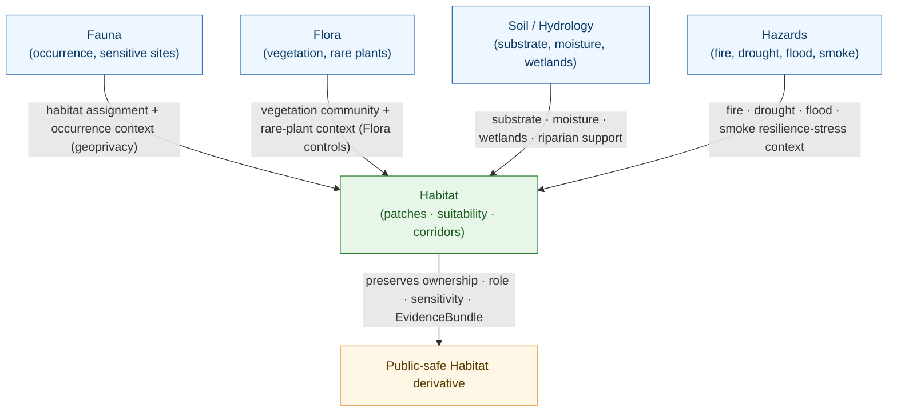

<!-- [KFM_META_BLOCK_V2]
doc_id: kfm://doc/domains/habitat/cross-lane-relations
title: Habitat Domain — Cross-Lane Relations
type: standard
version: v1
status: draft
owners: <habitat-domain-steward>, <fauna-domain-steward>, <policy-steward>, <docs-steward>   # placeholders pending owner-registry verification
created: 2026-06-05
updated: 2026-06-05
policy_label: public
contract_version: "3.0.0"   # pinned per ai-build-operating-contract.md
related:
  - docs/domains/habitat/README.md
  - docs/domains/habitat/SENSITIVITY.md
  - docs/domains/habitat/SOURCE_FAMILIES.md
  - docs/domains/habitat/REASON_CODES.md
  - docs/domains/habitat/RELEASE_INDEX.md
  - docs/domains/fauna/README.md
  - docs/domains/flora/README.md
  - docs/doctrine/directory-rules.md
  - docs/standards/PROV.md
  - ai-build-operating-contract.md
tags: [kfm, domain:habitat, cross-lane, relations, joins, ownership, sensitivity, governance]
notes:
  - "FILENAME NOTE: requested as docs/domains/habitat/cross-domain.md (lowercase-hyphenated). Authored at docs/domains/habitat/CROSS_LANE_RELATIONS.md to match the lane's UPPERCASE_WITH_UNDERSCORES convention and the domain-suite CROSS_LANE_RELATIONS member name. Casing/naming is a low-stakes drift item — tracked as OQ-HAB-XL-01 — not a placement-root conflict."
  - "Built on the CONFIRMED Habitat §F cross-lane relations table (Fauna, Flora, Soil/Hydrology, Hazards) and the universal constraint: every relation must preserve ownership, source role, sensitivity, and EvidenceBundle support."
  - "Habitat OWNS habitat patches, ecological systems, suitability, connectivity, corridors, restoration opportunity, stewardship zones. It does NOT own occurrence truth (Fauna), plant taxonomy (Flora), or Soil/Hydrology/Hazards truth."
  - "Cross-lane joins are inference-risk multipliers (ADR-S-14); sensitive joins fail closed. No exact coordinates or restricted-source fields appear."
  - "CONTRACT_VERSION = \"3.0.0\""
[/KFM_META_BLOCK_V2] -->

# 🌿 Habitat Domain — Cross-Lane Relations

> How the Habitat lane joins to its neighbors without absorbing their truth. Habitat is a **derivative, integrative** lane — it consumes occurrence, vegetation, substrate, and stress context from other domains under governed joins. This document states which relations exist, what each preserves, and where each fails closed.

  <b>Habitat integrates; it does not own the inputs · Ownership preserved · Source role preserved · Sensitive joins fail closed</b>

<!-- TODO: replace static badges with CI-driven Shields endpoints once owners + join policy are verified (NEEDS VERIFICATION). -->

**Status:** draft &middot; **Owners:** habitat steward · fauna steward · policy steward · docs steward *(placeholders)* &middot; **Contract:** `CONTRACT_VERSION = "3.0.0"` &middot; **Last updated:** 2026-06-05

> [!NOTE]
> **Filename.** This was requested as `cross-domain.md`; it is authored at `CROSS_LANE_RELATIONS.md` to match the lane's `UPPERCASE_WITH_UNDERSCORES` convention and the domain-suite member name. The casing/naming difference is a low-stakes drift item (OQ-HAB-XL-01), not a responsibility-root conflict — either filename lands in the same place under `docs/domains/habitat/`.

---

## Contents

1. [Purpose & scope](#1-purpose--scope)
2. [Ownership boundary](#2-ownership-boundary)
3. [The universal join constraint](#3-the-universal-join-constraint)
4. [Cross-lane relation map](#4-cross-lane-relation-map)
5. [Relation — Habitat × Fauna](#5-relation--habitat--fauna)
6. [Relation — Habitat × Flora](#6-relation--habitat--flora)
7. [Relation — Habitat × Soil / Hydrology](#7-relation--habitat--soil--hydrology)
8. [Relation — Habitat × Hazards](#8-relation--habitat--hazards)
9. [Join risk classes & steward review](#9-join-risk-classes--steward-review)
10. [Failure handling & reason codes](#10-failure-handling--reason-codes)
11. [Open questions register](#11-open-questions-register)
12. [Open verification backlog](#12-open-verification-backlog)
13. [Changelog & definition of done](#13-changelog--definition-of-done)
14. [Related docs](#14-related-docs)

---

## 1. Purpose & scope

Habitat is, by design, an **integrative** lane: a habitat patch, a suitability surface, a corridor, or a restoration opportunity is built by joining land cover, ecological systems, occurrence context, vegetation, substrate, and stress signals. Almost none of those inputs are Habitat's own truth. This document governs the seam — which lanes Habitat joins to, what each join must preserve, and where each fails closed.

The four relations below are **CONFIRMED** in the Habitat dossier §F. Each carries the same universal constraint (§3). The implementation of each join is **PROPOSED** pending the cross-lane join policy (ADR-S-14) and mounted-repo evidence.

> [!IMPORTANT]
> A cross-lane join never transfers ownership. When Habitat joins to a Fauna occurrence, Fauna still owns the occurrence; Habitat owns only the *assignment* it derives. The join preserves the source lane's ownership, source role, sensitivity, and `EvidenceBundle` support. **(CONFIRMED — Habitat dossier §F constraint.)**

[⬆ back to top](#top)

---

## 2. Ownership boundary

What Habitat owns, and what it only consumes. **(CONFIRMED — Habitat dossier §B; §24.13 crosswalk.)**

| Habitat OWNS | Habitat CONSUMES (does not own) |
|---|---|
| HabitatPatch, LandCoverObservation, EcologicalSystem | Occurrence truth — **Fauna** owns it |
| Habitat Quality Score, SuitabilityModel, Model Run Receipt, UncertaintySurface | Plant taxonomy & rare-plant records — **Flora** owns them |
| ConnectivityEdge, Corridor, Restoration Opportunity | Substrate, moisture, wetlands, riparian — **Soil / Hydrology** own them |
| StewardshipZone | Fire/drought/flood/smoke stress — **Hazards** owns it |

> [!CAUTION]
> The defining anti-pattern of an integrative lane is **truth absorption** — publishing a consumed input as if Habitat originated it. A Fauna occurrence surfaced through a Habitat join is still Fauna's, still under Fauna's geoprivacy, still cited to Fauna. Habitat never re-labels a consumed input as its own observation. **(CONFIRMED — source-role anti-collapse, Atlas §24.1.2; ownership preservation, dossier §F.)**

[⬆ back to top](#top)

---

## 3. The universal join constraint

Every Habitat cross-lane relation, without exception, must preserve four things. This is the CONFIRMED dossier §F constraint, stated once and applied to all four relations below.

| Must preserve | What it means for a Habitat join |
|---|---|
| **Ownership** | The source lane remains the owner of its records; Habitat owns only the derived assignment/score/edge. |
| **Source role** | The input's role (`observed` / `regulatory` / `modeled` / `aggregate` / `administrative`) is carried through; a regulatory critical-habitat layer joined into a suitability model is never re-cast as `observed`. |
| **Sensitivity** | The join product inherits the **maximum** (most restrictive) sensitivity of its inputs, and may exceed it if the combination creates new exposure. Sensitive joins fail closed. |
| **EvidenceBundle support** | The join resolves `EvidenceRef → EvidenceBundle` for every input; an unresolved input blocks the join. |

> [!IMPORTANT]
> **Sensitivity is evaluated on the output, not the inputs.** A join of two individually-public inputs can still produce a restricted surface (e.g., a density map that reveals a nesting concentration). The validator evaluates the produced join, not the safety of its parts. **(CONFIRMED — Atlas §24.5.2; cross-lane joins are inference-risk multipliers, ADR-S-14.)**

[⬆ back to top](#top)

---

## 4. Cross-lane relation map

*Diagram status:* **CONFIRMED** for the four relations and the universal constraint (dossier §F). **PROPOSED** for the operational join mechanics pending ADR-S-14.

[⬆ back to top](#top)

---

## 5. Relation — Habitat × Fauna

- **Relation (CONFIRMED §F).** Habitat assignment and occurrence context, with geoprivacy.
- **Direction.** Bidirectional: Fauna provides occurrence/sensitive-site context to Habitat; Fauna consumes *derived habitat assignment and seasonal support* from Habitat (Fauna dossier §F).
- **Habitat owns.** The derived assignment (which patch/system a taxon is associated with), not the occurrence.
- **Fauna owns.** Occurrence Evidence, Occurrence Restricted/Public, SensitiveSite, RangePolygon, Redaction Receipt.
- **Sensitivity.** **Highest-risk relation in the lane.** Sensitive occurrences (nests, dens, roosts, hibernacula, spawning) default to **T4**; the join reaches **T1** only via geoprivacy generalization + `RedactionReceipt` + `ReviewRecord` + `PolicyDecision`. Habitat never publishes finer than the generalized Fauna product.
- **Fails closed when.** Rights/sensitivity unresolved; precision below threshold; the output re-concentrates a protected location (`JOIN_SENSITIVE_OCCURRENCE`).
- **Reviewer.** Wildlife steward + sensitivity reviewer.

> [!CAUTION]
> This is the relation the rest of the Habitat sensitivity doctrine is built around. See [`SENSITIVITY.md`](SENSITIVITY.md) and `SENSITIVITY_AND_GEOPRIVACY.md`. No exact coordinates or generalization parameters appear here — they are steward-gated in `policy/`.

[⬆ back to top](#top)

---

## 6. Relation — Habitat × Flora

- **Relation (CONFIRMED §F).** Vegetation community and rare-plant context under Flora controls.
- **Direction.** Bidirectional: Flora provides vegetation-community and rare-plant context; Flora consumes *habitat association and vegetation-community context* from Habitat (Flora dossier §F).
- **Habitat owns.** The EcologicalSystem / vegetation-context association it derives.
- **Flora owns.** Plant taxonomy, RangePolygon, Habitat Association, rare-plant records.
- **Sensitivity.** Rare/protected/culturally-sensitive plant locations fail closed under **Flora** controls (review + generalized/withheld geometry + RedactionReceipt). Habitat never binds rare-plant geometry into a public layer.
- **Fails closed when.** A rare-plant location would be exposed at finer resolution than Flora's generalized product (`JOIN_SENSITIVE_OCCURRENCE` / `SENSITIVITY_UNRESOLVED`).
- **Reviewer.** Sensitivity reviewer (Flora-owned rule).

[⬆ back to top](#top)

---

## 7. Relation — Habitat × Soil / Hydrology

- **Relation (CONFIRMED §F).** Substrate, moisture, wetlands, riparian support.
- **Direction.** Habitat consumes substrate/moisture/wetland context; Soil and Hydrology own that truth (Soil dossier §F lists the reciprocal "substrate and moisture context without rare-location exposure").
- **Habitat owns.** The habitat-support interpretation it derives (e.g., a wetland-supported patch).
- **Soil / Hydrology own.** SoilComponent, Hydrologic Soil Group, Soil Moisture Observation, wetland/riparian hydrology.
- **Sensitivity.** Generally low; the relation must still preserve source role (do not re-cast a modeled soil property as observed) and must not expose rare-location context through a substrate join.
- **Fails closed when.** Source role would collapse, or a substrate join would re-expose a sensitive location (`ROLE_COLLAPSE` / `JOIN_SENSITIVE_OCCURRENCE`).
- **Reviewer.** Habitat steward (standard relation).

[⬆ back to top](#top)

---

## 8. Relation — Habitat × Hazards

- **Relation (CONFIRMED §F).** Fire, drought, flood, smoke, and resilience-stress context.
- **Direction.** Habitat consumes hazard-stress context; Hazards owns that truth.
- **Habitat owns.** The resilience/stress interpretation it derives for a patch or corridor.
- **Hazards owns.** Hazard layers and event truth.
- **Sensitivity.** Low intrinsic; but a hard doctrinal boundary applies (below).
- **Fails closed when.** A hazard layer is surfaced as a life-safety instruction or KFM is presented as an alert authority.
- **Reviewer.** Habitat steward; hazards steward for the alert-boundary check.

> [!WARNING]
> **KFM is never an emergency-alert authority.** A Habitat × Hazards join consumes fire/drought/flood/smoke as *context*, never as a warning or instruction. Surfacing a hazard as life-safety guidance is a `DENY` at the emergency-alert boundary. **(CONFIRMED — Atlas §20.5 emergency-alert boundary; Hazards dossier; Atlas §24.13.)**

[⬆ back to top](#top)

---

## 9. Join risk classes & steward review

Cross-lane joins are **inference-risk multipliers** — combining two lanes can reveal what neither reveals alone. ADR-S-14 (cross-lane join policy) classifies joins into those that are open, those that require steward review, and those that are denied. The PROPOSED Habitat classification:

| Join | Default class (PROPOSED) | Why |
|---|---|---|
| Habitat × Soil/Hydrology | **Open** (standard relation) | Low re-identification risk; preserve source role. |
| Habitat × Hazards | **Open**, with alert-boundary guard | Context only; never an alert. |
| Habitat × Flora (non-rare) | **Open** | Vegetation-community context. |
| Habitat × Flora (rare/protected/cultural plants) | **Review / fail-closed** | Rare-plant location exposure. |
| Habitat × Fauna (public occurrence) | **Review** | Output may re-concentrate; evaluate the produced surface. |
| Habitat × Fauna (sensitive occurrence) | **Fail-closed → DENY** until transform + review | Nests/dens/roosts/hibernacula/spawning deny by default. |

> [!NOTE]
> The class is a property of the **produced join**, not the inputs. A public × public join that produces a sensitive concentration is reclassified to fail-closed. The final classification is ADR-S-14's to set; the table above is the Habitat-lane PROPOSED reading. **(CONFIRMED that joins are inference-risk multipliers; PROPOSED for each class.)**

[⬆ back to top](#top)

---

## 10. Failure handling & reason codes

When a cross-lane join fails closed, it emits a reason code (see [`REASON_CODES.md`](REASON_CODES.md)).

| Situation | Reason code | Outcome |
|---|---|---|
| Sensitive occurrence join below public-safe resolution | `JOIN_SENSITIVE_OCCURRENCE` | `DENY` / `FAIL` → QUARANTINE |
| Source role would collapse across the join (e.g., regulatory → observed) | `ROLE_COLLAPSE` / `ROLE_DOWNCAST_FORBIDDEN` | `DENY` / `FAIL` |
| Rights or sensitivity unresolved on an input | `RIGHTS_UNKNOWN` / `SENSITIVITY_UNRESOLVED` | `DENY` / `HOLD` |
| Input `EvidenceRef` does not resolve | `MISSING_EVIDENCE` | `FAIL` / `ABSTAIN` |
| Hazard surfaced as alert/instruction | (emergency-alert boundary `DENY`) | `DENY` |
| Steward review required but missing | `REVIEW_NEEDED` / `REVIEW_INSUFFICIENT` | `HOLD` |

> [!NOTE]
> A failed join preserves the prior state and quarantines the candidate join product with its reason code. The inputs are untouched — only the *derived* join is held. **(CONFIRMED — fail-closed; output-not-input rule.)**

[⬆ back to top](#top)

---

## 11. Open questions register

| ID | Question | Owner role | Resolution path |
|---|---|---|---|
| OQ-HAB-XL-01 | Filename/casing: `cross-domain.md` (requested) vs `CROSS_LANE_RELATIONS.md` (lane convention). | Docs steward | Per-root README in `docs/domains/`; low-stakes drift. |
| OQ-HAB-XL-02 | Final join-risk classification per relation (§9) — open / review / denied. | Policy steward | ADR-S-14 (cross-lane join policy). |
| OQ-HAB-XL-03 | Where cross-lane join validators live (`tools/validators/<topic>/` per Directory Rules §12 multi-domain rule). | QA steward | Directory Rules §12; validator-home ADR. |
| OQ-HAB-XL-04 | How the join product's inherited sensitivity tier is computed and recorded (max-of-inputs + combination check). | Sensitivity reviewer | Policy bundle; output-evaluation fixtures. |
| OQ-HAB-XL-05 | Reciprocal-relation consistency: do Fauna/Flora/Soil dossiers' §F rows agree with this doc's directions? | Domain stewards | Cross-dossier reconciliation. |
| OQ-HAB-XL-06 | Whether a `RelationDescriptor` / join-receipt object family is needed to record governed joins. | Schema steward | ADR; contracts review. |

[⬆ back to top](#top)

---

## 12. Open verification backlog

These items remain `NEEDS VERIFICATION` before promotion from `draft` to `published`:

1. ADR-S-14 cross-lane join policy outcome — sets the §9 classifications.
2. Cross-lane join validator homes and fixtures — verify against `tools/validators/<topic>/`.
3. The inherited-sensitivity-tier computation for join products — verify against the policy bundle.
4. Reciprocal §F rows in the Fauna, Flora, and Soil/Hydrology dossiers agree with this doc (OQ-HAB-XL-05).
5. Whether a join-receipt / `RelationDescriptor` object family exists or is needed (OQ-HAB-XL-06).
6. Reason-code → join-failure bindings (§10) against the validator exit-code contract.
7. The emergency-alert boundary guard on Habitat × Hazards joins.
8. Filename/casing resolution (OQ-HAB-XL-01) and the HAB-V-009 path-form conflict.

[⬆ back to top](#top)

---

## 13. Changelog & definition of done

### 13.1 Changelog

| Change | Type (per contract §37) | Reason |
|---|---|---|
| Initial Habitat cross-lane relations dossier. | new | First cross-lane relations doc for the Habitat lane. |
| Authored at `CROSS_LANE_RELATIONS.md` (lane convention), with the requested `cross-domain.md` filename flagged as low-stakes drift (OQ-HAB-XL-01). | reconciliation | Keeps the lane's `UPPERCASE_WITH_UNDERSCORES` naming consistent; either filename lands in the same place. |
| Built on the CONFIRMED §F four-relation table and the universal ownership/role/sensitivity/EvidenceBundle constraint. | clarification | Establishes the CONFIRMED basis for each relation. |
| Added the join-risk classification (§9) anchored to ADR-S-14 (joins as inference-risk multipliers). | gap closure | Distinguishes open / review / fail-closed joins. |
| Added the emergency-alert boundary guard on Habitat × Hazards (§8). | clarification | Atlas §20.5 — KFM is never an alert authority. |
| Mapped join failures to reason codes (§10); linked `REASON_CODES.md`. | gap closure | Closes the loop between joins and the denial vocabulary. |
| Pinned `CONTRACT_VERSION = "3.0.0"`; used Directory Rules §12 segment path; no exact coordinates/parameters. | housekeeping / safety | Required for doctrine-adjacent docs; sensitive-join discipline. |

> **Backward compatibility.** New document — no prior anchors. Companion to the rest of the Habitat lane suite; reciprocal-relation consistency tracked in OQ-HAB-XL-05.

### 13.2 Definition of done

This document is done enough to enter the repository when:

- ADR-S-14 sets the §9 join-risk classes, or each remains clearly PROPOSED;
- the filename/casing question (OQ-HAB-XL-01) and HAB-V-009 are logged in `docs/registers/DRIFT_REGISTER.md`;
- the habitat domain steward, fauna domain steward (for the §5 relation), policy steward, and docs steward review it; sensitivity reviewer signs off on §5/§6/§9;
- the reciprocal §F rows in the Fauna/Flora/Soil dossiers are reconciled with this doc (OQ-HAB-XL-05);
- it is linked from `docs/domains/habitat/README.md` and the sibling lane READMEs;
- it contains no exact coordinates, generalization parameters, or restricted-source-derived fields (confirmed at review);
- the `GENERATED_RECEIPT.json` planned in the PR is wired into CI with `contract_version: "3.0.0"`;
- future changes follow the operating contract's §37 lifecycle.

[⬆ back to top](#top)

---

## 14. Related docs

**All targets PROPOSED until confirmed against a mounted repo; path form follows Directory Rules §12.**

- [`docs/domains/habitat/README.md`](README.md) — Habitat lane orientation (§F cross-lane summary).
- [`docs/domains/habitat/SENSITIVITY.md`](SENSITIVITY.md) — sensitivity posture for the Fauna/Flora joins.
- [`docs/domains/habitat/SOURCE_FAMILIES.md`](SOURCE_FAMILIES.md) — the source families these joins consume.
- [`docs/domains/habitat/REASON_CODES.md`](REASON_CODES.md) — `JOIN_SENSITIVE_OCCURRENCE`, `ROLE_COLLAPSE`, etc.
- [`docs/domains/habitat/RELEASE_INDEX.md`](RELEASE_INDEX.md) — cross-lane releases (Habitat × Fauna thin slice).
- [`docs/domains/fauna/README.md`](../fauna/README.md) — Fauna owns occurrence truth (the §5 relation).
- [`docs/domains/flora/README.md`](../flora/README.md) — Flora owns plant taxonomy & rare-plant records (the §6 relation).
- [`docs/doctrine/directory-rules.md`](../../doctrine/directory-rules.md) — §12 Domain Placement Law + multi-domain validator rule.
- [`docs/standards/PROV.md`](../../standards/PROV.md) — provenance vocabulary for join EvidenceBundles.
- [`ai-build-operating-contract.md`](../../../ai-build-operating-contract.md) — §23 sensitive-domain matrix; ADR-S-14 cross-lane join policy; canonical operating contract (`CONTRACT_VERSION = "3.0.0"`).

---

**Last updated:** 2026-06-05 &middot; **Status:** draft &middot; **Contract:** `CONTRACT_VERSION = "3.0.0"` &middot; **Constraint:** preserve ownership · source role · sensitivity · EvidenceBundle; sensitive joins fail closed &middot; **Citation short-names:** [DOM-HAB], [DOM-HF], [DOM-FAUNA], [DOM-FLORA], [ENCY], [DIRRULES], [GAI]

[⬆ back to top](#top)
