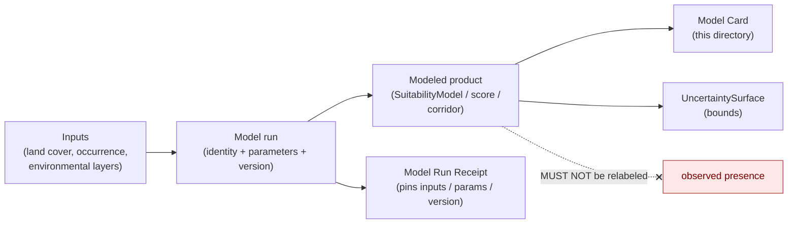
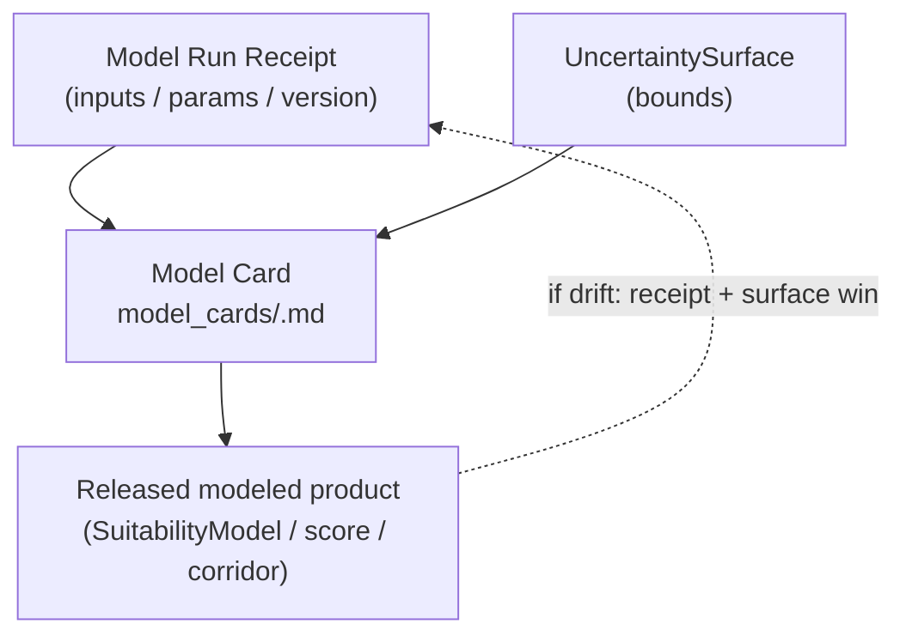

<!-- [KFM_META_BLOCK_V2]
doc_id: kfm://doc/habitat-model-cards-readme
title: Habitat — Model Cards
type: standard
version: v1
status: draft
owners: <habitat-domain-steward> · <model-steward> · <docs-steward>   # placeholder — confirm in CODEOWNERS
created: 2026-06-04
updated: 2026-06-04
policy_label: public
related:
  - docs/domains/habitat/README.md
  - docs/domains/habitat/SOURCE_REGISTRY/README.md
  - schemas/contracts/v1/receipts/model_run_receipt.schema.json
  - ai-build-operating-contract.md   # CONTRACT_VERSION = "3.0.0"
  - docs/doctrine/directory-rules.md
tags: [kfm, habitat, model-card, suitability, modeled, governance]
notes:
  - Contract + index for habitat model cards. Every modeled habitat product (SuitabilityModel, Habitat Quality Score, ConnectivityEdge, Corridor) requires a model card bound to a Model Run Receipt and an UncertaintySurface.
  - Doctrine-adjacent; pins CONTRACT_VERSION = "3.0.0".
  - Grounded in the CONFIRMED "Modeled" source-role rule (Atlas §24.1): modeled products must be cited with model identity, run receipt, and bounds; never labeled an observation. Habitat is named.
  - Model Run Receipt and UncertaintySurface are CONFIRMED habitat-owned objects (Atlas §6.B). Directory README; §6.N flags model-card requirements as NEEDS VERIFICATION.
  - All repo paths and field shapes PROPOSED pending mounted-repo verification.
[/KFM_META_BLOCK_V2] -->

# 🧪 Habitat — Model Cards

> The contract and index for **habitat model cards**. Habitat is the lane's modeling
> core — suitability models, habitat-quality scores, connectivity, and corridors are all
> *modeled* products. Each one MUST ship a model card that pins its identity, inputs,
> assumptions, run receipt, and uncertainty bounds, so a modeled surface is never
> mistaken for an observation.

| Field | Value |
|---|---|
| **Status** | `draft` |
| **Owners** | `<habitat-domain-steward>` · `<model-steward>` · `<docs-steward>` *(placeholders — confirm in CODEOWNERS)* |
| **Governs** | What every habitat model card MUST document, and the index of cards |
| **Binds to** | `Model Run Receipt` + `UncertaintySurface` (CONFIRMED habitat-owned objects, Atlas §6.B) |
| **Root rule** | Modeled products are cited with **model identity, run receipt, and bounds; never labeled an observation** (Atlas §24.1) |
| **Lane** | Habitat — `[DOM-HAB]` / `[DOM-HF]`, Atlas Ch. 6 |
| **Updated** | 2026-06-04 |

> [!IMPORTANT]
> **A modeled habitat product without a model card is not publishable.** The card is the
> human-facing companion to the `Model Run Receipt`; the receipt is the canonical
> machine record. Where this index and a `Model Run Receipt` disagree, the receipt
> governs and the drift is logged in `docs/registers/DRIFT_REGISTER.md`. Model-card
> requirements are flagged `NEEDS VERIFICATION` in Atlas §6.N until ratified.

---

## Contents

- [1. What a model card is, and why habitat needs one](#1-what-a-model-card-is-and-why-habitat-needs-one)
- [2. Which habitat products require a model card](#2-which-habitat-products-require-a-model-card)
- [3. The modeled-never-observed rule](#3-the-modeled-never-observed-rule)
- [4. Required model-card contents](#4-required-model-card-contents)
- [5. Model card ↔ Model Run Receipt ↔ UncertaintySurface](#5-model-card--model-run-receipt--uncertaintysurface)
- [6. Card lifecycle](#6-card-lifecycle)
- [7. Sensitivity in model cards](#7-sensitivity-in-model-cards)
- [8. Card index](#8-card-index)
- [9. Open questions & verification](#9-open-questions--verification)
- [10. Related docs](#10-related-docs)

---

## 1. What a model card is, and why habitat needs one

A model card is a structured, human-readable record of a single modeled product: what
it is, what it was built from, what it assumes, how uncertain it is, and what it must
**not** be read as. KFM requires one for every habitat modeled product because the
lane's signature outputs are interpretations, not observations.

The doctrine is explicit (Atlas §24.1, "Modeled" source role — habitat named): a modeled
product is *"a derived product from inputs, assumptions, or fitted parameters; uncertainty
and provenance of inputs must be preserved,"* and it must be *"cited with model identity,
run receipt, and bounds; never labeled an observation."* The model card is how that
citation requirement is satisfied in practice.

> [!NOTE]
> The card is documentation; the **`Model Run Receipt`** (a CONFIRMED habitat-owned
> object, Atlas §6.B) is the canonical evidence object the card describes, and the
> **`UncertaintySurface`** (also §6.B) carries the bounds. The card makes them legible;
> it does not replace them.

[↑ Back to top](#top)

---

## 2. Which habitat products require a model card

The modeled object families in the habitat owns-list (Atlas §6.B). Each instance of these
requires a model card.

| Habitat product | Why it is modeled | Card required? |
|---|---|---|
| `SuitabilityModel` | A fitted/derived surface of habitat suitability | **MUST** |
| `Habitat Quality Score` | A computed score over inputs and assumptions | **MUST** |
| `ConnectivityEdge` | A modeled linkage between patches | **MUST** |
| `Corridor` | A derived movement pathway | **MUST** |
| `Modeled habitat` *(§6.C term)* | Any modeled habitat extent | **MUST** |
| `Restoration Opportunity` | If derived from a model/score | **MUST if modeled** |
| `EcologicalSystem` | If produced by classification/modeling rather than direct mapping | **MUST if modeled** |
| `HabitatPatch`, `LandCoverObservation` | When **observed** (mapped/surveyed) | Not required *(observed, not modeled)* |
| `StewardshipZone` | Administrative boundary | Not required *(administrative)* |

> [!IMPORTANT]
> The dividing line is the **source role** (`SOURCE_REGISTRY/README.md §4`): `modeled`
> products need a card; `observed`, `regulatory`, and `administrative` products do not.
> A `HabitatPatch` that is *modeled* (e.g. classified from imagery) needs a card; one that
> is *field-mapped* does not.

[↑ Back to top](#top)

---

## 3. The modeled-never-observed rule

**CONFIRMED doctrine (Atlas §24.1; §24.1.2 anti-collapse; habitat named).** A modeled
product must never be relabeled, published, or queried as an observation.

| Collapse to deny | Denied outcome | Guardrail |
|---|---|---|
| Modeled habitat → observed presence | DENY publication; ABSTAIN at AI | `role_model_run_ref` + model card; never relabeled observed |
| Suitability score → ground truth | DENY "is present" framing | `UncertaintySurface` + card bounds; score is interpretive |
| Modeled product missing its receipt | DENY release | `Model Run Receipt` required before promotion |
| Synthetic surface → observed reality *(habitat named, §24.1.2)* | DENY; HOLD for steward review | `Reality Boundary Note` + `Representation Receipt` + UI badge |

> [!CAUTION]
> Synthetic content (AI-drafted, simulated, interpolated with no first-hand observation)
> is a **distinct, stricter** category than modeled: it carries a `Reality Boundary Note`
> and `Representation Receipt` and must never be presented as observed reality (Atlas
> §24.1, Synthetic role; habitat is named in the synthetic-as-observed DENY row). A model
> card documents a *modeled* product; if a product is *synthetic*, it additionally needs
> the reality-boundary machinery.

[↑ Back to top](#top)

---

## 4. Required model-card contents

The minimum a habitat model card MUST document, derived from the "Modeled" citation rule
(model identity + run receipt + bounds) and the `Model Run Receipt` / `UncertaintySurface`
objects. Field shapes are **PROPOSED** until the schema is verified.

| Section | Contents | Basis |
|---|---|---|
| **Identity** | Model name, version, `model_run_receipt_ref`, authoring steward/authority | "model identity" (§24.1); `Model Run Receipt` (§6.B) |
| **Purpose & scope** | What the product represents and its intended use; explicit out-of-scope uses | §6.A/B |
| **Inputs** | Every input source with its `source_id`, source role, and rights/sensitivity; occurrence inputs flagged as Fauna/Flora-owned evidence | §24.1 "provenance of inputs must be preserved"; §6.B non-ownership |
| **Assumptions & parameters** | Fitted parameters, thresholds, assumptions, training/reference period | §24.1 "inputs, assumptions, or fitted parameters" |
| **Method** | Modeling approach (classification, regression, connectivity algorithm, etc.) | §24.1 |
| **Uncertainty & bounds** | `uncertainty_surface_ref`; confidence/error characterization; known failure modes | "bounds" (§24.1); `UncertaintySurface` (§6.B) |
| **Reality boundary** | What is modeled vs observed vs synthetic; `reality_boundary_note_ref` if any synthetic component | §24.1 Synthetic role |
| **Sensitivity** | Whether the product can expose sensitive habitat/occurrence; geoprivacy transform applied | §6.I; `SOURCE_REGISTRY §9` |
| **Evidence & release** | `EvidenceBundle` ref, `release_id`, validation/policy/review state | §6.M publication |
| **Limitations & caveats** | Explicit "do not use this to…" statements; the modeled-never-observed reminder | §24.1; §3 |

> [!NOTE]
> The card's **Inputs** section is where the Fauna/Flora boundary is enforced: occurrence
> records that feed a suitability model are **Fauna/Flora-owned evidence (public-safe
> only)**, not habitat truth — the card cites them as inputs and never as habitat's own
> records (`SOURCE_REGISTRY §8`, row 4; Atlas §24.4.5/.6).

[↑ Back to top](#top)

---

## 5. Model card ↔ Model Run Receipt ↔ UncertaintySurface

Three distinct objects, not to be collapsed:

| Object | Form | Authority |
|---|---|---|
| `Model Run Receipt` (§6.B) | Machine record: pins inputs, parameters, version, run | **Canonical** — the evidence the card describes |
| `UncertaintySurface` (§6.B) | The bounds/error characterization of the product | **Canonical** — the "bounds" half of the citation rule |
| Model card *(this directory)* | Human-readable card referencing both | Navigational/legible companion |

> [!IMPORTANT]
> The card **references** the receipt and the uncertainty surface by id; it does not
> restate or replace them. A card that contradicts its `Model Run Receipt` is rewritten,
> not the receipt.

[↑ Back to top](#top)

---

## 6. Card lifecycle

A model card moves with its product through the lifecycle; it is a precondition of
publication, not a post-hoc artifact.

| Stage | Card state |
|---|---|
| Model authored / run | Draft card created alongside the `Model Run Receipt` |
| WORK / validation | Card reviewed against the receipt and uncertainty surface; model-card validator checks completeness |
| Release candidate | Card complete; `model_run_receipt_ref`, `uncertainty_surface_ref`, `EvidenceBundle` ref all resolve |
| PUBLISHED | Card published alongside the product; linked from the Evidence Drawer |
| Correction / new run | New card version; prior retained (append-only lineage); `CorrectionNotice` if the published product changes |

> [!CAUTION]
> A modeled habitat product MUST NOT reach `PUBLISHED` without a complete model card and a
> resolvable `Model Run Receipt`. "Publish now, document the model later" is a fail-open
> error — the card is part of the evidence closure (Atlas §6.M).

[↑ Back to top](#top)

---

## 7. Sensitivity in model cards

A model card can itself leak sensitive information through its inputs or outputs.

| Risk | Rule |
|---|---|
| Card lists exact sensitive-occurrence input coordinates | **DENY** — cite occurrence inputs by `source_id` and generalized extent only; geoprivacy transform applied (`SOURCE_REGISTRY §9`) |
| Suitability surface pinpoints sensitive/critical habitat | Generalize the published product; the card states the geoprivacy transform (`RedactionReceipt` ref) |
| Card reveals a method that enables reverse-engineering a protected location | Method described at a level that does not defeat geoprivacy; details held to steward review |
| Restricted Fauna/Flora occurrences used as inputs | Restricted occurrences **never cross**; only public-safe occurrences feed the model (Atlas §24.4.5/.6) |

> [!CAUTION]
> The card is a public artifact. It MUST NOT become a back door to sensitive locations —
> through input coordinates, output precision, or method detail. Sensitivity disposition
> routes through `ai-build-operating-contract.md §23.2` (rare-species locations) / §23.3.

[↑ Back to top](#top)

---

## 8. Card index

> [!NOTE]
> **PROPOSED placeholder index.** No model cards are asserted to exist until verified
> against the repo. Each row below dereferences to a card file under this directory once
> authored.

| Card | Product | Type | `Model Run Receipt` | Status |
|---|---|---|---|---|
| `<TODO model_cards/suitability-<species>.md>` | `SuitabilityModel` | modeled | `<receipt_id>` | PROPOSED |
| `<TODO model_cards/habitat-quality-<unit>.md>` | `Habitat Quality Score` | modeled | `<receipt_id>` | PROPOSED |
| `<TODO model_cards/connectivity-<region>.md>` | `ConnectivityEdge` / `Corridor` | modeled | `<receipt_id>` | PROPOSED |

[↑ Back to top](#top)

---

## Open questions register

| ID | Question | Owner role | Resolution path |
|---|---|---|---|
| OQ-HAB-MC-01 | Ratify the required model-card contents (§4) and whether they live in the card, the `Model Run Receipt` schema, or both. | `<model-steward>` + `<habitat-domain-steward>` | Schema review; Atlas §6.N model-card item |
| OQ-HAB-MC-02 | Confirm the `Model Run Receipt` and `UncertaintySurface` schema homes and field names. | `<schema-steward>` | Directory Rules §7.4 + ADR-0001 check |
| OQ-HAB-MC-03 | Define the model-card validator (completeness, receipt resolution, uncertainty presence) and its fixtures. | `<model-steward>` | `tools/validators/habitat/model_card/` + tests |
| OQ-HAB-MC-04 | Confirm the directory form (`model_cards/` + per-card files) vs an alternative card home. | `<docs-steward>` | Directory Rules §15 decision |

## Open verification backlog

These items remain `NEEDS VERIFICATION` before this document promotes from `draft` to `published`:

1. The ratified model-card content contract (OQ-HAB-MC-01; Atlas §6.N).
2. The `Model Run Receipt` / `UncertaintySurface` schema homes (OQ-HAB-MC-02).
3. The model-card validator and fixtures (OQ-HAB-MC-03).

## Changelog v0 → v1

| Change | Type (per contract §37) | Reason |
|---|---|---|
| Initial habitat model-cards contract + index authored | new | Provide the model-card home §6.N flags as required; bind modeled products to receipts + uncertainty |
| Modeled-never-observed rule made the card's spine | clarification | Ground the card in the §24.1 "Modeled" citation rule (model identity + run receipt + bounds) |
| Synthetic-vs-modeled distinction added | clarification | Synthetic products additionally need Reality Boundary Note / Representation Receipt (§24.1) |

> **Backward compatibility.** New directory README; no prior anchors to preserve.

## Definition of done

This document is done enough to enter the repository when:

- it is placed according to Directory Rules (under `docs/domains/habitat/model_cards/`);
- a habitat domain steward and a model steward review it;
- the §4 content contract is ratified (OQ-HAB-MC-01);
- it is linked from `docs/domains/habitat/README.md`;
- it does not conflict with accepted ADRs (esp. ADR-0001 schema home);
- any conflict with `Model Run Receipt` records or the dossier is logged in `docs/registers/DRIFT_REGISTER.md`;
- the `GENERATED_RECEIPT.json` planned in the authoring notes is wired into CI;
- future changes follow `ai-build-operating-contract.md §37` lifecycle.

[↑ Back to top](#top)

---

## 10. Related docs

- `docs/domains/habitat/README.md` — Habitat lane landing page.
- `docs/domains/habitat/SOURCE_REGISTRY/README.md` — source admission; the `modeled` role and occurrence-input boundary.
- `schemas/contracts/v1/receipts/model_run_receipt.schema.json` — `Model Run Receipt` schema home *(PROPOSED)*.
- `ai-build-operating-contract.md` — operating law, `AIReceipt`, §23 sensitive-domain matrix (`CONTRACT_VERSION = "3.0.0"`).
- Atlas Ch. 6 (Habitat) §6.A/§6.B (owns `Model Run Receipt`, `UncertaintySurface`), §6.C (`Modeled habitat`), §6.M (publication), §6.N (model-card requirements — NEEDS VERIFICATION).
- Atlas §24.1 (Source-Role Anti-Collapse Register — "Modeled" and "Synthetic" roles; habitat named); §24.4.5/.6 (occurrence inputs are Fauna/Flora-owned).
- `docs/doctrine/directory-rules.md` — §15 README Contract.

---

🧪 **KFM** · Habitat — Model Cards · v1 (draft) · `CONTRACT_VERSION = "3.0.0"` · `[DOM-HAB]`

[↑ Back to top](#top)
