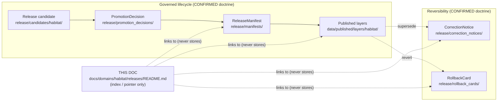

<!-- [KFM_META_BLOCK_V2]
doc_id: kfm://doc/<uuid>                                  # placeholder — assign on intake
title: Habitat Domain — Release Index (Documentation Lane)
type: standard
version: v1
status: draft
owners: <habitat-domain-steward>; <release-authority>     # placeholder — confirm in CODEOWNERS
created: 2026-06-04
updated: 2026-06-04
policy_label: public
related:
  - ../README.md                                          # docs/domains/habitat/README.md (PROPOSED neighbor)
  - ../../../../release/README.md                         # release/ canonical decision root (PROPOSED relative depth)
  - ../../../../data/published/layers/habitat/            # published habitat layers (PROPOSED)
  - ../../../doctrine/ai-build-operating-contract.md       # canonical operating contract
  - ../../../doctrine/directory-rules.md
tags: [kfm, habitat, releases, documentation-lane]
notes:
  - "CONTRACT_VERSION = 3.0.0 pinned."
  - "This is a DOCUMENTATION lane only. Canonical release decisions live under release/, not here."
  - "All repo paths PROPOSED until verified against a mounted repository."
[/KFM_META_BLOCK_V2] -->

# 🌾 Habitat Domain — Release Index

> Human-facing index and navigation lane for **published Habitat releases**. This doc *explains and points to* the canonical release artifacts; it is **not** a release store.

[](#)
[](#)
[](../../../doctrine/ai-build-operating-contract.md)
[](#)
[](../../../../release/README.md)
[](#)

| Field | Value |
|---|---|
| **Status** | `experimental` — index lane; entries `NEEDS VERIFICATION` until a mounted repo confirms releases |
| **Owners** | `<habitat-domain-steward>` · `<release-authority>` (placeholder; confirm via CODEOWNERS) |
| **Updated** | 2026-06-04 |
| **Authority** | Documentation lane under `docs/domains/habitat/` — **CONFIRMED doc segment**; release decisions are NOT authored here |
| **Canonical release root** | [`release/`](../../../../release/README.md) — **CONFIRMED** per `directory-rules.md` §9.2 |

> [!IMPORTANT]
> This lane is a **map, not a vault.** Per `directory-rules.md` §9.2 and §13.2, every release **decision** (`ReleaseManifest`, `PromotionDecision`, `RollbackCard`, `CorrectionNotice`, `WithdrawalNotice`, signatures, attestations) lives under the canonical [`release/`](../../../../release/README.md) root, and every released **artifact** (tiles, layer manifests, public-safe products) lives under [`data/published/layers/habitat/`](../../../../data/published/layers/habitat/). This README **indexes and links** those; it MUST NOT hold copies of them or become a parallel release home.

---

## Quick jump

- [1. Scope](#1-scope)
- [2. Repo fit](#2-repo-fit)
- [3. Inputs — what belongs here](#3-inputs--what-belongs-here)
- [4. Exclusions — what does not belong here](#4-exclusions--what-does-not-belong-here)
- [5. Where Habitat releases actually live](#5-where-habitat-releases-actually-live)
- [6. Lifecycle position](#6-lifecycle-position)
- [7. Release flow diagram](#7-release-flow-diagram)
- [8. Release index table](#8-release-index-table)
- [9. Sensitivity & publication posture](#9-sensitivity--publication-posture)
- [10. How to read / add an entry](#10-how-to-read--add-an-entry)
- [11. FAQ](#11-faq)
- [12. Related docs](#12-related-docs)
- [13. Appendix — field reference](#13-appendix--field-reference)

---

## 1. Scope

This file is the **release index** for the Habitat domain: a single navigable page that lists which Habitat releases exist, what they published, and where to find their governing decision artifacts and audit trail.

The Habitat domain governs habitat patches, land-cover observations, ecological systems, habitat quality, suitability models, connectivity, corridors, restoration opportunities, stewardship zones, model-run receipts, and uncertainty — and the **public-safe habitat products** derived from them. `[DOM-HAB] [DOM-HF] [ENCY]` *(CONFIRMED doctrine / PROPOSED implementation.)*

Its purpose is orientation, not authority. It answers: *"What Habitat releases are out, and where is the proof?"* — and routes the reader to the canonical stores.

[↑ Back to top](#-habitat-domain--release-index)

## 2. Repo fit

**Path (PROPOSED):** `docs/domains/habitat/releases/README.md`

The domain-segment-under-responsibility-root placement is **CONFIRMED doctrine**: domains are lane segments inside roots, never root folders, and `docs/domains/<domain>/` is the named documentation segment. `[DIRRULES §12]`

| Direction | Neighbor | Relationship |
|---|---|---|
| **Upstream (parent)** | [`docs/domains/habitat/README.md`](../README.md) | Domain landing doc; this index hangs beneath it. *(PROPOSED neighbor.)* |
| **Sibling** | [`docs/domains/habitat/RELEASE_INDEX.md`](../RELEASE_INDEX.md) | If a flat `RELEASE_INDEX.md` already exists, reconcile — do not maintain two. *(NEEDS VERIFICATION.)* |
| **Downstream (authority)** | [`release/`](../../../../release/README.md) | Canonical release-decision root this lane points into. **CONFIRMED store.** |
| **Downstream (artifacts)** | [`data/published/layers/habitat/`](../../../../data/published/layers/habitat/) | Where released public-safe Habitat layers live. *(PROPOSED.)* |

> [!NOTE]
> Relative-link depth above (`../../../../`) is **PROPOSED** and assumes the standard root tree from `directory-rules.md` §5. Verify against the mounted repository before relying on the links.

[↑ Back to top](#-habitat-domain--release-index)

## 3. Inputs — what belongs here

- A per-release **index entry** (one row in §8) summarizing a Habitat release.
- **Pointers** (relative links) to each release's canonical artifacts under `release/`.
- **Pointers** to the published artifacts under `data/published/layers/habitat/`.
- Human-readable notes: what changed, what was generalized/redacted, known limitations.
- Links to the relevant **correction** and **rollback** records when a release is superseded or reverted.

## 4. Exclusions — what does not belong here

> [!WARNING]
> Putting any of the following *in this folder* is a `directory-rules.md` §13.2 drift pattern (release decisions in the wrong root). If you find yourself pasting a manifest here, stop and link it instead.

| Do **not** place here | Goes instead to | Rule |
|---|---|---|
| `ReleaseManifest` files | `release/manifests/` | §9.2 |
| `PromotionDecision` records | `release/promotion_decisions/` | §9.2 |
| `RollbackCard` files | `release/rollback_cards/` | §9.2 |
| `CorrectionNotice` / `WithdrawalNotice` | `release/correction_notices/` · `release/withdrawal_notices/` | §9.2 |
| Release candidates | `release/candidates/<domain>/` (i.e. `habitat/`) | §12 |
| Signatures / attestations / SBOMs | `release/signatures/` · `release/attestations/` · `release/sbom/` | §9.2 (v0.2 lanes) |
| Published tiles / layer artifacts | `data/published/layers/habitat/` | §9.1 |
| Receipts / proofs | `data/receipts/` · `data/proofs/` | §9.1, §13.2 |
| Policy logic (`.rego`) | `policy/` (e.g. `policy/release/`, `policy/sensitivity/`) | §6.5 |
| Machine schemas (`.schema.json`) | `schemas/contracts/v1/habitat/` | ADR-0001 |

[↑ Back to top](#-habitat-domain--release-index)

## 5. Where Habitat releases actually live

A single Habitat release is composed of artifacts spread across canonical roots. This index links them; it does not contain them.

```text
# CONFIRMED root pattern (directory-rules.md §5, §9.1, §9.2, §12)
# Specific Habitat presence: PROPOSED / NEEDS VERIFICATION until mounted-repo check.

release/
├── candidates/
│   └── habitat/                      # Habitat release candidates  (PROPOSED)
├── manifests/                        # ReleaseManifest per release  (CONFIRMED home)
├── promotion_decisions/              # PromotionDecision records
├── rollback_cards/                   # RollbackCard per reverted release
├── correction_notices/               # CorrectionNotice (PUBLISHED → PUBLISHED')
├── withdrawal_notices/
├── signatures/                       # cosign signatures of manifests
├── attestations/                     # SLSA in-toto / DSSE  (v0.2)
└── sbom/                             # SBOM referrers       (v0.2)

data/
├── published/
│   └── layers/
│       └── habitat/                  # released public-safe Habitat layers  (PROPOSED)
├── receipts/                         # RunReceipt etc.
└── proofs/                           # proof packs

docs/
└── domains/
    └── habitat/
        └── releases/
            └── README.md             # 👈 you are here (index / pointer lane)
```

> [!NOTE]
> The directory **rules** above are CONFIRMED. Whether these specific Habitat paths are populated in any given repository is **PROPOSED** until verified against a mounted repo — see the [Verification](#13-appendix--field-reference) note in the appendix.

[↑ Back to top](#-habitat-domain--release-index)

## 6. Lifecycle position

A Habitat release is the **PUBLISHED** terminus of the governed lifecycle. Promotion to PUBLISHED is a **governed state transition, not a file move**. `[DIRRULES] [ENCY]` *(CONFIRMED doctrine.)*

| Stage | Habitat handling | Gate | Status |
|---|---|---|---|
| `RAW` | Capture source payload/reference with role, rights, sensitivity, citation, time, hash. | `SourceDescriptor` exists. | PROPOSED |
| `WORK / QUARANTINE` | Normalize schema, geometry, time, identity, evidence, rights, policy; hold failures. | Validation + policy gate pass, or quarantine reason recorded. | PROPOSED |
| `PROCESSED` | Emit validated normalized objects, receipts, public-safe candidates. | `EvidenceRef`, `ValidationReport`, digest closure exist. | PROPOSED |
| `CATALOG / TRIPLET` | Emit catalog records, `EvidenceBundle`, graph/triplet projections, release candidates. | Catalog / proof closure passes. | PROPOSED |
| `PUBLISHED` | Serve released public-safe artifacts via governed APIs and manifests. | `ReleaseManifest` + correction path + rollback target + review/policy state exist. | PROPOSED |

The release of a Habitat layer requires `ReleaseManifest`, `EvidenceBundle`, validation/policy support, review state where required, a correction path, the stale-state rule, and a rollback target. `[ENCY Appendix E] [DOM-HAB] [DOM-HF] [ENCY]` *(CONFIRMED doctrine / PROPOSED implementation.)*

[↑ Back to top](#-habitat-domain--release-index)

## 7. Release flow diagram



> [!NOTE]
> Diagram reflects the **CONFIRMED** doctrinal flow and placement rules. The dotted edges from THIS DOC are pointer relationships only — this lane never sits on the publication path.

[↑ Back to top](#-habitat-domain--release-index)

## 8. Release index table

> [!IMPORTANT]
> The row below is **illustrative** and `NEEDS VERIFICATION`. No Habitat release has been confirmed in this session (docs-only). Replace with real entries only after inspecting `release/manifests/` and `data/published/layers/habitat/` in a mounted repo.

| Release ID | Date | Published layer(s) | Manifest | Promotion | Status | Correction / Rollback |
|---|---|---|---|---|---|---|
| `<habitat-rel-NN>` *(illustrative)* | `YYYY-MM-DD` | `<layer slug>` | [manifest](../../../../release/manifests/) | [decision](../../../../release/promotion_decisions/) | `NEEDS VERIFICATION` | — |

[↑ Back to top](#-habitat-domain--release-index)

## 9. Sensitivity & publication posture

> [!CAUTION]
> **Habitat carries sensitive-occurrence risk.** Regulatory critical habitat, modeled habitat, species range, occurrence points, and landscape context **must not be flattened**, and **sensitive occurrence details deny by default.** A released Habitat layer that would expose sensitive locations must instead publish a generalized / redacted public-safe derivative with a recorded transform. `[DOM-HAB] [DOM-HF] [ENCY]` *(CONFIRMED doctrine.)*

Doctrine constraints any Habitat release entry in §8 must respect:

- **Deny-by-default promotion gate.** Unclear rights, unresolved source role, missing evidence, unresolved sensitivity, or absent release state **blocks public promotion.** `[ENCY] [DIRRULES]` *(CONFIRMED.)*
- **Source-role anti-collapse.** A modeled-suitability product MUST NOT be published as regulatory critical habitat. *(CONFIRMED doctrine; see Habitat validators: "modeled-as-critical denial tests." PROPOSED implementation.)*
- **Public-safe geometry only.** Where Habitat surfaces touch sensitive fauna/flora occurrences, restricted geometry is generalized (county / ecoregion polygon, buffered centroid) with a `RedactionReceipt`, per the cross-domain sensitivity register. `[DOM-FAUNA] [DOM-FLORA] [ENCY]` *(CONFIRMED doctrine.)*
- **Policy linkage.** A sensitivity-bearing Habitat release SHOULD reference the relevant `policy/sensitivity/` entry. If none exists yet, that is a gap to log, not a reason to publish. *(NEEDS VERIFICATION — `policy/sensitivity/habitat/` presence not confirmed this session.)*

[↑ Back to top](#-habitat-domain--release-index)

## 10. How to read / add an entry

<details>
<summary><strong>Adding a Habitat release entry to §8 (expand)</strong></summary>

1. **Confirm the release exists in canonical stores first.** A `ReleaseManifest` under `release/manifests/` and published artifacts under `data/published/layers/habitat/` MUST exist before an index row is added. This doc indexes reality; it does not create it.
2. **Verify closure.** The transition to PUBLISHED is closed only when the required artifacts exist, every `EvidenceRef` resolves to an `EvidenceBundle` (and `source_id → SourceDescriptor`, `model_id → ModelRunReceipt`), and the policy gate recorded its decision. `[ENCY] [DIRRULES]` *(CONFIRMED doctrine.)*
3. **Confirm public-safety.** Run the §9 posture check. If sensitivity is unresolved → do not add a public row; route to steward review.
4. **Add a row** to §8 with relative links into `release/` and `data/published/layers/habitat/`. Do **not** copy artifacts into this folder.
5. **On correction/rollback,** link the `CorrectionNotice` / `RollbackCard` in the last column rather than editing history. No silent edits. `[ENCY] [DIRRULES]` *(CONFIRMED doctrine.)*

</details>

[↑ Back to top](#-habitat-domain--release-index)

## 11. FAQ

**Why isn't the `ReleaseManifest` stored in this folder?**
Because `release/` is the **CONFIRMED canonical release-decision root** (`directory-rules.md` §9.2). Storing release decisions under `docs/` is the §13.2 drift pattern. This lane links to them so the audit trail stays single-homed.

**What's the difference between this and `data/published/layers/habitat/`?**
`data/published/...` holds the **artifacts** the public is served. This doc holds the **human-readable index** of releases and their proof. One is the product; the other is the catalog card.

**Is there already a `RELEASE_INDEX.md` for Habitat?**
Possibly — the Habitat domain doc suite includes a `RELEASE_INDEX.md`. If a flat sibling exists, these two MUST be reconciled (one canonical). *(NEEDS VERIFICATION; flag in the drift register if both are found.)*

[↑ Back to top](#-habitat-domain--release-index)

## 12. Related docs

- [`docs/domains/habitat/README.md`](../README.md) — Habitat domain landing *(PROPOSED neighbor)*
- [`docs/domains/habitat/RELEASE_INDEX.md`](../RELEASE_INDEX.md) — reconcile if present *(NEEDS VERIFICATION)*
- [`release/README.md`](../../../../release/README.md) — canonical release-decision root *(CONFIRMED store)*
- [`docs/doctrine/ai-build-operating-contract.md`](../../../doctrine/ai-build-operating-contract.md) — operating contract (`CONTRACT_VERSION = "3.0.0"`)
- [`docs/doctrine/directory-rules.md`](../../../doctrine/directory-rules.md) — placement law
- `docs/registers/DRIFT_REGISTER.md` — log any duplicate-index or misplaced-artifact drift *(TODO link)*

---

<sub>Documentation lane · not a release store · `CONTRACT_VERSION = "3.0.0"` · Last updated 2026-06-04 · [↑ Back to top](#-habitat-domain--release-index)</sub>
