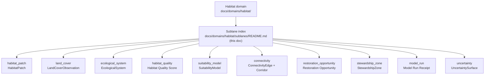

<!-- [KFM_META_BLOCK_V2]
doc_id: kfm://doc/<uuid>                                   # placeholder — assign on intake
title: Habitat Domain — Sublane Index
type: standard
version: v1
status: draft
owners: <habitat-domain-steward>                          # placeholder — confirm in CODEOWNERS
created: 2026-06-04
updated: 2026-06-04
policy_label: public
related:
  - ../README.md                                          # docs/domains/habitat/README.md (PROPOSED neighbor)
  - ../../../doctrine/ai-build-operating-contract.md       # canonical operating contract
  - ../../../doctrine/directory-rules.md
  - ../../../../schemas/contracts/v1/habitat/              # schema home (PROPOSED depth)
  - ../../../../contracts/habitat/                         # meaning home (PROPOSED depth)
tags: [kfm, habitat, sublanes, index]
notes:
  - "CONTRACT_VERSION = 3.0.0 pinned."
  - "This is a documentation index. Sublanes map to Habitat-owned object families, not to new responsibility roots."
  - "The sublanes/ path segment is NEEDS VERIFICATION against Directory Rules."
  - "All repo paths PROPOSED until verified against a mounted repository."
[/KFM_META_BLOCK_V2] -->

# 🌿 Habitat Domain — Sublane Index

> Navigation hub for the Habitat domain's documentation **sublanes** — one per Habitat-owned object family. This page indexes them; it does not define the objects themselves.

| Field | Value |
|---|---|
| **Status** | `experimental` — index lane; individual sublane docs `PROPOSED` |
| **Owners** | `<habitat-domain-steward>` (placeholder; confirm via CODEOWNERS) |
| **Updated** | 2026-06-04 |
| **Owning domain** | Habitat `[DOM-HAB] [DOM-HF]` |
| **Authority** | Documentation segment under `docs/domains/habitat/` — doc lane, not a responsibility root |

> [!IMPORTANT]
> A **sublane** is a documentation grouping for one Habitat-owned **object family** (e.g., `LandCoverObservation`). Sublanes are organizational only: they do **not** create new responsibility roots, do **not** own data, and do **not** alter the Domain Placement Law. Habitat's objects live as lane segments inside the canonical roots (`schemas/contracts/v1/habitat/`, `contracts/habitat/`, `data/<phase>/habitat/`, etc.). `[DIRRULES §12]` *(CONFIRMED placement doctrine.)*

---

## Quick jump

- [1. Scope](#1-scope)
- [2. Repo fit](#2-repo-fit)
- [3. What a sublane is (and is not)](#3-what-a-sublane-is-and-is-not)
- [4. Sublane map](#4-sublane-map)
- [5. Sublane index](#5-sublane-index)
- [6. Domain boundary reminder](#6-domain-boundary-reminder)
- [7. Sensitivity posture across sublanes](#7-sensitivity-posture-across-sublanes)
- [8. How to add a sublane](#8-how-to-add-a-sublane)
- [9. FAQ](#9-faq)
- [10. Related docs](#10-related-docs)
- [11. Appendix — verification backlog](#11-appendix--verification-backlog)

---

## 1. Scope

This index lists the Habitat domain's documentation sublanes and routes the reader to each. The Habitat domain governs habitat patches, land-cover observations, ecological systems, habitat quality, suitability models, connectivity, corridors, restoration opportunities, stewardship zones, model-run receipts, and uncertainty — plus the public-safe products derived from them. `[DOM-HAB] [DOM-HF] [ENCY]` *(CONFIRMED doctrine / PROPOSED implementation.)*

Each sublane corresponds to one **CONFIRMED Habitat-owned object family**. The object set itself is doctrine; the sublane folders are an organizational convention beneath the Habitat doc segment.

[↑ Back to top](#-habitat-domain--sublane-index)

## 2. Repo fit

**Path (PROPOSED):** `docs/domains/habitat/sublanes/README.md`

The `docs/domains/habitat/` documentation segment is **CONFIRMED** doctrine — domains are lane segments inside responsibility roots, never root folders. `[DIRRULES §12]` The `sublanes/` wrapper beneath it is a **PROPOSED / NEEDS VERIFICATION** convention.

> [!NOTE]
> A dedicated `sublanes/` path segment was **not located in `directory-rules.md`** this session. If the Habitat doc suite organizes object docs differently (flat `LAND_COVER.md`, `IDENTITY_MODEL.md` coverage, or topic folders without a `sublanes/` wrapper), reconcile to that convention and log the choice in the drift register. Snake_case child folders (e.g., `land_cover/`) are assumed; confirm casing against the repo.

| Direction | Neighbor | Relationship |
|---|---|---|
| **Upstream (parent)** | [`docs/domains/habitat/README.md`](../README.md) | Habitat domain landing doc *(PROPOSED neighbor)* |
| **Children** | the per-object sublane READMEs in §5 | This index links down to each |
| **Schema home** | [`schemas/contracts/v1/habitat/`](../../../../schemas/contracts/v1/habitat/) | Where the object schemas live *(PROPOSED; ADR-0001 canonical)* |
| **Meaning home** | [`contracts/habitat/`](../../../../contracts/habitat/) | Semantic contracts *(PROPOSED)* |

[↑ Back to top](#-habitat-domain--sublane-index)

## 3. What a sublane is (and is not)

| A sublane **is** | A sublane **is not** |
|---|---|
| A documentation grouping for one Habitat object family | A responsibility root |
| A pointer to that object's schema, contract, sources, and policy | A data store, schema home, or release home |
| Organizational and human-facing | A change to the Domain Placement Law |
| Scoped to Habitat-owned objects | A back door into Fauna, Flora, Soil, or other lanes |

> [!CAUTION]
> Do not let a sublane folder accumulate machine artifacts. Schemas go to `schemas/contracts/v1/habitat/`, contracts to `contracts/habitat/`, data to `data/<phase>/habitat/`, releases to `release/`, and policy to `policy/`. A sublane README links to those; it never holds them. `[DIRRULES §9, §13.2]`

[↑ Back to top](#-habitat-domain--sublane-index)

## 4. Sublane map

> [!NOTE]
> Object families are **CONFIRMED** doctrine. The grouping of `ConnectivityEdge` + `Corridor` into one connectivity sublane, and folder names like `habitat_patch`, are **PROPOSED** organizational choices — adjust to match repo convention.

[↑ Back to top](#-habitat-domain--sublane-index)

## 5. Sublane index

The eleven Habitat-owned object families. Each row is a candidate sublane; statuses reflect whether the sublane doc has been authored. `[DOM-HAB] [DOM-HF] [ENCY]` *(object set CONFIRMED; folder paths PROPOSED.)*

| Sublane (PROPOSED folder) | Object family | What it governs | Doc status |
|---|---|---|---|
| [`habitat_patch/`](./habitat_patch/) | `HabitatPatch` | Delineated habitat units | PROPOSED — not yet authored |
| [`land_cover/`](./land_cover/) | `LandCoverObservation` | Per-source land cover (NLCD/CDL/LANDFIRE/GAP/NWI), advisory crosswalks | PROPOSED — sublane README in progress |
| [`ecological_system/`](./ecological_system/) | `EcologicalSystem` | Ecological system classification | PROPOSED — not yet authored |
| [`habitat_quality/`](./habitat_quality/) | `Habitat Quality Score` | Quality scoring (interpretive derivative) | PROPOSED — not yet authored |
| [`suitability_model/`](./suitability_model/) | `SuitabilityModel` | Modeled suitability (never published as critical habitat) | PROPOSED — not yet authored |
| [`connectivity/`](./connectivity/) | `ConnectivityEdge`, `Corridor` | Landscape connectivity and corridors | PROPOSED — not yet authored |
| [`restoration_opportunity/`](./restoration_opportunity/) | `Restoration Opportunity` | Restoration opportunity surfaces | PROPOSED — not yet authored |
| [`stewardship_zone/`](./stewardship_zone/) | `StewardshipZone` | Stewardship/management zones | PROPOSED — not yet authored |
| [`model_run/`](./model_run/) | `Model Run Receipt` | Model-run provenance receipts | PROPOSED — not yet authored |
| [`uncertainty/`](./uncertainty/) | `UncertaintySurface` | Uncertainty surfaces for derived products | PROPOSED — not yet authored |

> [!NOTE]
> Each object's **identity rule** is the same PROPOSED deterministic basis: `source id + object role + temporal scope + normalized digest`. Across all of them, source/observed/valid/retrieval/release/correction times stay **distinct** where material. `[DOM-HAB] [DOM-HF] [ENCY]` *(temporal-distinctness CONFIRMED; identity basis PROPOSED.)*

[↑ Back to top](#-habitat-domain--sublane-index)

## 6. Domain boundary reminder

Habitat **explicitly does not own**: `[DOM-HAB] [DOM-HF] [ENCY]` *(CONFIRMED.)*

- **Fauna** owns taxa and animal occurrence.
- **Flora** owns plant taxa, specimens, occurrences, and rare plant records.
- **Soil, hydrology, agriculture, hazards, and archaeology** retain their own truth.

Any sublane that touches those is a **governed join**, citing the owning lane's public-safe surface — never a copy of it. `[DOM-HAB] [DOM-HF] [ENCY]`

[↑ Back to top](#-habitat-domain--sublane-index)

## 7. Sensitivity posture across sublanes

> [!CAUTION]
> Two sublane groups carry elevated sensitivity. Modeled surfaces (`suitability_model`, `habitat_quality`) MUST NOT be published as regulatory critical habitat — source-role anti-collapse. Location-bearing surfaces (`habitat_patch`, `stewardship_zone`, `connectivity`) and any join to sensitive species occurrence **deny exact exposure by default** and publish only generalized, public-safe derivatives with a recorded transform (`RedactionReceipt`). `[DOM-HAB] [DOM-FAUNA] [ENCY]` *(CONFIRMED posture.)*

- **Deny-by-default promotion gate.** Unclear rights, unresolved source role, missing evidence, unresolved sensitivity, or absent release state **blocks public promotion.** `[ENCY] [DIRRULES]` *(CONFIRMED.)*
- **Publication** of any sublane product requires `ReleaseManifest`, `EvidenceBundle`, validation/policy support, review state where required, correction path, stale-state rule, and rollback target. `[ENCY Appendix E] [DOM-HAB]` *(CONFIRMED doctrine / PROPOSED implementation.)*

[↑ Back to top](#-habitat-domain--sublane-index)

## 8. How to add a sublane

<strong>Authoring a new Habitat sublane (expand)</strong>

1. **Confirm the object family is Habitat-owned.** A sublane MUST map to one of the eleven CONFIRMED Habitat objects in §5. Do not invent object families; that requires an ADR and an Atlas update.
2. **Create the sublane folder** under `docs/domains/habitat/sublanes/<object>/` (PROPOSED convention) with a `README.md`.
3. **Document, don't store.** Cover the object's meaning, identity rule, temporal handling, source families, cross-lane joins, and sensitivity posture. Link to the schema (`schemas/contracts/v1/habitat/`), contract (`contracts/habitat/`), and policy entries — do not copy them in.
4. **Apply the deny-by-default posture** from §7 where the object bears location or is a modeled surface.
5. **Update §5** of this index with the new sublane's row and status.
6. **Log the `sublanes/` convention** in `docs/registers/DRIFT_REGISTER.md` until the path segment is confirmed against Directory Rules.

[↑ Back to top](#-habitat-domain--sublane-index)

## 9. FAQ

**Why group `ConnectivityEdge` and `Corridor` together?**
They are tightly related landscape-connectivity objects. This is a PROPOSED organizational grouping, not a doctrinal merge — both remain distinct CONFIRMED object families.

**Do sublanes change where Habitat data lives?**
No. Sublanes are documentation only. Data, schemas, releases, and policy stay in their canonical roots per the Domain Placement Law. *(CONFIRMED.)*

**Is `sublanes/` an official path?**
Not yet confirmed. The `docs/domains/habitat/` segment is CONFIRMED; the `sublanes/` wrapper is NEEDS VERIFICATION and should be reconciled with the repo's actual convention.

[↑ Back to top](#-habitat-domain--sublane-index)

## 10. Related docs

- [`docs/domains/habitat/README.md`](../README.md) — Habitat domain landing *(PROPOSED neighbor)*
- [`docs/domains/habitat/sublanes/land_cover/README.md`](./land_cover/) — Land Cover sublane *(in progress)*
- [`docs/domains/habitat/IDENTITY_MODEL.md`](../IDENTITY_MODEL.md) — Habitat identity rules *(PROPOSED neighbor)*
- [`schemas/contracts/v1/habitat/`](../../../../schemas/contracts/v1/habitat/) — Habitat object schemas *(PROPOSED)*
- [`docs/doctrine/ai-build-operating-contract.md`](../../../doctrine/ai-build-operating-contract.md) — operating contract (`CONTRACT_VERSION = "3.0.0"`)
- [`docs/doctrine/directory-rules.md`](../../../doctrine/directory-rules.md) — placement law
- `docs/registers/DRIFT_REGISTER.md` — log sublane-path convention drift *(TODO link)*

---

## 11. Appendix — verification backlog

<strong>Items that remain NEEDS VERIFICATION before promotion (expand)</strong>

1. Confirm the `sublanes/` path-segment convention under `docs/domains/habitat/` against the repo and Directory Rules; reconcile casing.
2. Confirm which sublane docs already exist vs. are planned (reconcile §5 statuses with the repo).
3. Confirm the `ConnectivityEdge` + `Corridor` grouping is desired, or split into two sublanes.
4. Confirm the canonical folder name for each object (e.g., `habitat_patch` vs `patch`).
5. Confirm `schemas/contracts/v1/habitat/` presence and the per-object schema set.
6. Confirm `policy/sensitivity/` coverage for location-bearing and modeled Habitat surfaces.

Habitat documentation index · sublanes are organizational, not roots · `CONTRACT_VERSION = "3.0.0"` · Last updated 2026-06-04 · [↑ Back to top](#-habitat-domain--sublane-index)
