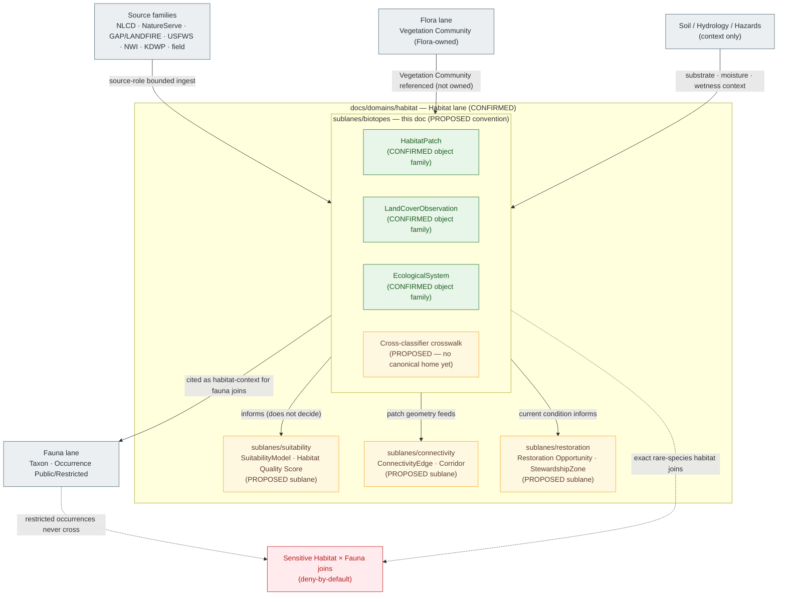

<!-- [KFM_META_BLOCK_V2]
doc_id: kfm://doc/habitat-sublane-biotopes-v1
title: Habitat Sublane — Biotopes
type: standard
version: v1
status: draft
owners: TODO — Habitat domain steward; Docs steward     # placeholder — confirm via CODEOWNERS
created: 2026-05-17
updated: 2026-06-04
policy_label: public
related:
  - docs/domains/habitat/README.md
  - docs/domains/habitat/sublanes/README.md
  - docs/doctrine/ai-build-operating-contract.md          # canonical operating contract
  - docs/doctrine/directory-rules.md
  - docs/doctrine/trust-membrane.md
  - docs/doctrine/lifecycle-law.md
  - docs/domains/fauna/README.md
  - docs/domains/flora/README.md
  - docs/standards/PROV.md
  - docs/standards/ISO-19115.md
  - docs/adr/README.md
tags: [kfm, domain, habitat, sublane, biotopes, ecological-system, land-cover]
notes:
  - "CONTRACT_VERSION = 3.0.0 pinned (doctrine-adjacent)."
  - "Sublanes are a PROPOSED docs/ organizational tier; convention not yet established in Directory Rules."
  - "`Biotope` is NOT a term in KFM ubiquitous language; this doc maps it to existing Habitat object families."
  - "Vegetation Community is Flora-owned (two-word KFM term); cited here, never owned."
  - "All implementation-layer claims remain PROPOSED until verified against mounted repo evidence."
[/KFM_META_BLOCK_V2] -->

# Habitat Sublane — Biotopes

> Scopes the **habitat-type / community-classification** concerns within the Habitat domain — land cover, ecological systems, and habitat patches as evidence-backed types — and crosswalks them to KFM's canonical object families.

**Status:** Draft  ·  **Owners:** TODO — Habitat domain steward; Docs steward  ·  **Updated:** 2026-06-04

> [!IMPORTANT]
> **Term-acceptance gate.** `Biotope` is **not** KFM ubiquitous language. This file is a **documentation-layer grouping** over the canonical Habitat object families `HabitatPatch`, `LandCoverObservation`, and `EcologicalSystem` (plus the **Flora-owned** `Vegetation Community`, cited not owned). Adopting the umbrella term "biotope" is a **PROPOSED owner decision** — see [§13](#13-open-questions-and-verification-backlog). If the Habitat steward rejects it, rename this file (e.g., `habitat-types.md`) and preserve the crosswalk in [§4](#4-terminology-crosswalk--biotope--kfm).

---

## Quick jump

- [1. Sublane identity and one-line purpose](#1-sublane-identity-and-one-line-purpose)
- [2. Scope and boundary](#2-scope-and-boundary)
- [3. Sublane concept and authority posture](#3-sublane-concept-and-authority-posture)
- [4. Terminology crosswalk — biotope ↔ KFM](#4-terminology-crosswalk--biotope--kfm)
- [5. Key source families](#5-key-source-families)
- [6. Sublane shape and relations (diagram)](#6-sublane-shape-and-relations-diagram)
- [7. Sensitivity, rights, and publication posture](#7-sensitivity-rights-and-publication-posture)
- [8. Pipeline placement (RAW → PUBLISHED)](#8-pipeline-placement-raw--published)
- [9. Cross-sublane and cross-lane relations](#9-cross-sublane-and-cross-lane-relations)
- [10. API, contract, and schema surfaces](#10-api-contract-and-schema-surfaces)
- [11. Governed AI behavior for this sublane](#11-governed-ai-behavior-for-this-sublane)
- [12. Validators, tests, fixtures](#12-validators-tests-fixtures)
- [13. Open questions and verification backlog](#13-open-questions-and-verification-backlog)
- [14. Related docs](#14-related-docs)
- [Appendix A — Sublane conformance checklist](#appendix-a--sublane-conformance-checklist)

---

## 1. Sublane identity and one-line purpose

> **CONFIRMED doctrine / PROPOSED sublane application.** The **Biotopes** sublane scopes the habitat-type and ecological-classification slice of the Habitat lane — land cover, ecological systems, and habitat patches treated as evidence-backed types, with their crosswalks, vintage labels, and public-safe derivatives. It does **not** decide suitability, connectivity, restoration priority, or species occurrence.

A *biotope* in this sublane is the **KFM-internal umbrella term** for "habitat as a typed area" — the named, classified, mapped polygon or raster cell that asserts *this place is of this habitat type at this time, according to this source.* The sublane organizes those assertions; it does **not** introduce a new object family.

> [!IMPORTANT]
> `Biotope` is **not** a term in KFM's ubiquitous language (see [§4](#4-terminology-crosswalk--biotope--kfm)).
> The KFM-canonical object families remain **`HabitatPatch`**, **`LandCoverObservation`**, **`EcologicalSystem`** (all Habitat-owned), and the **Flora-owned** **`Vegetation Community`**. This sublane is a **documentation-layer grouping** over those object families, not a replacement vocabulary.

[⬆ Back to top](#quick-jump)

---

## 2. Scope and boundary

### 2.1 What this sublane covers

| Concern | KFM object family | Owning lane | Sublane treatment |
|---|---|---|---|
| Habitat areas as typed polygons or cells | `HabitatPatch` | Habitat (CONFIRMED) | Identity, vintage, source role, public-safe geometry |
| Land cover observations (e.g., NLCD class assignments) | `LandCoverObservation` | Habitat (CONFIRMED) | Source-role distinction; classifier version; effective time |
| Ecological system classification (NatureServe / GAP / LANDFIRE) | `EcologicalSystem` | Habitat (CONFIRMED) | Crosswalk, model-vs-observation labels, vintage |
| Generalized public-safe derivatives | (derived layers) | Habitat | Generalization, sensitivity transforms, release manifests |
| Vintage / classifier-version labeling | All of the above | Habitat | Surface model/observation distinction in every view |

### 2.2 What this sublane explicitly does **not** cover

- **Habitat suitability modeling.** Owned by the Habitat lane via `SuitabilityModel`, `Habitat Quality Score`, `UncertaintySurface`, and `Model Run Receipt`. *Proposed sublane home: `docs/domains/habitat/sublanes/suitability.md`.*
- **Connectivity, corridors, edges.** Owned via `ConnectivityEdge`, `Corridor`. *Proposed sublane home: `docs/domains/habitat/sublanes/connectivity.md`.*
- **Restoration and stewardship.** Owned via `Restoration Opportunity`, `StewardshipZone`. *Proposed sublane home: `docs/domains/habitat/sublanes/restoration.md`.*
- **Species taxonomy or occurrence.** Owned by **Fauna** and **Flora**; biotope context joins to those lanes only through governed relations and Habitat–Fauna geoprivacy rules. `[DOM-HAB] [DOM-FAUNA] [DOM-FLORA]`
- **Plant communities as plant identity.** `Vegetation Community` is **owned by Flora**, not Habitat; biotope context cites it but does not own it. `[DOM-FLORA]` *(CONFIRMED ownership.)*
- **Soil, hydrology, agriculture truth.** Substrate, moisture, wetness, and crop are context joins, never re-asserted here. `[DOM-SOIL] [DOM-HYD] [DOM-AG]`
- **Regulatory critical habitat as biotope type.** Regulatory critical habitat is a **source-role-bounded** layer (USFWS); it MUST remain labeled as regulatory designation, not as ecological classification truth. `[DOM-HAB]`

> [!NOTE]
> The Habitat lane already names its full object spine (`HabitatPatch`, `LandCoverObservation`, `EcologicalSystem`, `Habitat Quality Score`, `SuitabilityModel`, `ConnectivityEdge`, `Corridor`, `Restoration Opportunity`, `StewardshipZone`, `Model Run Receipt`, `UncertaintySurface`). `[DOM-HAB] [DOM-HF] [ENCY]` This sublane re-groups three of those families for documentation clarity. It **MUST NOT** introduce parallel object families, schemas, contracts, or policy.

[⬆ Back to top](#quick-jump)

---

## 3. Sublane concept and authority posture

### 3.1 What "sublane" means in this doc

A **sublane** is a `docs/`-layer thematic grouping inside a single domain folder. It bundles related object families, source notes, viewing modes, and verification items so writers and reviewers do not have to re-derive scope per file. A sublane is:

- **A docs/ convention.** It lives only inside `docs/domains/<domain>/sublanes/`.
- **Subordinate to the lane.** All authority — schemas, contracts, policy, releases, tests, fixtures — remains at the lane level under the appropriate responsibility root.
- **Not a placement authority.** A sublane does **not** justify new folders under `contracts/`, `schemas/`, `policy/`, `tests/`, `fixtures/`, `data/`, or `release/`. Per Directory Rules §12, domain segments are the lowest authority granularity in those roots.

### 3.2 Authority status of the `sublanes/` convention

> [!WARNING]
> **PROPOSED convention — not yet established in Directory Rules.**
>
> The `docs/domains/<domain>/sublanes/` directory is **not** referenced in `docs/doctrine/directory-rules.md` (CONFIRMED check of the canonical placement doctrine in this session). It is also **not** named in any reviewed KFM dossier as an established tier.
>
> Before this convention is treated as canonical, **at least one** of the following SHOULD land:
>
> 1. A short **ADR** establishing `sublanes/` as a permitted `docs/`-only sub-organizational tier inside domain folders. A `docs/`-internal sub-tier is most likely a **§17 routine-PR** change rather than a §2.4 ADR trigger (it adds no canonical root, schema home, lifecycle phase, or parallel authority); record it via the per-root README path if the steward agrees. **NEEDS VERIFICATION.**
> 2. A per-root **`docs/domains/habitat/README.md`** (or `docs/domains/habitat/sublanes/README.md`) entry naming the sublanes under that domain, what each covers, and that they create no parallel authority elsewhere.
> 3. A **drift entry** in `docs/registers/DRIFT_REGISTER.md` if the convention is rejected after review.

Until the convention is settled, this file SHOULD be treated as **PROPOSED** with respect to its placement, while its **content** (terminology crosswalks, lifecycle posture, sensitivity rules) inherits the underlying lane's CONFIRMED doctrine.

### 3.3 What this sublane is **never** allowed to do

- Become a root folder (`biotopes/` at repo root → **forbidden** by Directory Rules §12, Domain Placement Law, and §3 deeper rule: a domain/topic name MUST NOT appear at repo root).
- Create a parallel `schemas/biotopes/`, `policy/biotopes/`, `contracts/biotopes/`, or `data/.../biotopes/`. Those must live under the **Habitat** domain segment.
- Redefine a KFM object family. Object meaning lives in `contracts/`; field shape lives in `schemas/`.
- Publish biotope content outside the governed API or without a `ReleaseManifest`, `EvidenceBundle`, validation/policy support, review state where required, correction path, and rollback target. `[DOM-HAB §M] [ENCY Appendix E]`

[⬆ Back to top](#quick-jump)

---

## 4. Terminology crosswalk — biotope ↔ KFM

The word *biotope* is used in this sublane as a **bounded English-language umbrella** for the family of "habitat-type" assertions KFM already owns. It is **not** introduced as a new contract, schema, policy class, or graph node type.

| External usage of "biotope" | KFM canonical equivalent | Owning lane | Status | Notes |
|---|---|---|---|---|
| A typed habitat area on the ground | `HabitatPatch` | Habitat | CONFIRMED object family / PROPOSED field realization | Per `[DOM-HAB]`, `[DOM-HF]`, `[ENCY]`. |
| A land-cover class assignment (NLCD-style) | `LandCoverObservation` | Habitat | CONFIRMED object family / PROPOSED field realization | Per `[DOM-HAB]`. Carries classifier version + effective time. |
| A NatureServe / LANDFIRE / GAP ecological system label | `EcologicalSystem` | Habitat | CONFIRMED object family / PROPOSED field realization | Per `[DOM-HAB]`. Model-vs-observation labels MUST stay visible. |
| A floristic plant community | `Vegetation Community` | **Flora** (not Habitat) | CONFIRMED ownership | Flora-owned per `[DOM-FLORA]`; cited here, not owned. Two-word KFM term. |
| Regulatory critical habitat | "Regulatory critical habitat" (USFWS source-role label) | Habitat | CONFIRMED term | Source-role bounded; not a biotope *type*. Per `[DOM-HAB]`. |
| Modeled habitat suitability surface | `SuitabilityModel`, `Habitat Quality Score` | Habitat (suitability sublane) | CONFIRMED object families | **Out of scope** for this sublane. |
| Crosswalk record linking biotope labels across classifiers | (no canonical family yet) | — | **PROPOSED — NEEDS VERIFICATION** | If introduced, must follow ADR + contract + schema path; no parallel home. |

> [!NOTE]
> When this doc says **"biotope"**, read it as a *grouping noun for the three Habitat object families above*. When the underlying claim is operational (validation, publication, sensitivity), the canonical KFM term takes precedence in code, schemas, policy, and receipts. *External* typologies (e.g., EUNIS habitat classification, IUCN Global Ecosystem Typology) may be referenced as **EXTERNAL** crosswalk targets in future verification work, but are **not** authoritative inside KFM and are unverified in this session.

[⬆ Back to top](#quick-jump)

---

## 5. Key source families

CONFIRMED Habitat source families per `[DOM-HAB]` and `[ENCY]`. Source-role distinctions (authority / observation / context / model) are preserved per the CONFIRMED cross-domain rule that *source role cannot be inferred from convenience*. `[DOM-HAB] [DOM-HF] [ENCY]`

| Source family | Typical role for biotopes | Rights / sensitivity | Freshness | Status |
|---|---|---|---|---|
| **NLCD** land cover | observation / context | rights NEEDS VERIFICATION; generally public | classifier-version specific (e.g., NLCD 2019 / 2021) | `[DOM-HAB]` |
| **NatureServe** ecological systems | model / context | rights NEEDS VERIFICATION; controlled biodiversity source — sensitive joins fail closed | source-vintage specific | `[DOM-HAB]` |
| **GAP / LANDFIRE** | model / context | rights NEEDS VERIFICATION | source-vintage specific | `[DOM-HAB]` |
| **USFWS ECOS** critical habitat services | authority (regulatory designation) | rights NEEDS VERIFICATION; sensitive joins fail closed | service-vintage specific | `[DOM-HAB]` |
| **NWI** wetlands | observation / context | rights NEEDS VERIFICATION | source-vintage specific | `[DOM-HAB]` |
| **State ecological inventories** (e.g., KDWP context) | authority / context | review-state bounded; sensitive joins fail closed | source-vintage specific | `[DOM-HAB]` |
| **PAD-US** stewardship context | context | rights NEEDS VERIFICATION | service-vintage specific | `[DOM-HAB]` |
| **Field surveys / steward-reviewed habitat models** | observation / model | source-role bounded; review state required | survey-specific | `[DOM-HAB]` |
| **Remote-sensing vegetation indices** (Landsat, Sentinel-2 derivatives) | observation / model | source-role bounded; QA/cloud gates apply | scene-time specific | `[DOM-HAB]` · PROPOSED watcher lane (NEEDS VERIFICATION) |

> [!CAUTION]
> No biotope claim may be promoted to `PUBLISHED` from a source whose **role**, **rights**, or **vintage** is unresolved. *Cite-or-abstain* applies. The source-activation posture (CONFIRMED doctrine): a `SourceDescriptor` is admitted, reviewed, and only then activated — connectors remain inactive until activation, fixtures, validators, and policy gates exist. *(Source-activation mechanics are PROPOSED implementation; verify against the mounted repo.)*

[⬆ Back to top](#quick-jump)

---

## 6. Sublane shape and relations (diagram)

> [!NOTE]
> Boxes shown in amber are **PROPOSED**. The deny-by-default node enforces the CONFIRMED Habitat ↔ Fauna geoprivacy posture: habitat patches are admitted to public/3D surfaces only via generalized geometry, sensitive habitat is denied, and only public-safe occurrences feed habitat-quality evaluation — restricted occurrences never cross. `[DOM-HAB] [DOM-FAUNA]`

[⬆ Back to top](#quick-jump)

---

## 7. Sensitivity, rights, and publication posture

CONFIRMED Habitat posture per `[DOM-HAB §I]`, applied here without modification:

- **Regulatory critical habitat, modeled habitat, species range, occurrence points, and landscape context MUST NOT be flattened.** A biotope view that erases the regulatory-vs-modeled distinction is a CONFIRMED anti-pattern. `[DOM-HAB]`
- **Sensitive occurrence details deny by default.** When a biotope polygon would, by join, reveal a sensitive taxon's exact site — nest, den, roost, hibernaculum, spawning site, or steward-controlled record — the join MUST fail closed unless a documented `Geoprivacy transform` + `Redaction Receipt` + public-safe derivative + review state allow release. `[ENCY §20.5 Deny-by-Default Register] [Operating Contract §23.2] [DOM-FAUNA]`
- **Rare/protected/culturally sensitive plant locations** carried via Flora joins are likewise denied to public consumers absent review + generalized/withheld geometry + `Redaction Receipt`. `[ENCY §20.5] [DOM-FLORA]`
- **Unclear rights, unresolved source role, missing evidence, unresolved sensitivity, or absent release state blocks public promotion.** `[ENCY] [DIRRULES]`
- **3D admission** of biotope geometry follows Spatial Foundation rules: generalized geometry only; sensitive habitat denied. `[DOM-HAB] [MAP-MASTER]`

> [!CAUTION]
> Per the operating contract's §23.2 sensitive-domain matrix, when no row clearly matches, the **most restrictive applicable row applies**: `DENY` exact exposure, `GENERALIZE` before publication, `REDACT` when needed, `QUARANTINE` uncertain source material, `REQUIRE` steward review, `REQUIRE` a `RedactionReceipt`, and `ABSTAIN` when support is inadequate.

> [!IMPORTANT]
> The sublane name "biotopes" is convenient English; it MUST NOT be used to **collapse** the model-vs-observation, regulatory-vs-ecological, or public-vs-restricted distinctions that the underlying object families preserve. Every biotope artifact MUST surface its source role, classifier version, vintage, and (where applicable) review state.

[⬆ Back to top](#quick-jump)

---

## 8. Pipeline placement (RAW → PUBLISHED)

CONFIRMED doctrine / PROPOSED sublane application. Biotope-related artifacts follow the Habitat lane's pipeline shape **exactly**; the sublane introduces no new stage. `[DIRRULES] [DOM-HAB §H] [ENCY]`

| Stage | Sublane handling | Gate | Status |
|---|---|---|---|
| **RAW** | Capture immutable source payload or reference for NLCD / NatureServe / GAP / LANDFIRE / USFWS / NWI / KDWP / field surveys with source role, rights, sensitivity, citation, time, and hash. | `SourceDescriptor` exists; source-activation decision recorded. | PROPOSED |
| **WORK / QUARANTINE** | Normalize schema, geometry (CRS, generalization tolerance), classifier version, temporal scope, identity, rights, and policy. Hold rights-unresolved or sensitivity-unresolved cases. | Validation and policy gate pass, or quarantine reason recorded. | PROPOSED |
| **PROCESSED** | Emit validated `HabitatPatch` / `LandCoverObservation` / `EcologicalSystem` records, with `EvidenceRef`, `ValidationReport`, model/observation label, and public-safe candidates. | `EvidenceRef`, `ValidationReport`, and digest closure exist. | PROPOSED |
| **CATALOG / TRIPLET** | Emit catalog records, `EvidenceBundle`, graph/triplet projections, and release candidates with classifier-vintage badges. | Catalog/proof closure passes. | PROPOSED |
| **PUBLISHED** | Serve released public-safe biotope artifacts through governed APIs and manifests. | `ReleaseManifest`, correction path, rollback target, and review/policy state exist. | PROPOSED |

CONFIRMED invariant: **promotion is a governed state transition, not a file move.** `[DIRRULES] [LIFECYCLE-LAW]`

> [!NOTE]
> Watcher-as-non-publisher applies: any biotope watcher (e.g., a vegetation-anomaly observer over remote-sensing indices) observes and records; it does **not** promote. PROPOSED.

[⬆ Back to top](#quick-jump)

---

## 9. Cross-sublane and cross-lane relations

### 9.1 Within the Habitat lane

| This sublane | Related sublane (PROPOSED) | Relation type | Constraint |
|---|---|---|---|
| Biotopes | Suitability | Provides patch identity + ecological-system labels as **input context** for suitability models. | Suitability MUST NOT replace observation labels; model vs. observation distinction stays visible. |
| Biotopes | Connectivity | Provides patch geometry as **basis** for `ConnectivityEdge` / `Corridor` derivation. | Generalization and sensitivity transforms apply before publication. |
| Biotopes | Restoration | Provides current-condition baselines for `Restoration Opportunity` framing. | Restoration framing is advisory, never an instruction to land managers. |

### 9.2 Across lanes (CONFIRMED Habitat-lane relations, scoped to biotope concerns)

| Relation | Lane | Constraint | Citation |
|---|---|---|---|
| Habitat ↔ **Fauna** — habitat-type context for occurrence interpretation | Fauna | Public-safe occurrences only; restricted occurrences never cross; geoprivacy applies. | `[DOM-HAB]` `[DOM-FAUNA]` |
| Habitat ↔ **Flora** — vegetation community and rare-plant context | Flora | Flora owns `Vegetation Community`, `Habitat Association`, and rare-plant records; biotope cites, does not own; rare-plant exact location denied to public consumers. | `[DOM-FLORA]` |
| Habitat ↔ **Soil / Hydrology** — substrate, moisture, wetlands, riparian support | Soil, Hydrology | Context only; biotope MUST NOT re-assert soil/hydro truth. | `[DOM-HAB]` `[DOM-SOIL]` `[DOM-HYD]` |
| Habitat ↔ **Hazards** — fire, drought, flood, smoke, resilience stress context | Hazards | Context only; not regulatory; KFM is never an alert authority. | `[DOM-HAB]` `[DOM-HAZ]` |
| Habitat ↔ **Agriculture** — conservation-practice framing | Agriculture | Habitat-quality scores frame practice candidates; never instruct land management. | `[DOM-HAB]` `[DOM-AG]` |
| Habitat ↔ **Spatial Foundation / Planetary 3D** | Spatial Foundation | Patches admitted to 3D scenes only via generalized geometry; sensitive habitat denied. | `[MAP-MASTER]` `[DOM-HAB]` |

> [!NOTE]
> The Flora cross-lane edge is symmetric with Flora's own dossier, which lists its relation to Habitat as "habitat association and vegetation community context." `[DOM-FLORA]` *(CONFIRMED.)*

[⬆ Back to top](#quick-jump)

---

## 10. API, contract, and schema surfaces

> [!NOTE]
> This sublane introduces **no new API, contract, or schema home**. All surfaces live at the Habitat lane level under their respective responsibility roots. The table below names the surfaces a biotope artifact would travel through, with status carried over from the Habitat lane.

| Endpoint or artifact | DTO / schema | Outcomes | Status |
|---|---|---|---|
| Habitat feature/detail resolver (biotope view) | `HabitatDecisionEnvelope` | `ANSWER / ABSTAIN / DENY / ERROR` | PROPOSED governed API surface; **exact route UNKNOWN**. `[DOM-HAB §J]` |
| Habitat layer manifest resolver (biotope layer) | `LayerManifest` / domain layer descriptor | `ANSWER / DENY / ERROR` | PROPOSED; public-safe release only. |
| Habitat Evidence Drawer payload (biotope panel) | `EvidenceDrawerPayload` + `EvidenceBundle` projection | `ANSWER / ABSTAIN / DENY / ERROR` | PROPOSED; evidence- and policy-filtered. |
| Habitat Focus Mode answer (biotope-scoped) | `RuntimeResponseEnvelope` + `AIReceipt` | `ANSWER / ABSTAIN / DENY / ERROR` | PROPOSED; AI never root truth. |
| Schema responsibility root for biotope object families | `schemas/contracts/v1/domains/habitat/...` | finite validator outcomes | PROPOSED per Directory Rules §7.4 / ADR-0001 default; **verify against mounted repo**. `[DIRRULES]` |

> [!CAUTION]
> No biotope route may bypass the **trust membrane**. Public clients MUST consume biotope content through governed APIs and released manifests — never directly from `data/processed/`, `data/catalog/`, or any canonical store. `[DIRRULES] [ENCY]`

[⬆ Back to top](#quick-jump)

---

## 11. Governed AI behavior for this sublane

CONFIRMED doctrine / PROPOSED implementation. AI behavior for biotope content is the Habitat lane's behavior, inherited without modification. `[GAI] [DOM-HAB §L] [ENCY]`

| AI behavior | Rule |
|---|---|
| **Allowed** | Evidence-bounded summarization over released biotope `EvidenceBundles`; citation-backed explanation of NLCD / NatureServe / GAP / LANDFIRE / NWI classifier differences; vintage comparison; classifier-version drift narration with citations; steward-review note drafting. |
| **Required abstention** | When evidence is insufficient, when biotope sources disagree without a release decision, when classifier-vintage is unresolved, or when the requested resolution would exceed source support. |
| **Required denial** | Direct RAW/WORK/QUARANTINE access; sensitive Habitat × Fauna join exposure (deny-by-default); uncited authoritative claims about habitat type at a precise location; emergency or land-management instruction (this sublane never instructs). |
| **Receipt** | Emit `AIReceipt` and `RuntimeResponseEnvelope` with outcome `ANSWER / ABSTAIN / DENY / ERROR`, `evidence_refs`, `policy_decision`, and `citation_validation`. |

[⬆ Back to top](#quick-jump)

---

## 12. Validators, tests, fixtures

All items below are **PROPOSED** for the biotope slice of the Habitat lane and inherit Habitat-lane PROPOSED validators per `[DOM-HAB §K]`. No new home: tests live under `tests/domains/habitat/`; fixtures live under `fixtures/domains/habitat/`. `[DIRRULES §12]`

<strong>Proposed validators and tests (click to expand)</strong>

- **PROPOSED — Source descriptor tests.** Verify `SourceDescriptor` presence and source-role declaration for NLCD, NatureServe, GAP/LANDFIRE, USFWS critical habitat, NWI, KDWP context, PAD-US.
- **PROPOSED — Source-role mismatch denial tests.** A community-science occurrence source MUST NOT be admitted as a habitat-type authority; a regulatory designation MUST NOT be admitted as ecological-system observation.
- **PROPOSED — Modeled-as-critical denial tests.** Carry over from Habitat lane: modeled habitat MUST NOT be presented as regulatory critical habitat.
- **PROPOSED — Vintage / classifier-version surfacing tests.** Every published biotope artifact MUST carry classifier name and version (e.g., NLCD 2019 vs. NLCD 2021) and effective time.
- **PROPOSED — Geoprivacy join tests.** Habitat × Fauna sensitive joins fail closed; `Redaction Receipt` presence required for any released public-safe derivative.
- **PROPOSED — Catalog closure tests.** Every biotope `EvidenceBundle` resolves to a closed catalog entry with hashed `EvidenceRef`s.
- **PROPOSED — Public-safe redaction/generalization tests.** Per Habitat lane and ENCY domain-specific test requirements.
- **PROPOSED — Habitat + Fauna thin-slice fixtures.** One NLCD-derived Kansas habitat patch fixture plus one fauna occurrence association and uncertainty/citation report, public generalized tile only. (CONFIRMED in `[DOM-HF]`; PROPOSED implementation.)
- **PROPOSED — No-network fixtures.** All source connectors remain inactive until activation, fixtures, validators, and policy gates exist.
- **PROPOSED — Non-regression tests** for prior lineage where relevant. `[ENCY]`

[⬆ Back to top](#quick-jump)

---

## 13. Open questions and verification backlog

| Item to verify | Evidence that would settle it | Status |
|---|---|---|
| Whether `docs/domains/<domain>/sublanes/` is a permitted `docs/`-only convention. | An accepted ADR, an updated Directory Rules reference, or a `docs/domains/habitat/README.md` / `sublanes/README.md` entry naming the sublanes. | **NEEDS VERIFICATION** |
| Whether to introduce a canonical biotope crosswalk object family. | An ADR + contract + schema + validators; otherwise crosswalks stay as docs-only mapping notes here. | PROPOSED |
| Whether NLCD / NatureServe / GAP / LANDFIRE / NWI / KDWP / USFWS source descriptors and current terms are admissible. | Mounted repo files, source registry entries, activation decisions, rights records. | **NEEDS VERIFICATION** |
| Whether classifier-version surfacing is enforced by validator (not by convention). | Mounted repo validator code + tests. | **NEEDS VERIFICATION** |
| Whether Habitat × Fauna geoprivacy transforms exist for biotope-mediated joins. | Mounted repo policies, transform receipts, and review records. | **NEEDS VERIFICATION** |
| Whether `schemas/contracts/v1/domains/habitat/` is the live machine-schema home. | Mounted repo `schemas/` tree + ADR-0001 conformance. | **NEEDS VERIFICATION** |
| Whether the Habitat MapLibre overlay registry exposes biotope layers and respects Focus behavior. | Mounted repo layer registry + Evidence Drawer wiring. | **NEEDS VERIFICATION** |
| Whether the term **"biotope"** is acceptable to the Habitat domain steward as a docs umbrella, or should be replaced. | Steward sign-off; otherwise rename this file to a KFM-internal term (e.g., `habitat-types.md`). | **PROPOSED — owner decision** |

[⬆ Back to top](#quick-jump)

---

## 14. Related docs

> [!NOTE]
> Some links below are TODO placeholders pending verification of the docs tree against the mounted repo.

- [`docs/domains/habitat/README.md`](../README.md) — Habitat domain landing (TODO — verify presence).
- [`docs/domains/habitat/sublanes/README.md`](./README.md) — Habitat sublane index (TODO — verify presence).
- [`docs/doctrine/ai-build-operating-contract.md`](../../../doctrine/ai-build-operating-contract.md) — Canonical operating contract (`CONTRACT_VERSION = "3.0.0"`).
- [`docs/doctrine/directory-rules.md`](../../../doctrine/directory-rules.md) — Placement law; see §12 Domain Placement Law and §15 Required README Contract.
- [`docs/doctrine/trust-membrane.md`](../../../doctrine/trust-membrane.md) — Why biotope content travels only through governed APIs (TODO — verify presence).
- [`docs/doctrine/lifecycle-law.md`](../../../doctrine/lifecycle-law.md) — RAW → PUBLISHED governance (TODO — verify presence).
- [`docs/domains/fauna/README.md`](../../fauna/README.md) — Sensitive occurrence policy and geoprivacy (TODO — verify presence).
- [`docs/domains/flora/README.md`](../../flora/README.md) — `Vegetation Community` ownership and rare-plant controls (TODO — verify presence).
- [`docs/standards/PROV.md`](../../../standards/PROV.md) — Provenance profile for biotope `EvidenceBundle` projections.
- [`docs/standards/ISO-19115.md`](../../../standards/ISO-19115.md) — Spatial metadata profile applicable to biotope layers.
- [`docs/adr/README.md`](../../../adr/README.md) — Where to file the sublane-convention ADR if pursued.
- [`docs/runbooks/fauna/SOURCE_REFRESH_RUNBOOK.md`](../../../runbooks/fauna/SOURCE_REFRESH_RUNBOOK.md) — Adjacent runbook pattern for sensitive sources (TODO — verify presence).

[⬆ Back to top](#quick-jump)

---

## Appendix A — Sublane conformance checklist

For reviewers proposing biotope content into the Habitat lane.

<strong>Pre-merge checklist (click to expand)</strong>

- [ ] Every new biotope claim cites a `SourceDescriptor` whose role is **explicit** (authority / observation / context / model).
- [ ] Classifier name and **version** are surfaced on every biotope feature.
- [ ] Effective time, retrieval time, and release time are kept distinct.
- [ ] Model-vs-observation labels are not flattened.
- [ ] Regulatory critical habitat is **not** presented as ecological-system truth.
- [ ] No biotope artifact reaches `PUBLISHED` without `ReleaseManifest` + `EvidenceBundle` + validation/policy support + review state (where required) + correction path + rollback target.
- [ ] Habitat × Fauna sensitive joins fail closed unless a documented `Geoprivacy transform` + `Redaction Receipt` + review state allow release.
- [ ] `Vegetation Community` content is cited from Flora, never owned or re-asserted here.
- [ ] No parallel schema/contract/policy home is created under "biotopes". Files live under the **Habitat** domain segment.
- [ ] Path-validation checklist (Directory Rules §16) was applied for any new path.
- [ ] The PR cites the Directory Rules section that justifies placement (Habitat lane segments under each responsibility root).
- [ ] An ADR or `docs/domains/habitat/README.md` update covers the `sublanes/` convention if it has not already landed.

[⬆ Back to top](#quick-jump)

---

**Related docs:** [Habitat README](../README.md) · [Sublane index](./README.md) · [Operating Contract](../../../doctrine/ai-build-operating-contract.md) · [Directory Rules](../../../doctrine/directory-rules.md) · [Lifecycle Law](../../../doctrine/lifecycle-law.md) · [Trust Membrane](../../../doctrine/trust-membrane.md) · [Fauna README](../../fauna/README.md) · [Flora README](../../flora/README.md)

**Last updated:** 2026-06-04 · **Doc version:** v1 · **Status:** Draft · `CONTRACT_VERSION = "3.0.0"` · [⬆ Back to top](#quick-jump)
