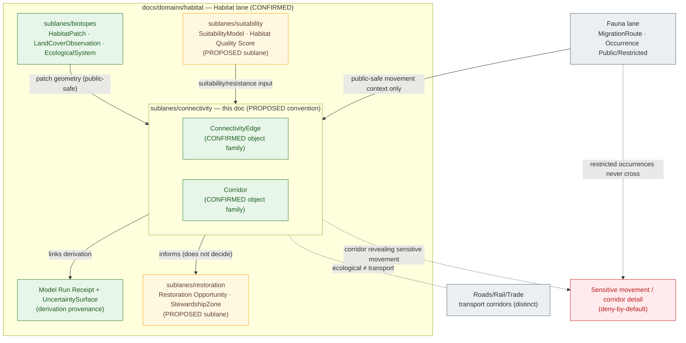

<!-- [KFM_META_BLOCK_V2]
doc_id: kfm://doc/<uuid>                                   # placeholder — assign on intake
title: Habitat Sublane — Connectivity
type: standard
version: v1
status: draft
owners: TODO — Habitat domain steward; Docs steward      # placeholder — confirm via CODEOWNERS
created: 2026-06-04
updated: 2026-06-04
policy_label: public
related:
  - docs/domains/habitat/README.md
  - docs/domains/habitat/sublanes/README.md
  - docs/domains/habitat/sublanes/biotopes.md
  - docs/doctrine/ai-build-operating-contract.md           # canonical operating contract
  - docs/doctrine/directory-rules.md
  - docs/doctrine/lifecycle-law.md
  - docs/doctrine/trust-membrane.md
  - docs/domains/fauna/README.md
tags: [kfm, domain, habitat, sublane, connectivity, corridor, ConnectivityEdge]
notes:
  - "CONTRACT_VERSION = 3.0.0 pinned (doctrine-adjacent)."
  - "Sublanes are a PROPOSED docs/ organizational tier; convention not yet established in Directory Rules."
  - "ConnectivityEdge and Corridor are CONFIRMED Habitat-owned object families; field realization PROPOSED."
  - "Connectivity products are DERIVED; they never become canonical truth and deny sensitive movement detail by default."
  - "All implementation-layer claims remain PROPOSED until verified against mounted repo evidence."
[/KFM_META_BLOCK_V2] -->

# Habitat Sublane — Connectivity

> Scopes the **landscape-connectivity** slice of the Habitat domain — `ConnectivityEdge` and `Corridor` as evidence-backed, derived products — and the rules that keep them honest, public-safe, and reversible.

**Status:** Draft  ·  **Owners:** TODO — Habitat domain steward; Docs steward  ·  **Updated:** 2026-06-04

> [!IMPORTANT]
> Connectivity products are **derived**. A `ConnectivityEdge` or `Corridor` is computed from habitat patches, suitability, and resistance assumptions — it is **never** a primary observation and **never** outranks the evidence it was built from. Derived-stays-derived applies: the model's output does not become canonical truth, and a corridor that would reveal a sensitive species' movement path **denies by default**.

---

## Quick jump

- [1. Sublane identity and one-line purpose](#1-sublane-identity-and-one-line-purpose)
- [2. Scope and boundary](#2-scope-and-boundary)
- [3. Sublane concept and authority posture](#3-sublane-concept-and-authority-posture)
- [4. Objects & identity](#4-objects--identity)
- [5. Derivation (derived stays derived)](#5-derivation-derived-stays-derived)
- [6. Inputs & source roles](#6-inputs--source-roles)
- [7. Sublane shape and relations (diagram)](#7-sublane-shape-and-relations-diagram)
- [8. Sensitivity, rights, and publication posture](#8-sensitivity-rights-and-publication-posture)
- [9. Pipeline placement (RAW → PUBLISHED)](#9-pipeline-placement-raw--published)
- [10. Cross-sublane and cross-lane relations](#10-cross-sublane-and-cross-lane-relations)
- [11. Governed AI behavior for this sublane](#11-governed-ai-behavior-for-this-sublane)
- [12. Validators, tests, fixtures](#12-validators-tests-fixtures)
- [13. Open questions and verification backlog](#13-open-questions-and-verification-backlog)
- [14. Related docs](#14-related-docs)
- [Appendix A — Sublane conformance checklist](#appendix-a--sublane-conformance-checklist)

---

## 1. Sublane identity and one-line purpose

> **CONFIRMED doctrine / PROPOSED sublane application.** The **Connectivity** sublane scopes how the Habitat lane represents the linkage between habitat areas — the edges that connect patches (`ConnectivityEdge`) and the spatial corridors that carry that linkage on the ground (`Corridor`) — as evidence-backed, derived, public-safe products. It does **not** classify habitat type, score suitability, decide restoration priority, or assert species occurrence.

A connectivity product answers *"how are these habitat areas linked, under which assumptions, according to which evidence, at what time?"* — and carries the uncertainty and source-role of every input it was derived from. `[DOM-HAB] [DOM-HF] [ENCY]`

[⬆ Back to top](#quick-jump)

---

## 2. Scope and boundary

### 2.1 What this sublane covers

| Concern | KFM object family | Owning lane | Sublane treatment |
|---|---|---|---|
| Linkage between habitat areas | `ConnectivityEdge` | Habitat (CONFIRMED) | Edge identity, derivation provenance, uncertainty, public-safe geometry |
| On-the-ground movement corridor | `Corridor` | Habitat (CONFIRMED) | Corridor identity, vintage, model-run linkage, generalization before release |
| Derivation provenance | `Model Run Receipt` (cited) | Habitat | Every connectivity product links the run that produced it |
| Uncertainty of the linkage | `UncertaintySurface` (cited) | Habitat | Connectivity confidence travels with the product |

### 2.2 What this sublane explicitly does **not** cover

- **Habitat type / classification.** Owned by the biotopes slice via `HabitatPatch`, `LandCoverObservation`, `EcologicalSystem`. *See `docs/domains/habitat/sublanes/biotopes.md`.*
- **Suitability scoring.** Owned via `SuitabilityModel`, `Habitat Quality Score`. Connectivity *consumes* suitability as input; it does not produce it. *Proposed home: `docs/domains/habitat/sublanes/suitability.md`.*
- **Restoration / stewardship.** Owned via `Restoration Opportunity`, `StewardshipZone`. Connectivity *informs* restoration framing; it does not decide it.
- **Animal movement as species truth.** Fauna owns `MigrationRoute`, `SeasonalRange`, and occurrence. A habitat `Corridor` is a habitat-structure derivative; it MUST NOT be presented as an observed animal movement path. `[DOM-FAUNA]`
- **Transport / trade corridors.** Roads/Rail/Trade owns transport corridors and route graphs; a habitat `Corridor` is ecological, not a transport facility. `[DOM-RRT]`

> [!NOTE]
> The Habitat lane owns the full object spine (`HabitatPatch`, `LandCoverObservation`, `EcologicalSystem`, `Habitat Quality Score`, `SuitabilityModel`, `ConnectivityEdge`, `Corridor`, `Restoration Opportunity`, `StewardshipZone`, `Model Run Receipt`, `UncertaintySurface`). `[DOM-HAB] [DOM-HF] [ENCY]` This sublane re-groups two of those families for documentation clarity and **MUST NOT** introduce parallel object families, schemas, contracts, or policy.

[⬆ Back to top](#quick-jump)

---

## 3. Sublane concept and authority posture

A **sublane** is a `docs/`-layer thematic grouping inside a single domain folder. All authority — schemas, contracts, policy, releases, tests, fixtures — remains at the Habitat lane level under the appropriate responsibility root.

> [!WARNING]
> **PROPOSED convention — not yet established in Directory Rules.** The `docs/domains/<domain>/sublanes/` directory is **not** referenced in `docs/doctrine/directory-rules.md` (CONFIRMED check this session). A `docs/`-internal sub-tier is most likely a **§17 routine-PR** change rather than a §2.4 ADR trigger (it adds no canonical root, schema home, lifecycle phase, or parallel authority). Until settled, treat this file's **placement** as PROPOSED while its **content** inherits the Habitat lane's CONFIRMED doctrine. Reconcile via the `docs/domains/habitat/sublanes/README.md` index or a drift entry in `docs/registers/DRIFT_REGISTER.md`.

**This sublane is never allowed to:**

- Become a root folder (`connectivity/` at repo root → forbidden by Directory Rules §3 and §12 Domain Placement Law).
- Create a parallel `schemas/connectivity/`, `policy/connectivity/`, `contracts/connectivity/`, or `data/.../connectivity/`. Those live under the **Habitat** domain segment.
- Redefine `ConnectivityEdge` or `Corridor`. Object meaning lives in `contracts/`; field shape lives in `schemas/`.
- Publish a connectivity product outside the governed API or without a `ReleaseManifest`, `EvidenceBundle`, validation/policy support, review state where required, correction path, and rollback target. `[DOM-HAB §M] [ENCY Appendix E]`

[⬆ Back to top](#quick-jump)

---

## 4. Objects & identity

| Object | Owning lane | Purpose | Identity rule | Temporal handling |
|---|---|---|---|---|
| `ConnectivityEdge` | Habitat | Represents `ConnectivityEdge` evidence or released derivative within Habitat. | PROPOSED deterministic basis: `source id + object role + temporal scope + normalized digest` | CONFIRMED: source, observed, valid, retrieval, release, and correction times stay distinct where material |
| `Corridor` | Habitat | Represents `Corridor` evidence or released derivative within Habitat. | PROPOSED deterministic basis: `source id + object role + temporal scope + normalized digest` | CONFIRMED: source, observed, valid, retrieval, release, and correction times stay distinct where material |

Both are **CONFIRMED Habitat-owned object families** with **PROPOSED field realization** — their meaning is constrained by source role, evidence, time, and release state. `[DOM-HAB] [DOM-HF] [ENCY]`

> [!NOTE]
> A `Corridor` is a derived linkage product whose identity must include the **derivation parameters** (resistance assumptions, input vintage, model run) so that two corridors built from different assumptions are not collapsed into one identity. The exact field set is **PROPOSED**; verify against `schemas/contracts/v1/domains/habitat/`.

[⬆ Back to top](#quick-jump)

---

## 5. Derivation (derived stays derived)

Connectivity products are computed, not observed. The corpus is explicit that derived layers do not replace canonical truth and that modeled outputs stay labeled as such.

> [!CAUTION]
> **Derived-stays-derived.** A `ConnectivityEdge` / `Corridor`:
> - is a **model output**, never a primary observation;
> - MUST link its `Model Run Receipt` and carry its `UncertaintySurface`;
> - MUST NOT be presented with more confidence than its weakest input supports;
> - MUST NOT be promoted to the authority of a regulatory designation or an observed movement record;
> - inherits the **source role** and **sensitivity** of every input — a corridor derived from a sensitive occurrence is itself sensitive.

| Derivation concern | Posture | Status |
|---|---|---|
| Input → output traceability | Every product links its run + inputs via `EvidenceBundle` | CONFIRMED doctrine / PROPOSED impl |
| Resistance / cost assumptions | Recorded as part of the run, surfaced in the product | PROPOSED |
| Uncertainty | Travels with the product (`UncertaintySurface`) | CONFIRMED doctrine / PROPOSED impl |
| Re-derivation on input change | New release + correction/rollback path, not a silent overwrite | CONFIRMED doctrine |
| Method (least-cost path, circuit/resistance, graph) | Documented per run; KFM does not endorse one method as truth | NEEDS VERIFICATION |

[⬆ Back to top](#quick-jump)

---

## 6. Inputs & source roles

Connectivity is derived primarily from **other Habitat products** plus context layers. Source roles (authority / observation / context / model) are preserved per the CONFIRMED rule that role cannot be inferred from convenience. `[DOM-HAB] [DOM-HF] [ENCY]`

| Input | Origin | Typical role | Constraint |
|---|---|---|---|
| Habitat patches | Habitat (biotopes slice) | observation / context | Public-safe geometry; sensitive patches denied |
| Suitability / quality surfaces | Habitat (suitability slice) | model | Modeled; never published as critical habitat |
| Land cover | Habitat (`LandCoverObservation`) | observation / context | Native classification preserved; advisory crosswalks |
| Resistance / barrier context | context layers (e.g., roads, land cover) | context | Cite owning lane; never re-assert its truth |
| Fauna movement context | Fauna (`MigrationRoute`, public-safe only) | context | Public-safe occurrences only; restricted never cross |

> [!CAUTION]
> No connectivity product may be promoted to `PUBLISHED` while any input's **role**, **rights**, **sensitivity**, or **vintage** is unresolved. *Cite-or-abstain* applies, and a single sensitive input taints the whole derived product until generalized. `[ENCY] [DIRRULES]`

[⬆ Back to top](#quick-jump)

---

## 7. Sublane shape and relations (diagram)

> [!NOTE]
> Amber boxes are **PROPOSED** sublanes. The deny-by-default node enforces the CONFIRMED Habitat ↔ Fauna posture: only public-safe occurrences feed habitat evaluation, restricted occurrences never cross, and habitat geometry is admitted to public/3D surfaces only when generalized. `[DOM-HAB] [DOM-FAUNA]`

[⬆ Back to top](#quick-jump)

---

## 8. Sensitivity, rights, and publication posture

> [!CAUTION]
> **A corridor can leak what a point hides.** Even when individual occurrences are withheld, a published `Corridor` can reveal the movement path of a sensitive species — connecting two generalized areas into a precise inference. Connectivity products that would expose sensitive movement, nests/dens/roosts/hibernacula/spawning linkage, or steward-controlled detail **deny by default** and may be released only as a generalized, public-safe derivative with a recorded transform. `[ENCY §20.5 Deny-by-Default Register] [Operating Contract §23.2] [DOM-FAUNA]`

Applied posture:

- **Deny-by-default promotion gate.** Unclear rights, unresolved source role, missing evidence, unresolved sensitivity, or absent release state **blocks public promotion.** `[ENCY] [DIRRULES]` *(CONFIRMED.)*
- **Sensitive-input taint.** A connectivity product derived from any sensitive input is sensitive until generalized; the `Geoprivacy transform` + `Redaction Receipt` + public-safe derivative chain applies before release. `[DOM-FAUNA] [ENCY §20.5]`
- **Most-restrictive-row rule.** Per the operating contract's §23.2 sensitive-domain matrix, when no row clearly matches: `DENY` exact exposure, `GENERALIZE` before publication, `REDACT` when needed, `REQUIRE` steward review, `REQUIRE` a `RedactionReceipt`, and `ABSTAIN` when support is inadequate.
- **Derived honesty.** The model-vs-observation and modeled-vs-regulatory distinctions MUST NOT be flattened; a corridor is never a regulatory designation. `[DOM-HAB]`
- **3D admission.** Connectivity geometry follows Spatial Foundation rules: generalized geometry only; sensitive structure denied. `[DOM-HAB] [MAP-MASTER]`

[⬆ Back to top](#quick-jump)

---

## 9. Pipeline placement (RAW → PUBLISHED)

CONFIRMED doctrine / PROPOSED sublane application. Connectivity products follow the Habitat lane's pipeline shape **exactly**; the sublane introduces no new stage, and the derivation run is itself a governed, receipted step. `[DIRRULES] [DOM-HAB §H] [ENCY]`

| Stage | Sublane handling | Gate | Status |
|---|---|---|---|
| **RAW** | Reference the input products (patches, suitability, context) by identity + hash; no raw "connectivity source" exists — inputs are themselves governed. | Input `EvidenceRef`s resolve. | PROPOSED |
| **WORK / QUARANTINE** | Run the derivation; normalize geometry (CRS, generalization tolerance), record resistance assumptions, uncertainty, identity, and policy. Hold sensitive-input or rights-unresolved cases. | Validation + policy gate pass, or quarantine reason recorded. | PROPOSED |
| **PROCESSED** | Emit validated `ConnectivityEdge` / `Corridor` records with `EvidenceRef`, `Model Run Receipt` link, `UncertaintySurface`, and public-safe candidates. | `EvidenceRef`, `ValidationReport`, `Model Run Receipt`, digest closure exist. | PROPOSED |
| **CATALOG / TRIPLET** | Emit catalog records, `EvidenceBundle`, graph/triplet projections, release candidates with derivation-vintage badges. | Catalog/proof closure passes. | PROPOSED |
| **PUBLISHED** | Serve released public-safe connectivity artifacts through governed APIs and manifests. | `ReleaseManifest`, correction path, rollback target, review/policy state exist. | PROPOSED |

CONFIRMED invariant: **promotion is a governed state transition, not a file move.** `[DIRRULES] [LIFECYCLE-LAW]`

> [!NOTE]
> Watcher-as-non-publisher applies: a connectivity recompute watcher (e.g., re-deriving on input change) observes and records; it does **not** promote. PROPOSED.

[⬆ Back to top](#quick-jump)

---

## 10. Cross-sublane and cross-lane relations

### 10.1 Within the Habitat lane

| This sublane | Related sublane (PROPOSED) | Relation | Constraint |
|---|---|---|---|
| Connectivity | Biotopes | Consumes patch geometry + ecological-system labels as derivation input. | Patch geometry must be public-safe; observation labels not flattened. |
| Connectivity | Suitability | Consumes suitability/resistance surfaces as derivation input. | Modeled input stays labeled modeled; uncertainty propagates. |
| Connectivity | Restoration | Provides linkage gaps as input to `Restoration Opportunity` framing. | Restoration framing is advisory, never an instruction. |

### 10.2 Across lanes

| Relation | Lane | Constraint | Citation |
|---|---|---|---|
| Connectivity ↔ **Fauna** — movement context | Fauna | Public-safe movement context only; `MigrationRoute` is Fauna-owned; restricted occurrences never cross; a habitat `Corridor` ≠ an observed animal route. | `[DOM-HAB]` `[DOM-FAUNA]` |
| Connectivity ↔ **Roads/Rail/Trade** — barrier / fragmentation context | Roads/Rail/Trade | Transport corridors are RRT-owned and distinct; roads cited only as barrier/resistance context. | `[DOM-HAB]` `[DOM-RRT]` |
| Connectivity ↔ **Hazards** — disturbance/fragmentation context | Hazards | Context only; not regulatory; KFM is never an alert authority. | `[DOM-HAB]` `[DOM-HAZ]` |
| Connectivity ↔ **Spatial Foundation / Planetary 3D** | Spatial Foundation | Admitted to 3D scenes only via generalized geometry; sensitive structure denied. | `[MAP-MASTER]` `[DOM-HAB]` |

[⬆ Back to top](#quick-jump)

---

## 11. Governed AI behavior for this sublane

CONFIRMED doctrine / PROPOSED implementation. AI behavior for connectivity content is the Habitat lane's behavior, inherited without modification. `[GAI] [DOM-HAB §L] [ENCY]`

| AI behavior | Rule |
|---|---|
| **Allowed** | Evidence-bounded summarization over released connectivity `EvidenceBundles`; citation-backed explanation of derivation assumptions and uncertainty; vintage comparison; corridor-vs-observed-route clarification. |
| **Required abstention** | When evidence is insufficient, when inputs disagree without a release decision, when derivation uncertainty is unresolved, or when the requested resolution exceeds input support. |
| **Required denial** | Direct RAW/WORK/QUARANTINE access; exposure of sensitive movement/corridor detail (deny-by-default); presenting a derived corridor as observed animal movement or as a regulatory designation; uncited authoritative connectivity claims at precise locations; emergency or land-management instruction (this sublane never instructs). |
| **Receipt** | Emit `AIReceipt` and `RuntimeResponseEnvelope` with outcome `ANSWER / ABSTAIN / DENY / ERROR`, `evidence_refs`, `policy_decision`, and `citation_validation`. |

[⬆ Back to top](#quick-jump)

---

## 12. Validators, tests, fixtures

All items below are **PROPOSED** and inherit Habitat-lane PROPOSED validators per `[DOM-HAB §K]`. No new home: tests live under `tests/domains/habitat/`; fixtures under `fixtures/domains/habitat/`. `[DIRRULES §12]`

<strong>Proposed validators and tests (click to expand)</strong>

- **PROPOSED — Derivation-provenance tests.** Every `ConnectivityEdge` / `Corridor` MUST link a `Model Run Receipt` and resolve its input `EvidenceRef`s.
- **PROPOSED — Uncertainty-propagation tests.** A connectivity product MUST NOT report higher confidence than its weakest input supports.
- **PROPOSED — Derived-as-observed denial tests.** A `Corridor` MUST NOT be presentable as an observed animal `MigrationRoute` or as a regulatory designation.
- **PROPOSED — Sensitive-input taint tests.** A product derived from a sensitive input fails closed unless a `Redaction Receipt` + public-safe derivative exists.
- **PROPOSED — Geoprivacy / generalization tests.** Public-safe corridor geometry only; exact movement detail denied.
- **PROPOSED — Catalog closure tests.** Every connectivity `EvidenceBundle` resolves to a closed catalog entry with hashed `EvidenceRef`s.
- **PROPOSED — Re-derivation correctness tests.** Input change produces a new release with correction/rollback linkage, not a silent overwrite.
- **PROPOSED — No-network fixtures.** Connectors/derivation runs remain inactive until activation, fixtures, validators, and policy gates exist.

[⬆ Back to top](#quick-jump)

---

## 13. Open questions and verification backlog

| Item to verify | Evidence that would settle it | Status |
|---|---|---|
| Whether `docs/domains/<domain>/sublanes/` is a permitted `docs/`-only convention. | Accepted ADR, Directory Rules reference, or `docs/domains/habitat/sublanes/README.md` entry. | **NEEDS VERIFICATION** |
| `ConnectivityEdge` / `Corridor` schema shape and identity field set. | Mounted repo `schemas/contracts/v1/domains/habitat/` + ADR-0001 conformance. | **NEEDS VERIFICATION** |
| Which connectivity method(s) KFM admits (least-cost, circuit/resistance, graph) and how method is recorded. | Mounted repo derivation code, model-run schema, validators. | **NEEDS VERIFICATION** |
| Whether sensitive-input taint is enforced by validator (not convention). | Mounted repo policy + redaction-receipt tests. | **NEEDS VERIFICATION** |
| Whether `Model Run Receipt` and `UncertaintySurface` linkage is required at publication. | Mounted repo release gates + manifests. | **NEEDS VERIFICATION** |
| Whether the Habitat MapLibre overlay registry exposes connectivity layers and respects Focus behavior. | Mounted repo layer registry + Evidence Drawer wiring. | **NEEDS VERIFICATION** |
| Whether `ConnectivityEdge` + `Corridor` should be one sublane or split. | Habitat steward decision; sublane index reconciliation. | **PROPOSED — owner decision** |

[⬆ Back to top](#quick-jump)

---

## 14. Related docs

> [!NOTE]
> Some links below are TODO placeholders pending verification of the docs tree against the mounted repo.

- [`docs/domains/habitat/README.md`](../README.md) — Habitat domain landing (TODO — verify presence).
- [`docs/domains/habitat/sublanes/README.md`](./README.md) — Habitat sublane index (TODO — verify presence).
- [`docs/domains/habitat/sublanes/biotopes.md`](./biotopes.md) — Biotopes sublane (patch/land-cover/ecological-system inputs).
- [`docs/doctrine/ai-build-operating-contract.md`](../../../doctrine/ai-build-operating-contract.md) — Canonical operating contract (`CONTRACT_VERSION = "3.0.0"`).
- [`docs/doctrine/directory-rules.md`](../../../doctrine/directory-rules.md) — Placement law; §3 deeper rule, §12 Domain Placement Law.
- [`docs/doctrine/lifecycle-law.md`](../../../doctrine/lifecycle-law.md) — RAW → PUBLISHED governance (TODO — verify presence).
- [`docs/doctrine/trust-membrane.md`](../../../doctrine/trust-membrane.md) — Governed-API-only consumption (TODO — verify presence).
- [`docs/domains/fauna/README.md`](../../fauna/README.md) — `MigrationRoute`, sensitive occurrence, geoprivacy (TODO — verify presence).

[⬆ Back to top](#quick-jump)

---

## Appendix A — Sublane conformance checklist

For reviewers proposing connectivity content into the Habitat lane.

<strong>Pre-merge checklist (click to expand)</strong>

- [ ] Every `ConnectivityEdge` / `Corridor` links a `Model Run Receipt` and resolves its input `EvidenceRef`s.
- [ ] Uncertainty (`UncertaintySurface`) travels with the product and is not overstated.
- [ ] Derived status is explicit; the product is not presented as observation or regulatory designation.
- [ ] A `Corridor` is not presented as an observed animal `MigrationRoute` (Fauna-owned).
- [ ] A habitat `Corridor` is not conflated with a transport corridor (Roads/Rail/Trade-owned).
- [ ] Sensitive-input taint handled: any sensitive-derived product fails closed unless `Geoprivacy transform` + `Redaction Receipt` + public-safe derivative exist.
- [ ] No product reaches `PUBLISHED` without `ReleaseManifest` + `EvidenceBundle` + validation/policy support + review state (where required) + correction path + rollback target.
- [ ] No parallel schema/contract/policy home is created under "connectivity"; files live under the **Habitat** domain segment.
- [ ] Path-validation checklist (Directory Rules §16) applied for any new path.
- [ ] The `sublanes/` convention is covered by an ADR or the `sublanes/README.md` index.

[⬆ Back to top](#quick-jump)

---

**Related docs:** [Habitat README](../README.md) · [Sublane index](./README.md) · [Biotopes](./biotopes.md) · [Operating Contract](../../../doctrine/ai-build-operating-contract.md) · [Directory Rules](../../../doctrine/directory-rules.md) · [Fauna README](../../fauna/README.md)

**Last updated:** 2026-06-04 · **Doc version:** v1 · **Status:** Draft · `CONTRACT_VERSION = "3.0.0"` · [⬆ Back to top](#quick-jump)
