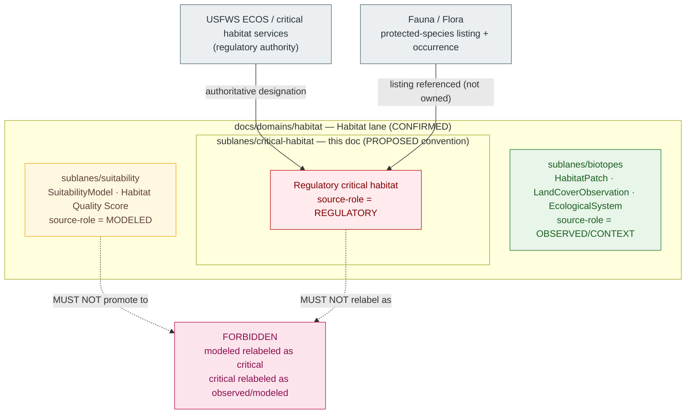

<!-- [KFM_META_BLOCK_V2]
doc_id: kfm://doc/<uuid>                                   # placeholder — assign on intake
title: Habitat Sublane — Regulatory Critical Habitat
type: standard
version: v1
status: draft
owners: TODO — Habitat domain steward; Docs steward      # placeholder — confirm via CODEOWNERS
created: 2026-06-04
updated: 2026-06-04
policy_label: public
related:
  - docs/domains/habitat/README.md
  - docs/domains/habitat/sublanes/README.md
  - docs/domains/habitat/sublanes/biotopes.md
  - docs/domains/habitat/sublanes/connectivity.md
  - docs/doctrine/ai-build-operating-contract.md           # canonical operating contract
  - docs/doctrine/directory-rules.md
  - docs/doctrine/lifecycle-law.md
  - docs/domains/fauna/README.md
  - docs/domains/flora/README.md
tags: [kfm, domain, habitat, sublane, critical-habitat, regulatory, source-role]
notes:
  - "CONTRACT_VERSION = 3.0.0 pinned (doctrine-adjacent)."
  - "Critical habitat is a REGULATORY source-role designation, never an observation or a model."
  - "Source-role anti-collapse is the entire point of this sublane: critical habitat MUST NOT be flattened with modeled habitat."
  - "Sublanes are a PROPOSED docs/ organizational tier; convention not yet established in Directory Rules."
  - "All implementation-layer claims remain PROPOSED until verified against mounted repo evidence."
[/KFM_META_BLOCK_V2] -->

# Habitat Sublane — Regulatory Critical Habitat

> Scopes how the Habitat domain ingests, labels, and serves **regulatory critical habitat** — a legal designation carrying the **Regulatory** source-role — and the anti-collapse rules that keep it from ever masquerading as a model or an observation.

**Status:** Draft  ·  **Owners:** TODO — Habitat domain steward; Docs steward  ·  **Updated:** 2026-06-04

> [!IMPORTANT]
> **The one rule that defines this sublane.** Regulatory critical habitat is a **Regulatory** designation — an authoritative legal determination by a governing body. It MUST be cited as regulatory context and **never** relabeled as an observation or a modeled estimate. Conversely, no modeled or suitability surface may ever be promoted to the authority of designated critical habitat. This is the CONFIRMED **source-role anti-collapse** rule. `[ENCY §24.1] [DOM-HAB]`

---

## Quick jump

- [1. Sublane identity and one-line purpose](#1-sublane-identity-and-one-line-purpose)
- [2. Scope and boundary](#2-scope-and-boundary)
- [3. Sublane concept and authority posture](#3-sublane-concept-and-authority-posture)
- [4. Source-role: Regulatory](#4-source-role-regulatory)
- [5. Anti-collapse — the core rule](#5-anti-collapse--the-core-rule)
- [6. Source & rights](#6-source--rights)
- [7. Sublane shape and relations (diagram)](#7-sublane-shape-and-relations-diagram)
- [8. Sensitivity, rights, and publication posture](#8-sensitivity-rights-and-publication-posture)
- [9. Pipeline placement (RAW → PUBLISHED)](#9-pipeline-placement-raw--published)
- [10. Cross-sublane and cross-lane relations](#10-cross-sublane-and-cross-lane-relations)
- [11. Governed AI behavior for this sublane](#11-governed-ai-behavior-for-this-sublane)
- [12. Validators, tests, fixtures](#12-validators-tests-fixtures)
- [13. Open questions and verification backlog](#13-open-questions-and-verification-backlog)
- [14. Related docs](#14-related-docs)
- [Appendix A — Sublane conformance checklist](#appendix-a--sublane-conformance-checklist)

---

## 1. Sublane identity and one-line purpose

> **CONFIRMED doctrine / PROPOSED sublane application.** The **Regulatory Critical Habitat** sublane scopes how the Habitat lane handles designated critical habitat as an evidence-backed, source-role-bounded layer: ingested from the regulatory authority, labeled as regulatory, served public-safe, and kept strictly distinct from modeled habitat, suitability, and species occurrence.

"Regulatory critical habitat" is a **CONFIRMED term** in the Habitat lane, with meaning constrained by source role, evidence, time, and release state. `[DOM-HAB] [DOM-HF] [ENCY]` It is not a habitat *type* (that is the biotopes slice) and not a *model output* (that is the suitability slice) — it is a legal designation that KFM mirrors faithfully and labels honestly.

[⬆ Back to top](#quick-jump)

---

## 2. Scope and boundary

### 2.1 What this sublane covers

| Concern | Treatment | Status |
|---|---|---|
| Designated critical habitat units (from the regulatory authority) | Ingest, label `Regulatory`, preserve designation vintage, serve public-safe | CONFIRMED doctrine / PROPOSED impl |
| Source-role labeling | Every critical-habitat artifact carries the `Regulatory` role badge | CONFIRMED |
| Designation vintage / effective time | Surfaced on every view; designations change over time | CONFIRMED (temporal-distinctness) |
| Public-safe presentation | Critical habitat view distinct from modeled habitat view | CONFIRMED viewing products |

### 2.2 What this sublane explicitly does **not** cover

- **Modeled habitat / suitability.** Owned via `SuitabilityModel`, `Habitat Quality Score`. A model is `Modeled` source-role; it is **never** critical habitat. *See `docs/domains/habitat/sublanes/suitability.md` (PROPOSED).*
- **Habitat type / classification.** Owned via `HabitatPatch`, `LandCoverObservation`, `EcologicalSystem`. *See `docs/domains/habitat/sublanes/biotopes.md`.*
- **Species listing / occurrence.** Protected-species listing is itself a Fauna/Flora regulatory concern; occurrence is Fauna/Flora-owned. Critical habitat *references* a listed species but does not own the taxon or its occurrences. `[DOM-FAUNA] [DOM-FLORA]`
- **Connectivity / corridors.** Owned via the connectivity sublane; a corridor is `Modeled`, not regulatory.
- **Enforcement or legal advice.** KFM mirrors the designation as evidence; it is **not** a regulatory authority and issues no determinations.

> [!NOTE]
> The Habitat lane defines both a **critical habitat view** and a separate **modeled habitat view** among its viewing products — the UI itself encodes the anti-collapse boundary. `[DOM-HAB §G]` *(CONFIRMED.)*

[⬆ Back to top](#quick-jump)

---

## 3. Sublane concept and authority posture

A **sublane** is a `docs/`-layer thematic grouping inside a single domain folder. All authority — schemas, contracts, policy, releases, tests, fixtures — remains at the Habitat lane level under the appropriate responsibility root.

> [!WARNING]
> **PROPOSED convention — not yet established in Directory Rules.** The `docs/domains/<domain>/sublanes/` directory is **not** referenced in `docs/doctrine/directory-rules.md` (CONFIRMED check this session). A `docs/`-internal sub-tier is most likely a **§17 routine-PR** change rather than a §2.4 ADR trigger. Until settled, treat this file's **placement** as PROPOSED while its **content** inherits the Habitat lane's CONFIRMED doctrine. Reconcile via the `sublanes/README.md` index or a drift entry in `docs/registers/DRIFT_REGISTER.md`.

**This sublane is never allowed to:**

- Become a root folder (`critical-habitat/` at repo root → forbidden by Directory Rules §3 and §12).
- Create a parallel `schemas/`, `policy/`, `contracts/`, or `data/` home under "critical-habitat". Those live under the **Habitat** domain segment.
- Re-define "Regulatory critical habitat" — meaning lives in `contracts/`; field shape lives in `schemas/`.
- Present critical habitat as observed or modeled, or present a model as critical habitat (see [§5](#5-anti-collapse--the-core-rule)).
- Publish critical-habitat content outside the governed API or without a `ReleaseManifest`, `EvidenceBundle`, validation/policy support, review state where required, correction path, and rollback target. `[DOM-HAB §M] [ENCY Appendix E]`

[⬆ Back to top](#quick-jump)

---

## 4. Source-role: Regulatory

KFM treats **source role as a first-class identity attribute**. Critical habitat sits squarely in the `Regulatory` class of the Master Source-Role Anti-Collapse Register. `[ENCY §24.1]` *(CONFIRMED doctrine.)*

| Role | Definition | Critical-habitat fit | Allowed downstream use |
|---|---|---|---|
| **Regulatory** | An authoritative determination by a regulatory or governing body with legal or administrative force. | **Designated critical habitat unit** is a named canonical example. | Cite as regulatory context; **never** labeled an observed event or a modeled estimate. |
| Observed | A direct reading or first-hand evidentiary record. | ✗ — critical habitat is not a field observation. | — |
| Modeled | A derived product from inputs/assumptions; uncertainty preserved. | ✗ — a suitability surface is modeled, not regulatory. | — |

> [!CAUTION]
> A critical-habitat artifact MUST carry its `Regulatory` source-role explicitly. The lifecycle and the governed API **fail closed when source roles are conflated.** `[ENCY §24.1]`

[⬆ Back to top](#quick-jump)

---

## 5. Anti-collapse — the core rule

This is the doctrinal heart of the sublane. The corpus states it repeatedly and in two directions.

> [!CAUTION]
> **Bidirectional anti-collapse:**
> 1. **Modeled → Regulatory is forbidden.** A `SuitabilityModel`, `Habitat Quality Score`, or any modeled surface MUST NOT be presented as, badged as, or promoted to the authority of designated critical habitat. The Habitat lane carries explicit **"modeled-as-critical denial tests."** `[DOM-HAB §K]`
> 2. **Regulatory → Observed/Modeled is forbidden.** Critical habitat MUST NOT be relabeled as an observation or a modeled estimate; it is cited as regulatory context only. `[ENCY §24.1]`

| Anti-collapse concern | Rule | Status |
|---|---|---|
| Regulatory critical habitat, modeled habitat, species range, occurrence points, and landscape context **must not be flattened** | CONFIRMED Habitat posture; distinctions preserved at every surface | CONFIRMED `[DOM-HAB §I]` |
| Critical habitat view vs modeled habitat view | Separate viewing products; never merged into one "habitat" layer | CONFIRMED `[DOM-HAB §G]` |
| Source-role badge | Required on every artifact; `Regulatory` for critical habitat | CONFIRMED doctrine / PROPOSED impl |
| Validator enforcement | "critical habitat source-role tests" + "modeled-as-critical denial tests" | PROPOSED `[DOM-HAB §K]` |

[⬆ Back to top](#quick-jump)

---

## 6. Source & rights

| Source family | Role | Rights / sensitivity | Freshness | Status |
|---|---|---|---|---|
| **USFWS ECOS / critical habitat services** | **authority (regulatory designation)** | rights and current terms NEEDS VERIFICATION; sensitive joins fail closed | source-vintage / cadence specific | `[DOM-HAB] [DOM-HF] [ENCY]` |
| **KDWP state review context** | authority / context as role requires | rights NEEDS VERIFICATION; sensitive joins fail closed | source-vintage specific | `[DOM-HAB]` |

> [!CAUTION]
> **Rights and current terms for USFWS ECOS are NEEDS VERIFICATION** and must be confirmed against the live service terms before publication. No critical-habitat claim may be promoted to `PUBLISHED` while rights, source role, or designation vintage is unresolved. `[ENCY] [DIRRULES]`

> [!NOTE]
> A protected-species *listing* is also a `Regulatory` determination but is owned by the **Fauna/Flora** lanes. This sublane references the listing that a critical-habitat unit pertains to; it does not own the species record. `[DOM-FAUNA] [DOM-FLORA]`

[⬆ Back to top](#quick-jump)

---

## 7. Sublane shape and relations (diagram)

> [!NOTE]
> The forbidden node encodes the CONFIRMED bidirectional anti-collapse rule. Critical habitat (`Regulatory`), suitability (`Modeled`), and habitat type (`Observed`/context) stay in distinct lanes with distinct source-role badges. `[ENCY §24.1] [DOM-HAB]`

[⬆ Back to top](#quick-jump)

---

## 8. Sensitivity, rights, and publication posture

CONFIRMED Habitat posture per `[DOM-HAB §I]`:

- **No flattening.** Regulatory critical habitat, modeled habitat, species range, occurrence points, and landscape context MUST NOT be flattened. `[DOM-HAB §I]`
- **Sensitive joins fail closed.** A critical-habitat unit joined to a sensitive species' exact site (nest, den, roost, hibernaculum, spawning area) denies by default; only a generalized, public-safe derivative may be released with a recorded transform (`Geoprivacy transform` + `Redaction Receipt`). `[ENCY §20.5] [DOM-FAUNA]`
- **Promotion gate.** Unclear rights, unresolved source role, missing evidence, unresolved sensitivity, or absent release state **blocks public promotion.** `[ENCY] [DIRRULES]`
- **Most-restrictive-row rule.** Per the operating contract's §23.2 sensitive-domain matrix, when no row clearly matches: `DENY` exact exposure, `GENERALIZE` before publication, `REDACT` when needed, `REQUIRE` steward review, `REQUIRE` a `RedactionReceipt`, and `ABSTAIN` when support is inadequate.

> [!NOTE]
> Critical-habitat *designation geometry* is generally public (it is a published regulatory product), but a **join** that re-exposes a sensitive species' precise location is treated under the deny-by-default register. Publish the designation; deny the harmful inference.

[⬆ Back to top](#quick-jump)

---

## 9. Pipeline placement (RAW → PUBLISHED)

CONFIRMED doctrine / PROPOSED sublane application. Critical-habitat artifacts follow the Habitat lane's pipeline shape **exactly**; the sublane introduces no new stage. `[DIRRULES] [DOM-HAB §H] [ENCY]`

| Stage | Sublane handling | Gate | Status |
|---|---|---|---|
| **RAW** | Capture the regulatory source payload/reference (USFWS ECOS) with source role = `Regulatory`, rights, sensitivity, citation, designation vintage, and hash. | `SourceDescriptor` exists; role recorded as `Regulatory`. | PROPOSED |
| **WORK / QUARANTINE** | Normalize geometry, designation effective time, identity, rights, policy. Hold rights-unresolved or role-ambiguous cases. | Validation + policy gate pass, or quarantine reason recorded. | PROPOSED |
| **PROCESSED** | Emit validated critical-habitat records with `EvidenceRef`, `ValidationReport`, `Regulatory` badge, and public-safe candidates. | `EvidenceRef`, `ValidationReport`, digest closure exist. | PROPOSED |
| **CATALOG / TRIPLET** | Emit catalog records, `EvidenceBundle`, graph/triplet projections, release candidates with designation-vintage badges. | Catalog/proof closure passes. | PROPOSED |
| **PUBLISHED** | Serve released public-safe critical-habitat artifacts through governed APIs and manifests, on the **critical habitat view**. | `ReleaseManifest`, correction path, rollback target, review/policy state exist. | PROPOSED |

CONFIRMED invariant: **promotion is a governed state transition, not a file move.** `[DIRRULES] [LIFECYCLE-LAW]`

> [!NOTE]
> When a designation changes (added, revised, rescinded), KFM issues a new release with correction/rollback linkage and preserves designation history via distinct effective times — no silent overwrite. `[DOM-HAB §M]`

[⬆ Back to top](#quick-jump)

---

## 10. Cross-sublane and cross-lane relations

### 10.1 Within the Habitat lane

| This sublane | Related sublane (PROPOSED) | Relation | Constraint |
|---|---|---|---|
| Critical habitat | Suitability | Coexist as distinct layers; suitability may be *compared to* critical habitat. | Comparison must keep `Regulatory` vs `Modeled` badges; never merge. |
| Critical habitat | Biotopes | Critical habitat overlays habitat type; type does not imply designation. | Designation is regulatory; type is observation/context. |
| Critical habitat | Connectivity | Designation may inform corridor framing context. | Corridor stays `Modeled`; designation stays `Regulatory`. |

### 10.2 Across lanes

| Relation | Lane | Constraint | Citation |
|---|---|---|---|
| Critical habitat ↔ **Fauna** — listed-species designation context | Fauna | Fauna owns the taxon, listing, and occurrence; sensitive occurrence joins fail closed. | `[DOM-HAB]` `[DOM-FAUNA]` |
| Critical habitat ↔ **Flora** — listed-plant designation context | Flora | Flora owns plant taxa and rare-plant records; exact rare-plant location denied to public. | `[DOM-HAB]` `[DOM-FLORA]` |
| Critical habitat ↔ **Hazards** — exposure context | Hazards | Context only; KFM is never a regulatory or alert authority. | `[DOM-HAB]` `[DOM-HAZ]` |
| Critical habitat ↔ **Spatial Foundation / Planetary 3D** | Spatial Foundation | Generalized geometry for any sensitive join; designation otherwise public. | `[MAP-MASTER]` `[DOM-HAB]` |

[⬆ Back to top](#quick-jump)

---

## 11. Governed AI behavior for this sublane

CONFIRMED doctrine / PROPOSED implementation. AI behavior is the Habitat lane's behavior, inherited without modification. `[GAI] [DOM-HAB §L] [ENCY]`

| AI behavior | Rule |
|---|---|
| **Allowed** | Evidence-bounded summarization over released critical-habitat `EvidenceBundles`; citation-backed explanation of what a designation is and its vintage; clarifying the difference between critical habitat and modeled/suitability surfaces. |
| **Required abstention** | When evidence is insufficient, when designation vintage is unresolved, or when the request exceeds source support. |
| **Required denial** | Presenting a model as critical habitat or critical habitat as observed/modeled (anti-collapse); legal/enforcement determinations (KFM is not a regulatory authority); sensitive species-location exposure via designation joins; uncited authoritative claims; direct RAW/WORK/QUARANTINE access. |
| **Receipt** | Emit `AIReceipt` and `RuntimeResponseEnvelope` with outcome `ANSWER / ABSTAIN / DENY / ERROR`, `evidence_refs`, `policy_decision`, and `citation_validation`. |

[⬆ Back to top](#quick-jump)

---

## 12. Validators, tests, fixtures

All items below are **PROPOSED** and inherit Habitat-lane validators per `[DOM-HAB §K]`. No new home: tests live under `tests/domains/habitat/`; fixtures under `fixtures/domains/habitat/`. `[DIRRULES §12]`

<strong>Proposed validators and tests (click to expand)</strong>

- **PROPOSED — Critical habitat source-role tests.** Every critical-habitat artifact MUST carry the `Regulatory` source-role. *(Named in `[DOM-HAB §K]`.)*
- **PROPOSED — Modeled-as-critical denial tests.** A modeled/suitability surface MUST NOT be admitted or published as critical habitat. *(Named in `[DOM-HAB §K]`.)*
- **PROPOSED — Critical-as-observed/modeled denial tests.** Critical habitat MUST NOT be relabeled as observation or model.
- **PROPOSED — Designation-vintage surfacing tests.** Every published critical-habitat artifact MUST carry designation effective time.
- **PROPOSED — Sensitive-join geoprivacy tests.** Critical-habitat × sensitive-occurrence joins fail closed; `Redaction Receipt` required for any released public-safe derivative.
- **PROPOSED — Catalog closure tests.** Every critical-habitat `EvidenceBundle` resolves to a closed catalog entry with hashed `EvidenceRef`s.
- **PROPOSED — No-network fixtures.** USFWS ECOS connector remains inactive until activation, fixtures, validators, and policy gates exist.

[⬆ Back to top](#quick-jump)

---

## 13. Open questions and verification backlog

| Item to verify | Evidence that would settle it | Status |
|---|---|---|
| Whether `docs/domains/<domain>/sublanes/` is a permitted `docs/`-only convention. | Accepted ADR, Directory Rules reference, or `sublanes/README.md` entry. | **NEEDS VERIFICATION** |
| USFWS ECOS rights, current terms, and admissibility. | Mounted repo source registry, activation decision, live service terms. | **NEEDS VERIFICATION** |
| Whether the `Regulatory` source-role badge is enforced by validator (not convention). | Mounted repo validator code + "critical habitat source-role tests". | **NEEDS VERIFICATION** |
| Whether "modeled-as-critical denial" is enforced by validator. | Mounted repo validator code + denial tests. | **NEEDS VERIFICATION** |
| Whether critical habitat has a distinct schema/object identity or reuses a Habitat object. | Mounted repo `schemas/contracts/v1/domains/habitat/` + ADR-0001. | **NEEDS VERIFICATION** |
| Whether the critical habitat view and modeled habitat view are wired as separate registry layers. | Mounted repo MapLibre layer registry + Evidence Drawer. | **NEEDS VERIFICATION** |
| How KFM references a Fauna/Flora protected-species listing without owning it. | Cross-lane relation contract + schema. | **NEEDS VERIFICATION** |

[⬆ Back to top](#quick-jump)

---

## 14. Related docs

> [!NOTE]
> Some links below are TODO placeholders pending verification of the docs tree against the mounted repo.

- [`docs/domains/habitat/README.md`](../README.md) — Habitat domain landing (TODO — verify presence).
- [`docs/domains/habitat/sublanes/README.md`](./README.md) — Habitat sublane index (TODO — verify presence).
- [`docs/domains/habitat/sublanes/biotopes.md`](./biotopes.md) — Biotopes sublane (habitat type, observation/context).
- [`docs/domains/habitat/sublanes/connectivity.md`](./connectivity.md) — Connectivity sublane (modeled corridors).
- [`docs/doctrine/ai-build-operating-contract.md`](../../../doctrine/ai-build-operating-contract.md) — Canonical operating contract (`CONTRACT_VERSION = "3.0.0"`).
- [`docs/doctrine/directory-rules.md`](../../../doctrine/directory-rules.md) — Placement law; §3 deeper rule, §12 Domain Placement Law.
- [`docs/doctrine/lifecycle-law.md`](../../../doctrine/lifecycle-law.md) — RAW → PUBLISHED governance (TODO — verify presence).
- [`docs/domains/fauna/README.md`](../../fauna/README.md) — Protected-species listing, occurrence, geoprivacy (TODO — verify presence).
- [`docs/domains/flora/README.md`](../../flora/README.md) — Listed-plant records and controls (TODO — verify presence).

[⬆ Back to top](#quick-jump)

---

## Appendix A — Sublane conformance checklist

For reviewers proposing critical-habitat content into the Habitat lane.

<strong>Pre-merge checklist (click to expand)</strong>

- [ ] Every critical-habitat artifact carries the `Regulatory` source-role badge.
- [ ] No modeled/suitability surface is presented, badged, or promoted as critical habitat.
- [ ] Critical habitat is not relabeled as observation or model.
- [ ] Designation effective time (vintage) is surfaced on every view.
- [ ] Critical habitat view and modeled habitat view are kept as distinct layers.
- [ ] USFWS ECOS rights/terms verified before publication; role-ambiguous or rights-unresolved cases held.
- [ ] Critical-habitat × sensitive-occurrence joins fail closed unless `Geoprivacy transform` + `Redaction Receipt` + public-safe derivative exist.
- [ ] Protected-species listing is referenced from Fauna/Flora, not owned here.
- [ ] No critical-habitat artifact reaches `PUBLISHED` without `ReleaseManifest` + `EvidenceBundle` + validation/policy support + review state (where required) + correction path + rollback target.
- [ ] No parallel schema/contract/policy home created under "critical-habitat"; files live under the **Habitat** domain segment.
- [ ] Path-validation checklist (Directory Rules §16) applied for any new path.
- [ ] The `sublanes/` convention is covered by an ADR or the `sublanes/README.md` index.

[⬆ Back to top](#quick-jump)

---

**Related docs:** [Habitat README](../README.md) · [Sublane index](./README.md) · [Biotopes](./biotopes.md) · [Connectivity](./connectivity.md) · [Operating Contract](../../../doctrine/ai-build-operating-contract.md) · [Directory Rules](../../../doctrine/directory-rules.md) · [Fauna README](../../fauna/README.md)

**Last updated:** 2026-06-04 · **Doc version:** v1 · **Status:** Draft · `CONTRACT_VERSION = "3.0.0"` · [⬆ Back to top](#quick-jump)
