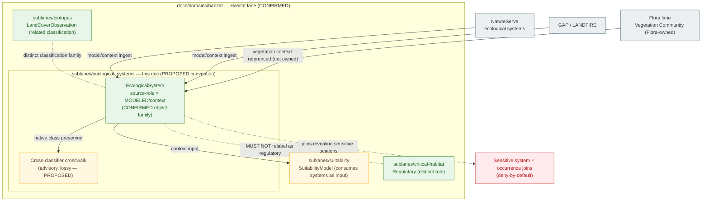

<!-- [KFM_META_BLOCK_V2]
doc_id: kfm://doc/<uuid>                                   # placeholder — assign on intake
title: Habitat Sublane — Ecological Systems
type: standard
version: v1
status: draft
owners: TODO — Habitat domain steward; Docs steward      # placeholder — confirm via CODEOWNERS
created: 2026-06-04
updated: 2026-06-04
policy_label: public
related:
  - docs/domains/habitat/README.md
  - docs/domains/habitat/sublanes/README.md
  - docs/domains/habitat/sublanes/biotopes.md
  - docs/domains/habitat/sublanes/critical-habitat.md
  - docs/doctrine/ai-build-operating-contract.md           # canonical operating contract
  - docs/doctrine/directory-rules.md
  - docs/doctrine/lifecycle-law.md
  - docs/domains/flora/README.md
tags: [kfm, domain, habitat, sublane, ecological-systems, EcologicalSystem, classification]
notes:
  - "CONTRACT_VERSION = 3.0.0 pinned (doctrine-adjacent)."
  - "Canonical object is EcologicalSystem (singular); this file's plural snake_case name is a convention to reconcile."
  - "EcologicalSystem classifications are typically MODELED; model-vs-observation labels MUST stay visible."
  - "Cross-classifier crosswalks are advisory, not authoritative (lossy)."
  - "Sublanes are a PROPOSED docs/ organizational tier; convention not yet established in Directory Rules."
  - "All implementation-layer claims remain PROPOSED until verified against mounted repo evidence."
[/KFM_META_BLOCK_V2] -->

# Habitat Sublane — Ecological Systems

> Scopes the **`EcologicalSystem`** slice of the Habitat domain — NatureServe / GAP / LANDFIRE ecological-system classifications ingested as evidence-backed, source-role-bounded types, with their model-vs-observation labels and advisory crosswalks kept visible.

**Status:** Draft  ·  **Owners:** TODO — Habitat domain steward; Docs steward  ·  **Updated:** 2026-06-04

> [!IMPORTANT]
> **Two rules define this sublane.** (1) An `EcologicalSystem` classification from NatureServe / GAP / LANDFIRE is typically a **`Modeled`** product — its model-vs-observation label MUST stay visible and it MUST NOT be presented as a field observation or a regulatory designation. (2) Mappings between classifier schemes are **advisory crosswalks**, inherently lossy; each source's native classification is preserved verbatim. `[DOM-HAB §I] [ENCY §24.1]`

---

## Quick jump

- [1. Sublane identity and one-line purpose](#1-sublane-identity-and-one-line-purpose)
- [2. Scope and boundary](#2-scope-and-boundary)
- [3. Sublane concept and authority posture](#3-sublane-concept-and-authority-posture)
- [4. Object & identity](#4-object--identity)
- [5. Source-role: modeled vs observed](#5-source-role-modeled-vs-observed)
- [6. Classification & crosswalks](#6-classification--crosswalks)
- [7. Source families](#7-source-families)
- [8. Sublane shape and relations (diagram)](#8-sublane-shape-and-relations-diagram)
- [9. Sensitivity, rights, and publication posture](#9-sensitivity-rights-and-publication-posture)
- [10. Pipeline placement (RAW → PUBLISHED)](#10-pipeline-placement-raw--published)
- [11. Cross-sublane and cross-lane relations](#11-cross-sublane-and-cross-lane-relations)
- [12. Governed AI behavior for this sublane](#12-governed-ai-behavior-for-this-sublane)
- [13. Validators, tests, fixtures](#13-validators-tests-fixtures)
- [14. Open questions and verification backlog](#14-open-questions-and-verification-backlog)
- [15. Related docs](#15-related-docs)
- [Appendix A — Sublane conformance checklist](#appendix-a--sublane-conformance-checklist)

---

## 1. Sublane identity and one-line purpose

> **CONFIRMED doctrine / PROPOSED sublane application.** The **Ecological Systems** sublane scopes how the Habitat lane represents named ecological-system classifications — the regional vegetation/biophysical types defined by classifiers like NatureServe, GAP, and LANDFIRE — as evidence-backed, source-role-bounded products. It does **not** score suitability, derive connectivity, assert regulatory designation, or own plant-community identity.

`EcologicalSystem` is a **CONFIRMED term** in the Habitat lane with meaning constrained by source role, evidence, time, and release state. `[DOM-HAB] [DOM-HF] [ENCY]` An ecological-system record answers *"what classified system is mapped here, by which classifier and vintage, at what confidence?"* — never collapsing the classifier's model output into ground truth.

[⬆ Back to top](#quick-jump)

---

## 2. Scope and boundary

### 2.1 What this sublane covers

| Concern | Treatment | Status |
|---|---|---|
| Ecological-system classification mapping | Ingest per classifier, preserve native class + vintage, label source-role | CONFIRMED doctrine / PROPOSED impl |
| Model-vs-observation labeling | Surfaced on every `EcologicalSystem` view | CONFIRMED `[DOM-HAB §I]` |
| Advisory cross-classifier crosswalks | Lossy, non-authoritative; native class preserved | CONFIRMED posture |
| Classifier vintage / version | Effective time surfaced; classifications change across releases | CONFIRMED (temporal-distinctness) |
| Public-safe derivatives | Generalized where sensitive joins apply | CONFIRMED |

### 2.2 What this sublane explicitly does **not** cover

- **Land cover (NLCD-style class assignments).** Owned via `LandCoverObservation` in the biotopes/land-cover slice — a related but distinct classification family. *See `docs/domains/habitat/sublanes/biotopes.md`.*
- **Habitat suitability / quality.** Owned via `SuitabilityModel`, `Habitat Quality Score`; an ecological-system label is an input/context, not a suitability score.
- **Regulatory critical habitat.** A `Regulatory` designation; an ecological system is `Modeled`/context. *See `docs/domains/habitat/sublanes/critical-habitat.md`.*
- **Plant-community identity.** `Vegetation Community` is **Flora-owned**; an `EcologicalSystem` is a Habitat biophysical classification that *references* vegetation context but does not own plant communities. `[DOM-FLORA]`
- **Connectivity / corridors.** Owned via the connectivity sublane.

> [!NOTE]
> The Habitat lane owns the full object spine (`HabitatPatch`, `LandCoverObservation`, `EcologicalSystem`, `Habitat Quality Score`, `SuitabilityModel`, `ConnectivityEdge`, `Corridor`, `Restoration Opportunity`, `StewardshipZone`, `Model Run Receipt`, `UncertaintySurface`). `[DOM-HAB] [DOM-HF] [ENCY]` This sublane covers one family and **MUST NOT** introduce parallel object families, schemas, contracts, or policy.

[⬆ Back to top](#quick-jump)

---

## 3. Sublane concept and authority posture

A **sublane** is a `docs/`-layer thematic grouping inside a single domain folder. All authority — schemas, contracts, policy, releases, tests, fixtures — remains at the Habitat lane level under the appropriate responsibility root.

> [!WARNING]
> **PROPOSED convention — not yet established in Directory Rules.** The `docs/domains/<domain>/sublanes/` directory is **not** referenced in `docs/doctrine/directory-rules.md` (CONFIRMED check this session). A `docs/`-internal sub-tier is most likely a **§17 routine-PR** change rather than a §2.4 ADR trigger. Until settled, treat this file's **placement** as PROPOSED while its **content** inherits the Habitat lane's CONFIRMED doctrine.

> [!NOTE]
> **Filename casing/plurality drift.** This file is requested as `ecological_systems.md` (snake_case, **plural**), while the canonical object is `EcologicalSystem` (PascalCase, **singular**) and the sibling sublanes use kebab-case singular topic names (`biotopes.md`, `connectivity.md`, `critical-habitat.md`). The H1 and object references below stay faithful to the singular canonical term. Reconcile the file-naming convention (kebab vs snake, singular vs plural) via the `sublanes/README.md` index or a drift entry in `docs/registers/DRIFT_REGISTER.md`. **NEEDS VERIFICATION.**

**This sublane is never allowed to:**

- Become a root folder (`ecological-systems/` at repo root → forbidden by Directory Rules §3 and §12).
- Create a parallel `schemas/`, `policy/`, `contracts/`, or `data/` home under "ecological-systems". Those live under the **Habitat** domain segment.
- Re-define `EcologicalSystem` — meaning lives in `contracts/`; field shape lives in `schemas/`.
- Present a modeled classification as observed/regulatory, or collapse classifier schemes into one.
- Publish content outside the governed API or without a `ReleaseManifest`, `EvidenceBundle`, validation/policy support, review state where required, correction path, and rollback target. `[DOM-HAB §M] [ENCY Appendix E]`

[⬆ Back to top](#quick-jump)

---

## 4. Object & identity

| Property | Value | Status |
|---|---|---|
| **Object** | `EcologicalSystem` (singular) | CONFIRMED term / PROPOSED field realization |
| **Owning domain** | Habitat | CONFIRMED |
| **Purpose** | Represents `EcologicalSystem` evidence or released derivative within Habitat | CONFIRMED (doctrine) |
| **Identity rule** | PROPOSED deterministic basis: `source id + object role + temporal scope + normalized digest` | PROPOSED |
| **Temporal handling** | source, observed, valid, retrieval, release, and correction times stay **distinct** where material | CONFIRMED |

The meaning of `EcologicalSystem` is constrained by **source role, evidence, time, and release state** — a classified system mapped by a named classifier at a given vintage, not a bare label. `[DOM-HAB] [DOM-HF] [ENCY]`

[⬆ Back to top](#quick-jump)

---

## 5. Source-role: modeled vs observed

Most ecological-system products are **derived classifications** — a classifier assigns a system to an area from inputs and rules. They sit in the `Modeled` (or `context`) class of the Source-Role Anti-Collapse Register, and their label MUST stay visible. `[ENCY §24.1]`

| Role | Fit for `EcologicalSystem` | Downstream rule |
|---|---|---|
| **Modeled** | NatureServe / GAP / LANDFIRE classifications are derived products. | Cite with classifier identity + vintage; never relabeled an observation. |
| Observed | A field-verified system mapping (rare; survey-based). | If present, label observed explicitly; never inflate a model into one. |
| Regulatory | ✗ — an ecological system is not a legal designation. | A critical-habitat designation is a separate, regulatory object. |

> [!CAUTION]
> The corpus is explicit: **regulatory critical habitat, modeled habitat, species range, occurrence points, and landscape context MUST NOT be flattened.** An `EcologicalSystem` classification is landscape/modeled context — keep its label distinct from suitability, critical habitat, and observation. `[DOM-HAB §I]`

[⬆ Back to top](#quick-jump)

---

## 6. Classification & crosswalks

> [!CAUTION]
> **Crosswalks are advisory, not authoritative.** NatureServe, GAP, and LANDFIRE encode different classification schemes; mappings between them are inherently **lossy**. Each source's **native classification is preserved verbatim**, with cross-classifier mappings layered on as advisory context — never substituted for the source's own classes. *(CONFIRMED posture, consistent with the land-cover slice.)*

| Concern | Posture | Status |
|---|---|---|
| Native classifier classes | Preserved verbatim per source | CONFIRMED posture |
| Cross-classifier crosswalk | Advisory only; lossy; non-authoritative | CONFIRMED posture |
| Unified ecological-system product | Per-source primary; any unified product is a caveated research-derived artifact | NEEDS VERIFICATION |
| Crosswalk transform record | Mapping decisions recorded as provenance | PROPOSED |

[⬆ Back to top](#quick-jump)

---

## 7. Source families

CONFIRMED Habitat source families relevant to ecological-system classification. Roles, rights, and vintages are `NEEDS VERIFICATION`; sensitive joins fail closed. `[DOM-HAB §D]`

| Source family | Typical role | Rights / sensitivity | Freshness | Status |
|---|---|---|---|---|
| **NatureServe and controlled biodiversity sources** | model / context | rights NEEDS VERIFICATION; controlled source — sensitive joins fail closed | source-vintage specific | `[DOM-HAB] [DOM-HF] [ENCY]` |
| **GAP / LANDFIRE** | model / context | rights NEEDS VERIFICATION; sensitive joins fail closed | source-vintage specific | `[DOM-HAB] [DOM-HF] [ENCY]` |
| **NLCD land cover** (related classification) | observation / context | rights NEEDS VERIFICATION | classifier-version specific | `[DOM-HAB]` — owned by land-cover slice |
| **KDWP state review context** | authority / context | review-state bounded; sensitive joins fail closed | source-vintage specific | `[DOM-HAB]` |

> [!NOTE]
> Rights and current terms for every source above are **NEEDS VERIFICATION** and must be confirmed against live source terms before publication. `[DOM-HAB §D]`

[⬆ Back to top](#quick-jump)

---

## 8. Sublane shape and relations (diagram)

> [!NOTE]
> Amber boxes/edges are **PROPOSED**. The deny-by-default node enforces the CONFIRMED posture that sensitive joins fail closed. `[DOM-HAB] [ENCY §20.5]`

[⬆ Back to top](#quick-jump)

---

## 9. Sensitivity, rights, and publication posture

CONFIRMED Habitat posture per `[DOM-HAB §I]`:

- **No flattening.** Model-vs-observation and modeled-vs-regulatory distinctions stay visible; an ecological-system classification is never inflated into observation or designation. `[DOM-HAB §I]`
- **Sensitive joins fail closed.** Where an ecological-system surface joins to a sensitive species' exact site, the join denies by default; only a generalized, public-safe derivative may be released with a recorded transform (`Geoprivacy transform` + `Redaction Receipt`). `[ENCY §20.5] [DOM-FAUNA]`
- **Promotion gate.** Unclear rights, unresolved source role, missing evidence, unresolved sensitivity, or absent release state **blocks public promotion.** `[ENCY] [DIRRULES]`
- **Most-restrictive-row rule.** Per the operating contract's §23.2 matrix, when no row clearly matches: `DENY` exact exposure, `GENERALIZE` before publication, `REDACT` when needed, `REQUIRE` steward review, `REQUIRE` a `RedactionReceipt`, `ABSTAIN` when support is inadequate.
- **Vintage honesty.** Stale classifications must not be presented as current; classifier vintage stays explicit.

> [!NOTE]
> Ecological-system classifications are generally publishable context, but a controlled biodiversity source (e.g., NatureServe) may carry source-term restrictions — confirm rights before release. `[DOM-HAB §D]`

[⬆ Back to top](#quick-jump)

---

## 10. Pipeline placement (RAW → PUBLISHED)

CONFIRMED doctrine / PROPOSED sublane application. Ecological-system artifacts follow the Habitat lane's pipeline shape **exactly**; the sublane introduces no new stage. `[DIRRULES] [DOM-HAB §H] [ENCY]`

| Stage | Sublane handling | Gate | Status |
|---|---|---|---|
| **RAW** | Capture the classifier source payload/reference (NatureServe / GAP / LANDFIRE) with source role, rights, sensitivity, citation, classifier vintage, and hash; native classes preserved. | `SourceDescriptor` exists; source-activation decision recorded. | PROPOSED |
| **WORK / QUARANTINE** | Normalize geometry, classifier version, temporal scope, identity, rights, policy; layer advisory crosswalk. Hold rights- or sensitivity-unresolved cases. | Validation + policy gate pass, or quarantine reason recorded. | PROPOSED |
| **PROCESSED** | Emit validated `EcologicalSystem` records with `EvidenceRef`, `ValidationReport`, model/observation label, and public-safe candidates. | `EvidenceRef`, `ValidationReport`, digest closure exist. | PROPOSED |
| **CATALOG / TRIPLET** | Emit catalog records, `EvidenceBundle`, graph/triplet projections, release candidates with classifier-vintage badges. | Catalog/proof closure passes. | PROPOSED |
| **PUBLISHED** | Serve released public-safe ecological-system artifacts through governed APIs and manifests. | `ReleaseManifest`, correction path, rollback target, review/policy state exist. | PROPOSED |

CONFIRMED invariant: **promotion is a governed state transition, not a file move.** `[DIRRULES] [LIFECYCLE-LAW]`

[⬆ Back to top](#quick-jump)

---

## 11. Cross-sublane and cross-lane relations

### 11.1 Within the Habitat lane

| This sublane | Related sublane (PROPOSED) | Relation | Constraint |
|---|---|---|---|
| Ecological Systems | Biotopes / Land Cover | Distinct but related classification families; both preserve native classes. | Do not collapse land cover and ecological systems into one label. |
| Ecological Systems | Suitability | Provides system labels as model/context input to suitability. | Modeled input stays labeled; uncertainty propagates. |
| Ecological Systems | Critical Habitat | Coexist as distinct layers with distinct source-roles. | Ecological system (`Modeled`) ≠ critical habitat (`Regulatory`). |

### 11.2 Across lanes

| Relation | Lane | Constraint | Citation |
|---|---|---|---|
| Ecological Systems ↔ **Flora** — vegetation-community context | Flora | Flora owns `Vegetation Community`; ecological system references vegetation context, does not own it. | `[DOM-HAB]` `[DOM-FLORA]` |
| Ecological Systems ↔ **Fauna** — habitat-type context for occurrence | Fauna | Public-safe occurrences only; restricted never cross; sensitive joins fail closed. | `[DOM-HAB]` `[DOM-FAUNA]` |
| Ecological Systems ↔ **Soil / Hydrology** — biophysical context | Soil, Hydrology | Context only; never re-assert soil/hydro truth. | `[DOM-HAB]` `[DOM-SOIL]` `[DOM-HYD]` |
| Ecological Systems ↔ **Spatial Foundation / Planetary 3D** | Spatial Foundation | Generalized geometry for any sensitive join. | `[MAP-MASTER]` `[DOM-HAB]` |

[⬆ Back to top](#quick-jump)

---

## 12. Governed AI behavior for this sublane

CONFIRMED doctrine / PROPOSED implementation. AI behavior is the Habitat lane's behavior, inherited without modification. `[GAI] [DOM-HAB §L] [ENCY]`

| AI behavior | Rule |
|---|---|
| **Allowed** | Evidence-bounded summarization over released `EcologicalSystem` `EvidenceBundles`; citation-backed explanation of NatureServe / GAP / LANDFIRE classifier differences; vintage comparison; crosswalk caveat narration. |
| **Required abstention** | When evidence is insufficient, when classifiers disagree without a release decision, when classifier vintage is unresolved, or when the request exceeds source support. |
| **Required denial** | Presenting a modeled classification as observed or regulatory; collapsing classifier schemes; sensitive-join location exposure; uncited authoritative claims about system at a precise location; direct RAW/WORK/QUARANTINE access. |
| **Receipt** | Emit `AIReceipt` and `RuntimeResponseEnvelope` with outcome `ANSWER / ABSTAIN / DENY / ERROR`, `evidence_refs`, `policy_decision`, and `citation_validation`. |

[⬆ Back to top](#quick-jump)

---

## 13. Validators, tests, fixtures

All items below are **PROPOSED** and inherit Habitat-lane validators per `[DOM-HAB §K]`. No new home: tests live under `tests/domains/habitat/`; fixtures under `fixtures/domains/habitat/`. `[DIRRULES §12]`

<strong>Proposed validators and tests (click to expand)</strong>

- **PROPOSED — Source descriptor tests.** Verify `SourceDescriptor` presence and source-role for NatureServe, GAP/LANDFIRE, KDWP context.
- **PROPOSED — Source-role mismatch denial tests.** A modeled classification MUST NOT be admitted as an observation or regulatory designation.
- **PROPOSED — Model/observation label tests.** Every published `EcologicalSystem` artifact carries its model-vs-observation label.
- **PROPOSED — Classifier-vintage surfacing tests.** Every artifact carries classifier name + version + effective time.
- **PROPOSED — Native-class preservation tests.** Native classifier classes are preserved; crosswalks are advisory and labeled lossy.
- **PROPOSED — Sensitive-join geoprivacy tests.** System × sensitive-occurrence joins fail closed; `Redaction Receipt` required for any released public-safe derivative.
- **PROPOSED — Catalog closure tests.** Every `EcologicalSystem` `EvidenceBundle` resolves to a closed catalog entry with hashed `EvidenceRef`s.
- **PROPOSED — No-network fixtures.** Classifier connectors remain inactive until activation, fixtures, validators, and policy gates exist.

[⬆ Back to top](#quick-jump)

---

## 14. Open questions and verification backlog

| Item to verify | Evidence that would settle it | Status |
|---|---|---|
| Whether `docs/domains/<domain>/sublanes/` is a permitted `docs/`-only convention, and the file-naming casing/plurality. | Accepted ADR, Directory Rules reference, or `sublanes/README.md` entry. | **NEEDS VERIFICATION** |
| `EcologicalSystem` schema shape and identity field set. | Mounted repo `schemas/contracts/v1/domains/habitat/` + ADR-0001. | **NEEDS VERIFICATION** |
| NatureServe / GAP / LANDFIRE rights, terms, and admissibility. | Mounted repo source registry, activation decision, live terms. | **NEEDS VERIFICATION** |
| Whether model/observation labeling and classifier-vintage are validator-enforced. | Mounted repo validator code + tests. | **NEEDS VERIFICATION** |
| Whether KFM produces a unified ecological-system product or per-classifier artifacts only. | Mounted repo product registry + ADR. | **NEEDS VERIFICATION** |
| Whether the crosswalk transform-record format and provenance home exist. | Mounted repo schema + provenance store. | **NEEDS VERIFICATION** |
| How `EcologicalSystem` relates to Flora `Vegetation Community` without cross-ownership. | Cross-lane relation contract + schema. | **NEEDS VERIFICATION** |

[⬆ Back to top](#quick-jump)

---

## 15. Related docs

> [!NOTE]
> Some links below are TODO placeholders pending verification of the docs tree against the mounted repo.

- [`docs/domains/habitat/README.md`](../README.md) — Habitat domain landing (TODO — verify presence).
- [`docs/domains/habitat/sublanes/README.md`](./README.md) — Habitat sublane index (TODO — verify presence).
- [`docs/domains/habitat/sublanes/biotopes.md`](./biotopes.md) — Biotopes sublane (land cover, habitat type).
- [`docs/domains/habitat/sublanes/critical-habitat.md`](./critical-habitat.md) — Regulatory critical habitat sublane.
- [`docs/doctrine/ai-build-operating-contract.md`](../../../doctrine/ai-build-operating-contract.md) — Canonical operating contract (`CONTRACT_VERSION = "3.0.0"`).
- [`docs/doctrine/directory-rules.md`](../../../doctrine/directory-rules.md) — Placement law; §3 deeper rule, §12 Domain Placement Law.
- [`docs/doctrine/lifecycle-law.md`](../../../doctrine/lifecycle-law.md) — RAW → PUBLISHED governance (TODO — verify presence).
- [`docs/domains/flora/README.md`](../../flora/README.md) — `Vegetation Community` ownership (TODO — verify presence).

[⬆ Back to top](#quick-jump)

---

## Appendix A — Sublane conformance checklist

For reviewers proposing ecological-system content into the Habitat lane.

<strong>Pre-merge checklist (click to expand)</strong>

- [ ] Every `EcologicalSystem` artifact carries its source-role and model-vs-observation label.
- [ ] Classifier name, version, and effective time are surfaced on every artifact.
- [ ] Native classifier classes are preserved; crosswalks are labeled advisory/lossy, not authoritative.
- [ ] No modeled classification is presented as observed or as regulatory critical habitat.
- [ ] Land cover and ecological systems are not collapsed into one label.
- [ ] `Vegetation Community` context is referenced from Flora, not owned here.
- [ ] System × sensitive-occurrence joins fail closed unless `Geoprivacy transform` + `Redaction Receipt` + public-safe derivative exist.
- [ ] No artifact reaches `PUBLISHED` without `ReleaseManifest` + `EvidenceBundle` + validation/policy support + review state (where required) + correction path + rollback target.
- [ ] No parallel schema/contract/policy home created under "ecological-systems"; files live under the **Habitat** domain segment.
- [ ] Path-validation checklist (Directory Rules §16) applied for any new path.
- [ ] The `sublanes/` convention and this file's naming are covered by an ADR or the `sublanes/README.md` index.

[⬆ Back to top](#quick-jump)

---

**Related docs:** [Habitat README](../README.md) · [Sublane index](./README.md) · [Biotopes](./biotopes.md) · [Critical Habitat](./critical-habitat.md) · [Operating Contract](../../../doctrine/ai-build-operating-contract.md) · [Directory Rules](../../../doctrine/directory-rules.md) · [Flora README](../../flora/README.md)

**Last updated:** 2026-06-04 · **Doc version:** v1 · **Status:** Draft · `CONTRACT_VERSION = "3.0.0"` · [⬆ Back to top](#quick-jump)
