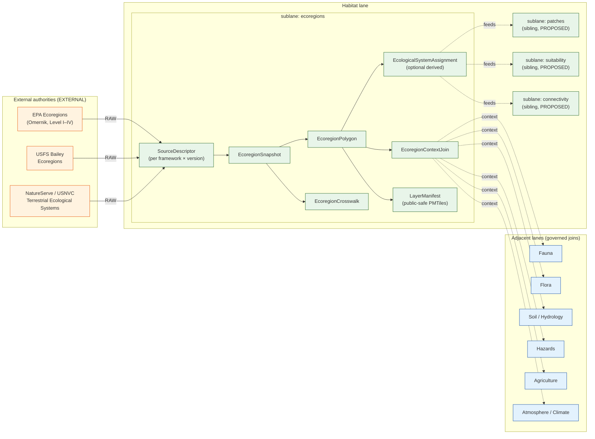

<!-- [KFM_META_BLOCK_V2]
doc_id: kfm://doc/habitat/sublanes/ecoregions
title: Habitat — Ecoregions Sublane
type: standard
version: v0.2
status: draft
owners: TBD — Habitat lane steward; Spatial Foundation reviewer    # placeholder — confirm via CODEOWNERS
created: 2026-05-17
updated: 2026-06-04
policy_label: public
related:
  - docs/domains/habitat/README.md
  - docs/domains/habitat/sublanes/README.md
  - docs/domains/habitat/sublanes/ecological_systems.md
  - docs/domains/spatial-foundation/README.md
  - docs/domains/fauna/README.md
  - docs/domains/flora/README.md
  - docs/doctrine/ai-build-operating-contract.md
  - docs/doctrine/directory-rules.md
  - docs/standards/PROV.md
  - docs/standards/PMTILES.md
  - docs/adr/ADR-0001-schema-home.md
tags: [kfm, habitat, ecoregions, biophysical, regionalization, omernik, level-iii, level-iv, public-safe]
notes:
  - "CONTRACT_VERSION = 3.0.0 pinned (doctrine-adjacent)."
  - "EPA ecoregions are anchored as landscape-context layers by atlas cards KFM-P25-PROG-0026 and KFM-P25-IDEA-0011 (context, not sovereign truth)."
  - "PMTiles attribute include-list (ML-E-061) and CRS 5070/4326 -> 3857-for-tiling (ML-E-062) are CONFIRMED MapLibre-master ideas."
  - "Multi-zoom render anchor (ML-E-057) is NEEDS VERIFICATION; could not confirm the exact ID this session."
  - "Sublane introduces a /sublanes/ subfolder under docs/domains/habitat/ -- PROPOSED structural convention; see §15."
  - "All implementation-layer claims remain PROPOSED until verified against a mounted repo."
[/KFM_META_BLOCK_V2] -->

# 🗺️ Habitat — Ecoregions Sublane

> Govern the **ecoregional regionalization layer** of the Habitat domain: biophysical region polygons, their classification levels, and the cross-lane joins they enable — as **context / authority** evidence, never as occurrence or species truth.


<!-- TODO: replace with real CI badge once docs workflow ID is confirmed -->


| Field | Value |
|---|---|
| **Status** | `draft` — initial sublane charter |
| **Owners** | _TBD_ — Habitat lane steward; Spatial Foundation reviewer |
| **Last updated** | 2026-06-04 |
| **Maturity** | `CONFIRMED doctrine / PROPOSED implementation` |
| **Schema home** | `schemas/contracts/v1/domains/habitat/ecoregions/` _(PROPOSED, ADR-0001)_ |
| **Repo state** | _UNKNOWN — not verified against a mounted repo in this session_ |

---

## 📑 Contents

1. [Purpose and one-line role](#1-purpose-and-one-line-role)
2. [Scope, boundary, and explicit non-ownership](#2-scope-boundary-and-explicit-non-ownership)
3. [Ubiquitous language](#3-ubiquitous-language)
4. [Key source families](#4-key-source-families)
5. [Object families](#5-object-families)
6. [Cross-lane relations](#6-cross-lane-relations)
7. [Sublane shape diagram](#7-sublane-shape-diagram)
8. [Map and viewing products](#8-map-and-viewing-products)
9. [Pipeline shape (RAW → PUBLISHED)](#9-pipeline-shape-raw--published)
10. [Sensitivity, rights, and publication posture](#10-sensitivity-rights-and-publication-posture)
11. [API, contract, and schema surfaces](#11-api-contract-and-schema-surfaces)
12. [Validators, tests, fixtures](#12-validators-tests-fixtures)
13. [Governed AI behavior](#13-governed-ai-behavior)
14. [Publication, correction, and rollback](#14-publication-correction-and-rollback)
15. [Directory placement and structural notes](#15-directory-placement-and-structural-notes)
16. [Verification backlog and open questions](#16-verification-backlog-and-open-questions)
17. [Related docs](#17-related-docs)
18. [Appendix](#18-appendix)

> [!IMPORTANT]
> **Truth posture.** Ecoregion polygons are a **regionalization context**. They classify *places*, not *species presence* or *habitat patches*. The corpus anchors EPA ecoregions (with PLSS and WBD HUC12) explicitly as **landscape context layers carrying source roles — not interchangeable geometry truth.** `[KFM-P25-IDEA-0011]` Joins to fauna occurrence, rare-plant records, or sensitive habitat **fail closed** until a documented geoprivacy transform and review state allow release. `[DOM-HAB] [DOM-HF] [DOM-FAUNA]`

---

## 1. Purpose and one-line role

> **`CONFIRMED doctrine / PROPOSED implementation.`** This sublane governs **ecoregional polygons** (biophysical regionalization), their hierarchical levels, their cadence of revisions, and their cross-lane joins — within the Habitat domain's `EcologicalSystem` and `LandCoverObservation` object families. `[DOM-HAB] [DOM-HF] [ENCY]`

The sublane treats ecoregion polygons as **regionalization geometry plus authoritative attribution** — a *context* layer that other Habitat sublanes (patches, suitability, connectivity, restoration, stewardship) and adjacent domains (Fauna, Flora, Soil/Hydrology, Hazards, Agriculture) consume through governed joins. The polygons themselves are not Habitat truth about *what lives where*; they are truth about *which biophysical region a place is in*, as classified by a named authority at a named version. This matches the corpus directive that the habitat source suite (NLCD, NWI, PAD-US, GAP/LANDFIRE, NEON) be treated as **versioned context layers, not sovereign truth roots.** `[KFM-P25-IDEA-0004]`

[⬆ Back to top](#️-habitat--ecoregions-sublane)

---

## 2. Scope, boundary, and explicit non-ownership

> [!NOTE]
> **CONFIRMED doctrine / PROPOSED field realization.** Boundary rules below mirror the Habitat lane charter in `[DOM-HAB]` and the Habitat–Fauna thin-slice pattern in `[DOM-HF]`. Sublane-specific narrowing is `PROPOSED` until validated against mounted-repo evidence.

### 2.1 In scope

- Hierarchical biophysical region polygons (commonly Level I → Level IV, source-dependent). An EPA ecoregion descriptor records **Level III/IV hierarchy, state/region coverage, symbology, source URI, and landscape-context role.** `[KFM-P25-PROG-0026]`
- Source-versioned snapshots with `valid_time`, `retrieval_time`, `release_time`, and `correction_time` kept distinct.
- Attribute provenance: which fields originate from the source authority versus derived/normalized fields.
- CRS handling: keep authoritative source CRS (e.g., EPSG:5070 / EPSG:4326) for provenance; reproject to EPSG:3857 only for tiling. `[ML-E-062]` *(CONFIRMED MapLibre-master idea.)*
- Public-safe PMTiles with explicit attribute include-lists. `[ML-E-061]` *(CONFIRMED MapLibre-master idea.)*
- Multi-zoom render contract: broad regions at low zoom, finer levels at high zoom. `[ML-E-057]` *(NEEDS VERIFICATION — exact idea ID unconfirmed this session.)*
- Cross-lane join governance: `Habitat × Fauna`, `Habitat × Flora`, `Habitat × Soil/Hydrology`, `Habitat × Hazards`, `Habitat × Agriculture`. `[DOM-HAB §F]`

### 2.2 Explicitly **not** owned

| Concern | Owning lane / sublane | Reason |
|---|---|---|
| Animal occurrence truth | **Fauna** — `Taxon`, `Occurrence*` | Fauna owns taxon identity and occurrence evidence. |
| Plant occurrence and rare-plant records | **Flora** — `Plant Taxon`, `Flora Occurrence`, `Rare Plant Record` | Flora owns plant taxonomy and sensitive records. |
| Habitat patches and suitability surfaces | **Habitat — patches/suitability sublanes** _(PROPOSED siblings)_ | Distinct objects; ecoregions are not patches. |
| Regulatory critical habitat (USFWS ECOS) | **Habitat — critical-habitat sublane** | Source-role separation; `regulatory ≠ model ≠ context`. |
| Coordinate Reference Profile, basemap tiles, generalization receipts | **Spatial Foundation** | Reference geometry, not domain truth. |
| Watershed boundaries (HUC*), NHD reaches | **Hydrology** | Hydrologic units have their own authority. |
| Land ownership, parcel boundaries, jurisdictions | **People / Land** and **Settlements / Infrastructure** | Administrative truth lives elsewhere. |

[⬆ Back to top](#️-habitat--ecoregions-sublane)

---

## 3. Ubiquitous language

> `CONFIRMED term / PROPOSED field realization` unless otherwise noted. All terms inherit Habitat-lane semantics from `[DOM-HAB]` and `[ENCY]` and are constrained by **source role, evidence, time, and release state**.

| Term | Working definition (sublane-scoped) | Source |
|---|---|---|
| **Ecoregion** | A named biophysical region polygon at a defined classification level and source version. | sublane PROPOSED |
| **EcologicalSystem** | Habitat object family used for biophysical regional units inside this domain. | `[DOM-HAB]` `[ENCY]` |
| **LandCoverObservation** | Adjacent Habitat object family; ecoregions are *not* land-cover but join to land-cover under governed relations. | `[DOM-HAB]` `[ENCY]` |
| **EcoregionLevel** | Hierarchical depth of the regionalization (e.g., `level_1` … `level_4` per the chosen authority). | sublane PROPOSED |
| **EcoregionFramework** | The classification authority and version producing the regionalization (e.g., `EPA-Omernik`, `USFS-Bailey`). EXTERNAL frameworks are referenced, not adopted as KFM truth. | sublane PROPOSED |
| **EcoregionSnapshot** | A frozen, hash-addressed instance of a framework × level × extent at a `valid_time` and `retrieval_time`. | sublane PROPOSED |
| **EcoregionContextJoin** | A governed cross-lane join that uses ecoregion polygons as *context*, never as occurrence or species truth. | sublane PROPOSED |
| **SourceDescriptor** | Cross-cutting governance object pinning identity, role, rights, cadence, and access for each ecoregion source. | `[ENCY]` |
| **EvidenceBundle / EvidenceRef** | Bundle of evidence supporting an ecoregion claim; sublane outputs always resolve through EvidenceRef. | `[ENCY]` `[GAI]` |
| **PMTiles include-list** | The whitelisted attribute set permitted to land in public PMTiles for this sublane. | `[ML-E-061]` |
| **Geoprivacy transform** | Cross-cutting transform that may be required when an ecoregion join touches sensitive occurrence data. | `[DOM-HAB]` `[DOM-FAUNA]` |

> [!TIP]
> **Naming discipline.** Use `EcologicalSystem` for the *Habitat object family* and `Ecoregion` / `EcoregionSnapshot` for the *regionalization concept within this sublane*. Do not collapse the two; the Habitat lane vocabulary is fixed by `[DOM-HAB]`.

[⬆ Back to top](#️-habitat--ecoregions-sublane)

---

## 4. Key source families

> All source rights, current terms, and access posture are `NEEDS VERIFICATION` until validated against the mounted repo `data/registry/sources/habitat/` register and a current `SourceDescriptor`. Source role is **never** inferred from convenience.

| Source family | Role | Granularity | Rights / sensitivity | Freshness | Status |
|---|---|---|---|---|---|
| **EPA Ecoregions** (Omernik framework; CONUS Level III/IV — EXTERNAL) | `authority` — biophysical regionalization | Levels I–IV; state-level Level IV available | `NEEDS VERIFICATION` — current terms; redistribution license must be pinned | Multi-year cadence; version-pinned | `PROPOSED` per `[KFM-P25-PROG-0026]` / `[KFM-P25-IDEA-0011]` |
| **USFS Bailey Ecoregions** (Bailey framework — EXTERNAL) | `authority` — alternate biophysical regionalization | Domains, divisions, provinces, sections, subsections | `NEEDS VERIFICATION` | Multi-year cadence | `PROPOSED` |
| **NatureServe — Terrestrial Ecological Systems / USNVC** | `authority` / `context` — ecological-systems crosswalk | System-level | `NEEDS VERIFICATION`; controlled biodiversity source posture | Source-vintage specific | `PROPOSED` per `[DOM-HAB §D]` / `[KFM-P25-PROG-0025]` |
| **GAP / LANDFIRE** | `context` / `model` — broader habitat/vegetation classification adjacency | National rasters; tile-based | `NEEDS VERIFICATION` | Multi-year | `PROPOSED` per `[DOM-HAB §D]` |
| **NLCD** (National Land Cover Database) | `context` — land cover, used in cross-joins not as ecoregion truth | 30-m raster | `NEEDS VERIFICATION` | Annual / multi-year | `PROPOSED` per `[DOM-HAB §D]` |
| **NWI Wetlands** | `context` — wetland refinement of ecoregional context | Polygon | `NEEDS VERIFICATION` | Multi-year | `PROPOSED` per `[DOM-HAB §D]` |
| **KDWP state ecological context** | `context` — state-level review and refinement | Statewide | `NEEDS VERIFICATION`; controlled access posture | Source-vintage specific | `PROPOSED` per `[DOM-HAB §D]` |
| **PAD-US** | `context` — stewardship overlay onto ecoregions | Polygon | `NEEDS VERIFICATION` | Multi-year | `PROPOSED` per `[DOM-HAB §D]` |

> [!CAUTION]
> **Source-role anti-collapse.** EPA Ecoregions and USFS Bailey are *parallel* `authority` frameworks, not a single canonical region scheme. Picking one as KFM's default is an **ADR-class decision**, not a sublane decision. Until that ADR lands, both frameworks must be kept addressable side-by-side with framework-level `SourceDescriptor` separation. The corpus is explicit that ecoregions, PLSS, and WBD HUC12 are **catalogued as landscape context layers with source roles rather than treated as interchangeable geometry truth.** `[KFM-P25-IDEA-0011]`

[⬆ Back to top](#️-habitat--ecoregions-sublane)

---

## 5. Object families

> `PROPOSED` object families for this sublane. All inherit Habitat-lane deterministic identity (`source_id + object_role + temporal_scope + normalized_digest`) and the cross-cutting time-axis separation rule (`source_time`, `observed_time`, `valid_time`, `retrieval_time`, `release_time`, `correction_time` stay distinct where material). `[DOM-HAB §E]` `[ENCY]`

| Object | Purpose | Identity rule | Temporal handling |
|---|---|---|---|
| **EcoregionSnapshot** | Hash-addressed instance of `framework × level × extent × version` at a retrieval moment. | `PROPOSED` deterministic: `framework + level + extent + version + spec_hash`. | All six time axes preserved. |
| **EcoregionPolygon** | One polygon feature inside a snapshot, with framework attributes preserved verbatim. | `PROPOSED`: `snapshot_id + feature_id + geometry_fingerprint`. | Inherits snapshot temporal scope. |
| **EcoregionCrosswalk** | A reviewed mapping between two frameworks (e.g., EPA → Bailey) or between framework levels; may preserve a USNVC `nvc_code` crosswalk (ecological system, USNVC group, class labels, source version). | `PROPOSED`: `source_framework + target_framework + version + reviewer_id`. | `crosswalk_valid_time` distinct from input snapshot times. |
| **EcoregionContextJoin** | A governed join receipt linking an ecoregion polygon to an adjacent-lane object via `context` role only. | `PROPOSED`: `subject_id + ecoregion_polygon_id + join_role + spec_hash`. | All input times preserved on the receipt. |
| **EcologicalSystemAssignment** | Optional Habitat-lane derived projection of ecoregion attribution onto `EcologicalSystem`. | `PROPOSED`: `ecological_system_id + ecoregion_polygon_id + version`. | Distinguishes source vs. derived time. |
| **Model Run Receipt** _(reused)_ | If derived ecoregion classes are produced (e.g., a refined model), a `Model Run Receipt` is required. | Per Habitat lane. | Per Habitat lane. |
| **LayerManifest** _(reused)_ | Per-release public-safe layer descriptor referencing the EcoregionSnapshot, attribute include-list, CRS path, and PMTiles asset. | Per Spatial Foundation. | Per Spatial Foundation. |

> [!NOTE]
> The USNVC crosswalk linkage is anchored by `[KFM-P25-PROG-0025]`: a USNVC metadata crosswalk **preserves ecological system, USNVC group, ruderal/natural status, class labels, and source version.** *(CONFIRMED card / PROPOSED implementation.)*

[⬆ Back to top](#️-habitat--ecoregions-sublane)

---

## 6. Cross-lane relations

> `CONFIRMED / PROPOSED` — each relation must preserve **ownership, source role, sensitivity, and EvidenceBundle support**. Ecoregions are **never** the truth source for the joined lane; they supply *regional context only*. `[DOM-HAB §F]`

| This sublane | Related lane | Relation type | Constraint |
|---|---|---|---|
| Habitat / Ecoregions | **Fauna** | Range-context join; ecoregion attribution attached to species range polygons. | Sensitive occurrence joins **fail closed** unless a documented geoprivacy transform and review state allow release. `[ENCY §20.5]` `[Operating Contract §23.2]` |
| Habitat / Ecoregions | **Flora** | Vegetation-community and rare-plant context. | Rare-plant exact location remains denied; ecoregion attribution allowed only at framework-level granularity. `[ENCY §20.5]` `[DOM-FLORA]` |
| Habitat / Ecoregions | **Habitat / patches** _(sibling sublane, PROPOSED)_ | Patch attribution by ecoregion context. | Patch truth remains with the patches sublane; ecoregion attribution is annotative, not constitutive. |
| Habitat / Ecoregions | **Soil / Hydrology** | Substrate, moisture, wetlands, riparian context joins. | Hydrologic unit truth remains with Hydrology; ecoregion ≠ HUC. `[DOM-HYD]` |
| Habitat / Ecoregions | **Hazards** | Fire, drought, flood-stress contextualization by ecoregion. | KFM is **never** an alert authority; ecoregion overlays cannot infer life-safety conclusions. `[DOM-HAZ]` |
| Habitat / Ecoregions | **Agriculture** | CDL / land-use × ecoregion joins for regional crop pattern context. | Aggregation receipts required; private-join denial defaults apply. `[DOM-AG]` |
| Habitat / Ecoregions | **Atmosphere / Climate** | Climate-normal departure by ecoregion as a derived context. | Observation vs. model vs. aggregate roles must remain visible on the receipt. `[DOM-AIR]` |
| Habitat / Ecoregions | **Spatial Foundation** | CRS, generalization, basemap, scale-support profile. | Spatial Foundation owns reference geometry; ecoregions do not redefine it. |

[⬆ Back to top](#️-habitat--ecoregions-sublane)

---

## 7. Sublane shape diagram

> [!NOTE]
> **Diagram status — `PROPOSED`.** The diagram below depicts the sublane's intended responsibility shape inside the Habitat lane and is `NEEDS VERIFICATION` against a mounted repo. It is not an implementation claim.



[⬆ Back to top](#️-habitat--ecoregions-sublane)

---

## 8. Map and viewing products

> `PROPOSED` viewing products inherit cross-cutting trust controls (Evidence Drawer, time-aware state, trust badges, sensitivity-redacted view, correction/stale-state view, governed Focus Mode). `[MAP-MASTER]` `[GAI]`

| Product | Behavior | Anchored by |
|---|---|---|
| **Ecoregion overlay (multi-zoom)** | Low zoom shows broad ecoregions; high zoom reveals Level IV detail (and may reveal adjacent PLSS lines from Spatial Foundation). | `[ML-E-057]` — NEEDS VERIFICATION |
| **Framework toggle** | EPA vs. Bailey side-by-side; never collapsed into a single "ecoregion" without a recorded `EcoregionCrosswalk`. | sublane PROPOSED |
| **Source-role badge** | Each polygon click surfaces the framework, level, version, source role, and `EvidenceRef`. | `[DOM-HAB §G]` `[MAP-MASTER]` |
| **Uncertainty / generalization view** | Renders the generalization-transform receipt where simplification was applied for tiling. | `[ML-E-062]` Spatial Foundation |
| **Sensitivity-redacted join view** | When a join would expose sensitive occurrence data, the ecoregion overlay still renders but the join attributes are redacted. | `[DOM-HAB]` `[DOM-FAUNA]` |
| **Evidence Drawer — Ecoregion panel** | Resolves `EvidenceRef → EvidenceBundle` via the governed API. AI never speaks here as root truth. | `[ENCY]` `[GAI]` |
| **Stale / correction state** | Displays stale source/retrieval/release state and any `CorrectionNotice` for the ecoregion snapshot. | `[ENCY]` |

> [!TIP]
> **PMTiles attribute discipline.** Per `[ML-E-061]`, ecoregion PMTiles must trim attributes to an **explicit include-list** declared in the `LayerManifest`. Default-deny on attributes; default-deny on raw geometry where generalization is required. Vector-tile attribute whitelisting prevents attribute leakage. `[ML-061-132]` *(CONFIRMED MapLibre-master ideas.)*

[⬆ Back to top](#️-habitat--ecoregions-sublane)

---

## 9. Pipeline shape (RAW → PUBLISHED)

> `CONFIRMED doctrine / PROPOSED lane application` — sublane inherits the Habitat lifecycle invariant. Promotion is a **governed state transition**, not a file move. `[DIRRULES §9]` `[DOM-HAB §H]`

```text
RAW  →  WORK / QUARANTINE  →  PROCESSED  →  CATALOG / TRIPLET  →  PUBLISHED
```

| Stage | Sublane handling | Gate | Status |
|---|---|---|---|
| **RAW** | Capture immutable source payload (e.g., EPA Ecoregions Level IV state shapefile or geopackage) with `framework`, `level`, `version`, `extent`, citation, time, and hash. | `SourceDescriptor` exists; rights and access reviewed. | `PROPOSED` |
| **WORK / QUARANTINE** | Normalize schema, validate geometry (run deterministic `make-valid` before any simplification per `[ML-061-033/034]`), normalize attribute names, evaluate rights and policy. Quarantine failures with a recorded reason. | Validation and policy gate pass, or quarantine reason recorded. | `PROPOSED` |
| **PROCESSED** | Emit validated `EcoregionSnapshot`, `EcoregionPolygon` set, optional `EcoregionCrosswalk`, public-safe candidate tiles, and receipts. | `EvidenceRef`, `ValidationReport`, and digest closure exist. | `PROPOSED` |
| **CATALOG / TRIPLET** | Emit catalog records (STAC/DCAT), `EvidenceBundle`, graph/triplet projections, and release candidates. | Catalog / proof closure passes. | `PROPOSED` |
| **PUBLISHED** | Serve released public-safe artifacts through the **governed API only** (`apps/governed-api/`); never expose RAW/WORK/QUARANTINE/PROCESSED stores to the public path. | `ReleaseManifest`, correction path, rollback target, review/policy state exist. | `PROPOSED` |

> [!WARNING]
> **Lifecycle skip is a violation.** A direct write from `data/raw/habitat/ecoregions/...` to `data/published/layers/habitat/...` bypasses validators, policy gates, evidence-bundle creation, catalog closure, and release-decision recording. The invariant is **governance, not storage organization**. `[DIRRULES §9]`

[⬆ Back to top](#️-habitat--ecoregions-sublane)

---

## 10. Sensitivity, rights, and publication posture

> [!IMPORTANT]
> **Default sensitivity for the polygons themselves is low.** Ecoregion polygons describe regions, not individuals or sensitive locations. Default sensitivity rises immediately when a polygon is **joined** to sensitive occurrence, archaeological, or critical-infrastructure data.

| Concern | Default posture | Override path |
|---|---|---|
| Ecoregion polygon publication | `PUBLIC` (public-safe) | License terms must permit redistribution; otherwise **deny**. |
| Ecoregion + sensitive occurrence join | `DENY` by default | Documented geoprivacy transform + `Redaction Receipt` + review record. `[ENCY §20.5]` |
| Ecoregion + rare-plant record join | `DENY` by default | Flora steward review + transform + `Redaction Receipt`. `[ENCY §20.5]` `[DOM-FLORA]` |
| Ecoregion + archaeology join | `DENY` by default | Cultural-sovereignty review path + transform receipt. `[ENCY §20.5]` `[DOM-ARCH]` |
| Source license redistribution | `NEEDS VERIFICATION` per source | Pin license in `SourceDescriptor`; CI deny if missing. |
| Attribute leakage in PMTiles | `DENY` outside include-list | Include-list declared in `LayerManifest`; CI deny on extras. `[ML-E-061]` `[ML-061-132]` |

> [!CAUTION]
> **Publication gate.** Unclear rights, unresolved source role, missing evidence, unresolved sensitivity, or absent release state **blocks public promotion**. There is no "publish first, gate later." Per the operating contract's §23.2 matrix, when no row clearly matches, the **most restrictive applicable row applies**. `[ENCY]` `[DIRRULES]` `[DOM-HAB §I]` `[Operating Contract §23.2]`

[⬆ Back to top](#️-habitat--ecoregions-sublane)

---

## 11. API, contract, and schema surfaces

> All endpoints are `PROPOSED`. Exact route names, DTO shapes, and schema paths are **`UNKNOWN`** until verified against a mounted `apps/governed-api/` and the schemas tree. Schema home defaults to `schemas/contracts/v1/...` per ADR-0001. `[DIRRULES]`

| Surface | Proposed endpoint / artifact | DTO / schema | Finite outcomes | Status |
|---|---|---|---|---|
| Ecoregion feature lookup | `GET /api/v1/domains/habitat/ecoregions/features/{id}` | `EcoregionFeatureDTO` + `EvidenceRef` list | `ANSWER / ABSTAIN / DENY / ERROR` | `PROPOSED` |
| Ecoregion snapshot metadata | `GET /api/v1/domains/habitat/ecoregions/snapshots/{snapshot_id}` | `EcoregionSnapshotDTO` | `ANSWER / DENY / ERROR` | `PROPOSED` |
| Ecoregion layer manifest | `GET /api/v1/layers/habitat-ecoregions-{framework}-l{level}/manifest` | `LayerManifest` | `ANSWER / DENY / ERROR` | `PROPOSED` |
| Ecoregion crosswalk lookup | `GET /api/v1/domains/habitat/ecoregions/crosswalks/{source_framework}/{target_framework}` | `EcoregionCrosswalkDTO` | `ANSWER / ABSTAIN / DENY / ERROR` | `PROPOSED` |
| Cross-lane context join probe | `POST /api/v1/domains/habitat/ecoregions/context-join` | `EcoregionContextJoinDTO` | `ANSWER / ABSTAIN / DENY / ERROR` | `PROPOSED`; sensitivity-aware. |
| Evidence bundle resolution | `GET /api/v1/evidence/{evidence_ref}` _(cross-cutting)_ | `EvidenceBundle` | `ANSWER / DENY / ERROR` | `PROPOSED` |
| Correction submission | `POST /api/v1/corrections` _(cross-cutting)_ | `CorrectionNotice` candidate | `ACCEPTED / DENY / ERROR` | `PROPOSED` |

> [!NOTE]
> **Trust membrane.** Public surfaces consume **governed APIs**, never `data/processed/`, `data/catalog/`, or raw stores directly. The MapLibre shell receives `LayerManifest` pointers; it does not parse RAW source files. `[DIRRULES]`

[⬆ Back to top](#️-habitat--ecoregions-sublane)

---

## 12. Validators, tests, fixtures

> All entries `PROPOSED` until the mounted repo verifies presence and behavior.

- **Source descriptor validator** — confirms `framework`, `level`, `version`, `rights`, and `access` are present and admissible.
- **Geometry validity** — deterministic `make-valid` before simplification or tiling; self-intersection, dangling ring, and bowtie checks. `[ML-061-033/034]`
- **Geometry-drift gate** — never silently drop geometry; area-drift thresholds fail CI on excessive change. `[ML-061-035]` `[ML-061-036]`
- **CRS preservation** — source CRS retained for catalog; reprojection to EPSG:3857 only at tile boundary. `[ML-E-062]`
- **Attribute whitelist** — PMTiles attribute include-list enforced; CI fails closed on extras. `[ML-E-061]` `[ML-061-132]`
- **Source-role mismatch denial** — ecoregion authority cannot impersonate a regulatory-habitat or occurrence source.
- **Crosswalk reviewer evidence** — `EcoregionCrosswalk` must carry a reviewer identity and review timestamp.
- **Sensitivity-aware context join** — `Fauna`, `Flora`, `Archaeology` joins fail closed without a documented transform and review.
- **Evidence closure** — `EvidenceRef` resolves to an `EvidenceBundle`; `ABSTAIN` on missing bundle.
- **Catalog closure** — STAC/DCAT/PROV records present and consistent; `LayerManifest` references match the catalog.
- **Stale-state detection** — surfaces stale source/retrieval/release ages on the Evidence Drawer.
- **Release manifest validation** — full manifest, rollback target, and correction path present before public promotion.
- **Rollback drill** — periodic dry-run rollback against the latest release.
- **No-network fixture** — synthetic ecoregion snapshot + crosswalk + layer manifest + render baseline that verifies offline in CI.
- **Non-regression** — prior lineage preserved across framework version bumps.

> [!TIP]
> **Fixture-first.** A `PR-00`-style controlled fixture for one Kansas-coverage ecoregion snapshot (e.g., Level III + Level IV, single framework) is the strongest near-term proof artifact, mirroring the Habitat–Fauna thin-slice pattern in `[DOM-HF]`.

[⬆ Back to top](#️-habitat--ecoregions-sublane)

---

## 13. Governed AI behavior

> `CONFIRMED doctrine / PROPOSED implementation`. AI is interpretive, never the root truth source. `[GAI]` `[DOM-HAB §L]`

| AI behavior | Rule |
|---|---|
| **Permitted** | Summarize released ecoregion `EvidenceBundles`; describe framework-level differences (EPA vs. Bailey) using EXTERNAL specification references; compare snapshots across versions; draft steward-review notes; explain generalization and uncertainty. |
| **ABSTAIN** | When evidence is insufficient, when an `EvidenceRef` does not resolve, when source role is unclear, when a snapshot is stale beyond policy, or when a requested join would require sensitive occurrence data not provisioned. |
| **DENY** | Direct `RAW/WORK/QUARANTINE` access; sensitive-location exposure via ecoregion-shaped queries; uncited authoritative claims; emergency-alerting framing built on ecoregion overlays. |
| **Receipt** | Every Focus Mode response emits `AIReceipt` and `RuntimeResponseEnvelope` with outcome `ANSWER / ABSTAIN / DENY / ERROR`, `evidence_refs`, `policy_decision`, and `citation_validation`. |

[⬆ Back to top](#️-habitat--ecoregions-sublane)

---

## 14. Publication, correction, and rollback

> `CONFIRMED doctrine / PROPOSED implementation`. Sublane publication inherits the Habitat-lane closure requirements. `[DOM-HAB §M]` `[ENCY Appendix E]`

| Requirement | Sublane realization |
|---|---|
| `ReleaseManifest` | Per ecoregion snapshot release (`framework × level × extent × version`). |
| `EvidenceBundle` closure | All `EvidenceRef` values in the snapshot resolve. |
| Validation / policy support | All validators in §12 pass; deny tests confirmed. |
| Review state | Required for crosswalks and any sensitivity-touching join. |
| Correction path | `CorrectionNotice` accepted via governed API; lineage preserved across the correction. |
| Stale-state rule | Stale snapshots surface a stale badge and may force `ABSTAIN` in Focus Mode. |
| Rollback target | Prior `ReleaseManifest` plus `RollbackCard` retained per Habitat lane. |

[⬆ Back to top](#️-habitat--ecoregions-sublane)

---

## 15. Directory placement and structural notes

> [!IMPORTANT]
> **Structural status — `PROPOSED`.** The `docs/domains/habitat/sublanes/` subfolder is not present in established Directory Rules `[DIRRULES]`, which canonicalizes `docs/domains/<domain>/` as the doc home for a domain but does not name a `sublanes/` subdivision. A `docs/`-internal sub-tier is most likely a **§17 routine-PR** change rather than a §2.4 ADR trigger (it adds no canonical root, schema home, lifecycle phase, or parallel authority). This file proposes the convention; an ADR or the `sublanes/README.md` index should ratify or reject it before further sublane files land.

### 15.1 PROPOSED file placement

| Concern | PROPOSED responsibility root | Notes |
|---|---|---|
| This doc | `docs/domains/habitat/sublanes/ecoregions.md` | Sublane charter; PROPOSED `sublanes/` convention. |
| Sibling sublane charters | `docs/domains/habitat/sublanes/{biotopes,land_cover,connectivity,critical-habitat,ecological_systems,patches,suitability,restoration,stewardship}.md` | Each is its own sublane; mix of authored and PROPOSED. |
| Schemas | `schemas/contracts/v1/domains/habitat/ecoregions/` | ADR-0001 home. |
| Contracts (semantic Markdown) | `contracts/domains/habitat/ecoregions/` | Pairs with schemas. |
| Policy | `policy/domains/habitat/ecoregions/` | Singular `policy/`. |
| Pipelines | `pipelines/domains/habitat/ecoregions/` | One-off steps elsewhere. |
| Pipeline specs | `pipeline_specs/habitat/ecoregions/` | "What should run." |
| Tests | `tests/domains/habitat/ecoregions/` | Includes negative gates. |
| Fixtures | `fixtures/domains/habitat/ecoregions/` | No-network fixtures. |
| Data lifecycle | `data/{raw,work,quarantine,processed,catalog,published,registry/sources}/habitat/ecoregions/` | Lifecycle invariant. `[DIRRULES §9]` |
| Release | `release/candidates/habitat/ecoregions/` | Decisions, distinct from artifacts. |
| Runbooks | `docs/runbooks/habitat/ecoregions/` _(PROPOSED)_ | Follows the `docs/runbooks/<domain>/` precedent established by Fauna. |

### 15.2 Domain placement law applied

The sublane is a **named area inside the Habitat lane**, not a root folder. The pattern propagates the Habitat lane shape — `docs/domains/habitat/...`, `schemas/contracts/v1/domains/habitat/...`, `policy/domains/habitat/...`, `data/.../habitat/...` — and adds a sublane segment **only inside that shape**. The sublane never becomes a sibling of `docs/domains/habitat/`. `[DIRRULES §12]`

### 15.3 Anti-patterns explicitly avoided

| Anti-pattern | This sublane's posture |
|---|---|
| Domain folder at root (`ecoregions/` at repo root) | **Refused.** Sublane lives inside `docs/domains/habitat/`. `[DIRRULES §3]` |
| Convenience root (`ecoregions/data/`, `ecoregions/schemas/`, …) | **Refused.** Each responsibility lives in its own root. |
| Schema home parallel to canonical | **Refused.** Only `schemas/contracts/v1/...`. |
| Watcher publishes | **Refused.** A future ecoregion source-drift watcher emits **observations, receipts, and candidate decisions only**. |
| Public route reads canonical store | **Refused.** All public reads go through `apps/governed-api/`. |
| Connector publishes | **Refused.** Ecoregion connectors emit to `data/raw/` or `data/quarantine/`. |

[⬆ Back to top](#️-habitat--ecoregions-sublane)

---

## 16. Verification backlog and open questions

| Item | Evidence that would settle it | Status |
|---|---|---|
| Verify whether `docs/domains/habitat/sublanes/` already exists or has an ADR / index entry. | Mounted repo + ADR index + `sublanes/README.md`. | `NEEDS VERIFICATION` |
| Confirm canonical default framework: EPA-Omernik, USFS-Bailey, or kept parallel. | ADR; Habitat lane steward sign-off. | `UNKNOWN` |
| Pin redistribution terms and source license for each external framework. | `data/registry/sources/habitat/ecoregions/` `SourceDescriptor`s. | `NEEDS VERIFICATION` |
| Confirm the canonical level set the public PMTiles will expose (e.g., L3 always; L4 by zoom). | Published `LayerManifest`. | `NEEDS VERIFICATION` |
| Confirm the attribute include-list for PMTiles per framework × level. | `LayerManifest` plus CI attribute whitelist test. | `NEEDS VERIFICATION` |
| Confirm the multi-zoom render idea ID (`ML-E-057`) and its exact statement. | Master MapLibre idea index. | `NEEDS VERIFICATION` |
| Confirm cadence and refresh rule for ecoregion source-drift watcher. | Watcher spec; HEAD-only behavior; candidate-only emission. | `NEEDS VERIFICATION` |
| Confirm the schema directory layout (`schemas/contracts/v1/domains/habitat/ecoregions/`). | Mounted repo + ADR-0001. | `PROPOSED` |
| Confirm `EcoregionCrosswalk` reviewer protocol and USNVC `nvc_code` crosswalk fields. | Review-record schema; `[KFM-P25-PROG-0025]` realization. | `PROPOSED` |
| Confirm sensitivity classes for `EcoregionContextJoin` per related lane. | Joint sensitivity matrix across Fauna / Flora / Archaeology / Hazards / People. | `NEEDS VERIFICATION` |
| Confirm Evidence Drawer panel slot for ecoregion features. | UI shell `LayerCatalog` and `EvidenceDrawer` panel registry. | `UNKNOWN` |

[⬆ Back to top](#️-habitat--ecoregions-sublane)

---

## 17. Related docs

> Links are repo-relative and `PROPOSED` until verified against the mounted repo. Items marked `TODO` are anticipated but not yet authored.

- `docs/domains/habitat/README.md` — Habitat lane charter _(TODO if absent)_
- `docs/domains/habitat/sublanes/README.md` — sublane index _(TODO; required if §15 convention is adopted)_
- `docs/domains/habitat/sublanes/ecological_systems.md` — ecological-system classification sublane (sibling)
- `docs/domains/habitat/sublanes/biotopes.md` _(sibling)_
- `docs/domains/habitat/sublanes/connectivity.md` _(sibling)_
- `docs/domains/habitat/sublanes/critical-habitat.md` _(sibling)_
- `docs/domains/spatial-foundation/README.md` — CRS, basemap, generalization
- `docs/domains/fauna/README.md` — sensitivity rules for occurrence joins
- `docs/domains/flora/README.md` — rare-plant join discipline
- `docs/doctrine/ai-build-operating-contract.md` — operating contract (`CONTRACT_VERSION = "3.0.0"`)
- `docs/doctrine/directory-rules.md` — placement law
- `docs/standards/PROV.md` — W3C PROV-O profile
- `docs/standards/PMTILES.md` — PMTiles v3 governance
- `docs/standards/OGC-API-TILES.md` — tile delivery
- `docs/architecture/maplibre-master.md` — ML-E-* idea register _(TODO link)_
- `docs/adr/ADR-0001-schema-home.md` — schema-home rule _(TODO link)_
- `control_plane/domain_lane_register.yaml` — lane register entry (Habitat / ecoregions sublane)

[⬆ Back to top](#️-habitat--ecoregions-sublane)

---

## 18. Appendix

<details>
<summary><strong>A. Mapping to <code>[DOM-HAB]</code> chapter structure</strong></summary>

| `[DOM-HAB]` section | This sublane equivalent |
|---|---|
| A. Identity / purpose | §1 |
| B. Scope / non-ownership | §2 |
| C. Ubiquitous language | §3 |
| D. Key source families | §4 |
| E. Main object families | §5 |
| F. Cross-lane relations | §6 |
| G. Map and viewing products | §8 |
| H. Pipeline shape | §9 |
| I. Sensitivity / rights | §10 |
| J. API, contract, schema | §11 |
| K. Validators / tests | §12 |
| L. Governed AI | §13 |
| M. Publication / correction / rollback | §14 |
| N. Verification backlog | §16 |

</details>

<details>
<summary><strong>B. Anchored atlas & MapLibre ideas referenced</strong></summary>

| ID | Idea | Confidence |
|---|---|---|
| `KFM-P25-PROG-0026` | EPA ecoregion context layer descriptor: Level III/IV hierarchy, coverage, symbology, source URI, landscape-context role. | CONFIRMED card / PROPOSED impl |
| `KFM-P25-IDEA-0011` | EPA ecoregions, PLSS, WBD HUC12 catalogued as landscape context layers with source roles, not interchangeable geometry truth. | CONFIRMED card / PROPOSED impl |
| `KFM-P25-IDEA-0004` | Habitat source suite (NLCD/NWI/PAD-US/GAP/LANDFIRE/NEON) treated as versioned context, not sovereign truth roots. | CONFIRMED card / PROPOSED impl |
| `KFM-P25-PROG-0025` | USNVC `nvc_code` metadata crosswalk preserves ecological system, USNVC group, ruderal/natural status, class labels, source version. | CONFIRMED card / PROPOSED impl |
| `ML-E-061` | Habitat protection PMTiles should trim attributes to explicit include fields. | CONFIRMED idea |
| `ML-E-062` | CRS should stay 5070/4326 for provenance and reproject to 3857 only for tiling. | CONFIRMED idea |
| `ML-061-132` | Vector-tile attributes should be whitelisted to prevent attribute leakage. | CONFIRMED idea |
| `ML-061-033 / 034` | Geometry repair (deterministic `make-valid`) before simplification or tiling. | CONFIRMED idea family |
| `ML-061-035 / 036` | Never silently drop geometry; area-drift thresholds become a CI gate. | CONFIRMED idea family |
| `ML-E-057` | Low zoom shows broad ecoregions; high zoom reveals Level IV (and PLSS) detail. | NEEDS VERIFICATION |

</details>

<details>
<summary><strong>C. PROPOSED file layout the sublane will generate (illustrative)</strong></summary>

```text
docs/domains/habitat/sublanes/ecoregions.md            # this file
docs/runbooks/habitat/ecoregions/SOURCE_REFRESH.md     # PROPOSED runbook
schemas/contracts/v1/domains/habitat/ecoregions/
  ├── ecoregion_snapshot.schema.json
  ├── ecoregion_polygon.schema.json
  ├── ecoregion_crosswalk.schema.json
  └── ecoregion_context_join.schema.json
contracts/domains/habitat/ecoregions/
  ├── ecoregion_snapshot.md
  ├── ecoregion_polygon.md
  ├── ecoregion_crosswalk.md
  └── ecoregion_context_join.md
policy/domains/habitat/ecoregions/
  ├── rights/                # license / redistribution
  ├── sensitivity/           # join sensitivity rules
  └── release/               # public-safe gate
pipelines/domains/habitat/ecoregions/
pipeline_specs/habitat/ecoregions/
tests/domains/habitat/ecoregions/
fixtures/domains/habitat/ecoregions/
data/raw/habitat/ecoregions/<framework>/<version>/
data/work/habitat/ecoregions/<run_id>/
data/quarantine/habitat/ecoregions/<reason>/<run_id>/
data/processed/habitat/ecoregions/<dataset_id>/<version>/
data/catalog/domain/habitat/ecoregions/
data/published/layers/habitat/ecoregions/
data/registry/sources/habitat/ecoregions/
release/candidates/habitat/ecoregions/<release_id>/
```

> Illustrative only — every path is `PROPOSED` until verified in a mounted repo and reconciled with Directory Rules `[DIRRULES]`.

</details>

<details>
<summary><strong>D. Glossary of source-role labels used in this sublane</strong></summary>

| Label | Meaning in this sublane | Anti-collapse note |
|---|---|---|
| `authority` | The source defines the regionalization (e.g., EPA, USFS). | Regulatory determinations are a *separate* role; an authority regionalization is not a legal designation. |
| `observation` | Field- or sensor-based input that informs ecoregion attribution but does not redefine it. | Never relabeled regulatory or modeled. |
| `context` | Adjacent geographic / thematic data joined to ecoregions for explanation, never to constitute their truth. | Default role for ecoregion joins per `[KFM-P25-IDEA-0011]`. |
| `model` | Derived or refined classification produced inside KFM; always labeled and accompanied by `Model Run Receipt`. | Never labeled an observation. |

</details>

[⬆ Back to top](#️-habitat--ecoregions-sublane)

---

**Related docs:** [Habitat lane README](../README.md) · [Sublane index](./README.md) · [Ecological Systems](./ecological_systems.md) · [Spatial Foundation](../../spatial-foundation/README.md) · [Fauna](../../fauna/README.md) · [Flora](../../flora/README.md) · [PROV standard](../../../standards/PROV.md) · [PMTiles standard](../../../standards/PMTILES.md)

**Last updated:** 2026-06-04 · **Status:** `draft` · **Version:** `v0.2` · **Maturity:** `CONFIRMED doctrine / PROPOSED implementation` · `CONTRACT_VERSION = "3.0.0"` · **Repo state:** `UNKNOWN` (no mounted repo this session)

[⬆ Back to top](#️-habitat--ecoregions-sublane)
