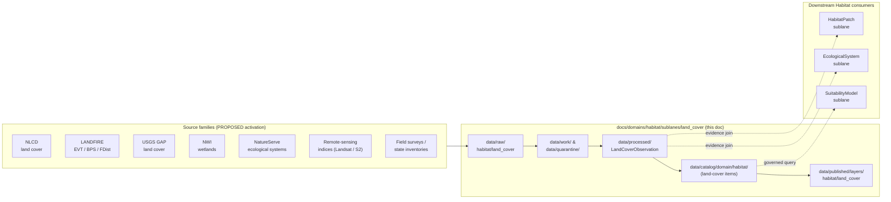
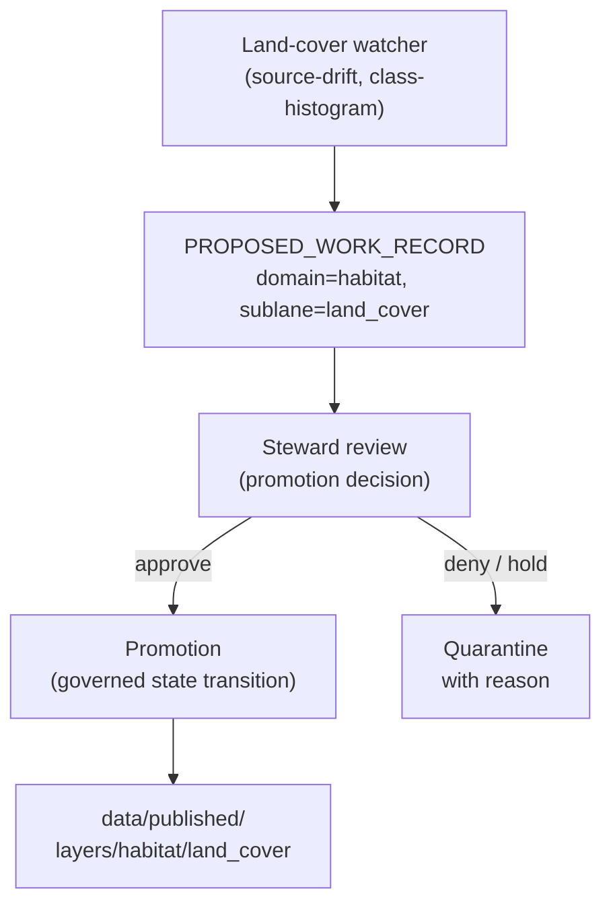

<!-- [KFM_META_BLOCK_V2]
doc_id: kfm://doc/habitat-sublane-land-cover
title: Habitat — Land Cover Sublane
type: standard
version: v0.2
status: draft
owners: <docs-steward + habitat-lane-owner>          # placeholder — confirm via CODEOWNERS
created: 2026-05-17
updated: 2026-06-04
policy_label: public
related:
  - docs/domains/habitat/README.md
  - docs/domains/habitat/sublanes/README.md
  - docs/doctrine/ai-build-operating-contract.md
  - docs/doctrine/directory-rules.md
  - docs/doctrine/authority-ladder.md
  - docs/doctrine/lifecycle-law.md
  - docs/architecture/contract-schema-policy-split.md
  - docs/domains/fauna/README.md
  - docs/domains/flora/README.md
  - docs/domains/agriculture/sublanes/cropland.md
tags: [kfm, habitat, land-cover, sublane, nlcd, landfire, gap, nwi]
notes:
  - "CONTRACT_VERSION = 3.0.0 pinned (doctrine-adjacent)."
  - "Sublane subfolder under docs/domains/habitat/ is PROPOSED structure; ADR/index pending."
  - "LandCoverObservation is a CONFIRMED Habitat object family; field realization is PROPOSED."
  - "Materiality thresholds (2% / max(250 ha, 0.15%)) and PROPOSED_WORK_RECORD + .last.ok watcher pattern are CONFIRMED corpus ideas (ML-067-004/005/006/007, ML-065-026); corpus anchors them to COUNTY analysis units."
  - "Implementation paths (schemas, policy, pipelines) are PROPOSED until verified against mounted repo."
[/KFM_META_BLOCK_V2] -->

# Habitat — Land Cover Sublane

> Governed, evidence-first land-cover observation, normalization, and public-safe derivative publication within the **Habitat** domain. This sublane owns `LandCoverObservation` and the upstream half of `EcologicalSystem` — and nothing else.

**Status:** draft · **Owners:** `<docs-steward + habitat-lane-owner>` · **Last updated:** 2026-06-04

---

## Quick jump

- [1. Scope](#1-scope)
- [2. Repo fit](#2-repo-fit)
- [3. What this sublane owns](#3-what-this-sublane-owns)
- [4. What this sublane does **not** own](#4-what-this-sublane-does-not-own)
- [5. Ubiquitous language](#5-ubiquitous-language)
- [6. Source families and source roles](#6-source-families-and-source-roles)
- [7. Object families and identity](#7-object-families-and-identity)
- [8. Pipeline shape (RAW → PUBLISHED)](#8-pipeline-shape-raw--published)
- [9. Spatial and temporal model](#9-spatial-and-temporal-model)
- [10. Map and viewing products](#10-map-and-viewing-products)
- [11. Cross-lane relations](#11-cross-lane-relations)
- [12. Governance invariants](#12-governance-invariants)
- [13. Verification backlog and open questions](#13-verification-backlog-and-open-questions)
- [14. Related docs](#14-related-docs)
- [Appendix A. Proposed file homes](#appendix-a-proposed-file-homes)
- [Appendix B. Glossary](#appendix-b-glossary)

---

## 1. Scope

**CONFIRMED doctrine / PROPOSED implementation.** The land-cover sublane is the part of the Habitat domain that turns *land-cover source material* — primarily categorical and continuous raster products such as NLCD, LANDFIRE, NWI wetlands, GAP, and reviewed state ecological inventories — into governed `LandCoverObservation` evidence and downstream, public-safe land-cover derivatives. It supplies one of the substrates from which `HabitatPatch`, `EcologicalSystem`, and `SuitabilityModel` are later built by other Habitat sublanes.

> [!IMPORTANT]
> This sublane is **interpretive infrastructure**, not a truth root. A categorical land-cover label from NLCD or LANDFIRE is a *source classification*, not a habitat assertion. Habitat assertions emerge later, through `EvidenceBundle` closure, review state, and policy decisions — never from a tile or a raster alone.

The sublane bounds itself to:

- Capturing land-cover source artifacts with explicit source role, rights, sensitivity, citation, time, and hash.
- Normalizing raster and vector land-cover inputs into `LandCoverObservation` evidence with declared CRS, resolution, valid-pixel footprint, and class scheme.
- Emitting validation reports, `RunReceipt`s, and public-safe candidate derivatives (e.g., generalized cover-class polygons, change-rate summaries, COG/PMTiles overlays).
- Supplying `LandCoverObservation` evidence to downstream Habitat sublanes (patch, suitability, connectivity, ecological-systems) **through governed joins** — never by direct file reach-around.

> [!NOTE]
> **Sublane structural status.** The `docs/domains/<domain>/sublanes/` subfolder is **PROPOSED** structure — it is not enumerated in the Directory Rules canonical lane pattern. A `docs/`-internal sub-tier is most likely a **§17 routine-PR** change rather than a §2.4 ADR trigger (it adds no canonical root, schema home, lifecycle phase, or parallel authority). This document treats `sublanes/` as a sub-organizational convention inside the documentation lane; the corresponding *implementation* lanes (`contracts/`, `schemas/`, `policy/`, `pipelines/`, `data/`, `release/`) follow the Directory Rules domain pattern without a sublane segment unless an ADR adds one. See [Appendix A](#appendix-a-proposed-file-homes) and [§13](#13-verification-backlog-and-open-questions).

### Sublane shape

**[Back to top ↑](#habitat--land-cover-sublane)**

---

## 2. Repo fit

The documentation home of the sublane is this file. Its **implementation files** live under the standard Directory Rules domain pattern with `habitat` as the domain segment. The sublane *topic* (`land_cover`) appears inside those domain segments, not as a new root or parallel home.

| Responsibility root | Proposed path for this sublane | Status |
|---|---|---|
| Docs (this file) | `docs/domains/habitat/sublanes/land_cover.md` | **PROPOSED** (sublane subfolder pattern) |
| Semantic contracts | `contracts/domains/habitat/land_cover/` | PROPOSED |
| Machine schemas | `schemas/contracts/v1/domains/habitat/land_cover/` | PROPOSED (per ADR-0001 default) |
| Policy gates | `policy/domains/habitat/land_cover/` | PROPOSED |
| Pipelines | `pipelines/domains/habitat/land_cover/` | PROPOSED |
| Pipeline specs | `pipeline_specs/habitat/land_cover/` | PROPOSED |
| Connectors (source-specific) | `connectors/<source>/` (e.g., `connectors/nlcd/`) | PROPOSED |
| Tests | `tests/domains/habitat/land_cover/` | PROPOSED |
| Fixtures | `fixtures/domains/habitat/land_cover/` | PROPOSED |
| Lifecycle data | `data/{raw,work,quarantine,processed}/habitat/land_cover/` | PROPOSED |
| Catalog | `data/catalog/domain/habitat/` (land-cover items) | PROPOSED |
| Published layers | `data/published/layers/habitat/land_cover/` | PROPOSED |
| Source registry | `data/registry/sources/habitat/` (NLCD, LANDFIRE, GAP, NWI, …) | PROPOSED |
| Release candidates | `release/candidates/habitat/` (land-cover candidates) | PROPOSED |

> [!CAUTION]
> Every path above is **PROPOSED** until verified against the mounted repository. Do not cite this table as evidence of current repo state. The Directory Rules **domain pattern** is CONFIRMED doctrine; the **specific land-cover paths** below the domain segment are this sublane's proposed placement and require repo confirmation or an ADR if drift exists.

**[Back to top ↑](#habitat--land-cover-sublane)**

---

## 3. What this sublane owns

CONFIRMED at the Habitat-domain level / PROPOSED at the sublane level — meaning the parent Habitat domain has these objects in its object-family spine, and this sublane is the *land-cover-specific* slice of that ownership.

- **`LandCoverObservation`** — full ownership, both upstream evidence and downstream public-safe derivatives.
- **`EcologicalSystem`** — partial, upstream ownership only: cover-class inputs and crosswalk material are sourced here; the synthesized `EcologicalSystem` object is the Ecological Systems sublane's responsibility.
- **`UncertaintySurface`** for land-cover products — owned here when the uncertainty is a property of the land-cover artifact itself (classification accuracy, valid-pixel mask, source-vintage gap).
- **`Model Run Receipt`** when this sublane runs a land-cover-derived model (e.g., change-rate summary, generalization, reclassification crosswalk).

**[Back to top ↑](#habitat--land-cover-sublane)**

---

## 4. What this sublane does **not** own

CONFIRMED Habitat-level boundary, reinforced here.

- **Species occurrence truth, plant taxonomy, fauna taxonomy.** Owned by Fauna and Flora respectively. A land-cover class does not assert species presence; it is at most context.
- **Crop type and crop rotation.** Owned by Agriculture. USDA NASS CDL is a crop classification, not a habitat classification, and its joining into Habitat happens through a governed adjacency — never by reclassifying CDL inside this sublane.
- **Soil map units, components, horizons.** Owned by Soil.
- **Hydrologic features, watersheds, NFHL flood layers.** Owned by Hydrology.
- **`HabitatPatch`, `SuitabilityModel`, `ConnectivityEdge`, `Corridor`, `Restoration Opportunity`, `StewardshipZone`.** Owned by other Habitat sublanes; this sublane supplies inputs only.
- **Critical-habitat regulatory designations (USFWS ECOS).** A separate Habitat sublane handles regulatory critical habitat; this sublane treats those services as cross-references, not as land-cover sources.

> [!WARNING]
> **Source-role discipline.** A community-science raster, a marketing land-cover product, or an unreviewed automated classifier is **not** a land-cover authority inside KFM, regardless of resolution or recency. Source role cannot be inferred from convenience.

**[Back to top ↑](#habitat--land-cover-sublane)**

---

## 5. Ubiquitous language

CONFIRMED terms (used at the Habitat-domain level) / PROPOSED field-realization within this sublane.

| Term | Sublane meaning | Status |
|---|---|---|
| `LandCoverObservation` | A governed evidence object representing a land-cover classification (categorical or continuous) over a declared spatial and temporal scope, with explicit source role, class scheme, CRS, resolution, valid-pixel support, and evidence references. | CONFIRMED term / PROPOSED field realization |
| **Class scheme** | The named, versioned classification system the observation is encoded in (e.g., NLCD 2019 Legend, LANDFIRE EVT, USGS GAP NVC-aligned). Crosswalks between schemes are first-class artifacts, not silent recodes. | PROPOSED |
| **Valid-pixel footprint** | Per-observation mask of pixels that contribute to the classification, separate from nodata; an evidence artifact in its own right. | PROPOSED (carried forward from raster doctrine) |
| **Cover-class crosswalk** | A reviewed, citable mapping between two class schemes (e.g., NLCD → GAP land cover), emitted as evidence and never as a silent transformation in a renderer. | PROPOSED |
| **Land-cover change-rate summary** | A derived, public-safe summary (e.g., per-county hectare deltas by class between two vintages) produced under the materiality discipline described in [§8](#8-pipeline-shape-raw--published). | PROPOSED |
| **Generalized cover layer** | A public-safe derivative — typically PMTiles or COG — produced after promotion, with declared generalization transform, source-vintage stamp, and citation surface. | PROPOSED |
| **Modeled land cover** | Land cover output by a model rather than directly observed; carries `Model Run Receipt` and model-vs-observation labeling. | CONFIRMED Habitat term / PROPOSED here |
| **Geoprivacy transform** | Used by Fauna/Flora; mentioned here because cross-lane joins must respect it. Land cover itself is generally not geoprivacy-sensitive, but joins to sensitive occurrences are. | CONFIRMED Habitat term / PROPOSED here |

**[Back to top ↑](#habitat--land-cover-sublane)**

---

## 6. Source families and source roles

CONFIRMED Habitat source roster includes NLCD, GAP/LANDFIRE, NWI, NatureServe, and state ecological inventories. The table below specializes that roster to this sublane.

| Source family | Sublane role | Authority class | Sensitivity | Freshness | Status |
|---|---|---|---|---|---|
| **NLCD** (MRLC / USGS) | Categorical land-cover observation | Authoritative federal observation product | Generally public | Periodic vintages; Annual NLCD products exist for some years (NEEDS VERIFICATION of vintages used) | CONFIRMED source family / PROPOSED activation |
| **LANDFIRE** (Existing Vegetation Type, BPS, Fire-Disturbance) | Vegetation / fuel-context observation | Authoritative federal observation product | Generally public | Periodic LANDFIRE versions (NEEDS VERIFICATION of version pin) | CONFIRMED source family / PROPOSED activation |
| **USGS GAP** (land cover) | Categorical land-cover observation, NVC-aligned | Authoritative federal observation product | Generally public | Periodic; sparse update cadence | CONFIRMED source family / PROPOSED activation |
| **USFWS NWI** (wetlands) | Categorical wetland-class observation | Authoritative federal observation product | Generally public; some wetland geometries may carry stewardship caveats | Per-state vintages; rolling updates | CONFIRMED source family / PROPOSED activation |
| **NatureServe** (ecological systems) | Cross-reference / crosswalk authority for ecological systems | Controlled distribution | Rights & terms NEEDS VERIFICATION; sensitive joins fail closed | Periodic | CONFIRMED source family / PROPOSED activation |
| **State ecological inventories** (e.g., KDWP, KS GAP-adjacent) | Reviewed context | Authority class varies by state | Some restricted layers; default deny on uncertain rights | Cadence varies | CONFIRMED source family / PROPOSED activation |
| **Remote-sensing indices** (Landsat C2 L2, Sentinel-2 L2A, HLS, RCMAP) | Observation inputs to derived land-cover and to change-rate analyses | Federal observation; license-marked | Generally public | Frequent | CONFIRMED source family / PROPOSED activation |
| **USDA NASS CDL** | **Adjacency** only (Agriculture-owned). Used as context, not reclassified into Habitat cover. | Authoritative federal observation | Public domain | Annual | CONFIRMED adjacency / PROPOSED join discipline |

> [!IMPORTANT]
> **No source family is activated until** a `SourceDescriptor` exists, source role is declared, rights and current terms are recorded, fixtures exist, validators pass, and a source-activation decision is issued. Connectors and watchers remain inactive until activation. This applies uniformly to NLCD, LANDFIRE, GAP, NWI, NatureServe, state inventories, and remote-sensing inputs. A cross-source watcher cadence matrix (SSURGO, AirData, NWIS, CDL, PLANTS) anchors per-source cadence and no-op receipt behavior. `[KFM-P29-IDEA-0006]`

### Source-role separations to preserve

- NLCD is an **observation product**, not regulatory law; it does not designate critical habitat.
- LANDFIRE EVT is a **vegetation observation**, not a fire-behavior prediction.
- NWI is a **wetlands observation**, not a regulatory wetlands delineation under §404.
- USDA NASS CDL is a **crop observation**, not a habitat classification.
- Field surveys and state inventories are **observation under review**, not authority over federal classification schemes.

**[Back to top ↑](#habitat--land-cover-sublane)**

---

## 7. Object families and identity

CONFIRMED object spine at the Habitat-domain level / PROPOSED identity rules below.

| Object | Purpose in this sublane | Identity rule (PROPOSED) | Temporal handling (CONFIRMED) |
|---|---|---|---|
| `LandCoverObservation` | Represents a categorical or continuous land-cover classification over a declared scope. | Deterministic basis: `source_id + class_scheme_id + spatial_scope + temporal_scope + normalized_digest` | Source time, observed time, valid time, retrieval time, release time, correction time held distinct where material. |
| `ClassSchemeProfile` | Names and pins the class scheme + version (e.g., `nlcd:2019:legend-v1`). | `scheme_namespace + scheme_id + scheme_version` | Class-scheme versions are immutable once published. |
| `CoverClassCrosswalk` | Reviewed mapping between two `ClassSchemeProfile`s. | `from_scheme_id + to_scheme_id + crosswalk_version + reviewer_state` | Crosswalk versions are immutable once published. |
| `LandCoverChangeSummary` | Public-safe summary of net/relative change between two `LandCoverObservation`s over an analysis unit (e.g., county). | `from_obs_id + to_obs_id + analysis_unit_id + threshold_profile_id` | Distinguishes observed change from interpretation. |
| `UncertaintySurface` (land-cover scope) | Per-observation accuracy and footprint information. | `observation_id + uncertainty_kind + spec_hash` | Aligns to the observation's temporal scope. |
| `Model Run Receipt` (land-cover scope) | Signed receipt for any land-cover-derived modeled output (e.g., reclassification, generalization). | `model_id + model_version + inputs_digest + config_digest + spec_hash` | Run time, model version, input vintage all distinct. |
| `LayerManifest` (land-cover layer) | Describes a published, public-safe land-cover layer (PMTiles/COG/vector tiles). | `layer_id + source refs + style refs + tileset digest` | Stale-state rule applies. |

> [!NOTE]
> **Field-level shape** of these objects belongs in `schemas/contracts/v1/domains/habitat/land_cover/` per ADR-0001. This document defines responsibility and meaning, not schema fields.

**[Back to top ↑](#habitat--land-cover-sublane)**

---

## 8. Pipeline shape (RAW → PUBLISHED)

CONFIRMED doctrine — the KFM lifecycle invariant `RAW → WORK / QUARANTINE → PROCESSED → CATALOG / TRIPLET → PUBLISHED` applies. PROPOSED specialization for land cover follows.

| Stage | What this sublane does | Gate | Status |
|---|---|---|---|
| **RAW** | Capture immutable source payload or reference for an NLCD / LANDFIRE / GAP / NWI / RS scene with source role, rights, sensitivity, citation, time, and hash. | `SourceDescriptor` exists; source-activation decision permits use. | PROPOSED |
| **WORK / QUARANTINE** | Normalize CRS, class scheme, valid-pixel footprint, nodata, identity, evidence, and rights; hold failures (corrupt rasters, unverified attestations, undeclared class schemes, rights doubt). | Validation + policy gate pass, or quarantine reason recorded. | PROPOSED |
| **PROCESSED** | Emit validated `LandCoverObservation` objects, `UncertaintySurface` artifacts, valid-pixel masks, normalized rasters/vectors, and `RunReceipt`s. Public-safe candidates emerge here. | `EvidenceRef` resolves; `ValidationReport` passes; digest closure exists. | PROPOSED |
| **CATALOG / TRIPLET** | Emit catalog records, `EvidenceBundle`s, graph/triplet projections, and release candidates (generalized cover layers, change summaries, crosswalk artifacts). | Catalog/proof closure passes; `PromotionDecision` is reviewable. | PROPOSED |
| **PUBLISHED** | Serve released public-safe land-cover layers and summaries through governed APIs and manifests. | `ReleaseManifest` exists; rollback target exists; correction path exists. | PROPOSED |

### Watcher and source-drift discipline

CONFIRMED doctrine: **watchers observe and record; watchers do not publish.** A land-cover watcher (e.g., NLCD vintage delta, LANDFIRE version delta, county-bounded reclassification) emits a `PROPOSED_WORK_RECORD` and writes a `<key>.last.ok` checkpoint containing the `spec_hash` — it does not move artifacts into `data/published/`. The `PROPOSED_WORK_RECORD` carries domain, source, county_fips, time, source heads, reason, old/new histograms, and thresholds; it is consumed by review (a queue or PR-emitter), never by public UI. `[ML-067-006]` `[ML-067-007]` `[KFM-P1-PROG-0063]`

### Materiality (thresholds)

The materiality defaults below are **CONFIRMED corpus ideas** (`[ML-067-004]`, `[ML-065-026]`); the corpus directs that **thresholds be versioned policy inputs, not hard-coded map logic** — so they live in `policy/domains/habitat/land_cover/` and are steward-tunable.

- **Reclassification fraction:** any class reclassification above **2% of analysis-unit area**. `[ML-067-004]` `[ML-065-026]`
- **Net area change:** any net per-class delta above **max(250 ha, 0.15% of analysis-unit hectares)**. `[ML-067-004]` `[ML-065-026]`
- **Boundary tests:** at threshold, just below threshold, and across analysis-unit scales. `[ML-067-004]`

> [!NOTE]
> **Analysis-unit caveat.** The corpus anchors these thresholds to the **county** analysis unit (CDL/county-histogram drift, `[ML-067-005]`, `[KFM-P1-PROG-0063]`). This sublane *proposes* generalizing the same discipline to other analysis units (HUC, ecoregion) for land cover — that generalization is **PROPOSED / NEEDS VERIFICATION**, not yet corpus-anchored. Per-domain steward tuning is expected, and the CDL/PLANTS materiality gate (`[KFM-P29-IDEA-0001]`) is the sibling pattern.

### Raster handling discipline (CONFIRMED externally; PROPOSED enforcement here)

- **Categorical rasters** (NLCD, LANDFIRE EVT, GAP, NWI) use **nearest** or **mode** resampling; never bilinear.
- **Continuous rasters** (RS indices, fractional cover) **may** use bilinear with declared statistics.
- Keep **analysis CRS** separate from **web-delivery CRS**; declare both in the artifact manifest. `[ML-E-062]`
- **Nodata** must remain consistent through overviews; valid-pixel footprints are evidence artifacts.
- COGs require internal tiling, overviews, and HTTP Range / CORS verification before publication.
- Histogram shifts between vintages belong in the **promotion diff report**, not silently in a rebuilt layer. Never silently drop geometry; area-drift thresholds become a CI gate. `[ML-061-035]` `[ML-061-036]`

**[Back to top ↑](#habitat--land-cover-sublane)**

---

## 9. Spatial and temporal model

CONFIRMED at the Habitat-domain level / PROPOSED specialization here.

- **Geometry:** rasters (categorical and continuous) and their vectorized derivatives (e.g., generalized cover polygons). Patch graphs are produced downstream by the Patch sublane.
- **Resolution discipline:** native source resolution is preserved through `PROCESSED`; only `CATALOG / TRIPLET` and `PUBLISHED` stages may emit reprojected, resampled, or generalized derivatives, and each carries its own manifest with declared transforms. **10 m analysis layers stay distinct from 30 m rollup derivatives**, never silently mixed.
- **Time:** every `LandCoverObservation` carries the source vintage (when the imagery was acquired or the classification was produced), the observation/valid period (the period the classification claims to describe), the retrieval time, and the release time. Annual / multi-year products keep these distinct.
- **Uncertainty:** classification accuracy (per-scheme, per-vintage), valid-pixel footprint, source-vintage gap, and crosswalk uncertainty travel with the observation as `UncertaintySurface` artifacts.

> [!TIP]
> Render **model-vs-observation labels** wherever this sublane's outputs surface. A modeled reclassification or a vectorized derivative is not the same evidentiary object as a directly observed federal product, even when they look identical on a basemap.

**[Back to top ↑](#habitat--land-cover-sublane)**

---

## 10. Map and viewing products

PROPOSED public-safe products served via governed interfaces; CONFIRMED cross-cutting controls.

| Product | What it is | Public safety posture |
|---|---|---|
| Generalized cover-class layer | PMTiles / vector tiles of cover classes at declared generalization. | Public-safe by default; carries source vintage badge. |
| Source-vintage comparison view | Side-by-side or swipe between two vintages with declared crosswalk. | Public-safe; surfaces change as observation, not interpretation. |
| Change-rate summary view | County / analysis-unit cards summarizing `LandCoverChangeSummary` artifacts. | Public-safe; carries threshold profile and materiality posture. |
| Uncertainty mode | Per-pixel or per-zone overlay of valid-pixel footprint and accuracy. | Public-safe. |
| Sensitivity-redacted mode | Activated when a land-cover view is joined to sensitive Fauna/Flora occurrences. Falls back to deny if the join would expose sensitive sites. | **Fails closed.** |
| Habitat-fauna / habitat-flora join view | Bounded join driven by the Habitat-Fauna / Habitat-Flora sublanes. | Public-safe only after geoprivacy transform; otherwise denied. |

CONFIRMED cross-cutting controls apply: **Evidence Drawer**, **time-aware state**, **trust badges**, **correction / stale-state view**, and **governed Focus Mode**. Popups and badges never substitute for the Evidence Drawer. Attribute leakage into public tiles is prevented by an explicit include-list; vector-tile attributes are whitelisted. `[ML-E-061]` `[ML-061-132]`

> [!CAUTION]
> A rendered tile is a downstream carrier. It is **not** the truth, **not** proof of release, and **not** authority for habitat assertion. A histogram or tile is not itself evidence closure. `[ML-065-027]` Public clients resolve `EvidenceRef → EvidenceBundle` through the governed API; they do not read canonical stores directly.

**[Back to top ↑](#habitat--land-cover-sublane)**

---

## 11. Cross-lane relations

CONFIRMED / PROPOSED relations preserving ownership, source role, sensitivity, and `EvidenceBundle` support.

| This sublane | Related lane | Relation type | Constraint |
|---|---|---|---|
| Land cover | Habitat / Patch sublane | Patch construction consumes cover-class evidence. | Patch is owner; land cover supplies inputs only. |
| Land cover | Habitat / Ecological Systems sublane | Crosswalk and class-scheme inputs feed ecological-system synthesis. | Ecological Systems sublane is owner of the synthesized object. |
| Land cover | Fauna | Cover-class context for occurrence interpretation, never an authority over taxon or occurrence. | Sensitive joins (nest, den, roost, hibernacula, spawning) fail closed regardless of source. `[ENCY §20.5]` `[Operating Contract §23.2]` |
| Land cover | Flora | Vegetation-community and rare-plant context where the *Flora* sublane authorizes the join. | Rare-plant exact location denied to public consumers; cover layer must not become a sensitivity bypass. `[ENCY §20.5]` |
| Land cover | Soil | Substrate context, not derivation. | Soil owns map units, components, horizons; cover does not reclassify into Soil. |
| Land cover | Hydrology | Wetlands and riparian context; NWI is the wetland-class source. | NFHL flood layers remain Hydrology / regulatory context — never used as land cover. |
| Land cover | Agriculture | Crop / CDL adjacency for non-cropland context only. | CDL stays Agriculture-owned; this sublane does not reclassify CDL into Habitat cover. |
| Land cover | Hazards | Fire, drought, smoke stress context. | Hazards owns the events; land cover provides only the underlying cover state; KFM is never an alert authority. |
| Land cover | Planetary / 3D | Generalized cover may be admitted to 3D scenes via reality-boundary controls. | Sensitive joins denied; 3D scene is alternate renderer, not alternate truth. |

**[Back to top ↑](#habitat--land-cover-sublane)**

---

## 12. Governance invariants

Restated for this sublane. Bending any of these requires an ADR with a clear tradeoff statement.

- **Trust membrane.** Public clients and normal UI surfaces consume governed APIs and released artifacts. They never read `data/raw/`, `data/work/`, `data/processed/`, or `data/catalog/` directly.
- **Watcher-as-non-publisher.** A land-cover watcher emits work records, sidecars, and checkpoints. It does not write to `data/catalog/`, `data/published/`, or `release/`. `[ML-067-006]` `[ML-067-007]`
- **Connector-as-non-publisher.** A connector emits to `data/raw/` or `data/quarantine/`. It does not publish.
- **Promotion is a governed state transition.** Not a file move. Not a watcher action. Not a renderer side effect.
- **Lifecycle skip is forbidden.** No pipeline writes from `RAW` directly to `data/published/`. Every phase runs; quarantine is recorded.
- **`EvidenceRef` must resolve to `EvidenceBundle`** before any public claim authority. A class label on a tile is not a claim; the bundle behind it is.
- **Cite-or-abstain.** When source role, rights, freshness, or review state is incomplete, the sublane abstains.
- **Default-deny on sensitive joins.** Land cover joined to sensitive Fauna/Flora occurrences fails closed unless a documented geoprivacy transform and review state allow release.
- **No silent crosswalk.** Class-scheme conversion (e.g., NLCD → GAP) emits a `CoverClassCrosswalk` artifact reviewed and cited; renderers do not recode on the fly.
- **No validator side effects.** Validators operate on declared evidence and lineage only — no live fetch, catalog mutation, publish, or AI-inferred truth. `[ML-065-025]`
- **Schema-home discipline.** Per ADR-0001, machine schemas live under `schemas/contracts/v1/...`. `contracts/` retains semantic Markdown.
- **Policy-home discipline.** `policy/` (singular) is canonical; `policies/`, if present, is mirror / compatibility.

**[Back to top ↑](#habitat--land-cover-sublane)**

---

## 13. Verification backlog and open questions

| Item | Evidence that would settle it | Status |
|---|---|---|
| Whether `docs/domains/<domain>/sublanes/` is a sanctioned subdivision, or whether sublane docs should live flat in `docs/domains/habitat/` with topic-prefixed filenames. | ADR amending Directory Rules, or per-root README / `sublanes/README.md` convention. | **NEEDS VERIFICATION** |
| Whether `LandCoverObservation` schema home is `schemas/contracts/v1/domains/habitat/land_cover/` or a Habitat-flat home. | Mounted repo schemas + ADR-0001 application. | NEEDS VERIFICATION |
| Whether NLCD and LANDFIRE source-rights metadata permits the planned derivatives (generalized cover, change summaries, joins to non-federal layers). | Source registry entries, rights review, source-activation decision. | **NEEDS VERIFICATION** |
| Which vintages of NLCD (and which Annual NLCD years, if any) are activated. | `SourceDescriptor` entries; fixture set. | NEEDS VERIFICATION |
| Which LANDFIRE version (EVT, BPS, FDist) is pinned and how upgrades are governed. | Pinning policy + ADR. | NEEDS VERIFICATION |
| Whether NWI carries any stewardship caveats in the Kansas footprint that change the default public posture. | Source-rights review. | NEEDS VERIFICATION |
| Whether state ecological inventories (e.g., KDWP) impose review-only access on any layers used here. | State-source rights review. | NEEDS VERIFICATION |
| Whether the CONFIRMED county-anchored materiality thresholds (2%, max(250 ha, 0.15%)) generalize to HUC / ecoregion analysis units for land cover. | Policy file + steward review; corpus anchors county only (`[ML-067-004]`). | PROPOSED, NEEDS VERIFICATION |
| Whether `LandCoverChangeSummary` is its own published object family or a derivative of `LandCoverObservation` pairs. | Schema-home decision; ADR if a new family is added. | UNKNOWN |
| Whether `ClassSchemeProfile` and `CoverClassCrosswalk` belong in the shared governance kernel (used by Agriculture for CDL) or in lane-local schema. | Shared-kernel ADR. | UNKNOWN |
| Whether MapLibre overlay registry binds land-cover layers via the standard `LayerManifest` / `TileArtifactManifest` flow. | Layer-manifest fixtures and MapLibre adapter evidence. | NEEDS VERIFICATION |
| Whether `EcologicalSystem` upstream ownership lives here or in its own sublane. | Habitat-lane ADR. | UNKNOWN |
| Whether watcher `PROPOSED_WORK_RECORD` schema is shared with the Agriculture / CDL watcher or domain-local. | Shared-kernel ADR; corpus shows a shared CDL/PLANTS pattern (`[ML-067-006]`). | UNKNOWN |

**[Back to top ↑](#habitat--land-cover-sublane)**

---

## 14. Related docs

> Some of the entries below are **placeholders** and will only resolve after the corresponding files exist. Treat them as the link surface this sublane expects, not as a verified link inventory.

- `docs/domains/habitat/README.md` — Habitat domain dossier (TODO).
- `docs/domains/habitat/sublanes/README.md` — sublane index (TODO).
- `docs/domains/habitat/sublanes/patch.md` — Habitat patch sublane (TODO).
- `docs/domains/habitat/sublanes/ecological_systems.md` — Ecological Systems sublane.
- `docs/domains/habitat/sublanes/suitability.md` — Suitability model sublane (TODO).
- `docs/domains/habitat/sublanes/connectivity.md` — Connectivity / corridors sublane.
- `docs/domains/fauna/README.md` — Fauna domain dossier (TODO).
- `docs/domains/flora/README.md` — Flora domain dossier (TODO).
- `docs/domains/agriculture/sublanes/cropland.md` — Cropland (CDL) sublane; adjacency reference (TODO).
- `docs/doctrine/ai-build-operating-contract.md` — operating contract (`CONTRACT_VERSION = "3.0.0"`).
- `docs/doctrine/directory-rules.md` — Canonical placement and lifecycle doctrine.
- `docs/doctrine/authority-ladder.md` — Authority ordering.
- `docs/doctrine/trust-membrane.md` — Public-path discipline.
- `docs/doctrine/lifecycle-law.md` — `RAW → PUBLISHED` invariant.
- `docs/architecture/contract-schema-policy-split.md` — Where meaning, shape, and admissibility live.
- `docs/registers/DRIFT_REGISTER.md` — Drift entries (including any sublane-pattern drift).
- `docs/registers/VERIFICATION_BACKLOG.md` — Verification backlog items raised here.

**[Back to top ↑](#habitat--land-cover-sublane)**

---

## Appendix A. Proposed file homes

<strong>Per-object proposed homes (click to expand)</strong>

> All paths are **PROPOSED** until verified against the mounted repository. The Directory Rules **domain pattern** is CONFIRMED doctrine; the sublane-specific paths below are this document's proposed placement.

| Object / artifact | Semantic home (contracts) | Schema home | Fixture home | Policy home | Test home | Emitted-instance home |
|---|---|---|---|---|---|---|
| `LandCoverObservation` | `contracts/domains/habitat/land_cover/observation.md` | `schemas/contracts/v1/domains/habitat/land_cover/observation.schema.json` | `fixtures/domains/habitat/land_cover/observation/` | `policy/domains/habitat/land_cover/observation/` | `tests/domains/habitat/land_cover/observation/` | `data/processed/habitat/land_cover/` |
| `ClassSchemeProfile` | `contracts/domains/habitat/land_cover/class_scheme.md` | `schemas/contracts/v1/domains/habitat/land_cover/class_scheme.schema.json` | `fixtures/domains/habitat/land_cover/class_scheme/` | `policy/domains/habitat/land_cover/class_scheme/` | `tests/domains/habitat/land_cover/class_scheme/` | `data/registry/sources/habitat/` |
| `CoverClassCrosswalk` | `contracts/domains/habitat/land_cover/crosswalk.md` | `schemas/contracts/v1/domains/habitat/land_cover/crosswalk.schema.json` | `fixtures/domains/habitat/land_cover/crosswalk/` | `policy/domains/habitat/land_cover/crosswalk/` | `tests/domains/habitat/land_cover/crosswalk/` | `data/catalog/domain/habitat/` |
| `LandCoverChangeSummary` | `contracts/domains/habitat/land_cover/change_summary.md` | `schemas/contracts/v1/domains/habitat/land_cover/change_summary.schema.json` | `fixtures/domains/habitat/land_cover/change_summary/` | `policy/domains/habitat/land_cover/change_summary/` | `tests/domains/habitat/land_cover/change_summary/` | `data/processed/habitat/land_cover/change/` |
| `UncertaintySurface` (land-cover scope) | `contracts/domains/habitat/land_cover/uncertainty.md` | `schemas/contracts/v1/domains/habitat/land_cover/uncertainty.schema.json` | `fixtures/domains/habitat/land_cover/uncertainty/` | `policy/domains/habitat/land_cover/uncertainty/` | `tests/domains/habitat/land_cover/uncertainty/` | `data/processed/habitat/land_cover/uncertainty/` |
| `Model Run Receipt` (land-cover scope) | `contracts/domains/habitat/land_cover/model_run_receipt.md` | shared kernel (TODO confirm) | `fixtures/domains/habitat/land_cover/model_run/` | `policy/domains/habitat/land_cover/model_run/` | `tests/domains/habitat/land_cover/model_run/` | `data/receipts/habitat/land_cover/` |
| `LayerManifest` (land-cover layer) | shared kernel (TODO confirm) | shared kernel (TODO confirm) | `fixtures/domains/habitat/land_cover/layer_manifest/` | `policy/domains/habitat/land_cover/layer_manifest/` | `tests/domains/habitat/land_cover/layer_manifest/` | `data/published/layers/habitat/land_cover/` |
| Source-watcher `PROPOSED_WORK_RECORD` | shared kernel (TODO confirm) | shared kernel (TODO confirm) | `fixtures/domains/habitat/land_cover/watcher/` | `policy/domains/habitat/land_cover/watcher/` | `tests/domains/habitat/land_cover/watcher/` | `data/quarantine/habitat/land_cover/` or `data/receipts/habitat/land_cover/` |

<strong>Cross-domain / shared-kernel candidates (click to expand)</strong>

These objects are candidates for the **shared governance kernel** rather than the land-cover sublane:

- `EvidenceBundle`, `EvidenceRef`, `SourceDescriptor`, `RunReceipt`, `PromotionDecision`, `ReleaseManifest`, `PolicyDecision`, `DecisionEnvelope` — shared kernel (CONFIRMED at doctrine level).
- `LayerManifest`, `TileArtifactManifest`, `StyleManifest`, `MapReleaseManifest` — shared map asset family (CONFIRMED at doctrine level; field set still PROPOSED).
- `ClassSchemeProfile`, `CoverClassCrosswalk`, `Model Run Receipt` — candidates for **shared kernel** because Agriculture / CDL needs the same shapes. The corpus already treats CDL/PLANTS watchers and sidecars as a shared pattern (`[ML-067-006]`, `[KFM-P29-IDEA-0006]`). Requires ADR before lane-local definitions diverge.

**[Back to top ↑](#habitat--land-cover-sublane)**

---

## Appendix B. Glossary

<strong>Acronyms and external products (click to expand)</strong>

> These are **external** product references included for orientation. KFM treats each one through `SourceDescriptor`, rights review, and source-activation decision. No external product is a trust authority inside KFM.

- **NLCD** — National Land Cover Database (USGS / MRLC). Categorical land-cover product; multiple vintages. Source role here: **observation**.
- **LANDFIRE** — Landscape Fire and Resource Management Planning Tools. EVT (Existing Vegetation Type), BPS (Biophysical Settings), and Fire/Disturbance products. Source role here: **observation**.
- **USGS GAP** — Gap Analysis Project land cover, NVC-aligned. Source role here: **observation**.
- **NWI** — National Wetlands Inventory (USFWS). Source role here: **observation** (not regulatory delineation).
- **NatureServe ecological systems** — Crosswalk and classification authority for ecological systems. Source role here: **controlled cross-reference / crosswalk authority**.
- **USDA NASS CDL** — Cropland Data Layer. Source role here: **Agriculture-owned adjacency**, not Habitat land cover.
- **HLS** — Harmonized Landsat-Sentinel. Source role here: **remote-sensing observation input**.
- **PMTiles / COG** — Distribution formats for vector/raster tiles. Carriers, not authority.
- **CRS** — Coordinate Reference System.

**[Back to top ↑](#habitat--land-cover-sublane)**

---

> **Related:** [Habitat README (TODO)](README.md) · [Sublane index (TODO)](README.md) · [Ecological Systems](ecological_systems.md) · [Connectivity](connectivity.md) · [Operating Contract](../../../doctrine/ai-build-operating-contract.md) · [Directory Rules](../../../doctrine/directory-rules.md) · [Cropland sublane (TODO)](../../agriculture/sublanes/cropland.md) · [Drift Register (TODO)](../../../registers/DRIFT_REGISTER.md)
>
> **Last updated:** 2026-06-04 · **Version:** v0.2 · `CONTRACT_VERSION = "3.0.0"` · **[Back to top ↑](#habitat--land-cover-sublane)**
