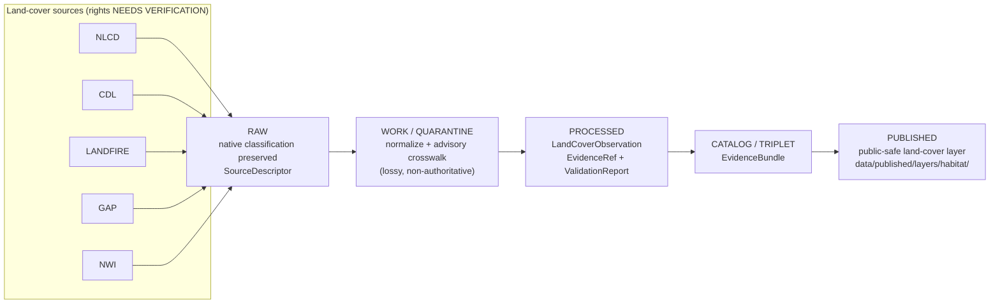

<!-- [KFM_META_BLOCK_V2]
doc_id: kfm://doc/<uuid>                                   # placeholder — assign on intake
title: Habitat Sublane — Land Cover (LandCoverObservation)
type: standard
version: v1
status: draft
owners: <habitat-domain-steward>                          # placeholder — confirm in CODEOWNERS
created: 2026-06-04
updated: 2026-06-04
policy_label: public
related:
  - ../../README.md                                       # docs/domains/habitat/README.md (PROPOSED neighbor)
  - ../../../../doctrine/ai-build-operating-contract.md    # canonical operating contract
  - ../../../../doctrine/directory-rules.md
  - ../../../../../schemas/contracts/v1/habitat/            # schema home (PROPOSED depth)
  - ../../../../../contracts/habitat/                       # meaning home (PROPOSED depth)
tags: [kfm, habitat, sublane, land-cover, LandCoverObservation]
notes:
  - "CONTRACT_VERSION = 3.0.0 pinned."
  - "Land-cover crosswalks are advisory, not authoritative (lossy). Native classification preserved."
  - "All repo paths PROPOSED until verified against a mounted repository."
[/KFM_META_BLOCK_V2] -->

# 🛰️ Habitat Sublane — Land Cover

> The Habitat sublane that governs **`LandCoverObservation`**: per-source land-cover evidence (NLCD, CDL, LANDFIRE, GAP, NWI) ingested with native classification preserved and **advisory** crosswalks layered on top.

| Field | Value |
|---|---|
| **Status** | `experimental` — sublane documentation; field realization `PROPOSED` |
| **Owners** | `<habitat-domain-steward>` (placeholder; confirm via CODEOWNERS) |
| **Updated** | 2026-06-04 |
| **Owning domain** | Habitat `[DOM-HAB] [DOM-HF]` — **CONFIRMED** Habitat owns `LandCoverObservation` |
| **Authority** | Documentation sublane under `docs/domains/habitat/` — doc segment, not a responsibility root |

> [!IMPORTANT]
> Land-cover authorities use **different classification schemes and update cadences**, so KFM **preserves each native classification verbatim** and treats cross-scheme mappings as **advisory crosswalks, never authoritative**. Flattening sources into one scheme is a doctrine violation. `[KFM-P2-IDEA-0028]` *(CONFIRMED.)*

---

## Quick jump

- [1. Scope](#1-scope)
- [2. Repo fit](#2-repo-fit)
- [3. Inputs — what belongs here](#3-inputs--what-belongs-here)
- [4. Exclusions — what does not belong here](#4-exclusions--what-does-not-belong-here)
- [5. Object & identity](#5-object--identity)
- [6. Classification crosswalks](#6-classification-crosswalks)
- [7. Source families](#7-source-families)
- [8. Sublane data flow](#8-sublane-data-flow)
- [9. Cross-lane relations](#9-cross-lane-relations)
- [10. Sensitivity & publication posture](#10-sensitivity--publication-posture)
- [11. FAQ](#11-faq)
- [12. Related docs](#12-related-docs)
- [13. Appendix — verification backlog](#13-appendix--verification-backlog)

---

## 1. Scope

This sublane governs **land-cover observations** within the Habitat domain — the ingestion, native-classification preservation, crosswalking, and public-safe release of land-cover surfaces over Kansas.

The canonical object is **`LandCoverObservation`**, one of the Habitat-owned object families. `[DOM-HAB] [DOM-HF] [ENCY]` *(CONFIRMED that Habitat owns `LandCoverObservation`.)*

Land cover is a **shared context surface**: it informs habitat patches and suitability here, but it is also consumed by agriculture, biodiversity, and hazards lanes. This sublane owns the land-cover *evidence and public-safe derivatives*; downstream lanes cite it, never modify it. `[KFM-P2-IDEA-0028]` *(CONFIRMED that land cover is central to multiple domains.)*

[↑ Back to top](#-habitat-sublane--land-cover)

## 2. Repo fit

**Path (PROPOSED):** `docs/domains/habitat/sublanes/land_cover/README.md`

The `docs/domains/habitat/` documentation segment is **CONFIRMED** doctrine (domains are lane segments inside responsibility roots, never root folders). `[DIRRULES §12]` The `sublanes/land_cover/` sub-segment is a **PROPOSED** organizational convention beneath that segment.

> [!NOTE]
> A dedicated `sublanes/` path segment under `docs/domains/<domain>/` is **NEEDS VERIFICATION** — it was not located in `directory-rules.md` this session. If the Habitat doc suite uses a different sub-organization (e.g., flat `LAND_COVER.md` or a topic folder without the `sublanes/` wrapper), reconcile to that convention and log the choice. Snake_case `land_cover` is used here to match the snake_case sub-lane pattern seen elsewhere; confirm against the repo's casing convention.

| Direction | Neighbor | Relationship |
|---|---|---|
| **Upstream (parent)** | [`docs/domains/habitat/README.md`](../../README.md) | Habitat domain landing doc *(PROPOSED neighbor)* |
| **Sibling sublanes** | habitat patch · ecological system · suitability · connectivity *(PROPOSED siblings)* | Other Habitat object families, each a potential sublane |
| **Schema home** | [`schemas/contracts/v1/habitat/`](../../../../../schemas/contracts/v1/habitat/) | `LandCoverObservation` machine schema lives here *(PROPOSED; ADR-0001 canonical)* |
| **Meaning home** | [`contracts/habitat/`](../../../../../contracts/habitat/) | Semantic contract Markdown *(PROPOSED)* |

[↑ Back to top](#-habitat-sublane--land-cover)

## 3. Inputs — what belongs here

- Human-facing documentation of the **`LandCoverObservation`** object: its meaning, identity rule, temporal handling, and field realization status.
- The **advisory crosswalk** narrative: how native classification schemes map to a common vocabulary, and where mappings are lossy.
- The **source-family register** for land cover (NLCD, CDL, LANDFIRE, GAP, NWI) and their roles.
- Pointers to the machine schema, contract, validators, and policy entries that govern this object.

## 4. Exclusions — what does not belong here

| Do **not** place here | Goes instead to | Rule |
|---|---|---|
| Machine schema (`.schema.json`) | `schemas/contracts/v1/habitat/` | ADR-0001 |
| Semantic contract authority | `contracts/habitat/` | §6.3 |
| Source descriptors / raw payloads | `data/raw/habitat/` → lifecycle phases | §9.1 |
| Released land-cover layers / tiles | `data/published/layers/habitat/` | §9.1 |
| Release decisions / manifests | `release/` | §9.2 |
| Policy logic | `policy/` | §6.5 |
| Fauna/Flora occurrence truth | their own domain lanes | `[DOM-HAB]` non-ownership |

> [!NOTE]
> Habitat **does not own** taxa/animal occurrence (Fauna) or plant taxa/occurrences (Flora); soil, hydrology, agriculture, hazards, and archaeology retain their own truth. Land cover here is context, joined under governance — not a back door into those lanes. `[DOM-HAB] [DOM-HF] [ENCY]` *(CONFIRMED.)*

[↑ Back to top](#-habitat-sublane--land-cover)

## 5. Object & identity

| Property | Value | Status |
|---|---|---|
| **Object** | `LandCoverObservation` | CONFIRMED term; PROPOSED field realization |
| **Owning domain** | Habitat | CONFIRMED |
| **Purpose** | Represents land-cover evidence or a released derivative within Habitat | CONFIRMED (doctrine) |
| **Identity rule** | `source id + object role + temporal scope + normalized digest` | PROPOSED deterministic basis |
| **Temporal handling** | source, observed, valid, retrieval, release, and correction times stay **distinct** where material | CONFIRMED |

The meaning of `LandCoverObservation` is **constrained by source role, evidence, time, and release state** — it is not a bare raster value but an observation with provenance. `[DOM-HAB] [DOM-HF] [ENCY]` *(CONFIRMED.)*

[↑ Back to top](#-habitat-sublane--land-cover)

## 6. Classification crosswalks

> [!CAUTION]
> **Crosswalks are advisory, not authoritative.** Cross-scheme land-cover mappings are inherently **lossy**. The corpus directs that each source's **native classification be preserved verbatim**, with crosswalks layered on as advisory context — never substituted for the source's own classes. `[KFM-P2-IDEA-0028]` *(CONFIRMED.)*

| Concern | Posture | Status |
|---|---|---|
| Native classification | Preserved verbatim per source | CONFIRMED |
| Common-vocabulary crosswalk | Advisory only; lossy; not authoritative | CONFIRMED |
| Unified land-cover product | Open question — per-source primary; unified only as a **research-derived artifact with caveats** | NEEDS VERIFICATION |
| Crosswalk transform record | Mapping decisions should be recorded as provenance | PROPOSED |

> [!IMPORTANT]
> A modeled or crosswalked land-cover surface MUST NOT be promoted to the authority of its native source. Source-role anti-collapse applies: `authority / observation / context / model` roles stay distinct. *(CONFIRMED doctrine; PROPOSED implementation.)*

[↑ Back to top](#-habitat-sublane--land-cover)

## 7. Source families

Each source has a distinct classification scheme, focus, and cadence. `[KFM-P2-IDEA-0028]` *(CONFIRMED.)* Roles, rights, and current terms are `NEEDS VERIFICATION`; sensitive joins fail closed.

| Source | Focus | Cadence | Role | Status |
|---|---|---|---|---|
| **NLCD** (National Land Cover Database) | Broad land cover | Multi-year | authority / observation / context / model *as role requires* | `[DOM-HAB] [DOM-HF] [ENCY]` |
| **CDL** (USDA Cropland Data Layer) | Crop-focused | Annual | authority / observation / context / model *as role requires* | `[KFM-P2-IDEA-0028]` |
| **LANDFIRE** | Fire-related land cover | Source-vintage specific | authority / observation / context / model *as role requires* | `[DOM-HAB] [DOM-HF] [ENCY]` |
| **GAP** (Gap Analysis Program) | Biodiversity-focused | Source-vintage specific | authority / observation / context / model *as role requires* | `[DOM-HAB] [DOM-HF] [ENCY]` |
| **NWI** (National Wetlands Inventory) | Wetlands | Source-vintage specific | authority / observation / context / model *as role requires* | `[DOM-HAB] [DOM-HF] [ENCY]` |

> [!NOTE]
> Rights and current terms for every source above are **NEEDS VERIFICATION** and must be confirmed against the live source terms before publication. Sensitive joins (e.g., land cover × sensitive species occurrence) **fail closed.** `[DOM-HAB] [DOM-HF]` *(CONFIRMED posture.)*

[↑ Back to top](#-habitat-sublane--land-cover)

## 8. Sublane data flow

> [!NOTE]
> Flow reflects the **CONFIRMED** KFM lifecycle (`RAW → WORK / QUARANTINE → PROCESSED → CATALOG / TRIPLET → PUBLISHED`); promotion is a governed state transition, not a file move. `[DIRRULES] [DOM-HAB]` Specific Habitat paths are PROPOSED until verified.

[↑ Back to top](#-habitat-sublane--land-cover)

## 9. Cross-lane relations

| This sublane | Related lane | Relation | Constraint |
|---|---|---|---|
| Land cover → HabitatPatch | Habitat (own domain) | Land cover informs patch delineation and quality | Must preserve source role + EvidenceBundle support |
| Land cover → Crop context | Agriculture `[DOM-AG]` | Crop land-cover (CDL) context for fields | Cite; Agriculture owns crop truth |
| Land cover → Biodiversity context | Fauna / Flora | Land cover as habitat context | Cite; sensitive joins fail closed |
| Land cover → Fuel/fire context | Hazards `[DOM-HAZ]` | LANDFIRE fuel context for wildfire | Cite; KFM is never an alert authority |

*(All relations CONFIRMED doctrine / PROPOSED implementation: a relation must preserve ownership, source role, sensitivity, and EvidenceBundle support.)* `[DOM-HAB] [DOM-HF] [ENCY]`

[↑ Back to top](#-habitat-sublane--land-cover)

## 10. Sensitivity & publication posture

> [!CAUTION]
> Land cover is mostly publishable, but **sensitive joins fail closed.** Where a land-cover surface is joined to a sensitive species occurrence, nest/den/roost/hibernacula/spawning site, or other restricted location, the exact join is **denied by default** and only a generalized, public-safe derivative may be released with a recorded transform (`RedactionReceipt`). `[DOM-HAB] [DOM-FAUNA] [ENCY]` *(CONFIRMED posture.)*

- **Deny-by-default promotion gate.** Unclear rights, unresolved source role, missing evidence, unresolved sensitivity, or absent release state **blocks public promotion.** `[ENCY] [DIRRULES]` *(CONFIRMED.)*
- **Source vintage matters.** Stale land cover must not be presented as current; observed time and source vintage stay explicit.
- **Publication requires** `ReleaseManifest`, `EvidenceBundle`, validation/policy support, review state where required, correction path, stale-state rule, and rollback target. `[ENCY Appendix E] [DOM-HAB]` *(CONFIRMED doctrine / PROPOSED implementation.)*

[↑ Back to top](#-habitat-sublane--land-cover)

## 11. FAQ

**Can KFM publish one unified land-cover layer?**
The corpus leans toward **per-source artifacts as primary**, with any unified product treated as a research-derived artifact carrying caveats — not as an authority. This is an open question. `[KFM-P2-IDEA-0028]` *(NEEDS VERIFICATION.)*

**Why preserve every native classification instead of normalizing?**
Because crosswalks are lossy. NLCD, CDL, LANDFIRE, and GAP encode different concepts; collapsing them discards meaning and breaks source-role integrity. *(CONFIRMED.)*

**Is land cover sensitive?**
Generally publishable, but **joins to sensitive locations fail closed.** Treat land cover itself as public-safe context while keeping any sensitive-species join behind the deny-by-default gate. *(CONFIRMED posture.)*

[↑ Back to top](#-habitat-sublane--land-cover)

## 12. Related docs

- [`docs/domains/habitat/README.md`](../../README.md) — Habitat domain landing *(PROPOSED neighbor)*
- [`docs/domains/habitat/SOURCE_REGISTRY.md`](../../SOURCE_REGISTRY.md) — Habitat source register *(PROPOSED)*
- [`schemas/contracts/v1/habitat/`](../../../../../schemas/contracts/v1/habitat/) — `LandCoverObservation` schema home *(PROPOSED)*
- [`docs/doctrine/ai-build-operating-contract.md`](../../../../doctrine/ai-build-operating-contract.md) — operating contract (`CONTRACT_VERSION = "3.0.0"`)
- [`docs/doctrine/directory-rules.md`](../../../../doctrine/directory-rules.md) — placement law
- `docs/registers/DRIFT_REGISTER.md` — log sublane-path convention drift *(TODO link)*

---

## 13. Appendix — verification backlog

<strong>Items that remain NEEDS VERIFICATION before promotion (expand)</strong>

1. Confirm the `sublanes/` path-segment convention under `docs/domains/habitat/` against the repo and Directory Rules; reconcile casing (`land_cover` vs `land-cover`).
2. Confirm `LandCoverObservation` schema presence and shape under `schemas/contracts/v1/habitat/`.
3. Confirm rights and current terms for NLCD, CDL, LANDFIRE, GAP, NWI before any publication.
4. Confirm whether KFM produces a unified land-cover product or per-source artifacts only.
5. Confirm the crosswalk transform-record format and where mapping provenance is stored.
6. Confirm `policy/sensitivity/` coverage for sensitive land-cover joins.

Habitat sublane · documentation segment · `CONTRACT_VERSION = "3.0.0"` · Last updated 2026-06-04 · [↑ Back to top](#-habitat-sublane--land-cover)
