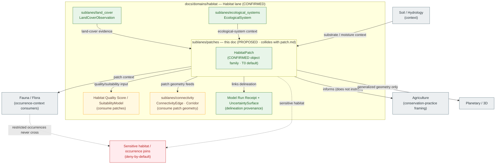

<!-- [KFM_META_BLOCK_V2]
doc_id: kfm://doc/<uuid>                                   # placeholder — assign on intake
title: Habitat Sublane — Habitat Patch
type: standard
version: v0.1
status: draft
owners: TODO — Habitat domain steward; Docs steward      # placeholder — confirm via CODEOWNERS
created: 2026-06-04
updated: 2026-06-04
policy_label: public
related:
  - docs/domains/habitat/README.md
  - docs/domains/habitat/sublanes/README.md
  - docs/domains/habitat/sublanes/patch.md               # NAME COLLISION — singular sibling of this file; reconcile
  - docs/domains/habitat/sublanes/land_cover.md
  - docs/domains/habitat/sublanes/ecological_systems.md
  - docs/domains/habitat/sublanes/connectivity.md
  - docs/doctrine/ai-build-operating-contract.md
  - docs/doctrine/directory-rules.md
  - docs/doctrine/lifecycle-law.md
  - docs/domains/fauna/README.md
  - docs/domains/flora/README.md
tags: [kfm, habitat, sublane, patch, patches, HabitatPatch]
notes:
  - "CONTRACT_VERSION = 3.0.0 pinned (doctrine-adjacent)."
  - "FILENAME COLLISION: this file (patches.md, plural) covers the SAME HabitatPatch object as patch.md (singular). Generated on explicit request; exactly one MUST become canonical. See the collision callout below and the sublanes/README.md index."
  - "HabitatPatch is a CONFIRMED Habitat-owned object family; field realization is PROPOSED."
  - "Sensitivity: HabitatPatch defaults to T0 (mostly public); stewardship-zone-linked detail can be T1; sensitive habitat is denied/generalized."
  - "Patches are admitted to 3D scenes ONLY via generalized geometry; sensitive habitat denied (CONFIRMED §24.4.4)."
  - "Sublanes are a PROPOSED docs/ organizational tier; convention not yet established in Directory Rules."
  - "All implementation-layer claims remain PROPOSED until verified against mounted repo evidence."
[/KFM_META_BLOCK_V2] -->

# Habitat Sublane — Habitat Patch

> Scopes the **`HabitatPatch`** slice of the Habitat domain — the delineated habitat units that anchor the lane — built from land-cover and ecological-system evidence, served public-safe, and supplied as context to Fauna, Flora, Agriculture, and the connectivity/suitability sublanes.

**Status:** draft · **Owners:** TODO — Habitat domain steward; Docs steward · **Last updated:** 2026-06-04

> [!CAUTION]
> **Filename collision — resolve before merge.** This file (`patches.md`, plural) and `patch.md` (singular) both scope the **same** `HabitatPatch` object family. Two docs owning one object is a parallel-home drift pattern (Directory Rules §13.2-style). Exactly **one** filename MUST become canonical; the other MUST be retired (or redirected). The sibling sublanes (`land_cover.md`, `connectivity.md`) currently link to **`patch.md`** (singular), and the canonical object is singular `HabitatPatch`; the plural *topic-folder* style (`land_cover`, `ecological_systems`) is the argument for `patches.md`. Record the decision in [`sublanes/README.md`](./README.md) or `docs/registers/DRIFT_REGISTER.md`. See [§0](#0-filename-collision-notice). **NEEDS DECISION.**

---

## Quick jump

- [0. Filename collision notice](#0-filename-collision-notice)
- [1. Scope](#1-scope)
- [2. Repo fit](#2-repo-fit)
- [3. Sublane concept and authority posture](#3-sublane-concept-and-authority-posture)
- [4. Object & identity](#4-object--identity)
- [5. Delineation (how a patch is built)](#5-delineation-how-a-patch-is-built)
- [6. Inputs & source roles](#6-inputs--source-roles)
- [7. Sublane shape and relations (diagram)](#7-sublane-shape-and-relations-diagram)
- [8. Pipeline placement (RAW → PUBLISHED)](#8-pipeline-placement-raw--published)
- [9. Sensitivity, rights, and publication posture](#9-sensitivity-rights-and-publication-posture)
- [10. Cross-sublane and cross-lane relations](#10-cross-sublane-and-cross-lane-relations)
- [11. Governed AI behavior for this sublane](#11-governed-ai-behavior-for-this-sublane)
- [12. Validators, tests, fixtures](#12-validators-tests-fixtures)
- [13. Open questions and verification backlog](#13-open-questions-and-verification-backlog)
- [14. Related docs](#14-related-docs)
- [Appendix A — Sublane conformance checklist](#appendix-a--sublane-conformance-checklist)

---

## 0. Filename collision notice

> [!WARNING]
> This document was generated on explicit request as `patches.md` while `patch.md` already exists for the identical object. Until the canonical filename is chosen, treat **both** as drafts of the same sublane, not as two sublanes.

| Concern | Detail | Status |
|---|---|---|
| Competing files | `docs/domains/habitat/sublanes/patch.md` (singular) ↔ `docs/domains/habitat/sublanes/patches.md` (this file, plural) | **CONFLICTED** |
| Object owned | `HabitatPatch` — singular object family, owned by Habitat `[DOM-HAB §B]` | CONFIRMED |
| Inbound links today | `land_cover.md` and `connectivity.md` reference `patch.md` (singular) | observed in prior sublane drafts |
| Argument for singular (`patch.md`) | Matches the singular canonical object `HabitatPatch`; existing inbound links already point here | — |
| Argument for plural (`patches.md`) | Matches the plural/underscore topic-file style of `land_cover.md`, `ecological_systems.md` | — |
| Resolution path | Pick one in `sublanes/README.md`; retire/redirect the other; update sibling links; log in `DRIFT_REGISTER.md` | **NEEDS DECISION** |

> [!NOTE]
> The **content** below is filename-agnostic: whichever file wins, this is the `HabitatPatch` sublane charter. Only the path and inbound links differ between the two candidates.

[⬆ Back to top](#habitat-sublane--habitat-patch)

---

## 1. Scope

**CONFIRMED doctrine / PROPOSED implementation.** This sublane governs `HabitatPatch` — the delineated habitat units that are the Habitat lane's primary spatial object. It owns patch identity, patch geometry (public-safe), patch delineation provenance, and the public-safe patch derivatives served on the map. It does **not** classify land cover, synthesize ecological systems, score suitability, derive connectivity, or assert species occurrence — it *consumes* those and is *consumed by* them.

The Habitat domain's one-line purpose names habitat patches first among the things it governs. `[DOM-HAB §A]` A patch answers *"what coherent habitat unit is here, delineated from which evidence, at what vintage, and how confident?"* — carrying the source role, uncertainty, and release state of everything it was built from.

[⬆ Back to top](#habitat-sublane--habitat-patch)

---

## 2. Repo fit

**Path (this file, PROPOSED):** `docs/domains/habitat/sublanes/patches.md` — see the [§0 collision notice](#0-filename-collision-notice).

The `docs/domains/habitat/` documentation segment is **CONFIRMED** doctrine (domains are lane segments inside responsibility roots, never root folders, per Directory Rules §12). The `sublanes/` wrapper is a **PROPOSED / NEEDS VERIFICATION** convention.

| Direction | Neighbor | Relationship |
|---|---|---|
| **Sibling (collision)** | [`patch.md`](./patch.md) | **Same object** — one MUST be retired |
| **Upstream (parent)** | [`docs/domains/habitat/README.md`](../README.md) | Habitat domain landing *(PROPOSED neighbor)* |
| **Sibling (inputs)** | [`land_cover.md`](./land_cover.md), [`ecological_systems.md`](./ecological_systems.md) | Supply the evidence a patch is delineated from |
| **Sibling (consumers)** | [`connectivity.md`](./connectivity.md), `suitability.md` *(PROPOSED)* | Consume patch identity/geometry |
| **Schema home** | `schemas/contracts/v1/domains/habitat/` | `HabitatPatch` machine schema *(PROPOSED; ADR-0001)* |
| **Meaning home** | `contracts/domains/habitat/` | Semantic contract *(PROPOSED)* |

> [!NOTE]
> The `sublanes/` path segment was **not located in `directory-rules.md`**. A `docs/`-internal sub-tier is most likely a **§17 routine-PR** change rather than a §2.4 ADR trigger. Reconcile both the `sublanes/` convention and the `patch.md`/`patches.md` filename via the `sublanes/README.md` index or a drift entry in `docs/registers/DRIFT_REGISTER.md`. **NEEDS VERIFICATION.**

[⬆ Back to top](#habitat-sublane--habitat-patch)

---

## 3. Sublane concept and authority posture

A **sublane** is a `docs/`-layer thematic grouping inside a single domain folder. All authority — schemas, contracts, policy, releases, tests, fixtures — remains at the Habitat lane level under the appropriate responsibility root.

**This sublane is never allowed to:**

- Become a root folder (`patches/` at repo root → forbidden by Directory Rules §3 and §12).
- Create a parallel `schemas/`, `policy/`, `contracts/`, or `data/` home under "patch"/"patches". Those live under the **Habitat** domain segment.
- **Create a second canonical home for `HabitatPatch`.** This is the active risk of the `patch.md`/`patches.md` collision — see [§0](#0-filename-collision-notice).
- Re-define `HabitatPatch` — meaning lives in `contracts/`; field shape lives in `schemas/`.
- Re-classify land cover or synthesize ecological systems (those are sibling sublanes' jobs).
- Publish patch content outside the governed API or without a `ReleaseManifest`, `EvidenceBundle`, validation/policy support, review state where required, correction path, and rollback target. `[DOM-HAB §M] [ENCY Appendix E]`

[⬆ Back to top](#habitat-sublane--habitat-patch)

---

## 4. Object & identity

| Property | Value | Status |
|---|---|---|
| **Object** | `HabitatPatch` | CONFIRMED term / PROPOSED field realization |
| **Owning domain** | Habitat | CONFIRMED `[DOM-HAB §B]` |
| **Purpose** | Represents `HabitatPatch` evidence or released derivative within Habitat | CONFIRMED (doctrine) |
| **Identity rule** | PROPOSED deterministic basis: `source id + object role + temporal scope + normalized digest` | PROPOSED |
| **Temporal handling** | source, observed, valid, retrieval, release, and correction times stay **distinct** where material | CONFIRMED |
| **Default sensitivity tier** | **T0** (mostly public); stewardship-zone-linked detail can be **T1** | CONFIRMED `[DOM-HAB §24]` |

The meaning of `HabitatPatch` is constrained by **source role, evidence, time, and release state** — a delineated unit with provenance, not a bare polygon. `[DOM-HAB §C]`

[⬆ Back to top](#habitat-sublane--habitat-patch)

---

## 5. Delineation (how a patch is built)

A `HabitatPatch` is a **derived delineation**: a coherent habitat unit drawn from land-cover, ecological-system, and context evidence. Because it is derived, it carries the source role and uncertainty of its inputs and must not be presented with more confidence than they support.

> [!CAUTION]
> **A patch is built, not observed raw.** A `HabitatPatch`:
> - is delineated from `LandCoverObservation`, `EcologicalSystem`, and context inputs via a recorded run;
> - links its delineation provenance (`Model Run Receipt` where a model is used) and carries `UncertaintySurface`;
> - inherits the **source role** and **sensitivity** of its inputs — a patch delineated over a sensitive species' habitat is itself sensitive;
> - is **not** a regulatory designation (that is the critical-habitat sublane) and **not** a suitability score (that is the suitability sublane).

| Delineation concern | Posture | Status |
|---|---|---|
| Input → patch traceability | Patch links inputs via `EvidenceBundle` | CONFIRMED doctrine / PROPOSED impl |
| Delineation method (rules, segmentation, model) | Recorded per run; KFM does not endorse one method as truth | NEEDS VERIFICATION |
| Uncertainty | Travels with the patch (`UncertaintySurface`) | CONFIRMED doctrine / PROPOSED impl |
| Re-delineation on input change | New release + correction/rollback path, not a silent overwrite | CONFIRMED doctrine |
| Public-safe geometry | Generalized before any public/3D admission; sensitive habitat denied | CONFIRMED `[DOM-HAB §24.4.4]` |

[⬆ Back to top](#habitat-sublane--habitat-patch)

---

## 6. Inputs & source roles

Patches are delineated primarily from **other Habitat products** plus context layers. Source roles (authority / observation / context / model) are preserved per the CONFIRMED rule that role cannot be inferred from convenience. `[DOM-HAB §D]`

| Input | Origin | Typical role | Constraint |
|---|---|---|---|
| Land cover | Habitat (`LandCoverObservation`) | observation / context | Native classification preserved; advisory crosswalks |
| Ecological systems | Habitat (`EcologicalSystem`) | model / context | Model-vs-observation label stays visible |
| Soil context | Soil (`SoilMapUnit` / `SoilComponent`) | context | Feeds ecological-system inference; soil time caveat carried `[DOM-SOIL]` |
| Hydrology context | Hydrology (wetland / reach identity) | context | Feeds habitat-quality / occurrence-context joins `[DOM-HYD]` |
| Stewardship context | PAD-US, KDWP | context | Sensitive joins fail closed |

> [!CAUTION]
> No patch may be promoted to `PUBLISHED` while any input's **role**, **rights**, **sensitivity**, or **vintage** is unresolved. *Cite-or-abstain* applies, and a single sensitive input taints the patch until generalized. `[ENCY] [DIRRULES]`

[⬆ Back to top](#habitat-sublane--habitat-patch)

---

## 7. Sublane shape and relations (diagram)

> [!NOTE]
> Amber boxes are **PROPOSED** sublanes. CONFIRMED edges: patches/ecological-systems provide context to Fauna/Flora; habitat-quality frames conservation-practice candidates for Agriculture (never instructs); patches are admitted to 3D only via generalized geometry, sensitive habitat denied. `[DOM-HAB §24.4.4] [MAP-MASTER]`

[⬆ Back to top](#habitat-sublane--habitat-patch)

---

## 8. Pipeline placement (RAW → PUBLISHED)

CONFIRMED doctrine / PROPOSED sublane application. Patch artifacts follow the Habitat lane's pipeline shape **exactly**; the sublane introduces no new stage, and delineation is itself a governed, receipted step. `[DIRRULES] [DOM-HAB §H] [ENCY]`

| Stage | Sublane handling | Gate | Status |
|---|---|---|---|
| **RAW** | Reference the input products (land cover, ecological systems, soil/hydrology context) by identity + hash; no raw "patch source" exists — inputs are themselves governed. | Input `EvidenceRef`s resolve. | PROPOSED |
| **WORK / QUARANTINE** | Run delineation; normalize geometry (CRS, generalization tolerance), record method + uncertainty, identity, rights, policy. Hold sensitive-input or rights-unresolved cases. | Validation + policy gate pass, or quarantine reason recorded. | PROPOSED |
| **PROCESSED** | Emit validated `HabitatPatch` records with `EvidenceRef`, `Model Run Receipt` link, `UncertaintySurface`, and public-safe candidates. | `EvidenceRef`, `ValidationReport`, `Model Run Receipt`, digest closure exist. | PROPOSED |
| **CATALOG / TRIPLET** | Emit catalog records, `EvidenceBundle`, graph/triplet projections, release candidates with delineation-vintage badges. | Catalog/proof closure passes. | PROPOSED |
| **PUBLISHED** | Serve released public-safe patch artifacts through governed APIs and manifests. | `ReleaseManifest`, correction path, rollback target, review/policy state exist. | PROPOSED |

CONFIRMED invariant: **promotion is a governed state transition, not a file move.** `[DIRRULES] [LIFECYCLE-LAW]`

[⬆ Back to top](#habitat-sublane--habitat-patch)

---

## 9. Sensitivity, rights, and publication posture

> [!CAUTION]
> **Patches are mostly public — but not always.** `HabitatPatch` defaults to **sensitivity tier T0** (mostly public), with **T1** for stewardship-zone-linked detail. `[DOM-HAB §24]` However, a patch that delineates a sensitive species' habitat (nest, den, roost, hibernaculum, spawning area) or steward-controlled location **denies exact exposure by default** and may be released only as a generalized, public-safe derivative with a recorded transform (`Geoprivacy transform` + `Redaction Receipt`). `[ENCY §20.5] [Operating Contract §23.2] [DOM-FAUNA]`

Applied posture:

- **3D / public admission.** Patches are admitted to 3D scenes **only via generalized geometry; sensitive habitat denied.** `[DOM-HAB §24.4.4] [MAP-MASTER]` *(CONFIRMED.)*
- **Deny-by-default promotion gate.** Unclear rights, unresolved source role, missing evidence, unresolved sensitivity, or absent release state **blocks public promotion.** `[ENCY] [DIRRULES]`
- **Sensitive-input taint.** A patch delineated from any sensitive input is sensitive until generalized; the geoprivacy + redaction-receipt + public-safe-derivative chain applies before release. `[ENCY §20.5]`
- **No flattening.** A patch is not a regulatory designation, a suitability score, or a species record; those distinctions stay visible. `[DOM-HAB §I]`
- **Most-restrictive-row rule.** Per the operating contract's §23.2 matrix, when no row clearly matches, the most restrictive applicable row applies (`DENY` exact, `GENERALIZE`, `REDACT`, `REQUIRE` steward review, `REQUIRE` `RedactionReceipt`, `ABSTAIN`).

[⬆ Back to top](#habitat-sublane--habitat-patch)

---

## 10. Cross-sublane and cross-lane relations

### 10.1 Within the Habitat lane

| This sublane | Related sublane | Relation | Constraint |
|---|---|---|---|
| Patch | Land Cover / Ecological Systems | Consumes land-cover + ecological-system evidence as delineation input. | Inputs keep their source-role and labels; patch does not re-classify them. |
| Patch | Suitability / Quality | Supplies patch identity + geometry as input to suitability/quality. | Modeled scores stay labeled modeled; uncertainty propagates. |
| Patch | Connectivity | Supplies patch geometry as the basis for `ConnectivityEdge` / `Corridor`. | Public-safe geometry only; sensitive patches generalized first. |

### 10.2 Across lanes (CONFIRMED Habitat-owned edges, §24.4.4)

| Relation | Lane | Constraint | Citation |
|---|---|---|---|
| Patch → **Fauna / Flora** — occurrence-interpretation context | Fauna, Flora | Patch, ecological system, and stewardship zone provide context for occurrence interpretation; restricted occurrences never cross. | `[DOM-HAB]` `[DOM-FAUNA]` `[DOM-FLORA]` |
| Patch → **Agriculture** — conservation-practice framing | Agriculture | Conservation-practice candidates are framed by habitat-quality scores; **never used to instruct land management.** | `[DOM-HAB]` `[DOM-AG]` |
| Patch → **Planetary / 3D** — scene admission | Spatial Foundation | Patches admitted to 3D scenes **only via generalized geometry; sensitive habitat denied.** | `[DOM-HAB]` `[MAP-MASTER]` |
| Patch ← **Soil / Hydrology** — biophysical context | Soil, Hydrology | Soil map unit / component context feeds ecological-system inference; wetland/reach identity feeds habitat-quality joins. | `[DOM-SOIL]` `[DOM-HYD]` |

[⬆ Back to top](#habitat-sublane--habitat-patch)

---

## 11. Governed AI behavior for this sublane

CONFIRMED doctrine / PROPOSED implementation. AI behavior is the Habitat lane's behavior, inherited without modification. `[GAI] [DOM-HAB §L] [ENCY]`

| AI behavior | Rule |
|---|---|
| **Allowed** | Evidence-bounded summarization over released patch `EvidenceBundles`; citation-backed explanation of delineation inputs, method, and uncertainty; patch-vs-suitability-vs-designation clarification. |
| **Required abstention** | When evidence is insufficient, when inputs disagree without a release decision, when delineation uncertainty is unresolved, or when the request exceeds input support. |
| **Required denial** | Exposure of sensitive habitat / occurrence detail (deny-by-default); presenting a patch as a regulatory designation, suitability score, or species record; uncited authoritative patch claims at precise locations; land-management instruction (this sublane never instructs); direct RAW/WORK/QUARANTINE access. |
| **Receipt** | Emit `AIReceipt` and `RuntimeResponseEnvelope` with outcome `ANSWER / ABSTAIN / DENY / ERROR`, `evidence_refs`, `policy_decision`, and `citation_validation`. |

[⬆ Back to top](#habitat-sublane--habitat-patch)

---

## 12. Validators, tests, fixtures

All items below are **PROPOSED** and inherit Habitat-lane validators per `[DOM-HAB §K]`. No new home: tests live under `tests/domains/habitat/`; fixtures under `fixtures/domains/habitat/`. `[DIRRULES §12]`

<strong>Proposed validators and tests (click to expand)</strong>

- **PROPOSED — Delineation-provenance tests.** Every `HabitatPatch` MUST link its delineation run and resolve input `EvidenceRef`s.
- **PROPOSED — Uncertainty-propagation tests.** A patch MUST NOT report higher confidence than its weakest input supports.
- **PROPOSED — Patch-vs-designation/suitability denial tests.** A patch MUST NOT be presented as critical habitat or a suitability score.
- **PROPOSED — Sensitive-input taint tests.** A patch over a sensitive input fails closed unless a `Redaction Receipt` + public-safe derivative exists.
- **PROPOSED — Public-safe geometry / 3D-admission tests.** Public/3D patch geometry is generalized; sensitive habitat denied.
- **PROPOSED — Sensitivity-tier tests.** Patch defaults to T0; stewardship-zone-linked detail to T1; sensitive habitat escalates per §20.5.
- **PROPOSED — Catalog closure tests.** Every patch `EvidenceBundle` resolves to a closed catalog entry with hashed `EvidenceRef`s.
- **PROPOSED — Re-delineation correctness tests.** Input change produces a new release with correction/rollback linkage, not a silent overwrite.
- **PROPOSED — Habitat + Fauna thin-slice fixture.** One Kansas patch + one public-safe occurrence association + uncertainty/citation report; public generalized tile only. *(CONFIRMED pattern in `[DOM-HF]`.)*
- **PROPOSED — No-network fixtures.** Delineation runs remain inactive until activation, fixtures, validators, and policy gates exist.

[⬆ Back to top](#habitat-sublane--habitat-patch)

---

## 13. Open questions and verification backlog

| Item to verify | Evidence that would settle it | Status |
|---|---|---|
| **Which filename is canonical: `patch.md` or `patches.md`.** | `sublanes/README.md` decision + sibling-link update + `DRIFT_REGISTER.md` entry. | **NEEDS DECISION** |
| Whether `docs/domains/<domain>/sublanes/` is a permitted `docs/`-only convention. | Accepted ADR, Directory Rules reference, or `sublanes/README.md` entry. | **NEEDS VERIFICATION** |
| `HabitatPatch` schema shape and identity field set. | Mounted repo `schemas/contracts/v1/domains/habitat/` + ADR-0001. | **NEEDS VERIFICATION** |
| Which delineation method(s) KFM admits and how method is recorded. | Mounted repo delineation code, model-run schema, validators. | **NEEDS VERIFICATION** |
| Whether sensitive-input taint and 3D-generalization are validator-enforced. | Mounted repo policy + geoprivacy/redaction-receipt tests. | **NEEDS VERIFICATION** |
| Whether `Model Run Receipt` + `UncertaintySurface` linkage is required at publication. | Mounted repo release gates + manifests. | **NEEDS VERIFICATION** |
| Whether the Habitat MapLibre overlay registry exposes patch layers and respects Focus behavior. | Mounted repo layer registry + Evidence Drawer wiring. | **NEEDS VERIFICATION** |
| Exact sensitivity-tier escalation rule from T0/T1 to denied for sensitive habitat. | Sensitivity rubric + `policy/sensitivity/` entries. | **NEEDS VERIFICATION** |

[⬆ Back to top](#habitat-sublane--habitat-patch)

---

## 14. Related docs

> [!NOTE]
> Some links below are TODO placeholders pending verification of the docs tree against the mounted repo.

- [`docs/domains/habitat/sublanes/patch.md`](./patch.md) — **singular sibling; same object — resolve collision (§0).**
- [`docs/domains/habitat/README.md`](../README.md) — Habitat domain landing (TODO — verify presence).
- [`docs/domains/habitat/sublanes/README.md`](./README.md) — Habitat sublane index (TODO — verify presence; **records the canonical filename**).
- [`docs/domains/habitat/sublanes/land_cover.md`](./land_cover.md) — Land Cover sublane (input).
- [`docs/domains/habitat/sublanes/ecological_systems.md`](./ecological_systems.md) — Ecological Systems sublane (input).
- [`docs/domains/habitat/sublanes/connectivity.md`](./connectivity.md) — Connectivity sublane (consumer).
- [`docs/doctrine/ai-build-operating-contract.md`](../../../doctrine/ai-build-operating-contract.md) — operating contract (`CONTRACT_VERSION = "3.0.0"`).
- [`docs/doctrine/directory-rules.md`](../../../doctrine/directory-rules.md) — placement law; §3 deeper rule, §12 Domain Placement Law, §13.2 drift.
- [`docs/doctrine/lifecycle-law.md`](../../../doctrine/lifecycle-law.md) — RAW → PUBLISHED governance (TODO — verify presence).
- [`docs/domains/fauna/README.md`](../../fauna/README.md) — occurrence-context, geoprivacy (TODO — verify presence).
- [`docs/domains/flora/README.md`](../../flora/README.md) — vegetation-community context (TODO — verify presence).

[⬆ Back to top](#habitat-sublane--habitat-patch)

---

## Appendix A — Sublane conformance checklist

For reviewers proposing patch content into the Habitat lane.

<strong>Pre-merge checklist (click to expand)</strong>

- [ ] **Filename collision resolved:** exactly one of `patch.md` / `patches.md` is canonical; the other is retired/redirected; sibling links updated; decision logged. *(See §0.)*
- [ ] Every `HabitatPatch` links its delineation run and resolves input `EvidenceRef`s.
- [ ] Uncertainty (`UncertaintySurface`) travels with the patch and is not overstated.
- [ ] The patch is not presented as critical habitat, a suitability score, or a species record.
- [ ] Public/3D patch geometry is generalized; sensitive habitat is denied.
- [ ] Sensitivity tier set: T0 default, T1 for stewardship-zone-linked detail, escalation for sensitive habitat.
- [ ] Sensitive-input taint handled: any sensitive-derived patch fails closed unless `Geoprivacy transform` + `Redaction Receipt` + public-safe derivative exist.
- [ ] Conservation-practice framing (if surfaced) never instructs land management.
- [ ] No patch reaches `PUBLISHED` without `ReleaseManifest` + `EvidenceBundle` + validation/policy support + review state (where required) + correction path + rollback target.
- [ ] No parallel schema/contract/policy home created under "patch"/"patches"; files live under the **Habitat** domain segment.
- [ ] Path-validation checklist (Directory Rules §16) applied for any new path.
- [ ] The `sublanes/` convention is covered by an ADR or the `sublanes/README.md` index.

[⬆ Back to top](#habitat-sublane--habitat-patch)

---

**Related docs:** [patch.md (collision)](./patch.md) · [Habitat README](../README.md) · [Sublane index](./README.md) · [Land Cover](./land_cover.md) · [Ecological Systems](./ecological_systems.md) · [Connectivity](./connectivity.md) · [Operating Contract](../../../doctrine/ai-build-operating-contract.md) · [Directory Rules](../../../doctrine/directory-rules.md)

**Last updated:** 2026-06-04 · **Version:** v0.1 · **Status:** draft · `CONTRACT_VERSION = "3.0.0"` · [⬆ Back to top](#habitat-sublane--habitat-patch)
