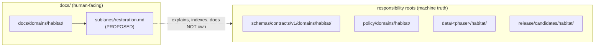

<!-- [KFM_META_BLOCK_V2]
doc_id: kfm://doc/PLACEHOLDER-uuid-restoration-sublane
title: Habitat Domain — Restoration Sublane
type: standard
version: v1
status: draft
owners: PLACEHOLDER <habitat-domain-steward>  # confirm against docs/governance/ steward charters
created: 2026-06-05
updated: 2026-06-05
policy_label: public  # sublane DOC is public; restoration site geometry is governed deny-by-default — see §8
related:
  - docs/domains/habitat/                        # PROPOSED parent lane index — NEEDS VERIFICATION
  - docs/domains/habitat/POLICY.md               # PROPOSED — NEEDS VERIFICATION
  - docs/domains/habitat/CROSS_LANE_RELATIONS.md # PROPOSED — NEEDS VERIFICATION
  - docs/doctrine/directory-rules.md
  - ai-build-operating-contract.md
notes:
  - CONTRACT_VERSION = "3.0.0"
  - "Sublane segment docs/domains/habitat/sublanes/ is PROPOSED; not yet confirmed as an established convention. See §1 and DRIFT note."
[/KFM_META_BLOCK_V2] -->

# Habitat Domain — Restoration Sublane

> Governs how the Habitat lane treats restoration opportunities, stewardship zones, and restoration outcomes as evidence-backed, time-aware, public-safe objects — never as authoritative siting instructions.

[](#)
[](#8-sensitivity-and-deny-by-default)
[](#)
[](#)
[](#1-scope-and-repo-fit)

**Status:** draft · **Owners:** `PLACEHOLDER <habitat-domain-steward>` · **Updated:** 2026-06-05

> [!IMPORTANT]
> `CONTRACT_VERSION = "3.0.0"`. This sublane document operationalizes the Habitat domain
> dossier; it does **not** override `ai-build-operating-contract.md` or `directory-rules.md`.
> Where this doc and the domain dossier disagree, **the dossier wins** and the conflict is
> filed to `docs/registers/DRIFT_REGISTER.md`.

---

## Contents

1. [Scope and repo fit](#1-scope-and-repo-fit)
2. [What belongs here · what does not](#2-what-belongs-here--what-does-not)
3. [Restoration object families](#3-restoration-object-families)
4. [Ubiquitous language](#4-ubiquitous-language)
5. [Lifecycle shape](#5-lifecycle-shape)
6. [Cross-lane relations](#6-cross-lane-relations)
7. [Map and viewing products](#7-map-and-viewing-products)
8. [Sensitivity and deny-by-default](#8-sensitivity-and-deny-by-default)
9. [Governed AI behavior](#9-governed-ai-behavior)
10. [Publication, correction, rollback](#10-publication-correction-rollback)
11. [Companion sections](#open-questions-register)
12. [Related docs](#related-docs)

---

## 1. Scope and repo fit

**Purpose.** The restoration sublane governs the Habitat lane's treatment of *where restoration
could occur, where stewardship applies, and what restoration produced over time* — as evidence-backed,
time-aware, public-safe objects under the same trust spine as the rest of the domain.

| Aspect | Value | Status |
|---|---|---|
| Parent lane | `docs/domains/habitat/` | PROPOSED — NEEDS VERIFICATION |
| This file | `docs/domains/habitat/sublanes/restoration.md` | PROPOSED — see drift note below |
| Owning root | `docs/` (human-facing control plane) | CONFIRMED (root class) |
| Authority class | Lane explanation / index — **not** machine truth | CONFIRMED (doctrine) |

> [!WARNING]
> **PROPOSED path — sublane segment not yet confirmed.** Directory Rules §12 and the Atlas
> confirm `docs/domains/<domain>/` as the lane index, but a `sublanes/` segment **inside**
> that path was **not** found as an established convention in project evidence. Treat
> `docs/domains/habitat/sublanes/restoration.md` as **PROPOSED / NEEDS VERIFICATION** and
> open a `docs/registers/DRIFT_REGISTER.md` entry until the sublane folder convention is
> settled (e.g., flat `docs/domains/habitat/RESTORATION.md` vs. nested `sublanes/`).



> [!NOTE]
> The diagram reflects the **Domain Placement Law**: the domain appears as a *segment* inside
> each responsibility root, never as a root folder. The doc layer explains and indexes; it does
> not hold machine truth. `[directory-rules.md §12]`

[↑ Back to top](#contents)

---

## 2. What belongs here · what does not

**Belongs here (sublane explanation surface):**
- Definitions and governance posture for restoration-related Habitat objects.
- The lifecycle, sensitivity, and publication posture specific to restoration siting.
- Cross-lane relations that restoration siting depends on.

**Does NOT belong here:**

| Excluded | Goes instead to | Basis |
|---|---|---|
| Machine schemas for restoration objects | `schemas/contracts/v1/domains/habitat/` | Directory Rules §12 |
| Policy bundles / deny rules | `policy/domains/habitat/`, `policy/sensitivity/` | Directory Rules §6, §12 |
| Restoration lifecycle data | `data/<phase>/habitat/` | Directory Rules §12 |
| Release decisions / manifests | `release/candidates/habitat/` | Directory Rules §12 |
| Plant-side restoration plantings | Flora lane (`Restoration Planting`) | Atlas — Flora owns plant records |

> [!CAUTION]
> This sublane MUST NOT become a parallel home for restoration schemas, policy, or data.
> A doc that quietly accumulates machine truth breaks rollback, validation, and audit.

[↑ Back to top](#contents)

---

## 3. Restoration object families

The Habitat domain's object families include two that are restoration-central, plus supporting
objects. **CONFIRMED as terms in the Atlas / PROPOSED as field realizations** — no schema files
were inspected in this session. `[DOM-HAB] [DOM-HF] [ENCY]`

| Object | Role in restoration sublane | Owning domain | Status |
|---|---|---|---|
| **Restoration Opportunity** | A candidate area/edge where restoration could improve habitat | Habitat | CONFIRMED term / PROPOSED fields |
| **StewardshipZone** | A zone where stewardship/management applies | Habitat | CONFIRMED term / PROPOSED fields |
| **SuitabilityModel** | Model output informing where restoration is plausible | Habitat | CONFIRMED term / PROPOSED fields |
| **ConnectivityEdge / Corridor** | Connectivity context restoration may target | Habitat | CONFIRMED term / PROPOSED fields |
| **Model Run Receipt** | Receipt for any modeled restoration product | Habitat | CONFIRMED term / PROPOSED fields |
| **UncertaintySurface** | Uncertainty attached to modeled restoration products | Habitat | CONFIRMED term / PROPOSED fields |
| `Restoration Planting` | Plant-side restoration record — **Flora-owned**, referenced only | Flora | CONFIRMED ownership boundary |

> [!NOTE]
> **Identity (PROPOSED).** Per the Atlas, restoration objects use a PROPOSED deterministic
> basis: *source id + object role + temporal scope + normalized digest*. Source, observed,
> valid, retrieval, release, and correction times stay distinct where material. `[DOM-HAB] [ENCY]`

[↑ Back to top](#contents)

---

## 4. Ubiquitous language

| Term | Definition (constrained by source role, evidence, time, release state) | Status |
|---|---|---|
| Restoration Opportunity | A candidate restoration area/edge admitted as evidence or released derivative within Habitat | CONFIRMED term / PROPOSED realization |
| StewardshipZone | A management/stewardship zone within Habitat | CONFIRMED term / PROPOSED realization |
| Modeled habitat | Model-derived habitat used to reason about restoration plausibility | CONFIRMED term / PROPOSED realization |
| Geoprivacy transform | A transform that generalizes/redacts sensitive geometry before release | CONFIRMED term / PROPOSED realization |
| Public-safe derivative | A released artifact whose precision has been bounded for public exposure | CONFIRMED term (Fauna/Flora usage) / PROPOSED in Habitat |

> Terminology is preserved exactly as the project uses it. Do not rename these to generic
> equivalents. `[DOM-HAB] [DOM-FAUNA] [ENCY]`

[↑ Back to top](#contents)

---

## 5. Lifecycle shape

Restoration objects follow the canonical lifecycle; **promotion is a governed state transition,
not a file move**. `[directory-rules.md] [DOM-HAB] [ENCY]`

```text
RAW → WORK / QUARANTINE → PROCESSED → CATALOG / TRIPLET → PUBLISHED
```

| Stage | Handling (restoration-specific) | Gate | Status |
|---|---|---|---|
| RAW | Capture source restoration/stewardship payload with source role, rights, sensitivity, citation, time, hash | SourceDescriptor exists | PROPOSED |
| WORK / QUARANTINE | Normalize geometry, time, identity, evidence; **hold uncertain or sensitive geometry** | Validation + policy gate pass, or quarantine reason recorded | PROPOSED |
| PROCESSED | Emit validated objects, receipts, **public-safe candidates** | EvidenceRef, ValidationReport, digest closure exist | PROPOSED |
| CATALOG / TRIPLET | Emit catalog records, EvidenceBundles, graph projections, release candidates | Catalog/proof closure passes | PROPOSED |
| PUBLISHED | Serve released public-safe artifacts via governed APIs and manifests | ReleaseManifest + promotion-gate closure | PROPOSED |

[↑ Back to top](#contents)

---

## 6. Cross-lane relations

| This sublane | Related lane | Relation | Constraint |
|---|---|---|---|
| Restoration | Flora | vegetation community / rare plant / `Restoration Planting` context | Must preserve ownership, source role, sensitivity, EvidenceBundle support |
| Restoration | Fauna | habitat assignment / occurrence context under geoprivacy | Same constraint; sensitive occurrences fail closed |
| Restoration | Soil / Hydrology | substrate, moisture, wetland/riparian support | Context only via governed joins |
| Restoration | Hazards | fire/drought/flood resilience context | Context only via governed joins |

> [!NOTE]
> Cross-lane joins are governed: a relation must preserve domain ownership, source role,
> sensitivity tier, and EvidenceBundle support. `[DOM-HAB] [DOM-HF] [ENCY]`

[↑ Back to top](#contents)

---

## 7. Map and viewing products

**PROPOSED domain viewing products** that restoration may surface: habitat overlay registry;
source-role badges; modeled habitat view; connectivity/corridor view; Evidence Drawer Habitat
panel. `[DOM-HAB] [DOM-HF] [ENCY]`

**CONFIRMED cross-cutting products:** Evidence Drawer, time-aware state, trust badges,
sensitivity-redacted view, correction/stale-state view, governed Focus Mode. `[MAP-MASTER] [GAI]`

> [!IMPORTANT]
> Restoration map layers consume the same `EvidenceBundle` and `DecisionEnvelope` as all
> other layers. A layer toggle is **not** publication; layer exposure is controlled by
> `LayerManifest`. `[connected-dots]`

[↑ Back to top](#contents)

---

## 8. Sensitivity and deny-by-default

> [!CAUTION]
> Restoration siting can implicate **rare-species locations, private land, and steward-controlled
> records**. Per the operating contract §23.2 sensitive-domain matrix, the **most restrictive
> applicable row** governs. Where no row clearly matches, the default disposition applies.

**Default disposition (operating contract §23.2):**

```text
DENY public exact exposure
GENERALIZE before publication
REDACT when needed
QUARANTINE uncertain source material
REQUIRE steward review
REQUIRE transform receipt (RedactionReceipt)
ABSTAIN when support is inadequate
```

Restoration-specific posture, consistent with Habitat geoprivacy doctrine:
- Public habitat/protection artifacts require a `sensitivity_label` of `public` / `restricted` /
  `redacted`. `[Master MapLibre ML-Q-076]`
- Restricted habitat geometry becomes coarse footprints or buffered centroids before release;
  centroid-fuzzing and buffer methods need **recorded transform metadata**. `[ML-Q-077, ML-Q-075]`
- Restricted material may be generalized to county or ecoregion polygons. `[ML-Q-074]`

> [!CAUTION]
> This sublane MUST NOT include exact coordinates, exact identifiers, or restricted-source-derived
> fields for restoration or stewardship sites unless cleared by a domain steward and rights-holder
> representative. Link to the relevant `policy/sensitivity/` entry, or surface that one is missing.
> **NEEDS VERIFICATION:** the specific `policy/sensitivity/habitat/` entry was not inspected in
> this session.

[↑ Back to top](#contents)

---

## 9. Governed AI behavior

**CONFIRMED doctrine / PROPOSED implementation:** AI may summarize released Habitat
`EvidenceBundle`s, compare evidence, explain limitations, and draft steward-review notes. AI
**MUST `ABSTAIN`** when evidence is insufficient and **MUST `DENY`** where policy, rights,
sensitivity, or release state blocks the request. AI is interpretive, not the root truth source;
`EvidenceBundle` outranks generated language. `[GAI] [DOM-HAB] [ENCY]`

> [!WARNING]
> AI MUST NOT infer or reconstruct precise restoration/stewardship site geometry, even when a
> user supplies partial coordinates. Synthetic precision presented as observed is a contract
> violation. `[GAI]`

[↑ Back to top](#contents)

---

## 10. Publication, correction, rollback

**CONFIRMED doctrine / PROPOSED implementation:** Restoration publication requires a
`ReleaseManifest`, supporting `EvidenceBundle`, validation/policy support, review state where
required, a correction path, the stale-state rule, and a rollback target.
`[ENCY Appendix E] [DOM-HAB] [ENCY]`

<details>
<summary><strong>Publication support checklist (reference)</strong></summary>

- [ ] `ReleaseManifest` references the restoration layers/objects
- [ ] `EvidenceBundle` resolves for each evidence-dependent claim
- [ ] Validation + policy gates passed (`PolicyDecision` recorded)
- [ ] `RedactionReceipt` present for any generalized/redacted geometry
- [ ] Steward review state satisfied
- [ ] Correction path (`CorrectionNotice`) defined
- [ ] Rollback target (`RollbackCard` / `RollbackPlan`) defined
- [ ] Stale-state rule applied (`SOURCE_STALE` surfaced where applicable)

</details>

[↑ Back to top](#contents)

---

## Open questions register

| ID | Question | Owner role | Resolution path |
|---|---|---|---|
| OQ-HAB-RES-01 | Is `docs/domains/habitat/sublanes/` an approved segment, or should sublanes be flat (`RESTORATION.md`)? | Docs steward | ADR / Directory Rules check |
| OQ-HAB-RES-02 | What is the canonical `sensitivity_label` enum and default tier for restoration sites? | Habitat steward | repo inspection / `policy/sensitivity/` |
| OQ-HAB-RES-03 | Where do Habitat `Restoration Opportunity` schemas live exactly under `schemas/contracts/v1/domains/habitat/`? | Schema owner | repo inspection |
| OQ-HAB-RES-04 | Confirm the Habitat ↔ Flora boundary for restoration where planting and opportunity overlap | Both stewards | Cross-lane relations review |

## Open verification backlog

These items remain `NEEDS VERIFICATION` before promotion from `draft` to `published`:

1. Confirm the `docs/domains/habitat/sublanes/` path convention (or correct it).
2. Verify the Habitat restoration object schemas exist and their field shapes.
3. Verify the `policy/sensitivity/habitat/` deny-by-default entries for restoration/stewardship geometry.
4. Verify the geoprivacy transform + `RedactionReceipt` chain for public restoration artifacts.
5. Confirm the parent `docs/domains/habitat/` index links to this sublane.

## Changelog v0 → v1

| Change | Type (per contract §37) | Reason |
|---|---|---|
| Initial restoration sublane doc | new | Establish governance posture for restoration siting in Habitat |

> **Backward compatibility.** New file; no prior anchors. If the sublane convention changes to a
> flat filename, anchors in this doc are preserved but the file path changes — track in DRIFT_REGISTER.

## Definition of done

This document is done enough to enter the repository when:

- it is placed according to Directory Rules (sublane convention resolved per OQ-HAB-RES-01);
- a docs steward and the Habitat steward review it;
- it is linked from `docs/domains/habitat/` and any doctrine/domain index;
- it does not conflict with accepted ADRs;
- any conflict with current repo conventions is logged in `docs/registers/DRIFT_REGISTER.md`;
- the `GENERATED_RECEIPT.json` planned in Section 2 is wired into CI;
- future changes follow the operating contract's §37 lifecycle.

---

## Related docs

- `docs/domains/habitat/` — parent Habitat lane index *(PROPOSED — NEEDS VERIFICATION)*
- `docs/domains/habitat/POLICY.md` *(PROPOSED)*
- `docs/domains/habitat/CROSS_LANE_RELATIONS.md` *(PROPOSED)*
- `docs/domains/flora/` — owns `Restoration Planting` *(PROPOSED)*
- `docs/doctrine/directory-rules.md` — Domain Placement Law §12
- `ai-build-operating-contract.md` — §23.2 sensitive-domain matrix; §34 receipts

_Last updated: 2026-06-05 · `CONTRACT_VERSION = "3.0.0"`_

[↑ Back to top](#contents)
