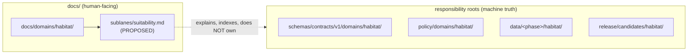

<!-- [KFM_META_BLOCK_V2]
doc_id: kfm://doc/PLACEHOLDER-uuid-suitability-sublane
title: Habitat Domain — Suitability Sublane
type: standard
version: v1
status: draft
owners: PLACEHOLDER <habitat-domain-steward>  # confirm against docs/governance/ steward charters
created: 2026-06-05
updated: 2026-06-05
policy_label: public  # sublane DOC is public; modeled habitat over sensitive locations is governed — see §8
related:
  - docs/domains/habitat/                          # PROPOSED parent lane index — NEEDS VERIFICATION
  - docs/domains/habitat/sublanes/restoration.md   # PROPOSED sibling sublane — NEEDS VERIFICATION
  - docs/domains/habitat/POLICY.md                 # PROPOSED — NEEDS VERIFICATION
  - docs/doctrine/directory-rules.md
  - ai-build-operating-contract.md
notes:
  - CONTRACT_VERSION = "3.0.0"
  - "Sublane segment docs/domains/habitat/sublanes/ is PROPOSED; not yet confirmed as an established convention. See §1 and DRIFT note."
  - "Model-card requirements for suitability products are a NEEDS VERIFICATION item in the Habitat verification backlog."
[/KFM_META_BLOCK_V2] -->

# Habitat Domain — Suitability Sublane

> Governs how the Habitat lane treats suitability models, modeled habitat, habitat quality scores, and their uncertainty as evidence-supported, time-aware, public-safe claims — never as unconstrained model outputs or authoritative truth.

[](#)
[](#8-sensitivity-and-deny-by-default)
[](#)
[](#)
[](#1-scope-and-repo-fit)

**Status:** draft · **Owners:** `PLACEHOLDER <habitat-domain-steward>` · **Updated:** 2026-06-05

> [!IMPORTANT]
> `CONTRACT_VERSION = "3.0.0"`. This sublane document operationalizes the Habitat domain
> dossier; it does **not** override `ai-build-operating-contract.md` or `directory-rules.md`.
> Where this doc and the domain dossier disagree, **the dossier wins** and the conflict is
> filed to `docs/registers/DRIFT_REGISTER.md`.

---

## Contents

1. [Scope and repo fit](#1-scope-and-repo-fit)
2. [What belongs here · what does not](#2-what-belongs-here--what-does-not)
3. [Suitability object families](#3-suitability-object-families)
4. [Ubiquitous language](#4-ubiquitous-language)
5. [Lifecycle shape](#5-lifecycle-shape)
6. [Model cards, receipts, and uncertainty](#6-model-cards-receipts-and-uncertainty)
7. [Cross-lane relations](#7-cross-lane-relations)
8. [Sensitivity and deny-by-default](#8-sensitivity-and-deny-by-default)
9. [Map and viewing products](#9-map-and-viewing-products)
10. [Governed AI behavior](#10-governed-ai-behavior)
11. [Publication, correction, rollback](#11-publication-correction-rollback)
12. [Companion sections](#open-questions-register)
13. [Related docs](#related-docs)

---

## 1. Scope and repo fit

**Purpose.** The suitability sublane governs the Habitat lane's treatment of *modeled* habitat —
suitability models, habitat quality scores, and the uncertainty attached to them — as
evidence-supported, time-aware, public-safe claims rather than unconstrained model outputs.
`[DOM-HAB] [KFM-P25-IDEA habitat evidence lane]`

| Aspect | Value | Status |
|---|---|---|
| Parent lane | `docs/domains/habitat/` | PROPOSED — NEEDS VERIFICATION |
| This file | `docs/domains/habitat/sublanes/suitability.md` | PROPOSED — see drift note below |
| Owning root | `docs/` (human-facing control plane) | CONFIRMED (root class) |
| Authority class | Lane explanation / index — **not** machine truth | CONFIRMED (doctrine) |

> [!WARNING]
> **PROPOSED path — sublane segment not yet confirmed.** Directory Rules §12 and the Atlas
> confirm `docs/domains/<domain>/` as the lane index, but a `sublanes/` segment **inside**
> that path was **not** found as an established convention in project evidence. Treat
> `docs/domains/habitat/sublanes/suitability.md` as **PROPOSED / NEEDS VERIFICATION** and
> open a `docs/registers/DRIFT_REGISTER.md` entry until the sublane folder convention is
> settled (flat `docs/domains/habitat/SUITABILITY.md` vs. nested `sublanes/`). This must
> match whatever is decided for the restoration sublane (OQ-HAB-RES-01).



> [!NOTE]
> The diagram reflects the **Domain Placement Law**: the domain appears as a *segment* inside
> each responsibility root, never as a root folder. The doc layer explains and indexes; it does
> not hold machine truth. `[directory-rules.md §12]`

[↑ Back to top](#contents)

---

## 2. What belongs here · what does not

**Belongs here (sublane explanation surface):**
- Definitions and governance posture for suitability-related Habitat objects.
- The lifecycle, model-card, receipt, and uncertainty discipline specific to modeled habitat.
- The sensitivity posture for modeled habitat over potentially sensitive locations.

**Does NOT belong here:**

| Excluded | Goes instead to | Basis |
|---|---|---|
| Machine schemas for suitability objects | `schemas/contracts/v1/domains/habitat/` | Directory Rules §12 |
| Model code / training pipelines | `packages/domains/habitat/`, `pipelines/domains/habitat/` | Directory Rules §12 |
| Policy bundles / deny rules | `policy/domains/habitat/`, `policy/sensitivity/` | Directory Rules §6, §12 |
| Modeled-habitat lifecycle data | `data/<phase>/habitat/` | Directory Rules §12 |
| Release decisions / manifests | `release/candidates/habitat/` | Directory Rules §12 |
| Species-to-habitat joins | Derived, versioned outputs — not canonical records | `[KFM-P25-IDEA-0005]` |

> [!CAUTION]
> This sublane MUST NOT become a parallel home for suitability schemas, model code, policy,
> or data. A doc that quietly accumulates machine truth breaks rollback, validation, and audit.

[↑ Back to top](#contents)

---

## 3. Suitability object families

The Habitat domain's object families include several that are suitability-central.
**CONFIRMED as terms in the Atlas / PROPOSED as field realizations** — no schema files were
inspected in this session. `[DOM-HAB] [DOM-HF] [ENCY]`

| Object | Role in suitability sublane | Owning domain | Status |
|---|---|---|---|
| **SuitabilityModel** | A model producing modeled-habitat outputs | Habitat | CONFIRMED term / PROPOSED fields |
| **Habitat Quality Score** | A scored measure of habitat quality | Habitat | CONFIRMED term / PROPOSED fields |
| **Model Run Receipt** | Receipt for a given suitability model run | Habitat | CONFIRMED term / PROPOSED fields |
| **UncertaintySurface** | Uncertainty attached to a modeled product | Habitat | CONFIRMED term / PROPOSED fields |
| **EcologicalSystem / HabitatPatch** | Inputs/units suitability reasons over | Habitat | CONFIRMED term / PROPOSED fields |
| **ConnectivityEdge / Corridor** | Connectivity context informed by suitability | Habitat | CONFIRMED term / PROPOSED fields |
| `Modeled habitat` | Model-derived habitat (vs. regulatory critical habitat) | Habitat | CONFIRMED term / PROPOSED realization |

> [!NOTE]
> **Identity (PROPOSED).** Per the Atlas, suitability objects use a PROPOSED deterministic
> basis: *source id + object role + temporal scope + normalized digest*. Source, observed,
> valid, retrieval, release, and correction times stay distinct where material. `[DOM-HAB] [ENCY]`

[↑ Back to top](#contents)

---

## 4. Ubiquitous language

| Term | Definition (constrained by source role, evidence, time, release state) | Status |
|---|---|---|
| SuitabilityModel | A model whose outputs are admitted as evidence or released derivative within Habitat | CONFIRMED term / PROPOSED realization |
| Habitat Quality Score | A scored habitat-quality measure within Habitat | CONFIRMED term / PROPOSED realization |
| Modeled habitat | Model-derived habitat, distinct from regulatory critical habitat | CONFIRMED term / PROPOSED realization |
| Regulatory critical habitat | Habitat designated by regulation; not a model output | CONFIRMED term / PROPOSED realization |
| UncertaintySurface | A surface expressing uncertainty in a modeled product | CONFIRMED term / PROPOSED realization |
| Geoprivacy transform | A transform that generalizes/redacts sensitive geometry before release | CONFIRMED term / PROPOSED realization |

> Terminology is preserved exactly as the project uses it. Do not rename these to generic
> equivalents. `[DOM-HAB] [ENCY]`

> [!IMPORTANT]
> **Modeled habitat ≠ regulatory critical habitat.** The two are distinct terms in the Habitat
> ubiquitous language. A suitability model output MUST NOT be presented or styled as a
> regulatory designation. `[DOM-HAB] [ENCY]`

[↑ Back to top](#contents)

---

## 5. Lifecycle shape

Suitability objects follow the canonical lifecycle; **promotion is a governed state transition,
not a file move**. `[directory-rules.md] [DOM-HAB] [ENCY]`

```text
RAW → WORK / QUARANTINE → PROCESSED → CATALOG / TRIPLET → PUBLISHED
```

| Stage | Handling (suitability-specific) | Gate | Status |
|---|---|---|---|
| RAW | Capture model inputs / source layers with source role, rights, sensitivity, citation, time, hash | SourceDescriptor exists | PROPOSED |
| WORK / QUARANTINE | Run/normalize model; attach `Model Run Receipt`; **hold low-confidence or sensitive-geometry outputs** | Validation + policy gate pass, or quarantine reason recorded | PROPOSED |
| PROCESSED | Emit validated modeled outputs, receipts, `UncertaintySurface`, public-safe candidates | EvidenceRef, ValidationReport, digest closure exist | PROPOSED |
| CATALOG / TRIPLET | Emit catalog records, EvidenceBundles, graph projections, release candidates | Catalog/proof closure passes | PROPOSED |
| PUBLISHED | Serve released public-safe modeled-habitat artifacts via governed APIs and manifests | ReleaseManifest + promotion-gate closure | PROPOSED |

[↑ Back to top](#contents)

---

## 6. Model cards, receipts, and uncertainty

A suitability product is a **modeled** artifact, so it carries extra accountability beyond an
observed record. The following are governed defaults.

| Requirement | What it carries | Status |
|---|---|---|
| Model card | Model identity, inputs, method, scope, known limits, intended use | NEEDS VERIFICATION |
| `Model Run Receipt` | Auditable record of a specific run (inputs, params, digests) | CONFIRMED term / PROPOSED realization |
| `UncertaintySurface` | Uncertainty class/surface paired with the modeled output | CONFIRMED term / PROPOSED realization |
| `AIReceipt` | Required where an AI surface summarizes/derives from the model | CONFIRMED doctrine |

> [!CAUTION]
> **Model-card requirements for suitability products are a NEEDS VERIFICATION item in the
> Habitat verification backlog.** Do not assert that a model-card standard is implemented;
> the requirement is doctrinal intent, not confirmed enforcement. `[DOM-HAB verification backlog]`

> [!NOTE]
> A modeled output that lacks a resolvable `Model Run Receipt` or uncertainty support should not
> be promoted to PUBLISHED. The trust posture is *evidence-supported claim*, not *unconstrained
> model output*. `[KFM-P25-IDEA habitat evidence lane]`

[↑ Back to top](#contents)

---

## 7. Cross-lane relations

| This sublane | Related lane | Relation | Constraint |
|---|---|---|---|
| Suitability | Fauna | habitat assignment / occurrence context under geoprivacy | Must preserve ownership, source role, sensitivity, EvidenceBundle support |
| Suitability | Flora | vegetation community / rare plant context under Flora controls | Same constraint; rare-plant geometry fails closed |
| Suitability | Soil / Hydrology | substrate, moisture, wetland/riparian inputs | Context only via governed joins |
| Suitability | Hazards | fire/drought/flood/smoke resilience-stress inputs | Context only via governed joins |

> [!NOTE]
> Cross-lane joins are governed and remain **versioned derived outputs**, not canonical records.
> A relation must preserve domain ownership, source role, sensitivity tier, and EvidenceBundle
> support. `[KFM-P25-IDEA-0005] [DOM-HAB] [DOM-HF] [ENCY]`

[↑ Back to top](#contents)

---

## 8. Sensitivity and deny-by-default

> [!CAUTION]
> Modeled habitat can implicate **rare-species locations** when it overlaps sensitive sites,
> nests, dens, roosts, hibernacula, or spawning areas. Per the operating contract §23.2
> sensitive-domain matrix, the **most restrictive applicable row** governs. Where no row clearly
> matches, the default disposition applies.

**Default disposition (operating contract §23.2):**

```text
DENY public exact exposure
GENERALIZE before publication
REDACT when needed
QUARANTINE uncertain source material
REQUIRE steward review
REQUIRE transform receipt (RedactionReceipt)
ABSTAIN when support is inadequate
```

Suitability-specific posture, consistent with Habitat geoprivacy doctrine:
- Public habitat/protection artifacts require a `sensitivity_label` of `public` / `restricted` /
  `redacted`. `[Master MapLibre ML-Q-076]`
- Restricted modeled-habitat geometry becomes coarse footprints or buffered centroids before
  release; centroid-fuzzing and buffer methods need **recorded transform metadata**.
  `[ML-Q-077, ML-Q-075]`
- Restricted material may be generalized to county or ecoregion polygons. `[ML-Q-074]`

> [!CAUTION]
> A suitability model MUST NOT be used to *reconstruct* sensitive exact locations (e.g.,
> inferring a precise nest or den site from a high-resolution suitability surface). Sensitive
> outputs fail closed and require steward and rights-holder clearance plus a `RedactionReceipt`.
> **NEEDS VERIFICATION:** the specific `policy/sensitivity/habitat/` entry was not inspected in
> this session.

[↑ Back to top](#contents)

---

## 9. Map and viewing products

**PROPOSED domain viewing products** that suitability may surface: habitat overlay registry;
source-role badges; **modeled habitat view**; connectivity/corridor view; Evidence Drawer
Habitat panel. `[DOM-HAB] [DOM-HF] [ENCY]`

**CONFIRMED cross-cutting products:** Evidence Drawer, time-aware state, trust badges,
sensitivity-redacted view, correction/stale-state view, governed Focus Mode. `[MAP-MASTER] [GAI]`

> [!IMPORTANT]
> Modeled-habitat layers consume the same `EvidenceBundle` and `DecisionEnvelope` as all other
> layers. A layer toggle is **not** publication; layer exposure is controlled by `LayerManifest`.
> Modeled layers SHOULD carry visible model/uncertainty badges so users do not read a modeled
> surface as observed fact. `[connected-dots]`

[↑ Back to top](#contents)

---

## 10. Governed AI behavior

**CONFIRMED doctrine / PROPOSED implementation:** AI may summarize released Habitat
`EvidenceBundle`s, compare evidence, explain limitations, and draft steward-review notes. AI
**MUST `ABSTAIN`** when evidence is insufficient and **MUST `DENY`** where policy, rights,
sensitivity, or release state blocks the request. AI is interpretive, not the root truth source;
`EvidenceBundle` outranks generated language. `[GAI] [DOM-HAB] [ENCY]`

> [!WARNING]
> AI MUST NOT present a suitability surface as an observed occurrence, infer precise sensitive
> locations from modeled habitat, or omit the uncertainty class when summarizing a modeled
> product. Synthetic precision presented as observed is a contract violation. `[GAI]`

[↑ Back to top](#contents)

---

## 11. Publication, correction, rollback

**CONFIRMED doctrine / PROPOSED implementation:** Suitability publication requires a
`ReleaseManifest`, supporting `EvidenceBundle`, validation/policy support, review state where
required, a correction path, the stale-state rule, and a rollback target.
`[ENCY Appendix E] [DOM-HAB] [ENCY]`

<details>
<summary><strong>Publication support checklist (reference)</strong></summary>

- [ ] `ReleaseManifest` references the modeled-habitat layers/objects
- [ ] `EvidenceBundle` resolves for each evidence-dependent claim
- [ ] `Model Run Receipt` present and resolvable for the released product
- [ ] `UncertaintySurface` paired with the released modeled output
- [ ] Model card present (NEEDS VERIFICATION as a standard)
- [ ] Validation + policy gates passed (`PolicyDecision` recorded)
- [ ] `RedactionReceipt` present for any generalized/redacted geometry
- [ ] Steward review state satisfied
- [ ] Correction path (`CorrectionNotice`) defined
- [ ] Rollback target (`RollbackCard` / `RollbackPlan`) defined
- [ ] Stale-state rule applied (`SOURCE_STALE` surfaced where applicable)

</details>

[↑ Back to top](#contents)

---

## Open questions register

| ID | Question | Owner role | Resolution path |
|---|---|---|---|
| OQ-HAB-SUIT-01 | Is `docs/domains/habitat/sublanes/` an approved segment, or should sublanes be flat? (Must match OQ-HAB-RES-01.) | Docs steward | ADR / Directory Rules check |
| OQ-HAB-SUIT-02 | What is the canonical model-card standard and required fields for suitability products? | Habitat steward | repo inspection / ADR |
| OQ-HAB-SUIT-03 | Where do `SuitabilityModel` / `Habitat Quality Score` schemas live under `schemas/contracts/v1/domains/habitat/`? | Schema owner | repo inspection |
| OQ-HAB-SUIT-04 | How is `UncertaintySurface` bound to a released suitability product (field, sidecar, manifest)? | Schema owner | repo inspection |
| OQ-HAB-SUIT-05 | What styling/badge enforces "modeled, not observed; modeled, not regulatory" in the map shell? | UI / map steward | `LayerManifest` review |

## Open verification backlog

These items remain `NEEDS VERIFICATION` before promotion from `draft` to `published`:

1. Confirm the `docs/domains/habitat/sublanes/` path convention (or correct it).
2. Verify the model-card requirement for suitability products and its enforcement point.
3. Verify the `SuitabilityModel`, `Habitat Quality Score`, `Model Run Receipt`, and `UncertaintySurface` schemas and field shapes.
4. Verify the `policy/sensitivity/habitat/` deny-by-default entries for modeled-habitat geometry over sensitive sites.
5. Verify the modeled-habitat map view and its model/uncertainty badging in `LayerManifest`.
6. Confirm the parent `docs/domains/habitat/` index links to this sublane.

## Changelog v0 → v1

| Change | Type (per contract §37) | Reason |
|---|---|---|
| Initial suitability sublane doc | new | Establish governance posture for modeled habitat in the Habitat lane |

> **Backward compatibility.** New file; no prior anchors. If the sublane convention changes to a
> flat filename, anchors in this doc are preserved but the file path changes — track in DRIFT_REGISTER.

## Definition of done

This document is done enough to enter the repository when:

- it is placed according to Directory Rules (sublane convention resolved per OQ-HAB-SUIT-01);
- a docs steward and the Habitat steward review it;
- it is linked from `docs/domains/habitat/` and any doctrine/domain index;
- it does not conflict with accepted ADRs;
- any conflict with current repo conventions is logged in `docs/registers/DRIFT_REGISTER.md`;
- the `GENERATED_RECEIPT.json` planned in Section 2 is wired into CI;
- future changes follow the operating contract's §37 lifecycle.

---

## Related docs

- `docs/domains/habitat/` — parent Habitat lane index *(PROPOSED — NEEDS VERIFICATION)*
- `docs/domains/habitat/sublanes/restoration.md` — sibling sublane *(PROPOSED)*
- `docs/domains/habitat/POLICY.md` *(PROPOSED)*
- `docs/domains/habitat/CROSS_LANE_RELATIONS.md` *(PROPOSED)*
- `docs/doctrine/directory-rules.md` — Domain Placement Law §12
- `ai-build-operating-contract.md` — §23.2 sensitive-domain matrix; §34 receipts

_Last updated: 2026-06-05 · `CONTRACT_VERSION = "3.0.0"`_

[↑ Back to top](#contents)
