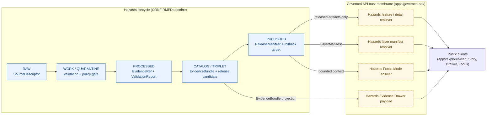
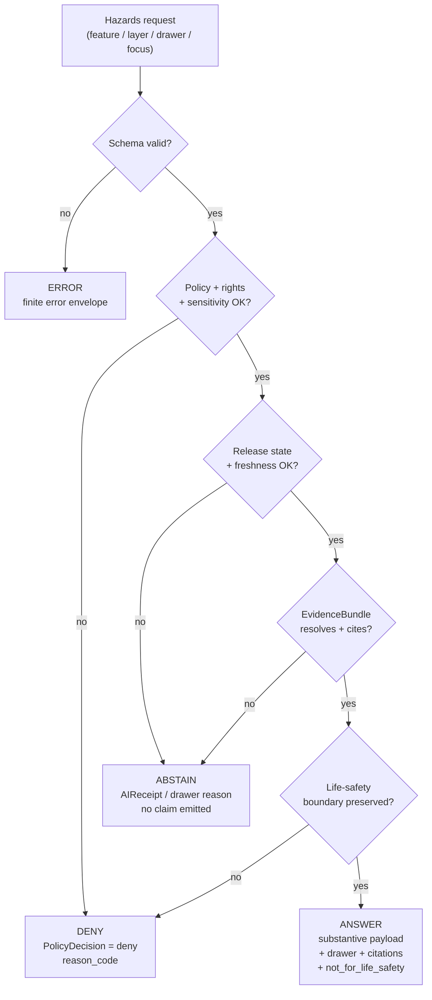

# Hazards · API Contracts

> Governed API surfaces, decision envelopes, and contract shape for the Hazards domain — historical, regulatory, modeled, and operational-context hazard information, **never** emergency alerting.

<!-- [KFM_META_BLOCK_V2]
doc_id: kfm://doc/domains/hazards/api-contracts
title: Hazards · API Contracts
type: standard
version: v2
status: draft
owners: <hazards-domain-steward>, <governed-api-steward>, <security-steward>
created: 2026-05-17
updated: 2026-06-05
policy_label: public
contract_version: "3.0.0"
related:
  - docs/domains/hazards/README.md
  - docs/domains/hazards/SOURCE_REFRESH_RUNBOOK.md
  - docs/architecture/governed-api.md
  - schemas/contracts/v1/hazards/
  - contracts/hazards/
  - policy/domains/hazards/
  - policy/release/hazards/
  - tests/domains/hazards/
  - fixtures/domains/hazards/
  - release/candidates/hazards/
  - control_plane/domain_lane_register.yaml
tags: [kfm, api, contracts, hazards, governance, decision-envelope]
notes:
  # CONTRACT_VERSION = "3.0.0" pinned per ai-build-operating-contract.md v3.0.
  # Route paths, DTO field shapes, and schema files are PROPOSED; not asserted to exist in the mounted repo.
  # KFM is never a life-safety alert authority — every Hazards surface must preserve that boundary.
  # Schema-home segment corrected v1->v2: Atlas Sec 24.13 crosswalk places hazards at
  #   schemas/contracts/v1/hazards/ and contracts/hazards/ (no intervening /domains/ segment).
  #   The /domains/<x>/ form used in v1 is now flagged CONFLICTED pending ADR-S-01 / ADR-0001 confirmation.
  # Pending ADRs: ADR-S-01 (schema home), ADR-S-04 (source-role enum), ADR-S-09 (reviewer SoD),
  #   routing-convention ADR (apps/governed-api/ route shape).
[/KFM_META_BLOCK_V2] -->


**Status:** draft · **Owners:** `<hazards-domain-steward>`, `<governed-api-steward>`, `<security-steward>` · **Last updated:** 2026-06-05 · **`CONTRACT_VERSION = "3.0.0"`**

---

## Contents

- [1. Scope and boundary](#1-scope-and-boundary)
- [2. Lifecycle and trust-membrane context](#2-lifecycle-and-trust-membrane-context)
- [3. Governed API surfaces (registry)](#3-governed-api-surfaces-registry)
- [4. Surface-by-surface contract](#4-surface-by-surface-contract)
  - [4.1 Hazards feature / detail resolver](#41-hazards-feature--detail-resolver)
  - [4.2 Hazards layer manifest resolver](#42-hazards-layer-manifest-resolver)
  - [4.3 Hazards Evidence Drawer payload](#43-hazards-evidence-drawer-payload)
  - [4.4 Hazards Focus Mode answer](#44-hazards-focus-mode-answer)
  - [4.5 Cross-cutting surfaces (Evidence, Correction, Review)](#45-cross-cutting-surfaces-evidence-correction-review)
- [5. Outcome envelopes and semantics](#5-outcome-envelopes-and-semantics)
- [6. Hazards-specific DENY conditions](#6-hazards-specific-deny-conditions)
- [7. Source roles and anti-collapse rules](#7-source-roles-and-anti-collapse-rules)
- [8. Object family ↔ surface map](#8-object-family--surface-map)
- [9. Schema, contract, policy, and test placement](#9-schema-contract-policy-and-test-placement)
- [10. Validators and tests](#10-validators-and-tests)
- [11. Trust-membrane invariants (must / must not)](#11-trust-membrane-invariants-must--must-not)
- [12. Verification backlog and open questions](#12-verification-backlog-and-open-questions)
- [13. Changelog](#13-changelog)
- [14. Related docs](#14-related-docs)
- [Appendix A — Illustrative envelope shapes](#appendix-a--illustrative-envelope-shapes)
- [Appendix B — Truth-label legend](#appendix-b--truth-label-legend)

---

## 1. Scope and boundary

This document specifies the **governed API surfaces** that publish Hazards-domain claims, the **finite decision envelopes** they return, the **DTOs and schemas** those envelopes carry, and the **invariants** that distinguish a Hazards surface from an emergency-alert system.

| Aspect | Claim | Label |
|---|---|---|
| Mission of the Hazards lane | Govern historical, regulatory, modeled, and operational-context hazard information for analysis and resilience. | **CONFIRMED** doctrine. |
| Hard boundary | KFM **must not** act as a life-safety alert authority; operational warning products are contextual only. | **CONFIRMED** doctrine. |
| Public path | Every public Hazards read flows through the governed API trust membrane. | **CONFIRMED** doctrine. |
| Exact route names | Bound at `apps/governed-api/` per Directory Rules responsibility-root law; concrete paths not asserted by this document. | **PROPOSED** / **NEEDS VERIFICATION**. |
| DTO/schema field shapes | Drawn from the Master API Surface Table and the Hazards J-table; field-level shape resides in `schemas/contracts/v1/hazards/` and is not asserted to exist here. | **PROPOSED**. |
| Schema-home segment | Atlas §24.13 crosswalk places hazards at `schemas/contracts/v1/hazards/` (no intervening `/domains/` segment). | **CONFIRMED** crosswalk vs. v1 doc; resolved here, see §9. |

> [!IMPORTANT]
> **KFM is not an emergency alert system.** Hazards surfaces support analysis, history, regulatory context, operational context, and resilience review. Warnings, advisories, watches, and active detections appear **only** as `WarningContext` / `AdvisoryContext` / detection objects with explicit `issue`, `expiry`, `freshness`, `source`, and `not_for_life_safety` markers, and **must** redirect urgent life-safety needs to official sources.

[Back to top](#contents)

---

## 2. Lifecycle and trust-membrane context

Hazards artifacts traverse the KFM lifecycle before any of the surfaces in §3 can return `ANSWER`. The governed API reads the **PUBLISHED** lane via released catalog/manifest objects, never the canonical stores upstream of it.



> [!NOTE]
> The diagram reflects **doctrinal** flow (lifecycle CONFIRMED; membrane CONFIRMED). The specific routes mounted under `apps/governed-api/` are PROPOSED and NEEDS VERIFICATION against the live repo.

[Back to top](#contents)

---

## 3. Governed API surfaces (registry)

The Hazards domain exposes four primary governed surfaces, mirroring the Master API Surface Table specialized for Hazards-specific DTOs. The four-surface set (feature/detail resolver, layer manifest resolver, Evidence Drawer payload, Focus Mode answer) and their outcome sets are **CONFIRMED** from the Hazards J-table; field shapes and routes remain **PROPOSED**. Cross-cutting surfaces (Evidence resolver, Correction submit, Review decision) are domain-agnostic and inherit the master contract.

| # | Surface | DTO / schema (PROPOSED) | Finite outcomes | Status |
|---|---|---|---|---|
| H-API-1 | Hazards feature / detail resolver | `HazardsDecisionEnvelope` (= `DomainFeatureEnvelope` + Hazards-typed payload) | `ANSWER` / `ABSTAIN` / `DENY` / `ERROR` | Surface + outcomes **CONFIRMED** (J-table); route **UNKNOWN**. |
| H-API-2 | Hazards layer manifest resolver | `LayerManifest` (Hazards-scoped) | `ANSWER` / `DENY` / `ERROR` | Surface + outcomes **CONFIRMED**; public-safe release only. |
| H-API-3 | Hazards Evidence Drawer payload | `EvidenceDrawerPayload` + `EvidenceBundle` projection | `ANSWER` / `ABSTAIN` / `DENY` / `ERROR` | Surface + outcomes **CONFIRMED**; evidence- and policy-filtered. |
| H-API-4 | Hazards Focus Mode answer | `RuntimeResponseEnvelope` + `AIReceipt` | `ANSWER` / `ABSTAIN` / `DENY` / `ERROR` | Surface + outcomes **CONFIRMED**; AI is interpretive, not root truth. |
| H-API-X1 | Evidence resolver (cross-cutting) | `EvidenceBundle` | `ANSWER` / `ABSTAIN` / `DENY` / `ERROR` | **PROPOSED** master surface. |
| H-API-X2 | Correction submit (cross-cutting) | `CorrectionNoticeCandidate` | `ACCEPTED` / `DENY` / `ERROR` | **PROPOSED** master surface. |
| H-API-X3 | Review decision (cross-cutting) | `ReviewRecord` | `ALLOW` / `RESTRICT` / `DENY` / `ERROR` | **PROPOSED** master surface. |

[Back to top](#contents)

---

## 4. Surface-by-surface contract

Each surface section captures: **purpose**, **inputs**, **DTO**, **outcome rules**, **negative states**, **schema home**, and **forbidden behavior**. Concrete route paths are deferred to the governed-API architecture doc and an accepted ADR.

### 4.1 Hazards feature / detail resolver

| Field | Value |
|---|---|
| Purpose | Resolve a clicked or queried Hazards feature (by id, layer + feature, or bbox + filter) to a governed claim envelope. |
| Input | Hazards feature reference (layer id + feature id, or canonical id) plus optional temporal scope; access posture from caller context. |
| DTO | `HazardsDecisionEnvelope` — specialization of `DomainFeatureEnvelope` carrying a Hazards-typed feature payload, `evidence_refs[]`, `policy_decision`, `release_state`, `temporal_scope`, and **mandatory** `not_for_life_safety` marker when operational context is involved. **PROPOSED**. |
| Outcomes | `ANSWER` (evidence resolved, policy allows, release state OK, freshness within tolerance) · `ABSTAIN` (evidence insufficient, citation unresolvable, stale operational context with no released alternative) · `DENY` (policy/rights/sensitivity/release-state forbids; operational expiry passed; life-safety-instruction-like request) · `ERROR` (malformed request, schema violation, infra failure). |
| Forbidden | Returning an unreleased candidate as `ANSWER`; exposing internal store identifiers; returning a `WarningContext` past its `expiry` as a current warning; conflating regulatory zones with observed events. |
| Schema home | `schemas/contracts/v1/hazards/...` per Directory Rules responsibility-root law and ADR-0001. **PROPOSED**; **NEEDS VERIFICATION**. |

> [!WARNING]
> **Stale operational state is not a current warning.** A `WarningContext` or `AdvisoryContext` whose `valid_through` / `expiry` time has passed **must** be returned as `ABSTAIN` or `DENY`, with an explicit `freshness: expired` marker and an official-source referral — never as a current warning payload.

### 4.2 Hazards layer manifest resolver

| Field | Value |
|---|---|
| Purpose | Return the released layer manifest for a Hazards layer (hazard event timeline, NFHL flood context, drought map, wildfire/smoke, earthquake, severe weather, heat/cold, exposure analysis, resilience summary, not-for-life-safety official-link mode). |
| Input | Layer identifier. |
| DTO | `LayerManifest` (Hazards-scoped) — includes `layer_id`, `domain: "hazards"`, source refs, source-layer, style refs, time extent, evidence refs, policy state, stale state, public-safe flag, plus a **Hazards life-safety disclaimer field**. **PROPOSED**. |
| Outcomes | `ANSWER` · `DENY` · `ERROR`. **Forbidden:** `ABSTAIN` — a layer either has a `ReleaseManifest` (answer) or does not (deny). |
| Forbidden | Serving a layer that lacks a `ReleaseManifest`; serving `WORK`/`QUARANTINE`/`CATALOG`-only layers to public clients; emitting a Hazards layer without the not-for-life-safety disclaimer field populated. |
| Schema home | `schemas/contracts/v1/runtime/layer_manifest.schema.json` (cross-cutting) with Hazards-scoped policy in `policy/domains/hazards/`. **PROPOSED**. |

### 4.3 Hazards Evidence Drawer payload

| Field | Value |
|---|---|
| Purpose | Project an `EvidenceBundle` (and policy / review / release / correction lineage) into a UI-bounded payload for the Evidence Drawer. |
| Input | Feature reference or `EvidenceRef`. |
| DTO | `EvidenceDrawerPayload` — clicked feature, layer id, `evidence_refs`, policy state, source/citation display, caveats, conflicts, telemetry. **Hazards extension fields**: `source_role`, `issue_time`, `expiry_time`, `freshness_state`, `official_source_referral`, `not_for_life_safety`. **PROPOSED**. |
| Outcomes | `ANSWER` · `ABSTAIN` · `DENY` · `ERROR`. |
| Forbidden | Dropping citation, policy, review, or release state during projection; rendering exact restricted geometry; displaying expired operational context without a `freshness: expired` badge. |
| Schema home | `schemas/contracts/v1/evidence/evidence_drawer_payload.schema.json` (cross-cutting) with Hazards-specific drawer fields documented under `contracts/hazards/`. **PROPOSED**. |

### 4.4 Hazards Focus Mode answer

| Field | Value |
|---|---|
| Purpose | Evidence-bounded synthesis over released Hazards `EvidenceBundle`s — summarize, compare, explain limits, draft steward-review notes — with **AI as interpretive, never root truth**. |
| Input | `FocusModeRequest` carrying a `MapContextEnvelope`, evidence set references, the question, and access posture. |
| DTO | `RuntimeResponseEnvelope` + `AIReceipt` (model/provider, prompt envelope, evidence ids, policy decisions, output outcome, `CitationValidationReport`, runtime metadata). **Hazards extension**: every `ANSWER` must carry the `not_for_life_safety` flag and, when operational context is referenced, an explicit official-source referral. **PROPOSED**. |
| Outcomes | `ANSWER` (every claim cited; policy allows; freshness within tolerance) · `ABSTAIN` (missing evidence, citations cannot be validated, source roles conflict, temporal scope insufficient, user asks for unsupported inference) · `DENY` (policy/rights/sensitivity forbid; emergency-alert replacement attempted; uncited authoritative claim requested) · `ERROR`. |
| Forbidden | Uncited claims; emergency alerting replacement; direct access to RAW/WORK/QUARANTINE; raw model text without `AIReceipt`; collapsing observed/modeled/regulatory roles in the answer. |
| Schema home | `schemas/contracts/v1/focus/...` (cross-cutting) with Hazards focus profile under `policy/domains/hazards/`. **PROPOSED**. |

### 4.5 Cross-cutting surfaces (Evidence, Correction, Review)

The Evidence resolver, Correction submit, and Review decision surfaces are domain-agnostic and inherit their contract from the Master API Surface Table; the Hazards specialization is limited to:

- **Evidence resolver** — Hazards `EvidenceBundle`s must include `source_role`, `issue/expiry/valid` times, and `not_for_life_safety` posture when operational.
- **Correction submit** — Hazards corrections may target a published `HazardEvent`, `WarningContext`, `AdvisoryContext`, `DisasterDeclaration`, or derivative; submissions enter the standard correction lifecycle with `ACCEPTED` / `DENY` / `ERROR`.
- **Review decision** — Hazards review uses the standard `ReviewRecord` with `ALLOW` / `RESTRICT` / `DENY` / `ERROR`; restricted exposure applies when sensitivity or rights demand staged access. Reviewer separation-of-duties on policy-significant Hazards releases is governed by **ADR-S-09** (threshold and tooling pending).

[Back to top](#contents)

---

## 5. Outcome envelopes and semantics

Hazards surfaces use the **finite, governed outcome grammar** that every KFM governed API uses. `DENY` is a first-class outcome, not an error. `HOLD` may apply to promotion/correction flows but is not a runtime read outcome.



| Outcome | When | Required artifacts | Public-surface effect |
|---|---|---|---|
| `ANSWER` | Evidence sufficient, policy permits, release state allows, freshness within tolerance, review state recorded where required. | `EvidenceBundle` resolved; `PolicyDecision = allow`; `ReleaseManifest` applies. | Substantive answer with Evidence Drawer + citations + `not_for_life_safety`. |
| `ABSTAIN` | Evidence insufficient, citation unresolvable, stale operational state without released alternative. | `AIReceipt` / drawer reason; no claim emitted. | Non-substantive note with reason; never invents. |
| `DENY` | Policy/rights/sensitivity/release state forbids; life-safety-instruction-like request; expired warning treated as current. | `PolicyDecision = deny` + reason_code; receipt records denial. | Returns denial reason; offers alternative non-restricted surface where possible (e.g., official-source link). |
| `ERROR` | Cannot evaluate — missing schema, malformed query, contract violation, infrastructure failure. | Error envelope with diagnostic code. | Finite, actionable error; never silently falls through to another lane. |
| `HOLD` *(promotion / correction only)* | Promotion / correction paused pending steward, rights-holder, or policy review. | `ReviewRecord` pending; `PolicyDecision = hold`. | Surface remains in prior state; no silent rollback. |

> [!TIP]
> Treat `DENY` and `ABSTAIN` as **product features**, not failure modes. The Evidence Drawer is designed to render each outcome with its reason, citation set (if any), and an official-source referral where applicable. UI clients must not collapse these into a generic "no result" view.

[Back to top](#contents)

---

## 6. Hazards-specific DENY conditions

These are the failure modes the Hazards governed API **must** treat as `DENY`, regardless of evidence quality. They are derived from CONFIRMED Hazards doctrine and the Master Source-Role Anti-Collapse Register (Atlas §24.1).

| # | Condition | Why it denies | Required guardrail |
|---|---|---|---|
| D-1 | Request seeks emergency-alert behavior, life-safety instruction, or real-time warning replacement. | KFM is not an alert authority. | DENY + official-source referral (NWS, FEMA, state EM) in payload. |
| D-2 | Operational `WarningContext` / `AdvisoryContext` past its `expiry` / `valid_through` and the caller asks for it as current. | Stale operational state must not appear as current warning state. | DENY (or ABSTAIN with `freshness: expired` if a historical view is what was asked for). |
| D-3 | Regulatory zone (e.g., NFHL flood-zone designation) used to assert an observed flood event. | Source-role anti-collapse: regulatory ≠ observed. | DENY publication; separate regulatory-layer and observed-event lanes; banner in UI. |
| D-4 | Modeled product (smoke trajectory, hazard model grid) labeled or queried as an observation. | Source-role anti-collapse: modeled ≠ observed. | DENY at publication; ABSTAIN at AI surface; require model run receipt + uncertainty surface. |
| D-5 | Aggregate (county hazard totals, decadal climate normal) cited as a per-place truth. | Aggregate cell ≠ per-place record. | DENY join from aggregate to single record; aggregation receipt + geometry-scope guard required. |
| D-6 | Candidate record (unmerged quarantined source output) requested on a public surface. | Promotion is a governed state transition. | DENY at trust membrane; route to QUARANTINE; no PUBLISHED edge to WORK/QUARANTINE. |
| D-7 | Synthetic content (reconstruction, AI-drafted summary) presented as observed reality. | Reality-boundary doctrine. | DENY publication; HOLD for steward review; ABSTAIN at AI; Reality Boundary Note + Representation Receipt. |
| D-8 | AI text treated as evidence in a Hazards claim. | Cite-or-abstain rule; `EvidenceBundle` outranks generated language. | DENY publication; ABSTAIN at Focus Mode; `AIReceipt` mandatory. |
| D-9 | Direct read of `data/raw/hazards/`, `data/work/hazards/`, or `data/quarantine/hazards/` from a public client. | Trust-membrane invariant. | DENY at membrane; client must use governed API. |
| D-10 | Request for exact sensitive operational details (e.g., critical-infrastructure exposure precision tied to a hazard) without a steward-approved exposure class. | Critical-infrastructure exposure controls; sensitive lanes fail closed. | DENY (or RESTRICT via review surface) until reviewer + transform receipt (`RedactionReceipt`) exist. |

[Back to top](#contents)

---

## 7. Source roles and anti-collapse rules

Hazards is one of the highest-risk domains for source-role collapse. The governed API **must** preserve the `source_role` of every record through every surface response. The seven roles below are the **canonical** vocabulary from the Master Source-Role Anti-Collapse Register (Atlas §24.1.1); the enum is governed by **ADR-S-04**.

| Role | Hazards example | Allowed downstream role |
|---|---|---|
| **Observed** | USGS earthquake catalog event; NOAA Storm Events report; ground hazard observation; gauge reading used as hazard signal. | May feed modeled or aggregate products; never relabeled as regulatory or administrative. |
| **Regulatory** | FEMA NFHL flood-zone designation; FEMA disaster declaration. | Cite as regulatory context; never as observed event or modeled estimate. |
| **Modeled** | Smoke trajectory model; hazard exposure raster; modeled hydrograph reconstruction. | Cite with model identity, run receipt, and bounds; never as observation. |
| **Aggregate** | County hazard frequency totals; decadal hazard normal. | Cite with aggregation receipt; never as per-place record. |
| **Administrative** | State emergency-management compilation roster. | Cite as administrative context; never as observation or regulation. |
| **Candidate** | Unmerged quarantined detection (e.g., unresolved FIRMS hot-spot). | May appear in WORK/QUARANTINE; **never** in PUBLISHED without promotion. |
| **Synthetic** | AI-drafted summary; reconstructed historical hazard scene. | Carries Reality Boundary Note + Representation Receipt; never queried as observed reality. |

> [!CAUTION]
> **The "operational" feed is a sub-form, not an eighth canonical role.** A NWS warning/advisory/watch feed (active alerts) is admitted with a canonical `source_role` (typically *observed* or *regulatory* depending on the product) **plus** operational freshness windows governed by `policy/domains/hazards/`. It is **not** a new top-level role: the canonical enum remains the seven roles above per Atlas §24.1.1 and ADR-S-04. It is **never** interchangeable with an observation, a regulatory determination, or a model output, and it is **never** published or returned as a life-safety instruction. Whether "operational" warrants a distinct enum value or remains a freshness/policy overlay is **OPEN** pending ADR-S-04.

> [!NOTE]
> Source role is **fixed at admission** (`SourceDescriptor`) and preserved through every promotion. Promotion never upgrades an observation to a regulation, a model to an aggregate, or a candidate to a verified record — those are separate governed transitions with their own evidence and review requirements.

[Back to top](#contents)

---

## 8. Object family ↔ surface map

The Hazards canonical object families (**CONFIRMED** object-family spine from the Hazards encyclopedia chapter; **PROPOSED** implementation) and their primary governed-API surfaces.

| Object family | Feature / detail | Layer manifest | Drawer | Focus | Notes |
|---|:---:|:---:|:---:|:---:|---|
| `HazardEvent` | ✓ | ✓ | ✓ | ✓ | Source role must be preserved across surfaces. |
| `HazardObservation` | ✓ | ✓ | ✓ | ✓ | Observed role; cannot be relabeled regulatory. |
| `WarningContext` | ✓ | ✓ | ✓ | ✓ | Operational; expiry + freshness mandatory. |
| `AdvisoryContext` | ✓ | ✓ | ✓ | ✓ | Operational; expiry + freshness mandatory. |
| `DisasterDeclaration` | ✓ | ✓ | ✓ | ✓ | Regulatory/administrative role. |
| `FloodContext` | ✓ | ✓ | ✓ | ✓ | NFHL is regulatory, **not** observed flood evidence. |
| `WildfireDetection` | ✓ | ✓ | ✓ | ✓ | Detection role; may be candidate until field-confirmed. |
| `SmokeContext` | ✓ | ✓ | ✓ | ✓ | Modeled/detected; not health guidance. |
| `DroughtIndicator` | ✓ | ✓ | ✓ | ✓ | Index/aggregate; role and unit preserved. |
| `EarthquakeEvent` | ✓ | ✓ | ✓ | ✓ | Observed role. |
| `HeatColdEvent` | ✓ | ✓ | ✓ | ✓ | Observation or model — distinguished. |
| `ExposureSummary` | ✓ | ✓ | ✓ | ✓ | Derived; cite inputs. |
| `ResilienceSummary` | ✓ | ✓ | ✓ | ✓ | Derived; cite inputs. |
| `HazardTimeline` | ✓ | ✓ | ✓ | ✓ | Composite; per-event role preserved. |
| `ImpactArea` | ✓ | ✓ | ✓ | ✓ | Spatial scope; sensitivity gated. |

> [!NOTE]
> The first eight families (`HazardEvent` through `SmokeContext`) are explicitly named in the Atlas Cross-Domain Object Index and Hazards §E table as **CONFIRMED** spine. The remaining families (`DroughtIndicator` onward) are **PROPOSED** extensions drawn from the Hazards §E object table and source families; treat their object names as **NEEDS VERIFICATION** against the live encyclopedia chapter.

[Back to top](#contents)

---

## 9. Schema, contract, policy, and test placement

Placement follows Directory Rules: pick exactly one responsibility root, name the lifecycle phase (data only), and treat the **domain as a segment inside** the responsibility root, never as a root.

> [!IMPORTANT]
> **Schema-home segment corrected in v2.** The Atlas §24.13 *Section ↔ Dossier ↔ Responsibility Root Crosswalk* places Hazards at `schemas/contracts/v1/hazards/`, `contracts/hazards/`, and `policy/release/hazards/` — **with no intervening `/domains/` segment**. The v1 edition of this doc used a `schemas/contracts/v1/domains/hazards/` form. This is now treated as **CONFLICTED** (doc-internal drift vs. the crosswalk) and resolved in favor of the crosswalk form below, pending **ADR-S-01 / ADR-0001** confirmation. A `DRIFT_REGISTER.md` entry is required (see §12).

```text
contracts/hazards/                        # semantic meaning (Markdown)        ← Atlas Sec 24.13 crosswalk
schemas/contracts/v1/hazards/             # machine shape (JSON Schema)        ← ADR-0001 canonical
policy/domains/hazards/                   # admissibility, deny, restrict
policy/release/hazards/                   # release-policy lane (Sec 24.13)
tests/domains/hazards/                    # proof of rules
fixtures/domains/hazards/                 # golden / synthetic / invalid samples
data/raw/hazards/                         # immutable source payloads / refs
data/work/hazards/                        # normalization
data/quarantine/hazards/                  # held failures
data/processed/hazards/                   # validated normalized objects
data/catalog/domain/hazards/              # catalog records + EvidenceBundles
data/published/layers/hazards/            # public-safe released artifacts
release/candidates/hazards/               # release decisions, manifests
docs/domains/hazards/                     # this document + adjacent docs
```

> [!NOTE]
> All paths in this section are **PROPOSED** placements per Directory Rules and ADR-0001. **NEEDS VERIFICATION**: actual presence in the mounted repo, the canonical schema root (`schemas/contracts/v1/` vs. legacy `contracts/<domain>/<x>.schema.json` or `jsonschema/`), the `policy/domains/hazards/` vs. `policy/release/hazards/` split, and any drift entries under `docs/registers/DRIFT_REGISTER.md`.

### Per-surface placement (PROPOSED)

| Surface | Contract (.md) | Schema (.json) | Policy | Tests | Fixtures |
|---|---|---|---|---|---|
| Feature / detail resolver | `contracts/hazards/hazards_decision_envelope.md` | `schemas/contracts/v1/hazards/hazards_decision_envelope.schema.json` | `policy/domains/hazards/feature_resolver.rego` | `tests/domains/hazards/feature_resolver/` | `fixtures/domains/hazards/feature_resolver/` |
| Layer manifest resolver | `contracts/runtime/layer_manifest.md` | `schemas/contracts/v1/runtime/layer_manifest.schema.json` | `policy/domains/hazards/layer_manifest.rego` | `tests/domains/hazards/layer_manifest/` | `fixtures/domains/hazards/layer_manifest/` |
| Evidence Drawer payload | `contracts/evidence/evidence_drawer_payload.md` | `schemas/contracts/v1/evidence/evidence_drawer_payload.schema.json` | `policy/domains/hazards/drawer.rego` | `tests/domains/hazards/drawer/` | `fixtures/domains/hazards/drawer/` |
| Focus Mode answer | `contracts/runtime/runtime_response_envelope.md` | `schemas/contracts/v1/focus/runtime_response_envelope.schema.json` | `policy/domains/hazards/focus.rego` | `tests/domains/hazards/focus/` | `fixtures/domains/hazards/focus/` |

[Back to top](#contents)

---

## 10. Validators and tests

The Hazards lane carries the standard cross-cutting test families **plus** Hazards-specific negative paths (source-role anti-collapse, temporal-role, emergency-alert denial, operational expiry/freshness, catalog closure, Evidence Drawer disclaimer, UI no-direct-source — all **PROPOSED** per the Hazards §K validator list). Every row below is **PROPOSED** until the mounted repo confirms presence.

| Test family | Required negative case | Expected outcome |
|---|---|---|
| Schema validation | `HazardsDecisionEnvelope` missing `not_for_life_safety` when operational context present. | `FAIL` (validator) → `DENY` (membrane). |
| Source-role anti-collapse | NFHL polygon returned as an observed flood event. | `DENY`. |
| Source-role anti-collapse | Smoke model field labeled or queried as an observation. | `DENY` at publication; `ABSTAIN` at Focus Mode. |
| Source-role anti-collapse | Aggregate hazard frequency cited as a per-place record. | `DENY` join; aggregation receipt required. |
| Temporal-role validator | `WarningContext` without `issue`, `expiry`, or `freshness_state`. | `FAIL` → `DENY`. |
| Operational expiry / freshness | Expired warning returned as a current warning payload. | `DENY` (or `ABSTAIN` with `freshness: expired` for historical view). |
| Emergency-alert denial | Focus Mode prompt asks for life-safety instruction. | `DENY` + official-source referral. |
| Catalog closure | Published `HazardEvent` missing `EvidenceBundle` or `ReleaseManifest`. | `FAIL` → `DENY`. |
| Evidence Drawer disclaimer | Hazards drawer payload missing `not_for_life_safety` or `official_source_referral` when operational. | `FAIL` → `DENY`. |
| UI no-direct-source | Public client fetches `data/raw/hazards/` or unpublished candidate. | `DENY` at membrane; trust-membrane invariant. |
| Citation validation | Focus Mode answer with uncited claim. | `ABSTAIN`; `AIReceipt` records reason. |
| Release manifest validation | Hazards layer served without `ReleaseManifest`. | `DENY` / `ERROR`. |
| Rollback drill | Rollback target unreachable for a published Hazards release. | `FAIL`; release blocked or rolled back. |
| No-network fixtures | Tests pass without live source fetch. | `PASS` deterministically. |
| Non-regression | Prior-lineage published claims still resolve after schema upgrade. | `PASS`. |

[Back to top](#contents)

---

## 11. Trust-membrane invariants (must / must not)

| ID | Invariant | Source |
|---|---|---|
| HZ-INV-1 | Public reads of Hazards data **must** flow through the governed API. | CONFIRMED — trust-membrane doctrine. |
| HZ-INV-2 | The governed API **must not** serve `RAW` / `WORK` / `QUARANTINE` / `PROCESSED`-only Hazards records as `ANSWER`. | CONFIRMED — lifecycle law. |
| HZ-INV-3 | Every Hazards `ANSWER` **must** carry resolvable `EvidenceRef`s and a citation projection. | CONFIRMED — cite-or-abstain. |
| HZ-INV-4 | Every Hazards surface **must** carry `not_for_life_safety` when operational context is involved, and **must** route urgent life-safety needs to official sources. | CONFIRMED — Hazards boundary. |
| HZ-INV-5 | Source role **must** be preserved through every surface response; the seven canonical roles (observed / regulatory / modeled / aggregate / administrative / candidate / synthetic) are not interchangeable. | CONFIRMED — source-role anti-collapse (Atlas §24.1.1). |
| HZ-INV-6 | Watchers and connectors **must not** publish; they emit candidates and receipts only. | CONFIRMED — watcher-as-non-publisher. |
| HZ-INV-7 | Promotion is a governed state transition, not a file move; release requires `ReleaseManifest`, rollback target, correction path. | CONFIRMED — lifecycle law. |
| HZ-INV-8 | AI surfaces (Focus Mode) **must** emit `AIReceipt` with a finite outcome and `CitationValidationReport`; AI is interpretive, never root truth. | CONFIRMED — governed AI rule. |
| HZ-INV-9 | Expired operational state (`WarningContext`, `AdvisoryContext`) **must not** appear as a current warning. | CONFIRMED — Hazards doctrine. |
| HZ-INV-10 | Sensitive operational details (e.g., critical-infrastructure exposure precision) **must** be restricted, generalized, or staged unless a steward-reviewed exposure class allows public exact release. | CONFIRMED — critical-infrastructure controls; sensitive lanes fail closed. |

[Back to top](#contents)

---

## 12. Verification backlog and open questions

These items remain `NEEDS VERIFICATION` or `OPEN` before promotion from `draft` to `published`.

| Item | Evidence that would settle it | Status |
|---|---|---|
| Schema-home segment: `schemas/contracts/v1/hazards/` (crosswalk) vs. legacy `.../domains/hazards/`. | ADR-S-01 / ADR-0001 reaffirmation; `git ls-tree`-equivalent check; `DRIFT_REGISTER.md` entry for the v1→v2 correction. | **NEEDS VERIFICATION**. |
| Exact governed-API route paths for the four Hazards surfaces. | Mounted `apps/governed-api/src/routes/...`; routing-convention ADR. | **NEEDS VERIFICATION**. |
| Field-level shape of `HazardsDecisionEnvelope` (extension fields beyond `DomainFeatureEnvelope`). | Schema file in `schemas/contracts/v1/hazards/`; contract Markdown under `contracts/hazards/`. | **PROPOSED** / **NEEDS VERIFICATION**. |
| Whether "operational" is a distinct `source_role` enum value or a freshness/policy overlay on observed/regulatory. | ADR-S-04 (source-role vocabulary v1). | **OPEN**. |
| Operational-feed freshness thresholds (NWS, FIRMS, drought monitor) and their policy expression. | `policy/domains/hazards/freshness.rego`; source-descriptor cadence fields. | **NEEDS VERIFICATION**. |
| Official-source referral list (NWS, FEMA, state EM channels) and its placement. | `policy/domains/hazards/referrals.yaml` or equivalent. | **PROPOSED**. |
| Emergency-alert denial test fixtures. | `tests/domains/hazards/focus/emergency_alert_denial/`. | **PROPOSED**. |
| Reviewer separation-of-duties threshold for policy-significant Hazards releases. | ADR-S-09 (reviewer separation-of-duties threshold). | **OPEN**. |
| Whether `Hazards Focus Mode answer` shares its `RuntimeResponseEnvelope` schema with other domains or needs a Hazards-scoped extension. | Schema diff; ADR. | **OPEN**. |
| Whether `not_for_life_safety` is a top-level envelope field or nested under `policy_decision.obligations`. | Schema decision; ADR. | **OPEN**. |
| Object families beyond the eight-family CONFIRMED spine (`DroughtIndicator` onward). | Live Hazards encyclopedia §E object table. | **NEEDS VERIFICATION**. |

### Open questions register

| ID | Question | Owner role | Resolution path |
|---|---|---|---|
| OQ-HAZ-API-01 | Is the canonical Hazards schema home `schemas/contracts/v1/hazards/` (crosswalk) or `.../domains/hazards/`? | governed-api-steward | ADR-S-01 / ADR-0001 check; Directory Rules; repo inspection |
| OQ-HAZ-API-02 | Does "operational" deserve a distinct source-role enum value? | hazards-domain-steward | ADR-S-04 |
| OQ-HAZ-API-03 | Top-level `not_for_life_safety` field vs. `policy_decision.obligations` nesting? | governed-api-steward | Schema decision + ADR |
| OQ-HAZ-API-04 | Routing convention under `apps/governed-api/src/routes/...`? | governed-api-steward | Accepted routing ADR |
| OQ-HAZ-API-05 | Reviewer SoD threshold for sensitive Hazards releases? | security-steward | ADR-S-09 |

[Back to top](#contents)

---

## 13. Changelog

| Change | Type (per contract §37) | Reason |
|---|---|---|
| Corrected schema-home segment from `schemas/contracts/v1/domains/hazards/` to `schemas/contracts/v1/hazards/` (and `contracts/hazards/`, `policy/release/hazards/`). | reconciliation | Atlas §24.13 crosswalk places hazards without an intervening `/domains/` segment; v1 form flagged CONFLICTED. |
| Pinned `CONTRACT_VERSION = "3.0.0"` in meta block, badge row, and header line. | housekeeping | Doctrine-adjacent doc; contract §authority pin requirement. |
| Marked the seven canonical source roles as the authoritative enum; demoted "operational" to a sub-form overlay with an OPEN ADR-S-04 question. | clarification | Atlas §24.1.1 canonical role list; prior text implied an eighth role. |
| Distinguished CONFIRMED surface/outcome sets from PROPOSED field shapes in §3. | clarification | J-table confirms surfaces and outcomes; field shapes remain unverified. |
| Distinguished the eight-family CONFIRMED object spine from PROPOSED extensions in §8. | clarification | Cross-Domain Object Index names only the first eight. |
| Added Open questions register and ADR cross-references (ADR-S-01, ADR-S-04, ADR-S-09). | gap closure | Doctrine-doc companion-section expectation; surfaces decisions for triage. |

> **Backward compatibility.** All §-anchor headings and the `HZ-INV-*` / `D-*` / `H-API-*` identifiers are preserved. The only repo-path change (schema-home segment) is a PROPOSED placement, not a live path, so no live links break; the change is logged for `DRIFT_REGISTER.md`.

[Back to top](#contents)

---

## 14. Related docs

- [`docs/domains/hazards/README.md`](./README.md) — Hazards domain landing page. `TODO` link target.
- [`docs/domains/hazards/SOURCE_REFRESH_RUNBOOK.md`](./SOURCE_REFRESH_RUNBOOK.md) — Source refresh runbook for hazards feeds.
- [`docs/architecture/governed-api.md`](../../architecture/governed-api.md) — Governed API trust membrane and route inventory. `TODO` link target.
- [`docs/architecture/contract-schema-policy-split.md`](../../architecture/contract-schema-policy-split.md) — How `contracts/`, `schemas/`, `policy/`, and `tests/` divide responsibilities. `TODO` link target.
- [`docs/doctrine/lifecycle-law.md`](../../doctrine/lifecycle-law.md) — Lifecycle law (RAW → WORK/QUARANTINE → PROCESSED → CATALOG/TRIPLET → PUBLISHED). `TODO` link target.
- [`docs/doctrine/trust-membrane.md`](../../doctrine/trust-membrane.md) — Trust-membrane doctrine. `TODO` link target.
- [`docs/doctrine/truth-posture.md`](../../doctrine/truth-posture.md) — Cite-or-abstain default. `TODO` link target.
- [`docs/doctrine/directory-rules.md`](../../doctrine/directory-rules.md) — Directory Rules (Domain Placement Law). `TODO` link target.
- [`docs/standards/PROV.md`](../../standards/PROV.md) — W3C PROV-O / PAV provenance profile. *(Filename `PROV.md` vs `PROVENANCE.md` is OPEN per Directory Rules OPEN-DR-01.)*
- [`docs/adr/`](../../adr/) — ADR index (ADR-0001 schema home; ADR-S-01, ADR-S-04, ADR-S-09, routing-convention ADRs pending).
- `schemas/contracts/v1/hazards/` — Hazards JSON Schemas. PROPOSED.
- `contracts/hazards/` — Hazards semantic contracts. PROPOSED.
- `policy/domains/hazards/`, `policy/release/hazards/` — Hazards policy bundles. PROPOSED.
- `tests/domains/hazards/` — Hazards conformance tests. PROPOSED.

[Back to top](#contents)

---

## Appendix A — Illustrative envelope shapes

> [!NOTE]
> These are **illustrative** field sets, not the authoritative schemas. The authoritative shape lives in `schemas/contracts/v1/...`. Field names, enum values, and required-flags here may diverge from the live schema and are subject to ADR. Treat as **PROPOSED**.

<details>
<summary><strong>A.1 — <code>HazardsDecisionEnvelope</code> (PROPOSED, illustrative)</strong></summary>

```jsonc
{
  "object_type": "HazardsDecisionEnvelope",
  "schema_version": "v1",
  "envelope_id": "env-hz-0001",
  "created": "2026-05-17T00:00:00Z",
  "spec_hash": "b3:...",
  "outcome": "ANSWER",                      // ANSWER | ABSTAIN | DENY | ERROR
  "domain": "hazards",
  "feature": {
    "object_type": "HazardEvent",           // HazardEvent | WarningContext | ...
    "feature_id": "haz:event:2026-05-15:gve-001",
    "source_role": "observed",              // observed | regulatory | modeled | aggregate | administrative | candidate | synthetic
    "temporal_scope": {
      "event_time": "2026-05-15T18:42:00Z",
      "valid_from": "2026-05-15T18:42:00Z",
      "valid_to":   "2026-05-15T19:30:00Z",
      "retrieved_at": "2026-05-15T19:35:00Z",
      "released_at":  "2026-05-15T20:10:00Z",
      "freshness_state": "fresh"            // fresh | aging | expired | stale
    },
    "geometry_scope": { "kind": "polygon", "crs": "EPSG:4326", "geometry_ref": "evd:geom:..." }
  },
  "evidence_refs": [
    "evd:bundle:hazards:2026-05-15:gve-001"
  ],
  "policy_decision": {
    "decision": "ALLOW",
    "reasons": [],
    "obligations": [],
    "rights_status": "public",
    "sensitivity": "public"
  },
  "release_state": {
    "release_manifest_ref": "rel:hazards:2026-05-15:r042",
    "rollback_target_ref":  "rel:hazards:2026-05-14:r041"
  },
  "not_for_life_safety": true,
  "official_source_referral": {
    "nws":  "https://api.weather.gov/",
    "fema": "https://www.fema.gov/",
    "state_em": "<state-em-portal-or-null>"
  },
  "citations": [
    {
      "evidence_ref": "evd:bundle:hazards:2026-05-15:gve-001",
      "citation_id":  "cit-001",
      "validation":   "passed"
    }
  ],
  "telemetry": { "request_id": "req-..." }
}
```

</details>

<details>
<summary><strong>A.2 — <code>HazardsDecisionEnvelope</code> on <code>DENY</code> (life-safety boundary)</strong></summary>

```jsonc
{
  "object_type": "HazardsDecisionEnvelope",
  "schema_version": "v1",
  "envelope_id": "env-hz-0002",
  "created": "2026-05-17T00:01:00Z",
  "spec_hash": "b3:...",
  "outcome": "DENY",
  "domain": "hazards",
  "policy_decision": {
    "decision": "DENY",
    "reasons": ["life_safety_boundary", "emergency_alert_replacement_requested"],
    "obligations": ["refer_official_source"],
    "rights_status": "public",
    "sensitivity": "public"
  },
  "not_for_life_safety": true,
  "official_source_referral": {
    "nws":  "https://api.weather.gov/",
    "fema": "https://www.fema.gov/",
    "state_em": "<state-em-portal-or-null>"
  },
  "telemetry": { "request_id": "req-..." }
}
```

</details>

<details>
<summary><strong>A.3 — Focus Mode <code>ABSTAIN</code> on stale operational context</strong></summary>

```jsonc
{
  "object_type": "RuntimeResponseEnvelope",
  "schema_version": "v1",
  "envelope_id": "env-hz-focus-0001",
  "created": "2026-05-17T00:02:00Z",
  "outcome": "ABSTAIN",
  "domain": "hazards",
  "abstain_reason": "stale_operational_context_no_released_alternative",
  "evidence_refs": [],
  "ai_receipt": {
    "object_type": "AIReceipt",
    "provider": "<provider>",
    "model_adapter": "<adapter>",
    "prompt_envelope_ref": "ctx:focus:...",
    "evidence_ids": [],
    "policy_decisions": ["allow_focus_query", "abstain_no_evidence"],
    "citation_validation": { "object_type": "CitationValidationReport", "outcome": "FAIL", "reasons": ["no_evidence"] },
    "outcome": "ABSTAIN"
  },
  "not_for_life_safety": true,
  "official_source_referral": { "nws": "https://api.weather.gov/" }
}
```

</details>

<details>
<summary><strong>A.4 — Layer Manifest <code>DENY</code> when release missing</strong></summary>

```jsonc
{
  "object_type": "LayerManifestEnvelope",
  "schema_version": "v1",
  "envelope_id": "env-hz-layer-0001",
  "created": "2026-05-17T00:03:00Z",
  "outcome": "DENY",
  "domain": "hazards",
  "layer_id": "hazards:nfhl_flood_context",
  "policy_decision": {
    "decision": "DENY",
    "reasons": ["release_manifest_missing"],
    "obligations": []
  }
}
```

</details>

[Back to top](#contents)

---

## Appendix B — Truth-label legend

| Label | Meaning (this document) |
|---|---|
| **CONFIRMED** | Verified this session from attached KFM doctrine documents (Encyclopedia, Domains Culmination Atlas incl. Ch. 24, Directory Rules, Unified Doctrine Synthesis, Connected-Dots Architecture Brief). |
| **PROPOSED** | Design or path not yet verified in the mounted repository; rests on attached doctrine + Directory Rules placement law. |
| **NEEDS VERIFICATION** | Checkable, but not yet checked against the mounted repository in this session. |
| **CONFLICTED** | Sources disagree (e.g., doc-internal schema-home segment vs. Atlas §24.13 crosswalk); resolved here pending ADR. |
| **UNKNOWN** | Not resolvable without further evidence. |
| **OPEN** | Pending an ADR or steward decision. |

[Back to top](#contents)

---

**Related docs:** [Hazards README (TODO)](./README.md) · [Source Refresh Runbook](./SOURCE_REFRESH_RUNBOOK.md) · [Governed API architecture (TODO)](../../architecture/governed-api.md) · [Directory Rules](../../doctrine/directory-rules.md)

**Last updated:** 2026-06-05 · **Doc id:** `kfm://doc/domains/hazards/api-contracts` · **Version:** v2 · **Status:** draft · **`CONTRACT_VERSION = "3.0.0"`**

[↑ Back to top](#contents)
